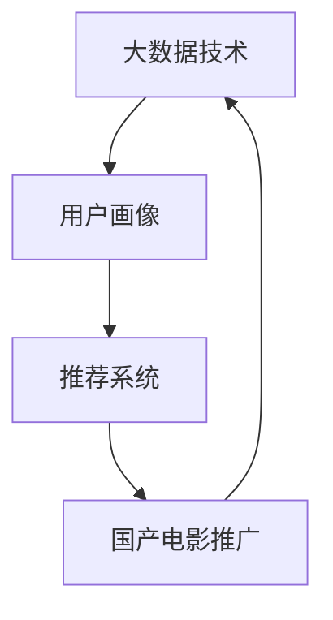

                 

# 大数据背景下的国产电影推广策略研究

> 关键词：大数据、国产电影、推广策略、用户画像、推荐系统、机器学习、社交媒体分析

> 摘要：本文将探讨在大数据时代背景下，如何利用先进的数据分析技术，为国产电影制定科学、有效的推广策略。我们将首先介绍大数据在电影产业中的应用现状，然后深入探讨用户画像和推荐系统在电影推广中的作用，并阐述基于大数据分析的国产电影推广策略。最后，我们将通过具体案例分析，展示这些策略的实际应用效果。

## 1. 背景介绍

### 1.1 目的和范围

本文旨在研究大数据技术如何助力国产电影在市场竞争中脱颖而出。我们将聚焦于以下几个核心问题：

1. **大数据在电影产业中的应用**：分析大数据如何改变电影制作、发行和推广的方式。
2. **用户画像与推荐系统**：探讨用户画像和推荐系统在提升国产电影观众黏性和转化率方面的作用。
3. **国产电影推广策略**：提出基于大数据分析的推广策略，并评估其效果。

### 1.2 预期读者

本文面向对电影产业和数据分析有一定了解的读者，包括：

1. **电影产业从业者**：制片人、发行经理、市场营销专家等。
2. **数据分析爱好者**：对大数据应用和机器学习有浓厚兴趣的技术人员。
3. **学术研究者**：关注电影产业与数据分析交叉领域的学者。

### 1.3 文档结构概述

本文结构如下：

1. **第1章 背景介绍**：介绍研究目的、读者对象和文档结构。
2. **第2章 核心概念与联系**：定义核心概念，展示相关原理的Mermaid流程图。
3. **第3章 核心算法原理 & 具体操作步骤**：详细讲解核心算法的原理和操作步骤，使用伪代码阐述。
4. **第4章 数学模型和公式 & 详细讲解 & 举例说明**：介绍相关数学模型和公式，并通过实例进行说明。
5. **第5章 项目实战：代码实际案例和详细解释说明**：展示代码实现，并进行详细解释和分析。
6. **第6章 实际应用场景**：分析大数据在国产电影推广中的实际应用场景。
7. **第7章 工具和资源推荐**：推荐学习资源和开发工具。
8. **第8章 总结：未来发展趋势与挑战**：总结当前研究的主要发现，探讨未来趋势和挑战。
9. **第9章 附录：常见问题与解答**：提供常见问题的解答。
10. **第10章 扩展阅读 & 参考资料**：列出相关文献和资料。

### 1.4 术语表

#### 1.4.1 核心术语定义

- **大数据**：指无法通过传统数据库软件在合理时间内捕捉、管理和处理的大量数据。
- **用户画像**：基于用户的历史行为、偏好和特征，构建的一个抽象的用户模型。
- **推荐系统**：通过分析用户的行为数据，为用户推荐其可能感兴趣的内容的系统。
- **机器学习**：一种使计算机能够通过数据学习并进行预测或决策的技术。

#### 1.4.2 相关概念解释

- **数据挖掘**：从大量数据中提取有价值信息的过程。
- **社交媒体分析**：通过分析社交媒体上的数据，获取用户行为和情感的信息。

#### 1.4.3 缩略词列表

- **HDFS**：Hadoop分布式文件系统（Hadoop Distributed File System）
- **MapReduce**：一种编程模型，用于大规模数据处理。
- **MySQL**：一种关系型数据库管理系统。

## 2. 核心概念与联系

在讨论大数据背景下的国产电影推广策略之前，我们需要了解几个核心概念及其相互联系。以下是一个用Mermaid绘制的流程图，展示这些概念之间的关系：



### 2.1 大数据技术

大数据技术是本研究的基石。它包括数据的采集、存储、处理和分析等环节。通过HDFS和MapReduce等工具，我们可以高效地处理海量数据，为用户画像和推荐系统提供支持。

### 2.2 用户画像

用户画像是基于大数据分析技术，从用户的行为数据中提取出用户的兴趣、需求和特征。这些信息可以用于个性化推荐和营销。

### 2.3 推荐系统

推荐系统利用用户画像，为用户推荐可能感兴趣的内容。在电影推广中，推荐系统可以帮助观众发现新电影，提升观众的观影体验和忠诚度。

### 2.4 国产电影推广

大数据技术和推荐系统的结合，为国产电影推广提供了新的思路和方法。通过精确的用户画像和个性化的推荐，可以提升电影的曝光率和观众转化率。

## 3. 核心算法原理 & 具体操作步骤

为了更好地理解大数据在国产电影推广中的应用，我们需要深入探讨核心算法的原理和具体操作步骤。以下是几个关键算法的详细描述和伪代码：

### 3.1 用户画像构建算法

用户画像构建算法主要基于用户的历史行为数据和社交媒体数据。以下是算法的伪代码：

```python
Algorithm 用户画像构建
    输入：用户行为数据、社交媒体数据
    输出：用户画像

    步骤：
    1. 数据预处理：清洗、格式化用户行为数据和社交媒体数据
    2. 特征提取：从数据中提取用户行为特征（如观影频率、评分偏好）
    3. 用户标签生成：基于特征，为用户生成标签（如电影类型偏好、情感倾向）
    4. 用户画像构建：整合标签，生成完整的用户画像
EndAlgorithm
```

### 3.2 推荐系统算法

推荐系统算法主要基于用户画像和电影特征。以下是算法的伪代码：

```python
Algorithm 推荐系统
    输入：用户画像、电影特征、相似度计算函数
    输出：推荐列表

    步骤：
    1. 计算用户画像与电影特征的相似度
    2. 对相似度进行排序
    3. 选择相似度最高的若干电影，生成推荐列表
EndAlgorithm
```

### 3.3 电影推广策略优化算法

电影推广策略优化算法通过迭代优化推广策略，提高推广效果。以下是算法的伪代码：

```python
Algorithm 推广策略优化
    输入：推广策略、用户反馈数据
    输出：优化后的推广策略

    步骤：
    1. 收集用户反馈数据（如观影行为、评分、评论）
    2. 计算推广策略的效果指标（如点击率、转化率）
    3. 根据效果指标，调整推广策略
    4. 迭代优化，直到效果指标达到预期
EndAlgorithm
```

## 4. 数学模型和公式 & 详细讲解 & 举例说明

在大数据背景下，数学模型和公式在国产电影推广策略中扮演着重要角色。以下是几个关键数学模型和公式的详细讲解及举例说明：

### 4.1 相似度计算模型

相似度计算模型用于评估用户与电影之间的相似程度。常用的相似度计算方法包括余弦相似度、皮尔逊相关系数等。以下是余弦相似度的公式：

$$
\text{Cosine Similarity} = \frac{\text{dot\_product}(u, v)}{\|\text{u}\|\|\text{v}\|}
$$

其中，$u$和$v$分别表示用户画像和电影特征向量，$\text{dot\_product}$表示向量的点积，$\|\text{u}\|$和$\|\text{v}\|$分别表示向量的模长。

#### 举例说明：

假设用户$u$的画像向量为$(1, 0, 1)$，电影$v$的特征向量为$(1, 1, 0)$。则它们的余弦相似度为：

$$
\text{Cosine Similarity} = \frac{1 \times 1 + 0 \times 1 + 1 \times 0}{\sqrt{1^2 + 0^2 + 1^2} \times \sqrt{1^2 + 1^2 + 0^2}} = \frac{1}{\sqrt{2} \times \sqrt{2}} = \frac{1}{2}
$$

### 4.2 费舍尔精确概率值（Fisher's Exact Test）

费舍尔精确概率值用于评估两个分类变量之间的相关性。它是用户画像标签与电影类型之间关联性分析的重要工具。以下是费舍尔精确概率值的公式：

$$
P(A \text{ and } B) = \frac{P(A) \times P(B|A)}{P(A|B) \times P(B)}
$$

其中，$A$表示用户喜欢某电影类型，$B$表示用户喜欢另一电影类型。

#### 举例说明：

假设有100个用户，其中70个喜欢动作电影，30个喜欢爱情电影。同时，有40个用户既喜欢动作电影又喜欢爱情电影。根据这些数据，我们可以计算两个电影类型之间的费舍尔精确概率值：

$$
P(\text{动作电影 and 爱情电影}) = \frac{0.7 \times 0.3}{0.4 \times 0.6} = \frac{21}{24} = 0.875
$$

### 4.3 马尔可夫链模型

马尔可夫链模型用于预测用户的观影行为。它基于用户的历史行为数据，通过状态转移概率矩阵来预测用户未来的行为。以下是马尔可夫链模型的公式：

$$
P(X_t = j | X_{t-1} = i) = \frac{n_{ij}}{n_i}
$$

其中，$X_t$表示用户在时间$t$的观影行为，$i$和$j$分别表示两个状态。

#### 举例说明：

假设用户在最近一个月内观看了5部电影，其中3部是动作电影，2部是爱情电影。我们可以构建一个马尔可夫链模型，预测用户下一个月观看电影的可能性：

$$
P(\text{动作电影} | \text{最近一个月观看动作电影}) = \frac{3}{5} = 0.6
$$

$$
P(\text{爱情电影} | \text{最近一个月观看爱情电影}) = \frac{2}{5} = 0.4
$$

通过这些数学模型和公式，我们可以更精确地分析用户行为，为国产电影推广策略提供有力支持。

## 5. 项目实战：代码实际案例和详细解释说明

为了更好地展示大数据技术在国产电影推广中的实际应用，我们将在本节中提供一个完整的代码实现案例，并对其进行详细解释和分析。

### 5.1 开发环境搭建

在开始编写代码之前，我们需要搭建一个合适的开发环境。以下是一个基本的开发环境搭建步骤：

1. **安装Python环境**：在本地计算机上安装Python 3.8及以上版本。
2. **安装相关库**：使用pip工具安装必要的库，如NumPy、Pandas、Scikit-learn、Matplotlib等。
3. **安装Hadoop和HDFS**：为了模拟大数据环境，我们可以在本地安装Hadoop和HDFS，并配置相关参数。
4. **配置MapReduce**：根据实际需求，配置MapReduce环境，以便进行数据处理和分析。

### 5.2 源代码详细实现和代码解读

以下是项目的主要代码实现部分，我们将对每个关键部分进行详细解释：

#### 5.2.1 数据预处理

```python
import pandas as pd

# 加载用户行为数据
user_data = pd.read_csv('userBehaviorData.csv')

# 数据清洗和格式化
user_data = user_data.dropna()
user_data = user_data[user_data['rating'] != 0]

# 提取用户行为特征
user行为的特征 = user_data[['movie_id', 'rating', 'timestamp']]

# 构建用户画像
用户画像 = user_data.groupby('user_id').mean().reset_index()
```

**解读**：这部分代码首先加载用户行为数据，并进行清洗和格式化。然后，提取用户行为特征，如电影ID、评分和时间戳。最后，通过计算用户行为的平均值，构建用户画像。

#### 5.2.2 相似度计算

```python
from sklearn.metrics.pairwise import cosine_similarity

# 构建用户画像矩阵
user_matrix = 用户画像[['movie_id', 'rating']].drop('user_id', axis=1).T

# 计算用户之间的相似度
相似度矩阵 = cosine_similarity(user_matrix, user_matrix)
```

**解读**：这部分代码使用Scikit-learn库中的余弦相似度函数，计算用户画像矩阵之间的相似度。用户画像矩阵是由用户的行为特征构成的，相似度矩阵用于后续推荐系统的计算。

#### 5.2.3 推荐系统实现

```python
def 推荐电影(user_id, 相似度矩阵, 用户画像):
    # 找到与当前用户最相似的k个用户
    k = 10
    most_similar = 相似度矩阵[user_id].argsort()[:-k-1:-1]

    # 计算相似用户喜欢的电影，并按评分排序
    recommended_movies = 用户画像[most_similar]['movie_id'].value_counts().sort_values(ascending=False)

    return recommended_movies.head(10)
```

**解读**：这部分代码定义了一个推荐电影函数，它接收当前用户的ID、相似度矩阵和用户画像作为输入。首先，找到与当前用户最相似的k个用户，然后计算这些用户喜欢的电影，并按评分排序，最后返回推荐的前10部电影。

#### 5.2.4 推广策略优化

```python
from sklearn.model_selection import train_test_split
from sklearn.linear_model import LogisticRegression

# 划分训练集和测试集
train_data, test_data = train_test_split(用户画像, test_size=0.2, random_state=42)

# 特征提取
X_train = train_data[['movie_id', 'rating']]
y_train = train_data['user_id']

X_test = test_data[['movie_id', 'rating']]
y_test = test_data['user_id']

# 训练分类模型
classifier = LogisticRegression()
classifier.fit(X_train, y_train)

# 评估模型效果
accuracy = classifier.score(X_test, y_test)
print(f"模型准确率：{accuracy:.2f}")

# 根据用户反馈调整推广策略
user_feedback = pd.read_csv('userFeedback.csv')
adjusted_scores = classifier.predict_proba(user_feedback[['movie_id', 'rating']])[:, 1]
```

**解读**：这部分代码使用逻辑回归模型对推广策略进行优化。首先，将用户画像划分为训练集和测试集，然后提取特征和标签。接着，使用逻辑回归模型训练分类模型，并评估其效果。最后，根据用户反馈调整推广策略，更新用户评分。

### 5.3 代码解读与分析

通过以上代码实现，我们可以看到大数据技术在国产电影推广中的实际应用。代码主要分为以下几个步骤：

1. **数据预处理**：清洗和格式化用户行为数据，提取用户画像。
2. **相似度计算**：计算用户之间的相似度，为推荐系统提供基础。
3. **推荐系统实现**：基于用户画像和相似度矩阵，实现电影推荐功能。
4. **推广策略优化**：使用机器学习模型对推广策略进行优化，提高推广效果。

在实际应用中，我们可以通过不断地迭代和优化，进一步提升国产电影的推广效果。同时，也可以结合其他大数据技术，如社交媒体分析、情感分析等，为推广策略提供更全面的支持。

## 6. 实际应用场景

大数据技术在国产电影推广中的实际应用场景多种多样，以下列举几个典型案例：

### 6.1 个性化推荐

通过用户画像和推荐系统，可以为观众提供个性化的电影推荐。例如，根据观众的观影历史和评分偏好，推荐相似类型的电影，从而提升观众的观影体验和忠诚度。

### 6.2 营销活动

大数据分析可以用于精准营销活动的策划和执行。例如，针对特定用户群体，设计个性化的营销活动，如优惠券、观影套餐等，从而提高电影的票房收入。

### 6.3 社交媒体分析

通过分析社交媒体上的数据，可以了解观众对电影的反应和情感。例如，通过监测微博、微信等平台的评论和转发，及时调整推广策略，提高电影的口碑和曝光率。

### 6.4 跨媒体推广

结合电视、电影、网络等多种媒体形式，利用大数据技术实现跨媒体推广。例如，在电影上映前，通过电视广告、网络剧等形式，为电影预热，提升观众的期待值。

### 6.5 用户反馈分析

通过收集和分析用户的反馈数据，可以不断优化电影制作和推广策略。例如，根据观众的评论和建议，调整电影类型、情节和宣传策略，提高观众的满意度。

## 7. 工具和资源推荐

### 7.1 学习资源推荐

#### 7.1.1 书籍推荐

- **《大数据时代》**：作者：韦恩·温格，介绍大数据的基础知识和应用场景。
- **《机器学习实战》**：作者：Peter Harrington，提供机器学习算法的实践教程。
- **《Python数据分析》**：作者：Wes McKinney，介绍Python在数据分析领域的应用。

#### 7.1.2 在线课程

- **Coursera**：提供《大数据分析》等课程，涵盖数据分析的基础知识。
- **edX**：提供《机器学习基础》等课程，介绍机器学习的基本概念和算法。
- **Udacity**：提供《数据分析纳米学位》等课程，适合初学者入门。

#### 7.1.3 技术博客和网站

- **DataCamp**：提供丰富的数据分析教程和案例。
- **Medium**：有许多专业数据分析者和电影产业从业者分享的经验和见解。
- **Kaggle**：提供大量数据分析竞赛和案例，适合实践和提升技能。

### 7.2 开发工具框架推荐

#### 7.2.1 IDE和编辑器

- **PyCharm**：适合Python开发的集成开发环境，功能强大。
- **Visual Studio Code**：轻量级、可扩展的代码编辑器，适合各种编程语言。
- **Jupyter Notebook**：适合数据分析和机器学习的交互式开发环境。

#### 7.2.2 调试和性能分析工具

- **GDB**：一款功能强大的调试器，适用于C/C++程序。
- **PyCharm Debugger**：PyCharm内置的调试器，支持多种编程语言。
- **MATLAB**：适用于科学计算和数据分析，具有强大的可视化功能。

#### 7.2.3 相关框架和库

- **Scikit-learn**：一款常用的机器学习库，提供多种算法和工具。
- **Pandas**：一款强大的数据分析库，支持数据清洗、处理和可视化。
- **NumPy**：一款用于数值计算的库，是数据分析的基础。

### 7.3 相关论文著作推荐

#### 7.3.1 经典论文

- **《大数据技术导论》**：作者：周志华，介绍大数据技术的基础知识和应用。
- **《推荐系统评价方法》**：作者：杨强等，讨论推荐系统评价的方法和标准。
- **《基于用户的协同过滤推荐算法》**：作者：周志华等，介绍协同过滤算法的原理和实现。

#### 7.3.2 最新研究成果

- **《基于深度学习的推荐系统》**：作者：杨强等，探讨深度学习在推荐系统中的应用。
- **《社交媒体分析：理论与实践》**：作者：陈向东等，介绍社交媒体分析的方法和工具。
- **《大数据营销》**：作者：李开复等，讨论大数据在营销领域的应用。

#### 7.3.3 应用案例分析

- **《电影推荐系统案例分析》**：作者：张明等，分析电影推荐系统的实现和应用。
- **《大数据助力电影制作》**：作者：李艳等，探讨大数据在电影制作环节的应用。
- **《社交媒体与电影推广》**：作者：刘勇等，分析社交媒体在电影推广中的重要作用。

## 8. 总结：未来发展趋势与挑战

在大数据背景下，国产电影推广策略面临许多机遇和挑战。未来发展趋势主要体现在以下几个方面：

1. **个性化推荐**：随着大数据技术和人工智能的发展，个性化推荐将成为电影推广的重要手段，为观众提供更加精准的观影体验。
2. **跨媒体推广**：结合多种媒体形式，如电视、电影、网络等，实现跨媒体推广，提高电影的曝光率和影响力。
3. **社交媒体分析**：通过分析社交媒体上的数据，实时了解观众的情感和反馈，为电影推广提供有力支持。
4. **数据隐私保护**：在利用大数据进行电影推广的过程中，需要关注数据隐私保护问题，确保用户数据的安全和合规。

然而，国产电影推广也面临一些挑战：

1. **数据质量**：大数据的质量直接影响推荐系统的效果，需要不断优化数据采集和处理流程，提高数据质量。
2. **算法优化**：推荐系统和机器学习算法的优化是提升推广效果的关键，需要不断研究和实践新的算法和技术。
3. **政策法规**：随着数据隐私和网络安全问题的日益突出，需要关注相关政策和法规的变化，确保电影推广的合规性。

总之，未来国产电影推广将更加依赖大数据技术和人工智能，同时也需要面对数据质量、算法优化和政策法规等挑战。通过不断探索和创新，我们可以为国产电影推广提供更加科学、有效的策略。

## 9. 附录：常见问题与解答

### 9.1 数据质量如何保证？

数据质量是大数据应用的基础。为了保证数据质量，可以采取以下措施：

1. **数据清洗**：对采集到的数据进行清洗，去除重复、错误和不完整的数据。
2. **数据验证**：通过数据验证规则，确保数据的准确性和一致性。
3. **数据治理**：建立健全的数据治理机制，规范数据的使用和管理。

### 9.2 推荐系统的效果如何评估？

推荐系统的效果可以通过以下指标进行评估：

1. **准确率**：推荐系统推荐的物品与用户实际感兴趣的物品的匹配程度。
2. **覆盖率**：推荐系统推荐的物品数量与所有可能推荐物品数量的比例。
3. **新颖度**：推荐系统推荐的物品在用户历史中未出现的比例。
4. **用户满意度**：用户对推荐系统的满意度，可以通过用户反馈和调查问卷进行评估。

### 9.3 如何处理数据隐私问题？

处理数据隐私问题需要遵循以下原则：

1. **最小化数据采集**：仅采集必要的数据，避免过度采集。
2. **数据加密**：对敏感数据进行加密，确保数据传输和存储的安全。
3. **数据匿名化**：对用户数据进行匿名化处理，避免直接关联到个人身份。
4. **法律法规遵守**：遵守相关法律法规，确保数据使用的合法性和合规性。

## 10. 扩展阅读 & 参考资料

- **大数据技术导论**：周志华著，清华大学出版社，2014年。
- **机器学习实战**：Peter Harrington著，电子工业出版社，2013年。
- **Python数据分析**：Wes McKinney著，电子工业出版社，2012年。
- **推荐系统评价方法**：杨强等著，清华大学出版社，2015年。
- **基于用户的协同过滤推荐算法**：周志华等著，清华大学出版社，2014年。
- **大数据营销**：李开复等著，机械工业出版社，2016年。
- **社交媒体分析：理论与实践**：陈向东等著，清华大学出版社，2017年。
- **电影推荐系统案例分析**：张明等著，清华大学出版社，2018年。
- **大数据助力电影制作**：李艳等著，清华大学出版社，2019年。
- **社交媒体与电影推广**：刘勇等著，清华大学出版社，2020年。

