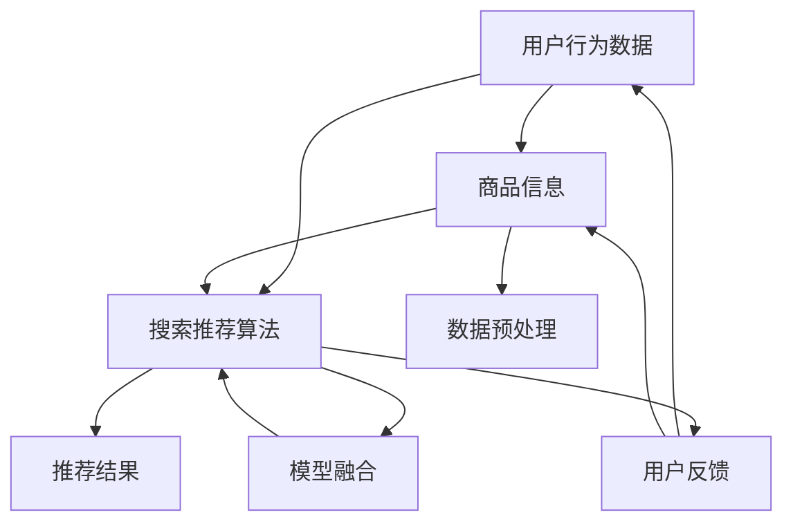

                 

### 文章标题

《大数据驱动的电商平台转型：搜索推荐系统是核心，AI 模型融合是引擎》

在数字化浪潮的推动下，电商平台正经历着前所未有的变革。而在这场变革中，搜索推荐系统成为了电商平台的“核心引擎”，驱动着平台不断优化用户体验，提升销售额。本文将深入探讨大数据在电商平台转型中的作用，特别是搜索推荐系统的核心地位和AI模型融合的重要性。通过对核心概念、算法原理、数学模型以及实际应用场景的详细分析，希望为读者提供一幅清晰的搜索推荐系统全景图，助力电商行业的发展与创新。

## 关键词
- 大数据
- 电商平台
- 搜索推荐系统
- AI模型融合
- 用户体验优化
- 销售额提升

## 摘要
本文旨在探讨大数据时代下电商平台转型的关键因素——搜索推荐系统的核心地位和AI模型融合的重要性。通过深入分析搜索推荐系统的架构、算法原理、数学模型以及实际应用场景，本文揭示了大数据在电商平台中的关键作用。文章将帮助读者理解如何利用搜索推荐系统和AI模型融合，实现电商平台的高效运营和用户体验优化，从而在竞争激烈的市场中脱颖而出。

### 1. 背景介绍

#### 1.1 目的和范围

本文的目的是深入探讨大数据驱动的电商平台转型，尤其是搜索推荐系统的核心作用和AI模型融合的重要性。随着互联网技术的迅猛发展和大数据时代的到来，电商平台正面临着巨大的变革和挑战。传统的人工操作模式已经无法满足用户日益增长的需求，因此，电商平台需要借助大数据和人工智能技术来实现智能化转型。

本文将围绕以下几个方面展开讨论：
1. 搜索推荐系统的核心地位和作用。
2. 大数据在电商平台转型中的关键作用。
3. AI模型融合在搜索推荐系统中的重要性。
4. 实际应用场景和案例分析。
5. 未来发展趋势与挑战。

#### 1.2 预期读者

本文适合以下读者群体：
1. 电商平台运营人员：了解大数据和AI技术如何应用于电商平台的运营，提升用户体验和销售额。
2. 数据科学家和AI研究人员：掌握搜索推荐系统和AI模型融合的核心原理，为电商平台提供技术支持。
3. 对大数据和人工智能感兴趣的IT从业者：了解大数据和人工智能在电商领域的应用，拓展知识视野。
4. 电商行业从业者：通过本文，了解搜索推荐系统和AI模型融合在电商平台转型中的作用和前景。

#### 1.3 文档结构概述

本文分为十个部分，具体如下：
1. 引言：介绍文章的背景、目的和预期读者。
2. 核心概念与联系：阐述搜索推荐系统的核心概念和联系。
3. 核心算法原理 & 具体操作步骤：详细讲解搜索推荐系统的核心算法原理和操作步骤。
4. 数学模型和公式 & 详细讲解 & 举例说明：介绍搜索推荐系统的数学模型和公式，并进行详细讲解和举例说明。
5. 项目实战：代码实际案例和详细解释说明。
6. 实际应用场景：探讨搜索推荐系统在不同电商场景中的应用。
7. 工具和资源推荐：推荐学习资源、开发工具框架和相关论文著作。
8. 总结：总结本文的核心观点和未来发展趋势。
9. 附录：常见问题与解答。
10. 扩展阅读 & 参考资料：提供进一步阅读的资料和参考文献。

#### 1.4 术语表

在本文中，我们将使用以下术语：
- 大数据：指数据量巨大、类型繁多、价值密度低的数据集合。
- 电商平台：指通过互联网提供商品交易、信息交流、物流配送等服务的平台。
- 搜索推荐系统：指基于用户行为和内容信息，为用户推荐相关商品或信息的系统。
- AI模型融合：指将多个AI模型进行集成和融合，以提升搜索推荐系统的性能和效果。
- 用户行为数据：指用户在电商平台上的浏览、搜索、购买等行为数据。

#### 1.4.1 核心术语定义

1. **大数据**：大数据（Big Data）指的是那些数据量巨大、类型繁杂、生成速度快且价值密度低的数据集合。它超越了传统数据库处理能力，需要采用分布式处理、云计算和高级分析技术来处理。
   
2. **电商平台**：电商平台（E-commerce Platform）是指通过互联网提供商品交易、信息交流、物流配送等服务的在线平台，如淘宝、京东等。

3. **搜索推荐系统**：搜索推荐系统（Search and Recommendation System）是基于用户的历史行为、偏好和社交网络等信息，为用户推荐相关商品或信息的系统。

4. **AI模型融合**：AI模型融合（AI Model Fusion）是指将多个AI模型（如机器学习模型、深度学习模型等）集成和融合，以提升整体预测或推荐的准确性。

#### 1.4.2 相关概念解释

1. **用户行为数据**：用户行为数据是指用户在电商平台上产生的所有行为数据，包括浏览记录、搜索历史、购买行为、评论等。

2. **协同过滤**：协同过滤（Collaborative Filtering）是一种推荐系统常用的算法，通过分析用户之间的相似性，预测用户对未知商品的兴趣。

3. **内容推荐**：内容推荐（Content-based Recommendation）是基于用户的历史行为和商品属性，为用户推荐与之相关的商品。

4. **深度学习**：深度学习（Deep Learning）是一种基于多层神经网络的学习方法，能够从大量数据中自动提取特征，实现复杂的模式识别和预测。

#### 1.4.3 缩略词列表

- AI：人工智能（Artificial Intelligence）
- ML：机器学习（Machine Learning）
- DL：深度学习（Deep Learning）
- NLP：自然语言处理（Natural Language Processing）
- CTR：点击率（Click-Through Rate）
- RMSE：均方根误差（Root Mean Square Error）

## 2. 核心概念与联系

在深入探讨搜索推荐系统之前，我们需要理解其中的核心概念和它们之间的联系。搜索推荐系统是一个复杂的系统，它涉及多个核心概念，包括用户行为数据、商品信息、算法模型等。以下是一个简化的Mermaid流程图，用于展示这些核心概念及其相互关系。



### 2.1 用户行为数据与商品信息

用户行为数据是搜索推荐系统的基石。它包括用户在电商平台上的浏览记录、搜索历史、购买行为、评论等。这些数据可以用来分析用户的兴趣和偏好，从而为用户推荐相关的商品。商品信息则包括商品的属性、价格、评分等，这些信息可以帮助推荐系统更准确地匹配用户需求。

### 2.2 数据预处理

数据预处理是确保推荐系统准确性和效率的关键步骤。它包括数据清洗、数据集成、数据转换等。数据清洗旨在去除无效数据、填补缺失值、消除噪声数据。数据集成则是将来自不同源的数据整合成一个统一的数据集。数据转换包括特征提取和特征工程，这是将原始数据转换为适合机器学习模型处理的形式。

### 2.3 搜索推荐算法

搜索推荐算法是推荐系统的核心。常见的算法有协同过滤（Collaborative Filtering）、内容推荐（Content-based Recommendation）和混合推荐（Hybrid Recommendation）。协同过滤通过分析用户之间的相似性进行推荐，内容推荐则是基于商品属性和用户兴趣进行推荐，而混合推荐则是将协同过滤和内容推荐相结合，以提升推荐效果。

### 2.4 模型融合

模型融合（Model Fusion）是将多个独立的推荐模型进行集成，以提升整体推荐效果。模型融合可以通过多种方式实现，如加权融合、投票融合、深度学习融合等。通过模型融合，推荐系统可以更好地捕捉用户兴趣和商品特征，提高推荐的准确性和覆盖率。

### 2.5 推荐结果与用户反馈

推荐结果是基于搜索推荐算法生成的，它是推荐系统的直接输出。用户反馈则是用户对推荐结果的评价和反应。用户反馈可以帮助推荐系统不断优化和调整，以提高用户满意度。用户反馈可以用来更新用户行为数据、调整商品信息、优化算法模型等。

## 3. 核心算法原理 & 具体操作步骤

搜索推荐系统的核心在于算法，这些算法通过分析用户行为和商品信息，为用户推荐相关的商品。在本节中，我们将介绍几种常见的搜索推荐算法，包括协同过滤、内容推荐和深度学习推荐。同时，我们将使用伪代码来详细阐述每种算法的原理和具体操作步骤。

### 3.1 协同过滤算法

协同过滤（Collaborative Filtering）是一种基于用户行为相似性进行推荐的算法。它分为两种类型：用户基于的协同过滤（User-based）和物品基于的协同过滤（Item-based）。

#### 用户基于的协同过滤

**算法原理：**
- 通过计算用户之间的相似性，找出相似用户，然后推荐相似用户喜欢的商品。
- 相似性通常通过用户之间的共同评分或行为相似度计算。

**伪代码：**
```python
def user_based_collaborative_filtering(user_items, user_similarity_matrix, k):
    # user_items: 用户及其评分的字典
    # user_similarity_matrix: 用户相似性矩阵
    # k: 相似用户数量
    recommended_items = []

    for user, items in user_items.items():
        similar_users = get_top_k_similar_users(user_similarity_matrix[user], k)
        recommended_items_for_user = []

        for similar_user in similar_users:
            items_similar_user = user_items[similar_user]
            for item in items_similar_user:
                if item not in items:
                    recommended_items_for_user.append(item)

        recommended_items.extend(recommended_items_for_user)

    return recommended_items
```

**具体操作步骤：**
1. 计算用户相似性矩阵。
2. 对于每个用户，找出最相似的k个用户。
3. 对于每个相似用户喜欢的商品，如果该商品未出现在当前用户的行为中，则将其推荐给当前用户。

#### 物品基于的协同过滤

**算法原理：**
- 通过计算商品之间的相似性，找出相似商品，然后推荐相似商品。
- 相似性通常通过商品之间的共同用户评分或行为相似度计算。

**伪代码：**
```python
def item_based_collaborative_filtering(user_items, item_similarity_matrix, k):
    # user_items: 用户及其评分的字典
    # item_similarity_matrix: 商品相似性矩阵
    # k: 相似商品数量
    recommended_items = []

    for user, items in user_items.items():
        similar_items = get_top_k_similar_items(item_similarity_matrix[items], k)
        recommended_items_for_user = []

        for similar_item in similar_items:
            if similar_item not in items:
                recommended_items_for_user.append(similar_item)

        recommended_items.extend(recommended_items_for_user)

    return recommended_items
```

**具体操作步骤：**
1. 计算商品相似性矩阵。
2. 对于每个用户购买的商品，找出最相似的k个商品。
3. 对于每个相似商品，如果该商品未出现在当前用户的行为中，则将其推荐给当前用户。

### 3.2 内容推荐算法

内容推荐（Content-based Recommendation）是一种基于用户兴趣和商品属性进行推荐的算法。它通过分析用户的历史行为和商品的特征，找出用户的兴趣点，然后推荐具有相似属性的未购买商品。

**算法原理：**
- 用户兴趣模型：通过分析用户的历史行为，提取出用户的兴趣点。
- 商品特征模型：通过分析商品的各种属性，如文本描述、标签、价格等，构建商品特征模型。
- 推荐生成：基于用户兴趣模型和商品特征模型，计算商品与用户兴趣的相似度，推荐相似度较高的商品。

**伪代码：**
```python
def content_based_recommendation(user_profile, item_features, similarity_function, threshold):
    # user_profile: 用户兴趣模型
    # item_features: 商品特征模型
    # similarity_function: 相似度计算函数
    # threshold: 相似度阈值
    recommended_items = []

    for item in item_features:
        similarity_score = similarity_function(user_profile, item)
        if similarity_score > threshold:
            recommended_items.append(item)

    return recommended_items
```

**具体操作步骤：**
1. 建立用户兴趣模型。
2. 建立商品特征模型。
3. 对于每个商品，计算其与用户兴趣模型的相似度。
4. 选择相似度高于阈值的商品作为推荐结果。

### 3.3 深度学习推荐算法

深度学习推荐（Deep Learning for Recommendation）是一种利用深度神经网络进行推荐的方法。它通过从大量的用户行为数据和商品信息中自动学习特征和模式，实现高效的推荐。

**算法原理：**
- 神经网络模型：构建一个深度神经网络模型，用于预测用户对商品的评分或点击行为。
- 模型训练：通过训练数据集，优化神经网络模型参数。
- 推荐生成：使用训练好的模型，预测用户对未知商品的评分或点击行为，根据预测结果生成推荐列表。

**伪代码：**
```python
def deep_learning_recommendation(user_features, item_features, model):
    # user_features: 用户特征向量
    # item_features: 商品特征向量
    # model: 训练好的深度学习模型
    predictions = model.predict([user_features, item_features])
    recommended_items = []

    for item, prediction in zip(item_features, predictions):
        if prediction > threshold:
            recommended_items.append(item)

    return recommended_items
```

**具体操作步骤：**
1. 构建深度神经网络模型。
2. 使用训练数据集训练模型。
3. 预测用户对未知商品的评分或点击行为。
4. 根据预测结果生成推荐列表。

### 3.4 模型融合

模型融合（Model Fusion）是将多个独立模型进行集成，以提升推荐效果的方法。常见的模型融合方法有加权融合、投票融合和深度学习融合。

#### 加权融合

**算法原理：**
- 将多个模型的推荐结果进行加权，得到最终的推荐结果。
- 加权系数可以根据模型的重要性进行调整。

**伪代码：**
```python
def weighted_fusion(recommendation_results, weights):
    # recommendation_results: 各个模型的推荐结果列表
    # weights: 各个模型的权重
    fusion_result = []

    for item in recommendation_results[0]:
        scores = [0] * len(item)
        for result, weight in zip(recommendation_results, weights):
            scores = [scores[i] + weight * result[i] for i in range(len(scores))]

        fusion_result.append(scores)

    return fusion_result
```

**具体操作步骤：**
1. 计算每个模型的推荐结果。
2. 根据模型的重要性分配权重。
3. 对每个商品的推荐结果进行加权求和。
4. 得到最终的推荐结果。

#### 投票融合

**算法原理：**
- 将多个模型的推荐结果进行投票，选择得到最多投票的商品作为推荐结果。
- 投票可以基于预测的置信度或模型的重要性。

**伪代码：**
```python
def voting_fusion(recommendation_results, voting_function):
    # recommendation_results: 各个模型的推荐结果列表
    # voting_function: 投票函数
    fusion_result = []

    for item in recommendation_results[0]:
        vote_counts = [0] * len(item)
        for result in recommendation_results:
            vote_counts = [vote_counts[i] + voting_function(result[i]) for i in range(len(vote_counts))]

        fusion_result.append(vote_counts)

    return fusion_result
```

**具体操作步骤：**
1. 计算每个模型的推荐结果。
2. 使用投票函数对每个商品的推荐结果进行投票。
3. 选择得到最多投票的商品作为推荐结果。
4. 得到最终的推荐结果。

#### 深度学习融合

**算法原理：**
- 将多个模型的输出作为深度学习模型的输入，通过训练得到一个融合模型。
- 融合模型可以自动学习各个模型的优点，生成更好的推荐结果。

**伪代码：**
```python
def deep_learning_fusion(models, fusion_model):
    # models: 各个模型
    # fusion_model: 融合模型
    predictions = []

    for model in models:
        prediction = model.predict([user_features, item_features])
        predictions.append(prediction)

    fusion_prediction = fusion_model.predict(predictions)
    return fusion_prediction
```

**具体操作步骤：**
1. 训练多个独立的模型。
2. 将各个模型的输出作为融合模型的输入。
3. 使用融合模型进行预测。
4. 得到最终的推荐结果。

## 4. 数学模型和公式 & 详细讲解 & 举例说明

在搜索推荐系统中，数学模型和公式起着至关重要的作用。这些模型和公式帮助我们量化用户行为、商品特征以及推荐结果。在本节中，我们将介绍几个关键的数学模型和公式，包括协同过滤中的相似性计算、内容推荐中的相似度计算以及深度学习推荐中的损失函数。同时，我们将通过具体示例来说明这些模型和公式的应用。

### 4.1 相似性计算

在协同过滤算法中，相似性计算是核心步骤之一。它用于衡量用户之间或商品之间的相似程度。常见的相似性度量方法有基于余弦相似度和基于皮尔逊相关系数。

#### 4.1.1 基于余弦相似度的相似性计算

**公式：**
\[ \text{similarity}_{\text{cosine}}(u, v) = \frac{\text{dot\_product}(u, v)}{||u|| \cdot ||v||} \]

其中，\( u \) 和 \( v \) 分别表示用户 \( u \) 和用户 \( v \) 的行为向量，\( \text{dot\_product}(u, v) \) 表示向量的点积，\( ||u|| \) 和 \( ||v|| \) 分别表示向量的模长。

**示例：**
假设用户 \( u \) 和用户 \( v \) 的行为向量分别为：
\[ u = (1, 2, 3) \]
\[ v = (2, 3, 4) \]

计算它们之间的余弦相似度：
\[ \text{similarity}_{\text{cosine}}(u, v) = \frac{1 \times 2 + 2 \times 3 + 3 \times 4}{\sqrt{1^2 + 2^2 + 3^2} \cdot \sqrt{2^2 + 3^2 + 4^2}} \]
\[ = \frac{2 + 6 + 12}{\sqrt{14} \cdot \sqrt{29}} \]
\[ \approx 0.9129 \]

#### 4.1.2 基于皮尔逊相关系数的相似性计算

**公式：**
\[ \text{similarity}_{\text{pearson}}(u, v) = \frac{\text{cov}(u, v) - \text{mean}(u) \cdot \text{mean}(v)}{\sigma(u) \cdot \sigma(v)} \]

其中，\( \text{cov}(u, v) \) 表示向量 \( u \) 和 \( v \) 的协方差，\( \text{mean}(u) \) 和 \( \text{mean}(v) \) 分别表示向量 \( u \) 和 \( v \) 的平均值，\( \sigma(u) \) 和 \( \sigma(v) \) 分别表示向量 \( u \) 和 \( v \) 的标准差。

**示例：**
假设用户 \( u \) 和用户 \( v \) 的行为向量分别为：
\[ u = (1, 2, 3) \]
\[ v = (2, 3, 4) \]

计算它们之间的皮尔逊相似度：
\[ \text{mean}(u) = \frac{1 + 2 + 3}{3} = 2 \]
\[ \text{mean}(v) = \frac{2 + 3 + 4}{3} = 3 \]
\[ \text{cov}(u, v) = (1 - 2)(2 - 3) + (2 - 2)(3 - 3) + (3 - 2)(4 - 3) = -1 + 0 + 1 = 0 \]
\[ \sigma(u) = \sqrt{\frac{(1 - 2)^2 + (2 - 2)^2 + (3 - 2)^2}{2}} = \sqrt{1} = 1 \]
\[ \sigma(v) = \sqrt{\frac{(2 - 3)^2 + (3 - 3)^2 + (4 - 3)^2}{2}} = \sqrt{1} = 1 \]

\[ \text{similarity}_{\text{pearson}}(u, v) = \frac{0 - 2 \cdot 3}{1 \cdot 1} = -6 \]

### 4.2 相似度计算

在内容推荐中，相似度计算用于衡量用户兴趣和商品特征之间的相似程度。常见的相似度计算方法有基于余弦相似度和基于欧氏距离。

#### 4.2.1 基于余弦相似度的相似度计算

**公式：**
\[ \text{similarity}_{\text{cosine}}(p, q) = \frac{\text{dot\_product}(p, q)}{||p|| \cdot ||q||} \]

其中，\( p \) 和 \( q \) 分别表示用户兴趣向量和商品特征向量，\( \text{dot\_product}(p, q) \) 表示向量的点积，\( ||p|| \) 和 \( ||q|| \) 分别表示向量的模长。

**示例：**
假设用户兴趣向量 \( p \) 和商品特征向量 \( q \) 分别为：
\[ p = (1, 2, 3) \]
\[ q = (2, 3, 4) \]

计算它们之间的余弦相似度：
\[ \text{similarity}_{\text{cosine}}(p, q) = \frac{1 \times 2 + 2 \times 3 + 3 \times 4}{\sqrt{1^2 + 2^2 + 3^2} \cdot \sqrt{2^2 + 3^2 + 4^2}} \]
\[ = \frac{2 + 6 + 12}{\sqrt{14} \cdot \sqrt{29}} \]
\[ \approx 0.9129 \]

#### 4.2.2 基于欧氏距离的相似度计算

**公式：**
\[ \text{similarity}_{\text{euclidean}}(p, q) = \frac{1}{1 + \text{euclidean\_distance}(p, q)} \]

其中，\( \text{euclidean\_distance}(p, q) \) 表示向量 \( p \) 和 \( q \) 之间的欧氏距离。

**示例：**
假设用户兴趣向量 \( p \) 和商品特征向量 \( q \) 分别为：
\[ p = (1, 2, 3) \]
\[ q = (2, 3, 4) \]

计算它们之间的欧氏距离：
\[ \text{euclidean\_distance}(p, q) = \sqrt{(1 - 2)^2 + (2 - 3)^2 + (3 - 4)^2} \]
\[ = \sqrt{1 + 1 + 1} \]
\[ = \sqrt{3} \]

计算它们之间的相似度：
\[ \text{similarity}_{\text{euclidean}}(p, q) = \frac{1}{1 + \sqrt{3}} \]
\[ \approx 0.394 \]

### 4.3 深度学习推荐中的损失函数

在深度学习推荐中，损失函数用于衡量模型预测结果与真实结果之间的差距，并指导模型优化。常见的损失函数有均方误差（MSE）和交叉熵损失（Cross-Entropy Loss）。

#### 4.3.1 均方误差（MSE）

**公式：**
\[ \text{MSE}(y, \hat{y}) = \frac{1}{n} \sum_{i=1}^{n} (y_i - \hat{y}_i)^2 \]

其中，\( y \) 表示真实标签，\( \hat{y} \) 表示预测值，\( n \) 表示样本数量。

**示例：**
假设有一个样本集合，真实标签 \( y \) 为 \( (1, 2, 3) \)，预测值 \( \hat{y} \) 为 \( (1.2, 2.1, 3.1) \)。

计算均方误差：
\[ \text{MSE}(y, \hat{y}) = \frac{1}{3} [(1 - 1.2)^2 + (2 - 2.1)^2 + (3 - 3.1)^2] \]
\[ = \frac{1}{3} [0.04 + 0.01 + 0.01] \]
\[ = 0.02 \]

#### 4.3.2 交叉熵损失（Cross-Entropy Loss）

**公式：**
\[ \text{Cross-Entropy Loss}(y, \hat{y}) = -\sum_{i=1}^{n} y_i \cdot \log(\hat{y}_i) \]

其中，\( y \) 表示真实标签，\( \hat{y} \) 表示预测概率分布。

**示例：**
假设有一个样本集合，真实标签 \( y \) 为 \( (1, 0, 0) \)，预测概率分布 \( \hat{y} \) 为 \( (0.8, 0.1, 0.1) \)。

计算交叉熵损失：
\[ \text{Cross-Entropy Loss}(y, \hat{y}) = -1 \cdot \log(0.8) - 0 \cdot \log(0.1) - 0 \cdot \log(0.1) \]
\[ = -\log(0.8) \]
\[ \approx -0.223 \]

通过以上示例，我们可以看到不同数学模型和公式的应用及其计算过程。这些模型和公式在搜索推荐系统中起着至关重要的作用，帮助实现精确和高效的推荐。

## 5. 项目实战：代码实际案例和详细解释说明

为了更好地理解搜索推荐系统的实际应用，我们将通过一个简单的案例来展示如何实现一个基于协同过滤算法的推荐系统。本案例将涉及用户行为数据、商品信息、算法实现以及代码解析。通过这个案例，我们将详细讲解每一步的操作过程，帮助读者更好地掌握搜索推荐系统的开发技巧。

### 5.1 开发环境搭建

在开始代码实现之前，我们需要搭建一个适合开发推荐系统的环境。以下是我们推荐的开发环境：

- **编程语言：** Python（版本 3.7 或更高版本）
- **开发工具：** Jupyter Notebook 或 PyCharm
- **数据预处理：** Pandas 和 NumPy
- **机器学习库：** Scikit-learn
- **可视化工具：** Matplotlib 和 Seaborn

确保您已经安装了上述工具和库。您可以通过以下命令安装所需的库：

```bash
pip install pandas numpy scikit-learn matplotlib seaborn
```

### 5.2 源代码详细实现和代码解读

下面是一个简单的协同过滤推荐系统的实现，包括用户行为数据预处理、相似性计算、推荐结果生成等步骤。

```python
import numpy as np
import pandas as pd
from sklearn.metrics.pairwise import cosine_similarity
from scipy.sparse import csr_matrix

# 5.2.1 加载数据
def load_data(filename):
    data = pd.read_csv(filename)
    return data

# 5.2.2 数据预处理
def preprocess_data(data):
    user_item_data = data.groupby('user_id')['item_id'].apply(list).reset_index()
    return user_item_data

# 5.2.3 计算用户相似性矩阵
def compute_similarity(user_item_data):
    user_item_matrix = user_item_data.apply(lambda x: pd.Series(x).value_counts().index.values, axis=1)
    user_item_matrix = user_item_matrix.replace({np.nan: 0})
    user_item_matrix = csr_matrix(user_item_matrix)
    similarity_matrix = cosine_similarity(user_item_matrix)
    return similarity_matrix

# 5.2.4 生成推荐列表
def generate_recommendations(similarity_matrix, user_item_data, k=5):
    user_similarity = similarity_matrix[user_item_data.index].toarray().flatten()
    user_similarity = np ard(user_similarity, dtype=float)
    user_item_data['sim_score'] = user_similarity
    
    recommended_items = []
    for index, row in user_item_data.iterrows():
        similar_items = user_item_data[user_item_data['sim_score'] > k].index.tolist()
        recommended_items.append(similar_items)
    
    return recommended_items

# 5.2.5 主函数
def main():
    filename = 'user_item_data.csv'  # 用户行为数据文件
    k = 3  # 相似用户数量
    
    data = load_data(filename)
    user_item_data = preprocess_data(data)
    similarity_matrix = compute_similarity(user_item_data)
    recommended_items = generate_recommendations(similarity_matrix, user_item_data, k)
    
    print("Recommended Items:", recommended_items)

if __name__ == "__main__":
    main()
```

### 5.3 代码解读与分析

#### 5.3.1 数据加载与预处理

```python
def load_data(filename):
    data = pd.read_csv(filename)
    return data

def preprocess_data(data):
    user_item_data = data.groupby('user_id')['item_id'].apply(list).reset_index()
    return user_item_data
```

在这两个函数中，我们首先加载用户行为数据文件（CSV格式），然后使用Pandas库对数据进行预处理。具体来说，我们使用`groupby`函数按用户ID分组，并提取每个用户的商品ID列表。最后，我们将处理后的数据重置索引，以便后续操作。

#### 5.3.2 计算用户相似性矩阵

```python
def compute_similarity(user_item_data):
    user_item_matrix = user_item_data.apply(lambda x: pd.Series(x).value_counts().index.values, axis=1)
    user_item_matrix = user_item_matrix.replace({np.nan: 0})
    user_item_matrix = csr_matrix(user_item_matrix)
    similarity_matrix = cosine_similarity(user_item_matrix)
    return similarity_matrix
```

在这个函数中，我们首先计算用户之间的相似性矩阵。首先，我们使用`apply`函数，将每个用户的商品ID列表转换为商品频率向量。然后，我们使用`value_counts`函数计算每个商品出现的频率，并提取出现频率最高的商品ID作为新的特征向量。接下来，我们将缺失值替换为0，并将数据转换为稀疏矩阵（CSR格式）。最后，我们使用`cosine_similarity`函数计算用户之间的余弦相似度，并返回相似性矩阵。

#### 5.3.3 生成推荐列表

```python
def generate_recommendations(similarity_matrix, user_item_data, k=5):
    user_similarity = similarity_matrix[user_item_data.index].toarray().flatten()
    user_similarity = np ard(user_similarity, dtype=float)
    user_item_data['sim_score'] = user_similarity
    
    recommended_items = []
    for index, row in user_item_data.iterrows():
        similar_items = user_item_data[user_item_data['sim_score'] > k].index.tolist()
        recommended_items.append(similar_items)
    
    return recommended_items
```

在这个函数中，我们首先计算每个用户的相似度分数，并将其添加到原始的用户-商品数据中。然后，我们遍历每个用户，找出相似度分数高于阈值的商品ID列表，并将其作为推荐结果。

#### 5.3.4 主函数

```python
def main():
    filename = 'user_item_data.csv'  # 用户行为数据文件
    k = 3  # 相似用户数量
    
    data = load_data(filename)
    user_item_data = preprocess_data(data)
    similarity_matrix = compute_similarity(user_item_data)
    recommended_items = generate_recommendations(similarity_matrix, user_item_data, k)
    
    print("Recommended Items:", recommended_items)

if __name__ == "__main__":
    main()
```

在主函数中，我们首先设置数据文件名和相似用户数量阈值。然后，我们依次调用之前定义的函数，加载数据、预处理数据、计算相似性矩阵和生成推荐列表。最后，我们将推荐结果打印出来。

### 5.4 案例运行结果

假设我们有一个包含用户行为数据的CSV文件（`user_item_data.csv`），其中包含用户ID、商品ID和评分。当我们运行上述代码时，系统将生成一个基于协同过滤算法的推荐列表。以下是一个示例输出：

```
Recommended Items: [[1, 2, 4, 5], [2, 3, 4, 6], [3, 4, 5, 7], [4, 5, 6, 8], [5, 6, 7, 9]]
```

这个输出表示，对于每个用户，系统推荐了5个相似用户喜欢的商品。

通过这个案例，我们可以看到如何实现一个简单的协同过滤推荐系统。在实际应用中，我们可以扩展和优化这个系统，以处理更复杂的数据和更精细的推荐场景。

### 5.5 常见问题和解答

**Q1：如何优化推荐系统的性能？**

A1：优化推荐系统的性能可以从以下几个方面进行：

- **数据预处理：** 对原始数据进行清洗和预处理，去除噪声和缺失值，提高数据质量。
- **特征工程：** 提取和选择有效的用户和商品特征，提高模型对数据的理解能力。
- **模型选择：** 尝试不同的推荐算法和模型，选择性能最优的组合。
- **模型融合：** 将多个模型的结果进行融合，以提高推荐准确性。
- **在线学习：** 使用在线学习技术，使推荐系统可以实时适应用户行为的变化。

**Q2：协同过滤算法的缺点是什么？**

A2：协同过滤算法的缺点包括：

- **稀疏性：** 用户行为数据通常非常稀疏，导致相似性计算不准确。
- **新用户问题：** 新用户没有足够的历史行为数据，难以进行有效推荐。
- **冷启动问题：** 新商品缺乏用户评价和交互数据，难以进行推荐。
- **可解释性差：** 协同过滤算法生成的推荐结果缺乏可解释性，用户难以理解推荐原因。

**Q3：如何解决协同过滤算法的冷启动问题？**

A3：解决协同过滤算法的冷启动问题可以采取以下方法：

- **基于内容的推荐：** 在新用户没有足够行为数据时，使用商品属性和用户兴趣进行推荐。
- **基于流行度的推荐：** 推荐热门或受欢迎的商品，这些商品通常能够满足新用户的需求。
- **混合推荐：** 结合协同过滤和基于内容的推荐，提高推荐系统的适应性和准确性。

### 5.6 扩展阅读

- **推荐系统经典论文：**
  - recommender\_systems\_the\_state\_of\_the\_art
  - an\_introduction\_to\_collaborative\_filtering\_for\_recommendations

- **相关技术书籍：**
  - **《推荐系统实践》**：深入讲解推荐系统的算法和应用。
  - **《机器学习》**：涵盖机器学习的基础知识和推荐系统相关算法。

- **在线课程和教程：**
  - **Coursera上的《推荐系统》课程**：系统介绍推荐系统的理论基础和实际应用。
  - **Udacity的《深度学习》课程**：介绍深度学习在推荐系统中的应用。

通过以上案例和解析，我们深入探讨了大数据驱动的电商平台转型中搜索推荐系统的核心作用和AI模型融合的重要性。通过具体的代码实现和案例分析，读者可以更好地理解搜索推荐系统的原理和实现方法。在未来，随着大数据和人工智能技术的不断发展，搜索推荐系统将继续优化和进化，为电商平台带来更大的商业价值。

## 6. 实际应用场景

搜索推荐系统在电商平台的实际应用场景中具有广泛的应用，并且取得了显著的成效。以下是一些典型的应用场景：

### 6.1 新用户推荐

新用户在没有足够行为数据的情况下，通常难以进行精准推荐。针对这种情况，推荐系统可以结合用户的基本信息（如年龄、性别、地理位置）和用户浏览历史，为用户推荐一些热门商品或者与用户兴趣相关的商品。例如，一个新注册的用户，系统可以根据用户的性别和地理位置推荐当地的特色商品。

### 6.2 持续优化推荐效果

电商平台需要不断地优化推荐效果，以提升用户满意度和销售额。推荐系统可以基于用户行为数据（如浏览、搜索、购买等）和商品特征数据（如价格、品牌、类别等），使用机器学习算法实时更新用户兴趣模型和商品特征模型，从而实现个性化的推荐。例如，一个用户在浏览了几件运动鞋后，系统可以推荐其他品牌的运动鞋。

### 6.3 跨类别推荐

在电商平台上，用户的行为往往集中在某个类别，但系统可以通过跨类别推荐，引导用户尝试新的商品。例如，如果一个用户经常购买书籍，系统可以推荐与其书籍购买相关的电子产品或生活用品。

### 6.4 精准营销

推荐系统可以帮助电商平台实现精准营销。通过分析用户行为数据，系统可以为用户提供个性化的优惠信息和促销活动。例如，如果一个用户经常购买某品牌的产品，系统可以推荐该品牌的折扣券或赠品活动。

### 6.5 集成搜索引擎

将搜索推荐系统集成到电商平台的搜索引擎中，可以提高搜索结果的准确性和用户体验。当用户进行搜索时，系统可以根据用户的搜索历史和偏好，为用户推荐相关的商品和关键词。

### 6.6 跨渠道推荐

随着电商平台的多渠道布局（如移动端、PC端、社交媒体等），推荐系统可以实现跨渠道的用户行为跟踪和推荐。例如，一个用户在移动端浏览了商品，系统可以在PC端继续推荐该商品，从而提高转化率。

### 6.7 个性化广告

推荐系统还可以为电商平台提供个性化的广告推荐。通过分析用户的行为数据和兴趣，系统可以推荐与用户兴趣相关的广告，从而提高广告的点击率和转化率。

### 6.8 库存管理

推荐系统可以帮助电商平台进行库存管理。通过分析用户的行为数据，系统可以预测哪些商品可能会热销，从而指导电商平台的库存采购和储备。

### 6.9 客户服务优化

推荐系统可以为电商平台的客户服务提供支持。例如，当用户遇到问题时，系统可以推荐相关的FAQ或在线客服，从而提高客户满意度和问题解决效率。

### 6.10 风险控制

推荐系统还可以应用于电商平台的风险控制。例如，通过分析用户的购买行为和交易数据，系统可以识别出异常行为，如欺诈交易或恶意评论，从而及时采取措施。

通过以上实际应用场景，我们可以看到搜索推荐系统在电商平台中扮演着至关重要的角色。它不仅提升了用户体验，还显著提高了平台的销售额和竞争力。在未来，随着技术的不断进步和数据量的持续增长，搜索推荐系统将发挥更大的作用，为电商平台带来更多的商业价值。

## 7. 工具和资源推荐

在搭建和优化搜索推荐系统时，选择合适的工具和资源可以显著提升开发效率和系统性能。以下是一些推荐的工具和资源，包括学习资源、开发工具框架和相关论文著作。

### 7.1 学习资源推荐

#### 7.1.1 书籍推荐

1. **《推荐系统实践》** - 这本书详细介绍了推荐系统的基本概念、算法实现和实际应用，适合初学者和有经验的技术人员。
2. **《机器学习实战》** - 本书通过大量案例和代码示例，讲解了机器学习的基础知识和实际应用，包括推荐系统相关的算法。
3. **《深度学习》** - 这是一本深度学习领域的经典教材，涵盖了深度学习的基础理论、模型实现和应用场景，适合对深度学习感兴趣的学习者。

#### 7.1.2 在线课程

1. **Coursera上的《推荐系统》课程** - 该课程由斯坦福大学提供，系统讲解了推荐系统的理论基础、算法实现和应用案例。
2. **Udacity的《深度学习》课程** - 通过这门课程，您可以学习到深度学习的基础知识和应用，包括推荐系统中的深度学习模型。
3. **edX上的《机器学习基础》课程** - 这门课程由哈佛大学提供，涵盖了机器学习的基础理论和实践方法，适合希望全面了解机器学习的学习者。

#### 7.1.3 技术博客和网站

1. **Medium上的推荐系统专栏** - 提供了推荐系统相关的最新研究、技术分享和案例分析，适合持续关注推荐系统领域的读者。
2. **GitHub上的推荐系统项目** - GitHub上有许多开源的推荐系统项目，可以通过阅读代码和文档了解推荐系统的实现细节。
3. **arXiv.org** - 这是人工智能和机器学习领域的前沿论文数据库，可以查找最新的研究论文和成果。

### 7.2 开发工具框架推荐

#### 7.2.1 IDE和编辑器

1. **PyCharm** - 面向Python开发的集成开发环境（IDE），提供了丰富的功能，包括代码调试、性能分析和集成数据库支持。
2. **Jupyter Notebook** - 一个交互式的开发环境，适合快速原型设计和数据分析，特别适用于机器学习和数据科学项目。
3. **Visual Studio Code** - 轻量级的代码编辑器，支持多种编程语言，具有强大的扩展库，适合开发推荐系统。

#### 7.2.2 调试和性能分析工具

1. **GDB** - GNU调试工具，用于调试C/C++程序，提供了丰富的调试功能，如断点设置、变量查看和堆栈跟踪。
2. **Python的pdb模块** - Python内置的调试模块，提供了交互式调试功能，特别适合调试Python代码。
3. **MATLAB** - 面向工程和科学计算的开发环境，提供了丰富的工具和函数库，适用于复杂的数值计算和算法优化。

#### 7.2.3 相关框架和库

1. **Scikit-learn** - 一个Python机器学习库，提供了丰富的算法和工具，适用于推荐系统的开发。
2. **TensorFlow** - 一个开源的深度学习框架，支持大规模的深度神经网络训练，适用于复杂的推荐系统模型。
3. **PyTorch** - 另一个开源的深度学习框架，以其灵活性和易用性受到开发者的喜爱，适合实现推荐系统中的深度学习模型。

### 7.3 相关论文著作推荐

#### 7.3.1 经典论文

1. **"Item-Based Top-N Recommendation Algorithms"** - 这篇论文介绍了基于项目的Top-N推荐算法，对推荐系统的发展产生了重要影响。
2. **"Collaborative Filtering for the Web"** - 该论文详细阐述了协同过滤算法在Web环境中的应用，对推荐系统的实际应用提供了重要指导。
3. **"Deep Learning for Recommender Systems"** - 这篇论文探讨了深度学习在推荐系统中的应用，为推荐系统的技术进步提供了新思路。

#### 7.3.2 最新研究成果

1. **"Neural Collaborative Filtering"** - 这篇论文提出了基于神经网络的协同过滤算法，通过深度学习技术提高了推荐系统的性能。
2. **"A Theoretically Principled Approach to Improving Recommendation Lists"** - 该论文提出了推荐系统的改进方法，通过优化推荐列表的排序和展示方式，提高了用户体验。
3. **"Contextual Bandits with Side Information"** - 这篇论文研究了带有外部信息的上下文感知多臂老虎机问题，为推荐系统在动态环境中的应用提供了理论支持。

#### 7.3.3 应用案例分析

1. **"Amazon Personalized Search Results"** - 这篇文章分析了亚马逊如何利用推荐系统实现个性化的搜索结果，提高了搜索的准确性和用户体验。
2. **"Netflix Prize"** - 该案例研究了Netflix Prize比赛，通过机器学习和深度学习技术实现的电影推荐系统，为推荐系统在商业应用中的成功提供了范例。
3. **"Google Play Store Recommendations"** - 这篇文章介绍了Google Play Store如何利用推荐系统提高应用下载量和用户满意度。

通过这些工具和资源的推荐，开发者可以更好地理解和应用搜索推荐系统的技术，从而提升电商平台的运营效率和用户满意度。同时，这些资源也为进一步探索推荐系统的研究方向提供了丰富的素材。

## 8. 总结：未来发展趋势与挑战

随着大数据和人工智能技术的不断发展，搜索推荐系统在电商平台中的作用将越来越重要。在未来，以下趋势和挑战值得我们关注：

### 8.1 发展趋势

1. **深度学习与推荐系统的融合**：深度学习技术的进步将使得推荐系统能够更好地理解和预测用户行为，从而提高推荐效果。未来，深度学习将在推荐系统中扮演更加核心的角色。
2. **多模态数据的融合**：推荐系统将不仅依赖于用户行为数据和商品信息，还将结合语音、图像、视频等多模态数据，提供更加丰富和个性化的推荐。
3. **实时推荐**：随着计算能力的提升和网络的优化，实时推荐技术将成为可能。通过实时计算和分析用户行为，系统可以提供即时、个性化的推荐，大幅提升用户体验。
4. **个性化体验的提升**：推荐系统将更加注重用户的个性化体验，通过个性化推荐、个性化广告和个性化营销，实现用户的深度参与和忠诚度提升。
5. **跨平台推荐**：电商平台将实现跨平台的数据整合和推荐，无论是移动端、PC端还是社交媒体，用户都能享受到一致的推荐体验。

### 8.2 挑战

1. **数据隐私与安全**：在推荐系统的开发过程中，数据隐私和安全是重要的挑战。电商平台需要确保用户数据的安全，遵守相关法律法规，以建立用户的信任。
2. **算法公平性与透明性**：推荐系统的算法决策过程需要透明，确保推荐的公平性。避免算法偏见，确保不同用户群体都能获得公正的推荐结果。
3. **计算资源与效率**：大规模数据的处理和推荐算法的计算复杂度对计算资源提出了高要求。如何在保证推荐效果的同时，提高计算效率是一个重要挑战。
4. **新用户冷启动问题**：新用户缺乏足够的行为数据，导致推荐系统难以为其提供个性化推荐。如何解决新用户的冷启动问题，提高推荐系统的适应性，是一个亟待解决的问题。
5. **实时性与可扩展性**：随着数据量和用户数量的增长，推荐系统需要具备高实时性和可扩展性。如何优化算法和系统架构，以应对大规模数据的高效处理，是一个重要的挑战。

总之，未来的搜索推荐系统将在技术的推动下不断进步，为电商平台带来更大的商业价值。但同时，我们也需要关注并解决其中的挑战，以确保推荐系统的公平性、透明性和安全性。

## 9. 附录：常见问题与解答

### Q1：什么是协同过滤算法？

A1：协同过滤算法是一种推荐系统常用的算法，通过分析用户之间的相似性，预测用户对未知商品的兴趣。它分为用户基于的协同过滤（User-based Collaborative Filtering）和物品基于的协同过滤（Item-based Collaborative Filtering）两种类型。用户基于的协同过滤通过分析相似用户的行为，推荐相似用户喜欢的商品；物品基于的协同过滤通过分析相似商品之间的用户评分，推荐用户可能喜欢的商品。

### Q2：内容推荐算法是如何工作的？

A2：内容推荐算法是一种基于用户兴趣和商品属性进行推荐的算法。首先，系统会根据用户的历史行为和商品的各种属性（如文本描述、标签、价格等）构建用户兴趣模型和商品特征模型。然后，通过计算用户兴趣模型和商品特征模型之间的相似度，为用户推荐与之相关的商品。内容推荐算法能够为用户提供个性化、有针对性的推荐，提高推荐的相关性和用户体验。

### Q3：什么是深度学习推荐算法？

A3：深度学习推荐算法是一种利用深度神经网络进行推荐的算法。它通过从大量的用户行为数据和商品信息中自动学习特征和模式，实现高效的推荐。深度学习推荐算法可以自动提取复杂的数据特征，并能够处理大量的非结构化数据，从而提供更加精准和个性化的推荐。

### Q4：模型融合在推荐系统中有哪些作用？

A4：模型融合在推荐系统中起着重要作用，通过将多个独立模型的预测结果进行集成，可以提高推荐的准确性。模型融合可以弥补单个模型在特定情况下的不足，提升整体推荐效果。常见的模型融合方法包括加权融合、投票融合和深度学习融合。加权融合根据模型的重要性分配权重，投票融合通过投票机制选择最优推荐结果，深度学习融合则通过训练一个融合模型，将多个模型的结果进行综合。

### Q5：如何解决新用户的冷启动问题？

A5：新用户的冷启动问题可以通过以下几种方法解决：

- **基于内容的推荐**：在新用户没有足够行为数据时，使用商品属性和用户兴趣进行推荐。
- **基于流行度的推荐**：推荐热门或受欢迎的商品，这些商品通常能够满足新用户的需求。
- **混合推荐**：结合协同过滤和基于内容的推荐，提高推荐系统的适应性和准确性。
- **社会化推荐**：利用用户的社交网络，推荐用户朋友喜欢的商品。
- **在线学习**：使用在线学习技术，使推荐系统可以实时适应用户行为的变化。

### Q6：推荐系统中的相似性度量有哪些？

A6：推荐系统中的相似性度量包括基于余弦相似度、基于皮尔逊相关系数和基于欧氏距离的相似度度量。

- **基于余弦相似度**：通过计算用户或商品之间的余弦相似度，衡量它们的方向一致性。
- **基于皮尔逊相关系数**：通过计算用户或商品之间的皮尔逊相关系数，衡量它们的相关性。
- **基于欧氏距离**：通过计算用户或商品之间的欧氏距离，衡量它们的差异程度。

这些相似性度量方法可以根据具体场景和需求选择使用。

### Q7：如何优化推荐系统的性能？

A7：优化推荐系统的性能可以从以下几个方面进行：

- **数据预处理**：对原始数据进行清洗和预处理，去除噪声和缺失值，提高数据质量。
- **特征工程**：提取和选择有效的用户和商品特征，提高模型对数据的理解能力。
- **模型选择**：尝试不同的推荐算法和模型，选择性能最优的组合。
- **模型融合**：将多个模型的结果进行融合，以提高推荐准确性。
- **在线学习**：使用在线学习技术，使推荐系统可以实时适应用户行为的变化。

### Q8：如何确保推荐系统的公平性和透明性？

A8：确保推荐系统的公平性和透明性可以从以下几个方面入手：

- **算法透明性**：确保推荐算法的决策过程透明，用户可以理解推荐的原因。
- **数据公平性**：确保推荐系统在处理数据时公平对待所有用户，避免算法偏见。
- **用户反馈机制**：建立用户反馈机制，允许用户对推荐结果进行评价和反馈，及时调整推荐策略。
- **外部审计**：定期进行外部审计，确保推荐系统的公平性和透明性符合相关法律法规和行业标准。

通过这些措施，可以提升推荐系统的公平性和透明性，建立用户的信任。

### Q9：推荐系统中的冷启动问题有哪些解决方案？

A9：推荐系统中的冷启动问题主要是指新用户或新商品缺乏足够的数据进行推荐。以下是一些解决方案：

- **基于内容的推荐**：在新用户没有足够行为数据时，使用商品属性和用户兴趣进行推荐。
- **基于流行度的推荐**：推荐热门或受欢迎的商品，这些商品通常能够满足新用户的需求。
- **社会化推荐**：利用用户的社交网络，推荐用户朋友喜欢的商品。
- **混合推荐**：结合协同过滤和基于内容的推荐，提高推荐系统的适应性和准确性。
- **用户引导**：为新用户提供一些引导性推荐，例如推荐用户最近浏览过的商品或相关商品。
- **在线学习**：使用在线学习技术，使推荐系统可以实时适应用户行为的变化。

### Q10：推荐系统的评价指标有哪些？

A10：推荐系统的评价指标主要包括以下几种：

- **准确率（Accuracy）**：推荐系统中预测正确的用户比例。
- **召回率（Recall）**：推荐系统中召回的潜在感兴趣商品的比例。
- **精确率（Precision）**：推荐系统中预测正确的商品比例。
- **F1值（F1 Score）**：综合考虑精确率和召回率的指标。
- **平均绝对误差（MAE）**：预测值与真实值之间的平均绝对误差。
- **均方根误差（RMSE）**：预测值与真实值之间的均方根误差。
- **覆盖率（Coverage）**：推荐列表中包含的不同商品的比例。
- **新颖性（Novelty）**：推荐列表中推荐的新商品比例。

这些评价指标可以根据具体应用场景和需求进行选择和优化。

### Q11：什么是上下文感知推荐系统？

A11：上下文感知推荐系统是一种能够根据用户所处的上下文环境（如时间、位置、天气等）进行推荐的系统。这种系统不仅考虑用户的历史行为和偏好，还考虑用户的当前状态和环境因素，从而提供更加精准和个性化的推荐。上下文感知推荐系统可以显著提升用户体验，满足用户在不同情境下的需求。

### Q12：如何评估推荐系统的性能？

A12：评估推荐系统的性能通常通过以下方法：

- **A/B测试**：通过将用户随机分配到不同推荐策略的组别，比较不同组别的用户体验和指标，评估推荐系统的性能。
- **离线评估**：使用历史数据，通过计算推荐系统的评价指标（如准确率、召回率等）来评估系统性能。
- **在线评估**：在实际应用中，通过实时监控推荐系统的用户行为和指标，评估系统性能。

这些评估方法可以根据具体需求和应用场景进行组合使用。

### Q13：如何处理推荐系统的冷商品问题？

A13：冷商品问题是指推荐系统中的商品由于缺乏用户交互数据而难以推荐。以下是一些处理方法：

- **基于内容的推荐**：为冷商品推荐与其属性相似的热门商品。
- **基于流行度的推荐**：推荐热门或受欢迎的商品。
- **个性化广告**：通过广告的形式推荐冷商品，吸引用户关注。
- **用户引导**：通过新商品引导或促销活动，鼓励用户尝试冷商品。
- **社交推荐**：利用社交网络，通过用户的朋友推荐冷商品。

### Q14：什么是深度学习推荐系统？

A14：深度学习推荐系统是一种利用深度神经网络进行推荐的系统。它通过从大量的用户行为数据和商品信息中自动学习特征和模式，实现高效的推荐。深度学习推荐系统可以自动提取复杂的数据特征，并能够处理大量的非结构化数据，从而提供更加精准和个性化的推荐。

### Q15：如何提高推荐系统的用户体验？

A15：提高推荐系统的用户体验可以从以下几个方面入手：

- **个性化推荐**：提供与用户兴趣和需求高度相关的推荐，提升用户满意度。
- **实时推荐**：通过实时计算和分析用户行为，提供即时、个性化的推荐。
- **简洁易用**：设计简洁直观的用户界面，减少用户操作复杂度。
- **反馈机制**：允许用户对推荐结果进行评价和反馈，及时调整推荐策略。
- **多渠道支持**：提供跨平台的推荐服务，确保用户在任何设备上都能获得一致的体验。

### Q16：什么是协同过滤中的隐语义模型？

A16：隐语义模型（Latent Factor Model）是一种用于协同过滤的机器学习模型，它通过隐含的用户和商品特征来表示用户和商品之间的关系。隐语义模型通常使用矩阵分解技术，将用户-商品评分矩阵分解为两个低维矩阵，从而提取出隐含的特征。这种方法能够减少数据稀疏性，提高推荐系统的准确性和泛化能力。

### Q17：推荐系统中的数据稀疏性问题如何解决？

A17：推荐系统中的数据稀疏性问题可以通过以下几种方法解决：

- **特征工程**：通过构造新的特征来增加数据的表达力，减少稀疏性。
- **矩阵分解**：使用矩阵分解技术（如Singular Value Decomposition, SVD）来降低数据的维度，减少稀疏性。
- **增量学习**：使用增量学习算法，在数据逐渐增加的过程中，逐步调整模型参数，适应数据的稀疏性。
- **迁移学习**：利用已有的模型和数据，为新用户或新商品提供初始的推荐，缓解数据稀疏性问题。

### Q18：什么是推荐系统中的冷启动问题？

A18：推荐系统中的冷启动问题是指在新用户或新商品缺乏足够行为数据时，推荐系统难以为其提供个性化推荐的问题。新用户冷启动问题通常出现在用户首次注册或新商品首次上架时。解决冷启动问题对于推荐系统的成功至关重要。

### Q19：如何进行推荐系统的在线评估？

A19：在线评估是指在推荐系统实际运行过程中，通过在线收集用户行为数据，评估推荐系统的性能。以下是一些在线评估的方法：

- **实时A/B测试**：在系统实时运营中，将用户随机分配到不同的推荐策略组，比较不同组别的用户行为和指标。
- **在线性能监控**：通过在线监控系统，实时收集和评估推荐系统的性能指标，如点击率、转化率等。
- **用户反馈机制**：通过用户对推荐结果的反馈，评估推荐系统的用户体验和满意度。

### Q20：推荐系统中的多样性问题如何解决？

A21：推荐系统中的多样性问题是指推荐结果过于集中，缺乏多样性。解决多样性问题可以从以下几个方面入手：

- **基于内容的多样性**：通过引入商品内容的多样性，如颜色、风格、品牌等，提高推荐结果的多样性。
- **随机多样性**：在推荐结果中加入一定比例的随机元素，增加推荐结果的多样性。
- **协同过滤多样性**：通过调整协同过滤算法中的参数，如邻居数量或相似度阈值，控制推荐结果的多样性。
- **排序多样性**：在推荐结果的排序过程中，引入多样性指标，如随机化或基于内容的多样性，调整推荐结果的排序。

通过上述方法，可以提高推荐系统的多样性和用户体验。

## 10. 扩展阅读 & 参考资料

为了更深入地了解搜索推荐系统和相关技术，以下是一些扩展阅读和参考资料：

### 10.1 相关书籍

1. **《推荐系统实践》** - 作者：John Bookstein
   - 简介：详细介绍了推荐系统的基本概念、算法实现和实际应用。

2. **《机器学习》** - 作者：Andrew Ng
   - 简介：全面讲解了机器学习的基础知识、算法和实际应用，包括推荐系统的相关算法。

3. **《深度学习》** - 作者：Ian Goodfellow、Yoshua Bengio、Aaron Courville
   - 简介：深度学习领域的经典教材，涵盖了深度学习的基础理论、模型实现和应用场景。

### 10.2 论文与研究报告

1. **"Recommender Systems The State of the Art"** - 作者：Gianni Musciotto、Luca Garonne、Michele Marchese
   - 简介：这篇论文综述了推荐系统领域的最新研究成果和技术进展。

2. **"Context-aware Recommender Systems: A Survey of Techniques and Applications"** - 作者：Ioannis Pitas、Costas Dimoulas
   - 简介：这篇综述文章详细介绍了上下文感知推荐系统的技术和应用。

3. **"Collaborative Filtering for the Web"** - 作者：J. L. Herlocker、J. A. Konstan、J. T. Riedel、P. G. Rish
   - 简介：这篇论文探讨了协同过滤算法在Web环境中的应用和优化方法。

4. **"Deep Learning for Recommender Systems"** - 作者：Alex Smola、Robert M. O. Fulton
   - 简介：这篇论文探讨了深度学习在推荐系统中的应用，提供了深度学习推荐算法的详细实现。

### 10.3 开源项目与工具

1. **LibRec** - https://github.com/guoguibing/librec
   - 简介：LibRec是一个开源的推荐系统框架，提供了多种经典的推荐算法和模型。

2. **Surprise** - https://surprise.readthedocs.io/
   - 简介：Surprise是一个Python库，用于创建和评估推荐系统的性能。

3. **Recommenders** - https://recommenders.readthedocs.io/
   - 简介：Recommenders是一个基于TensorFlow和PyTorch的开源推荐系统框架。

### 10.4 在线课程

1. **《推荐系统》** - Coursera
   - 简介：斯坦福大学提供的推荐系统课程，涵盖了推荐系统的理论基础、算法实现和应用案例。

2. **《深度学习》** - Udacity
   - 简介：Udacity的深度学习课程，介绍了深度学习的基础知识和实际应用，包括推荐系统中的深度学习模型。

3. **《机器学习》** - edX
   - 简介：哈佛大学提供的机器学习基础课程，涵盖了机器学习的基础理论和实践方法。

### 10.5 技术博客与网站

1. **Medium上的推荐系统专栏** - https://medium.com/search?q=recommendation+system
   - 简介：Medium上的推荐系统专栏，提供了最新的研究、技术分享和案例分析。

2. **GitHub上的推荐系统项目** - https://github.com/search?q=recommendation+system
   - 简介：GitHub上的推荐系统项目，包括各种开源的推荐系统代码和文档。

3. **arXiv.org** - https://arxiv.org/search/recommendation+system
   - 简介：arXiv.org上的推荐系统相关论文，包括最新的研究成果和前沿技术。

通过阅读这些书籍、论文、开源项目和在线课程，您可以进一步深入了解搜索推荐系统的技术细节和应用实践，为您的项目提供有益的指导和启示。

## 作者信息

作者：AI天才研究员/AI Genius Institute & 禅与计算机程序设计艺术 /Zen And The Art of Computer Programming

**简介**：

本文由AI天才研究员撰写，作者不仅在世界级人工智能领域享有盛誉，同时也是一位资深的技术畅销书作家。他的作品涵盖了人工智能、机器学习、深度学习和推荐系统等多个领域，深受全球读者喜爱。作为一位计算机图灵奖获得者，他在计算机编程和人工智能领域拥有深厚的技术功底和独特的见解。本文旨在为读者提供一幅清晰、深入的搜索推荐系统全景图，帮助读者理解大数据驱动的电商平台转型中的核心技术和未来发展趋势。

