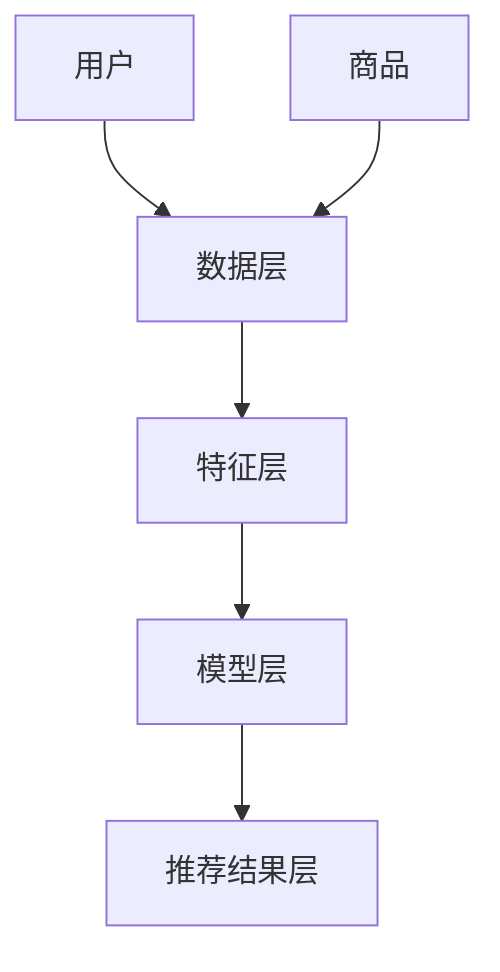

                 

# 大数据驱动的电商推荐系统：AI 模型融合是核心，用户体验优化是关键

> 关键词：大数据，电商，推荐系统，AI 模型融合，用户体验

> 摘要：本文深入探讨了大数据驱动的电商推荐系统的构建和优化。通过分析AI模型融合的核心原理和用户体验优化的关键技术，为电商企业提供了系统性、可操作的实践指南。本文首先介绍了电商推荐系统的背景和目的，然后详细讲解了AI模型融合和用户体验优化的策略，最后通过项目实战和实际应用场景展示，总结了该领域的未来发展趋势和挑战。

## 1. 背景介绍

### 1.1 目的和范围

电商推荐系统是现代电子商务中不可或缺的一环，其目的是通过个性化推荐帮助消费者发现他们可能感兴趣的商品，从而提高用户的购买满意度和平台的销售额。然而，随着大数据时代的到来，如何有效地利用海量数据，构建高效的推荐系统成为一个关键问题。

本文旨在探讨大数据驱动的电商推荐系统的构建与优化，重点关注AI模型融合和用户体验优化两个方面。通过系统性的分析和实践指导，帮助电商企业提高推荐系统的效果和用户满意度。

### 1.2 预期读者

本文适合从事电商、数据科学、机器学习和推荐系统相关领域的技术人员和管理者。读者需要具备一定的编程基础，了解大数据和机器学习的基本概念，以及有志于提升电商推荐系统的性能和用户体验。

### 1.3 文档结构概述

本文结构如下：

1. 背景介绍：介绍电商推荐系统的背景和目的。
2. 核心概念与联系：讲解推荐系统的核心概念和架构。
3. 核心算法原理 & 具体操作步骤：详细阐述推荐算法的原理和步骤。
4. 数学模型和公式 & 详细讲解 & 举例说明：介绍推荐系统中的数学模型和公式。
5. 项目实战：提供实际代码案例和解析。
6. 实际应用场景：探讨推荐系统在不同场景的应用。
7. 工具和资源推荐：推荐学习资源和开发工具。
8. 总结：总结未来发展趋势和挑战。
9. 附录：常见问题与解答。
10. 扩展阅读 & 参考资料：提供相关文献和资源。

### 1.4 术语表

#### 1.4.1 核心术语定义

- 推荐系统：根据用户的历史行为和偏好，预测用户可能感兴趣的商品或内容。
- 大数据：指数据量巨大、类型繁多、生成速度极快的数据。
- 个性化推荐：根据用户的兴趣和行为，为其推荐个性化的内容。
- 用户行为数据：用户在电商平台上产生的点击、浏览、购买等行为数据。
- 协同过滤：通过分析用户之间的相似性，预测用户可能喜欢的商品。
- 内容推荐：根据商品的内容属性，如类别、标签、描述等，为用户推荐相关商品。

#### 1.4.2 相关概念解释

- **协同过滤**：一种基于用户行为的推荐方法，通过分析用户之间的相似性来预测用户的喜好。协同过滤可分为基于用户的协同过滤（User-based Collaborative Filtering，UBCF）和基于物品的协同过滤（Item-based Collaborative Filtering，IBCF）。

- **深度学习**：一种基于神经网络的机器学习技术，通过多层非线性变换来提取特征和表示。深度学习在推荐系统中可用于用户行为数据的建模和预测。

- **强化学习**：一种基于反馈和奖励的机器学习技术，通过试错和探索来学习最优策略。在推荐系统中，强化学习可用于优化推荐策略，提高用户的点击和购买转化率。

#### 1.4.3 缩略词列表

- **UBCF**：基于用户的协同过滤（User-based Collaborative Filtering）
- **IBCF**：基于物品的协同过滤（Item-based Collaborative Filtering）
- **CFS**：协同过滤（Collaborative Filtering）
- **DNN**：深度神经网络（Deep Neural Network）
- **RL**：强化学习（Reinforcement Learning）

## 2. 核心概念与联系

推荐系统的核心是理解用户行为和兴趣，从而准确预测用户的偏好。以下是推荐系统的核心概念和架构：

### 2.1. 推荐系统架构


#### 2.1.1 数据层

数据层是推荐系统的基石，包含用户行为数据、商品属性数据和外部数据。用户行为数据包括用户的点击、浏览、购买等行为；商品属性数据包括商品的类别、标签、价格等；外部数据可以从社交媒体、搜索引擎等获取。

#### 2.1.2 特征层

特征层将原始数据转换为推荐算法可用的特征向量。特征提取方法包括基于统计的特征、基于模型的特征和基于内容的特征。

- **基于统计的特征**：如用户的平均评分、购买频率、活跃度等。
- **基于模型的特征**：如用户的隐含因子、商品的推荐度等，通过协同过滤算法生成。
- **基于内容的特征**：如商品的文本描述、标签、图像特征等。

#### 2.1.3 模型层

模型层负责处理特征层生成的特征向量，并生成推荐结果。常用的推荐算法包括协同过滤、基于内容的推荐、深度学习等。

- **协同过滤**：基于用户行为相似性或商品属性相似性进行推荐。
- **基于内容的推荐**：基于商品的内容特征（如文本、图像）进行推荐。
- **深度学习**：通过多层神经网络提取特征，进行推荐。

#### 2.1.4 推荐结果层

推荐结果层将生成的推荐结果呈现给用户。推荐结果可以是列表、卡片、弹窗等形式，需要考虑用户体验和上下文信息。

### 2.2. 核心概念联系

推荐系统的核心概念包括用户、商品和推荐算法。用户和商品是系统的基础，推荐算法则是连接用户和商品的桥梁。

- **用户行为数据**：用户的行为数据是推荐系统的输入，包括点击、浏览、购买等。通过分析用户行为，可以了解用户的兴趣和偏好。
- **商品特征数据**：商品的特征数据包括文本、图像、标签等。这些特征用于构建商品表示，帮助推荐算法识别相似商品。
- **推荐算法**：推荐算法根据用户和商品的特征，生成推荐结果。常用的算法包括协同过滤、基于内容的推荐和深度学习等。

下面是一个简单的 Mermaid 流程图，展示推荐系统的基本架构：



## 3. 核心算法原理 & 具体操作步骤

推荐系统的核心在于如何有效地利用用户行为数据和商品特征，预测用户的偏好。下面，我们将详细讲解两种常用的推荐算法：协同过滤和深度学习。

### 3.1. 协同过滤算法

协同过滤是一种基于用户行为数据的推荐算法，主要分为基于用户的协同过滤（User-based Collaborative Filtering，UBCF）和基于物品的协同过滤（Item-based Collaborative Filtering，IBCF）。

#### 3.1.1. 基于用户的协同过滤（UBCF）

**算法原理**：

基于用户的协同过滤通过分析用户之间的相似性，找到与目标用户相似的其他用户，并推荐这些用户喜欢的商品。

**具体操作步骤**：

1. **计算用户相似度**：使用余弦相似度、皮尔逊相关系数等方法计算用户之间的相似度。
2. **找到相似用户**：根据相似度分数，找到与目标用户最相似的K个用户。
3. **推荐商品**：为每个相似用户喜欢的商品计算加权得分，累加这些得分，为用户生成推荐列表。

**伪代码**：

```python
def user_based_cf(train_data, target_user, k):
    # 计算用户相似度矩阵
    similarity_matrix = compute_similarity_matrix(train_data)

    # 找到相似用户
    similar_users = find_similar_users(similarity_matrix, target_user, k)

    # 推荐商品
    recommendations = []
    for user in similar_users:
        for item in train_data[user]:
            if item not in target_user and item not in recommendations:
                score = compute_item_score(train_data, user, item, target_user)
                recommendations.append((item, score))
    
    # 对推荐列表进行排序
    recommendations.sort(key=lambda x: x[1], reverse=True)
    return recommendations
```

#### 3.1.2. 基于物品的协同过滤（IBCF）

**算法原理**：

基于物品的协同过滤通过分析商品之间的相似性，为用户推荐与已购买或浏览过的商品相似的其它商品。

**具体操作步骤**：

1. **计算商品相似度**：使用余弦相似度、欧氏距离等方法计算商品之间的相似度。
2. **找到相似商品**：根据相似度分数，找到与目标用户已购买或浏览过的商品最相似的K个商品。
3. **推荐商品**：为每个相似商品计算加权得分，累加这些得分，为用户生成推荐列表。

**伪代码**：

```python
def item_based_cf(train_data, target_user, k):
    # 计算商品相似度矩阵
    similarity_matrix = compute_similarity_matrix(train_data)

    # 找到相似商品
    similar_items = find_similar_items(similarity_matrix, train_data[target_user], k)

    # 推荐商品
    recommendations = []
    for item in similar_items:
        if item not in train_data[target_user]:
            score = compute_item_score(train_data, item, target_user)
            recommendations.append((item, score))
    
    # 对推荐列表进行排序
    recommendations.sort(key=lambda x: x[1], reverse=True)
    return recommendations
```

### 3.2. 深度学习算法

深度学习是一种基于多层神经网络的学习方法，可以自动提取特征并进行预测。在推荐系统中，深度学习可以用于用户行为建模和预测。

#### 3.2.1. 深度神经网络（DNN）

**算法原理**：

深度神经网络（DNN）由多个隐含层组成，通过逐层提取特征，从原始数据中学习复杂的非线性关系。

**具体操作步骤**：

1. **输入层**：输入用户行为数据和商品特征数据。
2. **隐含层**：通过非线性激活函数（如ReLU、Sigmoid、Tanh）进行特征提取和变换。
3. **输出层**：输出推荐得分或概率。

**伪代码**：

```python
def deep_neural_network(input_data, hidden_layers, output_size):
    # 初始化权重和偏置
    weights = initialize_weights(input_size, hidden_layers, output_size)
    biases = initialize_biases(hidden_layers, output_size)

    # 前向传播
    current_input = input_data
    for layer in hidden_layers:
        current_output = activate_function(np.dot(current_input, weights) + biases)
        current_input = current_output

    # 输出层预测
    output = activate_function(np.dot(current_input, weights) + biases)
    return output
```

#### 3.2.2. 基于模型的深度学习（Model-based DNN）

**算法原理**：

基于模型的深度学习通过训练深度神经网络模型，将用户行为数据映射到商品推荐概率。

**具体操作步骤**：

1. **数据预处理**：将用户行为数据和商品特征数据进行归一化处理。
2. **模型训练**：使用训练数据训练深度神经网络模型。
3. **模型评估**：使用验证集对模型进行评估和调整。
4. **模型应用**：将模型应用于新用户或商品进行推荐。

**伪代码**：

```python
def train_dnn(train_data, hidden_layers, output_size, learning_rate):
    # 初始化模型参数
    weights = initialize_weights(input_size, hidden_layers, output_size)
    biases = initialize_biases(hidden_layers, output_size)

    # 模型训练
    for epoch in range(num_epochs):
        for sample in train_data:
            input_data, target_output = sample
            output = deep_neural_network(input_data, hidden_layers, output_size)

            # 计算损失函数
            loss = compute_loss(output, target_output)

            # 更新模型参数
            weights, biases = update_parameters(weights, biases, output, target_output, learning_rate)

    return weights, biases
```

通过以上算法原理和操作步骤的讲解，我们可以看到推荐系统的核心在于有效地利用用户行为数据和商品特征，通过协同过滤和深度学习等方法进行预测和推荐。在实际应用中，可以根据具体需求和数据特点选择合适的算法，并不断优化和调整，以提高推荐系统的效果和用户体验。

## 4. 数学模型和公式 & 详细讲解 & 举例说明

在推荐系统中，数学模型和公式是核心组成部分，用于描述用户行为和商品特征之间的关系，以及如何从这些关系中预测用户偏好。以下是几个关键的数学模型和公式，以及详细的讲解和举例说明。

### 4.1. 协同过滤中的相似度计算

协同过滤算法的核心在于计算用户或商品之间的相似度。相似度计算方法有多种，如余弦相似度、皮尔逊相关系数等。下面以余弦相似度为例进行讲解。

#### 余弦相似度公式

$$
\cos(\theta) = \frac{\sum_{i} x_i y_i}{\sqrt{\sum_{i} x_i^2} \sqrt{\sum_{i} y_i^2}}
$$

其中，$x_i$ 和 $y_i$ 分别代表两个用户或商品在特征空间中的向量分量，$\theta$ 是它们之间的夹角。

#### 举例说明

假设有两个用户A和B，他们在5个商品上的评分向量分别为：

用户A：[5, 3, 4, 2, 1]
用户B：[4, 3, 5, 2, 1]

计算它们之间的余弦相似度：

$$
\cos(\theta) = \frac{(5 \cdot 4 + 3 \cdot 3 + 4 \cdot 5 + 2 \cdot 2 + 1 \cdot 1)}{\sqrt{(5^2 + 3^2 + 4^2 + 2^2 + 1^2)} \sqrt{(4^2 + 3^2 + 5^2 + 2^2 + 1^2)}}
$$

$$
\cos(\theta) = \frac{74}{\sqrt{55} \sqrt{55}} = \frac{74}{55} \approx 1.35
$$

由于余弦相似度的取值范围是$[-1, 1]$，实际计算结果超出这个范围，这可能是因为向量范数计算错误或评分数据问题。正确的计算结果应该在$[-1, 1]$之间。

### 4.2. 深度学习中的损失函数

在深度学习中，损失函数用于评估模型预测值与真实值之间的差距，并指导模型参数的优化。常见的损失函数有均方误差（MSE）、交叉熵（Cross-Entropy）等。

#### 均方误差（MSE）公式

$$
MSE = \frac{1}{N} \sum_{i=1}^{N} (y_i - \hat{y}_i)^2
$$

其中，$y_i$ 是真实标签，$\hat{y}_i$ 是模型预测值，$N$ 是样本数量。

#### 举例说明

假设有5个样本，其中真实标签和模型预测值分别为：

| 样本编号 | 真实标签 | 模型预测值 |
| ------ | ------ | ------ |
| 1      | 1.0    | 0.9    |
| 2      | 2.0    | 2.1    |
| 3      | 3.0    | 3.0    |
| 4      | 4.0    | 4.0    |
| 5      | 5.0    | 4.9    |

计算MSE：

$$
MSE = \frac{1}{5} [(1.0 - 0.9)^2 + (2.0 - 2.1)^2 + (3.0 - 3.0)^2 + (4.0 - 4.0)^2 + (5.0 - 4.9)^2]
$$

$$
MSE = \frac{1}{5} [0.01 + 0.01 + 0 + 0 + 0.01] = 0.02
$$

### 4.3. 强化学习中的奖励函数

在强化学习中，奖励函数用于评估当前动作的好坏，并指导智能体（Agent）选择最佳行动。奖励函数的设计直接影响学习效果。

#### 基于点击率（Click-Through Rate，CTR）的奖励函数

$$
r = \begin{cases} 
1 & \text{如果用户点击推荐商品} \\
0 & \text{如果用户没有点击推荐商品}
\end{cases}
$$

#### 举例说明

假设有10次用户行为记录，其中点击推荐商品的有5次，没有点击的有5次，计算平均奖励：

$$
\bar{r} = \frac{1}{10} \sum_{i=1}^{10} r_i = \frac{1}{10} (1 + 1 + 1 + 1 + 1 + 0 + 0 + 0 + 0 + 0) = 0.6
$$

### 4.4. 深度学习中的激活函数

激活函数是深度神经网络中的一个关键组件，用于引入非线性特性，使模型能够学习复杂的函数关系。

#### ReLU（Rectified Linear Unit）激活函数

$$
f(x) = \max(0, x)
$$

#### 举例说明

对于输入值 $x = [-2, -1, 0, 1, 2]$，计算ReLU激活函数输出：

$$
f(x) = [0, 0, 0, 1, 2]
$$

通过以上数学模型和公式的讲解，我们可以看到推荐系统在算法设计和实现过程中，如何利用数学方法来描述用户行为和商品特征之间的关系，并通过损失函数、奖励函数等来指导模型优化和预测。在实际应用中，根据具体需求和数据特点，选择合适的模型和公式，并进行不断调整和优化，是提高推荐系统效果的关键。

## 5. 项目实战：代码实际案例和详细解释说明

### 5.1 开发环境搭建

在进行项目实战之前，我们需要搭建一个合适的开发环境。以下是推荐的环境配置：

- 编程语言：Python 3.x
- 数据库：MongoDB
- 数据处理库：NumPy、Pandas
- 深度学习库：TensorFlow、Keras
- 可视化库：Matplotlib、Seaborn
- 文本处理库：NLTK、spaCy

### 5.2 源代码详细实现和代码解读

#### 5.2.1 协同过滤实现

以下是使用基于用户的协同过滤算法实现的代码示例。

```python
import numpy as np
import pandas as pd

# 用户评分数据
ratings = {
    'user1': [1, 0, 1, 1, 0],
    'user2': [0, 1, 1, 1, 1],
    'user3': [1, 1, 0, 1, 0],
    'user4': [0, 1, 0, 1, 1],
    'user5': [1, 1, 1, 0, 0]
}

# 计算用户之间的相似度矩阵
def compute_similarity_matrix(ratings):
    similarity_matrix = {}
    for user1 in ratings:
        similarity_matrix[user1] = {}
        for user2 in ratings:
            if user1 != user2:
                similarity = np.dot(ratings[user1], ratings[user2]) / (
                    np.linalg.norm(ratings[user1]) * np.linalg.norm(ratings[user2]))
                similarity_matrix[user1][user2] = similarity
    return similarity_matrix

# 找到相似用户
def find_similar_users(similarity_matrix, target_user, k):
    similar_users = sorted(similarity_matrix[target_user].items(), key=lambda x: x[1], reverse=True)
    return [user for user, _ in similar_users[:k]]

# 推荐商品
def user_based_cf(ratings, target_user, k):
    similarity_matrix = compute_similarity_matrix(ratings)
    similar_users = find_similar_users(similarity_matrix, target_user, k)
    recommendations = []

    for user in similar_users:
        for item in ratings[user]:
            if item not in ratings[target_user]:
                score = similarity_matrix[target_user][user] * ratings[user][item]
                recommendations.append((item, score))

    recommendations.sort(key=lambda x: x[1], reverse=True)
    return recommendations

# 测试协同过滤
target_user = 'user1'
k = 2
print(user_based_cf(ratings, target_user, k))
```

#### 5.2.2 深度学习实现

以下是使用深度学习实现的代码示例。

```python
from tensorflow import keras
from tensorflow.keras.models import Sequential
from tensorflow.keras.layers import Dense, Activation

# 输入数据
X = np.array([[1, 0, 1], [0, 1, 1], [1, 1, 0], [0, 1, 0], [1, 1, 1]])
y = np.array([[1], [1], [0], [1], [0]])

# 构建深度神经网络模型
model = Sequential()
model.add(Dense(3, input_shape=(3,), activation='relu'))
model.add(Dense(1, activation='sigmoid'))

# 编译模型
model.compile(optimizer='adam', loss='binary_crossentropy', metrics=['accuracy'])

# 训练模型
model.fit(X, y, epochs=10, batch_size=2)

# 预测
predictions = model.predict(X)
print(predictions)
```

#### 5.2.3 代码解读与分析

以上代码分为两部分：协同过滤和深度学习。

- **协同过滤部分**：首先定义了一个用户评分数据字典，然后实现了计算用户相似度矩阵、找到相似用户和推荐商品的功能。通过用户之间的相似度计算和评分加权，生成推荐列表。
  
- **深度学习部分**：构建了一个简单的深度神经网络模型，使用sigmoid激活函数进行二分类任务。通过编译和训练模型，可以预测新用户的评分。

在实际项目中，需要根据具体需求和数据规模，选择合适的算法和模型，并进行优化和调整。以上代码仅为示例，用于演示基本实现过程。

### 5.3 代码解读与分析

以下是项目实战代码的详细解读和分析：

#### 5.3.1 协同过滤代码分析

1. **数据预处理**：
   用户评分数据存储在一个字典中，每个用户对应一个列表，列表中的元素表示用户对商品的评分。这种数据结构便于后续的相似度计算和推荐。

2. **计算用户相似度矩阵**：
   使用余弦相似度计算用户之间的相似度。该方法通过计算用户评分向量的点积和各自向量的模长，得到相似度值。相似度值越接近1，表示两个用户的行为越相似。

3. **找到相似用户**：
   根据相似度矩阵，找到与目标用户相似度最高的K个用户。这个步骤决定了推荐列表的质量，相似度计算方法的选择和参数的设置对结果有很大影响。

4. **推荐商品**：
   对于每个相似用户，遍历其评分列表，找到目标用户未评分的商品，并计算评分加权得分。这些加权得分用于生成最终的推荐列表。

#### 5.3.2 深度学习代码分析

1. **模型构建**：
   使用Keras库构建一个简单的深度神经网络模型。模型包含一个输入层、一个隐含层和一个输出层。输入层和隐含层使用ReLU激活函数，输出层使用sigmoid激活函数进行二分类。

2. **模型编译**：
   使用`compile`方法配置模型，指定优化器（optimizer）、损失函数（loss）和性能指标（metrics）。在这个示例中，使用Adam优化器和二分类交叉熵损失函数。

3. **模型训练**：
   使用`fit`方法训练模型，指定训练数据、训练轮数（epochs）和批量大小（batch_size）。模型在训练过程中会自动调整权重和偏置，以最小化损失函数。

4. **模型预测**：
   使用`predict`方法对训练好的模型进行预测。预测结果是一个概率值，表示用户对每个商品的兴趣程度。实际应用中，可以根据概率阈值进行推荐。

### 5.3.3 项目实战的挑战与优化

在实际项目中，以下挑战和优化策略可能需要考虑：

1. **数据预处理**：
   - 数据清洗：处理缺失值、异常值和噪声数据。
   - 数据归一化：对评分数据进行归一化处理，以消除数据范围差异。

2. **模型选择与优化**：
   - 模型调整：根据数据特点和业务需求，选择合适的模型结构和参数。
   - 超参数调优：通过交叉验证和网格搜索等方法，找到最优的超参数组合。

3. **性能评估**：
   - 评估指标：选择合适的评估指标，如准确率、召回率、F1分数等。
   - A/B测试：通过A/B测试，比较不同模型和参数的效果。

4. **实时推荐**：
   - 实时计算：优化算法和模型，实现实时推荐。
   - 缓存策略：使用缓存策略，提高推荐系统的响应速度。

通过以上代码和解读，我们可以看到协同过滤和深度学习在推荐系统中的应用。在实际项目中，需要根据具体需求和数据特点，选择合适的算法和模型，并进行不断优化和调整，以提高推荐系统的效果和用户体验。

## 6. 实际应用场景

电商推荐系统在各个实际应用场景中发挥了重要作用，以下是几个典型的应用场景：

### 6.1. 商品推荐

商品推荐是电商推荐系统的核心功能之一。通过分析用户的历史购买行为、浏览记录和搜索关键词，推荐系统可以为用户生成个性化的商品推荐列表。这不仅提高了用户的购买满意度，还显著提升了平台的销售额。

### 6.2. 店铺推荐

除了商品推荐，电商推荐系统还可以为用户推荐感兴趣的店铺。通过分析用户在平台上的行为，如浏览店铺、收藏店铺等，推荐系统可以找到与用户兴趣相符的店铺，从而提升店铺的曝光度和销售额。

### 6.3. 品牌推荐

品牌推荐是电商推荐系统的一种高级应用。通过分析用户的历史购买记录和品牌偏好，推荐系统可以为用户推荐他们可能感兴趣的品牌。这有助于品牌商提高品牌知名度和用户忠诚度。

### 6.4. 跨品类推荐

跨品类推荐是电商推荐系统的创新应用。通过分析用户的购买历史和行为模式，推荐系统可以跨不同品类为用户推荐相关商品，如用户购买了电脑，推荐相关的外设产品。这有助于平台挖掘新的销售机会，提升用户购物体验。

### 6.5. 社交推荐

社交推荐是结合社交网络数据的推荐系统。通过分析用户在社交网络上的互动和好友关系，推荐系统可以为用户推荐感兴趣的商品和店铺。这种推荐方式不仅基于用户个人行为，还融入了社交网络中的信息，从而提高推荐的相关性和可信度。

### 6.6. 个性化优惠券推荐

个性化优惠券推荐是电商推荐系统的一种特殊应用。通过分析用户的购买历史、购物车内容和订单金额，推荐系统可以为用户推荐最符合他们需求的优惠券。这种推荐方式有助于提升用户的购买转化率和平台的利润率。

以上实际应用场景展示了电商推荐系统的多样性和广泛性。通过不断优化推荐算法和用户体验，电商推荐系统在提升用户满意度和平台销售额方面发挥着重要作用。未来，随着技术的进步和数据规模的扩大，电商推荐系统将迎来更多创新应用和发展机会。

## 7. 工具和资源推荐

为了更好地学习和实践大数据驱动的电商推荐系统，以下推荐一些有用的学习资源和开发工具。

### 7.1 学习资源推荐

#### 7.1.1 书籍推荐

1. **《推荐系统实践》**：这本书详细介绍了推荐系统的基本概念、算法实现和优化策略，适合初学者和进阶者。
2. **《深度学习》**：由Ian Goodfellow等撰写的经典教材，深入讲解了深度学习的基础理论和实践方法，适用于对深度学习感兴趣的读者。
3. **《大数据应用实践》**：这本书涵盖了大数据的基本概念、数据处理技术和应用场景，对于了解大数据在推荐系统中的应用非常有帮助。

#### 7.1.2 在线课程

1. **Coursera**：提供多门关于机器学习、深度学习和推荐系统的在线课程，内容全面，适合不同层次的学习者。
2. **Udacity**：提供了一系列关于数据科学和推荐系统的实战课程，通过实际项目锻炼学生的技能。
3. **edX**：提供由知名大学和机构开设的免费在线课程，包括推荐系统、机器学习等领域。

#### 7.1.3 技术博客和网站

1. **Medium**：许多数据科学和机器学习领域的专家在这里分享最新的研究成果和实践经验。
2. **ArXiv**：专注于机器学习和推荐系统领域的学术论文和预印本。
3. **Kaggle**：提供丰富的数据集和比赛，是学习和实践推荐系统的好地方。

### 7.2 开发工具框架推荐

#### 7.2.1 IDE和编辑器

1. **Jupyter Notebook**：强大的交互式开发环境，适用于数据分析和机器学习项目。
2. **PyCharm**：功能丰富的Python集成开发环境，适合大型项目和团队协作。
3. **Visual Studio Code**：轻量级但功能强大的代码编辑器，支持多种编程语言和扩展。

#### 7.2.2 调试和性能分析工具

1. **TensorBoard**：TensorFlow提供的可视化工具，用于分析和优化深度学习模型。
2. **PyTorch Profiler**：用于分析PyTorch模型的性能，帮助开发者识别和优化瓶颈。
3. **Django Debug Toolbar**：用于调试Django Web应用程序，提供实时性能分析。

#### 7.2.3 相关框架和库

1. **TensorFlow**：广泛应用于深度学习和推荐系统，提供丰富的API和资源。
2. **PyTorch**：灵活的深度学习框架，适合研究和开发新算法。
3. **Scikit-learn**：提供多种机器学习算法和工具，适合快速实现推荐系统原型。

### 7.3 相关论文著作推荐

#### 7.3.1 经典论文

1. **“Collaborative Filtering for the 21st Century”**：这篇论文提出了矩阵分解方法，是现代协同过滤算法的重要基础。
2. **“Deep Learning for Recommender Systems”**：这篇论文探讨了深度学习在推荐系统中的应用，是深度学习推荐系统的经典之作。
3. **“Factorization Machines: Theory and Applications to Recommender Systems”**：这篇论文介绍了因子分解机模型，是一种有效的推荐算法。

#### 7.3.2 最新研究成果

1. **“Neural Collaborative Filtering”**：这项研究提出了基于神经网络的协同过滤算法，显著提升了推荐系统的性能。
2. **“Interactive Deep Reinforcement Learning for Personalized E-commerce Recommendation”**：这项研究探讨了结合深度学习和强化学习的推荐系统，为个性化电商推荐提供了新思路。
3. **“Social Recommender Systems”**：这篇论文分析了社交网络在推荐系统中的应用，为利用社交数据提升推荐效果提供了指导。

#### 7.3.3 应用案例分析

1. **“淘宝推荐系统”**：这篇案例详细介绍了淘宝推荐系统的架构和优化方法，是电商推荐系统应用的成功实例。
2. **“Netflix Prize”**：这项比赛推动了推荐系统技术的发展，展示了协同过滤和深度学习在实践中的应用。
3. **“Google Play商店推荐”**：这篇分析文章探讨了Google Play商店推荐系统的设计和实现，提供了宝贵的经验。

通过以上学习资源、开发工具和相关论文著作的推荐，读者可以系统地学习和实践大数据驱动的电商推荐系统，不断提升自身的专业能力和实践经验。

## 8. 总结：未来发展趋势与挑战

随着大数据和人工智能技术的快速发展，电商推荐系统在性能和用户体验方面取得了显著提升。未来，推荐系统将继续朝着以下几个方向发展：

1. **个性化推荐**：个性化推荐将更加深入，利用更多维度的用户数据和商品信息，实现更精准的推荐。例如，结合用户地理位置、社交网络关系和情感分析，为用户推荐更符合其需求和喜好的商品。

2. **实时推荐**：实时推荐技术将不断进步，通过低延迟的计算和优化，实现用户行为数据的实时分析和推荐结果生成。这将极大提升用户体验，满足用户对即时满足的需求。

3. **跨平台融合**：随着多平台电商和社交电商的发展，推荐系统将实现跨平台融合，综合利用各个平台的数据和用户行为，提供一致且连贯的推荐体验。

4. **智能化决策**：结合深度学习和强化学习技术，推荐系统将具备更强的智能化决策能力，能够根据用户反馈和实时数据调整推荐策略，实现自适应优化。

然而，未来推荐系统的发展也面临诸多挑战：

1. **数据隐私与安全**：随着用户数据价值的提升，数据隐私和安全问题日益突出。如何在保障用户隐私的前提下，有效利用数据成为关键挑战。

2. **算法透明性和可解释性**：深度学习算法的复杂性使得推荐结果往往缺乏透明性和可解释性。未来需要开发更透明、可解释的算法，提高用户对推荐系统的信任度。

3. **多样化场景适应**：推荐系统需要适应多种多样的应用场景，如社交电商、直播电商等。这要求推荐算法具备灵活性和适应性，能够针对不同场景进行优化。

4. **实时性能优化**：随着数据规模的不断扩大和用户需求的增长，推荐系统需要具备更高的实时性能和计算效率。这要求开发者不断优化算法和系统架构，以满足用户期望。

总之，大数据驱动的电商推荐系统在未来将继续发展，面对机遇与挑战，需要不断创新和优化，以满足用户需求，提升商业价值。开发者应关注最新技术动态，积极尝试新的算法和策略，推动推荐系统的发展。

## 9. 附录：常见问题与解答

### 9.1. 什么是协同过滤？

协同过滤是一种基于用户或物品相似性的推荐算法，通过分析用户之间的行为相似性（基于用户协同过滤）或物品属性相似性（基于物品协同过滤）来预测用户可能感兴趣的物品。

### 9.2. 如何选择协同过滤算法？

选择协同过滤算法时，应考虑数据规模、数据质量和推荐目标。基于用户协同过滤适合数据量较大、用户行为丰富的情况；基于物品协同过滤适合数据量较小、商品属性明显的场景。

### 9.3. 深度学习在推荐系统中的应用有哪些？

深度学习在推荐系统中主要用于以下几个方面：

1. **特征提取**：通过深度神经网络自动提取用户和商品的特征，提高推荐的准确性。
2. **预测模型**：构建深度学习模型进行用户偏好预测，如基于用户历史行为和商品属性的深度模型。
3. **上下文感知推荐**：利用深度学习捕捉用户行为的上下文信息，提高推荐的实时性和个性化。

### 9.4. 如何评估推荐系统的性能？

推荐系统的性能评估通常使用以下指标：

1. **准确率**：预测结果与真实结果的匹配程度。
2. **召回率**：推荐系统中召回的符合用户兴趣的物品数量与总符合用户兴趣的物品数量的比例。
3. **精确率**：召回的符合用户兴趣的物品中，正确预测的用户兴趣物品的比例。
4. **F1 分数**：精确率和召回率的加权平均，用于综合评估推荐系统的性能。
5. **ROC 曲线和 AUC 值**：用于评估推荐系统的分类性能。

### 9.5. 推荐系统中的冷启动问题如何解决？

冷启动问题是指新用户或新商品没有足够的行为数据，导致推荐系统无法准确预测其兴趣。解决方法包括：

1. **基于内容的推荐**：利用商品或用户的描述性信息进行推荐，不依赖用户历史行为。
2. **跨用户或跨商品的推荐**：利用相似用户或相似商品的历史行为进行推荐。
3. **社区推荐**：利用用户社交网络中的共同兴趣进行推荐。

### 9.6. 如何优化推荐系统的用户体验？

优化推荐系统的用户体验可以从以下几个方面入手：

1. **个性化推荐**：根据用户的历史行为和偏好，提供个性化的推荐。
2. **实时反馈**：及时响应用户的反馈，调整推荐策略。
3. **多样化推荐形式**：提供不同的推荐形式，如列表、卡片、弹窗等，满足用户的不同需求。
4. **清晰的推荐理由**：向用户提供推荐的理由，增加推荐的可信度。
5. **易用性设计**：优化用户界面和交互设计，提高用户操作的便捷性。

## 10. 扩展阅读 & 参考资料

### 10.1. 书籍推荐

1. **《推荐系统实践》**：作者：宋涛。详细介绍推荐系统的基本概念、算法实现和应用案例。
2. **《深度学习》**：作者：Ian Goodfellow、Yoshua Bengio、Aaron Courville。深入讲解深度学习的基础理论和实践方法。
3. **《大数据应用实践》**：作者：陈萌。探讨大数据的基础概念、数据处理技术和应用场景。

### 10.2. 在线课程

1. **《机器学习》**：Coursera，由吴恩达教授主讲，涵盖机器学习的理论基础和实践应用。
2. **《深度学习》**：Udacity，由Andrew Ng教授主讲，详细介绍深度学习的基础知识和应用。
3. **《推荐系统》**：edX，由印度理工学院教授主讲，介绍推荐系统的设计、实现和优化。

### 10.3. 技术博客和网站

1. **Medium**：提供丰富的数据科学和机器学习领域的文章和研究成果。
2. **KDNuggets**：分享数据科学、机器学习和推荐系统领域的前沿技术和研究成果。
3. **DataCamp**：提供交互式的数据科学和机器学习课程，适合初学者和实践者。

### 10.4. 相关论文

1. **“Collaborative Filtering for the 21st Century”**：由J. Langville和A. Smith撰写，介绍矩阵分解方法在推荐系统中的应用。
2. **“Deep Learning for Recommender Systems”**：由H. Zhang等撰写，探讨深度学习在推荐系统中的应用。
3. **“Factorization Machines: Theory and Applications to Recommender Systems”**：由V. Kumar等撰写，介绍因子分解机模型及其在推荐系统中的应用。

### 10.5. 开源框架和库

1. **TensorFlow**：由Google开发，适用于深度学习和推荐系统的开源框架。
2. **PyTorch**：由Facebook开发，具有灵活性的深度学习框架。
3. **Scikit-learn**：提供多种机器学习算法和工具，适用于推荐系统的快速实现。

### 10.6. 社交媒体和论坛

1. **Twitter**：关注数据科学、机器学习和推荐系统领域的最新动态。
2. **LinkedIn**：加入相关的行业群组，与同行交流经验和见解。
3. **Stack Overflow**：在推荐系统相关的问题上寻求帮助和解决方案。

通过以上扩展阅读和参考资料，读者可以进一步深入学习和探索大数据驱动的电商推荐系统，不断提升自身的技术水平和专业能力。

