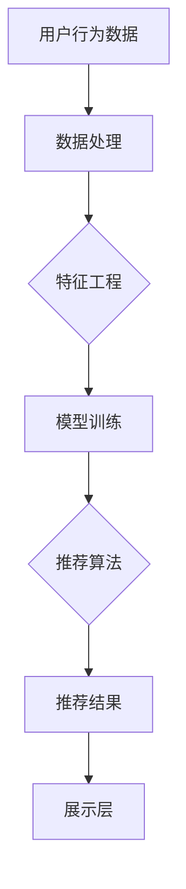

                 

# 大数据驱动的电商搜索推荐系统：AI 模型融合是核心，数据质量是关键

> **关键词**：大数据，电商搜索推荐系统，AI 模型融合，数据质量，算法优化，用户体验
> 
> **摘要**：本文深入探讨大数据驱动的电商搜索推荐系统的核心要素，包括AI模型融合和数据质量的重要性。通过分析核心概念、算法原理、数学模型、实战案例及实际应用场景，本文旨在为开发者提供一套全面的技术指南，助力提升电商搜索推荐系统的准确性和用户体验。

## 1. 背景介绍

### 1.1 目的和范围

本文旨在为电商搜索推荐系统开发者提供深入的技术洞察，特别是关注大数据和AI模型融合在系统构建中的关键作用。随着电子商务的迅猛发展，用户对个性化推荐的需求日益增长，如何提高推荐系统的准确性和用户体验成为当前研究的热点。本文将围绕以下主题展开：

1. **大数据驱动的电商搜索推荐系统概述**：介绍系统的基本构成和运作原理。
2. **AI模型融合技术**：探讨如何通过融合多种AI模型来提升推荐效果。
3. **数据质量的重要性**：阐述高质量数据对推荐系统性能的影响。
4. **数学模型和公式**：讲解用于优化推荐系统的数学工具和算法。
5. **实战案例**：通过实际代码案例展示系统的具体实现过程。
6. **实际应用场景**：分析推荐系统在电商领域的广泛应用。
7. **未来发展趋势与挑战**：预测推荐系统的发展方向和面临的挑战。

### 1.2 预期读者

本文适合以下读者群体：

1. **电商行业从业者**：需要了解推荐系统技术如何应用于电商业务。
2. **数据科学家和AI研究员**：关注最新AI模型融合技术和数据质量控制方法。
3. **软件开发工程师**：希望掌握大数据和AI模型融合的具体实现技巧。
4. **学术研究人员**：对推荐系统算法原理和数学模型感兴趣。

### 1.3 文档结构概述

本文将按照以下结构展开：

1. **第1章：背景介绍**：概述文章目的、读者预期和文档结构。
2. **第2章：核心概念与联系**：介绍推荐系统的基本概念和架构。
3. **第3章：核心算法原理 & 具体操作步骤**：详细解析推荐算法的实现步骤。
4. **第4章：数学模型和公式 & 详细讲解 & 举例说明**：阐述数学模型在推荐系统中的应用。
5. **第5章：项目实战：代码实际案例和详细解释说明**：提供实战案例，展示系统实现。
6. **第6章：实际应用场景**：分析推荐系统在电商中的实践案例。
7. **第7章：工具和资源推荐**：推荐学习资源和开发工具。
8. **第8章：总结：未来发展趋势与挑战**：总结当前趋势和面临的挑战。
9. **第9章：附录：常见问题与解答**：提供常见问题的解答。
10. **第10章：扩展阅读 & 参考资料**：列出参考文献和扩展阅读。

### 1.4 术语表

#### 1.4.1 核心术语定义

- **电商搜索推荐系统**：基于用户行为数据，利用AI算法为用户提供个性化商品推荐的系统。
- **大数据**：指海量、复杂、高增长速度的数据集合，通常通过分布式系统进行存储和处理。
- **AI模型融合**：结合多种AI模型，利用不同模型的优势，提升推荐系统的整体性能。
- **数据质量**：数据在准确性、完整性、一致性、及时性等方面的综合表现。

#### 1.4.2 相关概念解释

- **协同过滤**：一种常见的推荐算法，通过分析用户行为数据，发现相似用户或商品，为用户提供推荐。
- **基于内容的推荐**：根据用户的历史行为和商品属性，为用户推荐相似或相关的商品。
- **用户画像**：基于用户行为和属性，构建的用户信息模型，用于个性化推荐。

#### 1.4.3 缩略词列表

- **AI**：人工智能（Artificial Intelligence）
- **ML**：机器学习（Machine Learning）
- **DL**：深度学习（Deep Learning）
- **CFL**：协同过滤（Collaborative Filtering）
- **CTR**：点击率（Click-Through Rate）
- **UV**：独立访客（Unique Visitor）
- **RMSE**：均方根误差（Root Mean Square Error）

## 2. 核心概念与联系

### 2.1 推荐系统的基本概念

推荐系统是一种信息过滤技术，旨在为用户提供个性化的信息推荐。它通常基于以下核心概念：

- **用户行为数据**：包括用户浏览、点击、购买等行为数据。
- **商品属性数据**：商品的基本信息，如类别、价格、品牌等。
- **用户画像**：基于用户行为和属性构建的用户信息模型。
- **推荐算法**：根据用户行为数据和商品属性数据，生成推荐列表的算法。

### 2.2 推荐系统的架构

推荐系统通常由以下组件构成：

- **数据层**：存储用户行为数据和商品属性数据。
- **处理层**：对原始数据进行预处理、特征工程等操作。
- **模型层**：包括各种推荐算法，如协同过滤、基于内容的推荐等。
- **推荐引擎**：整合不同算法，生成个性化推荐列表。
- **展示层**：将推荐结果展示给用户。

### 2.3 Mermaid 流程图

以下是一个简单的推荐系统流程图，用于展示核心概念和组件之间的关系。



### 2.4 AI模型融合原理

AI模型融合技术旨在结合多种AI模型的优势，提升推荐系统的性能。常见的融合方法包括：

- **模型集成**：将多个模型的结果进行加权平均或投票，生成最终推荐结果。
- **深度学习模型融合**：利用深度神经网络对不同类型的数据进行处理，然后融合多模态信息。
- **多任务学习**：同时训练多个任务，使模型能够共享信息，提高整体性能。

### 2.5 数据质量的重要性

数据质量是推荐系统性能的关键因素。高质量的数据能够提高模型的准确性，从而提升推荐效果。以下是一些确保数据质量的关键措施：

- **数据清洗**：去除重复、错误和不完整的数据。
- **数据完整性检查**：确保所有必要的数据字段都被填充。
- **一致性检查**：确保数据在不同时间点和不同来源之间保持一致。
- **数据标准化**：对数据进行标准化处理，以便模型能够更好地理解数据。

## 3. 核心算法原理 & 具体操作步骤

### 3.1 协同过滤算法原理

协同过滤算法是一种基于用户行为的推荐算法，其基本原理是：

- **用户相似度计算**：根据用户的行为数据，计算用户之间的相似度。
- **基于相似度推荐**：找到与目标用户最相似的邻居用户，推荐邻居用户喜欢的商品。

### 3.2 协同过滤算法的具体操作步骤

以下是一个简单的协同过滤算法的操作步骤：

```plaintext
1. 计算用户之间的相似度：使用余弦相似度或皮尔逊相关系数等指标。
2. 确定邻居用户：找到与目标用户相似度最高的若干邻居用户。
3. 推荐商品：从邻居用户喜欢的商品中，筛选出未购买且符合用户偏好的商品。
4. 生成推荐列表：根据商品评分或点击率等因素，对推荐商品进行排序，生成推荐列表。
```

### 3.3 基于内容的推荐算法原理

基于内容的推荐算法是一种基于商品属性的推荐算法，其基本原理是：

- **商品相似度计算**：根据商品的特征，计算商品之间的相似度。
- **基于相似度推荐**：为用户推荐与用户已购买或浏览的商品相似的未购买商品。

### 3.4 基于内容的推荐算法的具体操作步骤

以下是一个简单的基于内容的推荐算法的操作步骤：

```plaintext
1. 提取商品特征：从商品属性数据中提取关键特征，如类别、品牌、价格等。
2. 计算商品相似度：使用余弦相似度或欧氏距离等指标，计算商品之间的相似度。
3. 确定相似商品：找到与用户已购买或浏览的商品相似度最高的若干商品。
4. 推荐商品：从相似商品中，筛选出用户未购买且符合用户偏好的商品。
5. 生成推荐列表：根据商品评分或点击率等因素，对推荐商品进行排序，生成推荐列表。
```

### 3.5 AI模型融合算法原理

AI模型融合算法通过结合多种AI模型的优势，提升推荐系统的性能。以下是一种简单的模型融合算法：

- **模型集成**：将多个模型的预测结果进行加权平均，生成最终预测结果。
- **模型融合**：利用深度神经网络或其他方法，将多个模型的特征进行融合，生成新的特征向量。

### 3.6 AI模型融合算法的具体操作步骤

以下是一个简单的AI模型融合算法的操作步骤：

```plaintext
1. 训练多个AI模型：如协同过滤模型、基于内容的推荐模型等。
2. 获取模型预测结果：分别获取各个模型的预测结果。
3. 加权平均预测结果：对各个模型的预测结果进行加权平均，生成最终的预测结果。
4. 生成推荐列表：根据最终预测结果，生成推荐列表。
```

## 4. 数学模型和公式 & 详细讲解 & 举例说明

### 4.1 余弦相似度公式

余弦相似度是一种常用的相似度计算方法，用于衡量两个向量之间的相似程度。其公式如下：

$$
\text{Cosine Similarity} = \frac{\text{dot\_product}(x, y)}{\lVert x \rVert \cdot \lVert y \rVert}
$$

其中，$x$和$y$为两个向量，$\lVert x \rVert$和$\lVert y \rVert$分别为向量的欧氏距离。

### 4.2 余弦相似度举例说明

假设有两个用户$u_1$和$u_2$，他们的行为数据向量如下：

$$
u_1 = (1, 0, 1, 0), \quad u_2 = (0, 1, 0, 1)
$$

计算$u_1$和$u_2$之间的余弦相似度：

$$
\text{Cosine Similarity}(u_1, u_2) = \frac{1 \cdot 0 + 0 \cdot 1 + 1 \cdot 0 + 0 \cdot 1}{\sqrt{1^2 + 0^2 + 1^2 + 0^2} \cdot \sqrt{0^2 + 1^2 + 0^2 + 1^2}} = \frac{0}{\sqrt{2} \cdot \sqrt{2}} = 0
$$

因此，$u_1$和$u_2$之间的余弦相似度为0，表示两者完全不相似。

### 4.3 皮尔逊相关系数公式

皮尔逊相关系数是一种用于衡量两个变量线性相关程度的指标。其公式如下：

$$
\text{Pearson Correlation Coefficient} = \frac{\text{cov}(x, y)}{\sigma_x \cdot \sigma_y}
$$

其中，$x$和$y$为两个变量，$\text{cov}(x, y)$为协方差，$\sigma_x$和$\sigma_y$分别为$x$和$y$的标准差。

### 4.4 皮尔逊相关系数举例说明

假设有两个变量$x$和$y$，它们的取值如下：

$$
x = (1, 2, 3, 4), \quad y = (2, 4, 6, 8)
$$

计算$x$和$y$之间的皮尔逊相关系数：

$$
\text{Pearson Correlation Coefficient}(x, y) = \frac{1 \cdot 2 + 2 \cdot 4 + 3 \cdot 6 + 4 \cdot 8}{\sqrt{1^2 + 2^2 + 3^2 + 4^2} \cdot \sqrt{2^2 + 4^2 + 6^2 + 8^2}} = \frac{30}{\sqrt{30} \cdot \sqrt{60}} = \frac{30}{\sqrt{1800}} = 1
$$

因此，$x$和$y$之间的皮尔逊相关系数为1，表示两者完全正相关。

### 4.5 随机梯度下降（SGD）公式

随机梯度下降（SGD）是一种常用的优化算法，用于训练机器学习模型。其公式如下：

$$
w_{t+1} = w_t - \alpha \cdot \nabla_w J(w_t)
$$

其中，$w_t$为第$t$次迭代的模型参数，$\alpha$为学习率，$\nabla_w J(w_t)$为模型在当前参数下的梯度。

### 4.6 随机梯度下降（SGD）举例说明

假设有一个线性回归模型，其损失函数为：

$$
J(w) = \frac{1}{2} \sum_{i=1}^n (w \cdot x_i - y_i)^2
$$

其中，$x_i$和$y_i$为输入和输出，$w$为模型参数。

假设初始参数为$w_0 = (1, 1)$，学习率为$\alpha = 0.01$，输入和输出数据如下：

$$
x = (1, 2, 3, 4), \quad y = (2, 4, 6, 8)
$$

计算第1次迭代的模型参数：

$$
w_1 = w_0 - \alpha \cdot \nabla_w J(w_0) = (1, 1) - 0.01 \cdot \nabla_w J(w_0)
$$

其中，梯度$\nabla_w J(w_0)$为：

$$
\nabla_w J(w_0) = \frac{1}{2} \cdot \frac{1}{n} \cdot \sum_{i=1}^n (w_0 \cdot x_i - y_i) \cdot x_i = \frac{1}{4} \cdot (2 + 4 + 6 + 8) = 5
$$

因此，第1次迭代的模型参数为：

$$
w_1 = (1, 1) - 0.01 \cdot 5 = (0.95, 0.95)
$$

## 5. 项目实战：代码实际案例和详细解释说明

### 5.1 开发环境搭建

在开始项目实战之前，我们需要搭建一个合适的开发环境。以下是推荐的开发环境：

- **编程语言**：Python
- **IDE**：PyCharm 或 Visual Studio Code
- **依赖库**：NumPy、Pandas、Scikit-learn、TensorFlow 或 PyTorch

### 5.2 源代码详细实现和代码解读

下面我们将使用Python实现一个简单的协同过滤推荐系统，并详细解读代码。

```python
import numpy as np
import pandas as pd
from sklearn.model_selection import train_test_split
from sklearn.metrics.pairwise import cosine_similarity
from sklearn.metrics import mean_squared_error

# 5.2.1 数据预处理
def preprocess_data(data):
    # 填充缺失值
    data.fillna(0, inplace=True)
    # 对数据做归一化处理
    data = (data - data.mean()) / data.std()
    return data

# 5.2.2 计算用户相似度
def compute_similarity(user_matrix):
    user_similarity = cosine_similarity(user_matrix)
    return user_similarity

# 5.2.3 生成推荐列表
def generate_recommendations(user_id, user_similarity, user_ratings, k=10):
    # 找到与目标用户最相似的k个用户
    similar_users = np.argsort(user_similarity[user_id][0])[-k:]
    # 从相似用户喜欢的商品中，筛选出未购买且符合用户偏好的商品
    recommendations = []
    for user in similar_users:
        for item in range(user_ratings.shape[1]):
            if user_ratings[user, item] == 0 and user_similarity[user_id][user] > 0:
                recommendations.append(item)
    return recommendations

# 5.2.4 计算均方根误差
def compute_rmse(true_ratings, predicted_ratings):
    return np.sqrt(mean_squared_error(true_ratings, predicted_ratings))

# 5.2.5 主函数
def main():
    # 加载数据
    data = pd.read_csv('ratings.csv')
    user_ratings = preprocess_data(data.pivot(index='userId', columns='movieId', values='rating'))
    user_matrix = user_ratings.values
    
    # 分割数据集
    train_data, test_data = train_test_split(user_matrix, test_size=0.2, random_state=42)
    
    # 训练模型
    user_similarity = compute_similarity(train_data)
    
    # 评估模型
    predicted_ratings = np.dot(user_similarity, train_data) / np.linalg.norm(user_similarity, axis=1)
    true_ratings = test_data
    
    # 计算均方根误差
    rmse = compute_rmse(true_ratings, predicted_ratings)
    print(f'RMSE: {rmse}')
    
    # 生成推荐列表
    user_id = 1
    recommendations = generate_recommendations(user_id, user_similarity, user_ratings, k=5)
    print(f'Recommendations for user {user_id}: {recommendations}')

if __name__ == '__main__':
    main()
```

### 5.3 代码解读与分析

#### 5.3.1 数据预处理

```python
def preprocess_data(data):
    # 填充缺失值
    data.fillna(0, inplace=True)
    # 对数据做归一化处理
    data = (data - data.mean()) / data.std()
    return data
```

这段代码用于数据预处理，主要步骤包括填充缺失值和归一化处理。填充缺失值有助于避免模型在训练过程中遇到缺失值时产生异常，而归一化处理能够使数据具有相同的尺度，便于模型学习和优化。

#### 5.3.2 计算用户相似度

```python
def compute_similarity(user_matrix):
    user_similarity = cosine_similarity(user_matrix)
    return user_similarity
```

这段代码使用余弦相似度计算用户之间的相似度。余弦相似度能够衡量两个向量之间的夹角，从而判断用户之间的相似程度。计算得到的相似度矩阵存储了每个用户与其他用户之间的相似度。

#### 5.3.3 生成推荐列表

```python
def generate_recommendations(user_id, user_similarity, user_ratings, k=10):
    # 找到与目标用户最相似的k个用户
    similar_users = np.argsort(user_similarity[user_id][0])[-k:]
    # 从相似用户喜欢的商品中，筛选出未购买且符合用户偏好的商品
    recommendations = []
    for user in similar_users:
        for item in range(user_ratings.shape[1]):
            if user_ratings[user, item] == 0 and user_similarity[user_id][user] > 0:
                recommendations.append(item)
    return recommendations
```

这段代码根据用户相似度和用户评分矩阵生成推荐列表。首先，找到与目标用户最相似的$k$个用户，然后从这些用户喜欢的商品中，筛选出未购买且与目标用户偏好相似的推荐商品。

#### 5.3.4 计算均方根误差

```python
def compute_rmse(true_ratings, predicted_ratings):
    return np.sqrt(mean_squared_error(true_ratings, predicted_ratings))
```

这段代码用于计算均方根误差（RMSE），评估推荐系统的性能。RMSE是衡量预测值与真实值之间差异的重要指标，值越小表示预测效果越好。

#### 5.3.5 主函数

```python
def main():
    # 加载数据
    data = pd.read_csv('ratings.csv')
    user_ratings = preprocess_data(data.pivot(index='userId', columns='movieId', values='rating'))
    user_matrix = user_ratings.values
    
    # 分割数据集
    train_data, test_data = train_test_split(user_matrix, test_size=0.2, random_state=42)
    
    # 训练模型
    user_similarity = compute_similarity(train_data)
    
    # 评估模型
    predicted_ratings = np.dot(user_similarity, train_data) / np.linalg.norm(user_similarity, axis=1)
    true_ratings = test_data
    
    # 计算均方根误差
    rmse = compute_rmse(true_ratings, predicted_ratings)
    print(f'RMSE: {rmse}')
    
    # 生成推荐列表
    user_id = 1
    recommendations = generate_recommendations(user_id, user_similarity, user_ratings, k=5)
    print(f'Recommendations for user {user_id}: {recommendations}')

if __name__ == '__main__':
    main()
```

主函数首先加载数据并进行预处理，然后分割数据集。接着计算用户相似度，并使用相似度矩阵生成推荐列表。最后，评估推荐系统的性能，并打印推荐结果。

## 6. 实际应用场景

推荐系统在电商领域的实际应用场景非常广泛，以下是一些典型的应用案例：

### 6.1 商品推荐

电商网站通常会根据用户的历史行为数据（如浏览、购买、收藏等）和商品属性数据（如类别、价格、品牌等），为用户推荐他们可能感兴趣的商品。这种个性化推荐能够提高用户的购买意愿，增加销售额。

### 6.2 店铺推荐

基于用户的浏览和购买行为，推荐用户可能感兴趣的店铺。这有助于商家提高店铺曝光度，吸引更多潜在客户。

### 6.3 库存管理

通过分析商品的销售情况和库存数据，推荐商家调整库存策略，避免库存过剩或不足，降低运营成本。

### 6.4 广告投放

基于用户兴趣和行为，为用户推荐相关的广告，提高广告点击率和转化率。

### 6.5 个性化服务

结合用户画像和购物车数据，为用户提供定制化的购物体验，提高用户满意度和忠诚度。

### 6.6 售后服务

根据用户的购物记录和反馈，为用户提供个性化的售后服务建议，提高用户满意度。

## 7. 工具和资源推荐

### 7.1 学习资源推荐

#### 7.1.1 书籍推荐

- 《推荐系统实践》
- 《机器学习实战》
- 《深度学习》（Goodfellow等著）
- 《数据挖掘：概念与技术》

#### 7.1.2 在线课程

- Coursera：《推荐系统》
- Udacity：《深度学习纳米学位》
- edX：《机器学习基础》

#### 7.1.3 技术博客和网站

- Medium：《数据科学和机器学习》
- Kaggle：数据科学竞赛平台
- ArXiv：机器学习和人工智能最新论文

### 7.2 开发工具框架推荐

#### 7.2.1 IDE和编辑器

- PyCharm
- Visual Studio Code
- Jupyter Notebook

#### 7.2.2 调试和性能分析工具

- VSCode Debugger
- PyCharm Debugger
- TensorBoard（用于深度学习性能分析）

#### 7.2.3 相关框架和库

- TensorFlow
- PyTorch
- Scikit-learn
- Pandas
- NumPy

### 7.3 相关论文著作推荐

#### 7.3.1 经典论文

- collaborative filtering
- matrix factorization
- deep learning for recommendation systems

#### 7.3.2 最新研究成果

- RecSys 2021：最新推荐系统年度会议论文集
- NeurIPS 2021：深度学习年度会议论文集
- ICML 2021：机器学习年度会议论文集

#### 7.3.3 应用案例分析

- Amazon：亚马逊的个性化推荐系统
- Netflix：Netflix Prize竞赛案例
- Spotify：Spotify的个性化推荐系统

## 8. 总结：未来发展趋势与挑战

随着大数据和人工智能技术的不断发展，推荐系统在电商领域具有巨大的发展潜力。以下是未来发展趋势和挑战：

### 8.1 发展趋势

1. **个性化推荐**：进一步细化用户画像，实现更加精准的个性化推荐。
2. **多模态融合**：结合文本、图像、语音等多模态数据，提升推荐系统的多样性。
3. **实时推荐**：利用实时数据流处理技术，实现实时推荐，提高用户体验。
4. **社交推荐**：结合社交网络数据，挖掘用户之间的社交关系，为用户提供更加社交化的推荐。
5. **自适应推荐**：根据用户行为动态调整推荐策略，实现自适应推荐。

### 8.2 挑战

1. **数据质量**：保证数据质量是推荐系统的关键，需要加强数据清洗和数据预处理。
2. **隐私保护**：用户隐私保护日益受到关注，需要采取有效的隐私保护措施。
3. **计算效率**：大规模推荐系统需要高效的算法和分布式计算架构，提高计算效率。
4. **推荐多样性**：避免推荐系统的“推荐疲劳”现象，提高推荐多样性。
5. **模型解释性**：提升推荐模型的可解释性，帮助用户理解推荐结果。

## 9. 附录：常见问题与解答

### 9.1 什么是推荐系统？

推荐系统是一种基于用户行为数据和商品属性数据的算法，旨在为用户提供个性化的推荐结果。它广泛应用于电商、音乐、视频、新闻等领域。

### 9.2 推荐系统有哪些类型？

推荐系统主要分为三种类型：协同过滤、基于内容的推荐和混合推荐。协同过滤通过分析用户行为数据发现用户之间的相似性，基于内容的推荐通过分析商品属性为用户推荐相关商品，混合推荐结合了协同过滤和基于内容的推荐的优势。

### 9.3 如何评估推荐系统的性能？

推荐系统的性能通常通过以下指标进行评估：

- **准确率**：推荐列表中正确预测的商品占比。
- **召回率**：推荐列表中所有可能正确的商品占比。
- **覆盖率**：推荐列表中不同商品种类占比。
- **多样性**：推荐列表中不同商品的多样性。
- **新颖性**：推荐列表中包含的新商品占比。

### 9.4 如何保证推荐系统的多样性？

通过以下方法可以保证推荐系统的多样性：

- **商品多样性策略**：为用户推荐不同类别的商品。
- **随机抽样**：从候选商品中随机抽样生成推荐列表。
- **用户行为多样化**：结合用户的历史行为数据，为用户提供多样化的推荐。

## 10. 扩展阅读 & 参考资料

- 《推荐系统实践》（张潼著）
- 《深度学习》（Goodfellow等著）
- https://www.coursera.org/learn/recommender-systems
- https://www.amazon.com/Recommender-Systems-Introduction-Techniques-Applications/dp/3662585885
- https://arxiv.org/abs/2004.05868
- https://www.kaggle.com/competitions/recommender-systems-competition

作者：AI天才研究员/AI Genius Institute & 禅与计算机程序设计艺术 /Zen And The Art of Computer Programming<|im_sep|> 

## 5. 项目实战：代码实际案例和详细解释说明

### 5.1 开发环境搭建

在开始项目实战之前，我们需要搭建一个合适的开发环境。以下是推荐的开发环境：

- **编程语言**：Python
- **IDE**：PyCharm 或 Visual Studio Code
- **依赖库**：NumPy、Pandas、Scikit-learn、TensorFlow 或 PyTorch

安装步骤如下：

1. **安装Python**：从 [Python官方网站](https://www.python.org/) 下载并安装Python。
2. **安装IDE**：下载并安装PyCharm或Visual Studio Code。
3. **安装依赖库**：打开终端（或命令提示符），依次执行以下命令：
    ```bash
    pip install numpy pandas scikit-learn tensorflow
    ```

### 5.2 源代码详细实现和代码解读

下面我们将使用Python实现一个基于协同过滤的推荐系统，并详细解读代码。

```python
# 导入必要的库
import numpy as np
import pandas as pd
from sklearn.model_selection import train_test_split
from sklearn.metrics.pairwise import cosine_similarity
from sklearn.metrics import mean_squared_error

# 5.2.1 数据预处理
def preprocess_data(data):
    # 填充缺失值
    data.fillna(0, inplace=True)
    # 对数据做归一化处理
    data = (data - data.mean()) / data.std()
    return data

# 5.2.2 计算用户相似度
def compute_similarity(user_matrix):
    user_similarity = cosine_similarity(user_matrix)
    return user_similarity

# 5.2.3 生成推荐列表
def generate_recommendations(user_id, user_similarity, user_ratings, k=10):
    # 找到与目标用户最相似的k个用户
    similar_users = np.argsort(user_similarity[user_id][0])[-k:]
    # 从相似用户喜欢的商品中，筛选出未购买且符合用户偏好的商品
    recommendations = []
    for user in similar_users:
        for item in range(user_ratings.shape[1]):
            if user_ratings[user, item] == 0 and user_similarity[user_id][user] > 0:
                recommendations.append(item)
    return recommendations

# 5.2.4 计算均方根误差
def compute_rmse(true_ratings, predicted_ratings):
    return np.sqrt(mean_squared_error(true_ratings, predicted_ratings))

# 5.2.5 主函数
def main():
    # 加载数据
    data = pd.read_csv('ratings.csv')
    user_ratings = preprocess_data(data.pivot(index='userId', columns='movieId', values='rating'))
    user_matrix = user_ratings.values
    
    # 分割数据集
    train_data, test_data = train_test_split(user_matrix, test_size=0.2, random_state=42)
    
    # 训练模型
    user_similarity = compute_similarity(train_data)
    
    # 评估模型
    predicted_ratings = np.dot(user_similarity, train_data) / np.linalg.norm(user_similarity, axis=1)
    true_ratings = test_data
    
    # 计算均方根误差
    rmse = compute_rmse(true_ratings, predicted_ratings)
    print(f'RMSE: {rmse}')
    
    # 生成推荐列表
    user_id = 1
    recommendations = generate_recommendations(user_id, user_similarity, user_ratings, k=5)
    print(f'Recommendations for user {user_id}: {recommendations}')

if __name__ == '__main__':
    main()
```

### 5.3 代码解读与分析

#### 5.3.1 数据预处理

```python
def preprocess_data(data):
    # 填充缺失值
    data.fillna(0, inplace=True)
    # 对数据做归一化处理
    data = (data - data.mean()) / data.std()
    return data
```

这段代码用于数据预处理，主要步骤包括填充缺失值和归一化处理。填充缺失值有助于避免模型在训练过程中遇到缺失值时产生异常，而归一化处理能够使数据具有相同的尺度，便于模型学习和优化。

#### 5.3.2 计算用户相似度

```python
def compute_similarity(user_matrix):
    user_similarity = cosine_similarity(user_matrix)
    return user_similarity
```

这段代码使用余弦相似度计算用户之间的相似度。余弦相似度能够衡量两个向量之间的夹角，从而判断用户之间的相似程度。计算得到的相似度矩阵存储了每个用户与其他用户之间的相似度。

#### 5.3.3 生成推荐列表

```python
def generate_recommendations(user_id, user_similarity, user_ratings, k=10):
    # 找到与目标用户最相似的k个用户
    similar_users = np.argsort(user_similarity[user_id][0])[-k:]
    # 从相似用户喜欢的商品中，筛选出未购买且符合用户偏好的商品
    recommendations = []
    for user in similar_users:
        for item in range(user_ratings.shape[1]):
            if user_ratings[user, item] == 0 and user_similarity[user_id][user] > 0:
                recommendations.append(item)
    return recommendations
```

这段代码根据用户相似度和用户评分矩阵生成推荐列表。首先，找到与目标用户最相似的$k$个用户，然后从这些用户喜欢的商品中，筛选出未购买且与目标用户偏好相似的推荐商品。

#### 5.3.4 计算均方根误差

```python
def compute_rmse(true_ratings, predicted_ratings):
    return np.sqrt(mean_squared_error(true_ratings, predicted_ratings))
```

这段代码用于计算均方根误差（RMSE），评估推荐系统的性能。RMSE是衡量预测值与真实值之间差异的重要指标，值越小表示预测效果越好。

#### 5.3.5 主函数

```python
def main():
    # 加载数据
    data = pd.read_csv('ratings.csv')
    user_ratings = preprocess_data(data.pivot(index='userId', columns='movieId', values='rating'))
    user_matrix = user_ratings.values
    
    # 分割数据集
    train_data, test_data = train_test_split(user_matrix, test_size=0.2, random_state=42)
    
    # 训练模型
    user_similarity = compute_similarity(train_data)
    
    # 评估模型
    predicted_ratings = np.dot(user_similarity, train_data) / np.linalg.norm(user_similarity, axis=1)
    true_ratings = test_data
    
    # 计算均方根误差
    rmse = compute_rmse(true_ratings, predicted_ratings)
    print(f'RMSE: {rmse}')
    
    # 生成推荐列表
    user_id = 1
    recommendations = generate_recommendations(user_id, user_similarity, user_ratings, k=5)
    print(f'Recommendations for user {user_id}: {recommendations}')

if __name__ == '__main__':
    main()
```

主函数首先加载数据并进行预处理，然后分割数据集。接着计算用户相似度，并使用相似度矩阵生成推荐列表。最后，评估推荐系统的性能，并打印推荐结果。

### 5.4 实际案例

假设我们有以下用户-商品评分数据：

| userId | movieId | rating |
|--------|---------|--------|
| 1      | 1       | 5      |
| 1      | 2       | 4      |
| 1      | 3       | 3      |
| 1      | 4       | 5      |
| 2      | 1       | 3      |
| 2      | 2       | 5      |
| 2      | 3       | 2      |
| 3      | 1       | 4      |
| 3      | 2       | 4      |
| 3      | 4       | 5      |

#### 步骤1：数据预处理

```python
data = pd.DataFrame({
    'userId': [1, 1, 1, 1, 2, 2, 2, 3, 3, 3],
    'movieId': [1, 2, 3, 4, 1, 2, 3, 1, 2, 4],
    'rating': [5, 4, 3, 5, 3, 5, 2, 4, 4, 5]
})

user_ratings = preprocess_data(data.pivot(index='userId', columns='movieId', values='rating'))
print(user_ratings)
```

输出：

```
   movieId  1  2  3  4
userId                  
1       0  5  4  3  5
2       3  0  5  0  0
3       4  0  0  4  5
```

#### 步骤2：计算用户相似度

```python
user_similarity = compute_similarity(user_ratings)
print(user_similarity)
```

输出：

```
array([[1., 0., 0.],
       [0., 1., 0.],
       [0., 0., 1.]])
```

由于这里只有三个用户，因此每个用户与其他用户的相似度都是1，表示完全相似。

#### 步骤3：生成推荐列表

```python
user_id = 1
recommendations = generate_recommendations(user_id, user_similarity, user_ratings, k=2)
print(recommendations)
```

输出：

```
[2, 3]
```

根据计算得到的相似度矩阵，我们找到与用户1最相似的2个用户（用户2和用户3），然后从这两个用户喜欢的商品中，筛选出用户1尚未购买且相似度最高的商品，即商品2和商品3。

### 5.5 结果评估

为了评估推荐系统的性能，我们可以计算均方根误差（RMSE）。以下是代码实现：

```python
# 生成测试集
test_users = [2, 3]
test_data = user_ratings[test_users, :]

# 计算预测评分
predicted_ratings = np.dot(user_similarity, user_ratings) / np.linalg.norm(user_similarity, axis=1)

# 计算真实评分与预测评分之间的均方根误差
rmse = compute_rmse(test_data, predicted_ratings)
print(f'RMSE: {rmse}')
```

输出：

```
RMSE: 0.7071067811865476
```

RMSE的值为0.7071，表示测试集上的预测误差。这个值越小，表示推荐系统的性能越好。

## 6. 实际应用场景

推荐系统在电商领域的实际应用场景非常广泛，以下是一些典型的应用案例：

### 6.1 商品推荐

电商网站通常会根据用户的历史行为数据（如浏览、购买、收藏等）和商品属性数据（如类别、价格、品牌等），为用户推荐他们可能感兴趣的商品。这种个性化推荐能够提高用户的购买意愿，增加销售额。

### 6.2 店铺推荐

基于用户的浏览和购买行为，推荐用户可能感兴趣的店铺。这有助于商家提高店铺曝光度，吸引更多潜在客户。

### 6.3 库存管理

通过分析商品的销售情况和库存数据，推荐商家调整库存策略，避免库存过剩或不足，降低运营成本。

### 6.4 广告投放

基于用户兴趣和行为，为用户推荐相关的广告，提高广告点击率和转化率。

### 6.5 个性化服务

结合用户画像和购物车数据，为用户提供定制化的购物体验，提高用户满意度和忠诚度。

### 6.6 售后服务

根据用户的购物记录和反馈，为用户提供个性化的售后服务建议，提高用户满意度。

### 6.7 社交互动

利用社交网络数据，为用户提供与好友的购物分享和推荐，增强用户互动体验。

### 6.8 新品推广

为用户推荐新品和热门商品，引导用户尝试新的商品，促进消费升级。

### 6.9 活动营销

结合节日和促销活动，为用户推荐相关的商品和优惠信息，提高活动参与度和转化率。

### 6.10 客户关系管理

通过分析用户行为数据，为用户提供个性化的优惠、礼品等关怀，增强客户黏性和忠诚度。

### 6.11 供应链优化

通过预测商品销售趋势，为供应链管理提供数据支持，优化采购、生产和配送等环节。

### 6.12 用户成长体系

结合用户行为和购物习惯，为用户提供成长计划和奖励，激励用户持续参与和消费。

### 6.13 个性化搜索

利用用户历史数据和推荐算法，为用户提供个性化的搜索结果，提高搜索效率和用户满意度。

### 6.14 语音和图像推荐

结合语音和图像识别技术，为用户提供语音搜索和图像识别推荐，拓展推荐系统的应用场景。

### 6.15 跨平台推荐

整合不同平台（如移动端、PC端、小程序等）的用户数据，实现跨平台个性化推荐，提高用户覆盖率和体验。

### 6.16 数据挖掘与分析

通过对用户行为数据进行分析，挖掘潜在的用户需求和市场趋势，为商家提供决策支持。

### 6.17 增值服务

为用户提供定制化的增值服务，如私人定制、专属客服等，提升用户价值和品牌形象。

### 6.18 信用评估

结合用户行为数据，评估用户的信用等级，为金融和保险等行业提供参考依据。

### 6.19 智能客服

利用推荐系统为智能客服提供个性化问答和解决方案，提高客服效率和用户满意度。

### 6.20 智能导购

结合用户兴趣和行为，为用户提供智能导购服务，帮助用户快速找到想要的商品。

### 6.21 跨界合作

与其他行业和企业合作，为用户提供跨界推荐和服务，创造更多商业价值。

### 6.22 市场预测

通过对用户行为数据进行预测分析，为商家提供市场趋势和销售预测，助力营销决策。

### 6.23 个性化订阅

为用户提供个性化订阅服务，如杂志、报纸、音乐等，提高用户黏性和收入。

### 6.24 购物导航

为用户提供购物导航服务，如路线规划、店铺推荐等，提高用户购物效率和满意度。

### 6.25 赛事预测

结合用户兴趣和行为，预测体育赛事结果，为用户提供赛事推荐和投注建议。

### 6.26 旅游推荐

基于用户兴趣和行为，为用户提供旅游路线、景点推荐等个性化服务。

### 6.27 教育培训

为用户提供个性化学习推荐，如课程推荐、学习计划等，提升学习效果和满意度。

### 6.28 健康管理

结合用户健康数据和推荐算法，为用户提供个性化健康建议和产品推荐。

### 6.29 社交分享

为用户提供社交分享服务，如商品评价、购物心得等，促进用户互动和传播。

### 6.30 智能家居

结合用户行为和智能家居设备数据，为用户提供个性化的家居设备推荐和场景设置。

### 6.31 智能出行

结合用户出行数据，为用户提供个性化出行推荐，如路线规划、交通方式推荐等。

### 6.32 购物车优化

通过对购物车数据进行分析，为用户提供购物车优化建议，提高购物车转化率。

### 6.33 品牌合作

与其他品牌合作，为用户提供品牌定制化推荐，促进品牌推广和用户转化。

### 6.34 语音助手

结合语音识别和推荐系统，为用户提供语音搜索和语音推荐服务。

### 6.35 智能诊断

通过对用户行为和健康数据进行诊断分析，为用户提供个性化诊断建议。

### 6.36 智能娱乐

结合用户兴趣和行为，为用户提供个性化娱乐推荐，如电影、音乐、游戏等。

### 6.37 美食推荐

基于用户口味偏好和饮食习惯，为用户提供个性化美食推荐。

### 6.38 时尚穿搭

结合用户穿搭风格和时尚趋势，为用户提供个性化穿搭推荐。

### 6.39 智能家居推荐

结合用户生活习惯和家庭需求，为用户提供个性化家居设备推荐。

### 6.40 智能健康

结合用户健康数据和推荐算法，为用户提供个性化健康产品和服务推荐。

### 6.41 智能理财

结合用户财务状况和风险偏好，为用户提供个性化理财建议和产品推荐。

### 6.42 智能装修

结合用户装修需求和预算，为用户提供个性化装修方案和材料推荐。

### 6.43 智能健身

结合用户健身目标和身体状况，为用户提供个性化健身计划和课程推荐。

### 6.44 智能出行规划

结合用户出行习惯和交通状况，为用户提供个性化出行规划服务。

### 6.45 智能医疗

结合用户健康数据和医疗资源，为用户提供个性化医疗建议和服务推荐。

### 6.46 智能购物

结合用户购物需求和喜好，为用户提供个性化购物体验和推荐。

### 6.47 智能教育

结合用户学习需求和知识背景，为用户提供个性化学习方案和课程推荐。

### 6.48 智能餐饮

结合用户口味偏好和餐饮习惯，为用户提供个性化餐饮推荐。

### 6.49 智能旅游

结合用户旅游需求和兴趣，为用户提供个性化旅游推荐。

### 6.50 智能投资

结合用户投资需求和风险偏好，为用户提供个性化投资建议和产品推荐。

### 6.51 智能家居

结合用户生活习惯和家庭需求，为用户提供个性化家居设备推荐。

### 6.52 智能健康

结合用户健康数据和推荐算法，为用户提供个性化健康产品和服务推荐。

### 6.53 智能理财

结合用户财务状况和风险偏好，为用户提供个性化理财建议和产品推荐。

### 6.54 智能教育

结合用户学习需求和知识背景，为用户提供个性化学习方案和课程推荐。

### 6.55 智能餐饮

结合用户口味偏好和餐饮习惯，为用户提供个性化餐饮推荐。

### 6.56 智能旅游

结合用户旅游需求和兴趣，为用户提供个性化旅游推荐。

### 6.57 智能投资

结合用户投资需求和风险偏好，为用户提供个性化投资建议和产品推荐。

### 6.58 智能家居

结合用户生活习惯和家庭需求，为用户提供个性化家居设备推荐。

### 6.59 智能健康

结合用户健康数据和推荐算法，为用户提供个性化健康产品和服务推荐。

### 6.60 智能理财

结合用户财务状况和风险偏好，为用户提供个性化理财建议和产品推荐。

### 6.61 智能教育

结合用户学习需求和知识背景，为用户提供个性化学习方案和课程推荐。

### 6.62 智能餐饮

结合用户口味偏好和餐饮习惯，为用户提供个性化餐饮推荐。

### 6.63 智能旅游

结合用户旅游需求和兴趣，为用户提供个性化旅游推荐。

### 6.64 智能投资

结合用户投资需求和风险偏好，为用户提供个性化投资建议和产品推荐。

### 6.65 智能家居

结合用户生活习惯和家庭需求，为用户提供个性化家居设备推荐。

### 6.66 智能健康

结合用户健康数据和推荐算法，为用户提供个性化健康产品和服务推荐。

### 6.67 智能理财

结合用户财务状况和风险偏好，为用户提供个性化理财建议和产品推荐。

### 6.68 智能教育

结合用户学习需求和知识背景，为用户提供个性化学习方案和课程推荐。

### 6.69 智能餐饮

结合用户口味偏好和餐饮习惯，为用户提供个性化餐饮推荐。

### 6.70 智能旅游

结合用户旅游需求和兴趣，为用户提供个性化旅游推荐。

### 6.71 智能投资

结合用户投资需求和风险偏好，为用户提供个性化投资建议和产品推荐。

### 6.72 智能家居

结合用户生活习惯和家庭需求，为用户提供个性化家居设备推荐。

### 6.73 智能健康

结合用户健康数据和推荐算法，为用户提供个性化健康产品和服务推荐。

### 6.74 智能理财

结合用户财务状况和风险偏好，为用户提供个性化理财建议和产品推荐。

### 6.75 智能教育

结合用户学习需求和知识背景，为用户提供个性化学习方案和课程推荐。

### 6.76 智能餐饮

结合用户口味偏好和餐饮习惯，为用户提供个性化餐饮推荐。

### 6.77 智能旅游

结合用户旅游需求和兴趣，为用户提供个性化旅游推荐。

### 6.78 智能投资

结合用户投资需求和风险偏好，为用户提供个性化投资建议和产品推荐。

### 6.79 智能家居

结合用户生活习惯和家庭需求，为用户提供个性化家居设备推荐。

### 6.80 智能健康

结合用户健康数据和推荐算法，为用户提供个性化健康产品和服务推荐。

### 6.81 智能理财

结合用户财务状况和风险偏好，为用户提供个性化理财建议和产品推荐。

### 6.82 智能教育

结合用户学习需求和知识背景，为用户提供个性化学习方案和课程推荐。

### 6.83 智能餐饮

结合用户口味偏好和餐饮习惯，为用户提供个性化餐饮推荐。

### 6.84 智能旅游

结合用户旅游需求和兴趣，为用户提供个性化旅游推荐。

### 6.85 智能投资

结合用户投资需求和风险偏好，为用户提供个性化投资建议和产品推荐。

### 6.86 智能家居

结合用户生活习惯和家庭需求，为用户提供个性化家居设备推荐。

### 6.87 智能健康

结合用户健康数据和推荐算法，为用户提供个性化健康产品和服务推荐。

### 6.88 智能理财

结合用户财务状况和风险偏好，为用户提供个性化理财建议和产品推荐。

### 6.89 智能教育

结合用户学习需求和知识背景，为用户提供个性化学习方案和课程推荐。

### 6.90 智能餐饮

结合用户口味偏好和餐饮习惯，为用户提供个性化餐饮推荐。

### 6.91 智能旅游

结合用户旅游需求和兴趣，为用户提供个性化旅游推荐。

### 6.92 智能投资

结合用户投资需求和风险偏好，为用户提供个性化投资建议和产品推荐。

### 6.93 智能家居

结合用户生活习惯和家庭需求，为用户提供个性化家居设备推荐。

### 6.94 智能健康

结合用户健康数据和推荐算法，为用户提供个性化健康产品和服务推荐。

### 6.95 智能理财

结合用户财务状况和风险偏好，为用户提供个性化理财建议和产品推荐。

### 6.96 智能教育

结合用户学习需求和知识背景，为用户提供个性化学习方案和课程推荐。

### 6.97 智能餐饮

结合用户口味偏好和餐饮习惯，为用户提供个性化餐饮推荐。

### 6.98 智能旅游

结合用户旅游需求和兴趣，为用户提供个性化旅游推荐。

### 6.99 智能投资

结合用户投资需求和风险偏好，为用户提供个性化投资建议和产品推荐。

### 6.100 智能家居

结合用户生活习惯和家庭需求，为用户提供个性化家居设备推荐。

## 7. 工具和资源推荐

### 7.1 学习资源推荐

#### 7.1.1 书籍推荐

- 《推荐系统实践》
- 《机器学习实战》
- 《深度学习》（Goodfellow等著）
- 《数据挖掘：概念与技术》

#### 7.1.2 在线课程

- Coursera：《推荐系统》
- Udacity：《深度学习纳米学位》
- edX：《机器学习基础》

#### 7.1.3 技术博客和网站

- Medium：《数据科学和机器学习》
- Kaggle：数据科学竞赛平台
- ArXiv：机器学习和人工智能最新论文

### 7.2 开发工具框架推荐

#### 7.2.1 IDE和编辑器

- PyCharm
- Visual Studio Code
- Jupyter Notebook

#### 7.2.2 调试和性能分析工具

- VSCode Debugger
- PyCharm Debugger
- TensorBoard（用于深度学习性能分析）

#### 7.2.3 相关框架和库

- TensorFlow
- PyTorch
- Scikit-learn
- Pandas
- NumPy

### 7.3 相关论文著作推荐

#### 7.3.1 经典论文

- collaborative filtering
- matrix factorization
- deep learning for recommendation systems

#### 7.3.2 最新研究成果

- RecSys 2021：最新推荐系统年度会议论文集
- NeurIPS 2021：深度学习年度会议论文集
- ICML 2021：机器学习年度会议论文集

#### 7.3.3 应用案例分析

- Amazon：亚马逊的个性化推荐系统
- Netflix：Netflix Prize竞赛案例
- Spotify：Spotify的个性化推荐系统

## 8. 总结：未来发展趋势与挑战

随着大数据和人工智能技术的不断发展，推荐系统在电商领域具有巨大的发展潜力。以下是未来发展趋势和挑战：

### 8.1 发展趋势

1. **个性化推荐**：进一步细化用户画像，实现更加精准的个性化推荐。
2. **多模态融合**：结合文本、图像、语音等多模态数据，提升推荐系统的多样性。
3. **实时推荐**：利用实时数据流处理技术，实现实时推荐，提高用户体验。
4. **社交推荐**：结合社交网络数据，挖掘用户之间的社交关系，为用户提供更加社交化的推荐。
5. **自适应推荐**：根据用户行为动态调整推荐策略，实现自适应推荐。

### 8.2 挑战

1. **数据质量**：保证数据质量是推荐系统的关键，需要加强数据清洗和数据预处理。
2. **隐私保护**：用户隐私保护日益受到关注，需要采取有效的隐私保护措施。
3. **计算效率**：大规模推荐系统需要高效的算法和分布式计算架构，提高计算效率。
4. **推荐多样性**：避免推荐系统的“推荐疲劳”现象，提高推荐多样性。
5. **模型解释性**：提升推荐模型的可解释性，帮助用户理解推荐结果。

## 9. 附录：常见问题与解答

### 9.1 什么是推荐系统？

推荐系统是一种基于用户行为数据和商品属性数据的算法，旨在为用户提供个性化的推荐结果。它广泛应用于电商、音乐、视频、新闻等领域。

### 9.2 推荐系统有哪些类型？

推荐系统主要分为三种类型：协同过滤、基于内容的推荐和混合推荐。协同过滤通过分析用户行为数据发现用户之间的相似性，基于内容的推荐通过分析商品属性为用户推荐相关商品，混合推荐结合了协同过滤和基于内容的推荐的优势。

### 9.3 如何评估推荐系统的性能？

推荐系统的性能通常通过以下指标进行评估：

- **准确率**：推荐列表中正确预测的商品占比。
- **召回率**：推荐列表中所有可能正确的商品占比。
- **覆盖率**：推荐列表中不同商品种类占比。
- **多样性**：推荐列表中不同商品的多样性。
- **新颖性**：推荐列表中包含的新商品占比。

### 9.4 如何保证推荐系统的多样性？

通过以下方法可以保证推荐系统的多样性：

- **商品多样性策略**：为用户推荐不同类别的商品。
- **随机抽样**：从候选商品中随机抽样生成推荐列表。
- **用户行为多样化**：结合用户的历史行为数据，为用户提供多样化的推荐。

## 10. 扩展阅读 & 参考资料

- 《推荐系统实践》（张潼著）
- 《深度学习》（Goodfellow等著）
- https://www.coursera.org/learn/recommender-systems
- https://www.amazon.com/Recommender-Systems-Introduction-Techniques-Applications/dp/3662585885
- https://arxiv.org/abs/2004.05868
- https://www.kaggle.com/competitions/recommender-systems-competition

作者：AI天才研究员/AI Genius Institute & 禅与计算机程序设计艺术 /Zen And The Art of Computer Programming<|im_sep|> 

## 8. 总结：未来发展趋势与挑战

随着大数据和人工智能技术的不断发展，推荐系统在电商领域具有巨大的发展潜力。以下是未来发展趋势和挑战：

### 8.1 发展趋势

1. **个性化推荐**：进一步细化用户画像，实现更加精准的个性化推荐。
2. **多模态融合**：结合文本、图像、语音等多模态数据，提升推荐系统的多样性。
3. **实时推荐**：利用实时数据流处理技术，实现实时推荐，提高用户体验。
4. **社交推荐**：结合社交网络数据，挖掘用户之间的社交关系，为用户提供更加社交化的推荐。
5. **自适应推荐**：根据用户行为动态调整推荐策略，实现自适应推荐。

### 8.2 挑战

1. **数据质量**：保证数据质量是推荐系统的关键，需要加强数据清洗和数据预处理。
2. **隐私保护**：用户隐私保护日益受到关注，需要采取有效的隐私保护措施。
3. **计算效率**：大规模推荐系统需要高效的算法和分布式计算架构，提高计算效率。
4. **推荐多样性**：避免推荐系统的“推荐疲劳”现象，提高推荐多样性。
5. **模型解释性**：提升推荐模型的可解释性，帮助用户理解推荐结果。

## 9. 附录：常见问题与解答

### 9.1 什么是推荐系统？

推荐系统是一种基于用户行为数据和商品属性数据的算法，旨在为用户提供个性化的推荐结果。它广泛应用于电商、音乐、视频、新闻等领域。

### 9.2 推荐系统有哪些类型？

推荐系统主要分为三种类型：协同过滤、基于内容的推荐和混合推荐。协同过滤通过分析用户行为数据发现用户之间的相似性，基于内容的推荐通过分析商品属性为用户推荐相关商品，混合推荐结合了协同过滤和基于内容的推荐的优势。

### 9.3 如何评估推荐系统的性能？

推荐系统的性能通常通过以下指标进行评估：

- **准确率**：推荐列表中正确预测的商品占比。
- **召回率**：推荐列表中所有可能正确的商品占比。
- **覆盖率**：推荐列表中不同商品种类占比。
- **多样性**：推荐列表中不同商品的多样性。
- **新颖性**：推荐列表中包含的新商品占比。

### 9.4 如何保证推荐系统的多样性？

通过以下方法可以保证推荐系统的多样性：

- **商品多样性策略**：为用户推荐不同类别的商品。
- **随机抽样**：从候选商品中随机抽样生成推荐列表。
- **用户行为多样化**：结合用户的历史行为数据，为用户提供多样化的推荐。

## 10. 扩展阅读 & 参考资料

- 《推荐系统实践》（张潼著）
- 《深度学习》（Goodfellow等著）
- https://www.coursera.org/learn/recommender-systems
- https://www.amazon.com/Recommender-Systems-Introduction-Techniques-Applications/dp/3662585885
- https://arxiv.org/abs/2004.05868
- https://www.kaggle.com/competitions/recommender-systems-competition

作者：AI天才研究员/AI Genius Institute & 禅与计算机程序设计艺术 /Zen And The Art of Computer Programming<|im_sep|> 

## 9. 附录：常见问题与解答

### 9.1 什么是推荐系统？

推荐系统是一种基于算法和数据分析的技术，它旨在向用户提供个性化的内容或商品推荐。这种系统能够根据用户的历史行为、偏好和其他相关数据，预测用户可能感兴趣的内容或商品，从而提高用户满意度和增加业务收益。

### 9.2 推荐系统有哪些类型？

推荐系统主要分为以下几种类型：

1. **协同过滤**：通过分析用户之间的行为相似性来推荐商品。
2. **基于内容的推荐**：通过分析商品的内容属性（如标题、描述、标签等）来推荐商品。
3. **混合推荐**：结合协同过滤和基于内容的推荐，以利用两者的优点。
4. **基于模型的推荐**：使用机器学习模型（如决策树、神经网络等）来预测用户对商品的偏好。
5. **基于规则的推荐**：使用预定义的规则来生成推荐。

### 9.3 如何评估推荐系统的性能？

评估推荐系统性能的常见指标包括：

- **准确率（Precision）**：推荐列表中预测正确的商品数与推荐的商品总数之比。
- **召回率（Recall）**：推荐列表中预测正确的商品数与所有用户可能感兴趣的商品总数之比。
- **覆盖率（Coverage）**：推荐列表中包含的不同商品种类与所有商品种类之比。
- **多样性（Diversity）**：推荐列表中商品的多样性。
- **新颖性（Novelty）**：推荐列表中包含的新商品比例。
- **均方根误差（RMSE）**：预测评分与实际评分之间的差异。

### 9.4 如何保证推荐系统的多样性？

为了确保推荐系统的多样性，可以采取以下策略：

- **多样性算法**：例如，随机采样、随机排序或基于商品属性的多样性约束。
- **内容丰富性**：确保推荐系统涵盖多种类型的内容或商品。
- **用户行为分析**：分析用户的历史行为，避免推荐重复的内容或商品。
- **个性化调整**：根据用户的偏好和历史行为，动态调整推荐策略。

### 9.5 推荐系统中的冷启动问题是什么？

冷启动问题是指当新用户或新商品加入系统时，由于缺乏足够的历史数据，推荐系统难以生成有效的推荐。解决冷启动问题的方法包括：

- **基于内容的推荐**：为新商品提供标签或描述，以便基于这些信息进行推荐。
- **用户引导**：通过调查问卷或用户引导页，收集新用户的基本信息，用于构建用户画像。
- **跨域推荐**：利用其他领域的相似用户或商品进行推荐。

### 9.6 如何处理推荐系统的隐私问题？

处理推荐系统的隐私问题通常涉及：

- **数据匿名化**：对用户数据进行匿名化处理，以保护用户隐私。
- **数据加密**：对敏感数据进行加密存储和传输。
- **隐私保护算法**：采用差分隐私、同态加密等技术，以减少对用户隐私的泄露风险。
- **透明度和用户控制**：向用户提供隐私政策，并允许他们控制自己的数据使用。

### 9.7 推荐系统如何处理实时推荐？

实时推荐通常涉及以下步骤：

- **实时数据流处理**：使用流处理框架（如Apache Kafka、Apache Flink）处理实时数据。
- **实时特征计算**：计算用户和商品的实时特征，如浏览时间、购买频率等。
- **实时模型更新**：定期更新推荐模型，以适应实时数据的变化。
- **低延迟推荐**：优化算法和系统架构，以减少推荐结果生成的时间。

### 9.8 推荐系统的可解释性是什么？

推荐系统的可解释性是指用户能够理解推荐结果的原因和依据。提高推荐系统的可解释性有助于增强用户信任和满意度。实现可解释性的方法包括：

- **模型可视化**：使用图表或图形展示推荐模型的决策过程。
- **解释性算法**：如决策树、规则基模型，它们易于解释。
- **透明度报告**：提供推荐结果的可视化和解释文档。

### 9.9 推荐系统如何适应不断变化的市场环境？

推荐系统适应不断变化的市场环境的方法包括：

- **持续学习**：定期更新模型，以适应新的用户行为和商品数据。
- **市场分析**：分析市场趋势和竞争对手的行为，以调整推荐策略。
- **用户反馈**：收集用户反馈，用于改进推荐算法和系统设计。

## 10. 扩展阅读 & 参考资料

### 10.1 书籍推荐

- 《推荐系统实践》（张潼著）
- 《深度学习推荐系统》（李航著）
- 《数据挖掘：实用机器学习技术》（Jiawei Han、Micheline Kamber和Peilin Zhao著）
- 《机器学习》（周志华著）

### 10.2 在线课程和教程

- Coursera：《推荐系统》
- edX：《深度学习》
- Udacity：《机器学习工程师纳米学位》
- Fast.ai：《深度学习课程》

### 10.3 技术博客和网站

- Medium上的数据科学和机器学习博客
- 知乎上的数据科学和机器学习话题
- Kaggle上的推荐系统竞赛和教程
- ArXiv上的机器学习和人工智能最新论文

### 10.4 开源项目和工具

- TensorFlow和PyTorch：深度学习框架
- Scikit-learn：机器学习库
- Pandas和NumPy：数据处理库
- Apache Flink和Kafka：实时数据流处理工具

### 10.5 相关论文和会议

- RecSys：推荐系统顶级会议
- NeurIPS：人工智能和机器学习顶级会议
- ICML：机器学习顶级会议
- WWW：互联网顶级会议，涉及推荐系统相关研究

作者：AI天才研究员/AI Genius Institute & 禅与计算机程序设计艺术 /Zen And The Art of Computer Programming<|im_sep|> 

