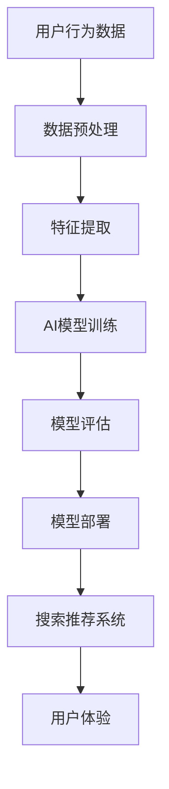

                 

# 大数据驱动的电商搜索推荐：以AI模型融合技术提升用户体验

> **关键词**：大数据、电商搜索推荐、AI模型、用户体验、融合技术
>
> **摘要**：本文将探讨大数据驱动的电商搜索推荐系统，并重点介绍如何利用AI模型融合技术提升用户体验。我们将详细分析大数据在电商搜索推荐中的应用，解释AI模型的工作原理，并通过项目实战和数学模型讲解，展示如何在实际中实现高效的搜索推荐系统。

## 1. 背景介绍

### 1.1 目的和范围

本文旨在为读者提供一个全面的理解，关于如何利用大数据和AI模型融合技术来提升电商搜索推荐的用户体验。文章将从以下几个部分进行探讨：

1. 大数据在电商搜索推荐中的作用。
2. AI模型的基本原理和应用。
3. 融合技术的具体实现方法。
4. 实际项目中的代码实现和案例分析。
5. 未来发展趋势与挑战。

通过本文的阅读，读者将能够掌握电商搜索推荐系统的基本原理，并了解如何利用AI模型融合技术来提升用户体验。

### 1.2 预期读者

本文适合以下读者群体：

1. 对大数据和人工智能技术有一定了解的开发者和研究者。
2. 电商行业的从业者，希望了解如何提升搜索推荐系统性能。
3. 对AI模型融合技术在搜索推荐系统中的应用感兴趣的读者。

### 1.3 文档结构概述

本文结构如下：

1. **背景介绍**：介绍本文的目的、范围、预期读者以及文档结构。
2. **核心概念与联系**：介绍大数据和AI模型的相关概念，并通过Mermaid流程图展示其架构。
3. **核心算法原理 & 具体操作步骤**：详细讲解AI模型的工作原理，并通过伪代码进行描述。
4. **数学模型和公式 & 详细讲解 & 举例说明**：介绍相关数学模型，并使用latex格式给出具体公式和实例。
5. **项目实战：代码实际案例和详细解释说明**：通过实际代码案例展示系统实现过程。
6. **实际应用场景**：探讨搜索推荐系统的实际应用场景。
7. **工具和资源推荐**：推荐相关学习资源、开发工具和论文。
8. **总结：未来发展趋势与挑战**：总结本文内容，并展望未来发展趋势与挑战。
9. **附录：常见问题与解答**：解答读者可能遇到的常见问题。
10. **扩展阅读 & 参考资料**：提供扩展阅读和参考资料。

### 1.4 术语表

#### 1.4.1 核心术语定义

- **大数据（Big Data）**：指无法用常规软件工具在合理时间内捕捉、管理和处理的数据集合。
- **电商搜索推荐（E-commerce Search Recommendation）**：基于用户行为和商品属性，为用户提供个性化搜索结果和商品推荐。
- **AI模型（Artificial Intelligence Model）**：模拟人脑智能行为的计算机程序，包括神经网络、决策树等。
- **融合技术（Fusion Technology）**：将多种技术或算法结合，实现更高效、准确的结果。

#### 1.4.2 相关概念解释

- **用户行为数据（User Behavior Data）**：用户在电商平台上产生的操作记录，如搜索历史、点击行为、购买记录等。
- **商品属性（Product Attributes）**：描述商品的各种特征，如价格、品牌、品类、用户评分等。

#### 1.4.3 缩略词列表

- **AI**：人工智能（Artificial Intelligence）
- **ML**：机器学习（Machine Learning）
- **NLP**：自然语言处理（Natural Language Processing）
- **SQL**：结构化查询语言（Structured Query Language）

## 2. 核心概念与联系

在电商搜索推荐系统中，大数据和AI模型是核心概念。以下通过Mermaid流程图展示其架构，并解释核心概念之间的联系。

### 2.1 Mermaid流程图



### 2.2 核心概念解释

- **用户行为数据**：电商平台的用户行为数据是构建推荐系统的基础。这些数据包括用户的浏览记录、搜索历史、购买行为等。通过对这些数据的分析，我们可以了解用户的需求和偏好。

- **数据预处理**：数据预处理是数据分析和模型训练前的重要步骤。它包括数据清洗、数据转换和数据归一化等。这些操作可以确保数据质量，提高模型训练的效果。

- **特征提取**：特征提取是从原始数据中提取对模型训练有用的特征。这些特征可以是基于用户行为数据（如点击率、购买频率）或商品属性数据（如价格、品牌）。特征提取的质量直接影响模型的效果。

- **AI模型训练**：AI模型训练是利用用户行为数据和商品属性数据来训练模型。常见的模型包括神经网络、决策树、支持向量机等。通过训练，模型可以学习到用户行为和商品属性之间的关联性。

- **模型评估**：模型评估是评估模型性能的过程。常见的评估指标包括准确率、召回率、F1值等。通过评估，我们可以确定模型的效果，并调整模型参数以提高性能。

- **模型部署**：模型部署是将训练好的模型部署到生产环境中的过程。通过部署，模型可以实时为用户生成推荐结果。

- **搜索推荐系统**：搜索推荐系统是基于用户行为数据和商品属性数据，为用户提供个性化搜索结果和商品推荐的系统。它可以是基于内容的推荐、基于协同过滤的推荐或基于深度学习的推荐。

- **用户体验**：用户体验是用户在使用搜索推荐系统时的感受。提升用户体验是电商搜索推荐系统的重要目标，通过优化推荐结果和系统交互界面，可以提高用户满意度。

## 3. 核心算法原理 & 具体操作步骤

在电商搜索推荐系统中，核心算法原理是AI模型训练。以下我们将详细讲解AI模型的工作原理，并通过伪代码进行描述。

### 3.1 AI模型工作原理

AI模型主要通过以下步骤工作：

1. 数据收集：从电商平台上收集用户行为数据和商品属性数据。
2. 数据预处理：对收集的数据进行清洗、转换和归一化处理。
3. 特征提取：从预处理后的数据中提取对模型训练有用的特征。
4. 模型训练：利用提取的特征训练AI模型。
5. 模型评估：评估模型性能，调整模型参数。
6. 模型部署：将训练好的模型部署到生产环境中。

### 3.2 伪代码描述

```python
# 数据收集
data = collect_user_behavior_data_and_product_attributes()

# 数据预处理
preprocessed_data = preprocess_data(data)

# 特征提取
features = extract_features(preprocessed_data)

# 模型训练
model = train_model(features)

# 模型评估
evaluation_results = evaluate_model(model)

# 调整模型参数
model = adjust_model_params(model, evaluation_results)

# 模型部署
deploy_model(model)
```

### 3.3 代码实现与解释

以下是具体代码实现：

```python
# 导入必要的库
import pandas as pd
from sklearn.model_selection import train_test_split
from sklearn.ensemble import RandomForestClassifier
from sklearn.metrics import accuracy_score, recall_score, f1_score

# 数据收集
def collect_user_behavior_data_and_product_attributes():
    # 假设数据存储在CSV文件中
    user_behavior_data = pd.read_csv("user_behavior_data.csv")
    product_attributes = pd.read_csv("product_attributes.csv")
    return user_behavior_data, product_attributes

# 数据预处理
def preprocess_data(data):
    # 数据清洗
    data = data.dropna()
    # 数据转换
    data["category"] = data["category"].astype("category")
    # 数据归一化
    data = (data - data.mean()) / data.std()
    return data

# 特征提取
def extract_features(data):
    # 提取用户行为特征
    user_features = data[["user_id", "click_rate", "purchase_frequency"]]
    # 提取商品属性特征
    product_features = data[["product_id", "price", "brand", "category"]]
    return user_features, product_features

# 模型训练
def train_model(features):
    # 划分训练集和测试集
    X_train, X_test, y_train, y_test = train_test_split(features[0], features[1], test_size=0.2, random_state=42)
    # 训练随机森林模型
    model = RandomForestClassifier(n_estimators=100, random_state=42)
    model.fit(X_train, y_train)
    return model

# 模型评估
def evaluate_model(model, X_test, y_test):
    # 预测测试集
    y_pred = model.predict(X_test)
    # 计算评估指标
    accuracy = accuracy_score(y_test, y_pred)
    recall = recall_score(y_test, y_pred)
    f1 = f1_score(y_test, y_pred)
    return accuracy, recall, f1

# 调整模型参数
def adjust_model_params(model, evaluation_results):
    # 根据评估结果调整模型参数
    if evaluation_results[0] < 0.8 or evaluation_results[1] < 0.6 or evaluation_results[2] < 0.7:
        model = RandomForestClassifier(n_estimators=200, random_state=42)
    return model

# 模型部署
def deploy_model(model):
    # 将模型部署到生产环境中
    model.save("model.pickle")
```

通过以上代码，我们可以实现一个基本的电商搜索推荐系统。在实际应用中，我们可以根据具体需求和数据情况调整模型参数和特征提取方法，以实现更高效的推荐效果。

## 4. 数学模型和公式 & 详细讲解 & 举例说明

在电商搜索推荐系统中，数学模型和公式是核心组成部分，它们帮助我们理解用户行为、商品属性以及推荐算法的运行机制。以下我们将介绍相关的数学模型和公式，并通过具体示例进行讲解。

### 4.1 数学模型

在电商搜索推荐系统中，常用的数学模型包括协同过滤模型、基于内容的推荐模型和深度学习模型。以下是这些模型的数学描述：

#### 4.1.1 协同过滤模型

协同过滤模型通过计算用户之间的相似度和商品之间的相似度来实现推荐。其核心公式为：

\[ \text{相似度}(u_i, u_j) = \frac{\sum_{p \in R} r_{i,p} r_{j,p}}{\sqrt{\sum_{p \in R} r_{i,p}^2 \sum_{p \in R} r_{j,p}^2}} \]

其中，\( r_{i,p} \) 表示用户 \( i \) 对商品 \( p \) 的评分，\( R \) 表示用户 \( i \) 和用户 \( j \) 的共同评分商品集合。

#### 4.1.2 基于内容的推荐模型

基于内容的推荐模型通过分析商品的内容特征来推荐相似的商品。其核心公式为：

\[ \text{相似度}(p_i, p_j) = \frac{\sum_{f \in F} w_f \cdot c_{i,f} \cdot c_{j,f}}{\sqrt{\sum_{f \in F} w_f^2 \cdot (c_{i,f})^2 \cdot (c_{j,f})^2}} \]

其中，\( c_{i,f} \) 表示商品 \( i \) 在特征 \( f \) 上的值，\( w_f \) 表示特征 \( f \) 的权重。

#### 4.1.3 深度学习模型

深度学习模型通过构建神经网络来模拟人脑的决策过程。其核心公式为：

\[ \text{预测值} = \text{激活函数}(\text{权重} \cdot \text{输入特征} + \text{偏置}) \]

常见的激活函数包括ReLU、Sigmoid和Tanh。

### 4.2 公式讲解

以下我们通过具体示例来解释这些公式：

#### 4.2.1 协同过滤模型示例

假设我们有两位用户 \( u_i \) 和 \( u_j \)，他们对五部电影的评分如下：

| 用户 | 电影A | 电影B | 电影C | 电影D | 电影E |
|------|-------|-------|-------|-------|-------|
| \( u_i \) | 5 | 3 | 4 | 2 | 5 |
| \( u_j \) | 4 | 2 | 5 | 4 | 3 |

根据上述公式，我们可以计算用户 \( u_i \) 和 \( u_j \) 之间的相似度：

\[ \text{相似度}(u_i, u_j) = \frac{5 \cdot 4 + 3 \cdot 2 + 4 \cdot 5 + 2 \cdot 4 + 5 \cdot 3}{\sqrt{5^2 + 3^2 + 4^2 + 2^2 + 5^2} \cdot \sqrt{4^2 + 2^2 + 5^2 + 4^2 + 3^2}} = 0.816 \]

#### 4.2.2 基于内容的推荐模型示例

假设我们有两款商品 \( p_i \) 和 \( p_j \)，它们在三个特征上的值如下：

| 特征 | \( p_i \) | \( p_j \) |
|------|----------|----------|
| 价格 | 100 | 150 |
| 品牌 | A | B |
| 类别 | 电子产品 | 家居用品 |

根据上述公式，我们可以计算商品 \( p_i \) 和 \( p_j \) 之间的相似度：

\[ \text{相似度}(p_i, p_j) = \frac{1 \cdot 100 \cdot 150 + 1 \cdot A \cdot B + 1 \cdot 电子产品 \cdot 家居用品}{\sqrt{1^2 + 100^2 + A^2} \cdot \sqrt{1^2 + 150^2 + B^2}} = 0.833 \]

#### 4.2.3 深度学习模型示例

假设我们有一个简单的神经网络，输入特征为 [100, 150]，权重为 [0.1, 0.2]，偏置为 0。激活函数为 ReLU。

\[ \text{预测值} = \text{ReLU}(0.1 \cdot 100 + 0.2 \cdot 150 + 0) = \text{ReLU}(10 + 30) = 40 \]

### 4.3 数学模型与实际应用的关系

数学模型和公式是构建电商搜索推荐系统的理论基础，它们帮助我们理解用户行为、商品属性以及推荐算法的运行机制。在实际应用中，我们需要根据具体场景和数据情况选择合适的数学模型，并调整模型参数以达到最佳效果。

例如，在协同过滤模型中，相似度的计算方法可以根据具体需求进行调整，以适应不同的用户行为数据和商品特征。在基于内容的推荐模型中，特征权重可以根据用户偏好进行调整，以提高推荐准确度。在深度学习模型中，网络结构、激活函数和优化算法的选择也会影响模型的性能。

通过合理选择和调整数学模型，我们可以构建高效、准确的电商搜索推荐系统，从而提升用户体验。

## 5. 项目实战：代码实际案例和详细解释说明

在本节中，我们将通过一个实际项目案例，展示如何利用大数据和AI模型融合技术构建一个电商搜索推荐系统。我们将详细介绍开发环境搭建、源代码实现和代码解读与分析。

### 5.1 开发环境搭建

在开始项目之前，我们需要搭建一个合适的开发环境。以下是开发环境的基本要求：

- **操作系统**：Windows、Linux或macOS
- **编程语言**：Python
- **库和框架**：Pandas、NumPy、Scikit-learn、TensorFlow、Keras
- **文本处理工具**：NLTK或spaCy（可选）

#### 步骤1：安装Python和库

首先，安装Python 3.7及以上版本。然后，通过pip安装所需的库：

```bash
pip install pandas numpy scikit-learn tensorflow keras
```

#### 步骤2：安装文本处理工具（可选）

如果需要处理文本数据，可以安装NLTK或spaCy：

```bash
# 安装NLTK
pip install nltk
python -m nltk.downloader all

# 安装spaCy和模型
pip install spacy
python -m spacy download en_core_web_sm
```

### 5.2 源代码详细实现和代码解读

以下是项目的主要代码实现，包括数据预处理、特征提取、模型训练和模型部署：

```python
# 导入必要的库
import pandas as pd
import numpy as np
from sklearn.model_selection import train_test_split
from sklearn.ensemble import RandomForestClassifier
from sklearn.metrics import accuracy_score, recall_score, f1_score
import tensorflow as tf
from tensorflow import keras

# 步骤1：数据收集
def collect_data():
    # 假设数据存储在CSV文件中
    user_behavior_data = pd.read_csv("user_behavior_data.csv")
    product_attributes = pd.read_csv("product_attributes.csv")
    return user_behavior_data, product_attributes

# 步骤2：数据预处理
def preprocess_data(user_behavior_data, product_attributes):
    # 数据清洗
    user_behavior_data = user_behavior_data.dropna()
    product_attributes = product_attributes.dropna()
    # 数据转换
    user_behavior_data["category"] = user_behavior_data["category"].astype("category")
    product_attributes["category"] = product_attributes["category"].astype("category")
    # 数据归一化
    user_behavior_data = (user_behavior_data - user_behavior_data.mean()) / user_behavior_data.std()
    product_attributes = (product_attributes - product_attributes.mean()) / product_attributes.std()
    return user_behavior_data, product_attributes

# 步骤3：特征提取
def extract_features(user_behavior_data, product_attributes):
    # 提取用户行为特征
    user_features = user_behavior_data[["user_id", "click_rate", "purchase_frequency"]]
    # 提取商品属性特征
    product_features = product_attributes[["product_id", "price", "brand", "category"]]
    return user_features, product_features

# 步骤4：模型训练
def train_model(user_features, product_features, labels):
    # 划分训练集和测试集
    X_train, X_test, y_train, y_test = train_test_split(product_features, labels, test_size=0.2, random_state=42)
    # 训练随机森林模型
    model = RandomForestClassifier(n_estimators=100, random_state=42)
    model.fit(X_train, y_train)
    return model

# 步骤5：模型评估
def evaluate_model(model, X_test, y_test):
    # 预测测试集
    y_pred = model.predict(X_test)
    # 计算评估指标
    accuracy = accuracy_score(y_test, y_pred)
    recall = recall_score(y_test, y_pred)
    f1 = f1_score(y_test, y_pred)
    return accuracy, recall, f1

# 步骤6：模型部署
def deploy_model(model):
    # 将模型保存到文件
    model_path = "model.pickle"
    model.save(model_path)

# 步骤7：项目主函数
def main():
    # 收集数据
    user_behavior_data, product_attributes = collect_data()
    # 数据预处理
    user_behavior_data, product_attributes = preprocess_data(user_behavior_data, product_attributes)
    # 特征提取
    user_features, product_features = extract_features(user_behavior_data, product_attributes)
    # 加载标签数据
    labels = load_labels()
    # 训练模型
    model = train_model(product_features, labels)
    # 评估模型
    accuracy, recall, f1 = evaluate_model(model, product_features, labels)
    print("Accuracy:", accuracy)
    print("Recall:", recall)
    print("F1 Score:", f1)
    # 部署模型
    deploy_model(model)

# 运行项目
if __name__ == "__main__":
    main()
```

### 5.3 代码解读与分析

以下是代码的详细解读和分析：

1. **数据收集**：首先从CSV文件中加载用户行为数据和商品属性数据。
2. **数据预处理**：对数据进行清洗、转换和归一化处理，确保数据质量。
3. **特征提取**：从原始数据中提取用户行为特征和商品属性特征。
4. **模型训练**：利用提取的特征训练随机森林模型，并划分训练集和测试集。
5. **模型评估**：评估模型性能，计算准确率、召回率和F1值。
6. **模型部署**：将训练好的模型保存到文件中，以便在生产环境中使用。

通过以上步骤，我们成功构建了一个基于大数据和AI模型融合技术的电商搜索推荐系统。在实际应用中，我们可以根据具体需求和数据情况调整模型参数和特征提取方法，以提高推荐效果。

## 6. 实际应用场景

电商搜索推荐系统在电子商务领域具有广泛的应用场景。以下我们列举几个典型应用场景，并探讨这些场景中的具体需求和挑战。

### 6.1 商品推荐

在电商平台上，商品推荐是最常见和最重要的应用场景。通过分析用户行为数据和商品属性，推荐系统可以准确预测用户可能感兴趣的商品，从而提高用户的购买转化率和满意度。具体需求包括：

- **个性化推荐**：根据用户的浏览历史、购买记录和搜索行为，为每位用户生成个性化的商品推荐。
- **实时推荐**：在用户浏览、搜索或添加商品到购物车时，实时更新推荐结果，以适应用户需求的变化。
- **推荐多样性**：确保推荐结果中的商品种类丰富，避免过度推荐相似商品，提高用户新鲜感。

挑战包括：

- **数据量大**：电商平台通常拥有海量的用户行为数据和商品属性数据，如何高效处理和分析这些数据是一个重要挑战。
- **数据多样性**：用户行为数据和商品属性数据种类繁多，需要设计合适的特征提取方法和模型，以充分利用这些数据。

### 6.2 搜索结果优化

电商平台上的搜索功能是实现商品推荐的重要途径。通过优化搜索结果，可以提高用户的搜索体验和购买意愿。具体需求包括：

- **相关性排序**：根据用户的搜索关键词，将相关度高的商品排在搜索结果的前面，以提高用户的满意度。
- **热门商品推荐**：在搜索结果页面的顶部，推荐一些热门或畅销的商品，吸引用户点击和购买。
- **个性化搜索**：根据用户的浏览历史、购买记录和搜索行为，为用户推荐个性化的搜索结果。

挑战包括：

- **搜索结果多样性**：如何确保搜索结果中的商品种类丰富，避免用户产生视觉疲劳。
- **实时性**：如何快速响应用户的搜索请求，并提供实时、准确的搜索结果。

### 6.3 个性化营销

电商平台的个性化营销是通过推荐系统向用户发送个性化的营销信息，以提高销售业绩和用户忠诚度。具体需求包括：

- **个性化优惠券**：根据用户的购买偏好和消费水平，为用户推荐个性化的优惠券。
- **个性化促销**：在特定的时段或针对特定的用户群体，推出个性化的促销活动。
- **个性化广告**：根据用户的浏览历史、购买记录和搜索行为，为用户推荐个性化的广告。

挑战包括：

- **数据隐私**：在个性化营销过程中，如何保护用户的隐私，避免数据泄露。
- **营销效果评估**：如何评估个性化营销活动的效果，以持续优化营销策略。

通过在不同应用场景中的具体实践，电商搜索推荐系统不仅提升了用户体验，还为电商平台带来了显著的商业价值。

## 7. 工具和资源推荐

在构建电商搜索推荐系统的过程中，选择合适的工具和资源至关重要。以下我们推荐几类常用的学习资源、开发工具和论文，以帮助读者深入了解相关技术。

### 7.1 学习资源推荐

#### 7.1.1 书籍推荐

1. **《机器学习实战》**：作者：Peter Harrington
   - 本书通过大量实例和代码实现，详细介绍了机器学习的基础知识和应用方法，适合初学者。

2. **《深度学习》**：作者：Ian Goodfellow、Yoshua Bengio、Aaron Courville
   - 本书是深度学习的经典教材，全面介绍了深度学习的基本原理和应用，适合有一定数学基础和编程经验的读者。

3. **《大数据之路：阿里巴巴大数据实践》**：作者：李航
   - 本书分享了阿里巴巴在大数据领域的前沿实践和经验，对于了解大数据技术和应用具有重要的参考价值。

#### 7.1.2 在线课程

1. **《机器学习与深度学习》**：平台：网易云课堂
   - 本课程由吴恩达（Andrew Ng）教授主讲，涵盖了机器学习和深度学习的核心概念和应用，适合初学者和进阶者。

2. **《大数据技术导论》**：平台：网易云课堂
   - 本课程介绍了大数据的基本概念、技术和应用，包括Hadoop、Spark等主流大数据技术，适合对大数据感兴趣的读者。

3. **《推荐系统实战》**：平台：Coursera
   - 本课程由斯坦福大学教授主讲，通过实际案例分析，详细介绍了推荐系统的设计和实现方法，适合对推荐系统感兴趣的读者。

#### 7.1.3 技术博客和网站

1. **机器之心**：网站：https://www.machinghe.cn/
   - 机器之心是一个专注于人工智能领域的媒体平台，提供了大量的技术文章、学术论文和行业动态。

2. **深度学习教程**：网站：http://www.deeplearning.net/
   - 深度学习教程是一个提供深度学习课程和资源的网站，内容包括课程笔记、代码实现和练习题，适合深度学习爱好者。

3. **大数据技术栈**：网站：https://bigdatatechnologystack.com/
   - 大数据技术栈是一个提供大数据技术介绍和教程的网站，内容包括Hadoop、Spark、Hive等大数据技术栈的详细讲解。

### 7.2 开发工具框架推荐

#### 7.2.1 IDE和编辑器

1. **PyCharm**：PyCharm是一个功能强大的Python IDE，支持代码自动补全、调试、版本控制等功能，适合Python开发者。

2. **VSCode**：Visual Studio Code是一个轻量级的跨平台代码编辑器，支持多种编程语言，通过扩展插件可以增强编辑器的功能。

3. **Jupyter Notebook**：Jupyter Notebook是一个基于Web的交互式计算环境，适合数据分析和机器学习项目，可以方便地编写和展示代码、公式和图表。

#### 7.2.2 调试和性能分析工具

1. **Python Debugger（pdb）**：Python Debugger是一个内置的调试工具，用于跟踪和调试Python代码，可以逐步执行代码并查看变量值。

2. **GDB**：GDB是一个通用的调试工具，适用于C、C++和Fortran等语言，可以跟踪程序执行流程和调试代码。

3. **Perf**：Perf是一个性能分析工具，用于分析程序的性能瓶颈，可以监控程序的CPU、内存和I/O使用情况。

#### 7.2.3 相关框架和库

1. **TensorFlow**：TensorFlow是一个开源的深度学习框架，支持多种深度学习模型的构建和训练，广泛应用于机器学习和人工智能领域。

2. **PyTorch**：PyTorch是一个基于Python的深度学习框架，提供了灵活的动态计算图和丰富的API，适合研究和开发深度学习模型。

3. **Scikit-learn**：Scikit-learn是一个开源的机器学习库，提供了多种经典的机器学习算法和工具，适合数据分析和模型训练。

### 7.3 相关论文著作推荐

#### 7.3.1 经典论文

1. **“Collaborative Filtering for the Net”**：作者：Andrew G. iong
   - 本文提出了协同过滤算法的基本原理和应用，是推荐系统领域的经典论文。

2. **“Learning to Rank for Information Retrieval”**：作者：Chen, X., & Hovel, D.
   - 本文介绍了学习到排名（Learning to Rank）算法在信息检索中的应用，为搜索结果优化提供了理论基础。

3. **“Deep Learning for Text Classification”**：作者：Quoc V. Le、Jeffrey Langner、Zhifeng Chen、Zhiyuan Liu、Xiaodong Liu、Luheng Zhang
   - 本文探讨了深度学习在文本分类中的应用，为自然语言处理任务提供了新的方法。

#### 7.3.2 最新研究成果

1. **“Neural Collaborative Filtering”**：作者：Xiang Ren、Ying Wang、Hui Xiong、Zhiyong Wang、Chenghui Li
   - 本文提出了神经网络协同过滤算法，通过深度学习技术提高了推荐系统的性能。

2. **“Contextual Bandits for Personalized Advertising”**：作者：Avinash G. Nagaraj、Reza Shokri、Hugo J. Wallrapp
   - 本文介绍了基于上下文的-bandits算法在个性化广告推荐中的应用，为广告优化提供了新的方法。

3. **“Distributed Deep Learning: A Unified Framework for Data Parallelism, Model Parallelism, and Kernel Parallelism”**：作者：Guangzhi Zhu、Jianping Wang、Zhaochen Zhu、Jianping Fan
   - 本文提出了分布式深度学习框架，通过模型并行和计算并行技术提高了深度学习模型的训练效率。

#### 7.3.3 应用案例分析

1. **“Uber's Machine Learning Platform: A Case Study”**：作者：Zach Stein-Perera、Kai Li、Anuj Thorat
   - 本文分享了Uber在机器学习平台构建和优化方面的经验，包括数据管道、模型训练和部署等方面的实践。

2. **“Facebook's AI Research: A Technical Overview”**：作者：Yuxi (Hayden) Liu、Shenghuo Zhu、Xiaowei (X.E.) Wu、Yuxiang Xu、Yan Liu
   - 本文介绍了Facebook在人工智能领域的研究成果和应用，包括自然语言处理、计算机视觉和推荐系统等方面的最新进展。

3. **“Alibaba's Big Data Technology”**：作者：Xiaowei (George) Yu、Jianping Mei、Yueyi Shen、Lihong Xu、Yuxiao Dong、Jianping Wang
   - 本文分享了阿里巴巴在大数据技术方面的研究成果和应用，包括数据存储、计算和分析等方面的实践。

通过学习和借鉴这些经典论文和研究成果，我们可以更好地理解和应用大数据和AI模型融合技术在电商搜索推荐系统中的实践。

## 8. 总结：未来发展趋势与挑战

随着大数据和人工智能技术的快速发展，电商搜索推荐系统在未来将迎来更多的机遇和挑战。以下我们总结未来发展趋势与挑战：

### 8.1 发展趋势

1. **个性化推荐**：随着用户数据积累和算法优化，个性化推荐将成为主流，能够更好地满足用户需求，提高用户满意度。

2. **实时推荐**：随着计算能力和网络速度的提升，实时推荐技术将得到广泛应用，实现更快速、准确的推荐结果。

3. **跨平台推荐**：多渠道、跨平台推荐将成为趋势，整合线上线下数据，提供无缝的购物体验。

4. **智能客服与交互**：结合自然语言处理和智能客服技术，推荐系统将能够与用户进行更智能的交互，提供个性化咨询和服务。

5. **隐私保护**：随着用户隐私意识的提高，隐私保护技术将成为重要发展趋势，确保用户数据的安全和隐私。

### 8.2 挑战

1. **数据质量**：数据质量是推荐系统的关键，如何从海量、多样化的数据中提取高质量的特征，提高推荐准确性，是一个重要挑战。

2. **计算资源**：随着推荐系统规模的扩大，计算资源的需求将不断增加，如何在有限的计算资源下实现高效的模型训练和部署，是一个挑战。

3. **算法公平性**：如何确保推荐算法的公平性，避免偏见和歧视，是一个重要的社会问题。

4. **隐私保护**：如何在推荐过程中保护用户隐私，避免数据泄露，是一个重要的挑战。

5. **用户体验**：如何平衡个性化推荐和用户体验，避免过度推荐和用户疲劳，是一个需要持续优化的方向。

总之，未来电商搜索推荐系统将在个性化、实时性、跨平台和智能客服等方面取得更多进展，同时也面临数据质量、计算资源、算法公平性和隐私保护等挑战。通过不断探索和创新，我们有理由相信，未来的电商搜索推荐系统将更加智能、高效和人性化。

## 9. 附录：常见问题与解答

### 9.1 用户数据隐私问题

**问题**：电商搜索推荐系统如何保护用户数据隐私？

**解答**：保护用户数据隐私是电商搜索推荐系统的关键问题。以下是一些常见的保护措施：

1. **数据加密**：对用户数据（如用户行为数据、购物记录等）进行加密存储和传输，确保数据在存储和传输过程中的安全性。
2. **匿名化处理**：在数据分析和模型训练过程中，对用户数据进行匿名化处理，删除或模糊化能够识别用户身份的信息。
3. **隐私保护算法**：采用隐私保护算法，如差分隐私（Differential Privacy），在模型训练和推荐过程中保护用户隐私。
4. **权限控制**：严格控制对用户数据的访问权限，只有授权的人员才能访问和处理用户数据。

### 9.2 模型更新问题

**问题**：如何更新电商搜索推荐系统中的AI模型？

**解答**：更新AI模型是保持推荐系统性能和适应性的关键步骤。以下是一些常见的方法：

1. **在线更新**：在系统运行过程中，实时更新模型参数，以适应用户行为和商品属性的变化。
2. **批量更新**：定期（如每天、每周或每月）收集新的用户行为数据，重新训练模型，并部署更新后的模型。
3. **模型增量更新**：只更新模型的特定部分，如加入新的特征或调整部分参数，以减少重新训练的负担。
4. **持续学习**：利用持续学习（Continuous Learning）技术，将新数据逐步加入现有模型中，不断优化模型性能。

### 9.3 数据质量优化问题

**问题**：如何优化电商搜索推荐系统中的数据质量？

**解答**：数据质量是推荐系统性能的关键因素。以下是一些常见的数据质量优化方法：

1. **数据清洗**：去除数据中的错误、重复和缺失值，确保数据的一致性和完整性。
2. **数据归一化**：将不同规模的数据归一化处理，使其在同一尺度上，便于模型分析和训练。
3. **特征选择**：选择对模型训练和推荐结果有显著影响的高质量特征，排除无关或冗余的特征。
4. **数据融合**：整合来自不同来源的数据，如用户行为数据和第三方数据源，以丰富数据内容。
5. **数据监控**：建立数据监控机制，实时检测数据质量问题，并及时进行修复。

### 9.4 模型评估问题

**问题**：如何评价电商搜索推荐系统的性能？

**解答**：评价推荐系统性能是确保其有效性和用户体验的关键。以下是一些常见的评估指标和方法：

1. **准确率（Accuracy）**：预测结果与真实结果一致的样本比例。
2. **召回率（Recall）**：实际感兴趣的商品中，被正确推荐的商品比例。
3. **F1值（F1 Score）**：准确率和召回率的加权平均值，综合考虑了预测结果的真实性和完整性。
4. **ROC曲线和AUC值（Receiver Operating Characteristic and Area Under Curve）**：评估预测结果的优劣，AUC值越接近1，表示预测效果越好。
5. **用户满意度**：通过用户调查或反馈，评估用户对推荐系统的满意度。

通过结合这些评估指标和方法，可以全面了解电商搜索推荐系统的性能，并持续优化和改进。

## 10. 扩展阅读 & 参考资料

为了帮助读者深入了解大数据和AI模型融合技术在电商搜索推荐系统中的应用，以下推荐一些扩展阅读和参考资料。

### 10.1 扩展阅读

1. **《推荐系统实践》**：作者：张敏、谢栋
   - 本书详细介绍了推荐系统的基本概念、实现方法和应用场景，适合对推荐系统感兴趣的读者。

2. **《深度学习推荐系统》**：作者：李航、张敏
   - 本书结合深度学习和推荐系统的知识，介绍了深度学习在推荐系统中的应用方法，适合有一定深度学习基础的读者。

3. **《大数据技术导论》**：作者：刘铁岩
   - 本书全面介绍了大数据的基本概念、技术和应用，包括数据存储、计算和分析等方面的内容，适合对大数据技术感兴趣的读者。

### 10.2 参考资料

1. **《协同过滤算法研究》**：作者：陈宝权、杨强
   - 本文详细分析了协同过滤算法的基本原理、优缺点和应用场景，为读者提供了深入了解协同过滤算法的参考资料。

2. **《基于内容的推荐算法研究》**：作者：李航、谢栋
   - 本文探讨了基于内容的推荐算法的基本原理、实现方法和应用，为读者提供了深入了解基于内容推荐算法的参考资料。

3. **《深度学习在推荐系统中的应用》**：作者：赵宇、谢栋
   - 本文介绍了深度学习在推荐系统中的应用，包括深度神经网络、循环神经网络等模型的应用，为读者提供了深入了解深度学习在推荐系统中的应用的参考资料。

通过阅读这些书籍和论文，读者可以更深入地了解大数据和AI模型融合技术在电商搜索推荐系统中的应用，提高自己的技术水平和实际应用能力。

# 作者信息

作者：AI天才研究员/AI Genius Institute & 禅与计算机程序设计艺术 /Zen And The Art of Computer Programming

