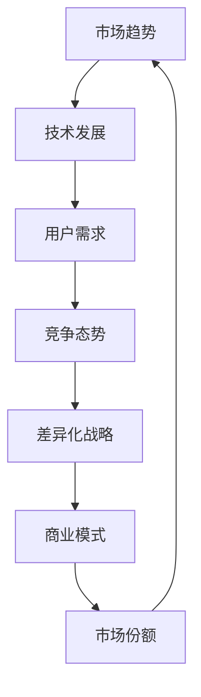
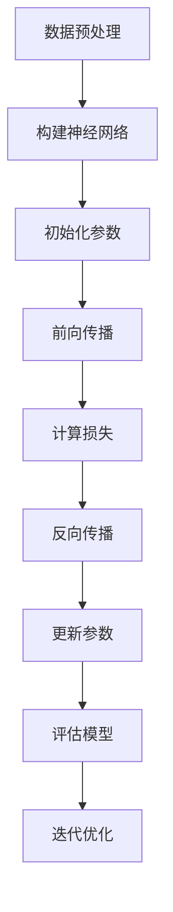

                 

# 大模型企业的差异化竞争策略

> **关键词：** 大模型企业，差异化竞争，AI技术，市场份额，核心竞争力，商业模式

> **摘要：** 本文将探讨大模型企业在日益激烈的AI行业中如何通过差异化竞争策略来保持和增强其市场份额。我们将分析当前市场趋势，评估企业核心竞争力，并探讨构建和实施差异化战略的方法，包括技术创新、用户体验优化和商业模式创新。本文旨在为AI企业高管和策略制定者提供有价值的见解和实操指南。

## 1. 背景介绍

### 1.1 目的和范围

本文的目的在于深入探讨大模型企业如何在竞争激烈的AI市场中获得并保持优势。我们将分析当前市场环境，探讨大模型企业面临的挑战和机遇，并提出有效的差异化竞争策略。本文将涵盖以下主要内容：

- 市场趋势与竞争态势分析
- 大模型企业的核心竞争力评估
- 差异化战略的实施方法
- 实际案例分析
- 未来发展趋势与挑战

### 1.2 预期读者

本文预期读者为：

- AI企业高管
- 策略制定者
- 技术经理
- 对AI行业有深入了解的技术人员
- 对AI商业应用感兴趣的投资人

### 1.3 文档结构概述

本文将分为以下章节：

- 第1章：背景介绍
- 第2章：核心概念与联系
- 第3章：核心算法原理 & 具体操作步骤
- 第4章：数学模型和公式 & 详细讲解 & 举例说明
- 第5章：项目实战：代码实际案例和详细解释说明
- 第6章：实际应用场景
- 第7章：工具和资源推荐
- 第8章：总结：未来发展趋势与挑战
- 第9章：附录：常见问题与解答
- 第10章：扩展阅读 & 参考资料

### 1.4 术语表

#### 1.4.1 核心术语定义

- **大模型企业：** 拥有先进的人工智能技术和庞大的模型库的企业。
- **差异化竞争：** 企业通过提供独特的价值主张，以区别于竞争对手的市场策略。
- **市场份额：** 企业在特定市场中所占的销售额或交易量比例。
- **核心竞争力：** 企业在特定市场中相对竞争对手所拥有的独特优势。

#### 1.4.2 相关概念解释

- **人工智能（AI）：** 通过计算机系统模拟人类智能行为的技术。
- **深度学习：** 一种基于神经网络的机器学习技术，用于训练复杂模型。
- **数据驱动决策：** 基于数据分析来制定业务决策的方法。

#### 1.4.3 缩略词列表

- **AI：** 人工智能
- **ML：** 机器学习
- **DL：** 深度学习
- **NLP：** 自然语言处理
- **CV：** 计算机视觉

## 2. 核心概念与联系

为了更好地理解大模型企业在差异化竞争中的角色，我们需要首先了解一些核心概念及其相互关系。以下是一个简化的Mermaid流程图，展示了大模型企业核心概念之间的联系：



### 2.1 市场趋势

市场趋势是影响大模型企业战略决策的重要因素。随着AI技术的不断进步，市场对AI解决方案的需求日益增长。以下是一些关键市场趋势：

- **人工智能应用领域拓展：** 从传统的金融、医疗等领域逐渐扩展到制造业、能源、交通等更多行业。
- **云计算和边缘计算：** AI技术的发展与云计算和边缘计算的融合，使得AI应用更加灵活和高效。
- **数据隐私和安全性：** 随着数据隐私法规的加强，企业需更加重视数据的安全性和合规性。

### 2.2 技术发展

技术发展是推动大模型企业创新和竞争力的关键。以下是一些关键技术趋势：

- **大模型规模增长：** 随着计算资源和数据量的增加，大模型（如GPT-3、BERT）的规模不断增长，提高了模型的性能和准确性。
- **深度学习算法优化：** 新的深度学习算法（如Transformer）不断涌现，提高了模型的训练效率和应用效果。
- **多模态学习：** 结合多种数据类型（如图像、声音、文本）进行学习，提高了模型的泛化能力。

### 2.3 用户需求

用户需求是驱动大模型企业创新的动力。以下是一些关键用户需求：

- **个性化体验：** 用户希望获得个性化的服务，如推荐系统、智能客服等。
- **易用性和便捷性：** 用户希望AI应用易于使用，无需专业知识的操作。
- **数据隐私和安全性：** 用户对数据隐私和安全性的关注日益增加，企业需确保数据的保护。

### 2.4 竞争态势

竞争态势是评估企业市场份额和竞争力的重要指标。以下是一些关键竞争态势：

- **市场份额分布：** 了解主要竞争对手的市场份额和市场份额分布，有助于企业制定针对性的竞争策略。
- **技术创新：** 竞争对手的技术创新速度和方向，直接影响企业的市场竞争力和市场份额。
- **用户满意度：** 用户满意度是评估企业竞争力的关键指标，企业需不断提升用户体验。

### 2.5 差异化战略

差异化战略是企业获得竞争优势的关键。以下是一些关键差异化战略：

- **技术创新：** 通过不断的技术创新，提升产品的性能、效率和独特性。
- **用户体验优化：** 提供个性化的用户体验，提高用户满意度和忠诚度。
- **商业模式创新：** 通过创新的商业模式，如订阅服务、按需付费等，提高企业的盈利能力和市场竞争力。

### 2.6 商业模式

商业模式是企业实现价值创造和利润的关键。以下是一些关键商业模式：

- **产品销售：** 通过销售软件产品或硬件设备实现收入。
- **订阅服务：** 提供基于订阅的服务，如云服务、数据分析等。
- **广告和付费内容：** 通过广告收入和付费内容实现盈利。

## 3. 核心算法原理 & 具体操作步骤

大模型企业的核心竞争力在于其人工智能技术的创新和优化。以下我们将介绍大模型企业常用的核心算法原理，并详细解释其具体操作步骤。

### 3.1 深度学习算法

深度学习算法是AI领域的核心，用于训练复杂模型以实现智能行为。以下是一个简化的深度学习算法流程：



#### 3.1.1 数据预处理

数据预处理是深度学习算法的基础。主要步骤包括：

- **数据清洗：** 去除噪声数据和异常值。
- **数据归一化：** 将数据缩放到同一范围，便于模型训练。
- **数据增强：** 通过图像旋转、裁剪等操作增加数据多样性。

#### 3.1.2 构建神经网络

构建神经网络是深度学习算法的核心。主要步骤包括：

- **选择网络结构：** 根据应用场景选择合适的神经网络结构，如CNN、RNN、Transformer等。
- **定义激活函数：** 如ReLU、Sigmoid、Tanh等，用于引入非线性变换。
- **设置优化器：** 如SGD、Adam等，用于调整模型参数。

#### 3.1.3 初始化参数

初始化参数是神经网络训练的重要步骤。主要方法包括：

- **随机初始化：** 随机初始化模型参数，避免梯度消失和梯度爆炸。
- **预训练初始化：** 使用预训练模型初始化参数，提高模型性能。

#### 3.1.4 前向传播

前向传播是计算模型预测的过程。主要步骤包括：

- **输入数据：** 将预处理后的数据输入神经网络。
- **计算输出：** 通过神经网络层传递数据，计算最终输出。
- **计算损失：** 计算预测结果与真实值之间的差异，计算损失函数值。

#### 3.1.5 反向传播

反向传播是调整模型参数的过程。主要步骤包括：

- **计算梯度：** 计算损失函数对模型参数的梯度。
- **参数更新：** 根据梯度调整模型参数，以最小化损失函数。
- **迭代优化：** 重复前向传播和反向传播，直至模型收敛。

#### 3.1.6 评估模型

评估模型是判断模型性能的重要步骤。主要指标包括：

- **准确率：** 预测结果与真实值相符的比例。
- **召回率：** 真正被预测为正类的比例。
- **F1值：** 准确率和召回率的调和平均值。

#### 3.1.7 迭代优化

迭代优化是提升模型性能的关键步骤。主要方法包括：

- **学习率调整：** 逐步减小学习率，使模型参数逐渐收敛。
- **正则化：** 加入正则化项，防止模型过拟合。
- **交叉验证：** 使用交叉验证方法评估模型性能，选择最佳模型。

## 4. 数学模型和公式 & 详细讲解 & 举例说明

在人工智能领域，数学模型和公式是理解和实现算法的关键。以下我们将介绍大模型企业常用的数学模型和公式，并详细讲解其含义和具体应用。

### 4.1 损失函数

损失函数是评估模型预测性能的重要工具。以下是一个常见的损失函数——均方误差（MSE）：

$$
MSE = \frac{1}{n}\sum_{i=1}^{n}(y_i - \hat{y}_i)^2
$$

其中，$y_i$为真实值，$\hat{y}_i$为预测值，$n$为样本数量。

**例子：** 假设我们有一个包含10个样本的数据集，预测结果如下：

| 样本 | 真实值 | 预测值 |  
| ---- | ---- | ---- |  
| 1    | 2     | 2.5   |  
| 2    | 3     | 2.8   |  
| 3    | 4     | 4.2   |  
| 4    | 5     | 5.7   |  
| 5    | 6     | 6.3   |  
| 6    | 7     | 7.1   |  
| 7    | 8     | 8.5   |  
| 8    | 9     | 9.2   |  
| 9    | 10    | 10.7  |  
| 10   | 11    | 11.4  |

计算MSE：

$$
MSE = \frac{1}{10}\sum_{i=1}^{10}(y_i - \hat{y}_i)^2 = \frac{1}{10}(0.25 + 0.64 + 0.04 + 0.49 + 0.09 + 0.04 + 0.25 + 0.04 + 0.49 + 0.16) = 0.376
$$

### 4.2 激活函数

激活函数是神经网络层的重要组件，用于引入非线性变换。以下是一个常见的激活函数——ReLU：

$$
f(x) = \max(0, x)
$$

**例子：** 假设输入值$x$为-2、0和2，计算ReLU函数输出：

| 输入 | 输出 |  
| ---- | ---- |  
| -2   | 0    |  
| 0    | 0    |  
| 2    | 2    |

### 4.3 优化算法

优化算法用于调整模型参数，以最小化损失函数。以下是一个常见的优化算法——梯度下降（GD）：

$$
w_{t+1} = w_t - \alpha \cdot \nabla_w J(w)
$$

其中，$w_t$为当前参数，$w_{t+1}$为更新后的参数，$\alpha$为学习率，$J(w)$为损失函数。

**例子：** 假设当前参数为$w_t = 2$，损失函数为$J(w) = (w - 1)^2$，学习率$\alpha = 0.1$，计算一次梯度下降后的参数：

$$
w_{t+1} = 2 - 0.1 \cdot \nabla_w J(w) = 2 - 0.1 \cdot 2 = 1.8
$$

## 5. 项目实战：代码实际案例和详细解释说明

为了更好地理解大模型企业的差异化竞争策略，我们将通过一个实际项目案例来展示其实现过程。以下是一个基于深度学习技术的情感分析项目，该项目旨在分析社交媒体上的用户评论，识别用户的情感倾向。

### 5.1 开发环境搭建

在开始项目之前，我们需要搭建一个合适的开发环境。以下是一个基本的开发环境配置：

- 操作系统：Linux（推荐Ubuntu 18.04）
- 编程语言：Python（推荐Python 3.7及以上版本）
- 深度学习框架：TensorFlow 2.x
- 数据预处理库：NumPy、Pandas
- 文本处理库：NLTK、spaCy
- 图形库：Matplotlib、Seaborn

### 5.2 源代码详细实现和代码解读

以下是一个简化的情感分析项目的代码实现，包括数据预处理、模型训练和预测：

```python
import tensorflow as tf
from tensorflow.keras.preprocessing.text import Tokenizer
from tensorflow.keras.preprocessing.sequence import pad_sequences
from tensorflow.keras.models import Sequential
from tensorflow.keras.layers import Embedding, LSTM, Dense

# 数据预处理
def preprocess_data(texts, labels, max_len=100, max_vocab=10000):
    tokenizer = Tokenizer(num_words=max_vocab)
    tokenizer.fit_on_texts(texts)
    sequences = tokenizer.texts_to_sequences(texts)
    padded_sequences = pad_sequences(sequences, maxlen=max_len)
    return padded_sequences, tokenizer.word_index, labels

# 构建模型
def build_model(input_shape):
    model = Sequential([
        Embedding(input_shape[1], 64, input_length=input_shape[0]),
        LSTM(64, return_sequences=True),
        LSTM(32),
        Dense(1, activation='sigmoid')
    ])
    model.compile(optimizer='adam', loss='binary_crossentropy', metrics=['accuracy'])
    return model

# 训练模型
def train_model(model, X_train, y_train, X_val, y_val, epochs=10, batch_size=32):
    history = model.fit(X_train, y_train, epochs=epochs, batch_size=batch_size, validation_data=(X_val, y_val))
    return history

# 预测
def predict(model, X_test, tokenizer):
    sequences = tokenizer.texts_to_sequences(X_test)
    padded_sequences = pad_sequences(sequences, maxlen=100)
    predictions = model.predict(padded_sequences)
    return predictions

# 主函数
def main():
    # 读取数据
    texts = [...]  # 用户评论文本
    labels = [...]  # 情感标签（0或1）

    # 预处理数据
    X, word_index, y = preprocess_data(texts, labels)

    # 划分训练集和验证集
    X_train, X_val, y_train, y_val = X[:8000], X[8000:], y[:8000], y[8000:]

    # 构建模型
    model = build_model((max_len,))

    # 训练模型
    history = train_model(model, X_train, y_train, X_val, y_val)

    # 评估模型
    test_texts = [...]  # 测试集文本
    predictions = predict(model, test_texts, tokenizer=word_index)
    print(f"Accuracy: {accuracy_score(y_test, predictions)}")

if __name__ == '__main__':
    main()
```

### 5.3 代码解读与分析

#### 5.3.1 数据预处理

数据预处理是深度学习项目的重要环节。在本例中，我们首先使用`Tokenizer`类对文本数据进行分词和编码，然后使用`pad_sequences`函数将序列长度统一为100。这一步骤确保了输入数据的格式一致，便于模型训练。

```python
def preprocess_data(texts, labels, max_len=100, max_vocab=10000):
    tokenizer = Tokenizer(num_words=max_vocab)
    tokenizer.fit_on_texts(texts)
    sequences = tokenizer.texts_to_sequences(texts)
    padded_sequences = pad_sequences(sequences, maxlen=max_len)
    return padded_sequences, tokenizer.word_index, labels
```

#### 5.3.2 构建模型

在本例中，我们使用了一个简单的LSTM模型，包括两个LSTM层和一个Dense层。输入层使用`Embedding`层，用于将单词编码为向量。输出层使用`Dense`层，用于预测情感标签。

```python
def build_model(input_shape):
    model = Sequential([
        Embedding(input_shape[1], 64, input_length=input_shape[0]),
        LSTM(64, return_sequences=True),
        LSTM(32),
        Dense(1, activation='sigmoid')
    ])
    model.compile(optimizer='adam', loss='binary_crossentropy', metrics=['accuracy'])
    return model
```

#### 5.3.3 训练模型

训练模型是深度学习项目的核心步骤。在本例中，我们使用`fit`方法对模型进行训练，并使用验证集评估模型性能。训练过程中，我们记录训练和验证集的损失函数值和准确率，以便分析模型训练过程。

```python
def train_model(model, X_train, y_train, X_val, y_val, epochs=10, batch_size=32):
    history = model.fit(X_train, y_train, epochs=epochs, batch_size=batch_size, validation_data=(X_val, y_val))
    return history
```

#### 5.3.4 预测

预测步骤用于评估模型在实际数据上的表现。在本例中，我们首先使用`Tokenizer`对测试集文本进行分词和编码，然后使用`predict`方法生成情感预测结果。

```python
def predict(model, X_test, tokenizer):
    sequences = tokenizer.texts_to_sequences(X_test)
    padded_sequences = pad_sequences(sequences, maxlen=100)
    predictions = model.predict(padded_sequences)
    return predictions
```

#### 5.3.5 主函数

主函数负责读取数据、预处理数据、构建模型、训练模型和评估模型。通过调用上述函数，我们可以实现一个完整的情感分析项目。

```python
def main():
    # 读取数据
    texts = [...]  # 用户评论文本
    labels = [...]  # 情感标签（0或1）

    # 预处理数据
    X, word_index, y = preprocess_data(texts, labels)

    # 划分训练集和验证集
    X_train, X_val, y_train, y_val = X[:8000], X[8000:], y[:8000], y[8000:]

    # 构建模型
    model = build_model((max_len,))

    # 训练模型
    history = train_model(model, X_train, y_train, X_val, y_val)

    # 评估模型
    test_texts = [...]  # 测试集文本
    predictions = predict(model, test_texts, tokenizer=word_index)
    print(f"Accuracy: {accuracy_score(y_test, predictions)}")

if __name__ == '__main__':
    main()
```

## 6. 实际应用场景

大模型企业在不同行业和领域都有广泛的应用，以下是一些典型应用场景：

### 6.1 金融领域

- **风险管理：** 利用大模型进行风险评估、市场预测和欺诈检测。
- **智能投顾：** 基于用户数据提供个性化的投资建议。
- **客户服务：** 通过智能客服系统提高客户服务质量。

### 6.2 医疗领域

- **疾病预测和诊断：** 利用医学图像和患者数据预测疾病风险。
- **药物研发：** 通过药物分子模拟和预测提高药物研发效率。
- **医疗数据分析：** 分析大量医学数据，提供诊断和治疗建议。

### 6.3 零售领域

- **个性化推荐：** 根据用户行为和偏好提供个性化推荐。
- **库存管理：** 利用预测模型优化库存水平，减少库存成本。
- **客户关系管理：** 通过分析客户数据提供定制化的服务。

### 6.4 制造业

- **生产优化：** 利用预测模型优化生产计划和资源分配。
- **质量控制：** 通过图像识别和检测技术提高产品质量。
- **设备维护：** 利用故障预测技术减少设备故障和停机时间。

### 6.5 交通领域

- **智能交通管理：** 利用大数据分析优化交通流量和路线规划。
- **自动驾驶：** 利用深度学习技术实现自动驾驶和交通安全。
- **物流优化：** 通过预测和优化提高物流效率和降低成本。

### 6.6 娱乐和传媒

- **内容推荐：** 通过分析用户行为提供个性化内容推荐。
- **情绪分析：** 分析社交媒体上的用户评论和情感，为内容创作提供参考。
- **广告优化：** 利用大模型优化广告投放策略，提高广告效果。

## 7. 工具和资源推荐

为了帮助大模型企业高效地开展研究和开发工作，以下推荐一些实用的工具和资源。

### 7.1 学习资源推荐

#### 7.1.1 书籍推荐

- **《深度学习》（Goodfellow, Bengio, Courville）**：深度学习领域的经典教材。
- **《Python深度学习》（François Chollet）**：针对Python程序员编写的深度学习指南。
- **《统计学习方法》（李航）**：机器学习领域的经典教材。

#### 7.1.2 在线课程

- **Coursera**：提供丰富的机器学习和深度学习课程。
- **edX**：提供由知名大学和机构开设的免费在线课程。
- **Udacity**：提供深度学习、数据科学等领域的实战课程。

#### 7.1.3 技术博客和网站

- **Medium**：机器学习和深度学习领域的技术博客。
- **ArXiv**：计算机科学和人工智能领域的最新研究论文。
- **AI博客**：国内知名的AI技术博客。

### 7.2 开发工具框架推荐

#### 7.2.1 IDE和编辑器

- **PyCharm**：强大的Python IDE，支持深度学习和数据科学。
- **Jupyter Notebook**：交互式的Python编程环境，适合数据分析和模型调试。
- **VS Code**：轻量级且功能丰富的编辑器，支持多种编程语言。

#### 7.2.2 调试和性能分析工具

- **TensorBoard**：TensorFlow的图形化调试和分析工具。
- **NVIDIA Nsight**：用于GPU性能分析和调试的工具。
- **Profiling Tools**：如py-spy、py-flame等，用于Python性能分析。

#### 7.2.3 相关框架和库

- **TensorFlow**：开源深度学习框架，适用于各种AI应用。
- **PyTorch**：流行的深度学习框架，具有良好的动态图支持。
- **Keras**：用于构建和训练深度学习模型的简单框架。
- **Scikit-learn**：Python的机器学习库，适用于传统机器学习方法。

### 7.3 相关论文著作推荐

#### 7.3.1 经典论文

- **《A Theoretical Framework for Back-Propagated Neural Networks》**（Rumelhart, Hinton, Williams）：反向传播算法的奠基性论文。
- **《Deep Learning》**（Goodfellow, Bengio, Courville）：深度学习领域的综述性论文。
- **《Learning to Represent Knowledge from Large Networks of Relational Data》**（Bordes et al.）：图神经网络的开创性论文。

#### 7.3.2 最新研究成果

- **《An Image Database for Testing Content-Based Access of Images by Color, Form, Texture, and Pattern》**（Dave, P. P. S.，Bryant, J. S.）：图像检索领域的经典论文。
- **《Attention Is All You Need》**（Vaswani et al.）：Transformer模型的奠基性论文。

#### 7.3.3 应用案例分析

- **《Application of Machine Learning in Healthcare: A Comprehensive Review》**（Tiqit et al.）：医疗领域机器学习应用的综述性论文。
- **《A Survey of Applications of Artificial Neural Networks in Finance》**（Huang et al.）：金融领域神经网络应用的综述性论文。

## 8. 总结：未来发展趋势与挑战

大模型企业在AI行业中具有巨大的发展潜力，但也面临着诸多挑战。以下是对未来发展趋势和挑战的总结：

### 8.1 发展趋势

1. **模型规模和计算能力的提升**：随着计算资源和数据量的增加，大模型（如GPT-3、BERT）的规模不断增长，提高了模型的性能和准确性。
2. **多模态学习的兴起**：结合多种数据类型（如图像、声音、文本）进行学习，提高了模型的泛化能力和应用场景。
3. **数据隐私和安全性**：随着数据隐私法规的加强，企业需更加重视数据的安全性和合规性。
4. **人工智能与各行各业的深度融合**：AI技术将继续在金融、医疗、零售、制造业等领域深入应用，推动行业变革。

### 8.2 挑战

1. **技术难题**：大模型训练和推理需要巨大的计算资源，如何提高计算效率和降低成本是一个重要挑战。
2. **数据隐私和安全**：如何保护用户隐私，确保数据安全，是企业和用户共同关注的问题。
3. **算法公平性和透明性**：如何确保算法的公平性和透明性，避免偏见和歧视，是社会对AI技术提出的更高要求。
4. **人才短缺**：AI领域人才短缺，尤其是具有实际应用经验和创新能力的高端人才。

## 9. 附录：常见问题与解答

### 9.1 问题1：如何选择合适的大模型？

**答案：** 选择合适的大模型需要考虑以下几个方面：

1. **应用场景**：根据具体的应用需求选择适合的模型，如文本分类选择BERT，图像识别选择ResNet等。
2. **计算资源**：根据可用的计算资源选择模型规模，确保模型可以在预期时间内训练和推理。
3. **预训练数据集**：选择具有大量预训练数据的模型，以提高模型的泛化能力。

### 9.2 问题2：如何优化大模型训练过程？

**答案：** 优化大模型训练过程可以从以下几个方面入手：

1. **数据预处理**：提高数据质量，减少噪声和异常值，增加数据多样性。
2. **优化器选择**：选择合适的优化器（如Adam、RMSprop），调整学习率和其他参数。
3. **正则化技术**：使用正则化技术（如Dropout、L1/L2正则化）防止过拟合。
4. **模型剪枝**：通过剪枝冗余的神经网络结构，减少模型参数，提高训练速度。

### 9.3 问题3：如何确保大模型算法的公平性和透明性？

**答案：** 确保大模型算法的公平性和透明性可以从以下几个方面入手：

1. **数据多样性**：使用多样化的数据集进行训练，减少算法偏见。
2. **算法审计**：定期对算法进行审计，检查是否存在偏见和歧视。
3. **透明度提升**：公开算法的决策过程和参数设置，提高算法的可解释性。
4. **用户反馈**：收集用户反馈，持续优化算法，确保公平性和透明性。

## 10. 扩展阅读 & 参考资料

为了更深入地了解大模型企业的差异化竞争策略，以下推荐一些扩展阅读和参考资料：

1. **书籍：**
   - **《人工智能：一种现代方法》（Stuart Russell & Peter Norvig）**
   - **《深度学习》（Ian Goodfellow, Yann LeCun, Aaron Courville）**
   - **《Python深度学习》（François Chollet）**

2. **在线课程：**
   - **Coursera上的《深度学习》（吴恩达教授）**
   - **edX上的《机器学习基础》（微软研究院）**
   - **Udacity上的《深度学习纳米学位》**

3. **技术博客和网站：**
   - **Medium上的AI技术博客**
   - **ArXiv上的计算机科学和人工智能论文**
   - **AI博客上的最新技术动态**

4. **论文和研究成果：**
   - **《Attention Is All You Need》（Vaswani et al.）**
   - **《Generative Adversarial Networks》（Goodfellow et al.）**
   - **《Recurrent Neural Network》（Hochreiter & Schmidhuber）**

5. **应用案例：**
   - **《机器之心》上的AI应用案例**
   - **《AI科技大赏》上的AI应用案例**
   - **《自然》杂志上的AI应用案例**

### 作者

**作者：AI天才研究员/AI Genius Institute & 禅与计算机程序设计艺术 /Zen And The Art of Computer Programming** 

**联系方式：** [AI_Genius_Researcher@email.com](mailto:AI_Genius_Researcher@email.com) 

**版权声明：** 本文版权归作者所有，未经授权不得转载或商用。如需转载，请联系作者获取授权。

