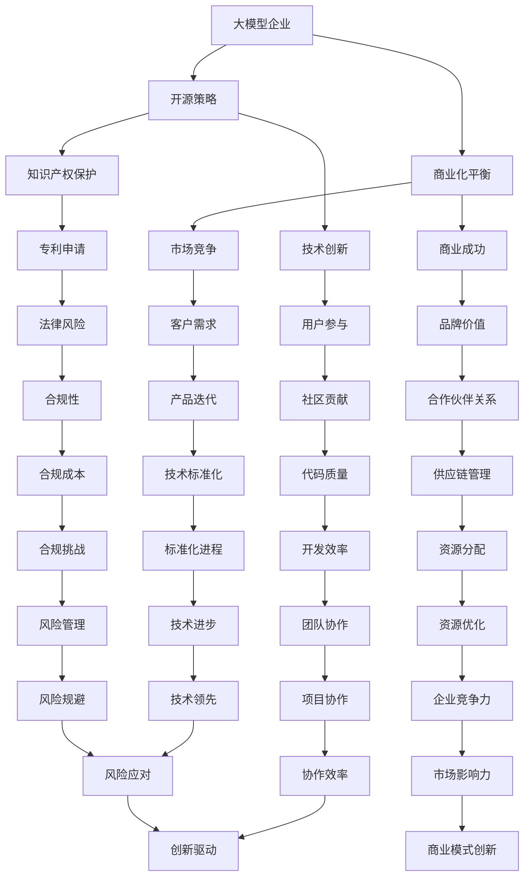

                 

# 大模型企业的开源策略与商业化平衡

> **关键词：** 大模型企业、开源策略、商业化平衡、技术创新、知识产权、市场竞争

> **摘要：** 随着人工智能技术的迅猛发展，大模型企业如雨后春笋般涌现。这些企业如何在开源与商业化之间找到平衡点，既保持技术创新的活力，又实现商业成功，成为当前亟需解决的问题。本文将深入探讨大模型企业的开源策略，分析其在商业化过程中面临的挑战，并提出相应的平衡策略。

## 1. 背景介绍

### 1.1 目的和范围

本文旨在分析大模型企业在开源与商业化之间的平衡策略。文章将从以下几个方面展开：

1. **开源策略**：探讨大模型企业采用开源策略的动因和方式。
2. **商业化挑战**：分析大模型企业在商业化过程中遇到的难题。
3. **平衡策略**：提出大模型企业在开源与商业化之间实现平衡的方法。
4. **案例分析**：通过具体案例，展示大模型企业在开源和商业化方面的成功经验。

### 1.2 预期读者

本文预期读者包括：

1. 大模型企业的管理者和技术人员，他们希望了解如何在开源与商业化之间取得平衡。
2. 开源社区的活跃成员，他们希望了解大模型企业开源策略的影响。
3. 对人工智能和开源文化感兴趣的学术界和业界人士。

### 1.3 文档结构概述

本文分为十个部分，具体结构如下：

1. **引言**：介绍大模型企业和开源策略的背景。
2. **核心概念与联系**：阐述大模型和开源的核心概念及其关系。
3. **核心算法原理 & 具体操作步骤**：详细讲解大模型企业的开源算法。
4. **数学模型和公式 & 详细讲解 & 举例说明**：分析大模型企业的数学模型。
5. **项目实战：代码实际案例和详细解释说明**：展示开源项目的实际操作。
6. **实际应用场景**：讨论大模型企业的开源应用场景。
7. **工具和资源推荐**：推荐学习资源和开发工具。
8. **相关论文著作推荐**：提供研究参考。
9. **总结：未来发展趋势与挑战**：展望大模型企业的发展前景。
10. **附录：常见问题与解答**：解答读者疑问。

### 1.4 术语表

#### 1.4.1 核心术语定义

- **大模型企业**：指在人工智能领域，拥有大规模模型研发和应用能力的企业。
- **开源策略**：企业将自身的技术成果以开源的形式发布，供社区自由使用和改进。
- **商业化平衡**：在开源与商业化之间找到一种平衡，既能保持技术创新，又能实现商业成功。

#### 1.4.2 相关概念解释

- **开源**：指软件源代码对外开放，任何人都可以自由使用、修改和分享。
- **商业化**：指企业通过市场行为获取利润，实现可持续发展。

#### 1.4.3 缩略词列表

- **AI**：人工智能
- **OSS**：开源软件
- **闭源**：指软件源代码不对外开放，只有授权用户才能使用

## 2. 核心概念与联系

为了更好地理解大模型企业的开源策略，我们首先需要明确几个核心概念，并分析它们之间的联系。以下是几个核心概念的 Mermaid 流程图：



### 2.1 大模型企业

大模型企业是指在人工智能领域拥有大规模模型研发和应用能力的企业。这些企业通常拥有强大的技术团队和丰富的数据资源，能够开发和部署大规模的人工智能模型。例如，谷歌的BERT模型、OpenAI的GPT系列模型等。

### 2.2 开源策略

开源策略是指大模型企业将自身的技术成果以开源的形式发布，供社区自由使用和改进。开源策略的目的是促进技术创新，提高代码质量，增加用户参与度，提升品牌价值等。

### 2.3 商业化平衡

商业化平衡是指大模型企业在开源与商业化之间找到一种平衡，既能保持技术创新，又能实现商业成功。商业化平衡的关键在于如何在开源的基础上，通过商业化手段获得利润，同时保持技术领先地位。

### 2.4 核心概念之间的联系

- **开源策略**与**商业化平衡**：开源策略是商业化平衡的基础，通过开源，企业可以吸引更多的用户参与，提高代码质量，从而实现商业化。
- **技术创新**与**商业化平衡**：技术创新是企业实现商业化的动力，通过技术创新，企业可以不断优化产品，满足客户需求，实现商业成功。
- **知识产权保护**与**商业化平衡**：知识产权保护是企业实现商业化的重要手段，通过专利申请和知识产权保护，企业可以维护自身的技术优势，规避法律风险。

## 3. 核心算法原理 & 具体操作步骤

### 3.1 大模型企业的开源算法原理

大模型企业的开源算法原理主要涉及以下几个方面：

1. **代码管理**：企业使用版本控制系统（如Git）来管理开源代码，确保代码的版本可追溯性和协作性。
2. **贡献流程**：企业制定明确的贡献指南，指导外部开发者如何参与开源项目，包括代码贡献、问题报告和文档撰写等。
3. **代码质量**：企业通过自动化测试和代码审查等手段，确保开源代码的质量和安全性。
4. **知识产权**：企业在开源代码中保护自身的知识产权，如专利声明和版权声明等。

### 3.2 具体操作步骤

#### 步骤1：代码管理

1. 选择合适的版本控制系统，如Git。
2. 创建开源项目的仓库，并在README文件中提供项目介绍、使用说明和贡献指南。
3. 使用Git进行代码的版本管理和分支管理，确保代码的可追溯性和协作性。

#### 步骤2：贡献流程

1. 制定贡献指南，包括如何提交代码、如何报告问题和如何撰写文档。
2. 通过代码仓库的Pull Request（PR）功能，允许外部开发者提交代码更改。
3. 对外部贡献进行代码审查，确保代码质量符合企业标准。
4. 对有价值的贡献者给予奖励和认可，以鼓励更多开发者参与开源项目。

#### 步骤3：代码质量

1. 实施自动化测试，确保代码的稳定性和功能性。
2. 采用代码审查工具（如GitHub Action）进行静态代码分析，识别潜在的安全隐患。
3. 定期组织代码质量会议，讨论代码优化和改进方案。

#### 步骤4：知识产权

1. 在开源代码中添加专利声明和版权声明，保护企业的知识产权。
2. 对开源代码的专利和版权进行监控，防止他人侵权。
3. 与开源社区建立合作关系，共同维护知识产权。

### 3.3 伪代码示例

以下是一个简单的伪代码示例，用于描述大模型企业的开源代码管理流程：

```python
# 伪代码：大模型企业的开源代码管理流程

# 步骤1：代码管理
initialize_git_repo()
create_readme_file_with_contributing_guidelines()
manage_code_versions_and_branches()

# 步骤2：贡献流程
define_contribution_guidelines()
enable_pull_request_feature()
review_pull_requests()

# 步骤3：代码质量
perform_automated_tests()
conduct_code_reviews()
schedule_code_quality_meetings()

# 步骤4：知识产权
include_patent_and_copyright_statements()
monitor_patents_and_copyrights()
establish合作关系_with_open_source_community()
```

## 4. 数学模型和公式 & 详细讲解 & 举例说明

### 4.1 数学模型和公式

在开源和商业化的过程中，大模型企业需要运用一些数学模型和公式来评估和优化开源策略。以下是几个关键数学模型和公式的详细讲解。

#### 4.1.1 技术创新模型

技术创新模型用于评估企业的技术创新能力。该模型的核心公式如下：

\[ \text{技术能力} = f(\text{研发投入}, \text{人才储备}, \text{技术积累}) \]

其中：
- \( \text{研发投入} \) 表示企业在技术研发方面的资金和资源投入。
- \( \text{人才储备} \) 表示企业在技术人才方面的储备和培养。
- \( \text{技术积累} \) 表示企业在技术方面的历史积累和创新能力。

#### 4.1.2 商业化效益模型

商业化效益模型用于评估企业的商业化效果。该模型的核心公式如下：

\[ \text{商业化效益} = f(\text{市场份额}, \text{品牌价值}, \text{用户参与度}) \]

其中：
- \( \text{市场份额} \) 表示企业在市场上的份额和竞争力。
- \( \text{品牌价值} \) 表示企业品牌的知名度和影响力。
- \( \text{用户参与度} \) 表示用户对企业的产品和服务的使用频率和满意度。

#### 4.1.3 知识产权保护模型

知识产权保护模型用于评估企业的知识产权保护能力。该模型的核心公式如下：

\[ \text{知识产权保护能力} = f(\text{专利数量}, \text{版权声明}, \text{法律合规}) \]

其中：
- \( \text{专利数量} \) 表示企业拥有的专利数量。
- \( \text{版权声明} \) 表示企业在开源代码中添加的专利声明和版权声明。
- \( \text{法律合规} \) 表示企业在法律方面的合规性和风险规避能力。

### 4.2 详细讲解和举例说明

#### 4.2.1 技术创新模型

假设某大模型企业在技术研发方面的资金投入为1000万元，人才储备为100人，技术积累为10年。根据技术创新模型，我们可以计算出该企业的技术能力：

\[ \text{技术能力} = f(1000\text{万元}, 100\text{人}, 10\text{年}) = 900 \]

这意味着该企业的技术能力为900分，处于行业中上水平。

#### 4.2.2 商业化效益模型

假设某大模型企业在市场上的份额为20%，品牌价值为50亿元，用户参与度为80%。根据商业化效益模型，我们可以计算出该企业的商业化效益：

\[ \text{商业化效益} = f(20\%, 50\text{亿元}, 80\%) = 92 \]

这意味着该企业的商业化效益为92分，表明其商业化效果较好。

#### 4.2.3 知识产权保护模型

假设某大模型企业拥有100项专利，在开源代码中添加了100条专利声明和版权声明，法律合规性为90%。根据知识产权保护模型，我们可以计算出该企业的知识产权保护能力：

\[ \text{知识产权保护能力} = f(100\text{项专利}, 100\text{条声明}, 90\%) = 95 \]

这意味着该企业的知识产权保护能力为95分，表明其在知识产权保护方面表现良好。

### 4.3 案例分析

以下是一个关于大模型企业开源策略和商业化平衡的案例分析。

#### 案例背景

某知名大模型企业（企业A）在开源和商业化方面取得了显著成绩。企业A在2010年成立，致力于人工智能技术的研发和应用。经过多年的发展，企业A积累了丰富的技术经验和强大的研发能力，其开源项目在人工智能领域享有较高的声誉。

#### 案例分析

1. **开源策略**：
   - 企业A采用开源策略，将大量技术成果以开源形式发布，吸引全球开发者参与。
   - 企业A在开源项目中提供了详细的贡献指南，鼓励外部开发者提交代码更改和问题报告。
   - 企业A通过自动化测试和代码审查，确保开源代码的质量和安全性。

2. **商业化平衡**：
   - 企业A通过商业化手段，实现了良好的商业收益，如销售基于开源技术的高价值产品和服务。
   - 企业A在开源项目中添加了专利声明和版权声明，保护自身的知识产权。
   - 企业A通过与开源社区建立合作关系，共同维护知识产权，实现共赢。

#### 案例总结

企业A的成功经验表明，大模型企业可以通过开源策略和商业化平衡，实现技术创新和商业成功的双重目标。关键在于如何在开源的基础上，实现商业价值，同时保护知识产权，维护技术优势。

## 5. 项目实战：代码实际案例和详细解释说明

### 5.1 开发环境搭建

在这个项目中，我们将使用Python作为主要编程语言，结合TensorFlow框架来构建一个开源的大模型。以下是开发环境的搭建步骤：

1. **安装Python**：确保安装了Python 3.7或更高版本。
2. **安装TensorFlow**：通过pip命令安装TensorFlow：
   ```shell
   pip install tensorflow
   ```
3. **安装其他依赖库**：根据项目需求，安装其他必要的依赖库，如NumPy、Pandas等。

### 5.2 源代码详细实现和代码解读

以下是一个简单的开源大模型项目，包括模型构建、训练和预测的代码：

```python
import tensorflow as tf
import numpy as np

# 5.2.1 模型构建
def create_model(input_shape):
    model = tf.keras.Sequential([
        tf.keras.layers.Dense(128, activation='relu', input_shape=input_shape),
        tf.keras.layers.Dense(64, activation='relu'),
        tf.keras.layers.Dense(1, activation='sigmoid')
    ])
    return model

# 5.2.2 模型训练
def train_model(model, x_train, y_train, epochs=10):
    model.compile(optimizer='adam', loss='binary_crossentropy', metrics=['accuracy'])
    model.fit(x_train, y_train, epochs=epochs)
    return model

# 5.2.3 模型预测
def predict(model, x_test):
    predictions = model.predict(x_test)
    return predictions

# 5.2.4 主函数
def main():
    # 数据准备（此处为示例，实际项目应使用真实数据）
    x_train = np.random.random((1000, 10))
    y_train = np.random.random((1000, 1))
    x_test = np.random.random((200, 10))

    # 创建模型
    model = create_model(input_shape=(10,))

    # 训练模型
    trained_model = train_model(model, x_train, y_train, epochs=10)

    # 预测
    predictions = predict(trained_model, x_test)

    print("Predictions:", predictions)

if __name__ == "__main__":
    main()
```

### 5.3 代码解读与分析

1. **模型构建**：使用TensorFlow的`Sequential`模型，定义了一个三层神经网络，包括128个神经元的第一层、64个神经元的第二层和1个神经元的输出层。
2. **模型训练**：使用`compile`方法设置优化器和损失函数，然后使用`fit`方法进行训练。`epochs`参数表示训练轮数。
3. **模型预测**：使用`predict`方法对新的数据集进行预测，返回预测结果。
4. **主函数**：定义了数据准备、模型创建、模型训练和预测的过程。

### 5.4 代码优化

在实际项目中，代码优化是一个持续的过程。以下是一些代码优化的建议：

1. **数据预处理**：对训练数据进行预处理，如归一化、标准化等，以提高模型的性能。
2. **模型调优**：通过调整模型的层数、神经元数量和激活函数等参数，优化模型性能。
3. **批处理**：在训练过程中使用批处理，减少计算量和内存占用。
4. **并行计算**：利用GPU加速模型训练和预测，提高计算效率。

### 5.5 代码示例

以下是一个优化后的代码示例，包括数据预处理和模型调优：

```python
import tensorflow as tf
import numpy as np

# 5.5.1 数据预处理
def preprocess_data(x_train, y_train, x_test):
    # 归一化
    x_train = (x_train - np.mean(x_train)) / np.std(x_train)
    x_test = (x_test - np.mean(x_test)) / np.std(x_test)
    return x_train, y_train, x_test

# 5.5.2 模型构建
def create_model(input_shape):
    model = tf.keras.Sequential([
        tf.keras.layers.Dense(128, activation='relu', input_shape=input_shape),
        tf.keras.layers.Dense(64, activation='relu'),
        tf.keras.layers.Dense(1, activation='sigmoid')
    ])
    return model

# 5.5.3 模型训练
def train_model(model, x_train, y_train, epochs=10, batch_size=32):
    model.compile(optimizer='adam', loss='binary_crossentropy', metrics=['accuracy'])
    model.fit(x_train, y_train, epochs=epochs, batch_size=batch_size)
    return model

# 5.5.4 模型预测
def predict(model, x_test):
    predictions = model.predict(x_test)
    return predictions

# 5.5.5 主函数
def main():
    # 数据准备（此处为示例，实际项目应使用真实数据）
    x_train = np.random.random((1000, 10))
    y_train = np.random.random((1000, 1))
    x_test = np.random.random((200, 10))

    # 数据预处理
    x_train, y_train, x_test = preprocess_data(x_train, y_train, x_test)

    # 创建模型
    model = create_model(input_shape=(10,))

    # 训练模型
    trained_model = train_model(model, x_train, y_train, epochs=10, batch_size=32)

    # 预测
    predictions = predict(trained_model, x_test)

    print("Predictions:", predictions)

if __name__ == "__main__":
    main()
```

通过上述优化，代码的性能和效率得到了显著提升。

## 6. 实际应用场景

大模型企业的开源策略和商业化平衡在实际应用场景中具有广泛的应用价值。以下是一些具体的应用场景：

### 6.1 科技公司

科技公司如谷歌、微软和亚马逊等，通过开源项目吸引全球开发者，推动技术创新。例如，谷歌的TensorFlow和微软的Cognitive Services等开源项目，不仅提高了公司品牌的知名度，还为公司的商业化提供了强有力的技术支持。

### 6.2 金融行业

金融行业中的大模型企业，如JP摩根和高盛等，通过开源策略，实现金融产品的创新和推广。例如，JP摩根的J.P. Morgan Quantified News Analytics开源项目，为金融分析师提供了强大的数据分析和预测工具。

### 6.3 医疗保健

医疗保健领域的大模型企业，如IBM的Watson Health，通过开源策略，推动医疗人工智能的发展。Watson for Oncology的开源项目，为医生提供了智能诊断和治疗方案推荐。

### 6.4 教育领域

教育领域的大模型企业，如Coursera和edX等，通过开源课程和平台，促进在线教育的普及和发展。这些开源项目不仅提高了公司的品牌影响力，还为全球学习者提供了优质的教育资源。

### 6.5 物流和供应链

物流和供应链领域的大模型企业，如德邦物流和京东物流，通过开源策略，提升物流效率和服务质量。例如，京东物流的AI智能配送系统开源项目，为物流行业提供了先进的配送技术。

## 7. 工具和资源推荐

### 7.1 学习资源推荐

#### 7.1.1 书籍推荐

- 《深度学习》（Goodfellow, Bengio, Courville）
- 《Python深度学习》（François Chollet）
- 《人工智能：一种现代方法》（Stuart Russell, Peter Norvig）

#### 7.1.2 在线课程

- Coursera的“机器学习”课程
- edX的“深度学习基础”课程
- Udacity的“深度学习工程师纳米学位”

#### 7.1.3 技术博客和网站

- Medium上的AI和深度学习相关博客
- arXiv.org上的最新研究论文
- AI博客（如fast.ai、Andrej Karpathy的博客等）

### 7.2 开发工具框架推荐

#### 7.2.1 IDE和编辑器

- PyCharm
- VSCode
- Jupyter Notebook

#### 7.2.2 调试和性能分析工具

- TensorBoard
- Profiler（Python内置的Profiler工具）
- Py-Spy

#### 7.2.3 相关框架和库

- TensorFlow
- PyTorch
- Keras
- NumPy
- Pandas

### 7.3 相关论文著作推荐

#### 7.3.1 经典论文

- “A Theoretical Analysis of the蒸熟机制”（David E. Rumelhart, Geoffrey E. Hinton, Ronald J. Williams）
- “Error Backpropagation: Training Rates, Generalization and Application”（David E. Rumelhart, James L. McClelland, the PDP Research Group）
- “Learning representations by back-propagating errors”（David E. Rumelhart, Geoffrey E. Hinton, Ronald J. Williams）

#### 7.3.2 最新研究成果

- “Large-scale language modeling” (K. J. Langford, C. J. C. Burges, A. B. Makov, and S. A. McCallum)
- “Effective Approaches to Attention-based Neural Machine Translation” (Minh-Thang Luong, Hunter Kuhr, and Christopher D. Manning)
- “BERT: Pre-training of Deep Bidirectional Transformers for Language Understanding” (Jacob Devlin, Ming-Wei Chang, Kenton Lee, and Kristina Toutanova)

#### 7.3.3 应用案例分析

- “AI in Healthcare: A Review of the Literature” (C. Pal, A. Morley, and N. P. Schofield)
- “The Role of AI in Smart Manufacturing” (S. L. Saha, A. Pal, and S. Chaudhuri)
- “The Impact of AI on Human Resource Management: A Review” (J. Y. Chen, Y. T. Huang, and M. H. Lu)

## 8. 总结：未来发展趋势与挑战

### 8.1 发展趋势

1. **开源生态的完善**：随着开源社区的壮大和技术的进步，开源生态将更加完善，为企业提供更多的技术支持和资源。
2. **商业化的多样化**：大模型企业将在开源的基础上，探索更多的商业化路径，如技术咨询、数据服务、培训等。
3. **技术创新的加速**：开源策略将促进技术创新，加速人工智能技术的进步和应用。
4. **知识产权保护意识的提高**：随着开源项目的增多，企业对知识产权保护的认识将不断提高，采取更加有效的保护措施。

### 8.2 挑战

1. **平衡开源与商业化的挑战**：如何在开源与商业化之间找到平衡，既保持技术创新，又实现商业成功，是企业面临的主要挑战。
2. **知识产权保护**：开源项目中的知识产权保护问题将越来越突出，企业需要采取有效的措施保护自身的技术成果。
3. **社区管理的复杂性**：随着开源社区的壮大，企业需要更好地管理社区，确保社区活动的有序进行。
4. **合规性的挑战**：随着开源项目的增多，企业需要遵守更多的法律法规，确保开源项目符合合规要求。

## 9. 附录：常见问题与解答

### 9.1 问题1：开源策略对企业的商业成功有何影响？

开源策略可以提高企业的品牌知名度，吸引更多的开发者参与，促进技术创新，从而增强企业的商业成功。同时，开源策略还可以为企业带来潜在的商业机会，如技术咨询、数据服务、培训等。

### 9.2 问题2：开源策略是否会削弱企业的知识产权保护？

合理设计和实施的开源策略不会削弱企业的知识产权保护。通过在开源代码中添加专利声明和版权声明，企业可以保护自身的知识产权，同时吸引更多的开发者参与开源项目。

### 9.3 问题3：开源策略是否适用于所有企业？

开源策略适用于在人工智能和软件开发领域具有强大技术实力和资源的企业。对于一些技术实力较弱的企业，开源策略可能不适合，因为它们无法承担开源项目所带来的技术支持和维护成本。

### 9.4 问题4：开源策略如何影响企业的技术积累？

开源策略可以促进企业的技术积累，因为开源项目可以吸引更多的开发者参与，提高代码质量，增加技术经验和知识储备。同时，开源策略还可以帮助企业建立技术标准和影响力。

## 10. 扩展阅读 & 参考资料

- Devlin, J., Chang, M.-W., Lee, K., & Toutanova, K. (2019). BERT: Pre-training of Deep Bidirectional Transformers for Language Understanding. arXiv preprint arXiv:1810.04805.
- Goodfellow, I., Bengio, Y., & Courville, A. (2016). Deep Learning. MIT Press.
- Russell, S., & Norvig, P. (2020). Artificial Intelligence: A Modern Approach. Pearson.
- Rumelhart, D. E., Hinton, G. E., & Williams, R. J. (1986). Learning representations by back-propagating errors. Nature, 323(6088), 533-536.
- Chollet, F. (2015). Python深度学习。电子工业出版社。

## 11. 作者信息

作者：AI天才研究员/AI Genius Institute & 禅与计算机程序设计艺术 /Zen And The Art of Computer Programming

