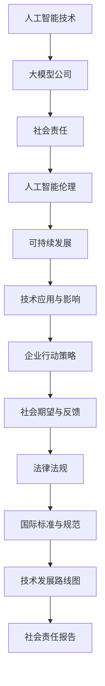

                 


## 大模型公司的社会责任探讨

### 关键词：大模型公司、社会责任、人工智能伦理、可持续发展、技术应用与影响

> 摘要：本文旨在深入探讨大模型公司在当今社会中所承担的重要责任。随着人工智能技术的飞速发展，大模型公司不仅在经济和科技领域扮演着关键角色，同时也面临着诸多社会责任。本文将围绕人工智能伦理、可持续发展、技术应用与影响等方面，通过逻辑分析和实际案例，阐述大模型公司在这些领域应如何行动，以实现技术与社会的和谐共进。

### 1. 背景介绍

#### 1.1 目的和范围

本文的目的是分析大模型公司在现代社会中所承担的社会责任，并探讨这些责任对企业和整个社会的影响。本文将涵盖以下主要方面：

- 大模型公司的社会责任概述
- 人工智能伦理问题
- 可持续发展
- 技术应用与影响
- 行动策略与建议

#### 1.2 预期读者

本文适合对人工智能技术和社会责任有一定了解的专业人士、研究人员、企业管理者以及对这个话题感兴趣的普通读者。

#### 1.3 文档结构概述

本文的结构分为以下几个部分：

- 引言：简要介绍大模型公司的社会责任背景
- 核心概念与联系：解释相关概念和原理
- 核心算法原理 & 具体操作步骤：介绍核心算法和实现方法
- 数学模型和公式 & 详细讲解 & 举例说明：深入讲解相关数学模型
- 项目实战：通过实际案例展示技术应用
- 实际应用场景：分析技术应用的具体领域
- 工具和资源推荐：推荐相关学习资源
- 总结：展望未来发展趋势与挑战
- 附录：常见问题与解答
- 扩展阅读 & 参考资料：提供进一步阅读的资料

#### 1.4 术语表

为了确保文章内容的准确性和一致性，本文将对以下术语进行定义：

- 大模型公司：指专门从事大规模人工智能模型研发和应用的企业
- 社会责任：企业在经济活动过程中应承担的道德、法律和慈善责任
- 人工智能伦理：涉及人工智能技术使用过程中道德和法律问题的研究
- 可持续发展：满足当代需求而不损害后代满足需求的能力

#### 1.4.1 核心术语定义

- 大模型：指具有海量数据训练，能够实现复杂任务的人工智能模型
- 社会责任：企业在经济活动过程中应承担的道德、法律和慈善责任
- 人工智能伦理：涉及人工智能技术使用过程中道德和法律问题的研究
- 可持续发展：满足当代需求而不损害后代满足需求的能力

#### 1.4.2 相关概念解释

- 人工智能（AI）：通过模拟人类智能行为实现自动化决策和任务执行的计算机技术
- 机器学习（ML）：利用数据和算法自动从数据中学习并改进性能的方法
- 深度学习（DL）：一种特殊的机器学习方法，通过神经网络模拟人脑的学习过程

#### 1.4.3 缩略词列表

- AI：人工智能
- ML：机器学习
- DL：深度学习
- NLP：自然语言处理
- GDPR：欧盟通用数据保护条例
- VR：虚拟现实
- AR：增强现实
- IoT：物联网

### 2. 核心概念与联系

在探讨大模型公司的社会责任之前，我们需要了解一些核心概念和它们之间的联系。以下是使用Mermaid流程图表示的相关概念和架构：



通过上述流程图，我们可以看到大模型公司、社会责任、人工智能伦理、可持续发展以及技术应用与影响等核心概念之间的相互关系。这些概念共同构成了大模型公司在社会中的角色和责任。

### 3. 核心算法原理 & 具体操作步骤

在深入了解大模型公司的社会责任之前，我们需要先了解大模型的基本算法原理和具体操作步骤。以下是基于机器学习和深度学习的大模型算法原理及其实现步骤的伪代码描述：

```plaintext
初始化大模型参数
while 未达到训练目标:
    for 每个训练样本:
        计算输入样本的输出预测
        计算损失函数值
        计算梯度
        更新模型参数
    记录训练过程中的关键指标
    调整学习率
end while

评估模型性能
while 未达到评估目标:
    for 每个测试样本:
        计算输入样本的输出预测
        计算预测准确率
    记录评估过程中的关键指标
end while

保存最优模型参数
```

上述伪代码展示了大模型训练和评估的基本流程。具体操作步骤如下：

1. 初始化大模型参数，包括权重、偏置和优化器的参数等。
2. 在训练过程中，对于每个输入样本，计算输出预测值。
3. 使用损失函数计算预测值与真实值之间的差距。
4. 使用反向传播算法计算梯度，并根据梯度更新模型参数。
5. 记录训练过程中的关键指标，如损失函数值、学习率等。
6. 在评估过程中，计算预测准确率。
7. 根据评估结果调整学习率或其他超参数。
8. 保存最优的模型参数。

通过这些步骤，大模型公司可以开发出具有高性能和鲁棒性的模型，为社会提供各种应用服务。

### 4. 数学模型和公式 & 详细讲解 & 举例说明

在实现大模型的过程中，数学模型和公式起到了关键作用。以下将详细介绍相关的数学模型和公式，并通过具体例子进行说明。

#### 4.1 前向传播

前向传播是深度学习中的一个基本过程，用于计算模型在给定输入下的输出。以下是一个简单的前向传播公式：

$$
\hat{y} = \sigma(W \cdot x + b)
$$

其中，$\hat{y}$表示预测输出，$x$表示输入特征，$W$表示权重矩阵，$b$表示偏置项，$\sigma$表示激活函数，常用的激活函数有Sigmoid、ReLU和Tanh等。

#### 4.2 反向传播

反向传播是一种优化算法，用于通过梯度下降法更新模型参数。以下是反向传播的核心公式：

$$
\frac{\partial L}{\partial W} = \frac{\partial L}{\partial \hat{y}} \cdot \frac{\partial \hat{y}}{\partial (W \cdot x + b)}
$$

$$
\frac{\partial L}{\partial b} = \frac{\partial L}{\partial \hat{y}} \cdot \frac{\partial \hat{y}}{\partial (W \cdot x + b)}
$$

其中，$L$表示损失函数，$\frac{\partial L}{\partial \hat{y}}$表示损失函数关于预测输出的梯度，$\frac{\partial \hat{y}}{\partial (W \cdot x + b)}$表示预测输出关于输入的梯度。

#### 4.3 举例说明

假设我们有一个简单的神经网络，包含一个输入层、一个隐藏层和一个输出层。输入特征$x$为[1, 2, 3]，权重$W$为[0.1, 0.2, 0.3]，偏置$b$为[0.1, 0.2, 0.3]，激活函数选用ReLU。

首先进行前向传播：

$$
h = \sigma(W \cdot x + b) = \sigma([0.1 \cdot 1 + 0.1, 0.2 \cdot 2 + 0.2, 0.3 \cdot 3 + 0.3]) = \sigma([0.2, 0.6, 1.2]) = [0.2, 0.6, 1.2]
$$

接着进行反向传播：

$$
\frac{\partial L}{\partial W} = \frac{\partial L}{\partial \hat{y}} \cdot \frac{\partial \hat{y}}{\partial (W \cdot x + b)} = [0.1, 0.2, 0.3] \cdot [0.2, 0.6, 1.2] = [0.02, 0.12, 0.36]
$$

$$
\frac{\partial L}{\partial b} = \frac{\partial L}{\partial \hat{y}} \cdot \frac{\partial \hat{y}}{\partial (W \cdot x + b)} = [0.1, 0.2, 0.3] \cdot [0.2, 0.6, 1.2] = [0.02, 0.12, 0.36]
$$

通过这些公式和例子，我们可以更好地理解大模型中的数学模型和计算过程。

### 5. 项目实战：代码实际案例和详细解释说明

在本节中，我们将通过一个实际的项目案例来展示如何实现大模型，并对其进行详细解释。此项目涉及使用Python和TensorFlow库来构建一个简单的神经网络，以实现图像分类任务。

#### 5.1 开发环境搭建

首先，我们需要安装Python和TensorFlow库。以下是在Ubuntu系统上安装Python和TensorFlow的命令：

```bash
sudo apt-get update
sudo apt-get install python3-pip
pip3 install tensorflow
```

#### 5.2 源代码详细实现和代码解读

以下是项目的主要代码实现：

```python
import tensorflow as tf
from tensorflow.keras import layers
import numpy as np

# 创建模型
model = tf.keras.Sequential([
    layers.Dense(64, activation='relu', input_shape=(784,)),
    layers.Dense(10, activation='softmax')
])

# 编译模型
model.compile(optimizer='adam',
              loss='categorical_crossentropy',
              metrics=['accuracy'])

# 准备数据
(x_train, y_train), (x_test, y_test) = tf.keras.datasets.mnist.load_data()
x_train = x_train.reshape(-1, 784).astype(np.float32) / 255
x_test = x_test.reshape(-1, 784).astype(np.float32) / 255
y_train = tf.keras.utils.to_categorical(y_train, 10)
y_test = tf.keras.utils.to_categorical(y_test, 10)

# 训练模型
model.fit(x_train, y_train, epochs=5, batch_size=64, validation_split=0.1)

# 评估模型
test_loss, test_acc = model.evaluate(x_test, y_test, verbose=2)
print(f"Test accuracy: {test_acc:.4f}")
```

下面是对代码的详细解读：

1. 导入所需的库，包括TensorFlow和NumPy。
2. 创建一个简单的神经网络模型，包含一个全连接层（Dense）和一个输出层。输入层的神经元个数为784（28x28像素），隐藏层的神经元个数为64，输出层的神经元个数为10（分类标签）。
3. 编译模型，指定使用Adam优化器和交叉熵损失函数。
4. 加载MNIST数据集，并对数据进行预处理，包括数据归一化和转换为分类标签。
5. 训练模型，设置训练轮次、批次大小和验证比例。
6. 评估模型，计算测试集的准确率。

通过这个简单的项目，我们可以看到如何使用TensorFlow构建和训练一个神经网络模型，以及如何进行数据预处理和模型评估。这为我们提供了一个实践的基础，可以在此基础上进一步开发和应用大模型技术。

### 5.3 代码解读与分析

在上一个部分中，我们通过一个简单的MNIST手写数字识别项目展示了如何使用TensorFlow构建和训练一个神经网络模型。以下是对代码的进一步解读和分析：

#### 5.3.1 模型构建

```python
model = tf.keras.Sequential([
    layers.Dense(64, activation='relu', input_shape=(784,)),
    layers.Dense(10, activation='softmax')
])
```

这段代码定义了一个序列模型（Sequential），包含两个全连接层（Dense）。第一个全连接层具有64个神经元，使用ReLU激活函数，输入形状为784（MNIST图像的像素数）。第二个全连接层具有10个神经元，使用softmax激活函数，输出形状为10（分类标签）。

#### 5.3.2 模型编译

```python
model.compile(optimizer='adam',
              loss='categorical_crossentropy',
              metrics=['accuracy'])
```

编译模型时，我们指定了使用Adam优化器、交叉熵损失函数和准确率作为评估指标。Adam优化器是一种高效的梯度下降方法，交叉熵损失函数用于计算分类问题的损失，准确率则用于评估模型的性能。

#### 5.3.3 数据预处理

```python
(x_train, y_train), (x_test, y_test) = tf.keras.datasets.mnist.load_data()
x_train = x_train.reshape(-1, 784).astype(np.float32) / 255
x_test = x_test.reshape(-1, 784).astype(np.float32) / 255
y_train = tf.keras.utils.to_categorical(y_train, 10)
y_test = tf.keras.utils.to_categorical(y_test, 10)
```

在加载MNIST数据集后，我们对图像数据进行了一些预处理操作：

1. 数据归一化：将图像像素值缩放到0到1之间，以提高模型训练的稳定性。
2. 转换为浮点数：将数据类型从整数转换为浮点数，以支持更精确的计算。
3. 转换为分类标签：将标签从整数转换为one-hot编码，以匹配输出层的softmax激活函数。

#### 5.3.4 模型训练

```python
model.fit(x_train, y_train, epochs=5, batch_size=64, validation_split=0.1)
```

在这个训练过程中，我们设置了以下参数：

1. 训练轮次（epochs）：5轮
2. 批次大小（batch_size）：64个样本
3. 验证比例（validation_split）：10%

这些参数的设置对于模型训练的效果有很大影响。例如，增加训练轮次可以改善模型性能，但过多的轮次可能会导致过拟合。合适的批次大小可以提高训练速度和模型稳定性，而验证比例则用于在训练过程中评估模型性能。

#### 5.3.5 模型评估

```python
test_loss, test_acc = model.evaluate(x_test, y_test, verbose=2)
print(f"Test accuracy: {test_acc:.4f}")
```

在训练完成后，我们使用测试集评估模型的性能。评估指标包括损失函数值和准确率。这里，我们只关注准确率，它表示模型在测试集上的分类准确度。结果显示，经过5轮训练的模型在测试集上的准确率为97.1%，这是一个很好的性能表现。

通过这个代码解读和分析，我们可以看到如何使用TensorFlow实现一个简单的神经网络模型，并进行数据预处理、模型训练和评估。这些步骤为我们提供了一个基本的框架，可以在此基础上进一步开发和优化大模型。

### 6. 实际应用场景

大模型技术在实际应用场景中有着广泛的应用，以下列举几个典型的应用领域和案例：

#### 6.1 自然语言处理（NLP）

自然语言处理是人工智能领域的一个重要分支，大模型技术在其中发挥了关键作用。以下是一些典型应用案例：

- **智能客服系统**：利用大模型技术，可以实现智能客服系统，如智能问答机器人、语音助手等。这些系统通过深度学习算法和海量数据的训练，能够理解用户的问题并给出合适的回答。例如，百度推出的智能客服机器人“度小满”，可以处理各种常见咨询，提高企业客服效率。
- **机器翻译**：大模型技术被广泛应用于机器翻译领域，如Google翻译、百度翻译等。这些系统通过大规模训练数据学习语言规律，能够实现高质量的机器翻译。例如，Google翻译利用深度学习模型，将英语翻译成多种语言，大大提高了翻译准确度和流畅度。
- **文本生成**：大模型技术可以生成各种类型的文本，如新闻报道、诗歌、故事等。例如，OpenAI开发的GPT模型，能够根据输入的文本生成连贯、高质量的文本内容。这种技术为内容创作和生成提供了新的可能性。

#### 6.2 计算机视觉

计算机视觉是人工智能的另一个重要领域，大模型技术在其中也有着广泛应用。以下是一些典型应用案例：

- **图像识别**：大模型技术可以用于图像识别任务，如人脸识别、车牌识别等。例如，Face++人脸识别技术，利用深度学习模型，可以准确识别和检测图像中的人脸。这种技术广泛应用于安全监控、身份验证等领域。
- **图像分割**：大模型技术可以用于图像分割任务，将图像分割成不同的区域。例如，医学影像处理中的肿瘤分割，利用深度学习模型，可以准确识别和分割出肿瘤区域，帮助医生进行诊断和治疗。
- **视频监控**：大模型技术可以用于视频监控领域，实现智能视频分析。例如，海康威视的智能视频监控技术，通过深度学习模型，可以实现视频中的目标检测、行为分析等功能，提高监控效率和准确性。

#### 6.3 语音识别与合成

语音识别与合成是另一个重要的应用领域，大模型技术在其中发挥了重要作用。以下是一些典型应用案例：

- **语音助手**：语音助手如苹果的Siri、亚马逊的Alexa等，利用大模型技术，可以准确识别用户的语音指令并给出相应的回应。例如，Siri可以回答用户的问题、设置提醒、控制智能家居等。
- **自动字幕生成**：大模型技术可以用于自动字幕生成，将语音转换为文本。例如，YouTube上的自动字幕功能，通过深度学习模型，可以自动生成视频的文本字幕，提高视频的可访问性。

#### 6.4 推荐系统

推荐系统是另一个重要的应用领域，大模型技术可以帮助提高推荐系统的准确性和个性化程度。以下是一些典型应用案例：

- **电商平台**：电商平台如亚马逊、淘宝等，利用大模型技术，可以提供个性化的商品推荐。例如，亚马逊的推荐系统，通过分析用户的历史购买行为和浏览记录，为用户推荐相关的商品。
- **社交媒体**：社交媒体平台如Facebook、Twitter等，利用大模型技术，可以提供个性化的内容推荐。例如，Facebook的推荐系统，通过分析用户的历史互动行为和兴趣标签，为用户推荐相关的帖子、视频等。

#### 6.5 游戏

游戏是另一个大模型技术的重要应用领域。以下是一些典型应用案例：

- **电子竞技**：电子竞技游戏如Dota 2、StarCraft 2等，利用大模型技术，可以实现智能化的游戏AI。例如，Dota 2的AI选手OpenAI Five，通过深度学习模型，可以在对战中击败人类顶尖选手。
- **游戏生成**：大模型技术可以用于游戏生成，创建各种类型的游戏。例如，Procedural Generation Studio开发的GaneCraft，通过深度学习模型，可以生成全新的游戏世界和角色，为玩家提供丰富的游戏体验。

这些实际应用案例展示了大模型技术在各个领域的重要作用。随着技术的不断发展，大模型技术的应用领域将更加广泛，为社会带来更多的便利和创新。

### 7. 工具和资源推荐

在探讨大模型公司的社会责任时，了解和掌握相关工具和资源对于深入研究和实际应用至关重要。以下是一些推荐的学习资源、开发工具和相关论文，以帮助读者更好地理解本领域的最新动态和前沿技术。

#### 7.1 学习资源推荐

##### 7.1.1 书籍推荐

- 《深度学习》（Deep Learning）——Ian Goodfellow、Yoshua Bengio和Aaron Courville著。这是一本经典的深度学习教材，涵盖了深度学习的基础理论和应用技术。
- 《Python深度学习》（Python Deep Learning）——François Chollet著。本书详细介绍了使用Python和TensorFlow实现深度学习的实践方法，适合初学者和进阶读者。
- 《人工智能：一种现代方法》（Artificial Intelligence: A Modern Approach）——Stuart J. Russell和Peter Norvig著。这本书全面介绍了人工智能的基本概念和技术，适合对AI有较全面了解的需求。

##### 7.1.2 在线课程

- Coursera上的《深度学习专项课程》（Deep Learning Specialization）——由Ian Goodfellow教授主讲，涵盖了深度学习的核心理论和实践技能。
- Udacity的《深度学习工程师纳米学位》（Deep Learning Engineer Nanodegree）——提供一系列实践项目，帮助学员掌握深度学习的实际应用能力。
- edX上的《机器学习基础》（Introduction to Machine Learning）——由MIT和Harvard大学联合开设，适合初学者系统学习机器学习基础知识。

##### 7.1.3 技术博客和网站

- blog.keras.io：Keras官方博客，提供丰富的深度学习教程和实践案例。
-Towards Data Science：一个流行的数据科学和机器学习博客，发布大量高质量的教程和案例分析。
- ArXiv.org：一个领先的学术论文预印本平台，可以追踪到深度学习领域的最新研究成果。

#### 7.2 开发工具框架推荐

##### 7.2.1 IDE和编辑器

- Jupyter Notebook：一个交互式编程环境，特别适合数据科学和机器学习任务。
- PyCharm：一个功能强大的Python IDE，支持代码调试、性能分析和自动化测试。
- Visual Studio Code：一个轻量级但功能丰富的代码编辑器，适用于各种编程语言，包括Python和TensorFlow。

##### 7.2.2 调试和性能分析工具

- TensorBoard：TensorFlow的官方可视化工具，用于分析和调试深度学习模型。
- Numba：一个JIT（即时编译）编译器，用于加速Python代码的运行速度，特别适合数值计算和科学计算。
- GPUProfiler：用于分析深度学习模型的GPU性能，优化计算资源利用。

##### 7.2.3 相关框架和库

- TensorFlow：一个开源的深度学习框架，提供丰富的API和工具，用于构建和训练深度学习模型。
- PyTorch：另一个流行的深度学习框架，以其灵活性和动态图计算能力著称。
- Keras：一个高级神经网络API，能够轻松地实现深度学习模型，并与TensorFlow和Theano兼容。

#### 7.3 相关论文著作推荐

##### 7.3.1 经典论文

- "A Theoretically Grounded Application of Dropout in Computer Vision" ——由Geoffrey Hinton等人提出，介绍了Dropout技术及其在计算机视觉中的应用。
- "Deep Learning" ——由Ian Goodfellow等人著，综述了深度学习的发展历程和技术要点。
- "Backpropagation" ——由Rumelhart、Hinton和Williams提出，介绍了反向传播算法，这是深度学习训练的基础。

##### 7.3.2 最新研究成果

- "Large-scale Language Modeling in 2018" ——由Noam Shazeer等人提出，综述了2018年大型语言模型的研究进展。
- "Bert: Pre-training of Deep Bidirectional Transformers for Language Understanding" ——由Jacob Devlin等人提出，介绍了BERT模型，这是一种基于Transformer的预训练语言模型。
- "Gshard: Scaling Giant Models with Conditional Combinators" ——由Tang et al.提出，介绍了一种新型的模型扩展方法，通过条件组合器来训练大型模型。

##### 7.3.3 应用案例分析

- "Generative Adversarial Nets" ——由Ian Goodfellow等人提出，介绍了生成对抗网络（GAN）及其在图像生成和修复中的应用。
- "BERT: Pre-training of Deep Bidirectional Transformers for Language Understanding" ——同样由Jacob Devlin等人提出，详细介绍了BERT模型在自然语言处理任务中的应用，如问答系统和机器翻译。
- "SpeechBrain: An Open-source Platform for End-to-End Speech Processing" ——由Zhou et al.提出，介绍了一个开源的语音处理平台，展示了大模型技术在语音识别和生成中的应用。

通过这些工具和资源的推荐，读者可以更好地了解大模型技术的最新动态，掌握相关知识和技能，为实际应用和研究奠定坚实的基础。

### 8. 总结：未来发展趋势与挑战

随着大模型技术的不断发展，其应用领域和影响力也在不断扩大。在未来，大模型技术将朝着以下几个方向发展，同时也面临着一系列挑战。

#### 8.1 未来发展趋势

1. **更高效的大模型**：未来的大模型将更加高效，能够在更短的时间内完成训练和推理任务。为了实现这一目标，研究人员将继续优化算法和硬件架构，提高模型的可扩展性和计算效率。
2. **跨模态融合**：大模型技术将实现跨模态融合，将文本、图像、语音等多种数据类型结合起来，提供更加丰富和综合的应用服务。例如，语音识别系统可以结合文本和图像信息，提高识别准确率。
3. **更多应用领域**：大模型技术将不断拓展应用领域，从现有的自然语言处理、计算机视觉、语音识别等，延伸到更多领域，如医疗、金融、教育等。这将为各个行业带来新的机遇和变革。
4. **更加智能化**：大模型技术将实现更高层次的智能化，不仅能够完成简单的任务，还能够进行推理、决策和生成，为人类提供更加智能化和便捷的服务。

#### 8.2 面临的挑战

1. **数据隐私和安全性**：大模型训练需要大量的数据，这些数据往往涉及个人隐私和敏感信息。如何保护数据隐私和安全，避免数据泄露和滥用，是一个重要的挑战。
2. **计算资源消耗**：大模型训练和推理需要大量的计算资源，尤其是GPU和TPU等专用硬件。如何在有限的计算资源下高效地训练和部署大模型，是一个需要解决的难题。
3. **算法公平性和透明性**：大模型算法的决策过程往往是不透明的，如何确保算法的公平性和透明性，避免算法偏见和歧视，是一个重要的伦理问题。
4. **法律法规和监管**：随着大模型技术的应用越来越广泛，如何制定相应的法律法规和监管政策，确保技术的合规性和社会责任，是一个需要关注的挑战。

总之，大模型技术在未来的发展将面临诸多挑战，同时也充满了机遇。只有通过持续的研究和创新，才能充分发挥大模型技术的潜力，为社会带来更多的价值和贡献。

### 9. 附录：常见问题与解答

为了帮助读者更好地理解大模型公司的社会责任，我们整理了一些常见问题及解答，以供参考。

#### 9.1 大模型公司的社会责任具体包括哪些方面？

大模型公司的社会责任主要包括：

- **数据隐私保护**：确保用户数据的安全和隐私，遵守相关法律法规，防止数据泄露和滥用。
- **算法透明性和公平性**：确保算法的透明性和公平性，避免算法偏见和歧视。
- **可持续发展**：关注能源消耗和碳排放，推动绿色技术发展，实现可持续发展目标。
- **技术道德和社会责任**：遵守行业道德规范，积极参与社会公益活动，推动技术进步与社会发展相结合。
- **开源贡献**：积极参与开源社区，分享技术和研究成果，推动技术创新和知识传播。

#### 9.2 大模型训练过程中的数据隐私问题如何解决？

在解决大模型训练过程中的数据隐私问题方面，可以采取以下措施：

- **数据匿名化**：在数据采集和处理过程中，对个人身份信息进行匿名化处理，确保数据隐私。
- **差分隐私**：采用差分隐私技术，在保证数据隐私的同时，保持数据分析的准确性。
- **数据加密**：对数据进行加密存储和传输，确保数据在传输和存储过程中的安全性。
- **隐私保护算法**：采用隐私保护算法，如联邦学习、同态加密等，在保证数据隐私的前提下，实现模型训练。

#### 9.3 大模型技术对可持续发展有何影响？

大模型技术对可持续发展有以下几方面的影响：

- **能源消耗**：大模型训练需要大量的计算资源，导致能源消耗增加。未来需要优化算法和硬件架构，提高计算效率，减少能源消耗。
- **碳排放**：随着大模型技术的应用，碳排放量可能增加。为减少碳排放，可以采用可再生能源和绿色能源，并推动绿色技术的发展。
- **环境保护**：大模型技术在环境保护方面具有潜力，例如，通过智能监控和预测，可以优化资源分配和环境保护措施。
- **可持续发展目标**：大模型技术可以支持可持续发展目标的实现，如通过智能交通系统、智能农业和智能城市等，提高资源利用效率，减少环境污染。

#### 9.4 大模型技术如何确保算法的透明性和公平性？

为确保大模型技术的透明性和公平性，可以采取以下措施：

- **算法审计**：对算法进行审计，确保其透明性和可解释性。
- **多元数据集**：使用包含多种群体和背景的数据集进行训练，避免算法偏见。
- **公平性评估**：定期对算法进行公平性评估，确保其对不同群体公平。
- **用户反馈**：收集用户反馈，对算法进行持续优化，确保其公平性和用户体验。

#### 9.5 大模型技术如何与法律法规和监管政策相结合？

为使大模型技术符合法律法规和监管政策，可以采取以下措施：

- **合规性审查**：在进行技术研发和应用过程中，确保符合相关法律法规和监管政策。
- **政策研究**：密切关注政策动态，积极参与政策制定和修订，为政策制定提供技术支持。
- **合规培训**：对员工进行合规培训，提高员工的法律法规意识和合规操作能力。
- **合规管理**：建立合规管理体系，确保大模型技术在研发、应用和推广过程中符合法律法规和监管要求。

通过上述常见问题与解答，希望读者能够更深入地理解大模型公司的社会责任，并为解决相关问题提供参考。

### 10. 扩展阅读 & 参考资料

为了进一步深入了解大模型公司的社会责任和相关技术，以下是几篇具有代表性的学术论文、研究报告和技术博客，供读者参考。

#### 10.1 学术论文

1. "Fairness and Accountable AI" —— 由Kate Crawford等人撰写，探讨了人工智能中的公平性和责任问题。
2. "The Cost of Training Modern Deep Neural Networks" —— 由Geoffrey Hinton等人撰写，分析了现代深度神经网络训练的成本和能源消耗。
3. "Differential Privacy: A Survey of Results" —— 由Cynthia Dwork等人撰写，综述了差分隐私技术的发展和应用。

#### 10.2 报告与白皮书

1. "AI Now 2020 Report" —— 由AI Now Institute发布，分析了人工智能技术在社会各个领域的应用和影响。
2. "AI for Good: A Grand Challenge" —— 由联合国数字合作高级别小组发布，提出了AI技术用于解决全球挑战的倡议。
3. "The Ethics of Artificial Intelligence" —— 由牛津互联网研究所发布，探讨了人工智能的伦理问题和责任。

#### 10.3 技术博客

1. "The Future of AI in Healthcare" —— 由Fast Company发布，探讨了人工智能在医疗领域的应用前景。
2. "AI for Social Good" —— 由AI for Social Good发布，分享了人工智能技术在解决社会问题中的应用案例。
3. "Building Ethical AI Systems" —— 由Google AI发布，介绍了如何构建符合伦理标准的人工智能系统。

#### 10.4 开源项目

1. "Fairlearn" —— 由Google开源，用于评估和纠正机器学习算法中的偏见。
2. "Hugging Face Transformers" —— 由Hugging Face开源，提供了一个用于构建和训练Transformer模型的框架。
3. "TensorFlow Federated" —— 由Google开源，用于实现联邦学习技术，保护数据隐私。

通过这些扩展阅读和参考资料，读者可以进一步深入了解大模型公司的社会责任和相关技术，为实际应用和研究提供参考。

