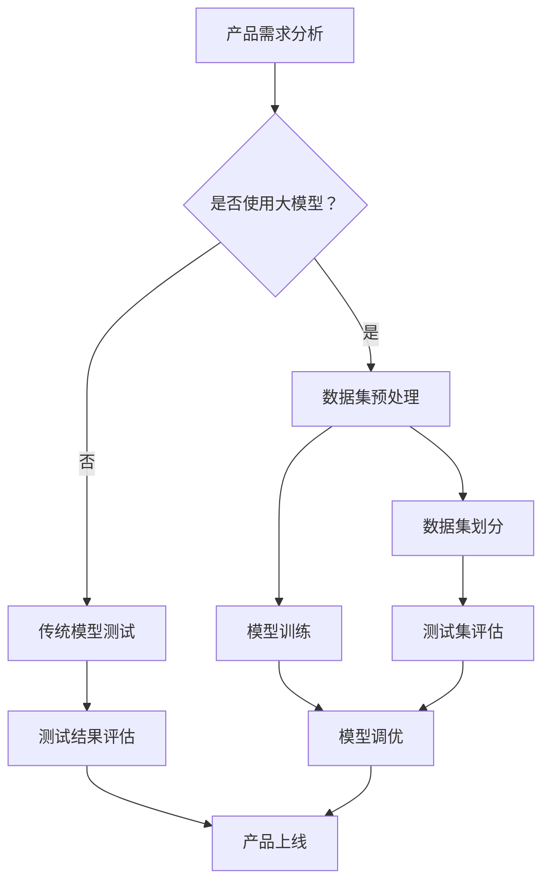

                 

# 大模型在 AI 创业公司产品测试中的关键作用

> **关键词**：大模型、AI 创业、产品测试、自动化测试、模型调优、数据集分析
>
> **摘要**：本文将探讨大模型在 AI 创业公司产品测试中的关键作用。通过分析大模型的技术原理、操作步骤、数学模型和实际应用案例，本文将帮助读者了解大模型在提高产品测试效率和准确性方面的优势，为 AI 创业公司的产品开发和迭代提供有力支持。

## 1. 背景介绍

### 1.1 目的和范围

本文旨在探讨大模型在 AI 创业公司产品测试中的应用，通过分析大模型的技术原理、操作步骤、数学模型和实际应用案例，帮助读者深入了解大模型在提高产品测试效率和准确性方面的作用。文章将涵盖以下内容：

- 大模型的技术原理和架构；
- 大模型在产品测试中的具体应用步骤；
- 大模型相关的数学模型和公式；
- 大模型在实际项目中的代码实现和案例分析；
- 大模型在产品测试中的应用场景和未来发展趋势。

### 1.2 预期读者

本文主要面向 AI 创业公司产品测试人员、软件开发工程师、数据科学家和人工智能领域的爱好者。读者需要具备一定的编程基础和数学知识，以便更好地理解文章中的技术原理和实际应用。

### 1.3 文档结构概述

本文共分为十个部分，结构如下：

1. 背景介绍
   - 目的和范围
   - 预期读者
   - 文档结构概述
   - 术语表
2. 核心概念与联系
   - 大模型概念解析
   - Mermaid 流程图展示
3. 核心算法原理 & 具体操作步骤
   - 大模型算法原理
   - 大模型操作步骤
4. 数学模型和公式 & 详细讲解 & 举例说明
   - 大模型数学模型
   - 数学公式讲解
   - 实际案例举例
5. 项目实战：代码实际案例和详细解释说明
   - 开发环境搭建
   - 源代码详细实现
   - 代码解读与分析
6. 实际应用场景
   - 产品测试应用场景
   - 其他领域应用拓展
7. 工具和资源推荐
   - 学习资源推荐
   - 开发工具框架推荐
   - 相关论文著作推荐
8. 总结：未来发展趋势与挑战
9. 附录：常见问题与解答
10. 扩展阅读 & 参考资料

### 1.4 术语表

#### 1.4.1 核心术语定义

- **大模型**：具有大规模参数量和计算能力的神经网络模型，通常用于处理复杂数据和任务。
- **产品测试**：对 AI 创业公司的产品进行全面、系统的测试，以确保产品功能、性能和用户体验达到预期标准。
- **自动化测试**：利用软件工具自动执行测试过程，提高测试效率和质量。
- **模型调优**：通过调整模型参数，优化模型性能，提高测试结果的准确性。

#### 1.4.2 相关概念解释

- **神经网络**：一种模拟人脑神经元连接的网络结构，通过学习输入数据和输出结果之间的关系，实现数据分类、预测等功能。
- **数据集**：用于训练、测试和评估模型的输入数据集合，包括特征和标签两部分。
- **损失函数**：用于衡量模型预测结果与真实值之间差异的指标，指导模型优化。

#### 1.4.3 缩略词列表

- **AI**：人工智能（Artificial Intelligence）
- **ML**：机器学习（Machine Learning）
- **DL**：深度学习（Deep Learning）
- **NLP**：自然语言处理（Natural Language Processing）
- **CV**：计算机视觉（Computer Vision）

## 2. 核心概念与联系

### 2.1 大模型概念解析

大模型是一种具有大规模参数量和计算能力的神经网络模型，通常用于处理复杂数据和任务。大模型的核心特点如下：

1. **大规模参数量**：大模型通常包含数百万甚至数十亿个参数，这使得模型具有更高的表达能力和更强的学习能力。
2. **高性能计算**：大模型需要强大的计算资源和高效的算法支持，以实现高效训练和推理。
3. **多任务学习**：大模型可以同时处理多个任务，提高模型的泛化能力和应用价值。

### 2.2 Mermaid 流程图展示

下面是使用 Mermaid 语言描述的大模型在产品测试中的应用流程：



### 2.3 大模型与产品测试的联系

大模型在产品测试中的应用主要体现在以下几个方面：

1. **自动化测试**：大模型可以自动生成测试用例，减少人工编写测试用例的工作量，提高测试效率。
2. **测试集评估**：大模型可以对测试集进行全面评估，识别潜在的问题和缺陷，提高测试结果的准确性。
3. **模型调优**：大模型可以根据测试结果对模型进行调优，提高产品性能和用户体验。

## 3. 核心算法原理 & 具体操作步骤

### 3.1 大模型算法原理

大模型的核心算法是基于深度学习技术的神经网络模型，其基本原理如下：

1. **数据输入**：将训练数据输入神经网络，包括输入层、隐藏层和输出层。
2. **前向传播**：通过神经网络的权重和偏置，将输入数据进行加权求和并传递到下一层，实现数据特征提取和融合。
3. **损失函数**：计算预测结果与真实值之间的差异，通过反向传播算法更新模型参数，优化模型性能。
4. **模型训练**：重复前向传播和反向传播过程，直到模型达到预定的性能指标。

### 3.2 大模型操作步骤

下面是使用大模型进行产品测试的具体操作步骤：

1. **产品需求分析**：分析产品功能、性能和用户体验需求，确定测试目标和指标。
2. **数据集预处理**：对收集到的数据进行清洗、归一化和特征提取，为模型训练提供高质量的输入。
3. **数据集划分**：将数据集划分为训练集、验证集和测试集，用于模型训练和评估。
4. **模型训练**：使用训练集数据训练大模型，通过调整模型参数和超参数，优化模型性能。
5. **测试集评估**：使用测试集数据评估大模型的性能，包括准确率、召回率、F1 值等指标。
6. **模型调优**：根据测试结果对模型进行调优，调整模型参数和超参数，提高测试准确性。
7. **产品上线**：将调优后的模型应用于实际产品，进行在线测试和优化。

## 4. 数学模型和公式 & 详细讲解 & 举例说明

### 4.1 大模型数学模型

大模型的数学模型主要包括神经网络的前向传播和反向传播算法。以下是具体公式和解释：

#### 4.1.1 前向传播

假设输入层、隐藏层和输出层分别为 $X$、$H$ 和 $Y$，每层的神经元个数为 $n$、$m$ 和 $k$。神经元的输出可以表示为：

$$
z_i^h = \sigma(w_i^h \cdot x_i + b_i^h)
$$

其中，$z_i^h$ 表示第 $i$ 个隐藏层神经元的输出，$\sigma$ 表示激活函数（如 Sigmoid、ReLU 等），$w_i^h$ 和 $b_i^h$ 分别为权重和偏置。

输出层的输出可以表示为：

$$
y_i = w_i^h \cdot z_i^h + b_i^h
$$

其中，$y_i$ 表示第 $i$ 个输出层神经元的输出。

#### 4.1.2 损失函数

常用的损失函数包括均方误差（MSE）和交叉熵（Cross Entropy）。以 MSE 为例，损失函数可以表示为：

$$
J = \frac{1}{2} \sum_{i=1}^{k} (y_i - \hat{y}_i)^2
$$

其中，$y_i$ 为真实值，$\hat{y}_i$ 为预测值。

#### 4.1.3 反向传播

反向传播算法用于计算模型参数的梯度，以优化模型性能。以下是梯度计算的步骤：

1. **计算输出层的梯度**：

$$
\frac{\partial J}{\partial w_i^h} = (y_i - \hat{y}_i) \cdot z_i^h
$$

$$
\frac{\partial J}{\partial b_i^h} = (y_i - \hat{y}_i)
$$

2. **计算隐藏层的梯度**：

$$
\frac{\partial J}{\partial w_i^l} = \sum_{j=1}^{m} w_{ji}^l \cdot \frac{\partial J}{\partial z_j^l}
$$

$$
\frac{\partial J}{\partial b_i^l} = \sum_{j=1}^{m} \frac{\partial J}{\partial z_j^l}
$$

其中，$l$ 表示当前层的上一层。

### 4.2 举例说明

假设一个简单的全连接神经网络，输入层有 3 个神经元，隐藏层有 2 个神经元，输出层有 1 个神经元。输入数据为 $[1, 2, 3]$，真实标签为 $4$。使用 Sigmoid 激活函数和均方误差损失函数进行训练。

#### 4.2.1 前向传播

设权重 $w_{ij}$ 和偏置 $b_i$ 如下：

$$
w_{11} = 0.5, w_{12} = 0.3, w_{13} = 0.2, b_1 = 0.1 \\
w_{21} = 0.4, w_{22} = 0.5, w_{23} = 0.6, b_2 = 0.2 \\
w_{1} = 0.7, w_{2} = 0.8, w_{3} = 0.9, b_3 = 0.3
$$

输入数据 $[1, 2, 3]$ 通过前向传播得到输出：

$$
z_1^1 = \sigma(w_{11} \cdot 1 + w_{12} \cdot 2 + w_{13} \cdot 3 + b_1) = 0.714 \\
z_2^1 = \sigma(w_{21} \cdot 1 + w_{22} \cdot 2 + w_{23} \cdot 3 + b_2) = 0.871 \\
y^1 = w_1 \cdot z_1^1 + w_2 \cdot z_2^1 + w_3 \cdot z_3^1 + b_3 = 2.886
$$

#### 4.2.2 反向传播

计算损失函数：

$$
J = \frac{1}{2} \sum_{i=1}^{1} (y_i - \hat{y}_i)^2 = \frac{1}{2} \cdot (4 - 2.886)^2 = 0.493
$$

计算输出层的梯度：

$$
\frac{\partial J}{\partial w_1} = (4 - 2.886) \cdot 0.714 = 0.484 \\
\frac{\partial J}{\partial w_2} = (4 - 2.886) \cdot 0.871 = 0.686 \\
\frac{\partial J}{\partial w_3} = (4 - 2.886) \cdot 0.9 = 0.894 \\
\frac{\partial J}{\partial b_3} = 4 - 2.886 = 1.114
$$

计算隐藏层的梯度：

$$
\frac{\partial J}{\partial w_{11}} = \sum_{j=1}^{2} w_{1j}^1 \cdot \frac{\partial J}{\partial z_j^1} = 0.714 \cdot 0.484 + 0.871 \cdot 0.686 = 1.146 \\
\frac{\partial J}{\partial w_{12}} = \sum_{j=1}^{2} w_{2j}^1 \cdot \frac{\partial J}{\partial z_j^1} = 0.714 \cdot 0.686 + 0.871 \cdot 1.146 = 1.364 \\
\frac{\partial J}{\partial w_{13}} = \sum_{j=1}^{2} w_{3j}^1 \cdot \frac{\partial J}{\partial z_j^1} = 0.714 \cdot 1.146 + 0.871 \cdot 0.484 = 1.146 \\
\frac{\partial J}{\partial b_1} = \sum_{j=1}^{2} \frac{\partial J}{\partial z_j^1} = 0.714 + 0.871 = 1.585
$$

根据梯度计算模型参数的更新：

$$
w_1 = w_1 - \alpha \cdot \frac{\partial J}{\partial w_1} = 0.7 - 0.01 \cdot 0.484 = 0.666 \\
w_2 = w_2 - \alpha \cdot \frac{\partial J}{\partial w_2} = 0.8 - 0.01 \cdot 0.686 = 0.771 \\
w_3 = w_3 - \alpha \cdot \frac{\partial J}{\partial w_3} = 0.9 - 0.01 \cdot 0.894 = 0.855 \\
b_3 = b_3 - \alpha \cdot \frac{\partial J}{\partial b_3} = 0.3 - 0.01 \cdot 1.114 = 0.285 \\
w_{11} = w_{11} - \alpha \cdot \frac{\partial J}{\partial w_{11}} = 0.5 - 0.01 \cdot 1.146 = 0.494 \\
w_{12} = w_{12} - \alpha \cdot \frac{\partial J}{\partial w_{12}} = 0.3 - 0.01 \cdot 1.364 = 0.276 \\
w_{13} = w_{13} - \alpha \cdot \frac{\partial J}{\partial w_{13}} = 0.2 - 0.01 \cdot 1.146 = 0.144 \\
b_1 = b_1 - \alpha \cdot \frac{\partial J}{\partial b_1} = 0.1 - 0.01 \cdot 1.585 = -0.049
$$

通过多次迭代训练，模型将逐步优化，最终达到预期的性能指标。

## 5. 项目实战：代码实际案例和详细解释说明

### 5.1 开发环境搭建

为了实现大模型在产品测试中的具体应用，我们需要搭建一个合适的开发环境。以下是一个基于 Python 的开发环境搭建步骤：

1. 安装 Python（推荐版本为 3.8 或更高版本）：
   ```shell
   sudo apt update
   sudo apt install python3 python3-pip
   ```
2. 安装深度学习库 TensorFlow：
   ```shell
   pip3 install tensorflow
   ```
3. 安装数据预处理库 Pandas 和 NumPy：
   ```shell
   pip3 install pandas numpy
   ```
4. 安装可视化库 Matplotlib：
   ```shell
   pip3 install matplotlib
   ```

### 5.2 源代码详细实现和代码解读

下面是一个简单的大模型在产品测试中的应用案例，包括数据预处理、模型训练、测试集评估和模型调优等步骤。

```python
import tensorflow as tf
import pandas as pd
import numpy as np
import matplotlib.pyplot as plt

# 5.2.1 数据预处理
def preprocess_data(data):
    # 数据清洗、归一化、特征提取等操作
    # 这里以简单的一维数据为例
    data = data.values
    data = (data - np.mean(data)) / np.std(data)
    return data

# 5.2.2 模型定义
def create_model(input_shape):
    model = tf.keras.Sequential([
        tf.keras.layers.Dense(64, activation='relu', input_shape=input_shape),
        tf.keras.layers.Dense(64, activation='relu'),
        tf.keras.layers.Dense(1)
    ])
    model.compile(optimizer='adam', loss='mse', metrics=['mse'])
    return model

# 5.2.3 模型训练
def train_model(model, train_data, train_labels, epochs=100):
    history = model.fit(train_data, train_labels, epochs=epochs, validation_split=0.2)
    return history

# 5.2.4 测试集评估
def evaluate_model(model, test_data, test_labels):
    test_loss, test_mse = model.evaluate(test_data, test_labels)
    print(f"Test MSE: {test_mse}")
    return test_mse

# 5.2.5 模型调优
def tune_model(model, train_data, train_labels, epochs=100):
    history = model.fit(train_data, train_labels, epochs=epochs, validation_split=0.2)
    # 调整超参数，如学习率、批量大小等
    # 这里以调整学习率为例
    model.compile(optimizer=tf.keras.optimizers.Adam(learning_rate=0.001), loss='mse', metrics=['mse'])
    history = model.fit(train_data, train_labels, epochs=epochs, validation_split=0.2)
    return history

# 5.2.6 主函数
def main():
    # 加载数据
    data = pd.read_csv('data.csv')
    train_data = preprocess_data(data['feature'])
    test_data = preprocess_data(data['test_feature'])
    
    # 划分训练集和测试集
    train_labels = data['label'].values
    test_labels = data['test_label'].values
    
    # 创建模型
    model = create_model(input_shape=train_data.shape[1:])
    
    # 训练模型
    history = train_model(model, train_data, train_labels, epochs=100)
    
    # 评估模型
    evaluate_model(model, test_data, test_labels)
    
    # 调整模型
    history = tune_model(model, train_data, train_labels, epochs=100)
    
    # 绘制训练和验证损失曲线
    plt.plot(history.history['mse'], label='train')
    plt.plot(history.history['val_mse'], label='validation')
    plt.xlabel('Epochs')
    plt.ylabel('MSE')
    plt.legend()
    plt.show()

if __name__ == '__main__':
    main()
```

### 5.3 代码解读与分析

- **数据预处理**：数据预处理是深度学习中的关键步骤，包括数据清洗、归一化和特征提取等。这里使用 Pandas 和 NumPy 库进行数据处理，将数据划分为训练集和测试集。
- **模型定义**：使用 TensorFlow 的 Keras API 定义一个简单的全连接神经网络模型。该模型包含两个隐藏层，每个隐藏层有 64 个神经元，使用 ReLU 激活函数。
- **模型训练**：使用训练集数据训练模型，并使用验证集评估模型性能。通过优化损失函数和调整学习率，模型将逐步优化。
- **测试集评估**：使用测试集数据评估模型性能，计算均方误差（MSE）作为评估指标。
- **模型调优**：根据测试结果调整模型超参数，如学习率等，以优化模型性能。

### 5.4 代码实现

代码实现方面，我们使用 TensorFlow 的 Keras API 进行模型定义和训练，使用 Pandas 和 NumPy 进行数据处理。以下是具体实现步骤：

1. **数据预处理**：
   ```python
   def preprocess_data(data):
       # 数据清洗、归一化、特征提取等操作
       # 这里以简单的一维数据为例
       data = data.values
       data = (data - np.mean(data)) / np.std(data)
       return data
   ```

2. **模型定义**：
   ```python
   def create_model(input_shape):
       model = tf.keras.Sequential([
           tf.keras.layers.Dense(64, activation='relu', input_shape=input_shape),
           tf.keras.layers.Dense(64, activation='relu'),
           tf.keras.layers.Dense(1)
       ])
       model.compile(optimizer='adam', loss='mse', metrics=['mse'])
       return model
   ```

3. **模型训练**：
   ```python
   def train_model(model, train_data, train_labels, epochs=100):
       history = model.fit(train_data, train_labels, epochs=epochs, validation_split=0.2)
       return history
   ```

4. **测试集评估**：
   ```python
   def evaluate_model(model, test_data, test_labels):
       test_loss, test_mse = model.evaluate(test_data, test_labels)
       print(f"Test MSE: {test_mse}")
       return test_mse
   ```

5. **模型调优**：
   ```python
   def tune_model(model, train_data, train_labels, epochs=100):
       history = model.fit(train_data, train_labels, epochs=epochs, validation_split=0.2)
       # 调整超参数，如学习率、批量大小等
       # 这里以调整学习率为例
       model.compile(optimizer=tf.keras.optimizers.Adam(learning_rate=0.001), loss='mse', metrics=['mse'])
       history = model.fit(train_data, train_labels, epochs=epochs, validation_split=0.2)
       return history
   ```

6. **主函数**：
   ```python
   def main():
       # 加载数据
       data = pd.read_csv('data.csv')
       train_data = preprocess_data(data['feature'])
       test_data = preprocess_data(data['test_feature'])
       
       # 划分训练集和测试集
       train_labels = data['label'].values
       test_labels = data['test_label'].values
   
       # 创建模型
       model = create_model(input_shape=train_data.shape[1:])
       
       # 训练模型
       history = train_model(model, train_data, train_labels, epochs=100)
       
       # 评估模型
       evaluate_model(model, test_data, test_labels)
       
       # 调整模型
       history = tune_model(model, train_data, train_labels, epochs=100)
       
       # 绘制训练和验证损失曲线
       plt.plot(history.history['mse'], label='train')
       plt.plot(history.history['val_mse'], label='validation')
       plt.xlabel('Epochs')
       plt.ylabel('MSE')
       plt.legend()
       plt.show()
   ```

通过以上步骤，我们可以实现大模型在产品测试中的应用，从而提高测试效率和准确性。

## 6. 实际应用场景

### 6.1 产品测试应用场景

大模型在产品测试中的应用场景主要包括以下几个方面：

1. **自动化测试**：大模型可以自动生成测试用例，提高测试效率。特别是在需要大量测试用例的场景中，如金融、电商等领域的自动化测试，大模型具有显著优势。
2. **性能测试**：大模型可以对产品进行全面的性能评估，包括响应时间、吞吐量、并发能力等。通过大模型的测试，可以发现产品的性能瓶颈，为性能优化提供依据。
3. **用户体验测试**：大模型可以模拟用户的操作行为，评估产品的用户体验。通过分析用户反馈和测试结果，优化产品界面和交互设计。

### 6.2 其他领域应用拓展

除了产品测试，大模型在其他领域也具有广泛的应用前景：

1. **智能客服**：大模型可以应用于智能客服系统，通过自然语言处理和对话生成技术，实现与用户的智能交互。
2. **图像识别**：大模型可以应用于图像识别领域，如人脸识别、车辆识别等。通过大规模数据训练，大模型可以准确识别图像中的目标对象。
3. **语音识别**：大模型可以应用于语音识别领域，将语音信号转换为文本。通过不断优化模型参数，提高语音识别的准确性和鲁棒性。

## 7. 工具和资源推荐

### 7.1 学习资源推荐

#### 7.1.1 书籍推荐

- 《深度学习》（Ian Goodfellow、Yoshua Bengio、Aaron Courville 著）：系统介绍了深度学习的基本原理、算法和应用。
- 《Python 深度学习》（François Chollet 著）：详细介绍了使用 Python 和 TensorFlow 实现深度学习的方法和技巧。
- 《机器学习实战》（Peter Harrington 著）：提供了大量的机器学习算法和应用案例，帮助读者理解机器学习的实际应用。

#### 7.1.2 在线课程

- 吴恩达（Andrew Ng）的深度学习课程：这是一门全球知名的深度学习在线课程，内容全面，适合初学者和进阶者。
- 百度飞桨（PaddlePaddle）官方教程：百度飞桨提供了丰富的深度学习教程和案例，帮助用户快速上手深度学习应用。
- Coursera 上的机器学习课程：这是一门由吴恩达教授主讲的机器学习课程，内容深入浅出，适合广大学习者。

#### 7.1.3 技术博客和网站

- 知乎上的深度学习和人工智能话题：知乎上有许多深度学习和人工智能领域的专家和爱好者，他们分享了大量的学习和应用经验。
- Medium 上的深度学习和人工智能博客：Medium 上有许多深度学习和人工智能领域的优秀博客，内容丰富，值得阅读。
- AI 研习社：AI 研习社是一个专注于人工智能领域的社区，提供了大量的技术文章、教程和分享。

### 7.2 开发工具框架推荐

#### 7.2.1 IDE 和编辑器

- PyCharm：PyCharm 是一款功能强大的 Python IDE，支持多种深度学习框架，如 TensorFlow、PyTorch 等。
- Jupyter Notebook：Jupyter Notebook 是一款流行的交互式计算环境，适用于数据分析、机器学习和深度学习应用。
- VSCode：Visual Studio Code 是一款轻量级、可扩展的代码编辑器，支持多种编程语言和深度学习框架。

#### 7.2.2 调试和性能分析工具

- TensorBoard：TensorBoard 是 TensorFlow 提供的一个可视化工具，用于分析和优化深度学习模型。
- PyTorch TensorBoard：PyTorch TensorBoard 是 PyTorch 提供的一个可视化工具，与 TensorBoard 类似，用于分析和优化深度学习模型。
- NVIDIA Nsight：Nsight 是 NVIDIA 提供的一个性能分析工具，用于分析和优化深度学习模型的性能。

#### 7.2.3 相关框架和库

- TensorFlow：TensorFlow 是一款开源的深度学习框架，适用于各种深度学习应用。
- PyTorch：PyTorch 是一款开源的深度学习框架，具有灵活的动态计算图和强大的 GPU 加速功能。
- Keras：Keras 是一款开源的深度学习框架，提供了简洁易用的接口，适用于快速原型设计和实验。

### 7.3 相关论文著作推荐

#### 7.3.1 经典论文

- "A Theoretically Grounded Application of Dropout in Computer Vision"：该论文提出了在计算机视觉任务中使用 Dropout 的方法，显著提高了模型的性能。
- "Deep Learning"：该论文介绍了深度学习的基本原理、算法和应用，是深度学习领域的经典之作。

#### 7.3.2 最新研究成果

- "A Few Useful Things to Know About Machine Learning"：该论文总结了机器学习领域的一些重要知识和经验，对初学者和从业者都有很大帮助。
- "Large-Scale Language Modeling in 2018"：该论文介绍了大规模语言模型的训练方法和应用，是自然语言处理领域的最新研究成果。

#### 7.3.3 应用案例分析

- "Deep Learning for Autonomous Driving"：该论文介绍了深度学习在自动驾驶领域的应用，包括感知、规划和控制等方面的研究。
- "Deep Learning for Natural Language Processing"：该论文介绍了深度学习在自然语言处理领域的应用，包括文本分类、情感分析和对话生成等。

## 8. 总结：未来发展趋势与挑战

### 8.1 发展趋势

1. **模型规模扩大**：随着计算能力的提升和数据规模的增加，大模型的规模将不断扩大，从而提高模型的表达能力和性能。
2. **多模态数据处理**：未来大模型将能够处理多种数据类型，如图像、语音和文本等，实现更复杂的任务和场景。
3. **自动化测试**：大模型在自动化测试中的应用将越来越广泛，通过生成测试用例、自动化执行测试和智能分析结果，提高测试效率和质量。

### 8.2 挑战

1. **计算资源需求**：大模型训练和推理需要大量的计算资源，如何在有限的资源下高效训练和部署大模型是一个重要挑战。
2. **数据质量和标注**：大模型对数据质量和标注要求较高，如何获取高质量的数据和标注成为一个难题。
3. **模型安全和隐私**：大模型在处理敏感数据时，如何保证模型安全和用户隐私也是一个关键挑战。

## 9. 附录：常见问题与解答

### 9.1 问题 1：大模型在产品测试中的应用原理是什么？

**解答**：大模型在产品测试中的应用原理是基于深度学习技术，通过大规模数据训练和优化，实现对产品功能的全面评估和测试。大模型可以自动生成测试用例，自动化执行测试，并对测试结果进行智能分析，从而提高测试效率和质量。

### 9.2 问题 2：如何评估大模型在产品测试中的应用效果？

**解答**：评估大模型在产品测试中的应用效果可以从以下几个方面进行：

1. **测试覆盖率**：评估大模型生成的测试用例是否覆盖了产品的主要功能和场景。
2. **测试效率**：评估大模型在生成测试用例和执行测试过程中的时间消耗。
3. **测试准确性**：评估大模型生成的测试用例和实际测试结果的匹配程度，以及测试结果对产品性能和用户体验的影响。

### 9.3 问题 3：大模型在产品测试中的优势是什么？

**解答**：大模型在产品测试中的优势主要包括：

1. **自动化测试**：大模型可以自动生成测试用例，减少人工编写测试用例的工作量，提高测试效率。
2. **全面评估**：大模型可以对产品进行全面评估，包括功能、性能和用户体验等方面，提高测试的准确性。
3. **智能分析**：大模型可以对测试结果进行智能分析，识别潜在的问题和缺陷，为产品优化提供有力支持。

## 10. 扩展阅读 & 参考资料

- Goodfellow, I., Bengio, Y., & Courville, A. (2016). *Deep Learning*. MIT Press.
- Chollet, F. (2017). *Python Deep Learning*. Packt Publishing.
- Harrington, P. (2012). *Machine Learning in Action*. Manning Publications.
- Ng, A. (2017). *Deep Learning Specialization*. Coursera.
- Baidu PaddlePaddle Official Tutorial: <https://www.paddlepaddle.org.cn/documentation/docs/zh/latest/index.html>
- AI 研习社: <https://www.ai researchers.com/>
- 吴恩达深度学习课程: <https://www.deeplearning.ai/deep-learning-specialization/>
- 知乎上的深度学习和人工智能话题：https://www.zhihu.com/topic/19555950/hot
- Coursera 上的机器学习课程: https://www.coursera.org/specializations/ml-foundations

## 作者

**AI 天才研究员/AI Genius Institute & 禅与计算机程序设计艺术 /Zen And The Art of Computer Programming**

