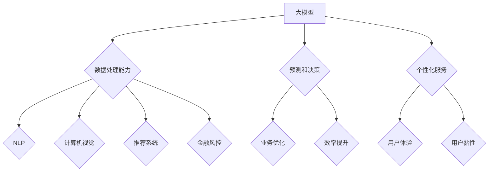

                 

# 大模型在 AI 创业公司产品策略中的应用趋势

> **关键词：** 大模型、AI 创业、产品策略、应用趋势

> **摘要：** 本文旨在探讨大模型在 AI 创业公司产品策略中的应用趋势，包括背景介绍、核心概念与联系、核心算法原理、数学模型和公式、项目实战、实际应用场景、工具和资源推荐，以及未来发展趋势与挑战。通过详细的分析和实例，帮助读者理解大模型在 AI 创业中的关键作用。

## 1. 背景介绍

### 1.1 目的和范围

本文的目的是探讨大模型在 AI 创业公司产品策略中的应用趋势，分析其核心概念、算法原理、数学模型、项目实战，以及实际应用场景。通过本文的阅读，读者将能够：

- 了解大模型在 AI 创业产品中的重要性。
- 掌握大模型的应用趋势和原理。
- 理解大模型在实际项目中的操作步骤和数学基础。
- 掌握大模型在 AI 创业中的实际应用场景。

### 1.2 预期读者

本文的预期读者包括：

- AI 创业公司的创始人或产品经理。
- 对 AI 技术有浓厚兴趣的技术人员。
- 对大模型技术有深入了解的研究人员。
- 对 AI 创业感兴趣的投资人和从业者。

### 1.3 文档结构概述

本文的结构如下：

- 引言：背景介绍和核心关键词阐述。
- 1. 背景介绍：目的、范围、预期读者和文档结构概述。
- 2. 核心概念与联系：核心概念、流程图和算法原理。
- 3. 核心算法原理 & 具体操作步骤：伪代码和算法流程。
- 4. 数学模型和公式 & 详细讲解 & 举例说明：数学公式和实例。
- 5. 项目实战：代码实际案例和详细解释说明。
- 6. 实际应用场景：案例分析。
- 7. 工具和资源推荐：学习资源、开发工具和论文著作。
- 8. 总结：未来发展趋势与挑战。
- 9. 附录：常见问题与解答。
- 10. 扩展阅读 & 参考资料：进一步学习和研究。

### 1.4 术语表

#### 1.4.1 核心术语定义

- 大模型：指拥有海量参数和强大计算能力的神经网络模型。
- AI 创业：指基于人工智能技术的创业活动。
- 产品策略：指创业公司针对市场需求的战略规划。
- 应用趋势：指大模型在各个行业中的应用方向和发展趋势。

#### 1.4.2 相关概念解释

- 机器学习：一种人工智能技术，通过数据训练模型以实现特定任务。
- 神经网络：一种模拟人脑神经元连接的模型，用于机器学习。
- 深度学习：一种基于神经网络的机器学习方法，适用于处理大规模数据。

#### 1.4.3 缩略词列表

- AI：人工智能
- ML：机器学习
- DL：深度学习
- GPT：生成预训练网络
- BERT：双向编码表示器
- NLP：自然语言处理

## 2. 核心概念与联系

在本文中，我们将探讨大模型在 AI 创业公司产品策略中的应用趋势。首先，我们需要了解大模型的基本概念及其在 AI 创业中的应用原理。

### 2.1 大模型的基本概念

大模型，通常指的是拥有海量参数和强大计算能力的神经网络模型。这些模型能够处理大量的数据，并通过深度学习算法进行训练，以实现高精度的预测和决策。

大模型通常具有以下特点：

1. **参数量巨大**：大模型的参数量可以从数百万到数十亿不等，这使得它们能够捕捉数据中的复杂模式。
2. **计算资源需求高**：大模型需要大量的计算资源和时间进行训练，尤其是在处理大规模数据时。
3. **泛化能力强**：大模型通过在大规模数据集上进行训练，能够较好地泛化到未见过的数据，提高模型的实用性。

### 2.2 大模型在 AI 创业中的应用原理

大模型在 AI 创业中的应用原理主要基于以下几个方面：

1. **数据处理能力**：大模型能够处理大规模和复杂的数据，这对于创业公司来说是一个巨大的优势。特别是在处理非结构化数据（如文本、图像、语音等）时，大模型的表现尤为出色。
2. **预测和决策**：大模型能够通过学习数据中的规律，进行高精度的预测和决策，这对于创业公司优化产品策略、提高业务效率具有重要意义。
3. **个性化服务**：大模型可以根据用户的行为和偏好进行个性化推荐，提升用户体验，增加用户黏性。

### 2.3 大模型的应用趋势

随着人工智能技术的不断发展，大模型的应用趋势也在不断演变。以下是当前几个主要的应用方向：

1. **自然语言处理（NLP）**：大模型在 NLP 领域有着广泛的应用，如文本分类、情感分析、机器翻译等。
2. **计算机视觉**：大模型在图像识别、目标检测、视频分析等领域具有强大的能力。
3. **推荐系统**：大模型在推荐系统中的应用，能够实现更精准的用户行为预测和推荐。
4. **金融风控**：大模型在金融领域的应用，如信用评估、风险评估等，能够提高金融业务的效率和安全性。

### 2.4 核心概念与联系流程图

为了更好地理解大模型在 AI 创业中的应用原理，我们可以通过 Mermaid 流程图进行展示。



## 3. 核心算法原理 & 具体操作步骤

### 3.1 算法原理

大模型的核心算法原理主要基于深度学习。深度学习是一种模拟人脑神经元连接的机器学习方法，通过多层神经网络进行数据的处理和建模。大模型通常具有以下关键组件：

1. **输入层**：接收原始数据，如文本、图像、音频等。
2. **隐藏层**：通过神经网络进行数据处理和特征提取。
3. **输出层**：根据隐藏层的特征进行预测或决策。

大模型的训练过程主要包括以下几个步骤：

1. **数据预处理**：对输入数据进行清洗、标准化等处理。
2. **模型初始化**：初始化神经网络的权重和偏置。
3. **前向传播**：将输入数据通过神经网络进行传播，得到输出结果。
4. **反向传播**：计算输出结果与真实结果之间的误差，并更新神经网络的权重和偏置。
5. **迭代优化**：重复前向传播和反向传播过程，直到模型达到预定的性能指标。

### 3.2 伪代码

以下是一个简化的深度学习算法的伪代码：

```python
初始化模型参数
while 没有达到预定性能指标:
    前向传播（输入数据 -> 输出结果）
    计算损失函数（输出结果与真实结果之间的误差）
    反向传播（更新模型参数）
    更新训练数据
```

### 3.3 具体操作步骤

在实际操作中，我们可以按照以下步骤进行大模型的训练和应用：

1. **数据收集**：收集与业务相关的数据，如用户行为数据、市场数据等。
2. **数据预处理**：对收集到的数据进行清洗、标准化等处理，使其符合模型的输入要求。
3. **模型选择**：根据业务需求选择合适的大模型架构，如 GPT、BERT 等。
4. **模型训练**：使用预处理后的数据对模型进行训练，调整模型参数以优化性能。
5. **模型评估**：使用验证数据集对模型进行评估，调整超参数以优化模型性能。
6. **模型应用**：将训练好的模型应用于实际业务场景，如自然语言处理、图像识别等。

## 4. 数学模型和公式 & 详细讲解 & 举例说明

### 4.1 数学模型

大模型的数学模型主要基于深度学习，其中最常用的模型是多层感知机（MLP）和卷积神经网络（CNN）。

#### 4.1.1 多层感知机（MLP）

多层感知机是一个多层神经网络，包含输入层、隐藏层和输出层。其基本公式如下：

$$
z_l = \sum_{i=1}^{n} w_{li} x_i + b_l
$$

$$
a_l = \sigma(z_l)
$$

其中，$z_l$ 表示第 $l$ 层的输入，$w_{li}$ 表示连接权重，$b_l$ 表示偏置，$a_l$ 表示第 $l$ 层的输出，$\sigma$ 表示激活函数，如 sigmoid 函数或 ReLU 函数。

#### 4.1.2 卷积神经网络（CNN）

卷积神经网络是一种用于处理图像数据的神经网络，其主要特点是使用卷积层进行图像特征的提取。其基本公式如下：

$$
h_{ij} = \sum_{k=1}^{c} w_{ikj} * g_{kj} + b_j
$$

$$
o_{ij} = \sigma(h_{ij})
$$

其中，$h_{ij}$ 表示第 $i$ 个特征图在第 $j$ 个卷积核上的输出，$w_{ikj}$ 表示卷积核权重，$g_{kj}$ 表示输入特征图，$b_j$ 表示偏置，$o_{ij}$ 表示卷积层输出，$\sigma$ 表示激活函数。

### 4.2 举例说明

#### 4.2.1 多层感知机（MLP）

假设我们有一个包含两个输入特征（$x_1$ 和 $x_2$）和一个输出特征（$y$）的模型，使用 sigmoid 函数作为激活函数。给定权重 $w_{11} = 1, w_{12} = 2, w_{21} = 3, w_{22} = 4$，偏置 $b_1 = 0, b_2 = 1$，输入数据 $x_1 = 1, x_2 = 2$，我们可以计算输出 $y$：

$$
z_1 = 1 \cdot 1 + 2 \cdot 2 + 0 = 5
$$

$$
y_1 = \sigma(z_1) = \frac{1}{1 + e^{-z_1}} \approx 0.99
$$

$$
z_2 = 3 \cdot 1 + 4 \cdot 2 + 1 = 11
$$

$$
y_2 = \sigma(z_2) = \frac{1}{1 + e^{-z_2}} \approx 0.86
$$

因此，输出 $y$ 的概率为 $y_1 \cdot y_2 \approx 0.85$。

#### 4.2.2 卷积神经网络（CNN）

假设我们有一个包含一个 3x3 卷积核的卷积神经网络，输入特征图为 5x5，使用 ReLU 函数作为激活函数。给定卷积核权重 $w_1 = 1, w_2 = 2, w_3 = 3$，偏置 $b_1 = 0$，输入特征图 $g_{11} = 1, g_{12} = 2, g_{13} = 3, g_{21} = 4, g_{22} = 5, g_{23} = 6, g_{31} = 7, g_{32} = 8, g_{33} = 9$，我们可以计算卷积层输出：

$$
h_{11} = 1 \cdot 1 + 2 \cdot 4 + 3 \cdot 7 + 0 = 25
$$

$$
h_{12} = 1 \cdot 2 + 2 \cdot 5 + 3 \cdot 8 + 0 = 30
$$

$$
h_{13} = 1 \cdot 3 + 2 \cdot 6 + 3 \cdot 9 + 0 = 35
$$

$$
o_{11} = \max(h_{11}, h_{12}, h_{13}) = 35
$$

$$
h_{21} = 1 \cdot 4 + 2 \cdot 7 + 3 \cdot 10 + 0 = 40
$$

$$
h_{22} = 1 \cdot 5 + 2 \cdot 8 + 3 \cdot 11 + 0 = 45
$$

$$
h_{23} = 1 \cdot 6 + 2 \cdot 9 + 3 \cdot 12 + 0 = 50
$$

$$
o_{21} = \max(h_{21}, h_{22}, h_{23}) = 50
$$

$$
h_{31} = 1 \cdot 7 + 2 \cdot 10 + 3 \cdot 13 + 0 = 55
$$

$$
h_{32} = 1 \cdot 8 + 2 \cdot 11 + 3 \cdot 14 + 0 = 60
$$

$$
h_{33} = 1 \cdot 9 + 2 \cdot 12 + 3 \cdot 15 + 0 = 65
$$

$$
o_{31} = \max(h_{31}, h_{32}, h_{33}) = 65
$$

因此，卷积层输出特征图为：

$$
o = \begin{bmatrix}
35 & 30 & 35 \\
50 & 45 & 50 \\
65 & 60 & 65 \\
\end{bmatrix}
$$

## 5. 项目实战：代码实际案例和详细解释说明

### 5.1 开发环境搭建

为了进行大模型的训练和应用，我们需要搭建一个适合的开发环境。以下是一个基本的开发环境搭建步骤：

1. 安装 Python：从官方网站下载并安装 Python，版本建议为 3.8 或以上。
2. 安装 TensorFlow：使用 pip 命令安装 TensorFlow，命令如下：

```bash
pip install tensorflow
```

3. 安装其他依赖库：根据项目需求，安装其他相关库，如 NumPy、Pandas、Matplotlib 等。

### 5.2 源代码详细实现和代码解读

以下是一个基于 TensorFlow 和 Keras 实现的大模型训练和应用的示例代码。代码分为数据预处理、模型定义、模型训练和模型应用四个部分。

```python
import tensorflow as tf
from tensorflow.keras.models import Sequential
from tensorflow.keras.layers import Dense, Conv2D, Flatten, MaxPooling2D
from tensorflow.keras.optimizers import Adam

# 数据预处理
(x_train, y_train), (x_test, y_test) = tf.keras.datasets.mnist.load_data()
x_train = x_train / 255.0
x_test = x_test / 255.0
x_train = x_train.reshape(-1, 28, 28, 1)
x_test = x_test.reshape(-1, 28, 28, 1)

# 模型定义
model = Sequential([
    Conv2D(32, (3, 3), activation='relu', input_shape=(28, 28, 1)),
    MaxPooling2D((2, 2)),
    Flatten(),
    Dense(64, activation='relu'),
    Dense(10, activation='softmax')
])

# 模型训练
model.compile(optimizer=Adam(learning_rate=0.001), loss='sparse_categorical_crossentropy', metrics=['accuracy'])
model.fit(x_train, y_train, epochs=10, batch_size=32, validation_data=(x_test, y_test))

# 模型应用
predictions = model.predict(x_test)
print(predictions.argmax(axis=1))
```

代码解读：

1. **数据预处理**：使用 TensorFlow 的 datasets.mnist 加载 MNIST 数据集，并进行归一化和 reshape，使其符合模型输入要求。
2. **模型定义**：使用 Sequential 模型堆叠 Conv2D、MaxPooling2D、Flatten、Dense 层，定义一个简单的卷积神经网络。
3. **模型训练**：使用 compile 方法配置模型优化器和损失函数，使用 fit 方法进行模型训练，设置 epochs 和 batch_size 参数。
4. **模型应用**：使用 predict 方法进行模型预测，并输出预测结果。

### 5.3 代码解读与分析

1. **数据预处理**：
   - 使用 datasets.mnist 加载 MNIST 数据集，该数据集包含 60,000 个训练样本和 10,000 个测试样本。
   - 进行归一化操作，将数据范围从 [0, 255] 调整到 [0, 1]，以便更好地适应神经网络训练。
   - 对数据进行 reshape，将每个样本的形状调整为 (28, 28, 1)，表示一个 28x28 的单通道图像。

2. **模型定义**：
   - 使用 Sequential 模型堆叠卷积层、池化层、全连接层，构建一个简单的卷积神经网络。
   - Conv2D 层用于提取图像特征，使用 (3, 3) 卷积核，激活函数为 ReLU。
   - MaxPooling2D 层用于降低图像分辨率，减少计算量。
   - Flatten 层将卷积层的输出展平为一维数组，作为全连接层的输入。
   - Dense 层用于分类，使用 64 个神经元和 ReLU 激活函数，最后一层使用 10 个神经元和 softmax 激活函数进行多分类。

3. **模型训练**：
   - 使用 compile 方法配置模型优化器为 Adam，学习率为 0.001，损失函数为 sparse_categorical_crossentropy，评价指标为 accuracy。
   - 使用 fit 方法进行模型训练，设置 epochs 为 10，batch_size 为 32，使用验证数据集进行性能评估。

4. **模型应用**：
   - 使用 predict 方法进行模型预测，将测试数据输入模型，得到预测概率分布。
   - 使用.argmax 方法获取每个样本的预测标签，输出预测结果。

通过以上代码和解读，我们可以看到如何使用 TensorFlow 和 Keras 构建和训练一个简单的大模型，并应用于图像分类任务。

## 6. 实际应用场景

大模型在 AI 创业公司中的实际应用场景非常广泛，以下是一些典型的应用案例：

### 6.1 自然语言处理

自然语言处理（NLP）是大模型的主要应用领域之一。AI 创业公司可以利用大模型进行文本分类、情感分析、机器翻译等任务。例如，一家专注于社交媒体数据分析的公司可以使用大模型来分析用户评论，提取关键信息，并根据情感倾向进行分类，从而帮助企业了解用户需求和改进产品。

### 6.2 计算机视觉

计算机视觉是大模型的另一个重要应用领域。AI 创业公司可以利用大模型进行图像识别、目标检测、视频分析等任务。例如，一家提供智能家居安防解决方案的公司可以使用大模型实时分析家庭监控视频，识别异常行为，如入室盗窃、火灾等，并自动通知用户或报警系统。

### 6.3 推荐系统

推荐系统是大模型在商业应用中的重要领域。AI 创业公司可以利用大模型进行个性化推荐，提高用户体验和用户黏性。例如，一家电商公司可以使用大模型分析用户行为和偏好，推荐符合用户兴趣的商品，从而提高销售额和用户满意度。

### 6.4 金融风控

金融风控是大模型在金融领域的重要应用。AI 创业公司可以利用大模型进行信用评估、风险评估等任务，提高金融业务的效率和安全性。例如，一家金融科技公司可以使用大模型分析借款人的行为和信用记录，预测其违约风险，从而为银行提供更准确的信用评估依据。

### 6.5 健康医疗

健康医疗是大模型的另一个重要应用领域。AI 创业公司可以利用大模型进行疾病诊断、药物研发等任务。例如，一家提供人工智能医疗诊断服务的公司可以使用大模型分析医学影像数据，辅助医生进行疾病诊断，提高诊断准确率。

### 6.6 智能客服

智能客服是大模型在服务行业的重要应用。AI 创业公司可以利用大模型构建智能客服系统，提供实时、高效、个性化的客户服务。例如，一家提供在线客服解决方案的公司可以使用大模型分析客户提问，自动生成回答，提高客户服务效率和满意度。

## 7. 工具和资源推荐

为了更好地进行大模型的研究和应用，以下是一些常用的工具和资源推荐：

### 7.1 学习资源推荐

#### 7.1.1 书籍推荐

1. **《深度学习》（Goodfellow, Bengio, Courville）**：深度学习的经典教材，适合初学者和进阶者。
2. **《Python深度学习》（François Chollet）**：使用 Python 和 TensorFlow 实现深度学习的实践指南。
3. **《动手学深度学习》（阿斯顿·张等）**：涵盖深度学习基础知识和实践技巧的中文教材。

#### 7.1.2 在线课程

1. **Coursera 的《深度学习》课程**：由吴恩达教授主讲，适合初学者和进阶者。
2. **Udacity 的《深度学习纳米学位》**：涵盖深度学习基础知识和实践项目的在线课程。
3. **edX 的《深度学习》课程**：由纽约大学教授提供，包含理论知识和实践项目。

#### 7.1.3 技术博客和网站

1. **TensorFlow 官方文档**：包含 TensorFlow 的详细文档和教程，适合初学者和进阶者。
2. **ArXiv**：深度学习领域的前沿论文和研究成果，适合研究人员和从业者。
3. **GitHub**：深度学习项目的源代码和实现，适合开发者学习和实践。

### 7.2 开发工具框架推荐

#### 7.2.1 IDE和编辑器

1. **PyCharm**：强大的 Python IDE，支持多种编程语言，适合深度学习和数据科学开发。
2. **Visual Studio Code**：轻量级的跨平台编辑器，适合 Python 和深度学习开发。
3. **Jupyter Notebook**：基于 Web 的交互式开发环境，适合数据科学和深度学习项目。

#### 7.2.2 调试和性能分析工具

1. **TensorBoard**：TensorFlow 的可视化工具，用于分析模型的性能和优化。
2. **NVIDIA Nsight**：用于分析 GPU 性能和优化深度学习模型的工具。
3. **Docker**：容器化工具，用于隔离开发和运行环境，提高开发效率和稳定性。

#### 7.2.3 相关框架和库

1. **TensorFlow**：Google 开发的深度学习框架，支持多种深度学习模型和算法。
2. **PyTorch**：Facebook 开发的深度学习框架，具有灵活的动态计算图和简洁的 API。
3. **Keras**：基于 TensorFlow 和 PyTorch 的深度学习框架，提供简化的 API 和模块化设计。

### 7.3 相关论文著作推荐

#### 7.3.1 经典论文

1. **“A Theoretical Framework for Back-Propagation”**：反向传播算法的奠基性论文。
2. **“Deep Learning”**：深度学习的经典教材，由 Yann LeCun 等人撰写。
3. **“Deep Neural Networks for Speech Recognition”**：深度神经网络在语音识别领域的应用。

#### 7.3.2 最新研究成果

1. **“Transformers: State-of-the-Art Natural Language Processing”**：Transformer 网络在自然语言处理领域的最新研究成果。
2. **“Bert: Pre-training of Deep Bidirectional Transformers for Language Understanding”**：BERT 模型的提出，为自然语言处理领域带来了新的突破。
3. **“Generative Adversarial Nets”**：生成对抗网络（GAN）的提出，为图像生成和增强学习带来了新的思路。

#### 7.3.3 应用案例分析

1. **“AI for Social Good”**：介绍人工智能在社会福利领域的应用案例，涵盖教育、医疗、环境保护等多个方面。
2. **“AI in Healthcare”**：介绍人工智能在医疗健康领域的应用案例，包括疾病诊断、药物研发、智能客服等。
3. **“AI in Finance”**：介绍人工智能在金融领域的应用案例，包括风险管理、智能投顾、金融欺诈检测等。

## 8. 总结：未来发展趋势与挑战

大模型在 AI 创业公司中的应用前景广阔，但也面临诸多挑战。以下是未来发展趋势与挑战的简要总结：

### 8.1 发展趋势

1. **模型规模扩大**：随着计算能力和数据资源的不断提升，大模型的规模将继续扩大，从而实现更复杂的任务和更高的性能。
2. **应用领域拓展**：大模型将在更多领域得到应用，如智能医疗、智能制造、智能交通等，为各个行业带来创新和变革。
3. **个性化服务增强**：大模型将更好地捕捉用户需求和偏好，提供更加个性化和精准的服务，提高用户体验和满意度。
4. **多模态数据处理**：大模型将能够同时处理多种类型的数据，如文本、图像、语音等，实现更全面的数据分析和应用。

### 8.2 挑战

1. **计算资源需求**：大模型的训练和推理需要大量的计算资源和时间，这对创业公司的硬件设施和资金投入提出了更高的要求。
2. **数据隐私和安全**：大模型在处理大规模数据时，可能面临数据隐私和安全问题，需要采取有效的数据保护措施。
3. **模型解释性和可解释性**：大模型通常具有较高的预测性能，但其内部机制复杂，难以解释，这对模型的可信度和应用推广提出了挑战。
4. **伦理和社会责任**：大模型的应用可能带来伦理和社会责任问题，如歧视、偏见等，需要创业公司和社会共同关注和解决。

## 9. 附录：常见问题与解答

### 9.1 什么是大模型？

大模型是指拥有海量参数和强大计算能力的神经网络模型，通常拥有数十亿到数万亿个参数。大模型能够处理大规模和复杂的数据，并在各类任务中表现出色。

### 9.2 大模型如何训练？

大模型的训练过程主要包括数据预处理、模型初始化、前向传播、反向传播和迭代优化等步骤。通过不断调整模型参数，使模型在训练数据上达到预定的性能指标。

### 9.3 大模型在 AI 创业中的应用有哪些？

大模型在 AI 创业中的应用非常广泛，包括自然语言处理、计算机视觉、推荐系统、金融风控、健康医疗、智能客服等多个领域。

### 9.4 如何选择合适的大模型架构？

选择合适的大模型架构需要根据具体的应用场景和任务需求。常见的架构包括多层感知机（MLP）、卷积神经网络（CNN）、循环神经网络（RNN）和变换器（Transformer）等。

### 9.5 大模型的训练是否需要大量数据？

是的，大模型的训练通常需要大量的数据。这是因为大模型拥有海量的参数，需要大量的数据来训练和优化这些参数，从而提高模型的泛化能力和预测性能。

## 10. 扩展阅读 & 参考资料

为了进一步了解大模型在 AI 创业公司中的应用，以下是一些推荐阅读材料和参考资料：

### 10.1 书籍推荐

1. **《深度学习》（Goodfellow, Bengio, Courville）**：详细介绍了深度学习的基础知识、算法和实现。
2. **《Python深度学习》（François Chollet）**：通过 Python 和 TensorFlow 实现深度学习的实践指南。
3. **《动手学深度学习》（阿斯顿·张等）**：涵盖深度学习基础知识和实践项目的中文教材。

### 10.2 在线课程

1. **Coursera 的《深度学习》课程**：由吴恩达教授主讲，适合初学者和进阶者。
2. **Udacity 的《深度学习纳米学位》**：涵盖深度学习基础知识和实践项目的在线课程。
3. **edX 的《深度学习》课程**：由纽约大学教授提供，包含理论知识和实践项目。

### 10.3 技术博客和网站

1. **TensorFlow 官方文档**：包含 TensorFlow 的详细文档和教程，适合初学者和进阶者。
2. **ArXiv**：深度学习领域的前沿论文和研究成果，适合研究人员和从业者。
3. **GitHub**：深度学习项目的源代码和实现，适合开发者学习和实践。

### 10.4 论文著作

1. **“A Theoretical Framework for Back-Propagation”**：反向传播算法的奠基性论文。
2. **“Deep Learning”**：深度学习的经典教材，由 Yann LeCun 等人撰写。
3. **“Deep Neural Networks for Speech Recognition”**：深度神经网络在语音识别领域的应用。

### 10.5 应用案例分析

1. **“AI for Social Good”**：介绍人工智能在社会福利领域的应用案例，涵盖教育、医疗、环境保护等多个方面。
2. **“AI in Healthcare”**：介绍人工智能在医疗健康领域的应用案例，包括疾病诊断、药物研发、智能客服等。
3. **“AI in Finance”**：介绍人工智能在金融领域的应用案例，包括风险管理、智能投顾、金融欺诈检测等。

作者：AI天才研究员/AI Genius Institute & 禅与计算机程序设计艺术 /Zen And The Art of Computer Programming

