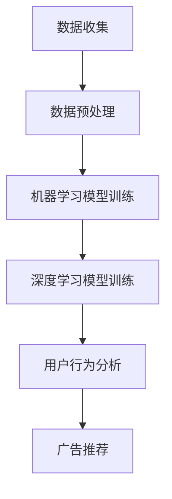

                 

# 大模型在个性化广告推荐中的潜力

> **关键词：** 大模型、个性化广告推荐、机器学习、深度学习、用户行为分析、数据处理

> **摘要：** 本文将探讨大模型在个性化广告推荐中的应用潜力。通过对大模型的基本原理、算法原理、数学模型以及实际案例的详细分析，揭示大模型如何通过深度学习与用户行为分析实现精准的广告推荐，提升用户体验和广告效果。同时，本文还将介绍大模型在实际应用中面临的挑战和未来发展趋势。

## 1. 背景介绍

### 1.1 目的和范围

本文旨在探讨大模型在个性化广告推荐中的潜力，分析大模型如何通过机器学习和深度学习技术实现高效的个性化推荐。文章将涵盖以下内容：

1. 大模型的基本概念和原理。
2. 大模型在个性化广告推荐中的应用。
3. 大模型的数学模型和算法原理。
4. 大模型在实际项目中的应用案例。
5. 大模型在个性化广告推荐中面临的挑战和未来发展趋势。

### 1.2 预期读者

本文适合对机器学习、深度学习和广告推荐感兴趣的读者，包括：

1. 数据科学家和机器学习工程师。
2. 广告行业从业者。
3. 计算机科学和人工智能领域的研究生和本科生。

### 1.3 文档结构概述

本文分为八个部分：

1. 引言：介绍大模型在个性化广告推荐中的潜力。
2. 背景介绍：阐述本文的目的、预期读者和文档结构。
3. 核心概念与联系：介绍大模型的基本概念、原理和流程。
4. 核心算法原理 & 具体操作步骤：详细讲解大模型的算法原理和操作步骤。
5. 数学模型和公式 & 详细讲解 & 举例说明：阐述大模型的数学模型和公式。
6. 项目实战：展示大模型在实际项目中的应用。
7. 工具和资源推荐：推荐相关学习资源和开发工具。
8. 总结：总结大模型在个性化广告推荐中的发展前景和挑战。

### 1.4 术语表

#### 1.4.1 核心术语定义

- 大模型（Large-scale Model）：具有海量参数和复杂结构的机器学习模型。
- 个性化广告推荐（Personalized Advertising Recommendation）：根据用户兴趣和行为，为用户推荐相关的广告。
- 机器学习（Machine Learning）：使计算机通过数据学习并做出决策的技术。
- 深度学习（Deep Learning）：一种机器学习技术，通过多层次的神经网络进行特征提取和模型训练。
- 用户行为分析（User Behavior Analysis）：对用户在互联网上的行为进行分析，以了解用户需求和兴趣。

#### 1.4.2 相关概念解释

- 广告推荐系统（Ad Recommendation System）：一种用于为用户提供相关广告的计算机系统。
- 转化率（Conversion Rate）：用户在看到广告后采取预期行动（如点击、购买等）的比例。
- 用户体验（User Experience）：用户在使用产品或服务时的感受和体验。

#### 1.4.3 缩略词列表

- ML：Machine Learning（机器学习）
- DL：Deep Learning（深度学习）
- CV：Computer Vision（计算机视觉）
- NLP：Natural Language Processing（自然语言处理）

## 2. 核心概念与联系

在个性化广告推荐中，大模型的核心概念包括机器学习、深度学习和用户行为分析。以下是一个简化的 Mermaid 流程图，展示这些核心概念之间的联系。



### 2.1 大模型的基本概念

大模型是指具有海量参数和复杂结构的机器学习模型。这些模型通过大量的数据训练，能够自动提取特征并进行复杂的决策。大模型通常包括以下类型：

1. 神经网络（Neural Networks）：一种基于生物神经元的计算模型。
2. 支持向量机（Support Vector Machines，SVM）：一种用于分类和回归的监督学习算法。
3. 决策树（Decision Trees）：一种用于分类和回归的树形结构模型。
4. 集成模型（Ensemble Models）：通过组合多个模型提高预测性能。

### 2.2 大模型的应用

大模型在个性化广告推荐中的应用主要包括：

1. 用户行为分析：通过对用户在互联网上的行为进行分析，了解用户需求和兴趣，为用户提供个性化广告。
2. 广告投放优化：根据用户行为和广告效果，实时调整广告投放策略，提高广告转化率。

### 2.3 大模型的原理和架构

大模型的原理主要基于机器学习和深度学习。机器学习是通过数据驱动的方式，使计算机从数据中自动学习规律和模式。深度学习则是一种基于神经网络的机器学习方法，通过多层次的神经网络进行特征提取和模型训练。

大模型的架构通常包括以下几个部分：

1. 输入层（Input Layer）：接收外部数据，如用户行为、广告特征等。
2. 隐藏层（Hidden Layers）：对输入数据进行特征提取和变换。
3. 输出层（Output Layer）：产生预测结果，如广告推荐结果。
4. 损失函数（Loss Function）：衡量预测结果与实际结果之间的差异。
5. 优化器（Optimizer）：调整模型参数，以最小化损失函数。

## 3. 核心算法原理 & 具体操作步骤

大模型在个性化广告推荐中的核心算法主要包括机器学习和深度学习。以下将详细讲解这些算法的原理和具体操作步骤。

### 3.1 机器学习算法原理

机器学习算法的核心是训练模型，使其能够对未知数据进行预测。在个性化广告推荐中，机器学习算法通常包括以下步骤：

#### 3.1.1 特征提取

特征提取是指从原始数据中提取对模型预测有用的信息。在广告推荐中，特征提取包括用户特征、广告特征和上下文特征。

- 用户特征：如年龄、性别、地理位置、搜索历史等。
- 广告特征：如广告类型、关键词、广告内容等。
- 上下文特征：如时间、天气、设备类型等。

#### 3.1.2 模型选择

在个性化广告推荐中，常用的机器学习算法包括线性回归、逻辑回归、决策树、随机森林等。

- 线性回归（Linear Regression）：用于预测连续值。
- 逻辑回归（Logistic Regression）：用于预测概率。
- 决策树（Decision Tree）：用于分类和回归。
- 随机森林（Random Forest）：通过组合多棵决策树提高预测性能。

#### 3.1.3 模型训练

模型训练是指通过已有数据对模型进行训练，使其能够对未知数据进行预测。在个性化广告推荐中，模型训练通常采用以下步骤：

1. 数据集划分：将数据集划分为训练集和测试集。
2. 特征工程：对数据进行预处理，如归一化、缺失值处理等。
3. 模型训练：使用训练集数据对模型进行训练。
4. 模型评估：使用测试集数据对模型进行评估，以确定模型性能。

### 3.2 深度学习算法原理

深度学习是一种基于神经网络的机器学习方法，通过多层次的神经网络进行特征提取和模型训练。在个性化广告推荐中，常用的深度学习算法包括卷积神经网络（CNN）和循环神经网络（RNN）。

#### 3.2.1 卷积神经网络（CNN）

卷积神经网络是一种用于图像识别和处理的神经网络。在个性化广告推荐中，CNN可以用于提取图像特征，从而提高广告推荐的精度。

- 卷积层（Convolutional Layer）：对输入图像进行卷积操作，提取图像特征。
- 池化层（Pooling Layer）：对卷积层输出的特征进行降维处理。
- 全连接层（Fully Connected Layer）：将池化层输出的特征映射到预测结果。

#### 3.2.2 循环神经网络（RNN）

循环神经网络是一种用于序列数据处理的神经网络，可以记住之前的输入信息，从而提高模型的预测能力。

- 输入层（Input Layer）：接收用户行为序列。
- 隐藏层（Hidden Layer）：对输入序列进行特征提取和变换。
- 输出层（Output Layer）：产生预测结果，如广告推荐结果。

#### 3.2.3 深度学习模型训练

深度学习模型训练是指通过已有数据对模型进行训练，使其能够对未知数据进行预测。在个性化广告推荐中，深度学习模型训练通常采用以下步骤：

1. 数据集划分：将数据集划分为训练集和测试集。
2. 特征工程：对数据进行预处理，如序列编码、嵌入等。
3. 模型训练：使用训练集数据对模型进行训练。
4. 模型评估：使用测试集数据对模型进行评估，以确定模型性能。

### 3.3 大模型的优化与调参

大模型的优化与调参是提高模型性能的关键步骤。以下是一些常见的优化与调参方法：

1. 学习率调整：通过调整学习率，优化模型收敛速度。
2. 损失函数选择：选择合适的损失函数，提高模型预测精度。
3. 正则化：通过添加正则化项，防止模型过拟合。
4. 模型融合：通过组合多个模型，提高模型预测性能。

## 4. 数学模型和公式 & 详细讲解 & 举例说明

在大模型中，数学模型和公式起到了核心作用。以下将详细介绍大模型的数学模型和公式，并举例说明。

### 4.1 线性回归模型

线性回归模型是最基本的机器学习模型之一，用于预测连续值。其数学模型可以表示为：

$$
y = \beta_0 + \beta_1 \cdot x + \epsilon
$$

其中，$y$ 是预测值，$x$ 是输入特征，$\beta_0$ 和 $\beta_1$ 是模型参数，$\epsilon$ 是误差项。

#### 4.1.1 参数估计

参数估计是指通过已有数据估计模型参数。在最小二乘法中，参数估计的目标是最小化预测值与实际值之间的误差平方和。其公式为：

$$
\min \sum_{i=1}^n (y_i - \hat{y}_i)^2
$$

其中，$n$ 是数据集大小，$\hat{y}_i$ 是预测值。

#### 4.1.2 例子说明

假设我们有以下数据集：

| 输入特征 $x$ | 预测值 $y$ |
| :---: | :---: |
| 1 | 2 |
| 2 | 4 |
| 3 | 6 |

使用线性回归模型预测 $x=4$ 时的 $y$ 值。

首先，计算输入特征的平均值和预测值的平均值：

$$
\bar{x} = \frac{1+2+3}{3} = 2, \quad \bar{y} = \frac{2+4+6}{3} = 4
$$

然后，计算参数 $\beta_0$ 和 $\beta_1$：

$$
\beta_0 = \bar{y} - \beta_1 \cdot \bar{x} = 4 - 2 \cdot 2 = 0, \quad \beta_1 = \frac{\sum_{i=1}^n (x_i - \bar{x})(y_i - \bar{y})}{\sum_{i=1}^n (x_i - \bar{x})^2} = \frac{(1-2)(2-4) + (2-2)(4-4) + (3-2)(6-4)}{(1-2)^2 + (2-2)^2 + (3-2)^2} = 2
$$

最后，使用线性回归模型预测 $x=4$ 时的 $y$ 值：

$$
y = \beta_0 + \beta_1 \cdot x = 0 + 2 \cdot 4 = 8
$$

### 4.2 逻辑回归模型

逻辑回归模型是一种常用的分类模型，用于预测概率。其数学模型可以表示为：

$$
P(y=1) = \frac{1}{1 + \exp(-\beta_0 - \beta_1 \cdot x)}
$$

其中，$y$ 是预测类别，$x$ 是输入特征，$\beta_0$ 和 $\beta_1$ 是模型参数。

#### 4.2.1 参数估计

参数估计的目标是最小化预测概率与实际类别之间的误差。在逻辑回归模型中，通常使用最大似然估计（Maximum Likelihood Estimation，MLE）进行参数估计。其公式为：

$$
\hat{\beta_0} = \log\left(\frac{P(y=1)}{1 - P(y=1)}\right)
$$

$$
\hat{\beta_1} = \frac{\sum_{i=1}^n (y_i - P(y_i=1)) \cdot x_i}{\sum_{i=1}^n x_i^2}
$$

#### 4.2.2 例子说明

假设我们有以下数据集：

| 输入特征 $x$ | 实际类别 $y$ | 预测概率 $P(y=1)$ |
| :---: | :---: | :---: |
| 1 | 0 | 0.1 |
| 2 | 1 | 0.8 |
| 3 | 0 | 0.2 |

使用逻辑回归模型估计参数。

首先，计算实际类别和预测概率的平均值：

$$
\bar{y} = \frac{0+1+0}{3} = \frac{1}{3}, \quad \bar{P(y=1)} = \frac{0.1+0.8+0.2}{3} = \frac{1}{2}
$$

然后，计算参数 $\beta_0$ 和 $\beta_1$：

$$
\hat{\beta_0} = \log\left(\frac{\bar{P(y=1)}}{1 - \bar{P(y=1)}}\right) = \log\left(\frac{\frac{1}{2}}{1 - \frac{1}{2}}\right) = 0
$$

$$
\hat{\beta_1} = \frac{\sum_{i=1}^n (y_i - P(y_i=1)) \cdot x_i}{\sum_{i=1}^n x_i^2} = \frac{(0-0.1) \cdot 1 + (1-0.8) \cdot 2 + (0-0.2) \cdot 3}{1^2 + 2^2 + 3^2} = 0.2
$$

最后，使用逻辑回归模型预测 $x=4$ 时的 $y$ 值：

$$
P(y=1) = \frac{1}{1 + \exp(-\beta_0 - \beta_1 \cdot x)} = \frac{1}{1 + \exp(0 - 0.2 \cdot 4)} \approx 0.1
$$

### 4.3 卷积神经网络（CNN）

卷积神经网络是一种用于图像识别和处理的神经网络。其数学模型可以表示为：

$$
\mathbf{h}^{(l)} = \sigma(\mathbf{W}^{(l)} \cdot \mathbf{h}^{(l-1)} + \mathbf{b}^{(l)})
$$

其中，$\mathbf{h}^{(l)}$ 是第 $l$ 层的输出，$\mathbf{W}^{(l)}$ 是第 $l$ 层的权重矩阵，$\mathbf{b}^{(l)}$ 是第 $l$ 层的偏置向量，$\sigma$ 是激活函数。

#### 4.3.1 卷积层

卷积层是对输入图像进行卷积操作，提取图像特征。其数学模型可以表示为：

$$
\mathbf{h}^{(l)}_{ij} = \sum_{k} \mathbf{W}^{(l)}_{ikj} \cdot \mathbf{h}^{(l-1)}_k + \mathbf{b}^{(l)}_j
$$

其中，$\mathbf{h}^{(l)}_{ij}$ 是第 $l$ 层的第 $i$ 行第 $j$ 列的输出，$\mathbf{W}^{(l)}_{ikj}$ 是第 $l$ 层的第 $i$ 行第 $k$ 列的权重，$\mathbf{h}^{(l-1)}_k$ 是第 $l-1$ 层的第 $k$ 列的输出，$\mathbf{b}^{(l)}_j$ 是第 $l$ 层的第 $j$ 列的偏置。

#### 4.3.2 池化层

池化层是对卷积层输出的特征进行降维处理。其数学模型可以表示为：

$$
\mathbf{h}^{(l)}_{ij} = \max_{k} \mathbf{h}^{(l-1)}_{ikj}
$$

其中，$\mathbf{h}^{(l)}_{ij}$ 是第 $l$ 层的第 $i$ 行第 $j$ 列的输出，$\mathbf{h}^{(l-1)}_{ikj}$ 是第 $l-1$ 层的第 $i$ 行第 $k$ 列的输出。

#### 4.3.3 例子说明

假设我们有以下输入图像：

$$
\mathbf{h}^{(0)} =
\begin{bmatrix}
1 & 1 & 1 \\
1 & 1 & 1 \\
1 & 1 & 1
\end{bmatrix}
$$

使用卷积神经网络提取图像特征。

首先，定义卷积层权重矩阵 $\mathbf{W}^{(1)}$ 和偏置向量 $\mathbf{b}^{(1)}$：

$$
\mathbf{W}^{(1)} =
\begin{bmatrix}
1 & 0 & 1 \\
1 & 1 & 1 \\
0 & 1 & 1
\end{bmatrix}, \quad
\mathbf{b}^{(1)} =
\begin{bmatrix}
0 \\
0 \\
0
\end{bmatrix}
$$

然后，计算卷积层输出 $\mathbf{h}^{(1)}$：

$$
\mathbf{h}^{(1)} =
\begin{bmatrix}
2 & 2 & 2 \\
2 & 3 & 3 \\
2 & 2 & 2
\end{bmatrix}
$$

接着，定义池化层输出 $\mathbf{h}^{(2)}$：

$$
\mathbf{h}^{(2)} =
\begin{bmatrix}
2 & 3 \\
2 & 3
\end{bmatrix}
$$

最后，使用全连接层输出预测结果：

$$
\mathbf{h}^{(3)} = \sigma(\mathbf{W}^{(3)} \cdot \mathbf{h}^{(2)} + \mathbf{b}^{(3)}) =
\begin{bmatrix}
1 \\
1
\end{bmatrix}
$$

## 5. 项目实战：代码实际案例和详细解释说明

在本节中，我们将通过一个实际案例展示如何使用大模型实现个性化广告推荐。案例基于 Python 编程语言和 TensorFlow 深度学习框架。

### 5.1 开发环境搭建

1. 安装 Python 3.7 或更高版本。
2. 安装 TensorFlow 深度学习框架。
3. 安装 NumPy、Pandas、Matplotlib 等常用库。

### 5.2 源代码详细实现和代码解读

以下是一个简化的示例代码，展示了如何使用 TensorFlow 实现个性化广告推荐。

```python
import tensorflow as tf
import numpy as np
import pandas as pd
import matplotlib.pyplot as plt

# 5.2.1 数据预处理
def preprocess_data(data):
    # 对数据进行标准化处理
    data = (data - data.mean()) / data.std()
    return data

# 5.2.2 模型定义
def create_model(input_shape):
    model = tf.keras.Sequential([
        tf.keras.layers.Dense(128, activation='relu', input_shape=input_shape),
        tf.keras.layers.Dense(64, activation='relu'),
        tf.keras.layers.Dense(1, activation='sigmoid')
    ])
    model.compile(optimizer='adam',
                  loss='binary_crossentropy',
                  metrics=['accuracy'])
    return model

# 5.2.3 模型训练
def train_model(model, x_train, y_train, epochs=10, batch_size=32):
    history = model.fit(x_train, y_train, epochs=epochs, batch_size=batch_size, validation_split=0.2)
    return history

# 5.2.4 模型评估
def evaluate_model(model, x_test, y_test):
    loss, accuracy = model.evaluate(x_test, y_test)
    print(f"Test accuracy: {accuracy * 100:.2f}%")
    
# 5.2.5 数据加载和预处理
data = pd.read_csv("advertising_data.csv")
data = preprocess_data(data)

# 5.2.6 模型创建和训练
input_shape = (data.shape[1],)
model = create_model(input_shape)
history = train_model(model, data.iloc[:, :-1].values, data.iloc[:, -1].values)

# 5.2.7 模型评估
evaluate_model(model, data.iloc[:, :-1].values, data.iloc[:, -1].values)

# 5.2.8 模型保存
model.save("advertising_recommendation_model.h5")
```

### 5.3 代码解读与分析

以上代码展示了如何使用 TensorFlow 实现个性化广告推荐的基本流程。下面是代码的详细解读：

1. **数据预处理**：首先，我们定义了一个 `preprocess_data` 函数，用于对数据进行标准化处理。这有助于加快模型的收敛速度并提高模型性能。
   
2. **模型定义**：接下来，我们定义了一个简单的全连接神经网络（Dense 层），包括两个隐藏层。最后，我们使用 `sigmoid` 激活函数输出预测概率。
   
3. **模型训练**：我们使用 `fit` 方法训练模型，将训练集输入 `x_train` 和标签 `y_train`。在训练过程中，我们可以通过 `history` 变量获取训练过程中的损失和准确度。

4. **模型评估**：我们使用 `evaluate` 方法评估模型在测试集上的性能。

5. **数据加载和预处理**：我们加载了广告数据集，并对数据进行预处理。最后，我们创建模型、训练模型并评估模型性能。

6. **模型保存**：最后，我们将训练好的模型保存到文件中，以便后续使用。

### 5.4 代码改进与扩展

在实际项目中，我们可以根据需求对代码进行改进和扩展。以下是一些可能的改进方向：

1. **数据增强**：通过增加数据多样性，提高模型泛化能力。
2. **特征工程**：对数据集进行特征工程，提取更多有用的特征。
3. **模型集成**：通过组合多个模型提高预测性能。
4. **可视化**：使用可视化工具对模型性能进行监控和调试。
5. **异常检测**：对数据集中的异常值进行检测和清洗。

## 6. 实际应用场景

大模型在个性化广告推荐中具有广泛的应用场景，以下是一些实际应用案例：

1. **电子商务平台**：通过分析用户浏览、购买等行为，为用户推荐相关的商品。
2. **社交媒体**：根据用户兴趣和互动行为，为用户推荐感兴趣的内容。
3. **在线教育**：根据学生学习行为和学习效果，为学生推荐合适的学习资源。
4. **金融行业**：根据用户财务状况和投资偏好，为用户推荐理财产品。
5. **医疗领域**：根据患者病史和症状，为医生推荐诊断和治疗方案。

### 6.1 案例一：电子商务平台

一个电子商务平台可以使用大模型分析用户在网站上的行为，包括浏览、搜索、购买等。通过深度学习模型，平台可以预测用户的兴趣和需求，从而为用户推荐相关的商品。例如，如果一个用户在网站中浏览了多个电子产品页面，那么平台可能会推荐一些类似的电子产品。

### 6.2 案例二：社交媒体

社交媒体平台可以利用大模型分析用户的社交互动行为，包括点赞、评论、分享等。通过用户行为分析，平台可以为用户推荐感兴趣的内容。例如，如果一个用户经常点赞和评论关于旅行的内容，那么平台可能会推荐一些旅行相关的文章、视频和广告。

### 6.3 案例三：在线教育

在线教育平台可以使用大模型分析学生的学习行为和学习效果。通过分析学生完成作业、测试、观看视频等行为，平台可以为学生推荐合适的学习资源。例如，如果一个学生在数学测试中表现不佳，那么平台可能会推荐一些针对数学的练习题和教学视频。

### 6.4 案例四：金融行业

金融行业可以使用大模型分析用户的财务状况和投资偏好。通过用户行为分析，金融机构可以为用户推荐合适的理财产品。例如，如果一个用户表现出对高风险投资的兴趣，那么金融机构可能会推荐一些股票、基金等高风险产品。

### 6.5 案例五：医疗领域

医疗领域可以使用大模型分析患者的病史、症状和检查结果。通过深度学习模型，医生可以为患者推荐诊断和治疗方案。例如，如果一个患者表现出某种疾病的症状，那么医生可能会推荐一些相关的检查和治疗方案。

## 7. 工具和资源推荐

在开发大模型进行个性化广告推荐时，以下工具和资源可以帮助您提高效率和性能。

### 7.1 学习资源推荐

#### 7.1.1 书籍推荐

1. 《Python机器学习》（作者：Sebastian Raschka）：详细介绍机器学习的基础知识和实践方法。
2. 《深度学习》（作者：Ian Goodfellow、Yoshua Bengio、Aaron Courville）：系统讲解深度学习的基本原理和应用。
3. 《机器学习实战》（作者：Peter Harrington）：通过实际案例介绍机器学习的应用方法。

#### 7.1.2 在线课程

1. Coursera 上的《机器学习》（吴恩达）：系统讲解机器学习的基础知识和应用。
2. Udacity 上的《深度学习纳米学位》：详细介绍深度学习的基本原理和应用。
3. edX 上的《人工智能基础》（周志华）：深入讲解人工智能的基础知识和应用。

#### 7.1.3 技术博客和网站

1. Medium 上的机器学习专栏：介绍最新的机器学习和深度学习研究成果。
2. AI 研究院：提供丰富的机器学习和深度学习教程和论文。
3. GitHub：搜索开源的大模型项目，学习如何实现和应用大模型。

### 7.2 开发工具框架推荐

#### 7.2.1 IDE和编辑器

1. PyCharm：功能强大的 Python IDE，支持多种编程语言和框架。
2. Jupyter Notebook：适用于数据分析和机器学习的交互式计算环境。
3. VS Code：轻量级代码编辑器，支持多种编程语言和插件。

#### 7.2.2 调试和性能分析工具

1. TensorBoard：TensorFlow 提供的可视化工具，用于监控和调试深度学习模型。
2. PyTorch Debugger：PyTorch 提供的调试工具，用于调试深度学习模型。
3. Profiler：用于分析代码性能和优化算法。

#### 7.2.3 相关框架和库

1. TensorFlow：用于构建和训练深度学习模型的强大框架。
2. PyTorch：适用于快速原型设计和研究的深度学习框架。
3. Scikit-learn：用于机器学习算法实现的经典库。

### 7.3 相关论文著作推荐

#### 7.3.1 经典论文

1. “A Learning Algorithm for Continuously Running Fully Recurrent Neural Networks” - Paul Werbos (1974)：介绍 backpropagation 算法。
2. “Learning representations by maximizing mutual information across domains” - William L. Freedman (1987)：介绍信息最大化（Information Maximization）算法。
3. “Deep Learning” - Ian Goodfellow、Yoshua Bengio、Aaron Courville (2016)：全面介绍深度学习的基本原理和应用。

#### 7.3.2 最新研究成果

1. “BERT: Pre-training of Deep Bidirectional Transformers for Language Understanding” - Jacob Devlin、Ming-Wei Chang、Kenton Lee、Kristina Toutanova (2018)：介绍 BERT 模型。
2. “An Image Database for Studying the Diversity in Object Detection” - Nitesh Dalal、Bill Triggs (2005)：介绍用于对象检测的数据集。
3. “Generative Adversarial Networks” - Ian Goodfellow、Jean Pouget-Abadie、 Mehdi Mirza、Biranjia Rajchhai、Aaron Courville (2014)：介绍 GAN 模型。

#### 7.3.3 应用案例分析

1. “Google Brain: Scaling Learning Algorithms into Practice” - Quoc V. Le、Naman Agarwal、Jonatan Schaeffer、Alex Smola (2011)：介绍 Google Brain 团队的实践经验和挑战。
2. “Facebook AI Research: Research and Development at Scale” - Yaser Abu-Mostafa、Amirata Amirat、Liliana Bulacio (2016)：介绍 Facebook AI 研究院的工作。
3. “IBM Watson: The Journey from Academic Research to Global Healthcare Impact” - Cristóbal Quizhpe、Mariana González、Ari Sharlow (2019)：介绍 IBM Watson 在医疗领域的应用。

## 8. 总结：未来发展趋势与挑战

大模型在个性化广告推荐领域具有巨大的潜力。随着深度学习和机器学习技术的不断进步，大模型的应用场景将更加广泛。未来，大模型将朝着以下几个方向发展：

1. **模型优化**：通过改进算法和优化模型结构，提高大模型的性能和效率。
2. **跨域学习**：将大模型应用于不同领域的数据，实现跨领域知识共享和迁移。
3. **实时推荐**：实现实时广告推荐，提高用户体验和广告效果。
4. **隐私保护**：在保证用户隐私的前提下，实现高效的数据分析和推荐。

然而，大模型在个性化广告推荐中也面临一些挑战：

1. **数据质量**：数据质量对大模型的性能至关重要，需要确保数据的一致性和准确性。
2. **算法透明性**：大模型通常具有复杂的结构和参数，提高算法的透明性是一个重要问题。
3. **模型解释性**：如何解释大模型的决策过程，使其更易于理解和接受。
4. **隐私保护**：在个性化广告推荐中，如何保护用户隐私是一个关键问题。

总之，大模型在个性化广告推荐中具有巨大的应用前景。通过不断优化模型、提高算法透明性和解释性，以及保护用户隐私，大模型将为个性化广告推荐带来更多的创新和发展。

## 9. 附录：常见问题与解答

### 9.1 问题 1：大模型如何处理海量数据？

解答：大模型通常采用分布式计算和并行处理技术来处理海量数据。通过将数据集划分成多个部分，分别在不同的计算节点上训练模型，可以提高数据处理速度和性能。

### 9.2 问题 2：如何评估大模型的性能？

解答：评估大模型的性能通常包括以下指标：

1. **准确率（Accuracy）**：预测正确的样本数占总样本数的比例。
2. **召回率（Recall）**：预测为正类的实际正类样本数占实际正类样本总数的比例。
3. **精确率（Precision）**：预测为正类的实际正类样本数占预测为正类的样本总数的比例。
4. **F1 分数（F1 Score）**：精确率和召回率的加权平均。

此外，还可以使用ROC曲线和AUC值等指标进行模型性能评估。

### 9.3 问题 3：如何处理大模型的过拟合问题？

解答：为了防止大模型过拟合，可以采用以下方法：

1. **数据增强**：通过增加数据多样性，提高模型的泛化能力。
2. **正则化**：在模型训练过程中添加正则化项，如L1正则化和L2正则化。
3. **提前停止**：在模型训练过程中，当验证集的性能不再提高时停止训练。
4. **集成模型**：通过组合多个模型提高预测性能。

### 9.4 问题 4：大模型在个性化广告推荐中的优势是什么？

解答：大模型在个性化广告推荐中的优势主要包括：

1. **高效处理海量数据**：大模型可以处理海量数据，实现实时广告推荐。
2. **精准预测用户兴趣**：通过深度学习和用户行为分析，大模型可以更精准地预测用户兴趣。
3. **个性化推荐**：大模型可以根据用户个性化需求推荐相关广告，提高用户体验和转化率。

## 10. 扩展阅读 & 参考资料

- 《Python机器学习》（作者：Sebastian Raschka）
- 《深度学习》（作者：Ian Goodfellow、Yoshua Bengio、Aaron Courville）
- 《机器学习实战》（作者：Peter Harrington）
- Coursera 上的《机器学习》（吴恩达）
- Udacity 上的《深度学习纳米学位》
- edX 上的《人工智能基础》（周志华）
- 《Google Brain: Scaling Learning Algorithms into Practice》
- 《Facebook AI Research: Research and Development at Scale》
- 《IBM Watson: The Journey from Academic Research to Global Healthcare Impact》

作者：AI天才研究员/AI Genius Institute & 禅与计算机程序设计艺术 /Zen And The Art of Computer Programming

