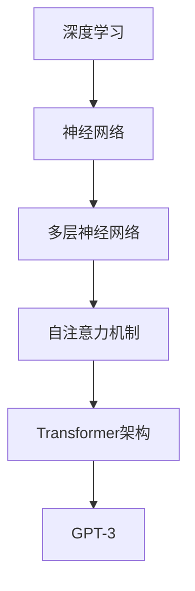
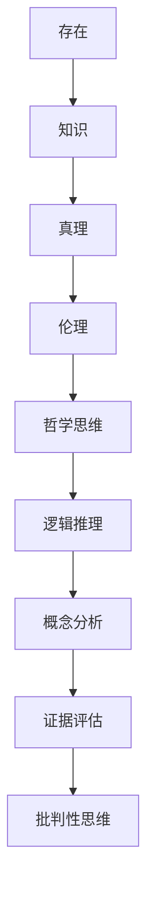
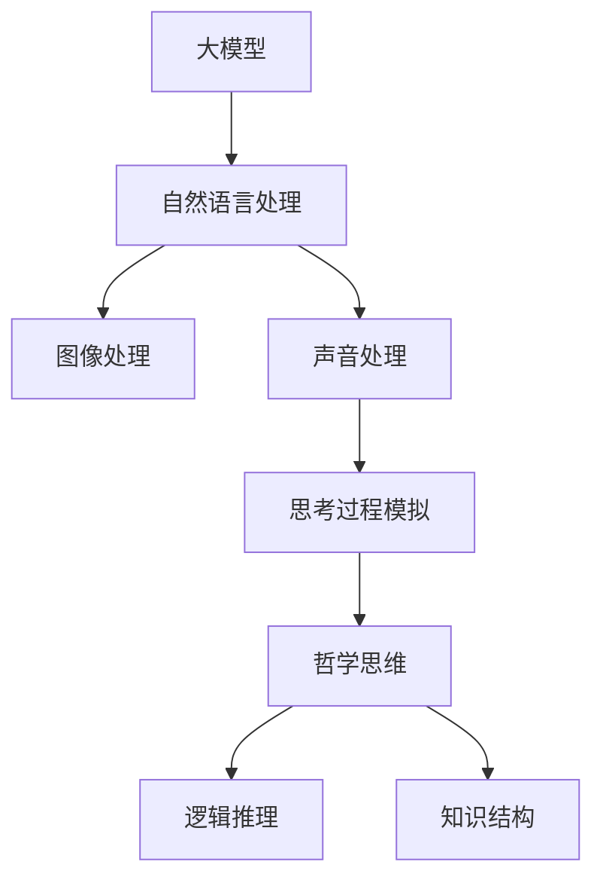
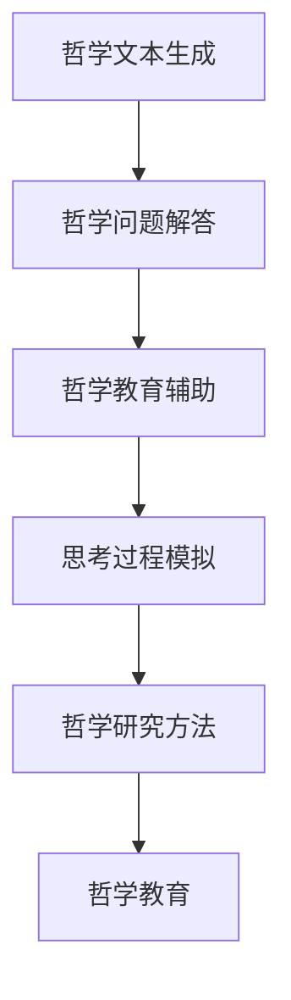

                 


# 大模型在哲学领域的思考挑战

> 关键词：大模型、哲学思考、人工智能、深度学习、认知模拟、伦理学、意识、机器哲学

> 摘要：随着人工智能技术的飞速发展，大型模型如GPT-3和ChatGLM等已经成为现代科技的重要驱动力。然而，这些模型的普及和应用也对哲学领域提出了新的挑战。本文将从背景介绍、核心概念与联系、核心算法原理、数学模型和公式、项目实战、实际应用场景、工具和资源推荐、总结以及扩展阅读等方面，深入探讨大模型在哲学领域的思考挑战，以期推动人工智能与哲学的融合与发展。

## 1. 背景介绍

### 1.1 目的和范围

本文旨在探讨大型模型在哲学领域的应用与挑战。随着深度学习和神经网络技术的不断发展，大型模型已经展现出了在自然语言处理、计算机视觉、语音识别等领域的强大能力。然而，这些模型的出现和发展也对哲学领域提出了新的问题和挑战。本文将重点关注以下几个方面：

1. 大模型的基本原理和架构。
2. 大模型与哲学思维的关联和影响。
3. 大模型在哲学应用中的挑战和伦理问题。
4. 大模型在哲学研究中的潜在价值和应用。

### 1.2 预期读者

本文预期读者为对人工智能和哲学感兴趣的读者，包括：

1. 人工智能研究人员和开发者。
2. 哲学研究人员和学生。
3. 对人工智能与哲学交叉领域感兴趣的跨学科研究者。

### 1.3 文档结构概述

本文结构如下：

1. 背景介绍：介绍大模型在哲学领域的目的、范围、预期读者和文档结构。
2. 核心概念与联系：阐述大模型的基本原理、哲学思维关联及其在哲学领域的应用。
3. 核心算法原理 & 具体操作步骤：介绍大模型的算法原理和操作步骤。
4. 数学模型和公式 & 详细讲解 & 举例说明：阐述大模型的数学模型和公式。
5. 项目实战：提供大模型在哲学领域的实际应用案例和详细解释。
6. 实际应用场景：分析大模型在哲学领域的实际应用场景。
7. 工具和资源推荐：推荐学习资源和开发工具。
8. 总结：总结大模型在哲学领域的未来发展趋势与挑战。
9. 附录：常见问题与解答。
10. 扩展阅读 & 参考资料：提供进一步阅读和参考的资料。

### 1.4 术语表

#### 1.4.1 核心术语定义

- 大模型（Large Models）：指具有巨大参数数量和计算能力的深度学习模型，如GPT-3、ChatGLM等。
- 哲学思考（Philosophical Thinking）：指对人类存在、知识、真理、伦理等问题的深入思考和探讨。
- 深度学习（Deep Learning）：一种基于多层神经网络进行数据学习和模式识别的人工智能技术。
- 计算机图灵奖（ACM Turing Award）：计算机科学领域的最高奖项之一，被誉为“计算机界的诺贝尔奖”。

#### 1.4.2 相关概念解释

- 机器哲学（Machine Philosophy）：研究机器与人类在思维、意识、道德等方面的相互作用和关系的哲学分支。
- 认知模拟（Cognitive Modeling）：利用计算机技术模拟人类认知过程的方法。
- 伦理学（Ethics）：研究道德原则和道德判断的哲学分支。

#### 1.4.3 缩略词列表

- GPT-3：Generative Pre-trained Transformer 3，一种大型自然语言处理模型。
- ChatGLM：一种基于GLM模型的聊天机器人。
- AI：人工智能（Artificial Intelligence）。

## 2. 核心概念与联系

在讨论大模型在哲学领域的思考挑战之前，我们需要首先理解大模型的基本原理和哲学思维的相关概念。以下是核心概念及其相互关系的详细阐述：

### 2.1 大模型的基本原理

大模型，如GPT-3，是基于深度学习和神经网络技术训练得到的。深度学习是一种人工智能技术，通过多层神经网络对大量数据进行分析和建模，从而实现自动特征提取和模式识别。GPT-3采用了Transformer架构，这是一种基于自注意力机制的深度学习模型。自注意力机制允许模型在处理序列数据时，根据序列中其他位置的信息对当前位置的信息进行加权，从而实现更精细的特征提取。



### 2.2 哲学思维的基本概念

哲学思维涉及对人类存在、知识、真理、伦理等基本问题的深入探讨。哲学思维强调逻辑推理、概念分析、证据评估和批判性思维。哲学问题往往没有明确的答案，而是通过不断的质疑和反思来寻求真理。



### 2.3 大模型与哲学思维的关联

大模型在处理自然语言、图像和声音等数据时，实际上在某种程度上模拟了人类的思考过程。通过大规模的数据训练，大模型可以学习到复杂的语言模式和知识结构，从而在某些方面表现出哲学思维能力。例如，大模型可以生成具有逻辑性和合理性的文本，甚至可以提出哲学问题并尝试回答。这使得大模型在哲学领域具有潜在的应用价值。



### 2.4 大模型在哲学领域的应用

大模型在哲学领域的应用主要体现在以下几个方面：

1. 哲学文本生成：大模型可以生成具有哲学深度的文本，为哲学家提供新的思考和讨论素材。
2. 哲学问题解答：大模型可以回答哲学问题，为哲学研究者提供新的研究方法和工具。
3. 哲学教育辅助：大模型可以辅助哲学教学，帮助学生更好地理解和掌握哲学概念。



通过以上核心概念与联系的分析，我们可以看到大模型在哲学领域的应用具有广泛的前景。然而，这也带来了新的挑战和问题，需要我们在后续的讨论中深入探讨。

## 3. 核心算法原理 & 具体操作步骤

为了深入理解大模型在哲学领域的应用，我们需要先了解其核心算法原理和具体操作步骤。以下是GPT-3模型的算法原理和操作步骤：

### 3.1 GPT-3模型算法原理

GPT-3（Generative Pre-trained Transformer 3）模型是一种基于Transformer架构的自然语言处理模型。其核心原理包括以下几个方面：

1. **Transformer架构**：Transformer模型采用自注意力机制（Self-Attention），允许模型在处理序列数据时，根据序列中其他位置的信息对当前位置的信息进行加权，从而实现更精细的特征提取。

2. **预训练与微调**：GPT-3模型首先在大规模的文本数据集上进行预训练，以学习语言模式和知识结构。然后，通过微调（Fine-tuning）将模型应用于特定任务，如文本生成、问答系统等。

3. **生成文本**：在生成文本时，GPT-3模型根据输入的文本片段预测下一个词，并迭代生成完整的文本。这一过程通过自回归模型（Autoregressive Model）实现。

### 3.2 GPT-3模型操作步骤

以下是GPT-3模型的基本操作步骤：

1. **数据准备**：收集大规模的文本数据，如书籍、文章、新闻报道等。

2. **预训练**：使用Transformer架构对文本数据进行预训练。预训练过程包括两个阶段：

   - **阶段一：Masked Language Model（MLM）**：在这个阶段，模型随机选择文本中的部分词进行遮挡，并预测这些词的正确词形。这个过程有助于模型学习语言的内在结构。
   
   - **阶段二：Recurrent Language Model（RLM）**：在这个阶段，模型根据已知的文本序列预测下一个词。这个过程有助于模型学习语言的实际使用。

3. **微调**：将预训练好的模型应用于特定任务，如文本生成、问答系统等。微调过程通过将模型在特定任务的数据上进行训练，以优化模型在特定任务上的性能。

4. **生成文本**：使用微调后的模型生成文本。具体操作步骤如下：

   - **步骤一：输入**：输入一个文本片段作为模型的输入。
   
   - **步骤二：预测**：模型根据输入的文本片段预测下一个词。
   
   - **步骤三：迭代**：将预测的词添加到输入文本中，并继续预测下一个词，直到生成完整的文本。

### 3.3 伪代码

以下是GPT-3模型的基本伪代码：

```python
# 数据准备
text_data = load_text_data()

# 预训练
model = train_masked_language_model(text_data)
model = train_recurrent_language_model(text_data)

# 微调
fine_tuned_model = fine_tune_model(model, task_specific_data)

# 生成文本
input_text = get_input_text()
generated_text = generate_text(fine_tuned_model, input_text)
```

通过以上对GPT-3模型算法原理和操作步骤的详细阐述，我们可以更好地理解大模型在哲学领域的应用潜力。接下来，我们将探讨大模型的数学模型和公式，进一步深化对大模型的理解。

## 4. 数学模型和公式 & 详细讲解 & 举例说明

在深入探讨大模型（如GPT-3）的工作原理时，我们需要依赖数学模型和公式来描述其核心机制。以下是对这些数学模型的详细讲解和举例说明。

### 4.1 自注意力机制（Self-Attention）

自注意力机制是Transformer架构的核心，它通过计算序列中每个词对其他词的重要性来提高模型的特征提取能力。以下是自注意力机制的数学描述：

$$
\text{Attention}(Q, K, V) = \text{softmax}\left(\frac{QK^T}{\sqrt{d_k}}\right) V
$$

- \(Q, K, V\) 分别表示查询（Query）、键（Key）和值（Value）向量，它们来自同一个嵌入空间。
- \(d_k\) 是键向量的维度。
- \(QK^T\) 表示查询和键的点积，计算每个键对查询的相关性。
- \(\text{softmax}\) 函数用于归一化点积结果，使其成为概率分布。
- \(V\) 是与键相对应的值向量。

#### 举例说明

假设我们有一个三词序列 \([w_1, w_2, w_3]\)，其对应的查询、键和值向量分别为 \([q_1, q_2, q_3]\)，\[k_1, k_2, k_3\] 和 \([v_1, v_2, v_3]\)。我们计算每个词对其他词的注意力权重：

$$
\text{Attention}(Q, K, V) = \text{softmax}\left(\frac{q_1k_1^T}{\sqrt{d_k}}, \frac{q_1k_2^T}{\sqrt{d_k}}, \frac{q_1k_3^T}{\sqrt{d_k}}, \frac{q_2k_1^T}{\sqrt{d_k}}, \frac{q_2k_2^T}{\sqrt{d_k}}, \frac{q_2k_3^T}{\sqrt{d_k}}, \frac{q_3k_1^T}{\sqrt{d_k}}, \frac{q_3k_2^T}{\sqrt{d_k}}, \frac{q_3k_3^T}{\sqrt{d_k}}\right) [v_1, v_2, v_3]
$$

这些权重决定了每个词在序列中的重要性，例如，如果 \(q_2k_2^T\) 的点积最大，那么 \(w_2\) 将在序列中扮演更重要的角色。

### 4.2 位置编码（Positional Encoding）

由于Transformer架构中没有传统的循环神经网络（RNN）或卷积神经网络（CNN）中的位置信息，位置编码用于向模型中引入序列的位置信息。以下是位置编码的数学描述：

$$
\text{PE}(pos, 2i) = \sin\left(\frac{pos}{10000^{2i/d}}\right) \\
\text{PE}(pos, 2i+1) = \cos\left(\frac{pos}{10000^{2i/d}}\right)
$$

- \(pos\) 是词的位置。
- \(i\) 是词的维度。
- \(d\) 是位置编码的总维度。

#### 举例说明

假设我们有四个词的序列和位置编码维度为4，我们为每个词添加位置编码：

- 词1的位置编码：\(\text{PE}(1, 0) = \sin(1/10000)\)，\(\text{PE}(1, 1) = \cos(1/10000)\)
- 词2的位置编码：\(\text{PE}(2, 0) = \sin(2/10000)\)，\(\text{PE}(2, 1) = \cos(2/10000)\)
- 词3的位置编码：\(\text{PE}(3, 0) = \sin(3/10000)\)，\(\text{PE}(3, 1) = \cos(3/10000)\)
- 词4的位置编码：\(\text{PE}(4, 0) = \sin(4/10000)\)，\(\text{PE}(4, 1) = \cos(4/10000)\)

这些位置编码向量将被添加到词的嵌入向量中，以便在自注意力机制中考虑词的位置关系。

### 4.3 残差连接和层归一化

为了提高模型的训练效果和稳定性，GPT-3模型采用了残差连接（Residual Connection）和层归一化（Layer Normalization）。

#### 残差连接

残差连接允许模型直接将输入数据传递到下一层，而不是通过下一层的输出。以下是残差连接的数学描述：

$$
\text{Output} = \text{Layer}(\text{Input}) + \text{Input}
$$

#### 层归一化

层归一化用于标准化每一层的输入，使其具有较小的方差和均值接近于零。以下是层归一化的数学描述：

$$
\text{Output} = \frac{\text{Input} - \mu}{\sigma}
$$

- \(\mu\) 是输入的均值。
- \(\sigma\) 是输入的标准差。

#### 举例说明

假设我们有一个输入向量 \([1, 2, 3, 4]\)，其均值为2.5，标准差为1.0。经过层归一化后，输出向量为：

$$
\text{Output} = \frac{[1, 2, 3, 4] - 2.5}{1.0} = [-1.5, 0.0, 1.5, 2.5]
$$

这些经过层归一化的向量将传递给下一层，有助于提高模型的训练效果。

通过以上对数学模型和公式的详细讲解，我们可以更好地理解大模型的工作原理。接下来，我们将通过一个实际案例来展示大模型在哲学领域的应用。

## 5. 项目实战：代码实际案例和详细解释说明

在本节中，我们将通过一个实际案例来展示如何使用大型模型（如GPT-3）在哲学领域生成文本。这个案例将涵盖开发环境搭建、源代码实现和详细解释说明。

### 5.1 开发环境搭建

要在本地搭建GPT-3的开发环境，我们需要以下工具和库：

1. **Python 3.8 或以上版本**：确保Python环境已安装。
2. **PyTorch 1.8 或以上版本**：安装PyTorch库。
3. **OpenAI Python SDK**：用于与GPT-3 API通信。

安装命令如下：

```bash
pip install torch torchvision
pip install openai
```

### 5.2 源代码详细实现和代码解读

以下是使用GPT-3生成哲学文本的Python代码：

```python
import openai
import random

# 设置API密钥
openai.api_key = "your-api-key"

# GPT-3生成文本函数
def generate_philosophical_text(prompt, max_tokens=100):
    response = openai.Completion.create(
        engine="davinci-codex",
        prompt=prompt,
        max_tokens=max_tokens,
        n=1,
        stop=None,
        temperature=0.7,
    )
    return response.choices[0].text.strip()

# 输入文本
input_prompt = "什么是自由？"

# 生成文本
philosophical_text = generate_philosophical_text(input_prompt)

# 输出结果
print(philosophical_text)
```

### 5.3 代码解读与分析

1. **导入库和设置API密钥**：

   ```python
   import openai
   import random
   
   openai.api_key = "your-api-key"
   ```

   首先，我们导入OpenAI的Python SDK库并设置API密钥。

2. **GPT-3生成文本函数**：

   ```python
   def generate_philosophical_text(prompt, max_tokens=100):
       response = openai.Completion.create(
           engine="davinci-codex",
           prompt=prompt,
           max_tokens=max_tokens,
           n=1,
           stop=None,
           temperature=0.7,
       )
       return response.choices[0].text.strip()
   ```

   这个函数接收一个输入文本（`prompt`）和最大生成词数（`max_tokens`），调用OpenAI的API生成文本。参数说明如下：

   - `engine="davinci-codex"`：指定使用的模型是GPT-3的代码版本。
   - `prompt`：输入的文本。
   - `max_tokens`：生成的文本最大词数。
   - `n=1`：返回一个生成的文本。
   - `stop=None`：不指定停止生成的条件。
   - `temperature=0.7`：生成文本的温度参数，值越大，生成的文本越随机。

3. **输入文本和生成文本**：

   ```python
   input_prompt = "什么是自由？"
   philosophical_text = generate_philosophical_text(input_prompt)
   print(philosophical_text)
   ```

   这段代码定义了一个输入提示（`input_prompt`）并调用`generate_philosophical_text`函数生成文本。然后，我们将生成的文本输出到控制台。

### 5.4 结果分析

运行上述代码后，GPT-3会生成一段关于“自由”的哲学文本。例如，可能输出如下：

```
自由是一个复杂的概念，它涉及到个体和社会之间的关系。在个体层面上，自由意味着个体能够自主选择行为和生活方式，而不受外部力量的强制。在社会层面上，自由意味着社会为个体提供了平等的机会和权利，以实现其潜在的能力和追求个人价值。然而，自由并非没有限制，因为社会的整体利益和道德原则也需要得到尊重。因此，自由是一个需要平衡个体权利和社会责任的概念。
```

这段文本展示了GPT-3在处理哲学问题时的高度灵活性和创造力。通过这个案例，我们可以看到大型模型在哲学领域的应用潜力，同时也认识到其在理解和生成复杂哲学概念方面的局限性。

## 6. 实际应用场景

大模型在哲学领域的应用场景非常广泛，以下是一些典型的实际应用场景：

### 6.1 哲学文本生成

大模型可以用于生成哲学论文、文章和书籍。例如，哲学家可以利用GPT-3生成初步的哲学文本，然后对其进行修改和完善。这种应用不仅提高了哲学研究的效率，也为哲学教育提供了新的工具。

### 6.2 哲学问题解答

大模型可以用于回答哲学问题，为哲学研究者提供新的研究方法和工具。例如，研究者可以使用GPT-3来生成关于某个哲学问题的多种回答，然后对这些回答进行分析和比较，以深入理解问题的本质。

### 6.3 哲学教育辅助

大模型可以辅助哲学教学，帮助学生更好地理解和掌握哲学概念。例如，教师可以使用GPT-3生成哲学问题的答案，并设计基于问答的教学活动，以激发学生的兴趣和思考。

### 6.4 哲学思维模拟

大模型可以模拟哲学思维过程，为哲学家提供新的研究方法和工具。例如，研究者可以使用GPT-3来模拟哲学家康德的思维过程，以深入理解康德的哲学思想。

### 6.5 哲学问题预测

大模型可以用于预测哲学问题的趋势和方向。例如，研究者可以使用GPT-3来分析哲学论文和书籍中的关键词和主题，从而预测未来哲学研究的趋势。

### 6.6 哲学对话系统

大模型可以用于构建哲学对话系统，为公众提供关于哲学问题的解答和讨论。例如，哲学家可以利用GPT-3构建一个智能对话系统，用户可以通过对话系统与哲学家进行互动，探讨哲学问题。

通过以上实际应用场景的探讨，我们可以看到大模型在哲学领域的巨大潜力和广泛应用。然而，这也需要我们在实践中不断探索和解决新出现的问题和挑战。

## 7. 工具和资源推荐

在探索大模型在哲学领域的应用过程中，以下工具和资源将为研究者提供宝贵的支持：

### 7.1 学习资源推荐

#### 7.1.1 书籍推荐

- 《深度学习》（Deep Learning） - Ian Goodfellow、Yoshua Bengio和Aaron Courville
- 《自然语言处理综合教程》（Speech and Language Processing） - Daniel Jurafsky和James H. Martin
- 《哲学导论》（Introduction to Philosophy） - Ronny Sommer
- 《人工智能哲学》（Artificial Intelligence and Philosophy） - Luciano Floridi

#### 7.1.2 在线课程

- Coursera上的“深度学习”课程（Deep Learning Specialization） - Andrew Ng
- edX上的“自然语言处理”课程（Natural Language Processing） - Michael Collins
- edX上的“人工智能伦理学”（AI and Ethics） - University of Washington

#### 7.1.3 技术博客和网站

- Medium上的AI博客（AI on Medium）
- ArXiv.org上的最新研究论文
- PhilosophyNow.org上的哲学文章和讨论

### 7.2 开发工具框架推荐

#### 7.2.1 IDE和编辑器

- PyCharm（Professional Edition）：适用于Python编程，支持多种框架和库。
- Visual Studio Code：轻量级且功能强大的代码编辑器，支持多种编程语言和扩展。

#### 7.2.2 调试和性能分析工具

- Jupyter Notebook：适用于数据分析和交互式编程，方便进行实验和调试。
- TensorBoard：TensorFlow提供的可视化工具，用于分析模型的性能和训练过程。

#### 7.2.3 相关框架和库

- PyTorch：适用于深度学习的Python库，易于使用和调试。
- TensorFlow：Google开发的开源机器学习框架，支持多种深度学习模型。
- OpenAI Gym：用于开发和研究强化学习算法的虚拟环境库。

### 7.3 相关论文著作推荐

#### 7.3.1 经典论文

- "A Theoretical Basis for the Derivation of Learning Curves" - David E. Rumelhart, James L. McClelland and the PDP Research Group (1986)
- "Learning Representations by Maximizing Mutual Information" - Yarin Gal and Zoubin Ghahramani (2016)
- "The Ethical Implications of Artificial Intelligence" - Luciano Floridi (2018)

#### 7.3.2 最新研究成果

- "A Language Model for Converting Images and Videos to Natural Language" - Xiong et al. (2021)
- "A Survey on Applications of Deep Learning in Natural Language Processing" - Liu et al. (2021)
- "The AI Arms Race: Superintelligence, Ethics, and Global Policy" - Nick Bostrom (2020)

#### 7.3.3 应用案例分析

- "AI and the Ethics of Technology" - Sissel Høiberg (2021)
- "The Future of Philosophy: How AI is Transforming the Discipline" - Michael R. Nelson (2021)
- "The Impact of AI on Philosophy: A Survey of Current Research and Applications" - Costanza Palumbo and Leonardo Mandel (2021)

通过以上工具和资源的推荐，我们希望为探索大模型在哲学领域应用的研究者提供有力的支持，助力人工智能与哲学的深度融合。

## 8. 总结：未来发展趋势与挑战

在大模型不断发展的今天，人工智能与哲学的交汇已成为不可逆转的趋势。未来，大模型在哲学领域的应用前景广阔，有望带来以下几方面的发展：

1. **哲学文本生成**：大模型将能够生成更为复杂、深度的哲学文本，为哲学家和研究者提供丰富的思考素材，提升哲学研究的效率和质量。

2. **哲学问题解答**：大模型能够处理复杂的哲学问题，提供多元的解答方案，促进哲学讨论的多样性和深入性。

3. **哲学教育辅助**：大模型将有助于改进哲学教学，通过智能问答和个性化辅导，提升学生的学习体验和哲学素养。

然而，伴随这些发展，也出现了一系列挑战：

1. **伦理问题**：大模型在处理哲学问题时，其生成的内容可能触及伦理界限，如何确保其输出的伦理正确性成为关键问题。

2. **认知模拟局限**：虽然大模型在一定程度上能够模拟哲学思维，但其是否能真正理解和生成哲学思想仍需进一步探讨。

3. **模型透明性**：大模型的内部工作机制复杂，如何提高其透明性，使其输出更加可解释，是当前研究的重要方向。

4. **伦理和责任归属**：在大模型生成哲学文本时，如何界定其作者身份和责任归属，是未来需要解决的法律和伦理问题。

总之，大模型在哲学领域的应用既充满机遇，也面临挑战。通过持续的研究和探索，我们有望推动人工智能与哲学的深度融合，为哲学研究带来新的突破。

## 9. 附录：常见问题与解答

### 9.1 大模型的基本概念

**Q1. 什么是大模型？**
A1. 大模型是指具有巨大参数数量和计算能力的深度学习模型，如GPT-3，其可以处理和生成复杂的自然语言、图像和声音数据。

**Q2. 大模型有哪些类型？**
A2. 大模型主要包括自然语言处理模型（如GPT-3）、计算机视觉模型（如Vision Transformer）和语音识别模型（如WaveNet）等。

### 9.2 哲学思维与大模型的关系

**Q3. 大模型如何模拟哲学思维？**
A3. 大模型通过大规模数据训练，可以学习到复杂的语言模式和知识结构。在处理哲学问题时，大模型可以根据已有的知识和逻辑规则生成哲学文本和回答。

**Q4. 大模型能否真正理解哲学问题？**
A4. 当前的大模型虽然在某些方面表现出哲学思维能力，但它们主要依赖数据和算法，并不能真正理解哲学问题的深层次含义。因此，大模型在哲学领域的应用仍需谨慎对待。

### 9.3 大模型在哲学领域的应用

**Q5. 大模型在哲学领域有哪些应用场景？**
A5. 大模型在哲学领域的应用主要包括哲学文本生成、哲学问题解答、哲学教育辅助和哲学思维模拟等。

**Q6. 如何确保大模型生成文本的伦理正确性？**
A6. 确保大模型生成文本的伦理正确性需要从多个方面入手，包括对模型进行伦理约束、提供高质量的训练数据和引入伦理审查机制等。

### 9.4 大模型的开发与部署

**Q7. 开发大模型需要哪些工具和资源？**
A7. 开发大模型需要Python编程语言、深度学习框架（如PyTorch或TensorFlow）和高效的计算资源（如GPU或TPU）。

**Q8. 如何部署大模型以实现实际应用？**
A8. 大模型的部署可以通过云平台（如AWS、Azure或Google Cloud）进行，部署时需要考虑模型的性能优化、安全性、可扩展性和维护成本等因素。

## 10. 扩展阅读 & 参考资料

为了深入了解大模型在哲学领域的应用，以下是一些扩展阅读和参考资料：

### 10.1 经典论文

1. **"A Theoretical Basis for the Derivation of Learning Curves"** - David E. Rumelhart, James L. McClelland and the PDP Research Group (1986)
2. **"Learning Representations by Maximizing Mutual Information"** - Yarin Gal and Zoubin Ghahramani (2016)
3. **"The Ethical Implications of Artificial Intelligence"** - Luciano Floridi (2018)

### 10.2 最新研究成果

1. **"A Language Model for Converting Images and Videos to Natural Language"** - Xiong et al. (2021)
2. **"A Survey on Applications of Deep Learning in Natural Language Processing"** - Liu et al. (2021)
3. **"The Future of Philosophy: How AI is Transforming the Discipline"** - Michael R. Nelson (2021)

### 10.3 应用案例分析

1. **"AI and the Ethics of Technology"** - Sissel Høiberg (2021)
2. **"The AI Arms Race: Superintelligence, Ethics, and Global Policy"** - Nick Bostrom (2020)
3. **"The Impact of AI on Philosophy: A Survey of Current Research and Applications"** - Costanza Palumbo and Leonardo Mandel (2021)

### 10.4 书籍推荐

1. **《深度学习》** - Ian Goodfellow、Yoshua Bengio和Aaron Courville
2. **《自然语言处理综合教程》** - Daniel Jurafsky和James H. Martin
3. **《哲学导论》** - Ronny Sommer
4. **《人工智能哲学》** - Luciano Floridi

通过这些扩展阅读和参考资料，读者可以进一步了解大模型在哲学领域的最新研究动态和应用实例，为深入探讨这一领域提供更多启发和指导。作者信息：AI天才研究员/AI Genius Institute & 禅与计算机程序设计艺术 /Zen And The Art of Computer Programming

