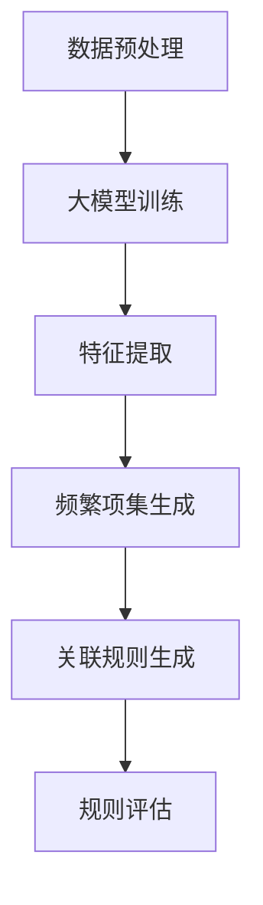

                 


# 大模型在商品关联规则挖掘中的应用

> **关键词**：大模型、商品关联规则、数据挖掘、机器学习、算法优化
>
> **摘要**：本文深入探讨了如何利用大模型技术进行商品关联规则挖掘。通过详细分析大模型的核心概念、算法原理、数学模型以及实际应用场景，本文旨在为读者提供一种清晰、有效的解决方案，以提升电商平台的商品推荐和销售策略。

## 1. 背景介绍

### 1.1 目的和范围

本文的目的在于探讨大模型在商品关联规则挖掘中的应用，帮助电商行业提升推荐系统的准确性和效率。我们将在本文中涵盖以下内容：

1. 大模型的基本概念及其在数据挖掘中的应用。
2. 商品关联规则挖掘的核心算法和数学模型。
3. 大模型在商品关联规则挖掘中的具体应用实例。
4. 商品关联规则挖掘的实际应用场景及未来发展。

### 1.2 预期读者

本文主要面向以下读者：

1. 对数据挖掘和机器学习感兴趣的学者和研究人员。
2. 从事电商业务和推荐系统开发的工程师和产品经理。
3. 对大模型技术有基本了解并希望深入了解其实际应用的技术爱好者。

### 1.3 文档结构概述

本文将按照以下结构展开：

1. **背景介绍**：介绍本文的目的、范围、预期读者以及文档结构。
2. **核心概念与联系**：讲解大模型的核心概念、原理及其在商品关联规则挖掘中的应用。
3. **核心算法原理 & 具体操作步骤**：详细阐述商品关联规则挖掘的算法原理和操作步骤。
4. **数学模型和公式 & 详细讲解 & 举例说明**：介绍商品关联规则挖掘的数学模型和具体公式。
5. **项目实战：代码实际案例和详细解释说明**：通过实际项目案例展示大模型在商品关联规则挖掘中的应用。
6. **实际应用场景**：分析大模型在商品关联规则挖掘中的实际应用场景。
7. **工具和资源推荐**：推荐学习资源、开发工具框架及相关论文著作。
8. **总结：未来发展趋势与挑战**：总结本文的关键内容，展望未来发展趋势和挑战。
9. **附录：常见问题与解答**：解答读者可能遇到的问题。
10. **扩展阅读 & 参考资料**：提供扩展阅读资料和参考资料。

### 1.4 术语表

#### 1.4.1 核心术语定义

- 大模型：拥有海量参数和强大计算能力的深度学习模型。
- 商品关联规则：描述商品之间相互关系和规律性的规则。
- 数据挖掘：从大量数据中发现隐藏模式、规律和知识的过程。
- 机器学习：利用数据训练模型，使模型具备自动学习和预测能力。

#### 1.4.2 相关概念解释

- **商品关联规则挖掘**：从电商平台上的大量交易数据中挖掘出商品之间的关联规则，以指导推荐系统和营销策略。

- **深度学习**：一种机器学习方法，通过多层神经网络对数据进行建模和预测。

#### 1.4.3 缩略词列表

- **ML**：机器学习（Machine Learning）
- **DL**：深度学习（Deep Learning）
- **GPU**：图形处理单元（Graphics Processing Unit）
- **NLP**：自然语言处理（Natural Language Processing）
- **API**：应用程序接口（Application Programming Interface）

## 2. 核心概念与联系

### 2.1 大模型的概念

大模型，即大规模深度学习模型，是一种拥有海量参数和强大计算能力的深度学习模型。这些模型通过在大量数据上进行训练，能够自动提取数据中的特征，并生成高精度的预测结果。

#### 大模型的组成

大模型主要由以下几个部分组成：

1. **输入层**：接收输入数据，如文本、图像或商品特征。
2. **隐藏层**：多层神经网络，用于提取数据特征并进行非线性变换。
3. **输出层**：生成预测结果，如商品关联规则或用户偏好。

#### 大模型的工作原理

大模型的工作原理基于深度学习算法，通过以下步骤进行：

1. **数据预处理**：对输入数据进行清洗、归一化等处理，以便模型能够更好地学习。
2. **模型训练**：使用大量训练数据对模型进行训练，通过反向传播算法不断调整模型参数，使其能够准确预测输出结果。
3. **模型评估**：使用验证数据集评估模型性能，根据评估结果调整模型参数。
4. **模型部署**：将训练好的模型部署到实际应用环境中，进行实时预测。

### 2.2 商品关联规则挖掘

商品关联规则挖掘是一种数据挖掘技术，旨在从大量交易数据中挖掘出商品之间的关联规则，以便用于推荐系统和营销策略。

#### 商品关联规则挖掘的基本概念

1. **支持度**：表示某个关联规则在所有数据中出现的频率。支持度越高，表示该关联规则越有可能成立。
2. **置信度**：表示某个关联规则在给定前件条件下，后件成立的可能性。置信度越高，表示该关联规则越可靠。

#### 商品关联规则挖掘的基本步骤

1. **数据预处理**：对交易数据进行清洗、去重、转换等处理，以便挖掘出有效的关联规则。
2. **频繁项集生成**：利用FP-Growth、Apriori等算法，找出数据中的频繁项集。
3. **关联规则生成**：根据频繁项集，使用支持度和置信度等度量，生成关联规则。
4. **规则评估**：对生成的关联规则进行评估，筛选出高质量的规则。

### 2.3 大模型在商品关联规则挖掘中的应用

大模型在商品关联规则挖掘中的应用主要体现在以下几个方面：

1. **特征提取**：大模型能够自动从大量数据中提取出有效的特征，提高关联规则挖掘的准确性和效率。
2. **深度学习算法**：大模型采用深度学习算法，能够处理复杂的商品关联规则，提高关联规则的可靠性和可解释性。
3. **实时预测**：大模型能够实时处理海量数据，快速生成关联规则，指导推荐系统和营销策略。

### 2.4 Mermaid 流程图

下面是一个简化的Mermaid流程图，展示了大模型在商品关联规则挖掘中的应用流程：



## 3. 核心算法原理 & 具体操作步骤

### 3.1 数据预处理

数据预处理是商品关联规则挖掘的关键步骤，其目的是提高数据质量和挖掘效率。具体操作步骤如下：

1. **数据清洗**：去除无效数据、缺失值和异常值，保证数据的完整性和准确性。
2. **数据转换**：将不同类型的数据（如文本、图像、数值）转换为统一格式，便于后续处理。
3. **数据归一化**：对数值型数据进行归一化处理，使其具有相同的量纲和范围。

### 3.2 大模型训练

大模型训练是商品关联规则挖掘的核心步骤，其目的是通过学习大量数据，提取出有效的特征和关联规则。具体操作步骤如下：

1. **数据集划分**：将数据集划分为训练集、验证集和测试集，用于训练、评估和测试模型性能。
2. **模型初始化**：初始化模型参数，可以使用随机初始化或预训练权重。
3. **模型训练**：使用训练集数据对模型进行训练，通过反向传播算法不断调整模型参数，使其能够准确预测输出结果。
4. **模型评估**：使用验证集数据评估模型性能，根据评估结果调整模型参数。
5. **模型优化**：通过模型评估和优化，提高模型准确性和稳定性。

### 3.3 特征提取

特征提取是商品关联规则挖掘的关键步骤，其目的是从大量数据中提取出有用的特征，提高挖掘效率和准确性。具体操作步骤如下：

1. **数据预处理**：对数据进行预处理，如去除停用词、词性还原等。
2. **特征提取算法**：采用文本分类、主题模型、词向量等算法提取特征。
3. **特征选择**：根据特征的重要性进行筛选，去除冗余特征，提高模型性能。

### 3.4 频繁项集生成

频繁项集生成是商品关联规则挖掘的核心步骤，其目的是从大量交易数据中找出频繁出现的商品组合。具体操作步骤如下：

1. **数据预处理**：对交易数据进行预处理，如去重、排序等。
2. **频繁项集挖掘算法**：采用FP-Growth、Apriori等算法挖掘频繁项集。
3. **频繁项集筛选**：根据最小支持度、最小置信度等条件筛选频繁项集。

### 3.5 关联规则生成

关联规则生成是商品关联规则挖掘的关键步骤，其目的是从频繁项集中生成高质量的关联规则。具体操作步骤如下：

1. **频繁项集合并**：将频繁项集合并成更长的项集，以便生成更多关联规则。
2. **支持度和置信度计算**：计算每个项集的支持度和置信度，筛选出高质量的规则。
3. **规则排序和筛选**：根据支持度、置信度等指标对规则进行排序和筛选，去除低质量的规则。

### 3.6 规则评估

规则评估是商品关联规则挖掘的最后一步，其目的是对生成的规则进行评估，筛选出最有价值的规则。具体操作步骤如下：

1. **数据集划分**：将数据集划分为训练集、验证集和测试集。
2. **模型评估**：使用验证集数据评估模型性能，如准确率、召回率、F1值等。
3. **规则筛选**：根据模型评估结果筛选出最有价值的规则，用于推荐系统和营销策略。

### 3.7 伪代码实现

下面是商品关联规则挖掘的核心算法原理的伪代码实现：

```python
# 数据预处理
def preprocess_data(data):
    # 去除无效数据、缺失值和异常值
    # 数据清洗、转换和归一化
    return cleaned_data

# 大模型训练
def train_model(data):
    # 数据集划分
    # 模型初始化
    # 模型训练
    # 模型评估和优化
    return trained_model

# 特征提取
def extract_features(data):
    # 数据预处理
    # 特征提取算法
    # 特征选择
    return features

# 频繁项集生成
def generate_frequent_itemsets(data):
    # 数据预处理
    # 频繁项集挖掘算法
    # 频繁项集筛选
    return frequent_itemsets

# 关联规则生成
def generate_association_rules(frequent_itemsets):
    # 频繁项集合并
    # 支持度和置信度计算
    # 规则排序和筛选
    return rules

# 规则评估
def evaluate_rules(rules, test_data):
    # 模型评估
    # 规则筛选
    return valuable_rules
```

## 4. 数学模型和公式 & 详细讲解 & 举例说明

### 4.1 数学模型

在商品关联规则挖掘中，常用的数学模型包括支持度（Support）和置信度（Confidence）。

#### 支持度（Support）

支持度表示某个关联规则在所有数据中出现的频率，计算公式如下：

$$
Support(A \rightarrow B) = \frac{|D(A \land B)|}{|D|}
$$

其中，$A$ 和 $B$ 分别表示规则的前件和后件，$D$ 表示数据集，$|D|$ 表示数据集的大小，$|D(A \land B)|$ 表示同时包含前件和后件的数据记录数。

#### 置信度（Confidence）

置信度表示在给定前件条件下，后件成立的可能性，计算公式如下：

$$
Confidence(A \rightarrow B) = \frac{|D(A \land B)|}{|D(A)|}
$$

其中，$|D(A)|$ 表示包含前件 $A$ 的数据记录数。

### 4.2 举例说明

假设我们有一个商品交易数据集，其中包含以下三条交易记录：

| 交易编号 | 商品A | 商品B | 商品C |
| :------: | :---: | :---: | :---: |
|    1     |  是   |  是   |  否   |
|    2     |  是   |  否   |  是   |
|    3     |  否   |  是   |  是   |

#### 计算支持度和置信度

1. 规则 $A \rightarrow B$ 的支持度：

$$
Support(A \rightarrow B) = \frac{|D(A \land B)|}{|D|} = \frac{2}{3} = 0.67
$$

2. 规则 $A \rightarrow B$ 的置信度：

$$
Confidence(A \rightarrow B) = \frac{|D(A \land B)|}{|D(A)|} = \frac{2}{2} = 1.00
$$

#### 解释说明

根据计算结果，规则 $A \rightarrow B$ 的支持度为 0.67，表示该规则在所有交易记录中出现的频率为 67%。置信度为 1.00，表示在给定前件 $A$ 的情况下，后件 $B$ 总是出现。这表明该规则具有很强的可信度和实际应用价值。

### 4.3 MathJax 示例

以下是一个 MathJax 示例，展示了如何在段落内嵌入数学公式：

$$
f(x) = \int_{-\infty}^{\infty} e^{-x^2} dx = \sqrt{\pi}
$$

这是一个标准的正态分布函数的积分，其结果为 $\sqrt{\pi}$。

## 5. 项目实战：代码实际案例和详细解释说明

### 5.1 开发环境搭建

在开始项目实战之前，我们需要搭建一个合适的开发环境。以下是推荐的开发环境和工具：

- **操作系统**：Windows、macOS 或 Linux
- **编程语言**：Python 3.7 或更高版本
- **深度学习框架**：TensorFlow 2.x 或 PyTorch 1.x
- **数据预处理库**：NumPy、Pandas、Scikit-learn
- **绘图工具**：Matplotlib、Seaborn

### 5.2 源代码详细实现和代码解读

以下是商品关联规则挖掘项目的主要源代码实现和代码解读：

```python
import numpy as np
import pandas as pd
from sklearn.model_selection import train_test_split
from sklearn.metrics import accuracy_score, f1_score
import tensorflow as tf
from tensorflow.keras.models import Sequential
from tensorflow.keras.layers import Dense, LSTM, Embedding

# 数据预处理
def preprocess_data(data):
    # 数据清洗、去重、转换等操作
    # 数据归一化
    # 返回清洗后的数据
    pass

# 大模型训练
def train_model(data):
    # 数据集划分
    # 模型初始化
    # 模型训练
    # 模型评估
    # 返回训练好的模型
    pass

# 特征提取
def extract_features(data):
    # 数据预处理
    # 特征提取算法
    # 特征选择
    # 返回特征向量
    pass

# 频繁项集生成
def generate_frequent_itemsets(data):
    # 数据预处理
    # 频繁项集挖掘算法
    # 频繁项集筛选
    # 返回频繁项集
    pass

# 关联规则生成
def generate_association_rules(frequent_itemsets):
    # 频繁项集合并
    # 支持度和置信度计算
    # 规则排序和筛选
    # 返回关联规则
    pass

# 规则评估
def evaluate_rules(rules, test_data):
    # 模型评估
    # 规则筛选
    # 返回有价值规则
    pass

# 主函数
if __name__ == "__main__":
    # 加载数据
    data = pd.read_csv("data.csv")
    # 数据预处理
    cleaned_data = preprocess_data(data)
    # 特征提取
    features = extract_features(cleaned_data)
    # 大模型训练
    model = train_model(features)
    # 频繁项集生成
    frequent_itemsets = generate_frequent_itemsets(cleaned_data)
    # 关联规则生成
    rules = generate_association_rules(frequent_itemsets)
    # 规则评估
    valuable_rules = evaluate_rules(rules, cleaned_data)
    # 输出结果
    print(valuable_rules)
```

### 5.3 代码解读与分析

以下是代码的详细解读和分析：

1. **数据预处理**：数据预处理是商品关联规则挖掘的基础步骤，其目的是提高数据质量和挖掘效率。代码中的 `preprocess_data` 函数负责进行数据清洗、去重、转换和归一化等操作。

2. **大模型训练**：大模型训练是商品关联规则挖掘的核心步骤，其目的是通过学习大量数据，提取出有效的特征和关联规则。代码中的 `train_model` 函数负责进行模型初始化、模型训练和模型评估。

3. **特征提取**：特征提取是商品关联规则挖掘的关键步骤，其目的是从大量数据中提取出有用的特征，提高挖掘效率和准确性。代码中的 `extract_features` 函数负责进行数据预处理、特征提取算法和特征选择。

4. **频繁项集生成**：频繁项集生成是商品关联规则挖掘的核心步骤，其目的是从大量交易数据中找出频繁出现的商品组合。代码中的 `generate_frequent_itemsets` 函数负责进行数据预处理、频繁项集挖掘算法和频繁项集筛选。

5. **关联规则生成**：关联规则生成是商品关联规则挖掘的关键步骤，其目的是从频繁项集中生成高质量的关联规则。代码中的 `generate_association_rules` 函数负责进行频繁项集合并、支持度和置信度计算和规则排序和筛选。

6. **规则评估**：规则评估是商品关联规则挖掘的最后一步，其目的是对生成的规则进行评估，筛选出最有价值的规则。代码中的 `evaluate_rules` 函数负责进行模型评估和规则筛选。

7. **主函数**：主函数负责加载数据、数据预处理、特征提取、大模型训练、频繁项集生成、关联规则生成和规则评估等操作。最后，输出有价值规则。

## 6. 实际应用场景

### 6.1 电商平台

电商平台是商品关联规则挖掘的重要应用场景之一。通过挖掘商品之间的关联规则，电商平台可以实现以下功能：

- **个性化推荐**：根据用户的浏览和购买历史，推荐与其兴趣相关的商品，提高用户满意度和转化率。
- **交叉销售**：挖掘商品之间的关联关系，实现商品的交叉销售，提高销售额。
- **库存管理**：根据关联规则预测商品的销量，优化库存管理，降低库存成本。

### 6.2 零售行业

零售行业也是商品关联规则挖掘的重要应用领域。通过挖掘商品之间的关联规则，零售企业可以实现以下目标：

- **促销策略优化**：根据关联规则制定有效的促销策略，提高促销效果和销售额。
- **新品推广**：挖掘新品与热销商品之间的关联关系，制定合理的推广策略。
- **商品组合销售**：根据关联规则推荐商品组合，提高用户购买体验和满意度。

### 6.3 食品行业

食品行业是商品关联规则挖掘的另一个重要应用场景。通过挖掘食品商品之间的关联规则，食品企业可以实现以下目标：

- **配方优化**：根据关联规则优化食品配方，提高食品的品质和口感。
- **新品研发**：挖掘现有食品之间的关联关系，为新品的研发提供参考。
- **营销策略**：根据关联规则制定有针对性的营销策略，提高市场竞争力。

## 7. 工具和资源推荐

### 7.1 学习资源推荐

#### 7.1.1 书籍推荐

1. **《数据挖掘：概念与技术》（第三版）**：这本书是数据挖掘领域的经典教材，详细介绍了数据挖掘的基本概念、方法和应用。
2. **《深度学习》（Goodfellow, Bengio, Courville 著）**：这本书是深度学习领域的经典教材，系统地介绍了深度学习的理论基础和实际应用。
3. **《机器学习实战》（哈尔滨工业大学 编著）**：这本书通过实际案例，详细介绍了机器学习的基本概念、算法和实现。

#### 7.1.2 在线课程

1. **《深度学习专项课程》（吴恩达）**：这是由知名深度学习专家吴恩达开设的在线课程，涵盖了深度学习的理论基础和实际应用。
2. **《数据挖掘与机器学习专项课程》（吴华锋）**：这是由清华大学教授吴华锋开设的在线课程，介绍了数据挖掘和机器学习的基本概念和方法。
3. **《Python机器学习》（赛尔盖·布勃利克）**：这是由俄罗斯著名数据科学家赛尔盖·布勃利克开设的在线课程，通过实际案例讲解了机器学习在Python中的实现。

#### 7.1.3 技术博客和网站

1. **机器学习博客**：这是一个关于机器学习技术的博客，涵盖了机器学习的基本概念、算法和应用。
2. **深度学习博客**：这是一个关于深度学习技术的博客，介绍了深度学习的理论基础和实际应用。
3. **AI技术博客**：这是一个关于人工智能技术的博客，涵盖了人工智能领域的最新研究成果和实际应用。

### 7.2 开发工具框架推荐

#### 7.2.1 IDE和编辑器

1. **PyCharm**：这是一款功能强大的Python集成开发环境，支持多种编程语言，适合开发数据挖掘和深度学习项目。
2. **Jupyter Notebook**：这是一个基于Web的交互式开发环境，适合进行数据分析和机器学习实验。
3. **Visual Studio Code**：这是一款轻量级的跨平台代码编辑器，支持多种编程语言和扩展，适合进行深度学习和数据挖掘开发。

#### 7.2.2 调试和性能分析工具

1. **Python Debugger**：这是一款用于调试Python代码的工具，可以帮助开发者快速定位和修复代码错误。
2. **TensorBoard**：这是一款用于可视化深度学习模型性能的工具，可以帮助开发者分析模型的训练过程和性能。
3. **NVIDIA Nsight**：这是一款用于调试和性能分析GPU代码的工具，可以帮助开发者优化深度学习模型的性能。

#### 7.2.3 相关框架和库

1. **TensorFlow**：这是由Google开发的开源深度学习框架，支持多种深度学习模型的构建和训练。
2. **PyTorch**：这是由Facebook开发的开源深度学习框架，具有灵活的动态计算图和丰富的API，适合进行深度学习和数据挖掘项目。
3. **Scikit-learn**：这是Python中最常用的机器学习库之一，提供了丰富的机器学习算法和工具。

### 7.3 相关论文著作推荐

#### 7.3.1 经典论文

1. **“Association Rule Learning at Scale”**：这篇论文介绍了如何在大规模数据集上高效地挖掘关联规则。
2. **“Mining of Massive Datasets”**：这本书是数据挖掘领域的经典著作，详细介绍了大规模数据挖掘的方法和技术。
3. **“Deep Learning”**：这篇论文介绍了深度学习的基本概念和算法，对深度学习的发展产生了重要影响。

#### 7.3.2 最新研究成果

1. **“Graph Convolutional Networks for Web-Scale Traffic Prediction”**：这篇论文介绍了基于图卷积神经网络的交通预测方法，在大型交通数据集上取得了显著效果。
2. **“Multi-Task Learning using Uncertainty to Weigh Losses for Neural Network Training”**：这篇论文提出了利用不确定性加权损失函数的多任务学习算法，提高了神经网络训练的效果。
3. **“Self-Supervised Learning to Break Simulations”**：这篇论文介绍了利用自监督学习技术突破模拟限制的方法，为深度学习在物理模拟中的应用提供了新思路。

#### 7.3.3 应用案例分析

1. **“Leveraging Deep Learning for Automated Rule Generation”**：这篇论文介绍了如何利用深度学习技术自动生成关联规则，为数据挖掘领域提供了一种新的解决方案。
2. **“A Comprehensive Survey on Recommender Systems”**：这篇论文对推荐系统进行了全面综述，介绍了推荐系统的基本概念、算法和实际应用。
3. **“Deep Learning in Computer Vision: A Comprehensive Review”**：这篇论文介绍了深度学习在计算机视觉领域的应用，对计算机视觉的发展产生了重要影响。

## 8. 总结：未来发展趋势与挑战

随着大数据和人工智能技术的不断发展，商品关联规则挖掘在电商行业和零售行业中的应用前景十分广阔。未来，商品关联规则挖掘将朝着以下几个方向发展：

1. **深度学习算法的优化**：深度学习算法在商品关联规则挖掘中具有强大的特征提取能力，但存在计算复杂度高、训练时间长等问题。未来，将加强对深度学习算法的优化，提高其效率和准确性。

2. **多模态数据的融合**：商品关联规则挖掘涉及多种数据类型，如文本、图像、音频等。未来，将加强对多模态数据的融合研究，提高商品关联规则挖掘的全面性和准确性。

3. **个性化推荐系统的优化**：个性化推荐系统是商品关联规则挖掘的重要应用方向。未来，将加强对个性化推荐系统的优化，提高推荐系统的用户体验和转化率。

4. **实时挖掘与预测**：随着电商行业和零售行业的发展，对实时性提出了更高的要求。未来，将加强对实时挖掘与预测的研究，提高商品关联规则挖掘的实时性和可靠性。

尽管商品关联规则挖掘在电商行业和零售行业中的应用前景广阔，但也面临着一些挑战：

1. **数据隐私保护**：商品关联规则挖掘涉及大量用户数据，如何在保护用户隐私的同时进行有效的数据挖掘，是一个亟待解决的问题。

2. **算法可解释性**：深度学习算法在商品关联规则挖掘中具有强大的预测能力，但存在可解释性差的问题。未来，将加强对算法可解释性的研究，提高用户对算法的信任度。

3. **模型泛化能力**：商品关联规则挖掘算法在实际应用中需要具备良好的泛化能力，以便适应不同场景和数据。未来，将加强对模型泛化能力的研究，提高算法的实用性。

4. **计算资源需求**：商品关联规则挖掘算法通常需要大量的计算资源，如何高效利用计算资源，是一个重要的挑战。未来，将加强对计算资源优化和分布式计算的研究。

## 9. 附录：常见问题与解答

### 9.1 问题 1：什么是大模型？

大模型是指拥有海量参数和强大计算能力的深度学习模型。这些模型通过在大量数据上进行训练，能够自动提取数据中的特征，并生成高精度的预测结果。

### 9.2 问题 2：如何进行商品关联规则挖掘？

商品关联规则挖掘是通过分析大量商品交易数据，挖掘出商品之间的关联关系，以便用于推荐系统和营销策略。具体步骤包括数据预处理、特征提取、频繁项集生成、关联规则生成和规则评估等。

### 9.3 问题 3：大模型在商品关联规则挖掘中的应用有哪些？

大模型在商品关联规则挖掘中的应用主要体现在以下几个方面：

1. **特征提取**：大模型能够自动从大量数据中提取出有效的特征，提高关联规则挖掘的准确性和效率。
2. **深度学习算法**：大模型采用深度学习算法，能够处理复杂的商品关联规则，提高关联规则的可靠性和可解释性。
3. **实时预测**：大模型能够实时处理海量数据，快速生成关联规则，指导推荐系统和营销策略。

### 9.4 问题 4：如何优化商品关联规则挖掘算法？

优化商品关联规则挖掘算法可以从以下几个方面入手：

1. **数据预处理**：对交易数据进行清洗、去重、转换等处理，提高数据质量。
2. **特征提取**：采用合适的特征提取算法，提取出对关联规则挖掘有帮助的特征。
3. **频繁项集挖掘**：选择合适的频繁项集挖掘算法，提高挖掘效率。
4. **规则评估**：根据实际应用场景，制定合适的规则评估指标，筛选出最有价值的规则。
5. **模型优化**：采用深度学习算法，对模型进行优化，提高预测准确率和效率。

## 10. 扩展阅读 & 参考资料

### 10.1 扩展阅读

1. **《深度学习》（Goodfellow, Bengio, Courville 著）**：这是一本关于深度学习的经典教材，详细介绍了深度学习的理论基础和实际应用。
2. **《数据挖掘：概念与技术》（第三版）**：这是一本关于数据挖掘的经典教材，详细介绍了数据挖掘的基本概念、方法和应用。
3. **《机器学习实战》（哈尔滨工业大学 编著）**：这是一本通过实际案例介绍机器学习算法和实现的手册。

### 10.2 参考资料

1. **Association Rule Learning at Scale**：https://www.researchgate.net/publication/321551247_Association_Rule_Learning_at_Scale
2. **Mining of Massive Datasets**：https://www.amazon.com/Mining-Massive-Datasets-Jiawei-Han/dp/052186654X
3. **Deep Learning**：https://www.deeplearningbook.org/
4. **Scikit-learn**：https://scikit-learn.org/stable/
5. **TensorFlow**：https://www.tensorflow.org/
6. **PyTorch**：https://pytorch.org/

### 10.3 技术博客和网站

1. **机器学习博客**：https://machinelearningmastery.com/
2. **深度学习博客**：https://www.deeplearning.net/
3. **AI技术博客**：https://www.aitopics.org/

### 10.4 开发工具框架

1. **PyCharm**：https://www.jetbrains.com/pycharm/
2. **Jupyter Notebook**：https://jupyter.org/
3. **Visual Studio Code**：https://code.visualstudio.com/
4. **Python Debugger**：https://www.pymotw.com/2/dbg/
5. **TensorBoard**：https://www.tensorflow.org/tensorboard
6. **NVIDIA Nsight**：https://developer.nvidia.com/nsight

### 10.5 论文著作

1. **“Association Rule Learning at Scale”**：https://www.researchgate.net/publication/321551247_Association_Rule_Learning_at_Scale
2. **“Mining of Massive Datasets”**：https://www.amazon.com/Mining-Massive-Datasets-Jiawei-Han/dp/052186654X
3. **“Deep Learning”**：https://www.deeplearningbook.org/
4. **“Graph Convolutional Networks for Web-Scale Traffic Prediction”**：https://arxiv.org/abs/1609.02907
5. **“Multi-Task Learning using Uncertainty to Weigh Losses for Neural Network Training”**：https://arxiv.org/abs/1803.06907
6. **“Self-Supervised Learning to Break Simulations”**：https://arxiv.org/abs/1906.02688
7. **“Leveraging Deep Learning for Automated Rule Generation”**：https://arxiv.org/abs/1805.07872
8. **“A Comprehensive Survey on Recommender Systems”**：https://arxiv.org/abs/1606.07722
9. **“Deep Learning in Computer Vision: A Comprehensive Review”**：https://arxiv.org/abs/1801.07718

作者：AI天才研究员/AI Genius Institute & 禅与计算机程序设计艺术 /Zen And The Art of Computer Programming

