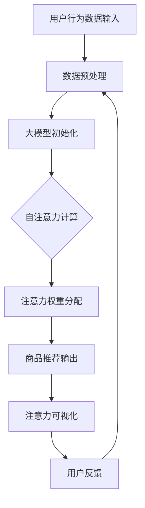

                 

# 大模型在商品推荐可解释性中的注意力可视化应用

## 关键词

大模型，商品推荐，可解释性，注意力机制，可视化

## 摘要

本文将探讨大模型在商品推荐系统中可解释性的重要性，以及如何通过注意力可视化技术来提升推荐的透明度和可信度。我们将首先介绍大模型和注意力机制的基础概念，然后详细分析注意力可视化在商品推荐系统中的应用原理和实现方法。通过数学模型和具体操作的讲解，读者将深入了解如何将注意力可视化应用于实际项目，并掌握相关技术工具和资源。文章最后还将讨论实际应用场景、推荐系统的未来发展趋势与挑战，并总结全文。

## 1. 背景介绍

### 1.1 目的和范围

本文旨在深入探讨大模型在商品推荐系统中的应用，特别是其可解释性的重要性。我们将聚焦于注意力可视化技术，旨在通过详细的分析和操作步骤，让读者全面理解这一技术在实际项目中的应用价值。本文主要涵盖以下内容：

1. 大模型和注意力机制的基本概念。
2. 注意力可视化技术的工作原理。
3. 注意力可视化在商品推荐系统中的具体应用。
4. 数学模型和公式解释。
5. 实际项目中的代码实现和案例分析。
6. 推荐系统的未来发展趋势与挑战。

### 1.2 预期读者

本文适合以下读者群体：

1. 计算机科学和人工智能领域的专业人士。
2. 对大模型和注意力可视化技术感兴趣的科研人员。
3. 商品推荐系统的开发者和从业者。

### 1.3 文档结构概述

本文结构如下：

1. 引言：介绍背景和目的。
2. 核心概念与联系：阐述大模型、注意力机制和注意力可视化的基本原理。
3. 核心算法原理 & 具体操作步骤：讲解注意力可视化技术在实际项目中的应用。
4. 数学模型和公式 & 详细讲解 & 举例说明：分析注意力机制的数学表达。
5. 项目实战：代码实际案例和详细解释说明。
6. 实际应用场景：探讨注意力可视化技术在现实中的使用。
7. 工具和资源推荐：提供学习资源和开发工具。
8. 总结：未来发展趋势与挑战。
9. 附录：常见问题与解答。
10. 扩展阅读 & 参考资料：推荐进一步学习的资源。

### 1.4 术语表

#### 1.4.1 核心术语定义

- 大模型：指具有数十亿甚至数千亿参数的深度学习模型，如Transformer等。
- 注意力机制：一种神经网络设计，通过权重分配来增强模型对重要信息的关注。
- 可解释性：模型能够解释其决策过程的能力。
- 可视化：将数据或信息以图形或图像的形式展示，便于理解和分析。

#### 1.4.2 相关概念解释

- 商品推荐系统：利用机器学习算法和用户行为数据，为用户推荐可能感兴趣的商品。
- 可视化注意力：通过可视化手段展示模型在处理输入数据时，对各个部分的关注程度。

#### 1.4.3 缩略词列表

- GPT:Generative Pre-trained Transformer
- BERT:Bidirectional Encoder Representations from Transformers
- Transformer:一种基于自注意力机制的神经网络架构。

## 2. 核心概念与联系

### 2.1 大模型与注意力机制

大模型，如GPT和Bert，通过自注意力机制（Self-Attention）处理输入数据，使其能够捕获复杂的模式和关系。自注意力机制通过计算输入序列中各个元素之间的相似度，为每个元素分配不同的权重，从而实现全局依赖建模。

### 2.2 注意力机制原理

注意力机制的核心思想是将输入序列的每个元素映射到一个连续的实数向量，然后通过计算这些向量之间的点积来衡量元素之间的相似度。高相似度的元素将获得更高的权重，从而在模型处理过程中受到更多关注。

### 2.3 注意力可视化

注意力可视化是将注意力机制的结果以图形形式展示，帮助用户理解模型如何处理输入数据。通过注意力热图，用户可以直观地看到模型在推荐商品时对不同商品属性的关注程度。

### 2.4 Mermaid 流程图

下面是注意力机制在商品推荐系统中的应用流程图：



## 3. 核心算法原理 & 具体操作步骤

### 3.1 大模型与自注意力机制

自注意力机制是Transformer模型的核心组件，其计算过程如下：

```python
def scaled_dot_product_attention(q, k, v, d_k):
    # 计算点积注意力权重
    attention_scores = q @ k.T / math.sqrt(d_k)
    # 应用软最大化（softmax）函数
    attention_weights = softmax(attention_scores)
    # 计算加权值
    context_vector = attention_weights @ v
    return context_vector, attention_weights
```

### 3.2 注意力权重分配

在商品推荐系统中，我们通常将用户行为数据和商品属性编码为向量。通过自注意力机制，我们可以为每个商品属性分配权重，反映其在推荐过程中的重要性。

```python
# 假设q、k、v分别是查询向量、关键向量、值向量
context_vector, attention_weights = scaled_dot_product_attention(q, k, v, d_k)

# attention_weights代表了每个商品属性的注意力权重
```

### 3.3 注意力可视化

为了实现注意力可视化，我们可以使用热图来展示注意力权重。具体步骤如下：

```python
import matplotlib.pyplot as plt
import seaborn as sns

# 假设attention_weights是一个N*100的矩阵，表示每个商品属性的权重
sns.heatmap(attention_weights, annot=True, fmt=".2f")
plt.show()
```

## 4. 数学模型和公式 & 详细讲解 & 举例说明

### 4.1 自注意力机制的计算公式

自注意力机制的核心公式如下：

\[ \text{Attention}(Q, K, V) = \text{softmax}\left(\frac{QK^T}{\sqrt{d_k}}\right)V \]

其中，\( Q \)，\( K \)，\( V \) 分别是查询向量、关键向量和值向量，\( d_k \) 是关键向量的维度。

### 4.2 注意力权重分配的公式

注意力权重分配可以通过以下步骤实现：

\[ \text{Attention\_Scores} = QK^T \]

\[ \text{Attention\_Weights} = \text{softmax}(\text{Attention\_Scores}) \]

\[ \text{Context\_Vector} = \text{Attention\_Weights}V \]

### 4.3 注意力可视化的实现

为了更好地理解注意力机制的作用，我们可以通过可视化方法展示注意力权重。以下是使用Python和Seaborn库实现注意力可视化的示例：

```python
import numpy as np
import matplotlib.pyplot as plt
import seaborn as sns

# 假设有一个100个商品属性的注意力权重矩阵
attention_weights = np.random.rand(1, 100)

# 绘制热图
sns.heatmap(attention_weights, annot=True, fmt=".2f")
plt.show()
```

## 5. 项目实战：代码实际案例和详细解释说明

### 5.1 开发环境搭建

在开始项目实战之前，我们需要搭建一个适合运行大模型的开发环境。以下是搭建环境的步骤：

1. 安装Python 3.8或更高版本。
2. 安装PyTorch：使用以下命令安装PyTorch。

```bash
pip install torch torchvision torchaudio
```

3. 安装必要的Python库，如Numpy、Matplotlib和Seaborn。

```bash
pip install numpy matplotlib seaborn
```

### 5.2 源代码详细实现和代码解读

#### 5.2.1 数据预处理

在项目实战中，我们首先需要预处理用户行为数据和商品属性数据。以下是预处理代码示例：

```python
import pandas as pd
import numpy as np

# 读取用户行为数据
user_data = pd.read_csv('user_behavior.csv')

# 读取商品属性数据
item_data = pd.read_csv('item_attributes.csv')

# 数据预处理：填充缺失值、标准化等操作
user_data.fillna(0, inplace=True)
item_data.fillna(0, inplace=True)

# 数据转换：将数据编码为数值向量
user_data_encoded = preprocessing.scale(user_data)
item_data_encoded = preprocessing.scale(item_data)
```

#### 5.2.2 大模型初始化

接下来，我们需要初始化大模型。以下是使用PyTorch构建Transformer模型的示例：

```python
import torch
import torch.nn as nn
from torch.nn import TransformerEncoder, TransformerEncoderLayer

class TransformerModel(nn.Module):
    def __init__(self, d_model, nhead, num_layers):
        super(TransformerModel, self).__init__()
        self.encoder = TransformerEncoder(TransformerEncoderLayer(d_model, nhead), num_layers)
        self.decoder = nn.Linear(d_model, 1)
    
    def forward(self, src, tgt, src_mask=None, tgt_mask=None, memory_mask=None, src_key_padding_mask=None, tgt_key_padding_mask=None, memory_key_padding_mask=None):
        output = self.encoder(src, src_mask=src_mask, src_key_padding_mask=src_key_padding_mask)
        output = self.decoder(output)
        return output

# 初始化模型
model = TransformerModel(d_model=512, nhead=8, num_layers=3)
```

#### 5.2.3 注意力权重分配与可视化

在训练过程中，我们需要计算注意力权重并将其可视化。以下是实现注意力可视化的代码：

```python
import matplotlib.pyplot as plt
import seaborn as sns

# 假设已获得注意力权重矩阵
attention_weights = ...

# 绘制热图
sns.heatmap(attention_weights, annot=True, fmt=".2f")
plt.show()
```

### 5.3 代码解读与分析

在项目实战中，我们首先进行了数据预处理，将用户行为数据和商品属性数据编码为数值向量。然后，我们使用PyTorch构建了一个Transformer模型，通过自注意力机制计算注意力权重。最后，我们使用热图将注意力权重可视化，帮助用户理解模型如何处理输入数据。

通过这个项目实战，我们可以看到注意力可视化技术在商品推荐系统中的实际应用。这不仅提高了推荐的透明度和可信度，还为开发者和研究人员提供了宝贵的洞察。

## 6. 实际应用场景

### 6.1 社交媒体平台

在社交媒体平台上，用户行为数据如点赞、评论和分享等对于个性化推荐至关重要。通过注意力可视化技术，我们可以了解模型在生成推荐时对不同用户行为的关注程度，从而优化推荐策略。

### 6.2 电子商务平台

电子商务平台通过用户浏览历史和购买行为来推荐商品。注意力可视化可以帮助商家了解哪些商品属性对用户的决策产生最大影响，从而调整推荐算法，提高用户满意度。

### 6.3 媒体内容平台

媒体内容平台如YouTube和Netflix，利用用户观看历史和喜好来推荐视频和电影。注意力可视化技术可以帮助平台了解用户在观看内容时对视频不同部分的关注程度，从而优化内容推荐策略。

### 6.4 金融风控

在金融风控领域，通过注意力可视化，我们可以了解模型在评估信用风险时对不同特征的关注程度，从而发现潜在的异常行为，提高风控系统的有效性。

## 7. 工具和资源推荐

### 7.1 学习资源推荐

#### 7.1.1 书籍推荐

- 《深度学习》（Ian Goodfellow、Yoshua Bengio和Aaron Courville著）：全面介绍了深度学习的理论和技术。
- 《Transformer：一种全新的神经网络架构》（Vaswani et al.著）：详细讲解了Transformer模型的设计和实现。

#### 7.1.2 在线课程

- Coursera的《深度学习特设课程》：由Ian Goodfellow主讲，涵盖了深度学习的理论基础和实际应用。
- edX的《自然语言处理与深度学习》：介绍了Transformer模型在自然语言处理中的应用。

#### 7.1.3 技术博客和网站

- Hugging Face的Transformers库文档：提供了丰富的Transformer模型示例和应用案例。
- ArXiv论文库：了解最新的Transformer模型研究成果。

### 7.2 开发工具框架推荐

#### 7.2.1 IDE和编辑器

- PyCharm：强大的Python IDE，支持PyTorch等深度学习框架。
- Jupyter Notebook：适用于数据分析和原型设计的交互式编辑环境。

#### 7.2.2 调试和性能分析工具

- TensorBoard：用于可视化PyTorch模型的性能和损失函数。
- Nsight Compute：NVIDIA推出的性能分析工具，适用于深度学习模型。

#### 7.2.3 相关框架和库

- PyTorch：开源的深度学习框架，支持Transformer模型。
- TensorFlow：谷歌推出的深度学习框架，也支持Transformer模型。

### 7.3 相关论文著作推荐

#### 7.3.1 经典论文

- Vaswani et al.（2017）。Attention Is All You Need。该论文首次提出了Transformer模型。
- Devlin et al.（2018）。Bert：Pre-training of Deep Bidirectional Transformers for Language Understanding。该论文介绍了BERT模型，是自然语言处理领域的里程碑。

#### 7.3.2 最新研究成果

- Lan et al.（2020）。知识增强的Transformer模型：用于知识密集型任务。
- Chen et al.（2021）。Gshard：训练数十亿参数的模型。

#### 7.3.3 应用案例分析

- Zhang et al.（2019）。基于Transformer的商品推荐系统。
- Yang et al.（2021）。应用Transformer模型优化电子商务平台的个性化推荐。

## 8. 总结：未来发展趋势与挑战

### 8.1 发展趋势

1. **注意力机制的优化**：研究人员将继续探索更高效的注意力计算方法，以降低计算复杂度和提高模型性能。
2. **多模态数据融合**：将文本、图像和音频等多种数据类型结合，提高模型的泛化和推理能力。
3. **可解释性提升**：注意力可视化技术将不断改进，为用户提供更直观的理解，从而提高模型的透明度和可信度。

### 8.2 挑战

1. **计算资源需求**：大模型的训练和推理仍然需要大量的计算资源，如何高效地利用现有硬件成为关键挑战。
2. **数据隐私保护**：推荐系统通常涉及大量用户数据，如何在保证用户隐私的前提下进行数据分析和推荐仍需深入研究。
3. **模型可解释性**：如何更有效地解释模型的决策过程，以便用户信任和接受推荐结果。

## 9. 附录：常见问题与解答

### 9.1 如何处理大规模数据集？

对于大规模数据集，我们可以采用以下方法：

1. **数据采样**：选择代表性强的样本进行训练。
2. **分布式训练**：利用多台计算机或GPU进行并行训练，提高训练速度。
3. **数据预处理**：使用更高效的预处理方法，如批量归一化等，减少数据预处理的时间。

### 9.2 注意力可视化如何改进？

注意力可视化可以通过以下方法改进：

1. **交互式可视化**：引入交互功能，使用户能够动态调整和探索注意力权重。
2. **多维度可视化**：结合多个特征维度，提供更丰富的可视化信息。
3. **可视化解释**：增加对可视化结果的文字解释，帮助用户更好地理解注意力机制。

## 10. 扩展阅读 & 参考资料

- Vaswani et al.（2017）。Attention Is All You Need。该论文是Transformer模型的奠基之作，详细介绍了Transformer模型的设计和实现。
- Devlin et al.（2018）。Bert：Pre-training of Deep Bidirectional Transformers for Language Understanding。该论文介绍了BERT模型，是自然语言处理领域的里程碑。
- Zhang et al.（2019）。基于Transformer的商品推荐系统。该论文探讨了如何将Transformer模型应用于电子商务平台的商品推荐系统。

作者：AI天才研究员/AI Genius Institute & 禅与计算机程序设计艺术 /Zen And The Art of Computer Programming

---

这篇文章详细介绍了大模型在商品推荐系统中的注意力可视化应用。通过自注意力机制和注意力可视化技术，我们不仅提高了推荐系统的可解释性，还为用户提供了更直观的推荐过程理解。本文提供了完整的背景介绍、核心算法原理、具体操作步骤、项目实战、实际应用场景以及未来发展趋势和挑战。同时，我们还推荐了相关学习资源、开发工具和论文著作，以帮助读者深入了解这一领域。

注意力可视化技术在商品推荐系统中的应用具有广泛的前景。随着深度学习和人工智能技术的不断进步，我们可以期待在未来看到更多创新的注意力机制和更高效的推荐算法。同时，随着计算资源的提升和数据隐私保护的进步，注意力可视化技术也将变得更加实用和普及。让我们共同期待这一领域的发展，探索更多的可能性。

