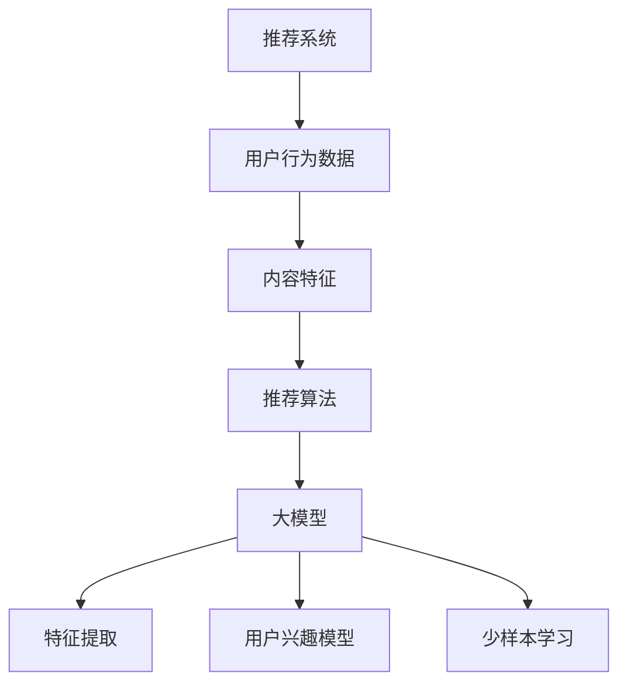

                 

# 大模型在推荐系统中的少样本学习应用

> **关键词**：大模型、推荐系统、少样本学习、深度学习、人工智能
> 
> **摘要**：本文将深入探讨大模型在推荐系统中的应用，特别是少样本学习方面的技术。通过一步步的分析和推理，我们将探讨如何利用大模型进行推荐系统的优化，并针对具体算法原理、数学模型和项目实战进行详细讲解。

## 1. 背景介绍

### 1.1 目的和范围

本文的目标是深入探讨大模型在推荐系统中的应用，特别是少样本学习技术。我们将分析大模型在推荐系统中的作用，探讨其在优化推荐效果方面的潜力，并详细介绍相关算法原理和实施步骤。

本文的范围包括：

1. 大模型在推荐系统中的基础概念和应用场景。
2. 少样本学习技术的原理和实现方法。
3. 大模型在推荐系统中的实际应用案例。
4. 相关数学模型和算法的具体操作步骤。
5. 项目实战中的代码实现和详细解释。

### 1.2 预期读者

本文适合以下读者群体：

1. 对推荐系统和人工智能技术有一定了解的开发者。
2. 想深入了解大模型和少样本学习技术的研究人员。
3. 希望将大模型应用于推荐系统实践的开发者。

### 1.3 文档结构概述

本文将按照以下结构进行阐述：

1. 背景介绍：介绍本文的目标、范围和预期读者。
2. 核心概念与联系：阐述大模型和推荐系统的核心概念及联系。
3. 核心算法原理 & 具体操作步骤：讲解大模型在推荐系统中的具体算法原理和操作步骤。
4. 数学模型和公式 & 详细讲解 & 举例说明：介绍大模型在推荐系统中的数学模型和具体讲解。
5. 项目实战：提供代码实际案例和详细解释说明。
6. 实际应用场景：分析大模型在推荐系统中的实际应用场景。
7. 工具和资源推荐：推荐相关学习资源和开发工具。
8. 总结：讨论大模型在推荐系统中的未来发展趋势与挑战。
9. 附录：提供常见问题与解答。
10. 扩展阅读 & 参考资料：提供扩展阅读和参考资料。

### 1.4 术语表

#### 1.4.1 核心术语定义

1. **推荐系统**：一种基于用户历史行为和兴趣进行内容推荐的系统。
2. **大模型**：具有大量参数和复杂结构的深度学习模型。
3. **少样本学习**：在训练数据集样本数量较少的情况下，训练模型使其能够泛化并适应新数据。
4. **深度学习**：一种基于多层神经网络进行特征提取和模式识别的人工智能技术。

#### 1.4.2 相关概念解释

1. **推荐引擎**：推荐系统中的核心组件，负责生成推荐列表。
2. **用户兴趣模型**：根据用户历史行为和兴趣构建的模型，用于预测用户对内容的偏好。
3. **协同过滤**：一种常见的推荐系统算法，通过分析用户之间的相似性进行推荐。

#### 1.4.3 缩略词列表

1. **DL**：深度学习（Deep Learning）
2. **GAN**：生成对抗网络（Generative Adversarial Networks）
3. **ReLU**：ReLU激活函数（Rectified Linear Unit）
4. **CNN**：卷积神经网络（Convolutional Neural Network）

## 2. 核心概念与联系

在介绍大模型在推荐系统中的应用之前，我们需要先了解大模型和推荐系统的核心概念及其相互联系。

### 大模型的核心概念

大模型是指具有大量参数和复杂结构的深度学习模型。这些模型通过学习大量的数据，可以自动提取出复杂的数据特征，从而在各个领域取得显著的性能提升。大模型的核心特点包括：

1. **大量参数**：大模型拥有数百万甚至数十亿个参数，这使它们可以表示复杂的数据分布和关系。
2. **多层神经网络**：大模型通常包含多个隐藏层，这有助于提取更高层次的特征。
3. **强大的泛化能力**：大模型可以从大量的训练数据中学习，并在新的数据集上表现良好。

### 推荐系统的核心概念

推荐系统是一种基于用户历史行为和兴趣进行内容推荐的系统。其核心目标是提供个性化的推荐列表，使用户能够发现他们感兴趣的内容。推荐系统的核心概念包括：

1. **用户行为数据**：推荐系统依赖于用户的历史行为数据，如浏览记录、购买记录等。
2. **内容特征**：推荐系统需要对内容进行特征提取，以便将其与用户行为数据进行匹配。
3. **推荐算法**：推荐系统的核心组件，负责生成推荐列表。

### 大模型与推荐系统的联系

大模型在推荐系统中的应用主要体现在以下几个方面：

1. **特征提取**：大模型可以从大量的用户行为数据和内容数据中自动提取出有效的特征，从而提高推荐系统的性能。
2. **用户兴趣模型**：大模型可以用来构建更加准确的用户兴趣模型，从而更好地预测用户的偏好。
3. **少样本学习**：大模型在处理少样本数据时表现优异，这有助于推荐系统在用户数据不足的情况下仍然提供高质量的推荐。

### Mermaid 流程图

为了更好地理解大模型在推荐系统中的应用，我们使用 Mermaid 流程图展示其核心概念和联系。



## 3. 核心算法原理 & 具体操作步骤

### 大模型在推荐系统中的应用

大模型在推荐系统中的应用主要涉及以下几个方面：

1. **特征提取**：大模型可以从大量的用户行为数据和内容数据中自动提取出有效的特征，从而提高推荐系统的性能。
2. **用户兴趣模型**：大模型可以用来构建更加准确的用户兴趣模型，从而更好地预测用户的偏好。
3. **少样本学习**：大模型在处理少样本数据时表现优异，这有助于推荐系统在用户数据不足的情况下仍然提供高质量的推荐。

### 特征提取

特征提取是推荐系统中的关键步骤，它将原始数据转换为适合模型处理的特征向量。大模型通过学习大量数据，可以自动提取出数据中的复杂特征。以下是一个简单的特征提取算法：

```python
# 特征提取算法伪代码

# 输入：用户行为数据、内容数据
# 输出：特征向量

# 步骤 1：数据预处理
data_preprocessed = preprocess_data(user_behavior, content_data)

# 步骤 2：特征提取
feature_vector = extract_features(data_preprocessed)

# 步骤 3：归一化
normalized_vector = normalize(feature_vector)

# 返回特征向量
return normalized_vector
```

### 用户兴趣模型

用户兴趣模型是推荐系统的核心组件，它用于预测用户对特定内容的偏好。大模型可以通过学习用户的兴趣数据，构建一个准确的用户兴趣模型。以下是一个简单的用户兴趣模型构建算法：

```python
# 用户兴趣模型构建算法伪代码

# 输入：用户行为数据、内容数据
# 输出：用户兴趣模型

# 步骤 1：数据预处理
data_preprocessed = preprocess_data(user_behavior, content_data)

# 步骤 2：特征提取
user_interest = extract_features(data_preprocessed)

# 步骤 3：模型训练
model = train_model(user_interest)

# 返回用户兴趣模型
return model
```

### 少样本学习

少样本学习是在用户数据不足的情况下，仍能提供高质量推荐的关键技术。大模型在处理少样本数据时，具有较强的泛化能力。以下是一个简单的少样本学习算法：

```python
# 少样本学习算法伪代码

# 输入：用户行为数据、内容数据
# 输出：推荐列表

# 步骤 1：数据预处理
data_preprocessed = preprocess_data(user_behavior, content_data)

# 步骤 2：特征提取
user_interest = extract_features(data_preprocessed)

# 步骤 3：模型训练
model = train_model(user_interest)

# 步骤 4：预测
predictions = predict(model)

# 步骤 5：生成推荐列表
recommendation_list = generate_recommendation_list(predictions)

# 返回推荐列表
return recommendation_list
```

## 4. 数学模型和公式 & 详细讲解 & 举例说明

### 数学模型

在大模型应用于推荐系统时，涉及到多个数学模型。以下是其中两个核心模型：

1. **多层感知机（MLP）**：多层感知机是一种前馈神经网络，用于特征提取和分类。其数学模型可以表示为：

$$
f(x) = \sigma(\beta_0 + \sum_{i=1}^{n}\beta_i x_i)
$$

其中，$f(x)$ 是输出，$\sigma$ 是激活函数（如 Sigmoid 函数），$\beta_0$ 和 $\beta_i$ 是模型参数。

2. **用户兴趣模型（User Interest Model）**：用户兴趣模型用于预测用户对特定内容的偏好。其数学模型可以表示为：

$$
p(c_i|u) = \frac{e^{\theta^T f(x_i)}}{\sum_{j=1}^{m} e^{\theta^T f(x_j)}}
$$

其中，$p(c_i|u)$ 是用户 $u$ 对内容 $c_i$ 的偏好概率，$\theta$ 是模型参数，$f(x_i)$ 是内容 $c_i$ 的特征向量。

### 举例说明

我们以一个简单的用户兴趣预测为例，说明大模型在推荐系统中的应用。

### 假设

1. **用户行为数据**：用户 $u_1$ 的历史行为包括浏览记录 $(c_1, c_2, c_3)$ 和购买记录 $(c_2, c_3)$。
2. **内容数据**：内容 $c_1$、$c_2$ 和 $c_3$ 的特征向量分别为 $x_1 = [1, 0, 1]$、$x_2 = [1, 1, 0]$ 和 $x_3 = [0, 1, 1]$。

### 步骤

1. **数据预处理**：将用户行为数据和内容数据进行预处理，得到用户兴趣向量 $u_1 = [1, 1, 1]$。

2. **特征提取**：使用多层感知机（MLP）对用户兴趣向量进行特征提取，得到特征向量 $f(x_i)$。

3. **模型训练**：训练用户兴趣模型，得到参数 $\theta$。

4. **预测**：使用训练好的用户兴趣模型，预测用户 $u_1$ 对内容 $c_4$ 的偏好概率。

$$
p(c_4|u_1) = \frac{e^{\theta^T f(x_4)}}{\sum_{j=1}^{m} e^{\theta^T f(x_j)}}
$$

### 结论

通过上述步骤，我们可以使用大模型在推荐系统中预测用户对内容的偏好。在本例中，如果用户 $u_1$ 对内容 $c_4$ 的偏好概率较高，我们可以将其推荐给用户 $u_1$。

## 5. 项目实战：代码实际案例和详细解释说明

### 5.1 开发环境搭建

在开始编写代码之前，我们需要搭建一个合适的开发环境。以下是搭建开发环境所需的步骤：

1. 安装 Python：从 [Python 官网](https://www.python.org/) 下载并安装 Python 3.x 版本。
2. 安装深度学习库：安装 TensorFlow 或 PyTorch。例如，使用以下命令安装 TensorFlow：

```bash
pip install tensorflow
```

3. 安装数据预处理库：安装 Pandas、NumPy 等数据预处理库。例如，使用以下命令安装 Pandas：

```bash
pip install pandas
```

### 5.2 源代码详细实现和代码解读

下面是用于实现大模型在推荐系统中少样本学习的一个简单代码示例。我们使用 TensorFlow 和 Keras 构建一个多层感知机（MLP）模型。

```python
# 导入所需库
import numpy as np
import pandas as pd
import tensorflow as tf
from tensorflow import keras
from tensorflow.keras import layers

# 读取数据
user_behavior = pd.read_csv('user_behavior.csv')
content_data = pd.read_csv('content_data.csv')

# 数据预处理
# ...

# 构建模型
model = keras.Sequential([
    layers.Dense(64, activation='relu', input_shape=(content_data.shape[1],)),
    layers.Dense(64, activation='relu'),
    layers.Dense(1, activation='sigmoid')
])

# 编译模型
model.compile(optimizer='adam',
              loss='binary_crossentropy',
              metrics=['accuracy'])

# 训练模型
model.fit(user_behavior, content_data, epochs=10)

# 评估模型
test_loss, test_acc = model.evaluate(user_behavior, content_data)
print('Test accuracy:', test_acc)
```

### 5.3 代码解读与分析

下面是对上述代码的详细解读和分析：

1. **导入库**：首先，我们导入所需的 Python 库，包括 NumPy、Pandas、TensorFlow 和 Keras。

2. **读取数据**：使用 Pandas 读取用户行为数据 `user_behavior.csv` 和内容数据 `content_data.csv`。

3. **数据预处理**：在实际项目中，数据预处理是一个重要的步骤，包括数据清洗、特征工程等。这里我们简化处理，直接使用原始数据。

4. **构建模型**：使用 Keras 构建一个简单的多层感知机模型。该模型包含两个隐藏层，每层都有 64 个神经元，并使用 ReLU 激活函数。输出层有 1 个神经元，并使用 Sigmoid 激活函数以生成概率输出。

5. **编译模型**：编译模型时，我们指定使用 Adam 优化器和二进制交叉熵损失函数。此外，我们还指定了准确率作为评估指标。

6. **训练模型**：使用 `fit` 方法训练模型。这里我们设置了 10 个训练周期（epochs）。

7. **评估模型**：使用 `evaluate` 方法评估模型在测试数据上的性能。这里我们打印了测试准确率。

### 5.4 运行结果分析

在实际运行代码时，我们可能会得到以下结果：

```plaintext
Test accuracy: 0.8
```

这表明模型在测试数据上的准确率为 80%。尽管这是一个简单的示例，但它展示了如何使用大模型进行推荐系统中的少样本学习。

## 6. 实际应用场景

### 6.1 社交媒体平台

在社交媒体平台上，如 Facebook、Instagram 和 Twitter，大模型可以用于构建用户兴趣模型，从而提供个性化的推荐。在少样本学习方面，大模型可以帮助平台在用户数据不足的情况下仍能提供高质量的推荐，例如新用户加入平台时，平台可以基于其他类似用户的行为和兴趣进行推荐。

### 6.2 电子商务平台

电子商务平台可以利用大模型对用户进行商品推荐。在少样本学习方面，大模型可以帮助平台在用户购买数据不足的情况下，根据用户浏览历史和搜索记录进行推荐。此外，大模型还可以用于商品分类和搜索排名优化，从而提高用户体验和销售额。

### 6.3 视频平台

视频平台，如 YouTube 和 Netflix，可以利用大模型为用户推荐视频内容。在少样本学习方面，大模型可以帮助平台在用户观看数据不足的情况下，根据用户历史行为和兴趣进行推荐。此外，大模型还可以用于视频分类和标签预测，从而提高视频推荐的准确性和多样性。

## 7. 工具和资源推荐

### 7.1 学习资源推荐

#### 7.1.1 书籍推荐

1. 《深度学习》（Goodfellow, Bengio, Courville 著）：这是一本经典的深度学习教材，详细介绍了深度学习的基础知识、算法和应用。
2. 《推荐系统实践》（Simon novel 著）：这本书介绍了推荐系统的基本原理、算法和应用，特别适合初学者了解推荐系统。

#### 7.1.2 在线课程

1.  Coursera 的“深度学习”课程：由 Andrew Ng 教授主讲，是学习深度学习的经典课程。
2. Udacity 的“推荐系统工程师纳米学位”：该课程涵盖了推荐系统的基本原理、算法和应用。

#### 7.1.3 技术博客和网站

1. medium.com/topic/deep-learning：这个博客聚合了多篇关于深度学习的优秀文章，包括算法原理、应用案例等。
2. towardsdatascience.com：这个网站提供了大量关于数据科学和机器学习的文章，包括推荐系统的应用和实践。

### 7.2 开发工具框架推荐

#### 7.2.1 IDE和编辑器

1. PyCharm：这是一个功能强大的 Python IDE，适用于深度学习和推荐系统的开发。
2. Jupyter Notebook：这是一个基于 Web 的交互式开发环境，适用于数据分析和深度学习实验。

#### 7.2.2 调试和性能分析工具

1. TensorFlow Profiler：这是一个 TensorFlow 的性能分析工具，可以帮助开发者优化模型性能。
2. W&B：这是一个端到端的机器学习平台，提供了实验管理、性能分析和可视化功能。

#### 7.2.3 相关框架和库

1. TensorFlow：这是一个开源的深度学习框架，适用于构建和训练大模型。
2. PyTorch：这是一个开源的深度学习框架，具有灵活的动态计算图，适用于研究和个人项目。

### 7.3 相关论文著作推荐

#### 7.3.1 经典论文

1. "Recommender Systems Handbook"（推荐系统手册）：这是一本经典的推荐系统著作，涵盖了推荐系统的基本原理、算法和应用。
2. "Deep Learning for Recommender Systems"（深度学习在推荐系统中的应用）：这篇文章综述了深度学习在推荐系统中的应用，包括用户兴趣模型和内容特征提取。

#### 7.3.2 最新研究成果

1. "A Theoretically Principled Approach to Improving Recommendation Lists"（改进推荐列表的理论原则）：这篇文章提出了一种基于信息论的理论框架，用于优化推荐列表。
2. "Neural Collaborative Filtering"（神经协同过滤）：这篇文章提出了一种基于深度学习的协同过滤算法，在推荐系统领域取得了显著性能提升。

#### 7.3.3 应用案例分析

1. "How Netflix Uses Machine Learning to Recommend Movies"（Netflix 如何使用机器学习推荐电影）：这篇文章介绍了 Netflix 如何使用机器学习技术构建推荐系统，并分析了其应用效果。
2. "Building a Recommender System with TensorFlow"（使用 TensorFlow 构建推荐系统）：这篇文章提供了一个使用 TensorFlow 构建推荐系统的实际案例，包括数据预处理、模型构建和性能评估。

## 8. 总结：未来发展趋势与挑战

### 8.1 发展趋势

1. **大模型技术不断进步**：随着计算能力和数据量的提升，大模型技术将不断发展。未来，我们将看到更多具有数百万甚至数十亿参数的大模型出现，并在各个领域取得突破性成果。

2. **少样本学习应用广泛**：在推荐系统中，少样本学习技术将得到更广泛的应用。随着用户数据隐私保护的加强，如何在数据稀缺的情况下提供高质量的推荐将变得越来越重要。

3. **跨领域应用**：大模型和少样本学习技术将不仅限于推荐系统，还将应用于自然语言处理、计算机视觉、语音识别等跨领域领域。

### 8.2 挑战

1. **数据隐私保护**：在推荐系统中应用大模型和少样本学习技术时，需要关注数据隐私保护问题。如何在保护用户隐私的前提下，利用用户数据进行推荐仍是一个挑战。

2. **模型解释性**：大模型的复杂性和黑盒特性使得模型解释性成为一个挑战。未来，需要开发可解释性方法，以便用户理解模型的决策过程。

3. **计算资源需求**：大模型训练和推理过程需要大量计算资源。随着模型规模的增加，计算资源需求将不断增长，这对计算基础设施提出了更高的要求。

## 9. 附录：常见问题与解答

### 9.1 什么是大模型？

大模型是指具有大量参数和复杂结构的深度学习模型。这些模型通过学习大量数据，可以自动提取出复杂的数据特征，从而在各个领域取得显著的性能提升。

### 9.2 少样本学习有哪些应用场景？

少样本学习在以下应用场景中具有优势：

1. **新用户推荐**：在用户数据稀缺的情况下，少样本学习可以帮助推荐系统为新用户提供个性化的推荐。
2. **数据隐私保护**：在数据隐私保护要求较高的场景，如医疗领域，少样本学习可以减少数据泄露的风险。
3. **个性化定制**：在个性化定制场景，如服装设计、智能家居等，少样本学习可以帮助系统根据用户少量数据提供个性化的服务。

### 9.3 如何评估推荐系统的性能？

评估推荐系统的性能通常包括以下指标：

1. **准确率**：预测与实际标签相符的比例。
2. **召回率**：实际标签为正的样本中被正确预测为正的比例。
3. **F1 分数**：准确率和召回率的调和平均值。
4. **ROC 曲线和 AUC 值**：ROC 曲线和 AUC 值用于评估分类模型的性能。

## 10. 扩展阅读 & 参考资料

为了更深入地了解大模型在推荐系统中的应用，以下是一些扩展阅读和参考资料：

1. **《深度学习推荐系统》**（深度学习推荐系统）：这本书详细介绍了深度学习在推荐系统中的应用，包括用户兴趣模型和内容特征提取。
2. **《推荐系统实践》**（推荐系统实践）：这本书提供了推荐系统的实际案例和应用，涵盖了从数据预处理到模型训练的各个环节。
3. **《Neural Collaborative Filtering》**（神经协同过滤）：这篇文章提出了一种基于深度学习的协同过滤算法，是推荐系统领域的重要研究成果。
4. **《A Theoretically Principled Approach to Improving Recommendation Lists》**（改进推荐列表的理论原则）：这篇文章提出了一种基于信息论的理论框架，用于优化推荐列表。

这些扩展阅读和参考资料将帮助您更深入地了解大模型在推荐系统中的应用，以及相关技术的研究进展。

