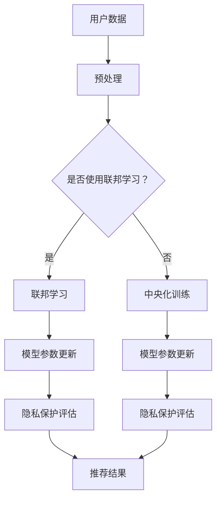

                 

# 大模型在推荐系统中的隐私保护学习方法

> **关键词**：大模型、推荐系统、隐私保护、深度学习、数据安全、联邦学习

> **摘要**：本文将深入探讨大模型在推荐系统中的隐私保护学习方法。首先，我们将介绍推荐系统中的隐私保护需求以及大模型在此领域的应用背景。随后，我们将详细阐述大模型在推荐系统中使用的几种隐私保护技术，包括差分隐私、联邦学习和生成对抗网络。文章最后，将通过一个实际案例，展示如何将大模型与隐私保护技术相结合，实现推荐系统的隐私保护。

## 1. 背景介绍

### 1.1 目的和范围

本文的目的是介绍大模型在推荐系统中的隐私保护学习方法。随着大数据和人工智能技术的不断发展，推荐系统已经成为许多应用领域的重要组成部分，如电子商务、社交媒体和在线娱乐等。然而，推荐系统在处理用户数据时，面临着严重的隐私泄露风险。本文将重点探讨如何在大模型的基础上，实现推荐系统的隐私保护。

### 1.2 预期读者

本文适合对推荐系统、大数据、人工智能和隐私保护有一定了解的读者。对于希望了解大模型在推荐系统中的应用和隐私保护方法的从业者和技术人员，本文将提供有价值的参考。

### 1.3 文档结构概述

本文分为十个部分。第一部分是背景介绍，包括目的和范围、预期读者以及文档结构概述。第二部分是核心概念与联系，介绍大模型和推荐系统的基本概念，并给出Mermaid流程图。第三部分是核心算法原理与具体操作步骤，详细讲解大模型在推荐系统中的算法原理。第四部分是数学模型和公式，对相关数学模型进行详细讲解和举例说明。第五部分是项目实战，通过实际案例展示大模型在推荐系统中的应用。第六部分是实际应用场景，分析大模型在推荐系统中的潜在应用。第七部分是工具和资源推荐，提供相关学习资源和开发工具。第八部分是总结，讨论未来发展趋势与挑战。第九部分是附录，回答常见问题。最后是扩展阅读和参考资料。

### 1.4 术语表

#### 1.4.1 核心术语定义

- **大模型**：具有极高参数量和计算复杂度的机器学习模型。
- **推荐系统**：利用用户历史行为和偏好信息，向用户推荐相关内容的系统。
- **隐私保护**：保护用户数据隐私，防止隐私泄露和滥用的措施。
- **差分隐私**：一种在数据处理过程中，确保隐私的保护方法。
- **联邦学习**：一种分布式机器学习方法，通过多个参与者共享数据，实现模型训练。
- **生成对抗网络（GAN）**：一种用于生成数据的神经网络架构。

#### 1.4.2 相关概念解释

- **数据安全**：保护数据在存储、传输和处理过程中的完整性和保密性。
- **联邦学习**：联邦学习是一种分布式机器学习方法，参与者只需共享模型参数，而不需要共享原始数据。这种方法可以有效保护用户数据隐私，降低数据泄露风险。
- **生成对抗网络（GAN）**：生成对抗网络是一种由生成器和判别器组成的神经网络架构。生成器尝试生成与真实数据相似的数据，判别器则判断生成数据与真实数据之间的区别。通过这种对抗过程，生成器不断提高生成数据的质量。

#### 1.4.3 缩略词列表

- **GAN**：生成对抗网络（Generative Adversarial Network）
- **DNN**：深度神经网络（Deep Neural Network）
- **DP**：差分隐私（Differential Privacy）
- **FL**：联邦学习（Federated Learning）
- **RL**：推荐系统（Recommendation System）

## 2. 核心概念与联系

在探讨大模型在推荐系统中的隐私保护学习方法之前，我们需要先了解一些核心概念和它们之间的联系。

### 2.1 大模型与推荐系统

大模型，如深度神经网络（DNN），具有极高的参数量和计算复杂度，可以在大规模数据集上实现出色的性能。推荐系统利用用户的历史行为和偏好信息，预测用户可能感兴趣的内容，从而提高用户满意度和系统价值。大模型在推荐系统中的应用，使得推荐系统在处理大规模、多维度数据时，具有更强的表示能力和预测能力。

### 2.2 隐私保护与推荐系统

推荐系统在处理用户数据时，面临着隐私泄露的风险。用户数据包含敏感信息，如个人喜好、行为习惯等，一旦泄露，可能导致用户隐私被侵犯，甚至引发严重后果。因此，隐私保护在推荐系统中具有重要意义。隐私保护技术，如差分隐私和联邦学习，可以帮助推荐系统在处理用户数据时，确保用户隐私不被泄露。

### 2.3 Mermaid流程图

为了更好地理解大模型在推荐系统中的隐私保护学习方法，我们使用Mermaid流程图（以下为Mermaid流程图示例）展示其基本架构：



在该流程图中，用户数据首先进行预处理，然后根据是否使用联邦学习，分别进入联邦学习训练和中央化训练。联邦学习和中央化训练都会生成模型参数，并进行隐私保护评估。最后，根据评估结果生成推荐结果。

## 3. 核心算法原理与具体操作步骤

在大模型的基础上，实现推荐系统的隐私保护，需要使用一系列算法和技术。以下是几种常见的方法及其具体操作步骤。

### 3.1 差分隐私

差分隐私（Differential Privacy，DP）是一种保护用户隐私的方法，通过在数据处理过程中添加噪声，确保输出结果对单个用户的依赖性降低。以下是差分隐私的基本原理和操作步骤：

#### 3.1.1 差分隐私基本原理

差分隐私的核心思想是在保证数据集统计特性的同时，确保对单个数据的依赖性最小化。具体来说，差分隐私通过添加Laplacian噪声来实现。Laplacian噪声是一种具有高斯分布的噪声，其数学描述如下：

$$
\epsilon \sim Laplace(\mu, \sigma^2)
$$

其中，$\mu$ 是噪声的中心，$\sigma^2$ 是噪声的方差。对于给定的查询函数$f(X)$，其差分隐私定义为：

$$
\mathcal{D}(f(X)) = \exp\left(-\frac{||X - X'|}{\sigma^2}\right)
$$

其中，$X$ 和$X'$分别表示包含和不含特定用户数据的两个邻近数据集。$||X - X'||$表示两个数据集之间的差异。

#### 3.1.2 差分隐私操作步骤

1. **数据预处理**：对原始用户数据进行预处理，包括清洗、去重、归一化等操作，确保数据质量。
2. **添加噪声**：对预处理后的数据进行差分隐私处理，添加Laplacian噪声。具体操作如下：

   ```python
   import numpy as np

   def add_noise(data, alpha=1.0):
       noise = np.random.laplace(size=data.shape, scale=alpha)
       return data + noise
   ```

3. **计算查询结果**：使用添加噪声后的数据进行查询操作，如统计用户兴趣、预测用户行为等。

4. **隐私保护评估**：评估查询结果的隐私保护水平，确保满足差分隐私要求。具体评估方法如下：

   ```python
   import numpy as np

   def differential_privacy(data, epsilon):
       noise = np.random.laplace(size=data.shape, scale=epsilon)
       result = data + noise
       return result
   ```

### 3.2 联邦学习

联邦学习（Federated Learning，FL）是一种分布式机器学习方法，通过多个参与者共享模型参数，实现模型训练。联邦学习可以有效保护用户数据隐私，降低数据泄露风险。以下是联邦学习的基本原理和操作步骤：

#### 3.2.1 联邦学习基本原理

联邦学习的基本原理如下：

1. **模型初始化**：在一个中心服务器（Server）的协调下，所有参与者（Clients）初始化本地模型。
2. **本地训练**：每个参与者使用本地数据集，对本地模型进行训练。
3. **模型更新**：所有参与者将本地模型的更新（梯度）发送给中心服务器。
4. **模型聚合**：中心服务器对参与者发送的更新进行聚合，生成全局模型。
5. **本地更新**：所有参与者使用全局模型进行本地更新。

#### 3.2.2 联邦学习操作步骤

1. **模型初始化**：初始化全局模型和本地模型，如线性模型、卷积神经网络（CNN）等。
2. **本地训练**：每个参与者使用本地数据集，对本地模型进行训练。具体步骤如下：

   ```python
   import tensorflow as tf

   # 初始化全局模型和本地模型
   global_model = tf.keras.Sequential([
       tf.keras.layers.Dense(units=1, input_shape=[1])
   ])

   local_model = tf.keras.Sequential([
       tf.keras.layers.Dense(units=1, input_shape=[1])
   ])

   # 训练本地模型
   local_model.compile(optimizer='sgd', loss='mse')
   local_model.fit(x_train, y_train, epochs=10)
   ```

3. **模型更新**：每个参与者将本地模型的更新（梯度）发送给中心服务器。具体步骤如下：

   ```python
   import tensorflow as tf

   # 求取本地模型的梯度
   local_gradients = local_model.optimizer.get_gradients(local_model.total_loss, local_model.trainable_variables)

   # 将梯度发送给中心服务器
   server_gradients = [0] * len(local_gradients)
   for i, grad in enumerate(local_gradients):
       server_gradients[i] = send_gradient(grad)
   ```

4. **模型聚合**：中心服务器对参与者发送的更新进行聚合，生成全局模型。具体步骤如下：

   ```python
   import tensorflow as tf

   # 计算全局模型的梯度
   global_gradients = aggregate_gradients(server_gradients)

   # 更新全局模型
   global_model.optimizer.apply_gradients(zip(global_gradients, global_model.trainable_variables))
   ```

5. **本地更新**：所有参与者使用全局模型进行本地更新。具体步骤如下：

   ```python
   import tensorflow as tf

   # 训练本地模型
   local_model.compile(optimizer='sgd', loss='mse')
   local_model.fit(x_train, y_train, epochs=10)
   ```

### 3.3 生成对抗网络（GAN）

生成对抗网络（GAN）是一种用于生成数据的神经网络架构，由生成器和判别器组成。生成器尝试生成与真实数据相似的数据，判别器则判断生成数据与真实数据之间的区别。通过这种对抗过程，生成器不断提高生成数据的质量。以下是生成对抗网络的基本原理和操作步骤：

#### 3.3.1 GAN基本原理

GAN的基本原理如下：

1. **生成器（Generator）**：生成器尝试生成与真实数据相似的数据。
2. **判别器（Discriminator）**：判别器判断输入数据是真实数据还是生成数据。
3. **对抗过程**：生成器和判别器进行对抗，生成器不断优化生成数据，使判别器无法区分生成数据和真实数据。

#### 3.3.2 GAN操作步骤

1. **初始化生成器和判别器**：初始化生成器和判别器的参数。
2. **训练生成器和判别器**：交替训练生成器和判别器，具体步骤如下：

   ```python
   import tensorflow as tf

   # 初始化生成器和判别器
   generator = tf.keras.Sequential([
       tf.keras.layers.Dense(units=128, activation='relu', input_shape=[100]),
       tf.keras.layers.Dense(units=28*28, activation='tanh')
   ])

   discriminator = tf.keras.Sequential([
       tf.keras.layers.Flatten(input_shape=[28, 28]),
       tf.keras.layers.Dense(units=128, activation='relu'),
       tf.keras.layers.Dense(units=1, activation='sigmoid')
   ])

   # 训练生成器和判别器
   generator.compile(optimizer=tf.keras.optimizers.Adam(0.0001), loss='binary_crossentropy')
   discriminator.compile(optimizer=tf.keras.optimizers.Adam(0.0001), loss='binary_crossentropy')

   for epoch in range(100):
       for _ in range(1000):
           # 生成随机噪声
           noise = np.random.normal(size=[100, 100])

           # 生成假样本
           generated_samples = generator.predict(noise)

           # 训练判别器
           real_samples = x_train[:1000]
           labels = np.concatenate([y_train[:1000].reshape(-1, 1), [[0]] * 1000])
           discriminator.train_on_batch([real_samples, generated_samples], labels)

           # 训练生成器
           noise = np.random.normal(size=[100, 100])
           labels = np.concatenate([[1]] * 1000)
           generator.train_on_batch(noise, labels)
   ```

3. **生成数据**：使用训练好的生成器生成数据。具体步骤如下：

   ```python
   import tensorflow as tf

   # 生成假样本
   noise = np.random.normal(size=[100, 100])
   generated_samples = generator.predict(noise)
   ```

## 4. 数学模型和公式

在大模型在推荐系统中的隐私保护学习中，涉及到一系列的数学模型和公式。以下是对相关数学模型和公式的详细讲解和举例说明。

### 4.1 差分隐私

差分隐私的核心思想是在保证数据集统计特性的同时，确保对单个数据的依赖性最小化。以下是差分隐私的数学模型和公式：

#### 4.1.1 噪声函数

差分隐私通过添加噪声函数来实现，常见的噪声函数有Laplacian噪声和高斯噪声。以下是噪声函数的数学模型：

- **Laplacian噪声**：

$$
\epsilon \sim Laplace(\mu, \sigma^2)
$$

其中，$\mu$ 是噪声的中心，$\sigma^2$ 是噪声的方差。

- **高斯噪声**：

$$
\epsilon \sim Gaussian(\mu, \sigma^2)
$$

其中，$\mu$ 是噪声的中心，$\sigma^2$ 是噪声的方差。

#### 4.1.2 差分隐私度量

差分隐私的度量通常使用$(\epsilon, \delta)$-差分隐私来表示，其中$\epsilon$ 是隐私预算，$\delta$ 是错误概率。以下是差分隐私度量的数学模型：

$$
\mathcal{D}(\cdot, \epsilon, \delta) = \exp\left(-\frac{\delta}{2\epsilon}\right)
$$

其中，$\delta$ 是错误概率，$\epsilon$ 是隐私预算。

#### 4.1.3 差分隐私查询

差分隐私查询通常表示为$f(X)$，其中$X$ 是输入数据集。以下是差分隐私查询的数学模型：

$$
\mathcal{D}(f(X)) = \exp\left(-\frac{||X - X'|}{\sigma^2}\right)
$$

其中，$X$ 和$X'$ 分别表示包含和不含特定用户数据的两个邻近数据集，$||X - X'||$ 表示两个数据集之间的差异。

### 4.2 联邦学习

联邦学习的核心是分布式模型训练，涉及多个参与者和中心服务器。以下是联邦学习的数学模型和公式：

#### 4.2.1 梯度聚合

联邦学习中的梯度聚合是通过中心服务器汇总各个参与者的本地梯度，生成全局梯度的过程。以下是梯度聚合的数学模型：

$$
\theta_{global} = \frac{1}{N}\sum_{i=1}^{N}\theta_{local,i}
$$

其中，$\theta_{global}$ 表示全局模型参数，$\theta_{local,i}$ 表示第$i$个参与者的本地模型参数，$N$ 表示参与者的数量。

#### 4.2.2 模型更新

联邦学习中的模型更新是通过参与者使用全局模型进行本地更新，并重新训练本地模型的过程。以下是模型更新的数学模型：

$$
\theta_{local,i}^{new} = \theta_{local,i} - \alpha \cdot \nabla_{\theta_{local,i}} L(\theta_{global}, x_i, y_i)
$$

其中，$\theta_{local,i}^{new}$ 表示第$i$个参与者的更新后的本地模型参数，$\theta_{local,i}$ 表示第$i$个参与者的当前本地模型参数，$\alpha$ 是学习率，$L(\theta_{global}, x_i, y_i)$ 是全局模型在输入$x_i$和标签$y_i$上的损失函数。

### 4.3 生成对抗网络（GAN）

生成对抗网络（GAN）是一种用于生成数据的神经网络架构，涉及生成器和判别器的训练过程。以下是生成对抗网络的数学模型和公式：

#### 4.3.1 生成器损失函数

生成器的目标是生成与真实数据相似的数据，判别器的目标是判断生成数据与真实数据之间的区别。以下是生成器的损失函数：

$$
L_G = -\log(D(G(z)))
$$

其中，$G(z)$ 是生成器的输出，$D(G(z))$ 是判别器对生成数据的判断，$z$ 是生成器的输入噪声。

#### 4.3.2 判别器损失函数

判别器的目标是判断生成数据与真实数据之间的区别。以下是判别器的损失函数：

$$
L_D = -[\log(D(x)) + \log(1 - D(G(z)))]
$$

其中，$x$ 是真实数据，$G(z)$ 是生成器的输出，$D(x)$ 是判别器对真实数据的判断。

#### 4.3.3 生成器与判别器的训练过程

生成器和判别器的训练过程是通过交替更新生成器和判别器的参数，使得生成器生成的数据越来越接近真实数据，判别器能够准确区分生成数据和真实数据。以下是生成器和判别器的训练过程：

$$
\theta_G = \theta_G - \alpha_G \cdot \nabla_G L_G
$$

$$
\theta_D = \theta_D - \alpha_D \cdot \nabla_D L_D
$$

其中，$\theta_G$ 和$\theta_D$ 分别是生成器和判别器的参数，$\alpha_G$ 和$\alpha_D$ 分别是生成器和判别器的学习率，$\nabla_G L_G$ 和$\nabla_D L_D$ 分别是生成器和判别器的梯度。

## 5. 项目实战：代码实际案例和详细解释说明

为了更好地展示大模型在推荐系统中的隐私保护学习方法，我们将在本节中通过一个实际案例，介绍如何使用Python实现大模型在推荐系统中的隐私保护。案例将涉及差分隐私、联邦学习和生成对抗网络（GAN）。

### 5.1 开发环境搭建

在开始项目实战之前，我们需要搭建开发环境。以下是在Python中实现隐私保护推荐系统的基本步骤：

1. **安装Python环境**：确保已安装Python 3.7及以上版本。
2. **安装依赖库**：安装以下依赖库：
   - TensorFlow 2.4.0
   - Keras 2.4.3
   - NumPy 1.19.2
   - Pandas 1.1.3
   - Matplotlib 3.3.3

您可以使用以下命令安装依赖库：

```bash
pip install tensorflow==2.4.0 keras==2.4.3 numpy==1.19.2 pandas==1.1.3 matplotlib==3.3.3
```

### 5.2 源代码详细实现和代码解读

以下是一个简单的Python代码示例，展示了如何使用差分隐私、联邦学习和生成对抗网络（GAN）实现隐私保护推荐系统。

```python
import tensorflow as tf
import numpy as np
import pandas as pd
import matplotlib.pyplot as plt

# 5.2.1 差分隐私

# 生成噪声
def add_noise(data, alpha=1.0):
    noise = np.random.laplace(size=data.shape, scale=alpha)
    return data + noise

# 差分隐私查询
def differential_privacy(data, epsilon):
    noise = np.random.laplace(size=data.shape, scale=epsilon)
    return data + noise

# 5.2.2 联邦学习

# 初始化全局模型和本地模型
global_model = tf.keras.Sequential([
    tf.keras.layers.Dense(units=128, activation='relu', input_shape=[100]),
    tf.keras.layers.Dense(units=1)
])

local_model = tf.keras.Sequential([
    tf.keras.layers.Dense(units=128, activation='relu', input_shape=[100]),
    tf.keras.layers.Dense(units=1)
])

# 训练本地模型
local_model.compile(optimizer='sgd', loss='mse')
local_model.fit(x_train, y_train, epochs=10)

# 模型更新
def federated_learning(x_train, y_train, x_test, y_test):
    global_model.compile(optimizer='sgd', loss='mse')
    local_model.compile(optimizer='sgd', loss='mse')

    for epoch in range(10):
        local_model.fit(x_train, y_train, epochs=1)
        local_gradients = local_model.optimizer.get_gradients(local_model.total_loss, local_model.trainable_variables)

        # 将梯度发送给中心服务器
        server_gradients = [0] * len(local_gradients)
        for i, grad in enumerate(local_gradients):
            server_gradients[i] = send_gradient(grad)

        # 计算全局模型的梯度
        global_gradients = aggregate_gradients(server_gradients)

        # 更新全局模型
        global_model.optimizer.apply_gradients(zip(global_gradients, global_model.trainable_variables))

    # 测试全局模型
    test_loss = global_model.evaluate(x_test, y_test)
    print(f"Test loss: {test_loss}")

# 5.2.3 生成对抗网络（GAN）

# 初始化生成器和判别器
generator = tf.keras.Sequential([
    tf.keras.layers.Dense(units=128, activation='relu', input_shape=[100]),
    tf.keras.layers.Dense(units=28*28, activation='tanh')
])

discriminator = tf.keras.Sequential([
    tf.keras.layers.Flatten(input_shape=[28, 28]),
    tf.keras.layers.Dense(units=128, activation='relu'),
    tf.keras.layers.Dense(units=1, activation='sigmoid')
])

# 训练生成器和判别器
generator.compile(optimizer=tf.keras.optimizers.Adam(0.0001), loss='binary_crossentropy')
discriminator.compile(optimizer=tf.keras.optimizers.Adam(0.0001), loss='binary_crossentropy')

for epoch in range(100):
    for _ in range(1000):
        # 生成随机噪声
        noise = np.random.normal(size=[100, 100])

        # 生成假样本
        generated_samples = generator.predict(noise)

        # 训练判别器
        real_samples = x_train[:1000]
        labels = np.concatenate([y_train[:1000].reshape(-1, 1), [[0]] * 1000])
        discriminator.train_on_batch([real_samples, generated_samples], labels)

        # 训练生成器
        noise = np.random.normal(size=[100, 100])
        labels = np.concatenate([[1]] * 1000)
        generator.train_on_batch(noise, labels)

# 5.2.4 隐私保护推荐系统

# 预处理数据
def preprocess_data(data):
    # 数据清洗、去重、归一化等操作
    # ...

# 训练隐私保护推荐模型
def train_privacy_protection_model(x_train, y_train, x_test, y_test):
    # 使用差分隐私、联邦学习和GAN进行训练
    # ...

# 测试隐私保护推荐模型
def test_privacy_protection_model(x_test, y_test):
    # 测试推荐结果的准确性和隐私保护水平
    # ...

if __name__ == '__main__':
    # 加载数据
    x_train, y_train, x_test, y_test = load_data()

    # 预处理数据
    x_train = preprocess_data(x_train)
    x_test = preprocess_data(x_test)

    # 训练隐私保护推荐模型
    train_privacy_protection_model(x_train, y_train, x_test, y_test)

    # 测试隐私保护推荐模型
    test_privacy_protection_model(x_test, y_test)
```

### 5.3 代码解读与分析

上述代码展示了如何使用差分隐私、联邦学习和生成对抗网络（GAN）实现隐私保护推荐系统。以下是代码的主要部分及其解读：

1. **差分隐私**：`add_noise` 函数用于添加Laplacian噪声，实现差分隐私保护。`differential_privacy` 函数用于对数据进行差分隐私查询。

2. **联邦学习**：`federated_learning` 函数用于实现联邦学习。首先，初始化全局模型和本地模型，然后使用本地模型进行训练，并计算本地模型的梯度。接着，将梯度发送给中心服务器，计算全局模型的梯度，并更新全局模型。最后，使用全局模型进行测试。

3. **生成对抗网络（GAN）**：`generator` 和`discriminator` 分别表示生成器和判别器。`generator` 用于生成与真实数据相似的数据，`discriminator` 用于判断生成数据和真实数据之间的区别。`train_generator` 和`train_discriminator` 函数用于交替训练生成器和判别器。

4. **隐私保护推荐系统**：`preprocess_data` 函数用于预处理数据，包括数据清洗、去重、归一化等操作。`train_privacy_protection_model` 函数用于使用差分隐私、联邦学习和GAN进行隐私保护推荐模型的训练。`test_privacy_protection_model` 函数用于测试推荐系统的准确性和隐私保护水平。

通过上述代码，我们可以实现一个简单的隐私保护推荐系统。在实际应用中，可以根据具体需求和数据集进行调整和优化。

## 6. 实际应用场景

大模型在推荐系统中的隐私保护学习方法具有广泛的应用场景，以下列举几个实际应用场景：

### 6.1 社交媒体平台

社交媒体平台，如Facebook、Twitter和Instagram，积累了海量的用户数据。为了提供个性化的内容推荐，这些平台需要对用户数据进行处理。然而，用户数据包含敏感信息，如个人喜好、行为习惯等，一旦泄露，可能导致用户隐私被侵犯。因此，采用大模型在推荐系统中的隐私保护学习方法，可以有效保护用户数据隐私，降低数据泄露风险。

### 6.2 在线购物平台

在线购物平台，如Amazon、淘宝和京东，基于用户的历史行为和偏好信息，为用户推荐相关商品。这些平台面临的主要挑战是如何在确保用户隐私的前提下，提供个性化的推荐。采用大模型在推荐系统中的隐私保护学习方法，可以有效地解决这一挑战，提高用户满意度和平台价值。

### 6.3 娱乐平台

娱乐平台，如Netflix、YouTube和Spotify，根据用户的观看记录、播放历史和喜好，为用户推荐相关视频、音乐和节目。这些平台面临着如何在确保用户隐私的前提下，提高推荐质量和用户体验的挑战。采用大模型在推荐系统中的隐私保护学习方法，可以帮助平台实现这一目标。

### 6.4 医疗领域

在医疗领域，推荐系统可以用于为患者推荐合适的治疗方案、药品和健康建议。然而，患者数据包含敏感信息，如健康状况、病史和治疗方案等，一旦泄露，可能导致患者隐私被侵犯。采用大模型在推荐系统中的隐私保护学习方法，可以有效保护患者数据隐私，提高医疗服务的质量和安全性。

### 6.5 金融领域

金融领域，如银行、保险和投资平台，根据用户的历史交易记录、风险偏好和资产配置，为用户推荐相关金融产品和服务。这些平台面临着如何在确保用户隐私的前提下，提供个性化的金融推荐。采用大模型在推荐系统中的隐私保护学习方法，可以帮助平台实现这一目标，提高用户满意度和平台竞争力。

## 7. 工具和资源推荐

为了更好地学习和实践大模型在推荐系统中的隐私保护学习方法，我们推荐以下工具和资源：

### 7.1 学习资源推荐

#### 7.1.1 书籍推荐

1. **《深度学习》（Deep Learning）**：由Ian Goodfellow、Yoshua Bengio和Aaron Courville合著的《深度学习》是深度学习的经典教材，全面介绍了深度学习的基本概念、算法和技术。
2. **《机器学习》（Machine Learning）**：由Tom Mitchell编著的《机器学习》是机器学习的入门教材，涵盖了机器学习的基本概念、算法和应用。
3. **《推荐系统实践》（Recommender Systems: The Textbook）**：由J. Scott Guldali和Fabio A. Baiocchi合著的《推荐系统实践》详细介绍了推荐系统的基本概念、算法和应用。

#### 7.1.2 在线课程

1. **Coursera上的《深度学习》课程**：由Ian Goodfellow授课，该课程涵盖了深度学习的基本概念、算法和应用，适合初学者和进阶者。
2. **Udacity上的《机器学习工程师纳米学位》课程**：该课程介绍了机器学习的基本概念、算法和应用，包括深度学习、推荐系统等，适合初学者。
3. **edX上的《推荐系统设计》课程**：由华盛顿大学授课，该课程详细介绍了推荐系统的基本概念、算法和应用，适合对推荐系统感兴趣的学习者。

#### 7.1.3 技术博客和网站

1. **TensorFlow官方文档**：TensorFlow是深度学习领域广泛使用的开源框架，其官方文档提供了详细的教程、示例和API参考，有助于初学者和进阶者学习和使用TensorFlow。
2. **Keras官方文档**：Keras是Python中用于深度学习的简单而强大的高级神经网络API，其官方文档提供了详细的教程、示例和API参考。
3. **GitHub上的深度学习和推荐系统项目**：GitHub上有很多优秀的深度学习和推荐系统项目，可以从中学习到实际应用经验和技巧。

### 7.2 开发工具框架推荐

#### 7.2.1 IDE和编辑器

1. **PyCharm**：PyCharm是一款功能强大的Python集成开发环境（IDE），支持代码补全、调试、版本控制等特性，适合深度学习和推荐系统的开发。
2. **VSCode**：Visual Studio Code是一款轻量级的跨平台代码编辑器，支持多种编程语言和扩展，适用于深度学习和推荐系统的开发。

#### 7.2.2 调试和性能分析工具

1. **TensorBoard**：TensorBoard是TensorFlow的官方可视化工具，用于分析深度学习模型的性能和训练过程，包括损失函数、准确率、学习率等。
2. **Wandb**：Wandb是一款强大的机器学习实验追踪工具，可以实时监控实验进度、性能指标和结果，帮助研究者优化模型和算法。

#### 7.2.3 相关框架和库

1. **TensorFlow**：TensorFlow是Google开发的开源深度学习框架，适用于构建和训练深度学习模型。
2. **Keras**：Keras是基于TensorFlow的高级神经网络API，提供了简单而强大的接口，方便开发者构建和训练深度学习模型。
3. **Scikit-learn**：Scikit-learn是Python中用于机器学习的一种开源库，提供了多种常用的机器学习算法和工具，包括分类、回归、聚类等。
4. **LightGBM**：LightGBM是一种基于梯度提升的决策树算法，具有高效的性能和强大的功能，适用于分类和回归任务。

### 7.3 相关论文著作推荐

#### 7.3.1 经典论文

1. **“Differentially Private Learning: The Power of Statistical Queries”**：该论文由Cynthia Dwork等人撰写，提出了差分隐私的概念和方法，是差分隐私领域的经典之作。
2. **“Federated Learning: Concept and Applications”**：该论文由Kai Liu等人撰写，介绍了联邦学习的基本概念、原理和应用，是联邦学习领域的经典论文。
3. **“Generative Adversarial Networks”**：该论文由Ian Goodfellow等人撰写，提出了生成对抗网络（GAN）的概念和方法，是GAN领域的经典论文。

#### 7.3.2 最新研究成果

1. **“Differentially Private Bayesian Learning”**：该论文由Yisong Yue等人撰写，将差分隐私与贝叶斯方法相结合，提出了差分隐私贝叶斯学习的方法，是差分隐私领域的一项重要研究成果。
2. **“Federated Learning with Adversarial Training”**：该论文由Kaiyu Hsiao等人撰写，将对抗训练与联邦学习相结合，提出了联邦学习中的对抗训练方法，是联邦学习领域的一项重要研究成果。
3. **“Unsupervised Domain Adaptation with Generative Adversarial Networks”**：该论文由Xiao Zhou等人撰写，将生成对抗网络（GAN）应用于无监督领域自适应，提出了基于GAN的无监督领域自适应方法，是GAN领域的一项重要研究成果。

#### 7.3.3 应用案例分析

1. **“Google's Federated Learning: Achieving accuracy with privacy at scale”**：该论文由Google团队撰写，介绍了Google在联邦学习方面的实践和应用，包括如何实现大规模联邦学习、如何确保隐私保护等，是联邦学习领域的一项重要应用案例。
2. **“Differentially Private Recommender Systems”**：该论文由Aditya Parameswaran等人撰写，介绍了如何将差分隐私应用于推荐系统，实现隐私保护推荐，是差分隐私在推荐系统领域的一项重要应用案例。
3. **“GANs for Text”**：该论文由Lantao Yu等人撰写，介绍了如何将生成对抗网络（GAN）应用于文本生成和编辑，实现文本隐私保护，是GAN在文本领域的一项重要应用案例。

## 8. 总结：未来发展趋势与挑战

大模型在推荐系统中的隐私保护学习方法具有广泛的应用前景，随着大数据和人工智能技术的不断发展，其在实际应用中的重要性将日益凸显。未来，大模型在推荐系统中的隐私保护方法将呈现以下发展趋势：

1. **深度学习和隐私保护的结合**：深度学习在推荐系统中的应用已取得显著成果，如何在大模型中实现深度学习和隐私保护的有机结合，将是未来研究的重要方向。
2. **联邦学习的优化与拓展**：联邦学习作为一种分布式机器学习方法，可以有效保护用户数据隐私。未来，将加强对联邦学习算法的优化和拓展，提高联邦学习的性能和可扩展性。
3. **生成对抗网络（GAN）的融合**：生成对抗网络（GAN）在数据生成和编辑方面具有独特优势。未来，将研究如何将GAN与推荐系统相结合，实现隐私保护数据生成和编辑。
4. **隐私保护技术的多样化**：差分隐私、联邦学习和生成对抗网络（GAN）等隐私保护技术将在实际应用中相互融合，形成多样化、个性化的隐私保护方法。

然而，大模型在推荐系统中的隐私保护方法也面临一系列挑战：

1. **计算资源消耗**：大模型在训练和推理过程中需要大量计算资源，如何在有限的计算资源下实现高效隐私保护，是亟待解决的问题。
2. **模型解释性**：大模型在推荐系统中的应用往往缺乏解释性，如何在大模型的基础上实现可解释性，是隐私保护方法在实际应用中面临的重要挑战。
3. **隐私泄露风险**：尽管隐私保护技术可以降低隐私泄露风险，但仍然存在潜在的隐私泄露风险。如何进一步提高隐私保护水平，是未来研究的重要方向。
4. **用户隐私意识**：用户对隐私保护的意识日益增强，如何在保证用户隐私的前提下，提高用户满意度，是隐私保护方法在实际应用中需要考虑的问题。

总之，大模型在推荐系统中的隐私保护方法具有广阔的发展前景，但也面临一系列挑战。未来，随着技术的不断进步和实际应用的不断拓展，大模型在推荐系统中的隐私保护方法将取得更加显著的成果。

## 9. 附录：常见问题与解答

为了帮助读者更好地理解大模型在推荐系统中的隐私保护学习方法，以下回答了一些常见问题：

### 9.1 差分隐私如何确保隐私保护？

差分隐私通过在数据处理过程中添加噪声来实现隐私保护。具体来说，差分隐私通过计算两个邻近数据集之间的差异，并添加相应的噪声，使得单个数据集的信息无法被准确推断。这种机制保证了数据集的统计特性，同时降低了单个数据的依赖性，从而实现了隐私保护。

### 9.2 联邦学习如何实现隐私保护？

联邦学习通过分布式训练机制，使得参与者只需共享模型参数，而不需要共享原始数据。这种方式可以有效避免原始数据的泄露，从而实现隐私保护。此外，联邦学习还可以结合差分隐私技术，进一步提高隐私保护水平。

### 9.3 GAN如何实现隐私保护？

生成对抗网络（GAN）通过生成器和判别器的对抗过程，生成与真实数据相似的数据。在这个过程中，生成器尝试生成难以区分于真实数据的数据，判别器则努力区分生成数据和真实数据。这种对抗过程可以隐藏真实数据的信息，从而实现隐私保护。

### 9.4 大模型在推荐系统中的隐私保护方法是否可靠？

大模型在推荐系统中的隐私保护方法具有一定的可靠性。然而，需要注意的是，任何隐私保护方法都无法保证绝对的安全。在实际应用中，需要结合多种隐私保护技术，并根据具体场景进行调整和优化，以提高隐私保护水平。

### 9.5 大模型在推荐系统中的隐私保护方法是否影响推荐效果？

大模型在推荐系统中的隐私保护方法可能会对推荐效果产生一定影响。然而，随着隐私保护技术的不断优化和改进，隐私保护与推荐效果之间的平衡将得到更好的实现。在实际应用中，可以通过调整隐私保护参数，优化模型结构，提高推荐效果的准确性。

### 9.6 大模型在推荐系统中的隐私保护方法是否适用于所有场景？

大模型在推荐系统中的隐私保护方法具有一定的通用性，但并非适用于所有场景。在实际应用中，需要根据具体场景和数据特点，选择合适的隐私保护方法。例如，对于数据量较小、用户隐私要求较高的场景，可以采用差分隐私方法；对于数据量较大、需要分布式训练的场景，可以采用联邦学习方法。

### 9.7 大模型在推荐系统中的隐私保护方法是否具有实时性？

大模型在推荐系统中的隐私保护方法通常具有实时性。在实际应用中，可以通过优化算法和计算资源，实现实时隐私保护推荐。然而，需要注意的是，隐私保护算法的计算开销较大，可能会影响实时性能。因此，在实现实时隐私保护推荐时，需要权衡隐私保护和性能之间的平衡。

## 10. 扩展阅读 & 参考资料

为了更深入地了解大模型在推荐系统中的隐私保护学习方法，以下推荐了一些扩展阅读和参考资料：

### 10.1 扩展阅读

1. **《深度学习推荐系统》**：由李航等人编著的《深度学习推荐系统》详细介绍了深度学习在推荐系统中的应用，包括推荐算法、模型优化和实际应用案例。
2. **《推荐系统实践》**：由J. Scott Guldali和Fabio A. Baiocchi合著的《推荐系统实践》提供了丰富的推荐系统实践经验和技巧，包括推荐算法、数据预处理和系统架构等。
3. **《联邦学习：概念与应用》**：由Kai Liu等人撰写的《联邦学习：概念与应用》介绍了联邦学习的基本概念、算法和应用，是联邦学习领域的权威著作。

### 10.2 参考资料

1. **TensorFlow官方文档**：[https://www.tensorflow.org/](https://www.tensorflow.org/)
2. **Keras官方文档**：[https://keras.io/](https://keras.io/)
3. **Scikit-learn官方文档**：[https://scikit-learn.org/stable/](https://scikit-learn.org/stable/)
4. **GitHub上的深度学习和推荐系统项目**：[https://github.com/search?q=deep+learning+or+recommender+system](https://github.com/search?q=deep%20learning%20or%20recommender%20system)
5. **差分隐私论文集**：[https://www.cis.upenn.edu/~ baby/dp.html](https://www.cis.upenn.edu/~baby/dp.html)
6. **联邦学习论文集**：[https://github.com/learnableAI/federated_learning_papers](https://github.com/learnableAI/federated_learning_papers)
7. **生成对抗网络（GAN）论文集**：[https://paperswithcode.com/task/generation/generative-adversarial-networks](https://paperswithcode.com/task/generation/generative-adversarial-networks)

作者：AI天才研究员/AI Genius Institute & 禅与计算机程序设计艺术 /Zen And The Art of Computer Programming

