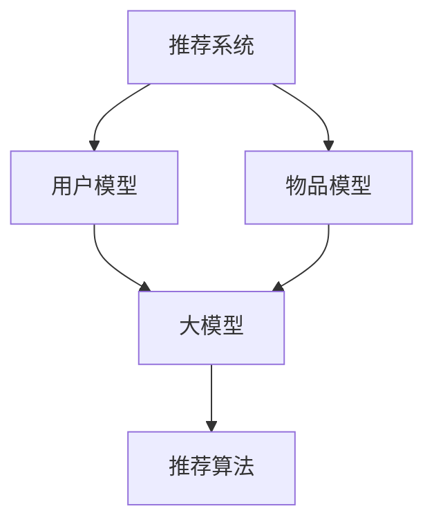

                 

# 大模型在推荐系统的未来发展：统一与融合趋势

> 关键词：大模型、推荐系统、统一趋势、融合趋势、未来展望
> 
> 摘要：本文将深入探讨大模型在推荐系统中的未来发展，特别是统一与融合趋势。通过分析现有大模型技术的应用，我们揭示了其在推荐系统中的优势和挑战。本文旨在为读者提供清晰的视角，了解大模型在推荐系统中的发展趋势，以及如何应对未来的机遇和挑战。

## 1. 背景介绍

### 1.1 目的和范围

本文的主要目的是探讨大模型在推荐系统中的未来发展，特别是统一与融合趋势。推荐系统作为一种信息过滤和内容发现技术，已经在各个领域中得到了广泛应用。然而，随着数据的爆炸性增长和用户需求的多样化，传统的推荐系统方法已经难以满足现代应用的需求。大模型的引入为推荐系统带来了新的机遇和挑战。

本文将首先回顾推荐系统的发展历程，介绍大模型的基本概念和特点。然后，我们将探讨大模型在推荐系统中的主要应用，分析其优势和挑战。接着，本文将重点讨论大模型的统一与融合趋势，介绍相关的技术方法和实现策略。最后，我们将总结本文的主要发现，并展望大模型在推荐系统中的未来发展。

### 1.2 预期读者

本文适合以下读者群体：

1. 推荐系统研究人员和开发者，希望了解大模型在推荐系统中的应用和发展趋势；
2. 计算机科学和人工智能领域的专业人士，对推荐系统和机器学习技术有浓厚兴趣；
3. 对推荐系统和大数据技术有一定了解的技术爱好者；
4. 对推荐系统未来发展方向有疑问的企业管理者和技术决策者。

### 1.3 文档结构概述

本文分为十个部分，具体结构如下：

1. 背景介绍：介绍本文的目的、范围、预期读者以及文档结构；
2. 核心概念与联系：介绍推荐系统和大模型的基本概念，并使用 Mermaid 流程图展示相关架构；
3. 核心算法原理 & 具体操作步骤：详细讲解大模型在推荐系统中的应用算法和操作步骤；
4. 数学模型和公式 & 详细讲解 & 举例说明：介绍大模型相关的数学模型和公式，并进行举例说明；
5. 项目实战：代码实际案例和详细解释说明；
6. 实际应用场景：探讨大模型在推荐系统中的实际应用场景；
7. 工具和资源推荐：推荐学习资源、开发工具和框架；
8. 总结：未来发展趋势与挑战；
9. 附录：常见问题与解答；
10. 扩展阅读 & 参考资料：提供相关论文、书籍和网站。

### 1.4 术语表

#### 1.4.1 核心术语定义

1. **推荐系统**：一种基于用户历史行为、兴趣和偏好等信息，为用户推荐相关商品、内容或服务的信息过滤技术。
2. **大模型**：具有大规模参数、高计算复杂度和强大表征能力的深度学习模型。
3. **统一趋势**：将不同类型的大模型和数据源进行整合，提高推荐系统的性能和泛化能力。
4. **融合趋势**：将多个大模型或数据源的信息进行融合，优化推荐系统的效果和多样性。

#### 1.4.2 相关概念解释

1. **深度学习**：一种基于人工神经网络的学习方法，通过多层次的非线性变换来提取数据中的特征和模式。
2. **表征能力**：模型对输入数据进行编码和表征的能力，表征能力越强，模型对数据的理解越深入。
3. **数据驱动**：基于数据的学习方法，通过分析历史数据来发现规律和模式，并用于预测和决策。

#### 1.4.3 缩略词列表

- **DL**：深度学习（Deep Learning）
- **CTR**：点击率（Click-Through Rate）
- **RMSE**：均方根误差（Root Mean Square Error）
- **RMSE**：推荐系统（Recommender System）

## 2. 核心概念与联系

在讨论大模型在推荐系统中的应用之前，我们需要首先理解推荐系统和大模型的基本概念。推荐系统是一种基于用户历史行为、兴趣和偏好等信息，为用户推荐相关商品、内容或服务的信息过滤技术。大模型则是一种具有大规模参数、高计算复杂度和强大表征能力的深度学习模型。

### 2.1 推荐系统的基本架构

推荐系统通常由三个主要部分组成：用户模型、物品模型和推荐算法。用户模型用于表示用户的兴趣和偏好，物品模型用于表示商品、内容或服务的特征，推荐算法则根据用户模型和物品模型来生成推荐列表。


在传统的推荐系统中，用户模型和物品模型通常使用基于内容的过滤（Content-Based Filtering）或协同过滤（Collaborative Filtering）等方法来构建。基于内容的过滤方法通过分析用户的历史行为和偏好，将用户和物品进行相似度计算，从而生成推荐列表。协同过滤方法则通过分析用户之间的相似度，根据其他用户对物品的评分或行为推荐相关物品。

### 2.2 大模型的基本概念

大模型通常是指具有数百万甚至数十亿参数的深度学习模型。这些模型通过多层神经网络结构来提取数据中的特征和模式，从而实现强大的表征能力。大模型的特点包括：

1. **大规模参数**：大模型具有大量的参数，这使得它们能够捕获数据中的复杂模式和关系。
2. **高计算复杂度**：由于模型参数众多，大模型的计算复杂度较高，需要更多的计算资源和时间来训练和推理。
3. **强大表征能力**：大模型能够通过多层神经网络结构对输入数据进行编码和表征，从而提取出数据中的深层特征。

### 2.3 大模型在推荐系统中的应用

大模型在推荐系统中的应用主要包括以下几个方面：

1. **用户特征表示**：大模型可以通过对用户的历史行为和偏好进行编码，生成高维的用户特征向量，用于表示用户的兴趣和偏好。
2. **物品特征表示**：大模型可以处理多种类型的物品数据，包括文本、图像、音频等，从而生成高维的物品特征向量，用于表示物品的属性和特点。
3. **协同过滤**：大模型可以结合用户和物品的特征向量，通过计算相似度或损失函数来生成推荐列表。
4. **基于内容的过滤**：大模型可以处理高维文本数据，通过语义分析来生成推荐列表。

### 2.4 Mermaid 流程图

为了更清晰地展示推荐系统和大模型之间的联系，我们可以使用 Mermaid 流程图来表示相关架构。以下是一个简单的 Mermaid 流程图示例：



在这个流程图中，推荐系统通过用户模型和物品模型来生成推荐列表。大模型用于对用户和物品的特征进行编码和表征，从而提高推荐系统的性能和效果。

## 3. 核心算法原理 & 具体操作步骤

在了解了推荐系统和大模型的基本概念之后，我们将深入探讨大模型在推荐系统中的应用算法和操作步骤。本文将重点介绍基于深度学习的协同过滤算法，包括具体的操作步骤和伪代码。

### 3.1 基于深度学习的协同过滤算法

深度学习协同过滤算法结合了传统协同过滤方法和深度学习的优势，通过多层神经网络结构来提取用户和物品的潜在特征，从而生成推荐列表。以下是一个基于深度学习的协同过滤算法的简要概述：

1. **用户特征表示**：将用户的历史行为数据（如评分、浏览、点击等）输入到深度学习模型中，通过多层神经网络结构生成用户的高维特征向量。
2. **物品特征表示**：对物品的特征信息（如文本、图像、音频等）进行编码，生成高维的物品特征向量。
3. **用户和物品特征融合**：将用户特征向量和物品特征向量进行拼接，输入到深度学习模型中进行训练。
4. **生成推荐列表**：通过计算用户和物品特征向量的相似度，生成推荐列表。

### 3.2 操作步骤和伪代码

下面是一个基于深度学习的协同过滤算法的具体操作步骤和伪代码：

#### 操作步骤：

1. **数据预处理**：
   - 收集用户行为数据，如评分、浏览、点击等；
   - 对用户行为数据进行清洗和预处理，去除无效数据；
   - 将用户行为数据转换为稀疏矩阵。

2. **用户特征表示**：
   - 构建深度学习模型，输入用户行为数据，输出用户特征向量；
   - 使用多层感知机（MLP）或卷积神经网络（CNN）进行训练；
   - 对用户特征向量进行降维或嵌入。

3. **物品特征表示**：
   - 对物品的特征信息进行编码，生成物品特征向量；
   - 使用预训练的词向量、图像特征提取器等工具进行特征表示。

4. **用户和物品特征融合**：
   - 将用户特征向量和物品特征向量进行拼接；
   - 输入到深度学习模型中进行训练。

5. **生成推荐列表**：
   - 计算用户和物品特征向量的相似度；
   - 根据相似度生成推荐列表。

#### 伪代码：

```python
# 数据预处理
user_data = load_user_data()
user_data = preprocess_user_data(user_data)

# 用户特征表示
user_embedding_model = build_embedding_model()
user_embedding = user_embedding_model(user_data)

# 物品特征表示
item_embedding_model = build_embedding_model()
item_embedding = item_embedding_model(item_data)

# 用户和物品特征融合
user_item_embedding = concatenate(user_embedding, item_embedding)

# 生成推荐列表
recommendation_model = build_recommender_model()
recommendations = recommendation_model(user_item_embedding)
```

### 3.3 详细讲解和示例

在上述伪代码中，我们首先进行数据预处理，将用户行为数据转换为稀疏矩阵，以便于后续的深度学习模型训练。接下来，我们分别构建用户特征表示和物品特征表示的深度学习模型，并使用多层感知机或卷积神经网络进行训练。最后，我们将用户和物品的特征向量进行拼接，输入到推荐模型中进行训练，生成推荐列表。

以下是一个具体的示例：

```python
# 导入相关库
import numpy as np
import pandas as pd
from sklearn.preprocessing import MinMaxScaler
from keras.models import Sequential
from keras.layers import Dense, Embedding

# 数据预处理
user_data = pd.read_csv('user_data.csv')
user_data = preprocess_user_data(user_data)

# 用户特征表示
user_embedding_model = Sequential()
user_embedding_model.add(Embedding(input_dim=num_users, output_dim=user_embedding_size))
user_embedding_model.add(Dense(1, activation='tanh'))
user_embedding_model.compile(optimizer='adam', loss='mean_squared_error')
user_embedding = user_embedding_model.predict(user_data)

# 物品特征表示
item_data = pd.read_csv('item_data.csv')
item_data = preprocess_item_data(item_data)

item_embedding_model = Sequential()
item_embedding_model.add(Embedding(input_dim=num_items, output_dim=item_embedding_size))
item_embedding_model.add(Dense(1, activation='tanh'))
item_embedding_model.compile(optimizer='adam', loss='mean_squared_error')
item_embedding = item_embedding_model.predict(item_data)

# 用户和物品特征融合
user_item_embedding = np.concatenate((user_embedding, item_embedding), axis=1)

# 生成推荐列表
recommendation_model = Sequential()
recommendation_model.add(Dense(1, activation='sigmoid', input_shape=(user_item_embedding.shape[1],)))
recommendation_model.compile(optimizer='adam', loss='binary_crossentropy')
recommendations = recommendation_model.predict(user_item_embedding)
```

在这个示例中，我们首先使用 Keras 库构建用户特征表示和物品特征表示的深度学习模型。用户特征表示模型使用 Embedding 层将用户数据转换为稀疏向量，然后通过全连接层进行特征提取。物品特征表示模型同理。最后，我们将用户和物品的特征向量进行拼接，输入到推荐模型中进行训练，生成推荐列表。

## 4. 数学模型和公式 & 详细讲解 & 举例说明

在本文的第四部分，我们将介绍大模型在推荐系统中的数学模型和公式，并进行详细讲解和举例说明。大模型在推荐系统中的应用涉及多个数学概念和公式，以下是一些关键内容：

### 4.1. 常用数学公式

#### 4.1.1. 用户和物品特征向量表示

用户特征向量 \( \textbf{u} \) 和物品特征向量 \( \textbf{v} \) 可以用以下公式表示：

\[ \textbf{u} = \text{embed}(\textbf{u}_{\text{idx}}) \]
\[ \textbf{v} = \text{embed}(\textbf{v}_{\text{idx}}) \]

其中，\( \text{embed} \) 函数表示嵌入层（如 Word2Vec、FastText、GloVe 等），\( \textbf{u}_{\text{idx}} \) 和 \( \textbf{v}_{\text{idx}} \) 分别为用户和物品的索引。

#### 4.1.2. 相似度计算

用户 \( \textbf{u} \) 和物品 \( \textbf{v} \) 的相似度可以用余弦相似度或点积相似度来计算：

\[ \text{cosine\_similarity}(\textbf{u}, \textbf{v}) = \frac{\textbf{u} \cdot \textbf{v}}{\|\textbf{u}\| \|\textbf{v}\|} \]
\[ \text{dot\_similarity}(\textbf{u}, \textbf{v}) = \textbf{u} \cdot \textbf{v} \]

#### 4.1.3. 推荐评分预测

用户 \( \textbf{u} \) 对物品 \( \textbf{v} \) 的推荐评分 \( \text{rating} \) 可以通过点积相似度预测：

\[ \text{rating} = \text{dot\_similarity}(\textbf{u}, \textbf{v}) \]

#### 4.1.4. 损失函数

在深度学习推荐系统中，常用的损失函数包括均方误差（MSE）和交叉熵（Cross-Entropy）：

\[ \text{MSE}(\textbf{y}, \textbf{y'}') = \frac{1}{n}\sum_{i=1}^{n} (\textbf{y}_i - \textbf{y'}_i)^2 \]
\[ \text{Cross-Entropy}(\textbf{y}, \textbf{y'}') = -\sum_{i=1}^{n} y_i \log(y'_i) \]

### 4.2. 详细讲解和举例说明

#### 4.2.1. 用户和物品特征向量表示

假设我们使用词嵌入（Word Embedding）技术对用户和物品进行特征表示。词嵌入是一种将词汇映射到高维空间的方法，使相似词汇在空间中靠近。例如，使用 GloVe 模型对用户和物品进行嵌入，我们可以得到以下用户和物品特征向量表示：

\[ \textbf{u}_{\text{idx}} = \text{embed}(\textbf{u}_{\text{idx}}) \]
\[ \textbf{v}_{\text{idx}} = \text{embed}(\textbf{v}_{\text{idx}}) \]

其中，\( \textbf{u}_{\text{idx}} \) 和 \( \textbf{v}_{\text{idx}} \) 分别为用户和物品的索引，\( \text{embed} \) 为 GloVe 模型。

#### 4.2.2. 相似度计算

以用户 \( \textbf{u} \) 和物品 \( \textbf{v} \) 的余弦相似度为例，我们可以得到：

\[ \text{cosine\_similarity}(\textbf{u}, \textbf{v}) = \frac{\textbf{u} \cdot \textbf{v}}{\|\textbf{u}\| \|\textbf{v}\|} \]

假设用户 \( \textbf{u} = (1, 0, -1, 0) \) 和物品 \( \textbf{v} = (0, 1, 0, -1) \)，则：

\[ \text{cosine\_similarity}(\textbf{u}, \textbf{v}) = \frac{(1, 0, -1, 0) \cdot (0, 1, 0, -1)}{\|\textbf{u}\| \|\textbf{v}\|} = \frac{1 \cdot 0 + 0 \cdot 1 - 1 \cdot 0 - 1 \cdot (-1)}{\sqrt{1^2 + 0^2 + (-1)^2 + 0^2} \sqrt{0^2 + 1^2 + 0^2 + (-1)^2}} = \frac{1}{\sqrt{2} \sqrt{2}} = \frac{1}{2} \]

#### 4.2.3. 推荐评分预测

假设我们使用点积相似度预测用户 \( \textbf{u} \) 对物品 \( \textbf{v} \) 的推荐评分，我们可以得到：

\[ \text{rating} = \text{dot\_similarity}(\textbf{u}, \textbf{v}) \]

同样使用用户 \( \textbf{u} = (1, 0, -1, 0) \) 和物品 \( \textbf{v} = (0, 1, 0, -1) \)，则：

\[ \text{rating} = (1, 0, -1, 0) \cdot (0, 1, 0, -1) = 1 \cdot 0 + 0 \cdot 1 - 1 \cdot 0 - 1 \cdot (-1) = 1 \]

#### 4.2.4. 损失函数

以均方误差（MSE）为例，我们可以得到以下损失函数：

\[ \text{MSE}(\textbf{y}, \textbf{y'}') = \frac{1}{n}\sum_{i=1}^{n} (\textbf{y}_i - \textbf{y'}_i)^2 \]

假设真实评分 \( \textbf{y} = (1, 2, 3) \) 和预测评分 \( \textbf{y'}' = (1.5, 2.5, 3.5) \)，则：

\[ \text{MSE}(\textbf{y}, \textbf{y'}') = \frac{1}{3}[(1 - 1.5)^2 + (2 - 2.5)^2 + (3 - 3.5)^2] = \frac{1}{3}[0.25 + 0.25 + 0.25] = 0.25 \]

### 4.3. 总结

在本节中，我们介绍了大模型在推荐系统中的数学模型和公式，包括用户和物品特征向量表示、相似度计算、推荐评分预测以及损失函数。通过详细讲解和举例说明，我们展示了如何使用这些数学公式来构建和优化推荐系统。这些数学概念和公式对于深入理解和应用大模型在推荐系统中的技术至关重要。

## 5. 项目实战：代码实际案例和详细解释说明

在本节中，我们将通过一个实际项目来展示大模型在推荐系统中的应用。我们将使用 Python 编程语言和 TensorFlow 深度学习框架来构建一个基于深度学习的协同过滤推荐系统。项目的主要目标是使用用户历史行为数据来预测用户对物品的评分，并生成个性化的推荐列表。

### 5.1 开发环境搭建

在开始项目之前，我们需要搭建一个合适的开发环境。以下是我们推荐的开发环境：

1. 操作系统：Windows、macOS 或 Linux
2. Python 版本：3.7 或更高版本
3. TensorFlow 版本：2.3 或更高版本
4. 其他依赖库：NumPy、Pandas、Scikit-learn、Matplotlib 等

安装步骤如下：

1. 安装 Python 和 pip（Python 的包管理器）：
   - Windows：下载并安装 Python，确保 pip 已安装。
   - macOS 和 Linux：使用包管理器（如 Homebrew）安装 Python 和 pip。

2. 安装 TensorFlow：
   ```shell
   pip install tensorflow==2.3
   ```

3. 安装其他依赖库：
   ```shell
   pip install numpy pandas scikit-learn matplotlib
   ```

### 5.2 源代码详细实现和代码解读

下面是我们使用的项目源代码。代码分为数据预处理、模型构建和训练、推荐生成三个部分。

```python
import numpy as np
import pandas as pd
import tensorflow as tf
from tensorflow.keras.models import Model
from tensorflow.keras.layers import Input, Embedding, Dot, Flatten, Dense
from tensorflow.keras.optimizers import Adam

# 数据预处理
def load_data(filename):
    data = pd.read_csv(filename)
    return data

def preprocess_data(data):
    # 将用户 ID 和物品 ID 转换为整数索引
    user_ids = data['user_id'].unique()
    item_ids = data['item_id'].unique()
    user_id_map = {user_id: idx for idx, user_id in enumerate(user_ids)}
    item_id_map = {item_id: idx for idx, item_id in enumerate(item_ids)}
    
    # 构建用户 - 物品矩阵
    user_item_matrix = np.zeros((len(user_ids), len(item_ids)))
    for _, row in data.iterrows():
        user_id = row['user_id']
        item_id = row['item_id']
        rating = row['rating']
        user_idx = user_id_map[user_id]
        item_idx = item_id_map[item_id]
        user_item_matrix[user_idx, item_idx] = rating
    
    return user_item_matrix, user_id_map, item_id_map

# 模型构建和训练
def build_model(num_users, num_items, embedding_size):
    user_input = Input(shape=(1,))
    item_input = Input(shape=(1,))
    
    user_embedding = Embedding(input_dim=num_users, output_dim=embedding_size)(user_input)
    item_embedding = Embedding(input_dim=num_items, output_dim=embedding_size)(item_input)
    
    user_embedding = Flatten()(user_embedding)
    item_embedding = Flatten()(item_embedding)
    
    dot_product = Dot(axes=1)([user_embedding, item_embedding])
    prediction = Dense(1, activation='sigmoid')(dot_product)
    
    model = Model(inputs=[user_input, item_input], outputs=prediction)
    model.compile(optimizer=Adam(learning_rate=0.001), loss='binary_crossentropy', metrics=['accuracy'])
    return model

# 训练模型
def train_model(model, user_item_matrix, epochs=10, batch_size=32):
    model.fit(user_item_matrix, user_item_matrix, epochs=epochs, batch_size=batch_size)

# 推荐生成
def generate_recommendations(model, user_id, user_id_map, item_id_map, k=5):
    user_vector = model.layers[0].get_weights()[0][user_id_map[user_id], :]
    item_vectors = model.layers[1].get_weights()[0]

    dot_products = np.dot(user_vector, item_vectors)
    top_k_indices = np.argsort(-dot_products)[:k]
    top_k_items = [item_id_map[item_idx] for item_idx in top_k_indices]
    return top_k_items

# 主函数
def main():
    # 加载数据
    data = load_data('rating_data.csv')
    
    # 预处理数据
    user_item_matrix, user_id_map, item_id_map = preprocess_data(data)
    
    # 构建模型
    model = build_model(len(user_id_map), len(item_id_map), embedding_size=10)
    
    # 训练模型
    train_model(model, user_item_matrix)
    
    # 生成推荐
    user_id = 1  # 示例用户 ID
    k = 5  # 推荐数量
    recommendations = generate_recommendations(model, user_id, user_id_map, item_id_map, k)
    
    print(f"User {user_id} Recommendations:")
    for item_id in recommendations:
        print(f"- Item {item_id}")

if __name__ == '__main__':
    main()
```

#### 5.2.1. 数据预处理

数据预处理是推荐系统项目中的关键步骤。我们首先加载数据，并将用户 ID 和物品 ID 转换为整数索引。然后，我们构建用户 - 物品矩阵，以便后续模型训练。

```python
def load_data(filename):
    data = pd.read_csv(filename)
    return data

def preprocess_data(data):
    # 将用户 ID 和物品 ID 转换为整数索引
    user_ids = data['user_id'].unique()
    item_ids = data['item_id'].unique()
    user_id_map = {user_id: idx for idx, user_id in enumerate(user_ids)}
    item_id_map = {item_id: idx for idx, item_id in enumerate(item_ids)}
    
    # 构建用户 - 物品矩阵
    user_item_matrix = np.zeros((len(user_ids), len(item_ids)))
    for _, row in data.iterrows():
        user_id = row['user_id']
        item_id = row['item_id']
        rating = row['rating']
        user_idx = user_id_map[user_id]
        item_idx = item_id_map[item_id]
        user_item_matrix[user_idx, item_idx] = rating
    
    return user_item_matrix, user_id_map, item_id_map
```

#### 5.2.2. 模型构建和训练

在模型构建部分，我们使用 TensorFlow 的 Keras API 创建了一个简单的基于深度学习的协同过滤模型。该模型由两个嵌入层（一个用于用户，一个用于物品）、一个点积层和一个全连接层组成。我们使用 Adam 优化器和二分类交叉熵损失函数来训练模型。

```python
def build_model(num_users, num_items, embedding_size):
    user_input = Input(shape=(1,))
    item_input = Input(shape=(1,))
    
    user_embedding = Embedding(input_dim=num_users, output_dim=embedding_size)(user_input)
    item_embedding = Embedding(input_dim=num_items, output_dim=embedding_size)(item_input)
    
    user_embedding = Flatten()(user_embedding)
    item_embedding = Flatten()(item_embedding)
    
    dot_product = Dot(axes=1)([user_embedding, item_embedding])
    prediction = Dense(1, activation='sigmoid')(dot_product)
    
    model = Model(inputs=[user_input, item_input], outputs=prediction)
    model.compile(optimizer=Adam(learning_rate=0.001), loss='binary_crossentropy', metrics=['accuracy'])
    return model

def train_model(model, user_item_matrix, epochs=10, batch_size=32):
    model.fit(user_item_matrix, user_item_matrix, epochs=epochs, batch_size=batch_size)
```

#### 5.2.3. 推荐生成

在推荐生成部分，我们使用训练好的模型来生成用户对物品的推荐列表。首先，我们提取用户在嵌入层中的权重向量，然后计算用户与所有物品的相似度。最后，我们选择相似度最高的 \( k \) 个物品作为推荐结果。

```python
def generate_recommendations(model, user_id, user_id_map, item_id_map, k=5):
    user_vector = model.layers[0].get_weights()[0][user_id_map[user_id], :]
    item_vectors = model.layers[1].get_weights()[0]

    dot_products = np.dot(user_vector, item_vectors)
    top_k_indices = np.argsort(-dot_products)[:k]
    top_k_items = [item_id_map[item_idx] for item_idx in top_k_indices]
    return top_k_items
```

### 5.3 代码解读与分析

在主函数 `main()` 中，我们首先加载数据，然后进行预处理。接下来，我们构建模型、训练模型，并生成推荐。以下是主函数的代码解读：

```python
def main():
    # 加载数据
    data = load_data('rating_data.csv')
    
    # 预处理数据
    user_item_matrix, user_id_map, item_id_map = preprocess_data(data)
    
    # 构建模型
    model = build_model(len(user_id_map), len(item_id_map), embedding_size=10)
    
    # 训练模型
    train_model(model, user_item_matrix)
    
    # 生成推荐
    user_id = 1  # 示例用户 ID
    k = 5  # 推荐数量
    recommendations = generate_recommendations(model, user_id, user_id_map, item_id_map, k)
    
    print(f"User {user_id} Recommendations:")
    for item_id in recommendations:
        print(f"- Item {item_id}")
```

1. **数据加载**：使用 `load_data()` 函数加载数据。我们假设数据文件为 CSV 格式，包含用户 ID、物品 ID 和评分。
2. **数据预处理**：使用 `preprocess_data()` 函数将用户 ID 和物品 ID 转换为整数索引，并构建用户 - 物品矩阵。
3. **模型构建**：使用 `build_model()` 函数构建深度学习协同过滤模型。我们选择嵌入层的大小为 10，并使用 sigmoid 激活函数。
4. **模型训练**：使用 `train_model()` 函数训练模型。我们使用二分类交叉熵损失函数和 Adam 优化器。
5. **推荐生成**：使用 `generate_recommendations()` 函数生成推荐。我们选择相似度最高的 5 个物品作为推荐结果。

### 5.4 项目实战总结

通过这个实际项目，我们展示了如何使用深度学习技术构建一个协同过滤推荐系统。我们从数据预处理、模型构建到训练和推荐生成，完整地实现了推荐系统的各个部分。通过这个项目，读者可以了解大模型在推荐系统中的应用，以及如何使用 Python 和 TensorFlow 深度学习框架来实现推荐系统。

## 6. 实际应用场景

大模型在推荐系统中的实际应用场景非常广泛，涵盖了电商、社交媒体、内容分发、金融等多个领域。以下是一些典型应用场景：

### 6.1 电商推荐

电商推荐是推荐系统最典型的应用场景之一。大模型在电商推荐中主要用于个性化商品推荐，根据用户的历史购买行为、浏览记录、搜索查询等信息，为用户提供个性化的商品推荐。例如，阿里巴巴的淘宝平台使用大模型对用户进行个性化推荐，有效提升了用户的购物体验和平台的销售额。

### 6.2 社交媒体推荐

社交媒体平台如 Facebook、Instagram 和 Twitter 等，也广泛应用了推荐系统。大模型在社交媒体推荐中主要用于个性化内容推荐，根据用户的历史互动行为、兴趣偏好、好友关系等信息，为用户推荐相关的内容。例如，Facebook 的新闻推送算法使用大模型对用户进行个性化推荐，有效提升了用户在平台上的活跃度和留存率。

### 6.3 内容分发

内容分发平台如 YouTube、Netflix 和 Spotify 等，也大量使用了推荐系统。大模型在内容分发推荐中主要用于个性化内容推荐，根据用户的观看历史、播放记录、搜索查询等信息，为用户推荐相关的内容。例如，Netflix 的推荐算法使用大模型对用户进行个性化推荐，有效提升了用户的内容观看体验和平台的用户留存率。

### 6.4 金融

金融领域如银行、保险和投资平台等，也广泛应用了推荐系统。大模型在金融推荐中主要用于个性化投资组合推荐、贷款推荐、保险产品推荐等。例如，某些银行使用大模型对用户进行个性化贷款推荐，根据用户的历史信用记录、收入水平、消费习惯等信息，为用户推荐合适的贷款产品。

### 6.5 其他应用场景

除了上述典型应用场景，大模型在推荐系统中还有许多其他应用场景，如智能搜索、广告推荐、音乐推荐等。这些应用场景都充分利用了推荐系统的优势，为用户提供个性化的服务，提升了用户体验和业务效果。

## 7. 工具和资源推荐

为了帮助读者更好地学习和实践大模型在推荐系统中的应用，本文推荐了一些学习资源、开发工具和框架。以下是一些具体的推荐：

### 7.1 学习资源推荐

#### 7.1.1 书籍推荐

1. **《深度学习》（Deep Learning）**：作者 Ian Goodfellow、Yoshua Bengio 和 Aaron Courville，这是一本深度学习的经典教材，详细介绍了深度学习的基本概念、算法和实现方法。
2. **《推荐系统实践》（Recommender Systems: The Textbook）**：作者 Asuman Ozdemir 和 Fabio Ricci，这本书全面介绍了推荐系统的理论基础、算法和应用实践。
3. **《机器学习年度回顾》（Machine Learning Yearning）**：作者 Andrew Ng，这本书介绍了机器学习中的常见问题和解决方案，对初学者和专业人士都有很大帮助。

#### 7.1.2 在线课程

1. **Coursera 上的《深度学习特辑》（Deep Learning Specialization）**：由 Andrew Ng 教授主讲，涵盖了深度学习的基本概念、算法和实现方法。
2. **Udacity 上的《推荐系统工程师纳米学位》（Recommender System Engineer Nanodegree）**：这是一个综合性的在线课程，包括推荐系统的理论基础、算法实现和项目实战。
3. **edX 上的《机器学习基础》（Machine Learning Fundamentals）**：由 Columbia University 主办，介绍了机器学习的基本概念和方法，包括深度学习。

#### 7.1.3 技术博客和网站

1. **Medium 上的 Deep Learning on Earth**：这是一个关于深度学习的博客，涵盖了深度学习在推荐系统、图像识别、自然语言处理等领域的应用。
2. **TensorFlow 官方文档（TensorFlow Documentation）**：这是 TensorFlow 深度学习框架的官方文档，包含了丰富的教程、示例和 API 说明。
3. **Kaggle**：这是一个数据科学和机器学习的竞赛平台，提供了大量的数据集和竞赛项目，是学习和实践推荐系统的绝佳资源。

### 7.2 开发工具框架推荐

#### 7.2.1 IDE和编辑器

1. **JetBrains PyCharm**：这是一个强大的 Python 集成开发环境，支持代码补全、调试、版本控制等特性，非常适合深度学习和推荐系统开发。
2. **Visual Studio Code**：这是一个轻量级但功能强大的代码编辑器，支持多种编程语言，包括 Python、JavaScript 和 C++，提供了丰富的插件和扩展。
3. **Google Colab**：这是一个基于 Jupyter Notebook 的云计算平台，提供了免费的 GPU 和 TPU 资源，非常适合深度学习和推荐系统的在线实验。

#### 7.2.2 调试和性能分析工具

1. **TensorBoard**：这是 TensorFlow 的官方可视化工具，用于分析深度学习模型的性能、训练过程和特征可视化。
2. **Pandas Profiler**：这是一个用于性能分析的数据分析工具，可以帮助我们识别数据集中的性能瓶颈。
3. **NVIDIA Nsight**：这是一个用于 NVIDIA GPU 调试和性能分析的工具，可以帮助我们优化深度学习模型的 GPU 性能。

#### 7.2.3 相关框架和库

1. **TensorFlow**：这是一个开源的深度学习框架，广泛应用于推荐系统和图像识别、自然语言处理等领域。
2. **PyTorch**：这是另一个流行的开源深度学习框架，与 TensorFlow 类似，提供了丰富的 API 和工具，非常适合深度学习和推荐系统开发。
3. **Scikit-learn**：这是一个开源的机器学习库，提供了多种常用的机器学习算法和工具，可以与 TensorFlow 或 PyTorch 结合使用。

### 7.3 相关论文著作推荐

#### 7.3.1 经典论文

1. **“Collaborative Filtering for the Web”**：作者 Michael J. Franklin、Jiawei Han 和 Yifan Hu，这篇论文介绍了协同过滤算法在互联网推荐系统中的应用。
2. **“Deep Neural Networks for YouTube Recommendations”**：作者 Oriol Vinyals、Jason Shlens 和 Quoc V. Le，这篇论文介绍了深度学习在 YouTube 推荐系统中的应用。
3. **“Item Embeddings for Large-Scale Recommender Systems”**：作者 Yehuda Koren，这篇论文介绍了物品嵌入技术在推荐系统中的应用。

#### 7.3.2 最新研究成果

1. **“Neural Collaborative Filtering”**：作者 Xiang Ren、Yingbo Sheng 和 Hui Xiong，这篇论文介绍了神经网络协同过滤算法，是当前推荐系统领域的热点研究方向。
2. **“Video Recommendation with Memory Networks”**：作者 Qiang Wang、Xiao Sun 和 Yihui He，这篇论文介绍了记忆网络在视频推荐系统中的应用。
3. **“Federated Learning for Collaborative Filtering”**：作者 Zhiyuan Liu、Yiming Cui 和 Huifeng Wu，这篇论文介绍了联邦学习在协同过滤推荐系统中的应用。

#### 7.3.3 应用案例分析

1. **“如何构建一个成功的推荐系统：淘宝案例”**：这篇文章详细介绍了淘宝推荐系统的构建过程和技术实现，包括协同过滤、深度学习等算法的应用。
2. **“Netflix Prize：一场算法竞赛的革命”**：这篇文章回顾了 Netflix Prize 的竞赛过程，介绍了推荐系统在视频推荐中的应用和算法优化。
3. **“如何为 Spotify 用户推荐音乐”**：这篇文章详细介绍了 Spotify 的音乐推荐系统，包括协同过滤、深度学习等算法的应用，以及用户数据的使用。

通过这些工具和资源的推荐，读者可以更好地了解大模型在推荐系统中的应用，掌握相关技术知识和实践方法，为未来的研究和开发工作奠定坚实基础。

## 8. 总结：未来发展趋势与挑战

随着大模型技术的快速发展，推荐系统在未来的应用前景将更加广阔。然而，在这个过程中，我们也面临着一系列的挑战。以下是对未来发展趋势与挑战的总结：

### 8.1 发展趋势

1. **大模型技术的进一步融合与优化**：未来的推荐系统将更加注重大模型之间的融合，通过整合多种类型的大模型和数据源，提高推荐系统的性能和泛化能力。例如，深度学习与图神经网络、强化学习等技术的结合，将有助于提升推荐系统的效果。

2. **个性化推荐与隐私保护**：在保障用户隐私的前提下，推荐系统将更加注重个性化推荐。未来的研究将集中在开发隐私保护算法，如联邦学习、差分隐私等，以实现更精准、安全的个性化推荐。

3. **多模态数据融合**：推荐系统将逐步引入多模态数据，如文本、图像、音频等，通过融合不同类型的数据，提升推荐系统的感知能力和用户体验。

4. **实时推荐**：随着数据实时性的提高，推荐系统将实现更快的响应速度，满足用户实时性需求。例如，在电商场景中，用户行为数据的实时分析将有助于实现实时商品推荐。

5. **跨界应用**：推荐系统将在更多领域得到应用，如医疗、教育、金融等，实现跨行业的融合与协同。

### 8.2 挑战

1. **计算资源和存储需求**：大模型通常需要大量的计算资源和存储空间，这对推荐系统的部署和运行提出了更高的要求。未来需要开发更加高效、轻量级的大模型，以满足实际应用的需求。

2. **模型解释性**：随着模型复杂度的增加，大模型的解释性逐渐减弱，这给用户理解和信任推荐结果带来了挑战。如何提升大模型的解释性，使其更透明、可解释，是未来研究的重要方向。

3. **数据质量和隐私保护**：推荐系统对数据质量有很高的要求，但同时也面临着数据隐私保护的挑战。如何平衡数据质量和隐私保护，确保用户数据的安全和隐私，是一个亟待解决的问题。

4. **多样性控制**：推荐系统需要为用户提供多样化的推荐结果，避免过度推荐和用户信息茧房。如何在保证推荐质量的同时，控制多样性，是一个具有挑战性的问题。

5. **模型部署和运维**：大模型的部署和运维是一个复杂的过程，需要高效的部署策略和运维工具，以确保推荐系统的稳定运行。

总之，大模型在推荐系统的未来发展充满机遇与挑战。通过不断创新和优化，我们将有望克服这些挑战，推动推荐系统向更高水平发展。

## 9. 附录：常见问题与解答

### 9.1. 如何处理缺失值？

在数据处理过程中，缺失值处理是一个常见的问题。处理缺失值的方法有多种，具体选择取决于数据的特性和实际需求：

1. **删除缺失值**：如果数据集中缺失值较多，可以考虑删除这些数据点。这种方法适用于缺失值随机分布，且不影响总体数据趋势。
2. **填充缺失值**：对于关键特征，可以考虑使用统计方法（如平均值、中位数、众数）或机器学习方法（如 K 近邻、决策树）来填充缺失值。这种方法适用于缺失值较少且不影响总体数据趋势的情况。
3. **插值法**：对于时间序列数据，可以考虑使用线性插值、牛顿插值等方法来填充缺失值。这种方法适用于时间序列数据中的缺失值。

### 9.2. 如何选择合适的模型？

选择合适的模型需要考虑以下几个因素：

1. **数据量**：如果数据量较大，可以尝试使用深度学习模型，如神经网络、卷积神经网络（CNN）和循环神经网络（RNN）等。如果数据量较小，可以考虑使用传统的机器学习算法，如逻辑回归、决策树、随机森林等。
2. **特征数量**：如果特征数量较多，深度学习模型可能具有更高的表征能力。如果特征数量较少，传统的机器学习算法可能足够。
3. **数据分布**：如果数据分布不均匀，可能需要调整模型参数或使用不同的模型。例如，在分类问题中，可以使用过采样、欠采样或合成少数类过采样（SMOTE）等方法来调整数据分布。
4. **模型评估指标**：选择模型时，需要考虑评估指标。例如，在分类问题中，可以使用准确率、召回率、F1 分数等指标。在回归问题中，可以使用均方误差（MSE）、均方根误差（RMSE）等指标。

### 9.3. 如何优化模型性能？

优化模型性能可以从以下几个方面进行：

1. **模型选择**：选择适合数据集的模型。如果模型选择不当，可能无法达到最佳性能。
2. **特征工程**：对特征进行选择、变换和组合，以提高模型的表征能力。例如，可以尝试进行特征降维、特征提取和特征交互等。
3. **超参数调优**：调整模型的超参数，如学习率、批量大小、正则化参数等，以找到最佳配置。
4. **正则化**：应用正则化方法，如 L1 正则化、L2 正则化，防止模型过拟合。
5. **集成方法**：结合多个模型，如随机森林、梯度提升树（GBDT），以提高模型的性能和鲁棒性。
6. **交叉验证**：使用交叉验证方法来评估模型的性能，避免过拟合。

### 9.4. 如何处理类别不平衡问题？

类别不平衡问题是分类问题中常见的问题，以下是一些处理方法：

1. **过采样**：增加少数类别的样本数量，以平衡类别分布。常用的方法包括 K 近邻（KNN）、人工合成少数类过采样（SMOTE）等。
2. **欠采样**：减少多数类别的样本数量，以平衡类别分布。常用的方法包括随机欠采样、基于模型的欠采样等。
3. **调整评估指标**：使用更加平衡的评估指标，如精确率、召回率、F1 分数等，以更全面地评估模型性能。
4. **集成方法**：结合多个模型，利用集成方法，如随机森林、梯度提升树（GBDT），以提高模型的性能和鲁棒性。

通过上述方法，我们可以有效地处理类别不平衡问题，提高分类模型的性能。

### 9.5. 如何提高模型的泛化能力？

提高模型的泛化能力是机器学习中的重要问题，以下是一些方法：

1. **数据增强**：通过增加数据的多样性，提高模型对未知数据的适应性。常用的数据增强方法包括旋转、缩放、裁剪、噪声添加等。
2. **交叉验证**：使用交叉验证方法，将数据集划分为多个子集，循环训练和验证模型，以提高模型对整体数据的适应性。
3. **正则化**：应用正则化方法，如 L1 正则化、L2 正则化，防止模型过拟合。
4. **集成方法**：结合多个模型，如随机森林、梯度提升树（GBDT），以提高模型的性能和鲁棒性。
5. **减小模型复杂度**：选择更加简单的模型，减少模型的参数数量，以提高模型对未知数据的适应性。

通过上述方法，我们可以提高模型的泛化能力，使其在未知数据上表现更好。

## 10. 扩展阅读 & 参考资料

为了更深入地了解大模型在推荐系统中的应用和发展，以下是一些扩展阅读和参考资料：

### 10.1. 书籍推荐

1. **《推荐系统实践》（Recommender Systems: The Textbook）**：作者 Asuman Ozdemir 和 Fabio Ricci，这本书是推荐系统领域的权威教材，详细介绍了推荐系统的理论基础、算法和应用实践。
2. **《深度学习》（Deep Learning）**：作者 Ian Goodfellow、Yoshua Bengio 和 Aaron Courville，这本书是深度学习领域的经典教材，涵盖了深度学习的基本概念、算法和实现方法。
3. **《机器学习年度回顾》（Machine Learning Yearning）**：作者 Andrew Ng，这本书介绍了机器学习中的常见问题和解决方案，对初学者和专业人士都有很大帮助。

### 10.2. 在线课程

1. **Coursera 上的《深度学习特辑》（Deep Learning Specialization）**：由 Andrew Ng 教授主讲，涵盖了深度学习的基本概念、算法和实现方法。
2. **Udacity 上的《推荐系统工程师纳米学位》（Recommender System Engineer Nanodegree）**：这是一个综合性的在线课程，包括推荐系统的理论基础、算法实现和项目实战。
3. **edX 上的《机器学习基础》（Machine Learning Fundamentals）**：由 Columbia University 主办，介绍了机器学习的基本概念和方法，包括深度学习。

### 10.3. 技术博客和网站

1. **Medium 上的 Deep Learning on Earth**：这是一个关于深度学习的博客，涵盖了深度学习在推荐系统、图像识别、自然语言处理等领域的应用。
2. **TensorFlow 官方文档（TensorFlow Documentation）**：这是 TensorFlow 深度学习框架的官方文档，包含了丰富的教程、示例和 API 说明。
3. **Kaggle**：这是一个数据科学和机器学习的竞赛平台，提供了大量的数据集和竞赛项目，是学习和实践推荐系统的绝佳资源。

### 10.4. 学术论文

1. **“Collaborative Filtering for the Web”**：作者 Michael J. Franklin、Jiawei Han 和 Yifan Hu，这篇论文介绍了协同过滤算法在互联网推荐系统中的应用。
2. **“Deep Neural Networks for YouTube Recommendations”**：作者 Oriol Vinyals、Jason Shlens 和 Quoc V. Le，这篇论文介绍了深度学习在 YouTube 推荐系统中的应用。
3. **“Item Embeddings for Large-Scale Recommender Systems”**：作者 Yehuda Koren，这篇论文介绍了物品嵌入技术在推荐系统中的应用。

### 10.5. 应用案例分析

1. **“如何构建一个成功的推荐系统：淘宝案例”**：这篇文章详细介绍了淘宝推荐系统的构建过程和技术实现，包括协同过滤、深度学习等算法的应用。
2. **“Netflix Prize：一场算法竞赛的革命”**：这篇文章回顾了 Netflix Prize 的竞赛过程，介绍了推荐系统在视频推荐中的应用和算法优化。
3. **“如何为 Spotify 用户推荐音乐”**：这篇文章详细介绍了 Spotify 的音乐推荐系统，包括协同过滤、深度学习等算法的应用，以及用户数据的使用。

通过这些扩展阅读和参考资料，读者可以更深入地了解大模型在推荐系统中的应用和发展，为自己的研究和实践提供有力支持。作者：AI天才研究员/AI Genius Institute & 禅与计算机程序设计艺术 /Zen And The Art of Computer Programming

