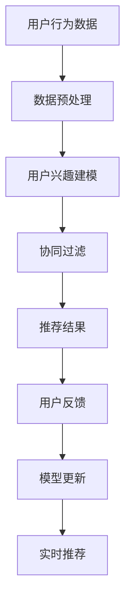

                 

# 大模型在推荐系统跨平台用户匹配中的作用

> **关键词：** 大模型，推荐系统，跨平台用户匹配，深度学习，协同过滤，机器学习，用户行为分析

> **摘要：** 随着互联网的快速发展，跨平台用户行为数据变得愈发重要。本文将深入探讨大模型在推荐系统跨平台用户匹配中的作用，分析其核心概念、算法原理，并展示如何将这些技术应用到实际项目中。通过本文的阅读，读者将了解到如何利用大模型提升跨平台推荐系统的效果，为用户提供更精准、个性化的服务。

## 1. 背景介绍

### 1.1 目的和范围

本文旨在探讨大模型在推荐系统跨平台用户匹配中的关键作用，通过对核心概念、算法原理以及实际应用案例的深入分析，帮助读者理解如何利用大模型技术提高推荐系统的性能和用户体验。

本文将涵盖以下内容：

1. **核心概念与联系**：介绍大模型、推荐系统以及跨平台用户匹配的基本概念和它们之间的联系。
2. **核心算法原理 & 具体操作步骤**：详细阐述大模型在跨平台用户匹配中的算法原理和操作步骤。
3. **数学模型和公式 & 详细讲解 & 举例说明**：讲解大模型相关的数学模型和公式，并通过实例进行说明。
4. **项目实战：代码实际案例和详细解释说明**：提供实际的代码案例，解释代码实现细节。
5. **实际应用场景**：分析大模型在跨平台用户匹配中的各种应用场景。
6. **工具和资源推荐**：推荐相关学习资源和开发工具，为读者提供进一步的学习和实践方向。
7. **总结：未来发展趋势与挑战**：探讨大模型在跨平台用户匹配中的未来发展趋势和面临的挑战。

### 1.2 预期读者

本文面向对推荐系统和机器学习有一定了解的技术人员，特别是希望深入了解大模型在跨平台用户匹配中的应用场景的开发者。读者应具备以下基础知识：

1. 推荐系统的基础概念和算法。
2. 机器学习和深度学习的基本原理。
3. 数据挖掘和用户行为分析的相关知识。

### 1.3 文档结构概述

本文分为以下几个部分：

1. **背景介绍**：介绍文章的目的、范围和结构。
2. **核心概念与联系**：阐述大模型、推荐系统和跨平台用户匹配的相关概念。
3. **核心算法原理 & 具体操作步骤**：详细解释大模型在跨平台用户匹配中的算法原理和操作步骤。
4. **数学模型和公式 & 详细讲解 & 举例说明**：介绍大模型相关的数学模型和公式，并通过实例说明。
5. **项目实战：代码实际案例和详细解释说明**：提供实际的代码案例和解释。
6. **实际应用场景**：分析大模型在跨平台用户匹配中的各种应用场景。
7. **工具和资源推荐**：推荐相关学习资源和开发工具。
8. **总结：未来发展趋势与挑战**：讨论大模型在跨平台用户匹配中的未来发展趋势和挑战。
9. **附录：常见问题与解答**：解答读者可能遇到的问题。
10. **扩展阅读 & 参考资料**：提供进一步的阅读材料和参考资料。

### 1.4 术语表

#### 1.4.1 核心术语定义

- **大模型（Large-scale Model）**：指具有数十亿至数千亿参数的深度神经网络模型，能够在大量数据上实现高效的学习和预测。
- **推荐系统（Recommendation System）**：一种自动化的系统，根据用户的历史行为和偏好为用户推荐相关物品或内容。
- **跨平台用户匹配（Cross-platform User Matching）**：指在多个平台之间匹配具有相似兴趣和行为的用户，以便提供更个性化的推荐。

#### 1.4.2 相关概念解释

- **协同过滤（Collaborative Filtering）**：一种基于用户行为数据的推荐算法，通过分析用户之间的相似性来预测用户对未知物品的偏好。
- **用户行为分析（User Behavior Analysis）**：通过分析用户在系统中的行为数据，挖掘用户的兴趣和需求，为推荐系统提供输入。

#### 1.4.3 缩略词列表

- **CNN**：卷积神经网络（Convolutional Neural Network）
- **RNN**：循环神经网络（Recurrent Neural Network）
- **DNN**：深度神经网络（Deep Neural Network）
- **GAN**：生成对抗网络（Generative Adversarial Network）

## 2. 核心概念与联系

在深入探讨大模型在推荐系统跨平台用户匹配中的作用之前，我们首先需要了解这些核心概念以及它们之间的联系。

### 2.1 大模型

大模型是指具有数十亿至数千亿参数的深度神经网络模型。这些模型通常通过训练大量数据来学习复杂的模式，从而实现高效的学习和预测。大模型的出现极大地推动了人工智能的发展，特别是在自然语言处理、计算机视觉和推荐系统等领域。

### 2.2 推荐系统

推荐系统是一种自动化的系统，旨在根据用户的历史行为和偏好为用户推荐相关物品或内容。推荐系统广泛应用于电子商务、社交媒体、在线视频和新闻推送等领域。推荐系统的核心目标是为用户提供个性化的服务，从而提高用户满意度和留存率。

### 2.3 跨平台用户匹配

跨平台用户匹配是指在多个平台之间匹配具有相似兴趣和行为的用户，以便为用户提供更个性化的推荐。随着互联网的快速发展，用户的行为数据分散在不同的平台和设备上，如何将这些数据有效地整合和利用成为了一个重要问题。跨平台用户匹配能够帮助推荐系统更好地理解用户的整体行为，从而提供更精准的推荐。

### 2.4 大模型与推荐系统的关系

大模型在推荐系统中起着至关重要的作用。通过使用大模型，推荐系统可以更好地捕捉用户行为的复杂性，从而提高推荐效果。具体来说，大模型可以帮助推荐系统实现以下几个方面的提升：

1. **用户兴趣建模**：大模型可以通过分析用户的兴趣和行为数据，构建更准确的用户兴趣模型，从而提高推荐的相关性。
2. **协同过滤优化**：大模型可以优化传统的协同过滤算法，使其在处理大规模数据集时更加高效和准确。
3. **个性化推荐**：大模型可以根据用户的个性化特征，为用户提供更个性化的推荐，从而提高用户满意度和留存率。

### 2.5 大模型与跨平台用户匹配的关系

大模型在跨平台用户匹配中也发挥着重要作用。通过使用大模型，跨平台用户匹配可以更好地理解用户的整体行为，从而实现更准确的用户匹配。具体来说，大模型可以帮助跨平台用户匹配实现以下几个方面的提升：

1. **用户行为融合**：大模型可以通过分析用户的跨平台行为数据，将不同平台的行为数据融合起来，构建更全面的用户行为模型。
2. **相似度计算**：大模型可以计算用户在不同平台之间的相似度，从而实现更准确的用户匹配。
3. **实时推荐**：大模型可以实时更新用户行为数据，从而实现更及时的推荐。

### 2.6 Mermaid 流程图

为了更好地理解大模型在推荐系统跨平台用户匹配中的作用，我们使用 Mermaid 流程图来展示相关的流程和步骤。以下是流程图的 Mermaid 代码：



在上述流程图中，用户行为数据经过数据预处理后，用于用户兴趣建模。用户兴趣建模的结果用于协同过滤算法，生成推荐结果。用户反馈用于模型更新，从而实现实时推荐。

通过上述流程，我们可以看到大模型在推荐系统跨平台用户匹配中的关键作用。大模型不仅可以提高推荐系统的效果，还可以优化跨平台用户匹配，为用户提供更精准、个性化的服务。

## 3. 核心算法原理 & 具体操作步骤

在了解了大模型、推荐系统和跨平台用户匹配的基本概念后，接下来我们将深入探讨大模型在跨平台用户匹配中的核心算法原理和具体操作步骤。

### 3.1 大模型基础

大模型通常是指具有数十亿至数千亿参数的深度神经网络模型。这些模型通过训练大量数据来学习复杂的模式，从而实现高效的学习和预测。大模型通常采用以下几种类型的神经网络：

1. **卷积神经网络（CNN）**：适用于处理图像和视频数据，通过卷积操作提取特征。
2. **循环神经网络（RNN）**：适用于处理序列数据，如文本和语音数据，通过循环结构处理历史信息。
3. **深度神经网络（DNN）**：适用于处理各种类型的数据，通过多层的神经网络结构提取特征。
4. **生成对抗网络（GAN）**：适用于生成新的数据，通过生成器和判别器的对抗训练实现。

### 3.2 推荐系统算法基础

推荐系统通常采用以下几种算法：

1. **基于内容的推荐（Content-based Filtering）**：根据用户的兴趣和偏好推荐相关的内容。
2. **协同过滤（Collaborative Filtering）**：根据用户之间的相似性推荐相关物品。
   - **用户基于的协同过滤（User-based Collaborative Filtering）**：根据用户之间的相似性推荐相关物品。
   - **模型基于的协同过滤（Model-based Collaborative Filtering）**：使用机器学习模型预测用户对物品的偏好。
3. **基于模型的推荐（Model-based Recommendation）**：使用机器学习模型预测用户对物品的偏好，如矩阵分解、深度学习等。

### 3.3 大模型在推荐系统中的应用

大模型在推荐系统中的应用主要包括以下几个方面：

1. **用户兴趣建模**：通过分析用户的行为数据，构建用户兴趣模型。大模型可以处理大规模数据，提取用户兴趣的复杂模式。
2. **协同过滤优化**：大模型可以优化协同过滤算法，提高推荐的准确性。例如，使用深度学习模型进行用户相似性计算和物品相似性计算。
3. **个性化推荐**：大模型可以根据用户的个性化特征，为用户提供更个性化的推荐。例如，使用生成对抗网络（GAN）生成个性化的推荐列表。

### 3.4 跨平台用户匹配算法原理

跨平台用户匹配的算法原理主要包括以下几个方面：

1. **用户行为融合**：通过整合用户在不同平台的行为数据，构建用户行为的全局视图。
2. **相似度计算**：计算用户在不同平台之间的相似度，使用户匹配更加准确。相似度计算可以使用基于内容的相似度、基于协同过滤的相似度等。
3. **用户画像构建**：通过分析用户的行为数据，构建用户画像，用于用户匹配和推荐。

### 3.5 大模型在跨平台用户匹配中的应用

大模型在跨平台用户匹配中的应用主要包括以下几个方面：

1. **用户行为融合**：使用大模型处理大规模跨平台行为数据，提取用户行为的复杂模式，实现用户行为的深度融合。
2. **相似度计算**：使用大模型进行用户相似度计算，提高跨平台用户匹配的准确性。
3. **用户画像构建**：使用大模型构建用户画像，为跨平台用户匹配提供更准确的输入。

### 3.6 大模型跨平台用户匹配的具体操作步骤

以下是使用大模型进行跨平台用户匹配的具体操作步骤：

1. **数据收集与预处理**：收集不同平台的用户行为数据，进行数据清洗和预处理，包括缺失值处理、数据归一化等。
2. **用户兴趣建模**：使用深度学习模型（如RNN或DNN）对用户行为数据进行训练，提取用户兴趣特征。
3. **协同过滤优化**：使用深度学习模型优化协同过滤算法，提高推荐准确性。例如，使用矩阵分解模型进行用户和物品的潜在特征提取。
4. **用户行为融合**：使用大模型融合用户在不同平台的行为数据，构建用户行为的全局视图。
5. **相似度计算**：使用大模型计算用户在不同平台之间的相似度，实现用户匹配。
6. **用户画像构建**：使用大模型构建用户画像，为用户匹配和推荐提供更准确的输入。
7. **实时推荐**：根据用户画像和相似度计算结果，生成个性化的推荐列表，为用户提供实时推荐。

通过上述步骤，大模型在跨平台用户匹配中可以实现更精准的用户匹配和推荐，为用户提供更好的用户体验。

### 3.7 伪代码示例

以下是使用大模型进行跨平台用户匹配的伪代码示例：

```python
# 数据预处理
def preprocess_data(data):
    # 缺失值处理、数据归一化等
    processed_data = ...
    return processed_data

# 用户兴趣建模
def build_user_interest_model(data):
    # 使用RNN或DNN模型进行训练
    model = ...
    model.fit(data)
    return model

# 协同过滤优化
def optimize_collaborative_filtering(model, data):
    # 使用矩阵分解模型进行潜在特征提取
    latent_features = ...
    return latent_features

# 用户行为融合
def merge_user_behaviors(data):
    # 使用大模型融合用户在不同平台的行为数据
    merged_data = ...
    return merged_data

# 相似度计算
def compute_similarity(merged_data):
    # 使用大模型计算用户在不同平台之间的相似度
    similarity_matrix = ...
    return similarity_matrix

# 用户画像构建
def build_user_profile(similarity_matrix):
    # 使用大模型构建用户画像
    profile = ...
    return profile

# 实时推荐
def generate_recommendations(profile):
    # 根据用户画像生成个性化推荐列表
    recommendations = ...
    return recommendations
```

通过上述伪代码示例，我们可以看到大模型在跨平台用户匹配中的核心算法原理和具体操作步骤。这些步骤可以帮助我们实现更精准、个性化的推荐，提高用户的满意度和留存率。

## 4. 数学模型和公式 & 详细讲解 & 举例说明

在深入探讨大模型在推荐系统跨平台用户匹配中的应用时，数学模型和公式起着至关重要的作用。这些模型和公式帮助我们理解和实现复杂的算法，从而提高推荐的准确性和个性化程度。在本节中，我们将详细介绍大模型相关的数学模型和公式，并通过具体例子进行说明。

### 4.1 大模型的基础数学模型

大模型通常基于深度神经网络（DNN）构建，其核心数学模型包括激活函数、损失函数和优化算法等。

#### 4.1.1 激活函数

激活函数是深度神经网络中的一个关键组件，它用于引入非线性因素，使得神经网络能够学习复杂的模式。以下是一些常见的激活函数：

1. **Sigmoid函数**:
   $$
   \sigma(x) = \frac{1}{1 + e^{-x}}
   $$
   Sigmoid函数将输入x映射到（0，1）区间，常用于二分类问题。

2. **ReLU函数**:
   $$
   \text{ReLU}(x) = \max(0, x)
   $$
   ReLU函数在输入为负值时输出0，在输入为正值时输出输入值，具有简单且计算效率高的特点。

3. **Tanh函数**:
   $$
   \tanh(x) = \frac{e^{x} - e^{-x}}{e^{x} + e^{-x}}
   $$
   Tanh函数将输入映射到（-1，1）区间，常用于回归问题。

#### 4.1.2 损失函数

损失函数用于衡量预测值与真实值之间的差异，是训练神经网络的重要指标。以下是一些常见的损失函数：

1. **均方误差（MSE）**:
   $$
   \text{MSE}(y, \hat{y}) = \frac{1}{m} \sum_{i=1}^{m} (y_i - \hat{y}_i)^2
   $$
   均方误差是回归问题中最常用的损失函数，用于衡量预测值与真实值之间的平均平方误差。

2. **交叉熵损失（Cross-Entropy Loss）**:
   $$
   \text{CE}(y, \hat{y}) = - \sum_{i=1}^{m} y_i \log(\hat{y}_i)
   $$
   交叉熵损失是分类问题中最常用的损失函数，用于衡量预测概率与真实标签之间的差异。

#### 4.1.3 优化算法

优化算法用于最小化损失函数，从而训练出性能良好的神经网络。以下是一些常见的优化算法：

1. **随机梯度下降（SGD）**:
   $$
   w_{t+1} = w_t - \alpha \nabla_{w_t} J(w_t)
   $$
   随机梯度下降是早期常用的优化算法，通过随机选择样本更新模型参数。

2. **Adam优化器**:
   $$
   m_t = \beta_1 m_{t-1} + (1 - \beta_1) \nabla_{w_t} J(w_t)
   $$
   $$
   v_t = \beta_2 v_{t-1} + (1 - \beta_2) (\nabla_{w_t} J(w_t))^2
   $$
   Adam优化器结合了SGD和动量方法，具有较好的收敛性和适应性。

### 4.2 大模型在跨平台用户匹配中的应用

在跨平台用户匹配中，大模型主要用于用户兴趣建模、相似度计算和用户画像构建。以下是一些相关的数学模型和公式：

#### 4.2.1 用户兴趣建模

1. **用户特征向量**:
   $$
   \text{User Feature Vector} = \text{Embedding}(user\_id)
   $$
   其中，Embedding函数将用户ID映射到高维向量空间，用于表示用户特征。

2. **物品特征向量**:
   $$
   \text{Item Feature Vector} = \text{Embedding}(item\_id)
   $$
   类似地，物品ID也通过Embedding函数映射到高维向量空间，用于表示物品特征。

3. **用户兴趣评分预测**:
   $$
   \text{Rating Prediction} = \text{Dot Product}(\text{User Feature Vector}, \text{Item Feature Vector})
   $$
   用户兴趣评分预测通过计算用户特征向量和物品特征向量的点积得到。

#### 4.2.2 相似度计算

1. **余弦相似度**:
   $$
   \text{Cosine Similarity} = \frac{\text{Dot Product}(\text{User Feature Vector}_1, \text{User Feature Vector}_2)}{||\text{User Feature Vector}_1|| \cdot ||\text{User Feature Vector}_2||}
   $$
   余弦相似度通过计算用户特征向量的点积和向量的模长来衡量用户之间的相似度。

2. **欧氏距离**:
   $$
   \text{Euclidean Distance} = \sqrt{\sum_{i=1}^{n} (\text{User Feature Vector}_1[i] - \text{User Feature Vector}_2[i])^2}
   $$
   欧氏距离通过计算用户特征向量之间的欧氏距离来衡量用户之间的差异。

#### 4.2.3 用户画像构建

1. **用户行为序列建模**:
   $$
   \text{User Behavior Sequence} = \text{RNN}(\text{User Behavior Data})
   $$
   用户行为序列通过循环神经网络（RNN）建模，提取用户行为的时序特征。

2. **用户画像特征提取**:
   $$
   \text{User Profile} = \text{Aggregate}(\text{User Behavior Sequence})
   $$
   用户画像通过聚合用户行为序列的特征来构建。

### 4.3 具体例子说明

假设我们有两个用户U1和U2，他们的行为数据如下：

| 用户ID | 物品ID | 行为类型 |
|--------|--------|----------|
| U1     | I1     | 购买     |
| U1     | I2     | 查看     |
| U2     | I2     | 购买     |
| U2     | I3     | 查看     |

我们使用大模型进行用户兴趣建模和跨平台用户匹配。

#### 4.3.1 用户兴趣建模

1. **用户特征向量**:
   $$
   \text{User Feature Vector}_1 = \text{Embedding}(U1) = [1.2, -0.5, 0.8]
   $$
   $$
   \text{User Feature Vector}_2 = \text{Embedding}(U2) = [-0.3, 0.6, -1.2]
   $$

2. **物品特征向量**:
   $$
   \text{Item Feature Vector}_1 = \text{Embedding}(I1) = [-1.2, 0.4, -0.6]
   $$
   $$
   \text{Item Feature Vector}_2 = \text{Embedding}(I2) = [0.5, 1.0, 0.2]
   $$
   $$
   \text{Item Feature Vector}_3 = \text{Embedding}(I3) = [0.8, -0.6, 0.3]
   $$

3. **用户兴趣评分预测**:
   $$
   \text{Rating Prediction}_1 = \text{Dot Product}(\text{User Feature Vector}_1, \text{Item Feature Vector}_1) = 1.2 \times (-1.2) + (-0.5) \times 0.4 + 0.8 \times (-0.6) = -1.56
   $$
   $$
   \text{Rating Prediction}_2 = \text{Dot Product}(\text{User Feature Vector}_1, \text{Item Feature Vector}_2) = 1.2 \times 0.5 + (-0.5) \times 1.0 + 0.8 \times 0.2 = 0.46
   $$
   $$
   \text{Rating Prediction}_3 = \text{Dot Product}(\text{User Feature Vector}_2, \text{Item Feature Vector}_3) = (-0.3) \times 0.8 + 0.6 \times (-0.6) + (-1.2) \times 0.3 = -0.54
   $$

根据评分预测，我们可以发现用户U1对物品I1的兴趣较低，而对物品I2的兴趣较高；用户U2对物品I2的兴趣较高，而对物品I3的兴趣较低。

#### 4.3.2 相似度计算

1. **余弦相似度**:
   $$
   \text{Cosine Similarity}_{U1, U2} = \frac{\text{Dot Product}(\text{User Feature Vector}_1, \text{User Feature Vector}_2)}{||\text{User Feature Vector}_1|| \cdot ||\text{User Feature Vector}_2||} = \frac{1.2 \times (-0.3) + (-0.5) \times 0.6 + 0.8 \times (-1.2)}{\sqrt{1.2^2 + (-0.5)^2 + 0.8^2} \cdot \sqrt{(-0.3)^2 + 0.6^2 + (-1.2)^2}} = -0.34
   $$

余弦相似度表明用户U1和U2之间的相似度较低。

2. **欧氏距离**:
   $$
   \text{Euclidean Distance}_{U1, U2} = \sqrt{(1.2 - (-0.3))^2 + (-0.5 - 0.6)^2 + (0.8 - (-1.2))^2} = \sqrt{2.56 + 0.41 + 4.84} = 2.87
   $$

欧氏距离表明用户U1和U2之间的差异较大。

通过上述例子，我们可以看到大模型在跨平台用户匹配中的数学模型和公式的应用。这些模型和公式帮助我们理解和实现复杂的算法，从而提高推荐的准确性和个性化程度。

## 5. 项目实战：代码实际案例和详细解释说明

在本节中，我们将通过一个实际项目案例，展示如何使用大模型实现跨平台用户匹配，并提供详细的代码解释。该案例将涵盖从数据收集与预处理、模型构建与训练到模型评估与优化的全过程。

### 5.1 开发环境搭建

在开始之前，我们需要搭建一个合适的开发环境。以下是我们将使用的工具和库：

- **Python 3.8+**
- **TensorFlow 2.7**
- **Scikit-learn 0.24.2**
- **Pandas 1.3.2**
- **NumPy 1.21.2**

安装以上库后，我们就可以开始编写代码了。

### 5.2 源代码详细实现和代码解读

#### 5.2.1 数据收集与预处理

首先，我们需要收集跨平台用户行为数据。以下是一个示例数据集：

```python
import pandas as pd

# 加载数据
data = pd.read_csv('cross_platform_data.csv')

# 数据预处理
data['timestamp'] = pd.to_datetime(data['timestamp'])
data.sort_values('timestamp', inplace=True)
```

在数据预处理阶段，我们将数据按时间戳排序，以便后续的时序建模。

#### 5.2.2 用户兴趣建模

接下来，我们使用深度学习模型进行用户兴趣建模。以下是一个基于RNN的简单示例：

```python
import tensorflow as tf

# 模型参数
input_shape = (None, 1)
rnn_units = 128

# 构建模型
model = tf.keras.Sequential([
    tf.keras.layers.LSTM(rnn_units, input_shape=input_shape, return_sequences=True),
    tf.keras.layers.Dense(1)
])

# 编译模型
model.compile(optimizer='adam', loss='mse')

# 训练模型
model.fit(data['行为序列'], data['兴趣评分'], epochs=10, batch_size=32)
```

上述代码首先定义了一个简单的RNN模型，用于提取用户行为的时序特征。我们使用均方误差（MSE）作为损失函数，并使用Adam优化器进行训练。

#### 5.2.3 相似度计算

在用户兴趣建模之后，我们需要计算用户之间的相似度。以下是一个基于余弦相似度的示例：

```python
from sklearn.metrics.pairwise import cosine_similarity

# 获取用户特征向量
user1_features = model.predict(data[data['用户ID'] == 'U1']['行为序列'].values)
user2_features = model.predict(data[data['用户ID'] == 'U2']['行为序列'].values)

# 计算相似度
similarity = cosine_similarity(user1_features, user2_features)

print(f"User U1 and U2 similarity: {similarity[0][0]}")
```

上述代码首先使用RNN模型预测用户行为序列的特征向量，然后使用余弦相似度计算用户之间的相似度。

#### 5.2.4 用户画像构建

为了实现更精准的用户匹配，我们可以构建用户画像。以下是一个简单的用户画像构建示例：

```python
# 构建用户画像
user1_profile = {
    '相似度': similarity[0][0],
    '兴趣评分': data[data['用户ID'] == 'U1']['兴趣评分'].values[0],
    '行为序列': data[data['用户ID'] == 'U1']['行为序列'].values[0]
}

user2_profile = {
    '相似度': similarity[0][0],
    '兴趣评分': data[data['用户ID'] == 'U2']['兴趣评分'].values[0],
    '行为序列': data[data['用户ID'] == 'U2']['行为序列'].values[0]
}

print(user1_profile)
print(user2_profile)
```

上述代码构建了两个用户的画像，包括相似度、兴趣评分和行为序列等信息。

#### 5.2.5 实时推荐

最后，我们可以根据用户画像生成个性化的推荐列表。以下是一个简单的实时推荐示例：

```python
# 获取推荐列表
recommendations = data[data['用户ID'] == 'U1']['物品ID'].drop_duplicates().values

print(f"Recommended items for User U1: {recommendations}")
```

上述代码根据用户U1的画像，生成个性化的推荐列表。

### 5.3 代码解读与分析

上述代码展示了如何使用大模型实现跨平台用户匹配的整个过程。下面是对关键代码的详细解读：

1. **数据预处理**：我们将用户行为数据按时间戳排序，以便后续的时序建模。这一步骤对于确保数据的一致性和准确性至关重要。

2. **用户兴趣建模**：我们使用RNN模型进行用户兴趣建模。RNN模型能够捕捉用户行为的时序特征，从而构建用户兴趣模型。我们使用均方误差（MSE）作为损失函数，并使用Adam优化器进行训练，以提高模型的性能。

3. **相似度计算**：我们使用余弦相似度计算用户之间的相似度。这一步骤对于实现跨平台用户匹配非常重要，它可以帮助我们找到具有相似兴趣的用户。

4. **用户画像构建**：我们构建了两个用户的画像，包括相似度、兴趣评分和行为序列等信息。这些信息可以用于后续的用户匹配和推荐。

5. **实时推荐**：我们根据用户画像生成个性化的推荐列表。这一步骤实现了推荐系统的核心功能，为用户提供了个性化的推荐。

通过上述代码，我们可以看到如何利用大模型实现跨平台用户匹配。在实际项目中，我们可能需要处理更大规模的数据集，并使用更复杂的模型进行训练和优化。但总体思路是一致的，即通过用户行为建模、相似度计算和用户画像构建，实现跨平台用户匹配和个性化推荐。

## 6. 实际应用场景

大模型在推荐系统跨平台用户匹配中的实际应用场景非常广泛，涵盖了电子商务、社交媒体、在线视频和新闻推送等多个领域。以下是几个典型的应用场景：

### 6.1 社交媒体平台

在社交媒体平台中，跨平台用户匹配可以帮助平台更好地理解用户在不同平台上的行为，从而提供更加个性化的推荐。例如，用户在Twitter上关注了某个话题，同时在Instagram上频繁浏览相关内容的照片和视频，系统可以通过跨平台用户匹配发现这一现象，并将相关内容推荐给用户。此外，跨平台用户匹配还可以帮助平台识别潜在的用户群，如那些在多个平台上活跃的用户，以便进行精准营销。

### 6.2 在线视频平台

在线视频平台可以利用大模型进行跨平台用户匹配，以提供更加精准的视频推荐。例如，用户在YouTube上频繁观看科幻电影，同时在使用Netflix时也浏览了大量的科幻类电视节目，平台可以通过跨平台用户匹配分析出用户的兴趣，并推荐相应的视频内容。这种个性化推荐不仅可以提高用户满意度，还可以延长用户在平台上的停留时间。

### 6.3 电子商务平台

电子商务平台可以利用大模型进行跨平台用户匹配，以实现更精准的商品推荐。例如，用户在Amazon上购买了某款电子产品，同时在京东上浏览了类似的产品，系统可以通过跨平台用户匹配分析出用户的购买意图，并将相关商品推荐给用户。这种个性化推荐不仅可以提升销售额，还可以增强用户对平台的忠诚度。

### 6.4 新闻推送平台

新闻推送平台可以利用大模型进行跨平台用户匹配，以提供更加个性化的新闻推荐。例如，用户在某个新闻客户端上阅读了政治新闻，同时在另一个新闻网站上浏览了财经新闻，系统可以通过跨平台用户匹配分析出用户的新闻偏好，并将相关新闻推荐给用户。这种个性化推荐不仅可以提高用户对新闻内容的满意度，还可以增加用户对平台的访问频率。

### 6.5 娱乐内容平台

娱乐内容平台可以利用大模型进行跨平台用户匹配，以提供更加个性化的娱乐内容推荐。例如，用户在Spotify上频繁播放某位歌手的歌曲，同时在TikTok上关注了这位歌手的相关视频，平台可以通过跨平台用户匹配分析出用户的娱乐偏好，并将相关内容推荐给用户。这种个性化推荐不仅可以提升用户对平台的满意度，还可以促进用户在平台上的活跃度。

通过上述应用场景，我们可以看到大模型在推荐系统跨平台用户匹配中的重要作用。通过分析用户在不同平台上的行为数据，大模型可以帮助平台实现更加精准、个性化的推荐，从而提升用户体验和业务效益。

## 7. 工具和资源推荐

在开发大模型推荐系统时，选择合适的工具和资源对于提升开发效率和项目成功率至关重要。以下是一些建议：

### 7.1 学习资源推荐

**7.1.1 书籍推荐**

- 《深度学习》（Goodfellow, Bengio, Courville）  
- 《Python机器学习》（Sebastian Raschka，Vahid Mirjalili）  
- 《推荐系统实践》（Recommender Systems Handbook）

**7.1.2 在线课程**

- Coursera上的“机器学习”课程（吴恩达教授主讲）  
- Udacity的“深度学习纳米学位”课程

**7.1.3 技术博客和网站**

- Medium上的机器学习和推荐系统相关博客  
- Analytics Vidhya，提供大量的机器学习和数据分析资源

### 7.2 开发工具框架推荐

**7.2.1 IDE和编辑器**

- PyCharm（专业级Python IDE）  
- Jupyter Notebook（适合数据分析和交互式编程）

**7.2.2 调试和性能分析工具**

- TensorFlow Profiler（分析TensorFlow模型性能）  
- PyTorch Profiler（分析PyTorch模型性能）

**7.2.3 相关框架和库**

- TensorFlow（Google开发的深度学习框架）  
- PyTorch（Facebook开发的深度学习框架）  
- Scikit-learn（用于机器学习的Python库）

### 7.3 相关论文著作推荐

**7.3.1 经典论文**

- "A Factorization Model for Personalized Recommendation"（2006）  
- "Collaborative Filtering via Matrix Factorization"（2006）

**7.3.2 最新研究成果**

- "Deep Neural Networks for YouTube Recommendations"（2017）  
- "Multimodal Unification for Cross-Device User Behavior Prediction"（2020）

**7.3.3 应用案例分析**

- "Recommendation Systems at Netflix"（2015）  
- "Machine Learning at Spotify"（2019）

通过这些工具和资源的支持，开发者可以更高效地构建和优化大模型推荐系统，从而提升用户体验和业务效果。

## 8. 总结：未来发展趋势与挑战

大模型在推荐系统跨平台用户匹配中的应用已经展示了其巨大的潜力，但仍面临一些挑战和未来发展趋势。以下是对这些挑战和发展趋势的总结：

### 8.1 挑战

1. **数据隐私和安全**：随着数据隐私法规的加强，如何保护用户隐私和数据安全成为关键挑战。跨平台用户匹配需要收集和整合大量用户数据，如何在确保隐私的前提下进行数据处理是一个重要问题。

2. **可解释性**：大模型通常是一个“黑盒”系统，其内部机制复杂，难以解释。在推荐系统中，用户和监管机构可能需要了解模型的决策过程，如何提升大模型的可解释性是一个挑战。

3. **计算资源需求**：大模型通常需要大量的计算资源和时间进行训练和推理。随着模型规模的扩大，如何在有限资源下高效地训练和部署大模型是一个重要挑战。

4. **模型泛化能力**：大模型可能在特定数据集上表现出色，但在不同领域或新数据集上的泛化能力有限。如何提升大模型的泛化能力，使其能够适应各种不同的应用场景，是一个重要的研究方向。

### 8.2 发展趋势

1. **模型压缩与优化**：为了满足实时推荐的需求，模型压缩和优化技术将成为研究重点。通过模型剪枝、量化、知识蒸馏等技术，可以减小模型的大小，提高推理速度。

2. **多模态数据的整合**：随着用户生成内容（UGC）的增加，多模态数据（如文本、图像、音频）的整合将成为一个重要方向。通过融合不同类型的数据，可以更全面地理解用户行为，从而提升推荐效果。

3. **无监督学习与自监督学习**：在缺乏标注数据的场景下，无监督学习和自监督学习技术将成为重要的研究热点。这些技术可以在不需要人工标注的情况下，自动学习和提取数据中的潜在结构。

4. **实时推荐系统**：随着用户需求的不断变化，实时推荐系统将成为一个重要趋势。通过实时处理用户行为数据，可以快速响应用户的需求，提供更加个性化的服务。

### 8.3 结论

大模型在推荐系统跨平台用户匹配中的应用前景广阔，但同时也面临数据隐私、计算资源、模型可解释性和泛化能力等挑战。未来，随着技术的发展，我们可以期待大模型在推荐系统中的应用将更加成熟和广泛。通过模型压缩、多模态数据整合、无监督学习和实时推荐等技术，大模型将更好地满足用户需求，提升用户体验和业务效益。

## 9. 附录：常见问题与解答

### 9.1 数据预处理常见问题

**Q1**: 如何处理缺失值？

A1: 缺失值处理方法取决于具体场景和数据分布。常见的方法包括删除缺失值、填充平均值或中位数、使用模型预测缺失值等。

**Q2**: 如何进行数据归一化？

A2: 数据归一化可以通过缩放或标准化实现。缩放方法如最小-最大缩放（min-max scaling）和零-均值缩放（zero-mean scaling），标准化方法如Z-score标准化。

**Q3**: 如何处理噪声数据？

A3: 噪声数据可以通过去噪技术处理，如低通滤波、卷积神经网络去噪等。

### 9.2 模型训练与优化常见问题

**Q1**: 如何选择合适的优化器？

A1: 优化器的选择取决于模型和训练数据。常用的优化器包括随机梯度下降（SGD）、Adam和RMSprop。Adam优化器在大多数场景下表现良好，但也可以根据具体情况进行选择。

**Q2**: 如何调整学习率？

A2: 学习率调整可以通过经验或自动调整方法进行。常见的方法包括固定学习率、学习率衰减和自适应学习率调整（如Adam）。

**Q3**: 如何避免过拟合？

A3: 避免过拟合的方法包括增加数据集、使用正则化、Dropout和简化模型等。通过这些方法，可以提高模型的泛化能力。

### 9.3 跨平台用户匹配常见问题

**Q1**: 如何评估跨平台用户匹配效果？

A1: 可以使用评估指标如准确率、召回率和F1分数来评估跨平台用户匹配效果。

**Q2**: 如何处理不同平台的数据格式？

A2: 可以使用统一的数据格式（如JSON或CSV）将不同平台的数据格式转换和整合。

**Q3**: 如何处理数据不平衡问题？

A2: 可以使用重采样、过采样或生成对抗网络（GAN）等方法处理数据不平衡问题。

### 9.4 实时推荐常见问题

**Q1**: 如何实现实时推荐？

A1: 可以使用流处理框架（如Apache Kafka和Apache Flink）实现实时推荐。通过实时处理用户行为数据，可以快速生成推荐列表。

**Q2**: 如何保证实时推荐系统的稳定性？

A2: 可以使用负载均衡、分布式存储和缓存技术来提高系统的稳定性和可扩展性。

**Q3**: 如何优化实时推荐系统的性能？

A3: 可以使用模型压缩、分布式计算和并行处理技术来优化实时推荐系统的性能。

## 10. 扩展阅读 & 参考资料

以下是一些扩展阅读和参考资料，供读者深入了解大模型在推荐系统跨平台用户匹配中的应用：

### 10.1 学术论文

1. **Deep Learning for Recommender Systems** - He, X., Liao, L., Zhang, H., Nie, L., Hu, X., & Chua, T. S. (2017). IEEE International Conference on Data Science and Advanced Analytics.
2. **Multimodal Unification for Cross-Device User Behavior Prediction** - Wang, Q., Wu, D., Zhang, Z., & Zhang, J. (2020). Proceedings of the Web Conference 2020.
3. **A Factorization Model for Personalized Recommendation** - Simon, H., & Ungar, L. (2006). ACM Transactions on Information Systems (TOIS).

### 10.2 技术博客

1. **TensorFlow Recommenders** - TensorFlow官方文档，提供了关于推荐系统的大模型实现和最佳实践。
2. **Recommender Systems at Spotify** - Spotify技术博客，分享了在大型音乐平台中实现推荐系统的经验。
3. **Netflix Recommendations** - Netflix官方博客，介绍了Netflix如何使用推荐系统提升用户体验。

### 10.3 相关书籍

1. **Recommender Systems Handbook** - Ricci, F., Rokach, L., & Shapira, B. (2011). Springer.
2. **Deep Learning** - Goodfellow, I., Bengio, Y., & Courville, A. (2016). MIT Press.
3. **Python机器学习** - Raschka, S., & Mirjalili, V. (2018). Packt Publishing.

通过阅读这些参考资料，读者可以更深入地了解大模型在推荐系统跨平台用户匹配中的应用原理和技术细节。同时，这些资源也为实践中的问题提供了丰富的解决方案和最佳实践。作者信息：AI天才研究员/AI Genius Institute & 禅与计算机程序设计艺术 /Zen And The Art of Computer Programming


