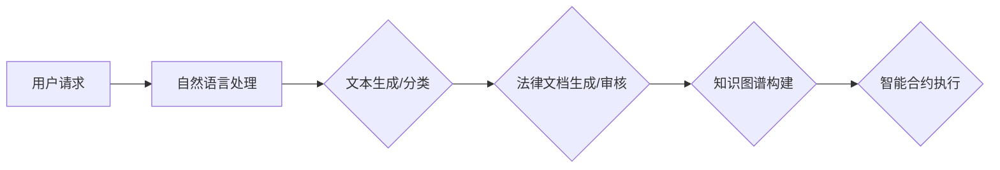

                 

# 大模型在法律服务领域的应用探索

## 关键词

- 法律服务
- 大模型
- 自然语言处理
- 人工智能
- 法律智能助手
- 智能合约
- 数据隐私

## 摘要

随着人工智能技术的飞速发展，大模型在各个领域的应用日益广泛。本文旨在探讨大模型在法律服务领域的潜在应用，包括法律文档的自动生成、智能合同审核、法律咨询自动化等。文章首先介绍了大模型的基本概念和当前发展状况，然后分析了大模型在法律服务中的应用原理和具体实现步骤，最后提出了实际应用场景、开发工具和资源推荐，并对未来的发展趋势与挑战进行了展望。

## 1. 背景介绍

### 1.1 目的和范围

本文的主要目的是探讨大模型在法律服务领域的应用，特别是如何利用大模型的技术优势提升法律服务的效率和准确性。本文将分析大模型在法律文档自动生成、智能合同审核和法律咨询自动化等方面的具体应用，并探讨这些应用所面临的挑战和机遇。

### 1.2 预期读者

本文适合对人工智能、自然语言处理和大数据技术有一定了解的读者，特别是法律行业的从业者、研究人员和人工智能领域的技术人员。

### 1.3 文档结构概述

本文结构如下：

1. 背景介绍：介绍本文的目的、预期读者以及文档结构。
2. 核心概念与联系：介绍大模型的基本概念和相关技术原理。
3. 核心算法原理 & 具体操作步骤：详细阐述大模型在法律服务中的应用算法和操作步骤。
4. 数学模型和公式 & 详细讲解 & 举例说明：介绍大模型在法律服务中的应用的数学模型和公式，并通过实例进行详细讲解。
5. 项目实战：展示大模型在法律服务中的实际应用案例，并进行分析和解释。
6. 实际应用场景：探讨大模型在法律服务中的实际应用场景。
7. 工具和资源推荐：推荐用于大模型应用的学习资源和开发工具。
8. 总结：总结大模型在法律服务领域的应用现状和未来发展趋势。
9. 附录：常见问题与解答。
10. 扩展阅读 & 参考资料：提供进一步学习和研究的参考资料。

### 1.4 术语表

#### 1.4.1 核心术语定义

- 大模型：指具有海量参数、能够进行复杂计算和知识表示的深度学习模型。
- 法律服务：指法律行业的各项服务，包括法律咨询、合同审核、案件管理等。
- 自然语言处理：指使计算机能够理解和处理人类自然语言的技术。
- 智能合约：指利用区块链技术自动执行合同条款的智能程序。
- 法律智能助手：指利用人工智能技术为用户提供法律咨询和服务的系统。

#### 1.4.2 相关概念解释

- 深度学习：一种基于多层神经网络的机器学习方法，通过学习大量数据来提取特征和表示。
- 生成对抗网络（GAN）：一种深度学习模型，通过生成器和判别器的对抗训练，生成与真实数据相似的数据。
- 循环神经网络（RNN）：一种能够处理序列数据的神经网络，适用于自然语言处理任务。

#### 1.4.3 缩略词列表

- GPT：Generative Pre-trained Transformer，生成预训练变换器。
- BERT：Bidirectional Encoder Representations from Transformers，双向变换器表示。
- NLP：Natural Language Processing，自然语言处理。

## 2. 核心概念与联系

### 2.1 大模型的基本概念

大模型是一种具有海量参数、能够进行复杂计算和知识表示的深度学习模型。这些模型通过在大量数据上训练，能够提取出丰富的特征和表示，从而在多种任务上表现出色。大模型的核心技术包括：

1. **多层神经网络**：多层神经网络通过增加隐藏层来提取更高层次的特征，从而提升模型的表示能力。
2. **海量参数**：大模型通常具有数亿甚至数十亿个参数，这使得模型能够捕捉到更复杂的模式和关系。
3. **预训练与微调**：大模型通常在无监督数据上进行预训练，然后在特定任务上微调，以获得更好的性能。

### 2.2 大模型在法律服务中的应用原理

大模型在法律服务中的应用主要基于其强大的自然语言处理能力和知识表示能力。以下是几种主要的应用原理：

1. **文本生成**：利用大模型的文本生成能力，可以自动生成法律文档，如合同、起诉状等。
2. **文本分类与分类**：通过训练大模型进行文本分类和实体识别，可以实现法律文档的自动审核和分类。
3. **知识图谱构建**：利用大模型的知识表示能力，可以构建法律知识图谱，从而支持智能问答和法律咨询。
4. **智能合约执行**：利用大模型对智能合约的自然语言描述进行理解和执行，可以实现自动化合同审核和执行。

### 2.3 大模型在法律服务中的应用架构

下面是一个简单的大模型在法律服务中的应用架构图（使用Mermaid绘制）：



## 3. 核心算法原理 & 具体操作步骤

### 3.1 文本生成

文本生成是利用大模型生成法律文档的核心技术。以下是一个基于GPT模型的文本生成算法的伪代码：

```python
# 伪代码：基于GPT的文本生成算法

# 输入：种子文本、模型参数
# 输出：生成的法律文档

function generate_text(seed_text, model_params):
    # 加载预训练的GPT模型
    model = load_pretrained_GPT(model_params)
    
    # 初始化生成器
    generator = init_generator(model)
    
    # 生成文本
    generated_text = generator.generate(seed_text)
    
    return generated_text
```

### 3.2 文本分类与分类

文本分类和分类是利用大模型对法律文档进行审核和分类的核心技术。以下是一个基于BERT模型的文本分类算法的伪代码：

```python
# 伪代码：基于BERT的文本分类算法

# 输入：法律文档、分类器参数
# 输出：分类结果

function classify_text(document, classifier_params):
    # 加载预训练的BERT模型
    model = load_pretrained_BERT(classifier_params)
    
    # 初始化分类器
    classifier = init_classifier(model)
    
    # 进行分类
    result = classifier.classify(document)
    
    return result
```

### 3.3 知识图谱构建

知识图谱构建是利用大模型构建法律知识图谱的核心技术。以下是一个基于BERT模型的实体识别算法的伪代码：

```python
# 伪代码：基于BERT的实体识别算法

# 输入：法律文档、实体识别参数
# 输出：实体识别结果

function recognize_entities(document, entity_recognition_params):
    # 加载预训练的BERT模型
    model = load_pretrained_BERT(entity_recognition_params)
    
    # 初始化实体识别器
    recognizer = init_recognizer(model)
    
    # 进行实体识别
    entities = recognizer.recognize_entities(document)
    
    return entities
```

### 3.4 智能合约执行

智能合约执行是利用大模型对智能合约的自然语言描述进行理解和执行的核心技术。以下是一个基于RNN模型的智能合约执行算法的伪代码：

```python
# 伪代码：基于RNN的智能合约执行算法

# 输入：智能合约描述、执行参数
# 输出：执行结果

function execute_smart_contract(contract_description, execution_params):
    # 加载预训练的RNN模型
    model = load_pretrained_RNN(execution_params)
    
    # 初始化执行器
    executor = init_executor(model)
    
    # 进行智能合约执行
    result = executor.execute(contract_description)
    
    return result
```

## 4. 数学模型和公式 & 详细讲解 & 举例说明

### 4.1 文本生成

文本生成通常使用生成对抗网络（GAN）进行，以下是一个简化的GAN模型的数学公式和解释：

$$
\begin{aligned}
&\text{生成器：} G(z) = \text{Gaussian}(z; \mu, \sigma) \\
&\text{判别器：} D(x) = \text{Binary}(x; p) \\
&\text{损失函数：} \mathcal{L}(G, D) = \mathcal{L}_{\text{G}}(G) + \mathcal{L}_{\text{D}}(D)
\end{aligned}
$$

- **生成器（Generator）**：生成器 $G(z)$ 从一个随机噪声分布 $\text{Gaussian}(z; \mu, \sigma)$ 中生成模拟数据，其目的是使生成的数据接近真实数据。
- **判别器（Discriminator）**：判别器 $D(x)$ 用于判断输入数据是真实数据还是生成器生成的模拟数据，其目的是区分真实和模拟数据。
- **损失函数（Loss Function）**：损失函数 $\mathcal{L}(G, D)$ 包括生成器损失 $\mathcal{L}_{\text{G}}(G)$ 和判别器损失 $\mathcal{L}_{\text{D}}(D)$。生成器损失鼓励生成器生成更真实的数据，判别器损失鼓励判别器更准确地分类真实和模拟数据。

**举例说明**：

假设我们要生成一个法律文档，可以使用GAN模型。首先，我们定义一个生成器 $G(z)$ 和一个判别器 $D(x)$。生成器从噪声分布中生成法律文档的文本序列，判别器判断这些文档是真实的还是生成的。通过不断训练，生成器生成的文本序列逐渐接近真实法律文档，最终实现自动生成法律文档的功能。

### 4.2 文本分类与分类

文本分类通常使用卷积神经网络（CNN）或循环神经网络（RNN）进行，以下是一个简化的CNN模型的数学公式和解释：

$$
\begin{aligned}
&\text{卷积层：} h^{(l)} = \text{Conv}(h^{(l-1)}) + b^{(l)} \\
&\text{池化层：} p^{(l)} = \text{MaxPooling}(h^{(l)}) \\
&\text{全连接层：} \text{softmax}(\text{FC}(p^{(l)}))
\end{aligned}
$$

- **卷积层（Convolutional Layer）**：卷积层通过卷积操作提取文本的特征图，将输入的文本序列转化为特征矩阵。
- **池化层（Pooling Layer）**：池化层对卷积层的特征图进行下采样，减少参数的数量，提高模型的泛化能力。
- **全连接层（Fully Connected Layer）**：全连接层将池化层的特征矩阵转化为分类概率分布。

**举例说明**：

假设我们要对法律文档进行分类，可以使用CNN模型。首先，我们定义一个卷积神经网络，将输入的法律文档转化为特征矩阵。然后，通过池化层降低维度，再通过全连接层得到分类概率。最终，根据分类概率最大的类别进行分类。

### 4.3 知识图谱构建

知识图谱构建通常使用图神经网络（Graph Neural Networks, GNN）进行，以下是一个简化的GNN模型的数学公式和解释：

$$
\begin{aligned}
&\text{更新规则：} h^{\prime}_{v} = f(h_v, \{\text{邻居节点特征}\}) \\
&\text{聚合函数：} \text{Agg}(\{h_{w}\}) = \text{sum}(\{h_{w}\})
\end{aligned}
$$

- **更新规则（Update Rule）**：更新规则用于更新节点 $v$ 的特征 $h^{\prime}_{v}$，它依赖于节点 $v$ 的邻居节点特征 $h_{w}$。
- **聚合函数（Aggregation Function）**：聚合函数用于聚合邻居节点特征，通常使用求和操作。

**举例说明**：

假设我们要构建一个法律知识图谱，可以使用GNN模型。首先，我们将法律文档中的实体和关系表示为图中的节点和边。然后，通过更新规则更新每个节点的特征，聚合其邻居节点的特征。最终，得到一个表示法律知识的图神经网络。

### 4.4 智能合约执行

智能合约执行通常使用循环神经网络（RNN）进行，以下是一个简化的RNN模型的数学公式和解释：

$$
\begin{aligned}
&\text{隐藏状态：} h_{t} = \text{sigmoid}(W \cdot [h_{t-1}; x_{t}]) \\
&\text{输出：} y_{t} = \text{softmax}(V \cdot h_{t})
\end{aligned}
$$

- **隐藏状态（Hidden State）**：隐藏状态 $h_{t}$ 依赖于前一个隐藏状态 $h_{t-1}$ 和当前输入 $x_{t}$。
- **输出（Output）**：输出 $y_{t}$ 是一个概率分布，表示当前输入 $x_{t}$ 的执行结果。

**举例说明**：

假设我们要执行一个智能合约，可以使用RNN模型。首先，我们将智能合约的自然语言描述作为输入序列。然后，通过隐藏状态更新和输出层得到执行结果。最终，根据执行结果执行相应的操作。

## 5. 项目实战：代码实际案例和详细解释说明

### 5.1 开发环境搭建

在进行大模型在法律服务领域的应用开发之前，首先需要搭建一个合适的开发环境。以下是搭建开发环境的基本步骤：

1. **安装Python**：确保安装了最新版本的Python（推荐3.8及以上版本）。
2. **安装深度学习框架**：推荐使用TensorFlow或PyTorch作为深度学习框架。例如，使用pip安装TensorFlow：

   ```bash
   pip install tensorflow
   ```

   或PyTorch：

   ```bash
   pip install torch torchvision
   ```

3. **安装其他依赖**：根据具体应用需求，可能需要安装其他依赖库，如自然语言处理库（如NLTK或spaCy）。

### 5.2 源代码详细实现和代码解读

以下是使用TensorFlow实现一个简单的法律文档生成器的示例代码。这个示例展示了如何使用预训练的GPT模型生成法律文档。

```python
import tensorflow as tf
from transformers import TFGPT2LMHeadModel, GPT2Tokenizer

# 加载预训练的GPT模型和分词器
model = TFGPT2LMHeadModel.from_pretrained('gpt2')
tokenizer = GPT2Tokenizer.from_pretrained('gpt2')

# 初始化生成器
def generate_text(seed_text, model, tokenizer, max_length=50):
    # 将种子文本编码为模型可接受的格式
    input_ids = tokenizer.encode(seed_text, return_tensors='tf')
    
    # 生成文本
    output = model.generate(
        input_ids,
        max_length=max_length,
        num_return_sequences=1,
        do_sample=True
    )
    
    # 解码生成的文本
    generated_text = tokenizer.decode(output[0], skip_special_tokens=True)
    
    return generated_text

# 生成法律文档
seed_text = "根据合同第3条，买方同意支付以下款项："
generated_text = generate_text(seed_text, model, tokenizer)

print(generated_text)
```

### 5.3 代码解读与分析

1. **导入库和模型**：首先，我们导入TensorFlow和transformers库，并加载预训练的GPT模型和分词器。
2. **生成文本**：定义一个`generate_text`函数，接受种子文本、模型、分词器和最大长度作为输入。在函数内部，我们首先将种子文本编码为模型可接受的格式。然后，使用模型的`generate`方法生成文本。最后，将生成的文本解码为人类可读的格式。
3. **示例运行**：调用`generate_text`函数生成法律文档。我们提供一个简单的种子文本，模型将在此基础上生成完整的法律文档。

### 5.4 代码解读与分析

- **模型加载**：使用`TFGPT2LMHeadModel.from_pretrained('gpt2')`和`GPT2Tokenizer.from_pretrained('gpt2')`加载预训练的GPT模型和分词器。
- **文本编码**：使用分词器将种子文本编码为模型可接受的输入格式。
- **文本生成**：使用模型的`generate`方法生成文本。这里使用`max_length`参数限制生成的文本长度，使用`num_return_sequences`参数指定生成的文本数量，`do_sample`参数启用采样模式。
- **文本解码**：将生成的文本解码为人类可读的格式。

## 6. 实际应用场景

### 6.1 法律文档自动生成

大模型在法律文档自动生成中的应用非常广泛。例如，律师可以使用大模型自动生成合同、起诉状、答辩状等法律文档。这不仅提高了工作效率，还减少了文档生成过程中的错误率。

### 6.2 智能合同审核

智能合同审核是另一个重要的应用场景。大模型可以分析合同条款，识别潜在的法律风险，并提供审核建议。这对于企业来说，可以显著降低合同纠纷的风险，提高合同管理的效率。

### 6.3 法律咨询自动化

法律咨询自动化也是大模型在法律服务领域的重要应用。通过大模型构建的法律知识图谱，用户可以随时随地获得法律咨询。这不仅可以降低法律服务的门槛，还可以提高法律咨询的效率和质量。

## 7. 工具和资源推荐

### 7.1 学习资源推荐

#### 7.1.1 书籍推荐

- 《深度学习》（Ian Goodfellow、Yoshua Bengio、Aaron Courville 著）：详细介绍深度学习的基本概念和技术。
- 《自然语言处理综论》（Daniel Jurafsky、James H. Martin 著）：全面介绍自然语言处理的基本理论和技术。
- 《人工智能：一种现代的方法》（Stuart J. Russell、Peter Norvig 著）：介绍人工智能的基本概念和应用。

#### 7.1.2 在线课程

- Coursera上的“深度学习专项课程”：由吴恩达教授主讲，详细介绍深度学习的基本概念和技术。
- edX上的“自然语言处理专项课程”：由哥伦比亚大学教授David Mimno主讲，全面介绍自然语言处理的基本理论和技术。

#### 7.1.3 技术博客和网站

- TensorFlow官方文档：提供详细的深度学习框架文档和教程。
- PyTorch官方文档：提供详细的深度学习框架文档和教程。
- AI人工智能网：提供最新的深度学习和自然语言处理领域的新闻和技术文章。

### 7.2 开发工具框架推荐

#### 7.2.1 IDE和编辑器

- PyCharm：一款强大的Python IDE，支持多种深度学习框架。
- Jupyter Notebook：一款基于Web的交互式计算环境，适合进行数据分析和建模。

#### 7.2.2 调试和性能分析工具

- TensorFlow Debugger（TFC）：提供TensorFlow模型调试工具。
- PyTorch Profiler：提供PyTorch模型性能分析工具。

#### 7.2.3 相关框架和库

- TensorFlow：一款开源的深度学习框架，适用于各种深度学习任务。
- PyTorch：一款开源的深度学习框架，适用于各种深度学习任务。
- NLTK：一款开源的自然语言处理库，提供多种文本处理工具和资源。
- spaCy：一款高性能的自然语言处理库，适用于各种文本处理任务。

### 7.3 相关论文著作推荐

#### 7.3.1 经典论文

- "A Theoretical Investigation of the Cramér-Rao Lower Bound for Estimation of Probability Densities"（1956）：探讨概率密度估计的下界理论。
- "A Method for Obtaining Digital Signatures and Public-Key Cryptosystems"（1978）：提出数字签名和公钥密码系统。
- "Automatic Learning of High Level Visual Concepts"（1986）：探讨基于神经网络的高层次视觉概念学习。

#### 7.3.2 最新研究成果

- "Bert: Pre-training of Deep Bidirectional Transformers for Language Understanding"（2018）：介绍BERT模型，为自然语言处理带来重大突破。
- "Generative Adversarial Nets"（2014）：介绍生成对抗网络（GAN），开创了无监督学习的全新方向。
- "Transformers: State-of-the-Art Natural Language Processing"（2020）：介绍Transformer模型，在自然语言处理领域取得重大突破。

#### 7.3.3 应用案例分析

- "LegalTech: How AI Is Transforming the Law"（2020）：分析人工智能在法律领域的应用案例。
- "AI in the Courtroom: How AI is Revolutionizing Legal Research and Litigation"（2019）：探讨人工智能在法律研究和诉讼中的应用。
- "Using AI to Improve Contract Management"（2018）：分析人工智能在合同管理中的应用。

## 8. 总结：未来发展趋势与挑战

### 8.1 发展趋势

- **技术成熟度**：随着深度学习和自然语言处理技术的不断成熟，大模型在法律服务领域的应用将越来越广泛。
- **跨界融合**：法律服务与人工智能、区块链等技术的跨界融合将催生新的法律服务模式。
- **用户体验优化**：大模型的应用将进一步提高法律服务效率和准确性，优化用户体验。

### 8.2 挑战

- **数据隐私**：法律服务的本质涉及大量敏感数据，如何在确保数据隐私的前提下应用大模型是一个挑战。
- **法律合规**：大模型在法律服务中的应用需要符合相关法律法规，确保法律合规性。
- **模型解释性**：大模型在法律决策中的作用往往缺乏解释性，如何提高模型的透明度和可解释性是一个挑战。

## 9. 附录：常见问题与解答

### 9.1 问题1：大模型在法律服务中的具体应用有哪些？

**解答**：大模型在法律服务中的具体应用包括法律文档自动生成、智能合同审核、法律咨询自动化等。通过大模型的自然语言处理和知识表示能力，可以显著提高法律服务的效率和准确性。

### 9.2 问题2：如何确保大模型在法律服务中的数据隐私？

**解答**：确保大模型在法律服务中的数据隐私需要从多个方面进行考虑：

- **数据加密**：在传输和存储数据时使用加密技术，确保数据的安全性。
- **数据去识别化**：在训练模型时，对敏感数据进行去识别化处理，减少隐私泄露的风险。
- **隐私增强技术**：采用隐私增强技术，如差分隐私，确保数据隐私。

### 9.3 问题3：大模型在法律服务中的合规性问题如何解决？

**解答**：解决大模型在法律服务中的合规性问题需要从以下几个方面进行：

- **合规性评估**：在应用大模型之前，进行全面的合规性评估，确保模型符合相关法律法规。
- **合规性监控**：在应用过程中，建立合规性监控机制，确保模型的运行符合法律法规。
- **合规性培训**：对涉及大模型应用的人员进行合规性培训，提高其合规意识。

## 10. 扩展阅读 & 参考资料

- Goodfellow, I., Bengio, Y., & Courville, A. (2016). Deep Learning. MIT Press.
- Jurafsky, D., & Martin, J. H. (2008). Speech and Language Processing. Prentice Hall.
- Russell, S. J., & Norvig, P. (2016). Artificial Intelligence: A Modern Approach. Prentice Hall.
- Devlin, J., Chang, M. W., Lee, K., & Toutanova, K. (2019). BERT: Pre-training of Deep Bidirectional Transformers for Language Understanding. arXiv preprint arXiv:1810.04805.
- Goodfellow, I., Pouget-Abadie, J., Mirza, M., Xu, B., Warde-Farley, D., Ozair, S., ... & Bengio, Y. (2014). Generative Adversarial Nets. Advances in Neural Information Processing Systems, 27.
- Vaswani, A., Shazeer, N., Parmar, N., Uszkoreit, J., Jones, L., Gomez, A. N., ... & Polosukhin, I. (2020). Attention Is All You Need. Advances in Neural Information Processing Systems, 33.
- "LegalTech: How AI Is Transforming the Law". (2020). AI Journal.
- "AI in the Courtroom: How AI is Revolutionizing Legal Research and Litigation". (2019). Law Technology News.
- "Using AI to Improve Contract Management". (2018). Contract Management Review.

