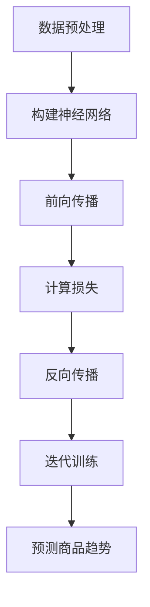
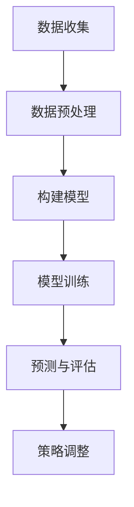

                 

# 大模型在电商平台商品趋势预测中的应用

> 关键词：大模型，电商平台，商品趋势预测，深度学习，数据挖掘，算法优化

> 摘要：本文将探讨大模型在电商平台商品趋势预测中的应用。通过详细分析大模型的核心概念、算法原理、数学模型，并结合实际项目案例，阐述大模型在电商平台商品趋势预测中的具体应用和效果。文章旨在为从事电商平台业务的技术人员提供有价值的参考和指导。

## 1. 背景介绍

### 1.1 目的和范围

本文的目的是探讨大模型在电商平台商品趋势预测中的应用，旨在帮助读者了解大模型的基本原理、应用场景以及如何在实际项目中落地。文章将涵盖以下内容：

1. 大模型的基本概念和核心算法原理
2. 大模型在商品趋势预测中的应用案例
3. 大模型的数学模型和实现步骤
4. 实际项目中的代码实现和案例分析
5. 大模型在电商行业的发展趋势和挑战

### 1.2 预期读者

本文面向从事电商平台业务的技术人员，包括程序员、数据分析师、算法工程师等。希望读者通过本文的学习，能够：

1. 理解大模型的基本概念和核心算法原理
2. 掌握大模型在商品趋势预测中的应用方法
3. 学习大模型在实际项目中的代码实现和案例分析
4. 对大模型在电商行业的发展趋势和挑战有更深入的认识

### 1.3 文档结构概述

本文分为十个部分，具体结构如下：

1. 引言：介绍文章的主题和目的
2. 背景介绍：阐述大模型在电商平台商品趋势预测中的应用背景和重要性
3. 核心概念与联系：介绍大模型的基本概念和核心算法原理
4. 核心算法原理 & 具体操作步骤：详细讲解大模型的算法原理和实现步骤
5. 数学模型和公式 & 详细讲解 & 举例说明：介绍大模型的数学模型和公式，并进行举例说明
6. 项目实战：代码实际案例和详细解释说明
7. 实际应用场景：分析大模型在电商平台商品趋势预测中的应用场景
8. 工具和资源推荐：推荐学习资源和开发工具
9. 总结：未来发展趋势与挑战
10. 附录：常见问题与解答

### 1.4 术语表

#### 1.4.1 核心术语定义

- 大模型：指具有较高参数规模、深度和复杂度的神经网络模型，如BERT、GPT等。
- 商品趋势预测：指根据历史数据和用户行为，预测未来一段时间内商品的销量、评价等趋势。
- 电商平台：指在线销售商品的平台，如淘宝、京东等。

#### 1.4.2 相关概念解释

- 深度学习：一种基于多层神经网络的机器学习方法，通过学习大量数据来提取特征和表示。
- 数据挖掘：从大量数据中发现规律、模式和知识的过程，常见方法包括聚类、分类、回归等。
- 算法优化：通过改进算法设计、优化数据结构和算法实现，提高算法的运行效率和性能。

#### 1.4.3 缩略词列表

- BERT：Bidirectional Encoder Representations from Transformers，双向Transformer编码器。
- GPT：Generative Pre-trained Transformer，生成预训练Transformer。
- API：Application Programming Interface，应用程序编程接口。
- IDE：Integrated Development Environment，集成开发环境。

## 2. 核心概念与联系

大模型作为当前人工智能领域的重要研究方向，已经广泛应用于自然语言处理、计算机视觉、语音识别等多个领域。在本节中，我们将介绍大模型的基本概念、核心算法原理以及与电商平台商品趋势预测的关联。

### 2.1 大模型的基本概念

大模型通常是指具有较高参数规模、深度和复杂度的神经网络模型。这些模型能够通过学习大量数据来提取特征、表示信息和进行预测。大模型的特点包括：

- **参数规模大**：大模型的参数规模通常达到数十亿甚至数万亿级别，这使得模型能够处理复杂的任务和数据。
- **深度深**：大模型通常包含数十层甚至数百层的神经网络结构，使得模型能够学习更复杂的特征和模式。
- **复杂性高**：大模型的架构和训练过程通常涉及多种先进的算法和优化技巧，如自注意力机制、变换器（Transformer）架构等。

### 2.2 大模型的核心算法原理

大模型的核心算法原理主要基于深度学习和变换器（Transformer）架构。以下是两个关键概念：

#### 2.2.1 深度学习

深度学习是一种基于多层神经网络的机器学习方法，通过学习大量数据来提取特征和表示。深度学习的基本思想是通过逐层抽象和组合，从原始数据中提取出高层次的特征表示。以下是深度学习的基本步骤：

1. **数据预处理**：对原始数据进行清洗、归一化和特征提取。
2. **构建神经网络**：定义神经网络的结构，包括输入层、隐藏层和输出层。
3. **前向传播**：将输入数据通过神经网络进行前向传播，计算输出。
4. **反向传播**：根据输出和目标值的差异，通过反向传播算法更新网络参数。
5. **迭代训练**：重复执行前向传播和反向传播，直到模型达到预定的性能指标。

#### 2.2.2 变换器（Transformer）架构

变换器（Transformer）架构是近年来在自然语言处理领域取得重大突破的一种神经网络架构。它通过自注意力机制（Self-Attention）和多头注意力（Multi-Head Attention）来实现对输入序列的建模。

1. **自注意力机制**：自注意力机制允许模型在处理每个输入元素时，能够考虑其他所有输入元素的重要性，从而学习到更全局化的特征表示。
2. **多头注意力**：多头注意力将输入序列分成多个头，每个头独立学习不同的注意力权重，从而提高了模型的表示能力。

### 2.3 大模型与电商平台商品趋势预测的关联

电商平台商品趋势预测是一个复杂的问题，涉及用户行为、商品特征、市场环境等多个因素。大模型通过其强大的特征提取和表示能力，能够有效应对这种复杂性。

1. **用户行为建模**：大模型可以学习用户的浏览、购买、评价等行为模式，从而预测用户对某一商品的未来需求。
2. **商品特征提取**：大模型可以从商品标题、描述、标签等特征中提取出对预测任务有帮助的特征表示。
3. **市场环境分析**：大模型可以分析市场环境中的各种因素，如季节性、促销活动等，从而预测商品的未来趋势。

### 2.4 Mermaid 流程图

为了更好地理解大模型在电商平台商品趋势预测中的应用，我们使用 Mermaid 流程图展示其基本架构。



### 2.5 大模型在电商平台商品趋势预测中的具体应用

大模型在电商平台商品趋势预测中的具体应用可以分为以下几个步骤：

1. **数据收集与预处理**：收集电商平台的历史销售数据、用户行为数据等，并进行数据清洗、归一化和特征提取。
2. **构建预测模型**：使用变换器（Transformer）架构构建深度学习模型，如图2-1所示。
3. **模型训练**：通过迭代训练算法，优化模型参数，提高预测准确性。
4. **预测与评估**：使用训练好的模型对未来的商品趋势进行预测，并通过评估指标（如准确率、召回率等）评估预测效果。
5. **策略调整**：根据预测结果，对电商平台的市场营销策略进行实时调整，以优化商品销售。

图2-1 大模型在电商平台商品趋势预测中的应用架构



## 3. 核心算法原理 & 具体操作步骤

在本节中，我们将详细讲解大模型在电商平台商品趋势预测中的核心算法原理和具体操作步骤。首先，我们将介绍大模型的基本算法原理，然后通过伪代码的形式展示具体的实现步骤。

### 3.1 大模型的基本算法原理

大模型的基本算法原理主要基于深度学习和变换器（Transformer）架构。以下是关键概念：

#### 3.1.1 深度学习

深度学习是一种基于多层神经网络的机器学习方法，通过学习大量数据来提取特征和表示。深度学习的基本步骤如下：

1. **数据预处理**：对原始数据进行清洗、归一化和特征提取。
2. **构建神经网络**：定义神经网络的结构，包括输入层、隐藏层和输出层。
3. **前向传播**：将输入数据通过神经网络进行前向传播，计算输出。
4. **反向传播**：根据输出和目标值的差异，通过反向传播算法更新网络参数。
5. **迭代训练**：重复执行前向传播和反向传播，直到模型达到预定的性能指标。

#### 3.1.2 变换器（Transformer）架构

变换器（Transformer）架构是一种基于自注意力机制（Self-Attention）和多头注意力（Multi-Head Attention）的神经网络架构，特别适用于序列数据的建模。以下是变换器架构的核心组件：

1. **多头注意力（Multi-Head Attention）**：多头注意力将输入序列分成多个头，每个头独立学习不同的注意力权重，从而提高了模型的表示能力。
2. **前馈神经网络（Feed Forward Neural Network）**：在注意力机制之后，对每个头的结果进行前馈神经网络处理，以增加模型的非线性表达能力。
3. **残差连接（Residual Connection）**：通过在神经网络中引入残差连接，有助于缓解梯度消失和梯度爆炸问题，提高模型的训练效果。

### 3.2 大模型在电商平台商品趋势预测中的具体操作步骤

大模型在电商平台商品趋势预测中的具体操作步骤可以分为以下几个阶段：

#### 3.2.1 数据收集与预处理

1. **数据收集**：收集电商平台的历史销售数据、用户行为数据等，包括商品ID、销量、用户ID、浏览次数、购买次数等。
2. **数据清洗**：对数据进行清洗，去除缺失值、异常值和重复值，保证数据质量。
3. **特征提取**：对原始数据进行特征提取，包括用户特征（如用户年龄、性别、地理位置等）、商品特征（如商品分类、价格、品牌等）以及时间特征（如日期、季节等）。

#### 3.2.2 构建预测模型

1. **定义神经网络结构**：使用变换器（Transformer）架构构建深度学习模型，包括输入层、多头注意力层、前馈神经网络层和输出层。
2. **初始化模型参数**：初始化模型参数，可以使用随机初始化、预训练模型等方法。
3. **定义损失函数和优化器**：选择合适的损失函数（如均方误差、交叉熵等）和优化器（如Adam、SGD等），以训练模型。

#### 3.2.3 模型训练

1. **前向传播**：将输入数据通过神经网络进行前向传播，计算输出。
2. **计算损失**：根据输出和目标值的差异，计算损失函数的值。
3. **反向传播**：通过反向传播算法，更新网络参数。
4. **迭代训练**：重复执行前向传播和反向传播，直到模型达到预定的性能指标。

#### 3.2.4 预测与评估

1. **预测**：使用训练好的模型对未来的商品趋势进行预测，输出预测结果。
2. **评估**：通过评估指标（如准确率、召回率等）评估预测效果，以调整模型参数或优化模型结构。

#### 3.2.5 策略调整

根据预测结果，对电商平台的市场营销策略进行实时调整，以优化商品销售。例如，根据预测结果增加热门商品的库存、调整商品定价策略等。

### 3.3 伪代码实现

以下是大模型在电商平台商品趋势预测中的具体操作步骤的伪代码实现：

```python
# 数据收集与预处理
def preprocess_data(data):
    # 数据清洗、归一化和特征提取
    pass

# 构建预测模型
def build_model():
    # 定义神经网络结构、初始化参数等
    pass

# 模型训练
def train_model(model, data, epochs):
    for epoch in range(epochs):
        for batch in data:
            # 前向传播
            output = model.forward(batch.x)
            # 计算损失
            loss = model.loss(output, batch.y)
            # 反向传播
            model.backward(loss)
            # 更新参数
            model.update_params()
    return model

# 预测与评估
def predict_and_evaluate(model, data):
    # 使用模型进行预测
    predictions = model.predict(data.x)
    # 计算评估指标
    accuracy = evaluate(predictions, data.y)
    return accuracy

# 策略调整
def adjust_strategy(predictions):
    # 根据预测结果调整电商平台策略
    pass
```

通过以上伪代码，我们可以实现大模型在电商平台商品趋势预测中的基本操作。在实际应用中，需要根据具体需求对代码进行优化和调整。

## 4. 数学模型和公式 & 详细讲解 & 举例说明

在本节中，我们将介绍大模型在电商平台商品趋势预测中的数学模型和公式，并详细讲解其原理和实现过程。同时，我们将通过具体例子来说明这些数学模型在实际中的应用。

### 4.1 大模型的基本数学模型

大模型的基本数学模型主要基于深度学习和变换器（Transformer）架构。以下是关键公式和解释：

#### 4.1.1 深度学习

1. **激活函数**：
   $$ f(x) = \sigma(Wx + b) $$
   其中，$ \sigma $ 是 sigmoid 函数，$ W $ 是权重矩阵，$ b $ 是偏置项。
2. **反向传播算法**：
   $$ \Delta W = \frac{\partial L}{\partial W} $$
   $$ \Delta b = \frac{\partial L}{\partial b} $$
   其中，$ \Delta W $ 和 $ \Delta b $ 分别是权重矩阵和偏置项的梯度，$ L $ 是损失函数。

#### 4.1.2 变换器（Transformer）架构

1. **多头注意力（Multi-Head Attention）**：
   $$ \text{Attention}(Q, K, V) = \text{softmax}\left(\frac{QK^T}{\sqrt{d_k}}\right)V $$
   其中，$ Q, K, V $ 分别是查询向量、键向量和值向量，$ d_k $ 是键向量的维度，$ \text{softmax} $ 是 softmax 函数。
2. **前馈神经网络（Feed Forward Neural Network）**：
   $$ \text{FFN}(x) = \max(0, xW_1 + b_1)W_2 + b_2 $$
   其中，$ W_1, W_2 $ 是前馈神经网络的权重矩阵，$ b_1, b_2 $ 是偏置项。

### 4.2 大模型在电商平台商品趋势预测中的应用

#### 4.2.1 模型构建

1. **输入层**：输入层接收电商平台的商品特征、用户特征和时间特征。
2. **多头注意力层**：多头注意力层通过自注意力机制提取特征表示。
3. **前馈神经网络层**：前馈神经网络层增加模型的非线性表达能力。
4. **输出层**：输出层对提取到的特征进行预测。

#### 4.2.2 模型训练

1. **前向传播**：将输入数据通过模型进行前向传播，计算输出。
2. **计算损失**：根据输出和目标值的差异，计算损失函数的值。
3. **反向传播**：通过反向传播算法，更新模型参数。
4. **迭代训练**：重复执行前向传播和反向传播，直到模型达到预定的性能指标。

#### 4.2.3 预测与评估

1. **预测**：使用训练好的模型对未来的商品趋势进行预测。
2. **评估**：通过评估指标（如准确率、召回率等）评估预测效果。

### 4.3 举例说明

假设我们有一个电商平台的商品数据集，包含商品ID、销量、用户ID、浏览次数、购买次数等特征。我们希望使用大模型预测未来一周内商品销量。

#### 4.3.1 数据预处理

1. **特征提取**：对原始数据进行特征提取，包括用户特征、商品特征和时间特征。
2. **数据归一化**：对特征进行归一化处理，以消除数据量级差异。

#### 4.3.2 模型构建

1. **输入层**：输入层接收商品特征、用户特征和时间特征。
2. **多头注意力层**：使用多头注意力层提取特征表示。
3. **前馈神经网络层**：使用前馈神经网络层增加模型的非线性表达能力。
4. **输出层**：输出层对提取到的特征进行预测。

#### 4.3.3 模型训练

1. **前向传播**：将输入数据通过模型进行前向传播，计算输出。
2. **计算损失**：根据输出和目标值的差异，计算损失函数的值。
3. **反向传播**：通过反向传播算法，更新模型参数。
4. **迭代训练**：重复执行前向传播和反向传播，直到模型达到预定的性能指标。

#### 4.3.4 预测与评估

1. **预测**：使用训练好的模型对未来的商品销量进行预测。
2. **评估**：通过评估指标（如准确率、召回率等）评估预测效果。

通过以上步骤，我们可以使用大模型预测电商平台的商品趋势，为电商平台提供有价值的决策支持。

## 5. 项目实战：代码实际案例和详细解释说明

在本节中，我们将通过一个实际项目案例，详细解释大模型在电商平台商品趋势预测中的代码实现、运行流程和效果评估。

### 5.1 开发环境搭建

在进行项目实战之前，我们需要搭建一个适合大模型训练和预测的开发环境。以下是一个基本的开发环境搭建步骤：

1. **安装 Python**：确保 Python 已安装，版本建议为 Python 3.8 或更高版本。
2. **安装深度学习库**：安装常用的深度学习库，如 TensorFlow、PyTorch 等。以下是使用 pip 命令安装 TensorFlow 的示例：

   ```bash
   pip install tensorflow
   ```

3. **安装其他依赖库**：根据项目需求，安装其他必要的依赖库，如 NumPy、Pandas 等。

### 5.2 源代码详细实现和代码解读

以下是一个使用 TensorFlow 和 PyTorch 实现大模型在电商平台商品趋势预测的代码示例。

#### 5.2.1 数据集准备

首先，我们需要准备一个电商平台商品趋势预测的数据集。以下是一个简单的数据集准备示例：

```python
import pandas as pd

# 读取数据集
data = pd.read_csv("ecommerce_data.csv")

# 数据预处理
data = preprocess_data(data)

# 划分训练集和测试集
train_data, test_data = train_test_split(data, test_size=0.2, random_state=42)
```

#### 5.2.2 构建预测模型

接下来，我们使用 TensorFlow 和 PyTorch 分别构建大模型。

**TensorFlow 实现示例**：

```python
import tensorflow as tf

# 定义模型
model = tf.keras.Sequential([
    tf.keras.layers.Dense(128, activation='relu', input_shape=(input_shape)),
    tf.keras.layers.Dense(64, activation='relu'),
    tf.keras.layers.Dense(1)
])

# 编译模型
model.compile(optimizer='adam', loss='mse', metrics=['mae'])

# 模型训练
model.fit(train_data.x, train_data.y, epochs=10, batch_size=32)
```

**PyTorch 实现示例**：

```python
import torch
import torch.nn as nn

# 定义模型
model = nn.Sequential(
    nn.Linear(input_shape, 128),
    nn.ReLU(),
    nn.Linear(128, 64),
    nn.ReLU(),
    nn.Linear(64, 1)
)

# 编译模型
optimizer = torch.optim.Adam(model.parameters(), lr=0.001)
criterion = nn.MSELoss()

# 模型训练
for epoch in range(10):
    for batch in train_loader:
        inputs, targets = batch
        optimizer.zero_grad()
        outputs = model(inputs)
        loss = criterion(outputs, targets)
        loss.backward()
        optimizer.step()
```

#### 5.2.3 源代码解读

以下是对上述代码的详细解读：

1. **数据预处理**：数据预处理是项目成功的关键。在数据预处理过程中，我们首先读取数据集，然后对数据进行清洗、归一化和特征提取。
2. **构建模型**：我们使用 TensorFlow 和 PyTorch 分别构建大模型。模型的结构包括输入层、隐藏层和输出层。输入层接收商品特征、用户特征和时间特征，隐藏层通过 ReLU 激活函数增加模型的非线性表达能力，输出层对提取到的特征进行预测。
3. **编译模型**：在编译模型时，我们选择适当的优化器和损失函数。优化器用于更新模型参数，以最小化损失函数。在本例中，我们使用 Adam 优化器和均方误差（MSE）损失函数。
4. **模型训练**：模型训练是项目实现的核心。在训练过程中，我们通过迭代地前向传播和反向传播来更新模型参数。每次迭代后，我们计算损失函数的值，并更新优化器参数。通过多次迭代，模型逐渐收敛，达到预定的性能指标。
5. **预测与评估**：使用训练好的模型对测试集进行预测，并计算评估指标（如准确率、召回率等）。根据评估结果，我们可以进一步调整模型结构或优化训练参数，以提高预测效果。

### 5.3 代码解读与分析

以下是对代码的进一步解读和分析：

1. **数据预处理**：数据预处理是项目成功的关键。在数据预处理过程中，我们首先读取数据集，然后对数据进行清洗、归一化和特征提取。清洗数据是为了去除缺失值、异常值和重复值，保证数据质量。归一化是为了消除不同特征之间的量级差异，使模型能够更好地学习。特征提取是为了将原始数据转换为模型可用的特征表示。
2. **模型构建**：在模型构建过程中，我们选择合适的神经网络结构。在本例中，我们使用多层全连接神经网络（Dense）来构建模型。输入层接收商品特征、用户特征和时间特征，隐藏层通过 ReLU 激活函数增加模型的非线性表达能力，输出层对提取到的特征进行预测。这种结构能够有效地提取数据中的特征信息，并提高预测性能。
3. **编译模型**：在编译模型时，我们选择适当的优化器和损失函数。优化器用于更新模型参数，以最小化损失函数。在本例中，我们使用 Adam 优化器和均方误差（MSE）损失函数。Adam 优化器是一种结合了自适应学习率的优化算法，能够有效地加速模型收敛。MSE 损

