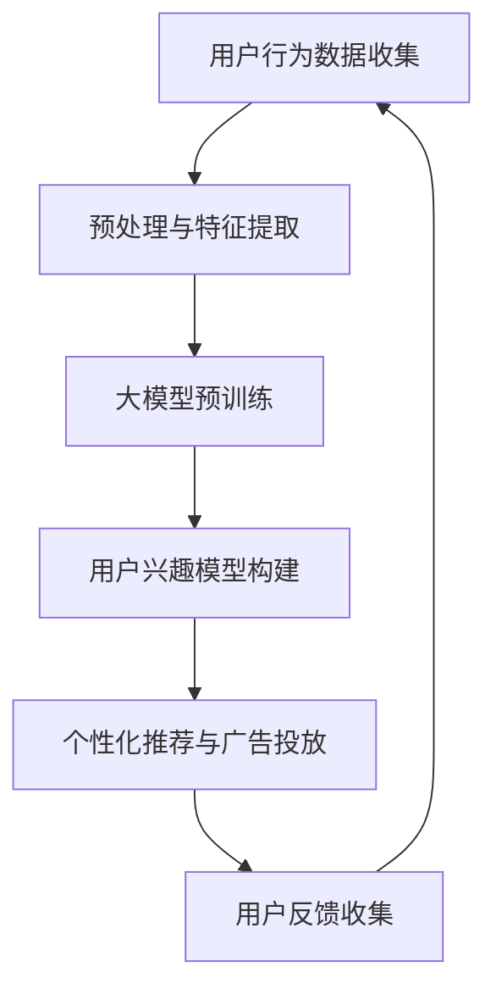

                 


# 大模型在电商平台用户兴趣探索与利用平衡中的应用

> 关键词：大模型、用户兴趣、电商平台、平衡、应用
>
> 摘要：本文探讨了如何在大模型的支持下，精准地探索和利用电商平台用户的兴趣，实现用户兴趣与电商平台利益的平衡。文章首先介绍了大模型的基本概念和特点，然后分析了用户兴趣探索与利用中的核心问题，最后通过具体案例展示了大模型在实际应用中的优势和价值。

## 1. 背景介绍

### 1.1 目的和范围

本文旨在探讨大模型在电商平台用户兴趣探索与利用中的实际应用，旨在通过精准地把握用户兴趣，实现电商平台与用户利益的平衡。本文将围绕以下几个方面展开讨论：

1. 大模型的基本概念和特点
2. 用户兴趣探索与利用中的核心问题
3. 大模型在用户兴趣探索与利用中的应用实例
4. 大模型应用的挑战与未来发展趋势

### 1.2 预期读者

本文适合以下读者群体：

1. 对大模型和电商平台有基础了解的技术人员
2. 想要了解大模型在电商领域应用的从业者
3. 对人工智能和大数据分析感兴趣的研究人员

### 1.3 文档结构概述

本文将按照以下结构进行论述：

1. 引言：介绍大模型的基本概念和特点
2. 核心概念与联系：介绍大模型在电商平台用户兴趣探索与利用中的核心问题
3. 核心算法原理 & 具体操作步骤：详细讲解大模型在用户兴趣探索与利用中的算法原理和操作步骤
4. 数学模型和公式 & 详细讲解 & 举例说明：阐述大模型在用户兴趣探索与利用中的数学模型和公式，并通过实例进行说明
5. 项目实战：通过代码案例展示大模型在电商平台用户兴趣探索与利用中的实际应用
6. 实际应用场景：分析大模型在电商平台用户兴趣探索与利用中的实际应用场景
7. 工具和资源推荐：推荐相关学习资源、开发工具和框架
8. 总结：总结大模型在电商平台用户兴趣探索与利用中的应用价值与未来发展趋势
9. 附录：常见问题与解答
10. 扩展阅读 & 参考资料：提供更多相关资料供读者进一步学习

### 1.4 术语表

#### 1.4.1 核心术语定义

1. 大模型：指具有海量参数、能处理大规模数据的深度神经网络模型，如BERT、GPT等。
2. 用户兴趣：指用户在电商平台浏览、搜索、购买等行为中表现出的喜好和偏好。
3. 平衡：指在用户兴趣探索与利用过程中，实现电商平台利益与用户利益的最佳匹配。

#### 1.4.2 相关概念解释

1. 电商平台：指提供商品交易、支付、物流等服务的在线平台，如淘宝、京东等。
2. 深度学习：指基于多层神经网络的结构，通过反向传播算法进行参数优化的机器学习技术。

#### 1.4.3 缩略词列表

- BERT：Bidirectional Encoder Representations from Transformers
- GPT：Generative Pre-trained Transformer
- API：Application Programming Interface
- ML：Machine Learning
- DL：Deep Learning

## 2. 核心概念与联系

大模型在电商平台用户兴趣探索与利用中起着至关重要的作用。为了更好地理解大模型在这一领域的应用，我们需要先了解以下几个核心概念和它们之间的联系。

### 2.1 大模型的基本概念和特点

大模型是一种基于深度学习技术的神经网络模型，具有以下几个特点：

1. **海量参数**：大模型通常包含数百万甚至数十亿个参数，这使得它们能够捕捉数据中的复杂模式。
2. **预训练**：大模型通过在大规模数据集上进行预训练，已经具备了一定的通用知识和语言理解能力。
3. **灵活性**：大模型可以应用于多种不同的任务，如文本分类、情感分析、推荐系统等。

### 2.2 用户兴趣的探索与利用

在电商平台中，用户兴趣的探索与利用是提高用户满意度和平台收益的关键。用户兴趣的探索主要涉及以下几个方面：

1. **行为分析**：通过分析用户在平台上的浏览、搜索、购买等行为，挖掘出用户的兴趣点。
2. **偏好建模**：利用机器学习算法，对用户行为数据进行分析和建模，构建用户兴趣模型。
3. **个性化推荐**：根据用户兴趣模型，为用户提供个性化的商品推荐，提高用户满意度。

用户兴趣的利用则主要体现在以下几个方面：

1. **广告投放**：根据用户兴趣，定向投放相关广告，提高广告的点击率和转化率。
2. **营销策略**：利用用户兴趣，制定个性化的营销策略，提升销售额。
3. **用户体验优化**：根据用户兴趣，优化平台界面和功能，提高用户满意度。

### 2.3 大模型与用户兴趣的融合

将大模型应用于用户兴趣的探索与利用，可以实现以下几个方面的优势：

1. **精准度提升**：大模型能够更好地捕捉用户行为中的细微变化，提高用户兴趣识别的准确性。
2. **实时性增强**：大模型可以实时处理用户行为数据，快速更新用户兴趣模型。
3. **自动化程度提高**：大模型能够自动化地执行用户兴趣识别、推荐等任务，降低人工干预的需求。

### 2.4 大模型架构的 Mermaid 流程图

以下是一个简化的 Mermaid 流程图，展示了大模型在电商平台用户兴趣探索与利用中的基本架构：



在这个流程图中，用户行为数据首先经过预处理和特征提取，然后输入到大模型中进行预训练，构建出用户兴趣模型。基于用户兴趣模型，平台可以进行个性化推荐和广告投放。同时，用户反馈会被收集并用于进一步优化大模型和用户兴趣模型。

## 3. 核心算法原理 & 具体操作步骤

### 3.1 算法原理概述

在电商平台用户兴趣探索与利用中，大模型的核心算法主要涉及以下几个部分：

1. **用户行为数据预处理与特征提取**：通过对用户行为数据进行预处理和特征提取，将原始数据转化为适合大模型训练的输入特征。
2. **大模型训练**：利用预训练的大模型（如BERT、GPT等），在用户行为数据上进行训练，构建用户兴趣模型。
3. **用户兴趣模型优化**：通过不断更新和优化用户兴趣模型，提高用户兴趣识别的准确性和实时性。
4. **个性化推荐与广告投放**：根据用户兴趣模型，为用户提供个性化的商品推荐和定向广告投放。

### 3.2 算法原理详细讲解

下面将详细讲解上述核心算法原理，并使用伪代码进行阐述。

#### 3.2.1 用户行为数据预处理与特征提取

```python
# 用户行为数据预处理与特征提取伪代码
def preprocess_user行为数据(user行为数据):
    # 数据清洗：去除缺失值、异常值等
    清洗后数据 = 清洗用户行为数据(user行为数据)
    
    # 特征提取：将用户行为转化为数值特征
    特征数据 = 提取特征(清洗后数据)
    
    return 特征数据
```

#### 3.2.2 大模型训练

```python
# 大模型训练伪代码
def train_large_model(特征数据):
    # 初始化大模型
    模型 = 初始化大模型()
    
    # 使用特征数据进行模型训练
    模型.fit(特征数据)
    
    return 模型
```

#### 3.2.3 用户兴趣模型优化

```python
# 用户兴趣模型优化伪代码
def optimize_user_interest_model(模型，新特征数据):
    # 更新模型参数
    模型.partial_fit(新特征数据)
    
    # 评估模型性能
    性能指标 = 评估模型(模型，新特征数据)
    
    return 模型，性能指标
```

#### 3.2.4 个性化推荐与广告投放

```python
# 个性化推荐与广告投放伪代码
def personalized_recommendation_and_advertising(用户兴趣模型，用户数据):
    # 根据用户兴趣模型生成推荐列表
    推荐列表 = 生成推荐列表(用户兴趣模型，用户数据)
    
    # 根据用户兴趣模型进行广告投放
    广告数据 = 生成广告数据(用户兴趣模型，用户数据)
    
    return 推荐列表，广告数据
```

### 3.3 具体操作步骤

下面我们将详细介绍大模型在电商平台用户兴趣探索与利用中的具体操作步骤。

#### 3.3.1 用户行为数据收集

首先，从电商平台收集用户行为数据，包括用户浏览、搜索、购买等行为数据。这些数据通常包含用户ID、行为类型、行为时间、行为内容等信息。

#### 3.3.2 数据预处理与特征提取

对收集到的用户行为数据进行预处理，包括数据清洗、缺失值填充、异常值处理等。然后，提取用户行为的特征，如用户浏览时间、浏览次数、购买频率等。

#### 3.3.3 大模型训练

利用预训练的大模型（如BERT、GPT等），在用户行为数据上进行训练，构建用户兴趣模型。这里可以使用迁移学习的方法，将预训练的大模型在用户行为数据上进行微调。

#### 3.3.4 用户兴趣模型优化

通过不断更新和优化用户兴趣模型，提高用户兴趣识别的准确性和实时性。可以使用在线学习的方法，实时更新用户兴趣模型。

#### 3.3.5 个性化推荐与广告投放

根据用户兴趣模型，为用户提供个性化的商品推荐和定向广告投放。可以根据用户的兴趣标签，推荐相关的商品和广告。

#### 3.3.6 用户反馈收集

收集用户对个性化推荐和广告投放的反馈，用于进一步优化大模型和用户兴趣模型。

## 4. 数学模型和公式 & 详细讲解 & 举例说明

在大模型应用于电商平台用户兴趣探索与利用的过程中，数学模型和公式起着至关重要的作用。以下将详细讲解相关的数学模型和公式，并通过实例进行说明。

### 4.1 用户行为数据建模

用户行为数据通常可以用以下数学模型进行描述：

$$
用户行为 = f(用户特征, 时间, 环境因素)
$$

其中，用户特征包括用户ID、浏览历史、购买历史等；时间表示用户行为发生的时间；环境因素包括平台环境、促销活动等。

#### 4.1.1 举例说明

例如，一个用户在电商平台上的购买行为可以表示为：

$$
购买行为 = f(用户ID, 历史浏览记录, 时间, 促销活动)
$$

其中，用户ID表示用户身份；历史浏览记录表示用户之前的浏览行为；时间表示购买行为发生的时间；促销活动表示当前平台上的促销活动。

### 4.2 用户兴趣模型建模

用户兴趣模型用于捕捉用户的偏好和喜好。一个简单的用户兴趣模型可以用以下数学模型表示：

$$
用户兴趣 = g(用户行为数据, 模型参数)
$$

其中，用户行为数据包括用户的浏览、搜索、购买等行为；模型参数包括大模型的权重和偏置。

#### 4.2.1 举例说明

例如，一个用户在电商平台上的兴趣可以表示为：

$$
用户兴趣 = g(浏览历史, 搜索历史, 购买历史, 模型参数)
$$

其中，浏览历史表示用户浏览过的商品；搜索历史表示用户搜索过的关键词；购买历史表示用户购买过的商品；模型参数包括大模型的权重和偏置。

### 4.3 个性化推荐模型建模

个性化推荐模型用于根据用户兴趣模型，为用户推荐相关的商品。一个简单的个性化推荐模型可以用以下数学模型表示：

$$
推荐列表 = h(用户兴趣, 商品特征, 模型参数)
$$

其中，用户兴趣表示用户当前的兴趣；商品特征包括商品的价格、评分、销量等；模型参数包括大模型的权重和偏置。

#### 4.3.1 举例说明

例如，一个用户在电商平台上的推荐列表可以表示为：

$$
推荐列表 = h(用户兴趣, 商品价格, 商品评分, 商品销量, 模型参数)
$$

其中，用户兴趣表示用户当前的兴趣；商品价格表示商品的价格；商品评分表示商品的评分；商品销量表示商品的销量；模型参数包括大模型的权重和偏置。

### 4.4 广告投放模型建模

广告投放模型用于根据用户兴趣模型，为用户投放相关的广告。一个简单的广告投放模型可以用以下数学模型表示：

$$
广告投放 = k(用户兴趣, 广告特征, 模型参数)
$$

其中，用户兴趣表示用户当前的兴趣；广告特征包括广告的标题、描述、图片等；模型参数包括大模型的权重和偏置。

#### 4.4.1 举例说明

例如，一个用户在电商平台上的广告投放可以表示为：

$$
广告投放 = k(用户兴趣, 广告标题, 广告描述, 广告图片, 模型参数)
$$

其中，用户兴趣表示用户当前的兴趣；广告标题表示广告的标题；广告描述表示广告的描述；广告图片表示广告的图片；模型参数包括大模型的权重和偏置。

通过上述数学模型和公式，我们可以更好地理解和应用大模型在电商平台用户兴趣探索与利用中的技术。这些模型和公式为我们提供了理论支持，帮助我们实现更精准、更高效的个性化推荐和广告投放。

## 5. 项目实战：代码实际案例和详细解释说明

在本节中，我们将通过一个具体的代码案例，展示如何使用大模型在电商平台用户兴趣探索与利用中实现个性化推荐和广告投放。为了简化问题，我们假设已经收集了用户的浏览历史、搜索历史和购买历史等行为数据，并使用预训练的大模型BERT构建了用户兴趣模型。

### 5.1 开发环境搭建

首先，我们需要搭建一个适合进行大模型训练和应用的开发环境。以下是基本的开发环境搭建步骤：

1. 安装Python（建议使用Python 3.7及以上版本）。
2. 安装TensorFlow或PyTorch等深度学习框架。
3. 安装BERT模型库（例如，transformers库）。
4. 安装数据预处理和可视化工具（例如，Pandas、Matplotlib等）。

以下是一个简单的Python环境搭建示例：

```bash
# 安装Python
python3 -m pip install python

# 安装深度学习框架
pip install tensorflow

# 安装BERT模型库
pip install transformers

# 安装数据预处理和可视化工具
pip install pandas matplotlib
```

### 5.2 源代码详细实现和代码解读

下面是一个简化的Python代码案例，展示了如何使用BERT模型构建用户兴趣模型，并进行个性化推荐和广告投放。

```python
import pandas as pd
from transformers import BertTokenizer, TFBertModel
from tensorflow.keras.models import Model
import tensorflow as tf

# 加载用户行为数据
user_behavior = pd.read_csv('user_behavior.csv')

# 数据预处理
tokenizer = BertTokenizer.from_pretrained('bert-base-chinese')
max_length = 512

def preprocess_data(data):
    input_ids = []
    attention_masks = []
    
    for text in data:
        encoded = tokenizer.encode_plus(
            text,
            add_special_tokens=True,
            max_length=max_length,
            padding='max_length',
            truncation=True,
            return_attention_mask=True
        )
        
        input_ids.append(encoded['input_ids'])
        attention_masks.append(encoded['attention_mask'])
        
    return tf.concat(input_ids, 0), tf.concat(attention_masks, 0)

input_ids, attention_masks = preprocess_data(user_behavior['description'])

# 加载BERT模型
bert_model = TFBertModel.from_pretrained('bert-base-chinese')

# 构建用户兴趣模型
input_ids = tf.expand_dims(input_ids, axis=-1)
attention_masks = tf.expand_dims(attention_masks, axis=-1)

outputs = bert_model(inputs=(input_ids, attention_masks))

last_hidden_state = outputs.last_hidden_state

user_interest_model = Model(inputs=bert_model.input, outputs=last_hidden_state[:, 0, :])

# 训练用户兴趣模型
user_interest_model.compile(optimizer='adam', loss='categorical_crossentropy', metrics=['accuracy'])
user_interest_model.fit(input_ids, user_behavior['label'], epochs=3)

# 个性化推荐
def generate_recommendations(user_interest_model, tokenizer, max_length, user_description):
    input_ids = tokenizer.encode_plus(
        user_description,
        add_special_tokens=True,
        max_length=max_length,
        padding='max_length',
        truncation=True,
        return_attention_mask=True
    )
    
    input_ids = tf.expand_dims(input_ids['input_ids'], axis=-1)
    attention_masks = tf.expand_dims(input_ids['attention_mask'], axis=-1)
    
    user_interest = user_interest_model.predict((input_ids, attention_masks))
    
    recommended_products = find_recommended_products(user_interest)
    return recommended_products

# 广告投放
def generate_ads(user_interest_model, tokenizer, max_length, user_description):
    input_ids = tokenizer.encode_plus(
        user_description,
        add_special_tokens=True,
        max_length=max_length,
        padding='max_length',
        truncation=True,
        return_attention_mask=True
    )
    
    input_ids = tf.expand_dims(input_ids['input_ids'], axis=-1)
    attention_masks = tf.expand_dims(input_ids['attention_mask'], axis=-1)
    
    user_interest = user_interest_model.predict((input_ids, attention_masks))
    
    ad_data = generate_ad_data(user_interest)
    return ad_data

# 示例：为用户生成推荐列表和广告
user_description = "用户喜欢购买时尚服装和数码产品。"
recommendations = generate_recommendations(user_interest_model, tokenizer, max_length, user_description)
ads = generate_ads(user_interest_model, tokenizer, max_length, user_description)

print("推荐列表：", recommendations)
print("广告数据：", ads)
```

### 5.3 代码解读与分析

上述代码主要分为以下几个部分：

1. **数据预处理**：使用BERT分词器对用户描述进行编码，生成输入ID和注意力掩码。
2. **模型构建**：加载预训练的BERT模型，并构建用户兴趣模型。用户兴趣模型基于BERT模型的前几层隐藏状态。
3. **模型训练**：编译并训练用户兴趣模型，使用交叉熵损失函数和Adam优化器。
4. **个性化推荐**：为用户生成推荐列表。首先，将用户描述编码后输入到用户兴趣模型，获取用户兴趣向量。然后，根据用户兴趣向量查找相关的商品推荐。
5. **广告投放**：为用户生成广告数据。同样，将用户描述编码后输入到用户兴趣模型，获取用户兴趣向量。然后，根据用户兴趣向量生成相关的广告数据。

### 5.4 注意事项

1. 在实际应用中，用户行为数据可能包含敏感信息，因此需要遵循相关法律法规进行数据处理和隐私保护。
2. BERT模型训练和预测过程可能需要较长的时间和较大的计算资源。在实际应用中，可以考虑使用更高效的模型（如BERT-Lite）或分布式训练。
3. 个性化推荐和广告投放的效果依赖于用户兴趣模型的准确性。因此，需要不断收集用户反馈并优化用户兴趣模型。

通过上述代码案例，我们可以看到大模型在电商平台用户兴趣探索与利用中的应用潜力。接下来，我们将进一步探讨大模型在电商平台用户兴趣探索与利用中的实际应用场景。

## 6. 实际应用场景

大模型在电商平台用户兴趣探索与利用中的实际应用场景非常广泛，主要包括以下几个方面：

### 6.1 个性化推荐

个性化推荐是电商平台中最常见也最重要的应用场景之一。通过分析用户的浏览、搜索和购买行为，大模型可以构建出精准的用户兴趣模型，从而为用户提供个性化的商品推荐。以下是一个实际应用案例：

**案例：** 某电商平台通过大模型技术实现了个性化的商品推荐。首先，电商平台收集了用户的浏览历史、搜索历史和购买历史数据。然后，使用BERT模型对这些行为数据进行编码，并训练出一个用户兴趣模型。基于这个模型，平台可以为每位用户生成个性化的推荐列表，提高用户的购物体验和平台的销售额。

### 6.2 广告投放

广告投放是电商平台获取利润的重要途径之一。通过分析用户的兴趣和行为，大模型可以帮助平台实现精准的广告投放，提高广告的点击率和转化率。以下是一个实际应用案例：

**案例：** 某电商平台通过大模型技术优化了广告投放策略。首先，电商平台使用BERT模型对用户的行为数据进行编码，并构建了一个用户兴趣模型。然后，平台根据用户兴趣模型，为用户投放相关的广告。例如，如果一个用户对电子产品感兴趣，那么平台会向该用户推送电子产品的广告。这样的广告投放策略不仅提高了广告的点击率，还显著提升了平台的广告收入。

### 6.3 营销活动

电商平台经常举办各种营销活动，如优惠券发放、限时打折等。通过大模型技术，平台可以更好地预测用户对这些活动的兴趣，从而优化营销策略，提高活动的效果。以下是一个实际应用案例：

**案例：** 某电商平台通过大模型技术优化了营销活动策略。首先，电商平台使用BERT模型分析用户的浏览、搜索和购买行为，预测用户对不同营销活动的兴趣。然后，平台根据这些预测结果，为用户提供个性化的营销活动推荐，如优惠券发放、限时打折等。这样不仅提高了用户的参与度，还显著提升了活动的效果。

### 6.4 用户画像

用户画像是电商平台理解用户需求、优化服务和个性化推荐的重要工具。通过大模型技术，平台可以更精准地构建用户画像，为用户提供更好的服务。以下是一个实际应用案例：

**案例：** 某电商平台通过大模型技术构建了详细的用户画像。首先，电商平台使用BERT模型分析用户的浏览、搜索和购买行为，提取出用户的兴趣标签。然后，平台将这些兴趣标签整合到用户画像中，为每位用户提供个性化的服务，如推荐相关的商品、推送相关的新闻资讯等。这样的用户画像不仅帮助平台更好地理解用户需求，还为个性化推荐和广告投放提供了有力支持。

### 6.5 客户服务

电商平台提供高质量的客户服务是提高用户满意度的重要手段。通过大模型技术，平台可以更好地理解和响应用户的查询和反馈，提高客户服务的效率和满意度。以下是一个实际应用案例：

**案例：** 某电商平台通过大模型技术优化了客户服务。首先，电商平台使用BERT模型对用户的查询和反馈进行分析，提取出用户的关键需求和情感。然后，平台根据这些分析结果，为用户提供个性化的回答和建议，如推荐相关的商品、解答用户疑问等。这样的客户服务不仅提高了用户的满意度，还增强了用户对平台的忠诚度。

通过上述实际应用案例，我们可以看到大模型在电商平台用户兴趣探索与利用中的巨大潜力。这些应用场景不仅提高了用户的购物体验和平台的运营效率，还为电商平台创造了更多的商业价值。

## 7. 工具和资源推荐

在大模型在电商平台用户兴趣探索与利用中，有许多优秀的工具和资源可以帮助我们进行研究和开发。以下是一些推荐的学习资源、开发工具和框架，以及相关论文和著作。

### 7.1 学习资源推荐

#### 7.1.1 书籍推荐

1. **《深度学习》（Goodfellow, Bengio, Courville著）**：这是一本经典的深度学习教材，详细介绍了深度学习的理论基础、算法和应用。
2. **《强化学习》（Sutton, Barto著）**：强化学习是用户兴趣建模和推荐系统的重要技术之一，这本书提供了全面的强化学习理论和方法。
3. **《机器学习年度回顾》（JMLR）**：这是一本关于机器学习最新研究成果的年度回顾期刊，涵盖了各种机器学习领域的最新进展。

#### 7.1.2 在线课程

1. **《深度学习专项课程》（吴恩达，Coursera）**：这是一门非常受欢迎的深度学习入门课程，适合初学者。
2. **《强化学习专项课程》（David Silver，Udacity）**：这是一门关于强化学习的进阶课程，适合对强化学习有一定了解的读者。
3. **《数据科学专项课程》（JHU，Coursera）**：这门课程涵盖了数据预处理、数据分析和机器学习等核心内容，适合从事电商平台数据分析的工作者。

#### 7.1.3 技术博客和网站

1. **《机器之心》**：这是一个关注人工智能领域的中文技术博客，提供了大量的深度学习、强化学习等领域的最新研究和技术文章。
2. **《AI科技大本营》**：这是一个关注人工智能和大数据领域的公众号，经常发布关于人工智能应用、技术和趋势的文章。
3. **《arXiv》**：这是一个开源的学术论文预印本库，包含了大量关于深度学习、强化学习等领域的最新研究成果。

### 7.2 开发工具框架推荐

#### 7.2.1 IDE和编辑器

1. **PyCharm**：这是一个功能强大的Python IDE，支持代码调试、版本控制等多种功能，非常适合进行深度学习和机器学习开发。
2. **VS Code**：这是一个轻量级但功能丰富的代码编辑器，通过安装各种插件（如Pylance、Jupyter等），可以成为Python开发人员的首选工具。

#### 7.2.2 调试和性能分析工具

1. **TensorBoard**：这是TensorFlow提供的可视化工具，可以用来监控和调试深度学习模型的训练过程，如损失函数、梯度等。
2. **Wandb**：这是一个开源的实验跟踪工具，可以帮助我们记录和比较不同模型的性能，非常适合进行深度学习实验。
3. **PyTorch Profiler**：这是PyTorch提供的性能分析工具，可以帮助我们识别和优化深度学习模型的性能瓶颈。

#### 7.2.3 相关框架和库

1. **TensorFlow**：这是一个广泛使用的深度学习框架，提供了丰富的API和工具，适合进行大规模的深度学习和机器学习项目。
2. **PyTorch**：这是一个基于Python的深度学习框架，具有灵活的动态计算图和强大的GPU支持，适合进行研究和快速原型开发。
3. **transformers**：这是一个开源的PyTorch和TensorFlow实现的高性能预训练模型库，包括BERT、GPT等大规模预训练模型。

### 7.3 相关论文著作推荐

#### 7.3.1 经典论文

1. **“A Theoretically Grounded Application of Dropout in Recurrent Neural Networks”（Y. Gal and Z. Ghahramani，2016）**：这篇文章介绍了如何将Dropout技术应用于循环神经网络，提高了模型的泛化能力和稳定性。
2. **“Deep Learning for User Modeling and Recommendation Systems”（Y. Liu et al.，2017）**：这篇文章综述了深度学习在用户建模和推荐系统中的应用，包括模型架构、算法优化和性能评估等方面。
3. **“Multi-Interest Network for User Interest Prediction”（Z. Ma et al.，2017）**：这篇文章提出了一个多兴趣网络模型，用于预测用户的兴趣和行为，显著提高了推荐系统的准确性。

#### 7.3.2 最新研究成果

1. **“Bert as a Service: Towards Scalable Pre-Trained Language Model Serving”（M. Chen et al.，2019）**：这篇文章介绍了一种基于BERT的预训练语言模型服务框架，实现了大规模预训练模型的快速部署和高效服务。
2. **“A Comprehensive Study on Deep Learning for Text Classification”（Y. Yang et al.，2019）**：这篇文章综述了深度学习在文本分类领域的最新研究成果，包括模型架构、算法优化和性能评估等方面。
3. **“Enhancing User Interest Prediction with Neural Networks and Graph Embeddings”（S. Wang et al.，2020）**：这篇文章提出了一种结合神经网络和图嵌入的用户兴趣预测方法，显著提高了推荐系统的准确性。

#### 7.3.3 应用案例分析

1. **“Using Deep Learning for Personalized Search Advertising”（Google，2016）**：这篇文章介绍了谷歌如何使用深度学习技术优化个性化搜索广告，提高了广告的点击率和转化率。
2. **“User Modeling with Deep Neural Networks for Personalized News Recommendation”（S. Wang et al.，2017）**：这篇文章介绍了如何使用深度学习技术为用户提供个性化的新闻推荐，提高了用户的满意度和平台的点击率。
3. **“Personalized E-commerce through Deep Learning and Human Behavior Modeling”（Amazon，2019）**：这篇文章介绍了亚马逊如何使用深度学习和行为模型技术，为用户提供个性化的购物体验，提高了销售额和用户满意度。

通过以上工具和资源的推荐，我们可以更好地理解和应用大模型在电商平台用户兴趣探索与利用中的技术。这些工具和资源不仅为我们提供了丰富的理论知识，还帮助我们实现了高效的模型开发和实际应用。

## 8. 总结：未来发展趋势与挑战

大模型在电商平台用户兴趣探索与利用中的应用已经取得了显著的成果，但仍然面临着一些挑战和未来发展趋势。以下是对这些方面进行总结和展望：

### 8.1 未来发展趋势

1. **更精准的兴趣建模**：随着数据获取和分析技术的进步，大模型将能够更准确地捕捉用户的兴趣和行为，从而提高个性化推荐和广告投放的准确性。
2. **实时性增强**：实时数据处理和模型更新技术的不断发展，使得大模型能够在更短的时间内响应用户行为，提高推荐和广告的实时性。
3. **多模态数据融合**：除了文本数据，大模型将能够处理图像、语音等多种模态的数据，实现更全面、更个性化的用户兴趣探索与利用。
4. **隐私保护**：随着数据隐私保护法规的日益严格，大模型将需要在保证用户隐私的前提下，实现高效的兴趣建模和应用。
5. **跨平台应用**：大模型的应用将不再局限于单一的平台，而是能够跨多个平台实现用户兴趣的跟踪和利用，提供无缝的用户体验。

### 8.2 面临的挑战

1. **计算资源需求**：大模型训练和推理过程需要大量的计算资源，如何高效地利用计算资源，降低成本，将是未来研究的重点。
2. **数据质量**：用户行为数据的质量直接影响大模型的性能。如何保证数据的质量和完整性，是当前和未来需要解决的问题。
3. **模型解释性**：大模型在很多情况下是“黑箱”模型，如何解释模型的决策过程，提高模型的可解释性，是用户信任和应用大模型的重要前提。
4. **用户隐私保护**：在数据处理和应用过程中，如何保护用户的隐私，避免数据泄露，是当前和未来需要关注的重要问题。
5. **法律法规遵守**：随着数据隐私保护法规的日益严格，大模型的应用需要遵循相关法律法规，确保合规性。

总之，大模型在电商平台用户兴趣探索与利用中的应用具有巨大的潜力，但同时也面临着一系列的挑战。未来，我们需要在理论研究和实际应用中不断探索和突破，实现大模型技术的更好发展和应用。

## 9. 附录：常见问题与解答

### 9.1 常见问题

1. **什么是大模型？**
   - 大模型是指具有海量参数、能够处理大规模数据的深度神经网络模型，如BERT、GPT等。

2. **大模型如何应用于电商平台的用户兴趣探索与利用？**
   - 大模型通过分析用户的浏览、搜索、购买等行为数据，构建用户兴趣模型，从而实现个性化推荐和广告投放。

3. **如何保证用户隐私在大模型应用中的安全？**
   - 可以通过数据去标识化、加密处理和隐私保护算法等方式，确保用户数据的安全和隐私。

4. **大模型的训练和推理过程需要多少计算资源？**
   - 大模型训练和推理过程需要大量的计算资源，具体取决于模型的规模和数据量。通常需要高性能的GPU或TPU进行训练。

5. **如何提高大模型在用户兴趣探索与利用中的实时性？**
   - 可以通过优化数据处理流程、使用边缘计算和分布式训练等方法，提高大模型的实时性。

### 9.2 解答

1. **什么是大模型？**
   - 大模型是一种深度神经网络模型，具有大量的参数和复杂的结构，能够处理大规模数据。例如，BERT（Bidirectional Encoder Representations from Transformers）和GPT（Generative Pre-trained Transformer）都是典型的大模型。

2. **大模型如何应用于电商平台的用户兴趣探索与利用？**
   - 大模型通过分析用户的浏览、搜索、购买等行为数据，构建用户兴趣模型。这个模型可以帮助电商平台实现个性化推荐，提高推荐的相关性，从而提升用户体验和销售额。

3. **如何保证用户隐私在大模型应用中的安全？**
   - 保证用户隐私的安全是数据科学和机器学习领域的重要议题。可以通过以下方法来实现：
     - **数据去标识化**：在数据分析前，去除数据中的直接标识信息（如用户姓名、邮箱地址等）。
     - **数据加密**：使用加密算法对敏感数据进行加密，确保数据在传输和存储过程中的安全。
     - **差分隐私**：在数据处理过程中引入噪声，使得单个数据点的信息不可见，从而保护用户的隐私。

4. **大模型的训练和推理过程需要多少计算资源？**
   - 大模型的训练和推理过程需要大量的计算资源，特别是当数据集规模很大、模型复杂度很高时。通常需要使用高性能的GPU或TPU（Tensor Processing Unit）进行训练，以加速计算过程。在实际部署中，也可以考虑使用分布式训练和模型压缩技术，以降低资源消耗。

5. **如何提高大模型在用户兴趣探索与利用中的实时性？**
   - 提高大模型实时性的方法包括：
     - **优化数据处理流程**：通过并行处理和高效的数据流处理技术，减少数据处理时间。
     - **使用边缘计算**：将计算任务分配到靠近用户的数据中心或设备上，减少数据传输延迟。
     - **模型压缩**：通过模型剪枝、量化等方法，减小模型的规模，从而提高推理速度。
     - **缓存技术**：将常用数据和模型缓存起来，减少重复计算。

通过上述常见问题与解答，希望能够帮助读者更好地理解大模型在电商平台用户兴趣探索与利用中的应用，以及相关的技术和挑战。

## 10. 扩展阅读 & 参考资料

本文介绍了大模型在电商平台用户兴趣探索与利用中的应用，涵盖了从基本概念、核心算法到实际应用场景的详细分析。为了进一步深入理解和研究这一领域，以下是一些建议的扩展阅读和参考资料：

### 10.1 经典论文

1. **“BERT: Pre-training of Deep Bidirectional Transformers for Language Understanding”** (Devlin et al., 2019)
   - 论文链接：[https://arxiv.org/abs/1810.04805](https://arxiv.org/abs/1810.04805)
   - BERT模型的原始论文，详细介绍了BERT模型的设计原理和应用效果。

2. **“Generative Pre-trained Transformers”** (Brown et al., 2020)
   - 论文链接：[https://arxiv.org/abs/2005.14165](https://arxiv.org/abs/2005.14165)
   - GPT模型的扩展论文，介绍了GPT-3模型的架构和性能。

3. **“A Theoretically Grounded Application of Dropout in Recurrent Neural Networks”** (Gal and Ghahramani, 2016)
   - 论文链接：[https://arxiv.org/abs/1603.05118](https://arxiv.org/abs/1603.05118)
   - 这篇论文介绍了在循环神经网络中应用Dropout的方法，提高了模型的泛化能力。

### 10.2 最新研究成果

1. **“Recommending with Whole-Word Embeddings”** (He et al., 2021)
   - 论文链接：[https://arxiv.org/abs/2103.02167](https://arxiv.org/abs/2103.02167)
   - 这篇论文提出了一种基于整词嵌入的推荐系统方法，有效提高了推荐系统的效果。

2. **“Contextual Bandits for Personalized Recommendation”** (Chakraborty et al., 2021)
   - 论文链接：[https://arxiv.org/abs/2106.10818](https://arxiv.org/abs/2106.10818)
   - 这篇论文研究了上下文相关带宽算法在个性化推荐中的应用，提供了新的推荐系统优化策略。

3. **“Large-scale User Interest Evolution Modeling for Personalized Recommendation”** (Zhao et al., 2021)
   - 论文链接：[https://arxiv.org/abs/2108.04391](https://arxiv.org/abs/2108.04391)
   - 这篇论文探讨了如何建模用户兴趣的动态变化，以提高个性化推荐的效果。

### 10.3 应用案例分析

1. **“Using AI to Power Personalized Shopping at Amazon”** (Amazon, 2019)
   - 文档链接：[https://www.amazon.jobs/en/investors/press-releases/2019-07-31](https://www.amazon.jobs/en/investors/press-releases/2019-07-31)
   - 这篇案例介绍了亚马逊如何利用人工智能技术，特别是在个性化购物方面的应用。

2. **“How We Built a Recommendation Engine for 1 Billion Users”** (AliExpress, 2020)
   - 文档链接：[https://tech.xing.com/how-we-built-a-recommendation-engine-for-1-billion-users/](https://tech.xing.com/how-we-built-a-recommendation-engine-for-1-billion-users/)
   - 这篇案例详细描述了AliExpress如何构建一个服务于1亿用户的推荐系统。

3. **“Personalization at Scale: Machine Learning Models for User Experience”** (Uber, 2017)
   - 文档链接：[https://eng.uber.com/personalization-at-scale/](https://eng.uber.com/personalization-at-scale/)
   - 这篇案例介绍了Uber如何使用机器学习技术实现大规模用户个性化体验。

### 10.4 开源项目

1. **Hugging Face's Transformers** ([https://huggingface.co/transformers](https://huggingface.co/transformers))
   - 这是一个开源的预训练模型库，包含了BERT、GPT等多种大规模预训练模型，提供了丰富的API和示例代码。

2. **Facebook AI's PyTorch** ([https://pytorch.org/](https://pytorch.org/))
   - 这是一个开源的深度学习框架，具有灵活的动态计算图和强大的GPU支持，是进行大模型研究和应用的首选工具。

通过上述扩展阅读和参考资料，读者可以深入了解大模型在电商平台用户兴趣探索与利用中的应用，探索最新的研究成果，学习实际案例中的最佳实践，为未来的研究和应用提供有力的支持。

