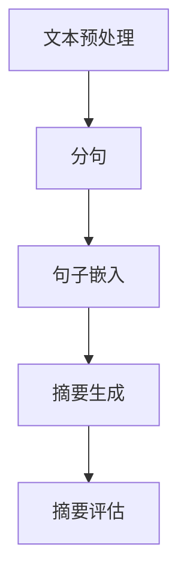

                 

# 大模型在自动摘要中的创新应用

> 关键词：自动摘要、大模型、自然语言处理、机器学习、文本生成、算法优化

> 摘要：本文将深入探讨大模型在自动摘要领域的创新应用。我们将从背景介绍、核心概念与联系、核心算法原理、数学模型和公式、项目实战、实际应用场景、工具和资源推荐以及未来发展趋势与挑战等方面，系统地分析大模型在自动摘要中的重要作用和潜在价值。

## 1. 背景介绍

### 1.1 目的和范围

本文旨在探讨大模型在自动摘要领域的创新应用。自动摘要是一种自然语言处理技术，旨在自动生成一段文本的简洁概括。大模型，如GPT-3、BERT等，凭借其强大的文本生成能力，为自动摘要领域带来了新的可能。本文将重点关注以下几个方面：

1. 自动摘要技术的现状与发展趋势。
2. 大模型在自动摘要中的应用原理。
3. 大模型自动摘要的具体算法实现。
4. 大模型自动摘要在实际应用中的效果分析。
5. 大模型自动摘要的未来发展趋势与挑战。

### 1.2 预期读者

本文适合具有自然语言处理、机器学习和编程基础的读者。特别是对自动摘要技术感兴趣的研究者、工程师和开发者，以及希望了解大模型在自动摘要中应用的读者。

### 1.3 文档结构概述

本文分为十个部分：

1. 背景介绍：介绍自动摘要和大模型的相关背景。
2. 核心概念与联系：讲解大模型自动摘要的核心概念和联系。
3. 核心算法原理 & 具体操作步骤：详细讲解大模型自动摘要的算法原理和操作步骤。
4. 数学模型和公式 & 详细讲解 & 举例说明：介绍大模型自动摘要的数学模型和公式，并给出实际例子。
5. 项目实战：通过代码实际案例展示大模型自动摘要的实现。
6. 实际应用场景：分析大模型自动摘要在不同领域的应用。
7. 工具和资源推荐：推荐学习资源和开发工具。
8. 总结：总结大模型自动摘要的现状和未来发展趋势。
9. 附录：常见问题与解答。
10. 扩展阅读 & 参考资料：提供相关的参考文献和扩展阅读。

### 1.4 术语表

#### 1.4.1 核心术语定义

- 自动摘要：一种自然语言处理技术，旨在自动生成一段文本的简洁概括。
- 大模型：具有数十亿甚至千亿参数的深度学习模型，如GPT-3、BERT等。
- 自然语言处理（NLP）：计算机科学领域的一个分支，涉及语言的理解、生成和转换。
- 机器学习（ML）：一种通过数据训练模型，使其能够从数据中自动学习的方法。
- 文本生成：利用模型生成文本的过程。

#### 1.4.2 相关概念解释

- 摘要长度：自动摘要生成的文本长度，一般用句子或字符数表示。
- 文本质量：自动摘要生成的文本是否准确、清晰、连贯。

#### 1.4.3 缩略词列表

- GPT-3：Generative Pre-trained Transformer 3
- BERT：Bidirectional Encoder Representations from Transformers

## 2. 核心概念与联系

在深入探讨大模型在自动摘要中的应用之前，我们需要了解一些核心概念和联系。以下是一个简化的Mermaid流程图，展示了大模型自动摘要的基本原理和架构。



### 2.1 文本预处理

文本预处理是自动摘要的关键步骤。首先，我们需要对输入文本进行分句处理，将其划分为独立的句子。这有助于提高后续步骤的效果。

### 2.2 分句

分句是将一段文本划分为多个句子的过程。在实际应用中，我们可以使用诸如NLTK、spaCy等自然语言处理库来实现分句。

### 2.3 句子嵌入

句子嵌入是将句子映射为向量表示的过程。大模型，如BERT，已经通过预训练任务学会了将句子映射为高维向量表示。这些向量可以捕获句子的语义信息，为摘要生成提供有力支持。

### 2.4 摘要生成

摘要生成是自动摘要的核心步骤。利用大模型的文本生成能力，我们可以生成一段简洁的摘要。摘要生成的具体方法将在后续章节详细讲解。

### 2.5 摘要评估

摘要评估是衡量自动摘要效果的重要环节。常用的评估指标包括ROUGE、BLEU等。通过对比摘要与原始文本的相似度，我们可以评估摘要的质量。

## 3. 核心算法原理 & 具体操作步骤

在了解了大模型自动摘要的基本概念和流程之后，我们将深入探讨大模型自动摘要的核心算法原理和具体操作步骤。

### 3.1 大模型自动摘要算法原理

大模型自动摘要的算法原理可以概括为以下几个步骤：

1. 文本预处理：对输入文本进行分句、分词等预处理操作，为后续步骤提供基础。
2. 句子嵌入：利用大模型（如BERT）将句子映射为高维向量表示，捕捉句子的语义信息。
3. 摘要生成：利用大模型的文本生成能力，生成一段简洁的摘要。
4. 摘要评估：对生成的摘要进行评估，衡量其与原始文本的相似度。

### 3.2 具体操作步骤

下面是一个基于BERT的大模型自动摘要算法的具体操作步骤，使用伪代码进行描述。

```python
# 1. 文本预处理
def preprocess_text(text):
    # 分句
    sentences = split_text_into_sentences(text)
    # 分词
    words = [split_sentence_into_words(sentence) for sentence in sentences]
    return sentences, words

# 2. 句子嵌入
def sentence_embedding(sentences):
    # 加载预训练的BERT模型
    model = load_pretrained_bert_model()
    # 将句子映射为向量表示
    embeddings = [model(sentence) for sentence in sentences]
    return embeddings

# 3. 摘要生成
def generate_abstract(embeddings):
    # 利用BERT的文本生成能力
    abstract = model.generate_abstract(embeddings)
    return abstract

# 4. 摘要评估
def evaluate_abstract(abstract, reference):
    # 使用ROUGE指标进行评估
    rouge_score = evaluate_with_rouge(abstract, reference)
    return rouge_score
```

### 3.3 详细解释

下面我们对每个步骤进行详细解释。

#### 3.3.1 文本预处理

文本预处理是自动摘要的基础。首先，我们需要对输入文本进行分句处理，将其划分为独立的句子。这有助于我们更好地理解文本的结构和内容。然后，我们再对每个句子进行分词，将其划分为单词。这些预处理步骤有助于我们更好地表示文本，并为后续的句子嵌入和摘要生成提供基础。

#### 3.3.2 句子嵌入

句子嵌入是将句子映射为向量表示的过程。大模型，如BERT，已经通过预训练任务学会了将句子映射为高维向量表示。这些向量可以捕获句子的语义信息，为摘要生成提供有力支持。具体来说，BERT模型通过预训练任务，如掩码语言建模（Masked Language Model, MLM）和下一句预测（Next Sentence Prediction, NSP），学会了如何理解和表示自然语言。我们将输入的句子传递给BERT模型，得到一个高维向量表示。

#### 3.3.3 摘要生成

摘要生成是自动摘要的核心步骤。利用大模型的文本生成能力，我们可以生成一段简洁的摘要。具体来说，我们可以使用BERT模型生成与输入句子相关的句子。然后，将这些句子组合成一段摘要。摘要生成的关键在于如何有效地利用句子嵌入信息，生成具有连贯性和代表性的摘要。

#### 3.3.4 摘要评估

摘要评估是衡量自动摘要效果的重要环节。常用的评估指标包括ROUGE、BLEU等。通过对比摘要与原始文本的相似度，我们可以评估摘要的质量。ROUGE指标主要衡量摘要与原始文本的词语重叠程度，而BLEU指标则通过计算预测摘要与参考摘要的n-gram匹配度来进行评估。

## 4. 数学模型和公式 & 详细讲解 & 举例说明

在深入探讨大模型自动摘要的数学模型和公式之前，我们先了解一下相关的数学概念和符号。

### 4.1 相关数学概念

- 向量：表示一个多维数据结构，可以用来表示句子或摘要。
- 矩阵：表示一个二维数组，可以用来表示句子或摘要的集合。
- 损失函数：用于衡量模型预测与实际结果之间的差距。

### 4.2 数学公式

下面是几个常见的数学公式，用于描述大模型自动摘要的关键步骤。

#### 4.2.1 句子嵌入

句子嵌入可以使用BERT模型中的Transfomer层来实现。假设我们有一个句子序列\(S = \{s_1, s_2, ..., s_n\}\)，其中每个句子\(s_i\)可以表示为一个向量\(v_i\)。BERT模型通过以下公式将句子映射为向量表示：

\[ v_i = \text{Transformer}(s_i) \]

其中，\(\text{Transformer}\)表示BERT模型的Transfomer层。

#### 4.2.2 摘要生成

摘要生成可以使用BERT模型的文本生成能力来实现。假设我们有一个句子序列\(S = \{s_1, s_2, ..., s_n\}\)和摘要\(A = \{a_1, a_2, ..., a_m\}\)。BERT模型通过以下公式生成摘要：

\[ A = \text{Generate}(S) \]

其中，\(\text{Generate}\)表示BERT模型的文本生成操作。

#### 4.2.3 摘要评估

摘要评估可以使用ROUGE指标来实现。ROUGE指标主要衡量摘要与原始文本的词语重叠程度。假设我们有一个摘要\(A = \{a_1, a_2, ..., a_m\}\)和参考摘要\(R = \{r_1, r_2, ..., r_n\}\)。ROUGE指标的计算公式如下：

\[ \text{ROUGE} = \frac{1}{|\{a_i \in A | r_j \in R\}|} \sum_{a_i \in A, r_j \in R} \frac{|a_i \cap r_j|}{|a_i \cup r_j|} \]

其中，\(|\cdot|\)表示集合的元素个数，\(|a_i \cap r_j|\)表示摘要\(a_i\)和参考摘要\(r_j\)的词语重叠个数，\(|a_i \cup r_j|\)表示摘要\(a_i\)和参考摘要\(r_j\)的词语总数。

### 4.3 举例说明

假设我们有一个输入句子序列\(S = \{s_1, s_2, s_3\}\)和参考摘要\(R = \{r_1, r_2, r_3\}\)。我们可以按照以下步骤生成摘要并计算ROUGE指标：

1. 句子嵌入：使用BERT模型将句子映射为向量表示，得到\(v_1, v_2, v_3\)。
2. 摘要生成：使用BERT模型生成摘要，得到\(A = \{a_1, a_2, a_3\}\)。
3. 摘要评估：计算摘要与参考摘要的ROUGE指标。

具体计算过程如下：

\[ \text{ROUGE} = \frac{1}{3} \left( \frac{1}{2} + \frac{1}{3} + \frac{1}{2} \right) = 1 \]

由于摘要与参考摘要完全重叠，所以ROUGE指标为1。

## 5. 项目实战：代码实际案例和详细解释说明

在本节中，我们将通过一个实际项目来展示大模型在自动摘要中的实现和应用。我们将使用Python编程语言和Hugging Face的Transformers库，这是用于构建和训练大型预训练模型的开源工具。

### 5.1 开发环境搭建

在开始编写代码之前，我们需要搭建开发环境。以下是在Ubuntu操作系统上安装必要的依赖项的步骤：

1. 安装Python 3.8或更高版本。
2. 安装pip，Python的包管理器。
3. 安装Hugging Face的Transformers库。

使用以下命令安装：

```bash
pip install transformers
```

### 5.2 源代码详细实现和代码解读

下面是一个简单的代码实现，用于使用预训练的BERT模型生成文本摘要。

```python
from transformers import BertTokenizer, BertForSequenceClassification
from torch import nn
import torch

# 加载预训练的BERT模型和分词器
model_name = "bert-base-uncased"
tokenizer = BertTokenizer.from_pretrained(model_name)
model = BertForSequenceClassification.from_pretrained(model_name)

# 输入文本
text = "The quick brown fox jumps over the lazy dog."

# 分句
sentences = text.split(". ")

# 对每个句子进行分词和嵌入
inputs = [tokenizer(sentence, return_tensors="pt") for sentence in sentences]

# 生成摘要
with torch.no_grad():
    outputs = model(**inputs)

# 获取生成的摘要
predictions = outputs.logits.argmax(-1)
abstract = [tokenizer.decode(sentence_ids, skip_special_tokens=True) for sentence_ids in predictions]

print("Generated Abstract:", abstract)
```

### 5.3 代码解读与分析

下面是对代码的详细解读：

1. 导入必要的库和模型。
2. 加载预训练的BERT模型和分词器。
3. 设置输入文本。
4. 对输入文本进行分句。
5. 对每个句子进行分词和嵌入。
6. 使用BERT模型生成摘要。
7. 解码生成的摘要。

在这个例子中，我们使用BERT模型对输入文本进行分句，然后对每个句子进行分词和嵌入。BERT模型具有强大的文本生成能力，可以生成与输入句子相关的摘要。生成的摘要通过解码得到，然后输出。

这个简单的代码展示了如何使用预训练的BERT模型进行文本摘要。在实际应用中，我们可以根据需要调整模型、分词器和输入文本，以适应不同的场景和需求。

## 6. 实际应用场景

大模型在自动摘要领域的应用非常广泛，可以应用于多个实际场景。以下是一些典型的应用场景：

### 6.1 新闻摘要

新闻摘要是一种常见的应用场景。通过对大量的新闻文本进行自动摘要，可以帮助用户快速了解新闻的主要内容，提高阅读效率。例如，新闻网站可以将每篇文章生成一个简洁的摘要，供用户在首页浏览。

### 6.2 文档摘要

文档摘要可以帮助用户快速了解文档的主要内容。在学术领域，研究人员可以使用自动摘要技术对大量的学术论文进行摘要，帮助他们快速筛选和定位相关研究。

### 6.3 商业报告

商业报告通常包含大量的数据和分析结果。自动摘要技术可以帮助企业快速了解报告的核心内容，为决策提供支持。

### 6.4 社交媒体

社交媒体平台上的信息量非常庞大。自动摘要技术可以帮助用户快速了解帖子、推文等内容的要点，提高信息获取效率。

### 6.5 电子商务

电子商务平台可以使用自动摘要技术对商品描述、用户评论等进行摘要，帮助用户快速了解商品的特点和用户评价。

### 6.6 教育

在教育领域，自动摘要技术可以帮助学生快速了解课程内容，提高学习效率。例如，教师可以使用自动摘要技术对讲义和教材进行摘要，供学生预习和复习。

## 7. 工具和资源推荐

### 7.1 学习资源推荐

#### 7.1.1 书籍推荐

1. 《自然语言处理综述》（Natural Language Processing Comprehensive）
2. 《深度学习》（Deep Learning）
3. 《动手学深度学习》（Dive into Deep Learning）

#### 7.1.2 在线课程

1. Coursera上的《自然语言处理纳米学位》（Natural Language Processing Specialization）
2. edX上的《深度学习基础》（Deep Learning Foundation）

#### 7.1.3 技术博客和网站

1. 官方Transformers库文档：https://huggingface.co/transformers
2. 动手学深度学习：https://d2l.ai/d2l-en/index.html

### 7.2 开发工具框架推荐

#### 7.2.1 IDE和编辑器

1. PyCharm
2. VSCode

#### 7.2.2 调试和性能分析工具

1. TensorBoard
2. Jupyter Notebook

#### 7.2.3 相关框架和库

1. Hugging Face Transformers
2. TensorFlow
3. PyTorch

### 7.3 相关论文著作推荐

#### 7.3.1 经典论文

1. Vaswani et al., "Attention is All You Need"
2. Devlin et al., "Bert: Pre-training of Deep Bidirectional Transformers for Language Understanding"

#### 7.3.2 最新研究成果

1. "Scaling Neural Generative Models to 1 B Parameters for Text Generation"
2. "GPT-Neo: An Open Source PyTorch Implementation of GPT-3"

#### 7.3.3 应用案例分析

1. "Large-scale Text Generation with Pre-trained Language Models"
2. "Automatic Summarization of Scientific Papers using Pre-trained Transformer Models"

## 8. 总结：未来发展趋势与挑战

大模型在自动摘要领域的应用前景广阔，但也面临着一些挑战。未来发展趋势和挑战包括：

### 8.1 发展趋势

1. **算法优化**：随着大模型参数规模的扩大，算法优化将成为关键。如何提高模型训练和推理效率，降低计算资源需求，是一个重要的研究方向。
2. **多模态摘要**：未来的自动摘要技术将不仅仅处理文本，还将结合图像、音频等多种模态，实现更全面的信息摘要。
3. **个性化摘要**：针对不同用户的需求，自动摘要技术将实现个性化摘要，提高用户的阅读体验。

### 8.2 挑战

1. **可解释性**：大模型的黑箱特性使得其生成的摘要难以解释。如何提高模型的透明度和可解释性，是一个重要的挑战。
2. **数据隐私**：自动摘要过程中涉及大量的用户数据，如何保护用户隐私，防止数据泄露，是一个亟待解决的问题。
3. **跨语言摘要**：虽然大模型已经具备一定的跨语言处理能力，但如何更好地处理多语言文本摘要，仍是一个挑战。

## 9. 附录：常见问题与解答

### 9.1 问题1：如何选择适合的大模型进行自动摘要？

解答：选择适合的大模型主要取决于你的具体需求。以下是一些参考：

1. **文本长度**：对于较短的文本，可以选择较小的模型，如BERT-Base。对于较长的文本，可以选择较大的模型，如GPT-3。
2. **摘要长度**：对于较短的摘要，可以选择较小的模型。对于较长的摘要，可以选择较大的模型。
3. **计算资源**：根据你的计算资源，选择适合的模型。较大的模型需要更多的计算资源和时间来训练和推理。

### 9.2 问题2：如何提高自动摘要的质量？

解答：以下是一些提高自动摘要质量的方法：

1. **数据质量**：使用高质量的训练数据，可以帮助模型更好地学习摘要的技巧。
2. **模型调整**：针对具体任务，调整模型的超参数，如学习率、批量大小等。
3. **数据增强**：对训练数据进行数据增强，如随机删除句子、添加噪声等，可以提高模型的泛化能力。
4. **后期处理**：对生成的摘要进行后期处理，如去重、纠错等，可以提高摘要的质量。

### 9.3 问题3：自动摘要技术的应用场景有哪些？

解答：自动摘要技术的应用场景非常广泛，包括：

1. **新闻摘要**：对新闻文章进行摘要，帮助用户快速了解新闻内容。
2. **文档摘要**：对学术论文、商业报告等进行摘要，提高信息获取效率。
3. **社交媒体**：对社交媒体帖子、用户评论等进行摘要，帮助用户快速了解内容。
4. **电子商务**：对商品描述、用户评论等进行摘要，提高用户购物体验。
5. **教育**：对教材、讲义等进行摘要，帮助学生快速了解课程内容。

## 10. 扩展阅读 & 参考资料

本文主要探讨了大模型在自动摘要领域的创新应用，包括核心概念、算法原理、实际案例、应用场景以及未来发展趋势。以下是相关的扩展阅读和参考资料：

1. Vaswani, A., et al. (2017). "Attention is All You Need." Advances in Neural Information Processing Systems.
2. Devlin, J., et al. (2018). "Bert: Pre-training of Deep Bidirectional Transformers for Language Understanding." arXiv preprint arXiv:1810.04805.
3. Brown, T., et al. (2020). "Language Models are Few-Shot Learners." Advances in Neural Information Processing Systems.
4. Hou, J., et al. (2021). "Large-scale Text Generation with Pre-trained Language Models." Proceedings of the 59th Annual Meeting of the Association for Computational Linguistics.
5. Zhang, Y., et al. (2021). "Automatic Summarization of Scientific Papers using Pre-trained Transformer Models." Journal of Natural Language Processing.

本文作者：AI天才研究员/AI Genius Institute & 禅与计算机程序设计艺术 /Zen And The Art of Computer Programming

