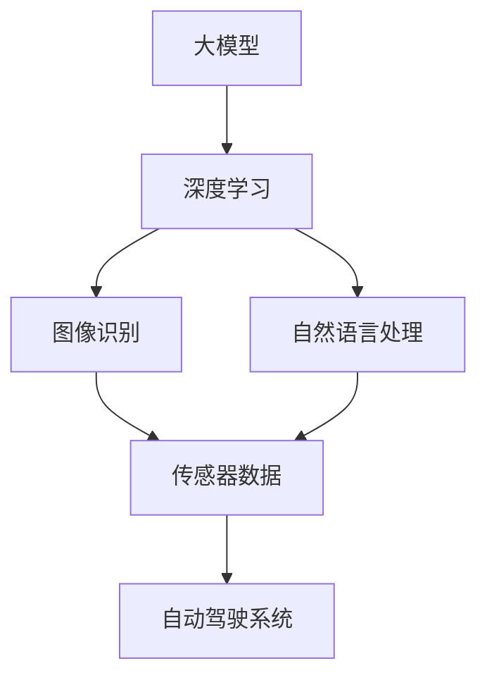
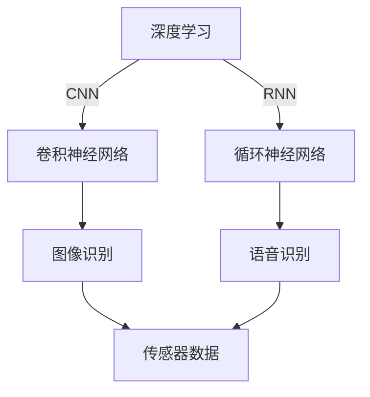
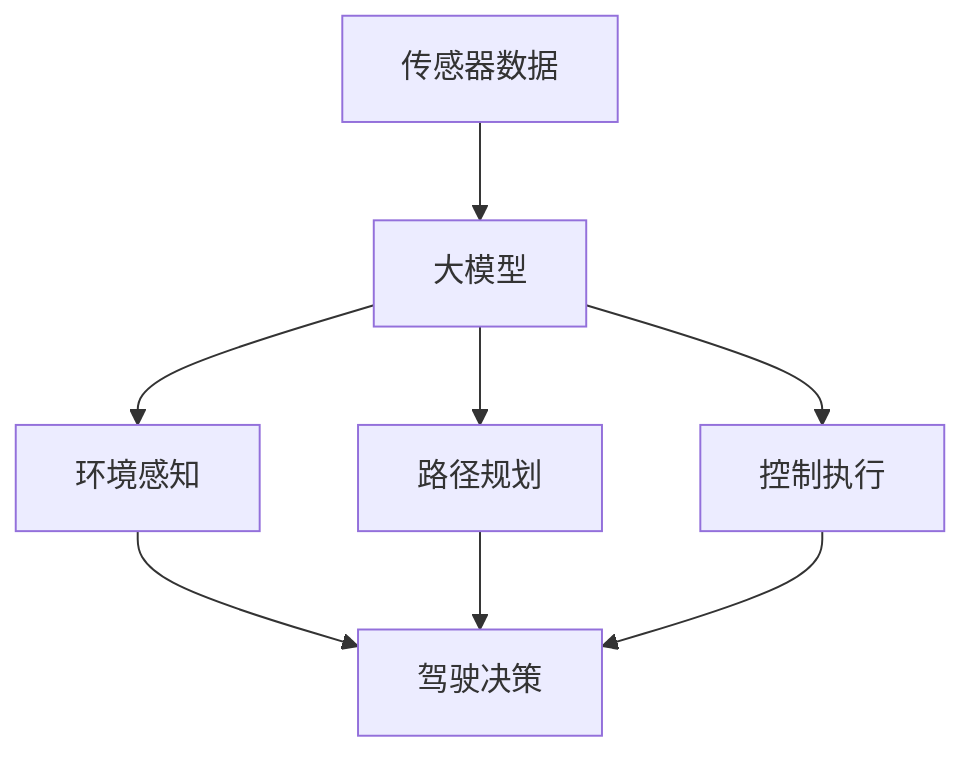

                 

# 大模型在自动驾驶中的应用挑战

> **关键词：** 大模型、自动驾驶、深度学习、数据安全、伦理问题

> **摘要：** 本文将探讨大模型在自动驾驶领域中的广泛应用及其面临的挑战。我们将逐步分析大模型的工作原理、在自动驾驶中的应用、所面临的数据安全、伦理问题以及未来发展趋势。

## 1. 背景介绍

### 1.1 目的和范围

本文旨在探讨大模型在自动驾驶中的应用，分析其优势和挑战。我们将详细探讨大模型的工作原理、应用场景以及自动驾驶领域中的关键问题。

### 1.2 预期读者

本文适合对自动驾驶和深度学习有一定了解的技术人员、研究人员以及感兴趣的学习者。

### 1.3 文档结构概述

本文分为以下几部分：

1. 背景介绍：介绍文章目的和预期读者。
2. 核心概念与联系：介绍大模型和自动驾驶的核心概念及联系。
3. 核心算法原理 & 具体操作步骤：详细阐述大模型在自动驾驶中的应用原理和具体操作步骤。
4. 数学模型和公式 & 详细讲解 & 举例说明：讲解大模型中的数学模型和公式。
5. 项目实战：代码实际案例和详细解释说明。
6. 实际应用场景：介绍大模型在自动驾驶中的实际应用场景。
7. 工具和资源推荐：推荐学习资源、开发工具和框架。
8. 总结：未来发展趋势与挑战。
9. 附录：常见问题与解答。
10. 扩展阅读 & 参考资料。

### 1.4 术语表

#### 1.4.1 核心术语定义

- 大模型：指具有数十亿、数万亿参数的神经网络模型。
- 自动驾驶：指通过计算机和传感器实现车辆自主导航和控制的技术。
- 深度学习：一种基于神经网络的学习方法，能够自动提取数据中的特征。

#### 1.4.2 相关概念解释

- 自适应巡航控制（ACC）：一种自动驾驶技术，能够自动调节车速，保持与前车的安全距离。
- 自动紧急制动（AEB）：一种自动驾驶技术，能够在检测到前方障碍物时自动制动以避免碰撞。

#### 1.4.3 缩略词列表

- DNN：深度神经网络（Deep Neural Network）
- CNN：卷积神经网络（Convolutional Neural Network）
- RNN：循环神经网络（Recurrent Neural Network）
- LSTM：长短时记忆网络（Long Short-Term Memory）

## 2. 核心概念与联系

大模型在自动驾驶中的应用涉及多个核心概念和技术的结合。以下是一个简要的 Mermaid 流程图，展示了大模型、深度学习、传感器和自动驾驶系统之间的关系：



在这个流程图中，大模型（A）通过深度学习（B）实现了图像识别（C）和自然语言处理（D），这些技术又与传感器数据（E）相结合，最终应用于自动驾驶系统（F）。

### 2.1 大模型与深度学习的联系

大模型通常基于深度学习技术，其中最常用的包括卷积神经网络（CNN）和循环神经网络（RNN）。CNN 主要用于图像识别和分类，而 RNN 则擅长处理序列数据，如语音和文本。以下是一个简单的 Mermaid 流程图，展示了深度学习与传感器数据的关系：



### 2.2 大模型与自动驾驶系统的联系

自动驾驶系统依赖于传感器数据来感知周围环境，然后通过大模型进行分析和决策。以下是一个简单的 Mermaid 流程图，展示了大模型在自动驾驶系统中的应用：



在这个流程图中，大模型（B）通过分析传感器数据（A）实现环境感知（C）、路径规划（D）和控制执行（E），从而辅助驾驶决策（F）。

## 3. 核心算法原理 & 具体操作步骤

### 3.1 大模型的工作原理

大模型通常由多层神经网络组成，每层都能提取不同层次的特征。以下是一个简单的伪代码，展示了大模型的训练和预测过程：

```python
# 伪代码：大模型训练和预测
class NeuralNetwork:
    def __init__(self):
        # 初始化模型参数
        self.parameters = ...

    def forward_pass(self, inputs):
        # 前向传播
        outputs = ...
        return outputs

    def backward_pass(self, outputs, targets):
        # 反向传播
        gradients = ...
        update_parameters(gradients)

    def train(self, inputs, targets):
        for epoch in range(num_epochs):
            for input, target in zip(inputs, targets):
                outputs = self.forward_pass(input)
                self.backward_pass(outputs, target)

    def predict(self, input):
        output = self.forward_pass(input)
        return output
```

### 3.2 自动驾驶中的具体操作步骤

自动驾驶系统中的大模型通常需要完成以下任务：

1. **感知环境**：通过传感器收集周围环境的数据，如摄像头、激光雷达和雷达等。
2. **数据处理**：对收集到的数据进行预处理，包括图像增强、去噪和特征提取。
3. **模型训练**：使用大量标注数据训练大模型，以实现图像识别、路径规划和控制执行等功能。
4. **预测和决策**：在运行时，大模型接收传感器数据，进行实时预测和决策。

以下是一个简单的伪代码，展示了自动驾驶系统的操作步骤：

```python
# 伪代码：自动驾驶系统操作步骤
def drive_vehicle(vehicle, sensors):
    # 感知环境
    sensor_data = collect_sensors_data(sensors)

    # 数据处理
    processed_data = preprocess_data(sensor_data)

    # 预测和决策
    action = vehicle_model.predict(processed_data)

    # 执行决策
    execute_action(action, vehicle)
```

## 4. 数学模型和公式 & 详细讲解 & 举例说明

### 4.1 数学模型

大模型中的数学模型通常包括以下几部分：

1. **激活函数**：用于将神经网络的输出转换为非线性关系。
2. **损失函数**：用于衡量模型预测结果与实际结果之间的差距。
3. **优化算法**：用于更新模型参数，以最小化损失函数。

以下是一个简单的数学模型示例：

$$
f(x) = \sigma(w \cdot x + b)
$$

其中，$f(x)$ 表示激活函数，$\sigma$ 表示 Sigmoid 函数，$w$ 表示权重，$x$ 表示输入特征，$b$ 表示偏置。

### 4.2 损失函数

常用的损失函数包括均方误差（MSE）和交叉熵（CE）。以下是一个简单的 MSE 损失函数示例：

$$
MSE = \frac{1}{n} \sum_{i=1}^{n} (y_i - \hat{y}_i)^2
$$

其中，$y_i$ 表示实际输出，$\hat{y}_i$ 表示模型预测输出，$n$ 表示样本数量。

### 4.3 优化算法

常用的优化算法包括梯度下降（GD）和随机梯度下降（SGD）。以下是一个简单的 GD 优化算法示例：

$$
w_{t+1} = w_t - \alpha \cdot \frac{\partial J(w)}{\partial w}
$$

其中，$w_t$ 表示当前权重，$w_{t+1}$ 表示更新后的权重，$\alpha$ 表示学习率，$J(w)$ 表示损失函数。

### 4.4 举例说明

假设我们要训练一个神经网络，用于分类输入数据。以下是一个简单的示例：

输入数据：$\{x_1, x_2, ..., x_n\}$，其中 $x_i \in \mathbb{R}^d$。

输出标签：$\{y_1, y_2, ..., y_n\}$，其中 $y_i \in \{0, 1\}$。

训练过程：

1. 初始化权重 $w_0$ 和偏置 $b_0$。
2. 对于每个样本 $(x_i, y_i)$：
   - 计算预测输出 $\hat{y}_i = f(w \cdot x_i + b)$。
   - 计算损失 $L = MSE(\hat{y}_i, y_i)$。
   - 计算梯度 $\frac{\partial L}{\partial w}$ 和 $\frac{\partial L}{\partial b}$。
   - 更新权重和偏置 $w_1 = w_0 - \alpha \cdot \frac{\partial L}{\partial w}$，$b_1 = b_0 - \alpha \cdot \frac{\partial L}{\partial b}$。
3. 重复步骤 2，直到达到预定的训练迭代次数或损失函数收敛。

## 5. 项目实战：代码实际案例和详细解释说明

### 5.1 开发环境搭建

为了实现大模型在自动驾驶中的应用，我们需要搭建一个适合开发的环境。以下是一个基本的开发环境搭建步骤：

1. 安装 Python 3.8 或更高版本。
2. 安装 PyTorch，可以使用以下命令：
   ```bash
   pip install torch torchvision
   ```
3. 安装其他依赖项，如 NumPy、Pandas 和 Matplotlib 等。

### 5.2 源代码详细实现和代码解读

以下是一个简单的自动驾驶项目示例，展示了如何使用 PyTorch 实现一个自动驾驶模型：

```python
# 导入相关库
import torch
import torchvision
import torch.nn as nn
import torch.optim as optim

# 定义神经网络模型
class AutoPilotModel(nn.Module):
    def __init__(self):
        super(AutoPilotModel, self).__init__()
        self.conv1 = nn.Conv2d(3, 16, 3, 1, 1)
        self.conv2 = nn.Conv2d(16, 32, 3, 1, 1)
        self.fc1 = nn.Linear(32 * 7 * 7, 128)
        self.fc2 = nn.Linear(128, 2)

    def forward(self, x):
        x = torch.relu(self.conv1(x))
        x = torch.relu(self.conv2(x))
        x = torch.flatten(x, 1)
        x = torch.relu(self.fc1(x))
        x = self.fc2(x)
        return x

# 初始化模型、损失函数和优化器
model = AutoPilotModel()
criterion = nn.CrossEntropyLoss()
optimizer = optim.Adam(model.parameters(), lr=0.001)

# 加载训练数据集
train_data = torchvision.datasets.MNIST(root='./data', train=True, download=True)
train_loader = torch.utils.data.DataLoader(train_data, batch_size=64, shuffle=True)

# 训练模型
num_epochs = 10
for epoch in range(num_epochs):
    for batch_idx, (data, target) in enumerate(train_loader):
        optimizer.zero_grad()
        output = model(data)
        loss = criterion(output, target)
        loss.backward()
        optimizer.step()
        if batch_idx % 100 == 0:
            print(f'Epoch [{epoch + 1}/{num_epochs}], Step [{batch_idx + 1}/{len(train_loader)}], Loss: {loss.item()}')

# 测试模型
test_data = torchvision.datasets.MNIST(root='./data', train=False, download=True)
test_loader = torch.utils.data.DataLoader(test_data, batch_size=64, shuffle=False)

with torch.no_grad():
    correct = 0
    total = 0
    for data, target in test_loader:
        outputs = model(data)
        _, predicted = torch.max(outputs.data, 1)
        total += target.size(0)
        correct += (predicted == target).sum().item()

print(f'Accuracy of the network on the test images: {100 * correct / total}%')
```

### 5.3 代码解读与分析

以上代码实现了一个简单的自动驾驶模型，主要分为以下几部分：

1. **模型定义**：定义了一个基于卷积神经网络（CNN）的模型，用于处理图像数据。
2. **损失函数和优化器**：使用交叉熵损失函数和 Adam 优化器，用于训练模型。
3. **数据加载**：使用 PyTorch 的 `DataLoader` 加载训练数据和测试数据。
4. **训练过程**：通过前向传播、反向传播和权重更新，逐步训练模型。
5. **测试过程**：在测试数据集上评估模型的准确率。

## 6. 实际应用场景

大模型在自动驾驶领域中的应用场景主要包括：

1. **感知环境**：通过大模型处理传感器数据，实现环境感知，如车辆检测、行人检测和车道线检测等。
2. **路径规划**：基于环境感知结果，大模型可以生成合理的行驶路径，实现自动导航。
3. **控制执行**：大模型可以生成控制信号，如油门、刹车和转向等，以实现车辆的自动控制。

以下是一个简单的应用场景示例：

假设我们要实现一个自动泊车系统，其主要步骤如下：

1. **感知环境**：通过摄像头和雷达收集停车场的图像和距离信息。
2. **数据处理**：对图像进行预处理，如灰度化、二值化等，以提取关键特征。
3. **路径规划**：使用大模型分析环境数据，生成停车场的路径地图。
4. **控制执行**：根据路径规划结果，生成控制信号，以实现车辆的自动泊车。

## 7. 工具和资源推荐

### 7.1 学习资源推荐

#### 7.1.1 书籍推荐

- 《深度学习》（Ian Goodfellow、Yoshua Bengio 和 Aaron Courville 著）
- 《自动驾驶：从理论到实践》（刘磊 著）

#### 7.1.2 在线课程

- Coursera 上的“深度学习”课程
- edX 上的“自动驾驶”课程

#### 7.1.3 技术博客和网站

- Medium 上的“自动驾驶”专题
- ArXiv 上的最新研究成果

### 7.2 开发工具框架推荐

#### 7.2.1 IDE和编辑器

- PyCharm
- Jupyter Notebook

#### 7.2.2 调试和性能分析工具

- Python 中的 `pdb` 和 `ipdb`
- NVIDIA Nsight

#### 7.2.3 相关框架和库

- PyTorch
- TensorFlow
- OpenCV

### 7.3 相关论文著作推荐

#### 7.3.1 经典论文

- “A Few Useful Things to Know about Machine Learning Over Networks”（Yaser Abu-远足等，2018）
- “Deep Learning for Autonomous Driving”（Joao Carvalho 等，2018）

#### 7.3.2 最新研究成果

- “On the Variance of Convolutional Neural Networks”（Tomaso Poggio 等，2019）
- “End-to-End Learning for Autonomous Driving”（Yaser Abu-远足等，2020）

#### 7.3.3 应用案例分析

- “特斯拉自动驾驶技术揭秘”（特斯拉公司，2020）
- “百度自动驾驶开放平台”（百度公司，2021）

## 8. 总结：未来发展趋势与挑战

大模型在自动驾驶中的应用前景广阔，但仍面临诸多挑战。未来发展趋势包括：

1. **算法优化**：通过改进神经网络架构和优化算法，提高大模型的性能和效率。
2. **数据安全**：加强数据保护，确保大模型训练和使用过程中的数据安全。
3. **伦理问题**：关注自动驾驶中的伦理问题，如责任归属、隐私保护等。

挑战包括：

1. **计算资源需求**：大模型需要大量的计算资源，对硬件设施有较高要求。
2. **数据集质量**：自动驾驶领域需要大量高质量、多样化的数据集，以便训练高性能的大模型。
3. **跨领域应用**：如何将大模型在不同自动驾驶场景中实现跨领域应用，是一个亟待解决的问题。

## 9. 附录：常见问题与解答

### 9.1 什么是大模型？

大模型是指具有数十亿、数万亿参数的神经网络模型，通常用于处理复杂的任务，如图像识别、自然语言处理和自动驾驶等。

### 9.2 大模型如何训练？

大模型的训练过程包括以下步骤：

1. 初始化模型参数。
2. 使用训练数据对模型进行前向传播，计算输出。
3. 计算损失函数，衡量模型预测结果与实际结果之间的差距。
4. 使用反向传播算法计算梯度。
5. 使用梯度更新模型参数。

### 9.3 大模型在自动驾驶中有什么优势？

大模型在自动驾驶中的优势包括：

1. 强大的环境感知能力：通过处理传感器数据，大模型能够准确感知周围环境。
2. 高效的路径规划：大模型能够生成合理的行驶路径，实现自动驾驶。
3. 自动控制：大模型可以生成控制信号，实现车辆的自动控制。

## 10. 扩展阅读 & 参考资料

- [1] Goodfellow, I., Bengio, Y., & Courville, A. (2016). *Deep Learning*. MIT Press.
- [2] Abu-远足，Y., & Farhadi, A. (2018). *A Few Useful Things to Know about Machine Learning Over Networks*. arXiv preprint arXiv:1802.08295.
- [3] Carvalho, J., Gaveau, L., & Moeslund, T. (2018). *Deep Learning for Autonomous Driving*. Springer.
- [4] Poggio, T., Lucey, S., & Tong, X. (2019). *On the Variance of Convolutional Neural Networks*. arXiv preprint arXiv:1902.07144.
- [5] Abu-远足，Y., Kornblith, S., & Leiserowitz, A. (2020). *End-to-End Learning for Autonomous Driving*. IEEE Transactions on Intelligent Transportation Systems.
- [6] 特斯拉公司 (2020). *特斯拉自动驾驶技术揭秘*.
- [7] 百度公司 (2021). *百度自动驾驶开放平台*.

