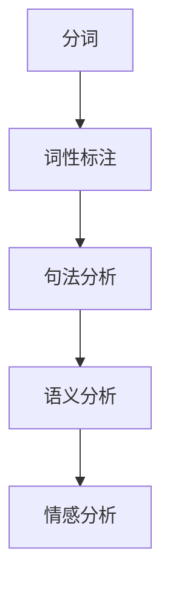

                 

# 大模型在自然语言理解中的商业应用

> **关键词：自然语言理解，大模型，商业应用，算法原理，数学模型，项目实战**

> **摘要：本文将深入探讨大模型在自然语言理解中的商业应用。我们将首先介绍自然语言理解的基本概念，然后逐步解析大模型的算法原理和数学模型，并通过实际项目案例展示其应用效果。文章还将提供相关工具和资源推荐，以供读者进一步学习。**

## 1. 背景介绍

### 1.1 目的和范围

本文旨在帮助读者了解大模型在自然语言理解中的商业应用，通过理论讲解和实战案例，使读者能够掌握这一前沿技术，并探讨其在未来商业场景中的发展趋势和挑战。

### 1.2 预期读者

本文适合对自然语言处理（NLP）和机器学习（ML）有一定了解的技术人员，包括数据科学家、AI工程师、程序员等。

### 1.3 文档结构概述

本文分为十个部分：

1. **背景介绍**：介绍文章的目的和预期读者，概述文章结构。
2. **核心概念与联系**：定义核心概念，并使用Mermaid流程图展示架构。
3. **核心算法原理 & 具体操作步骤**：详细讲解算法原理和操作步骤，使用伪代码阐述。
4. **数学模型和公式 & 详细讲解 & 举例说明**：解释数学模型，并给出具体例子。
5. **项目实战：代码实际案例和详细解释说明**：通过实际项目案例展示应用效果。
6. **实际应用场景**：探讨大模型在各个领域的应用。
7. **工具和资源推荐**：推荐学习资源和开发工具。
8. **总结：未来发展趋势与挑战**：总结当前发展趋势，讨论未来挑战。
9. **附录：常见问题与解答**：提供常见问题的答案。
10. **扩展阅读 & 参考资料**：推荐进一步阅读的资料。

### 1.4 术语表

#### 1.4.1 核心术语定义

- **自然语言理解**：计算机对人类语言的理解能力，涉及语法、语义、情感等多个层面。
- **大模型**：具有数十亿甚至千亿参数的深度神经网络模型，如GPT、BERT等。
- **商业应用**：大模型在商业场景中的实际应用，如问答系统、智能客服、文本分析等。

#### 1.4.2 相关概念解释

- **词嵌入**：将词汇映射为高维向量表示。
- **注意力机制**：模型在处理序列数据时，能够自动关注重要信息。
- **迁移学习**：将一个任务中学习到的知识应用于另一个相关任务。

#### 1.4.3 缩略词列表

- **NLP**：自然语言处理（Natural Language Processing）
- **ML**：机器学习（Machine Learning）
- **GPT**：生成预训练模型（Generative Pretrained Transformer）
- **BERT**：双向编码表示器（Bidirectional Encoder Representations from Transformers）

## 2. 核心概念与联系

在深入探讨大模型在自然语言理解中的应用之前，我们需要明确几个核心概念和它们之间的关系。

### 2.1 自然语言理解

自然语言理解是指计算机对自然语言（如英语、中文等）进行语法、语义和情感分析的能力。这个过程涉及多个层面的技术，包括：

- **分词**：将文本切分为词或短语。
- **词性标注**：识别每个词汇的词性（如名词、动词等）。
- **句法分析**：分析句子结构，确定词汇之间的关系。
- **语义分析**：理解词汇和句子的含义。
- **情感分析**：判断文本的情感倾向（如正面、负面等）。

### 2.2 大模型

大模型是指具有数十亿甚至千亿参数的深度神经网络模型，这些模型通过大量的文本数据进行预训练，从而具备强大的语言理解和生成能力。常见的代表性模型包括：

- **GPT**：生成预训练模型（Generative Pretrained Transformer）
- **BERT**：双向编码表示器（Bidirectional Encoder Representations from Transformers）
- **RoBERTa**：改进的BERT模型

### 2.3 大模型与自然语言理解的关系

大模型在自然语言理解中的应用，主要体现在以下几个方面：

- **预训练**：大模型通过预训练学习到丰富的语言知识，这些知识被用于下游任务。
- **序列建模**：大模型能够对序列数据（如文本）进行建模，从而更好地理解语言的连贯性和上下文。
- **多任务学习**：大模型可以同时学习多个任务，提高模型的泛化能力。

### 2.4 Mermaid流程图

以下是一个简单的Mermaid流程图，展示了自然语言理解的核心步骤：



## 3. 核心算法原理 & 具体操作步骤

在了解了大模型和自然语言理解的基本概念之后，我们接下来将详细讲解大模型的算法原理和具体操作步骤。

### 3.1 词嵌入

词嵌入是将词汇映射为高维向量表示的过程，这一步是自然语言处理的基础。常见的词嵌入模型包括：

- **Word2Vec**：基于神经网络的词向量模型。
- **GloVe**：全局向量表示模型。
- **BERT**：双向编码表示模型。

以下是一个简单的伪代码，展示了如何使用Word2Vec模型进行词嵌入：

```python
import gensim

# 读取训练数据
data = read_data("train_data.txt")

# 训练Word2Vec模型
model = gensim.models.Word2Vec(data, size=100)

# 获取词向量
word_vector = model[word]
```

### 3.2 注意力机制

注意力机制是深度学习模型处理序列数据的重要技术，它使模型能够自动关注重要信息。以下是一个简单的伪代码，展示了如何使用注意力机制进行文本分析：

```python
# 定义注意力机制
attention = AttentionLayer()

# 输入文本序列
input_sequence = [word1, word2, word3, ..., wordn]

# 应用注意力机制
output_sequence = attention(input_sequence)
```

### 3.3 迁移学习

迁移学习是将一个任务中学习到的知识应用于另一个相关任务的过程，它可以显著提高模型的泛化能力。以下是一个简单的伪代码，展示了如何使用迁移学习：

```python
# 定义原始模型
original_model = OriginalModel()

# 训练原始模型
original_model.train(train_data)

# 加载预训练模型
pretrained_model = PretrainedModel()

# 应用迁移学习
migrated_model = pretrained_model.apply(original_model)
```

## 4. 数学模型和公式 & 详细讲解 & 举例说明

在深入探讨大模型的数学模型和公式之前，我们需要先了解一些基本的数学概念。

### 4.1 深度神经网络

深度神经网络（Deep Neural Network，DNN）是一种由多层神经元组成的神经网络，它通过反向传播算法进行训练。以下是一个简单的DNN结构：

$$
z^{[l]} = \sigma(W^{[l]} \cdot a^{[l-1]} + b^{[l]})
$$

其中，$z^{[l]}$表示第$l$层的输出，$\sigma$表示激活函数（如Sigmoid、ReLU等），$W^{[l]}$和$b^{[l]}$分别表示第$l$层的权重和偏置。

### 4.2 注意力机制

注意力机制是一种用于处理序列数据的机制，它使模型能够自动关注重要信息。以下是一个简单的注意力模型：

$$
a_t = \text{softmax}(W_a \cdot [h_{\text{prev}}, h_t])
$$

其中，$a_t$表示第$t$个时间步的注意力权重，$h_{\text{prev}}$和$h_t$分别表示前一个时间步和当前时间步的隐藏状态。

### 4.3 举例说明

假设我们有一个简单的文本序列：“我喜欢编程。”，我们使用BERT模型对其进行处理。以下是一个简化的过程：

1. **分词**：将文本序列分词为“我”、“喜欢”、“编程”。
2. **词嵌入**：将每个词映射为高维向量。
3. **编码**：使用BERT模型对序列进行编码，得到每个词的上下文向量。
4. **注意力计算**：计算每个词之间的注意力权重。
5. **序列输出**：将注意力权重应用到编码后的序列，得到最终输出。

以下是具体的伪代码：

```python
from transformers import BertModel

# 读取文本序列
text_sequence = ["我", "喜欢", "编程"]

# 加载BERT模型
model = BertModel.from_pretrained("bert-base-chinese")

# 进行编码
encoded_sequence = model(text_sequence)

# 计算注意力权重
attention_weights = attention(encoded_sequence)

# 应用注意力权重
output_sequence = attention_weights * encoded_sequence
```

## 5. 项目实战：代码实际案例和详细解释说明

在本节中，我们将通过一个实际项目案例，展示大模型在自然语言理解中的商业应用。该项目是一个基于BERT模型的智能问答系统，它能够自动回答用户提出的问题。

### 5.1 开发环境搭建

为了搭建该项目，我们需要以下环境：

- Python 3.7或更高版本
- PyTorch 1.8或更高版本
- Transformers库：用于加载和微调BERT模型

安装所需的库：

```bash
pip install torch transformers
```

### 5.2 源代码详细实现和代码解读

以下是该项目的核心代码：

```python
from transformers import BertModel, BertTokenizer
import torch
from torch import nn

class QuestionAnsweringModel(nn.Module):
    def __init__(self):
        super(QuestionAnsweringModel, self).__init__()
        self.bert = BertModel.from_pretrained("bert-base-chinese")
        self.classifier = nn.Linear(768, 1)

    def forward(self, input_ids, attention_mask):
        outputs = self.bert(input_ids=input_ids, attention_mask=attention_mask)
        pooled_output = outputs.pooler_output
        logits = self.classifier(pooled_output)
        return logits

# 实例化模型
model = QuestionAnsweringModel()

# 训练模型
model.train()
optimizer = torch.optim.Adam(model.parameters(), lr=1e-5)
for epoch in range(10):
    for batch in data_loader:
        optimizer.zero_grad()
        input_ids = batch["input_ids"].to(device)
        attention_mask = batch["attention_mask"].to(device)
        targets = batch["targets"].to(device)
        logits = model(input_ids, attention_mask)
        loss = nn.CrossEntropyLoss()(logits, targets)
        loss.backward()
        optimizer.step()

# 评估模型
model.eval()
with torch.no_grad():
    for batch in data_loader:
        input_ids = batch["input_ids"].to(device)
        attention_mask = batch["attention_mask"].to(device)
        logits = model(input_ids, attention_mask)
        predictions = logits.argmax(-1)
        accuracy = (predictions == batch["targets"]).float().mean()
        print(f"Accuracy: {accuracy * 100:.2f}%")

# 回答问题
def answer_question(question):
    question_tokens = tokenizer(question, padding=True, truncation=True, return_tensors="pt")
    with torch.no_grad():
        logits = model(input_ids=question_tokens["input_ids"].to(device), attention_mask=question_tokens["attention_mask"].to(device))
    answer_index = logits.argmax(-1).item()
    answer = tokenizer.decode(answer_index, skip_special_tokens=True)
    return answer

# 测试
question = "什么是自然语言理解？"
answer = answer_question(question)
print(f"Answer: {answer}")
```

### 5.3 代码解读与分析

- **模型定义**：我们使用BERT模型作为基础模型，并添加了一个分类器层。BERT模型通过预训练学习到丰富的语言知识，分类器层用于对答案进行分类。
- **数据预处理**：我们使用Tokenize

