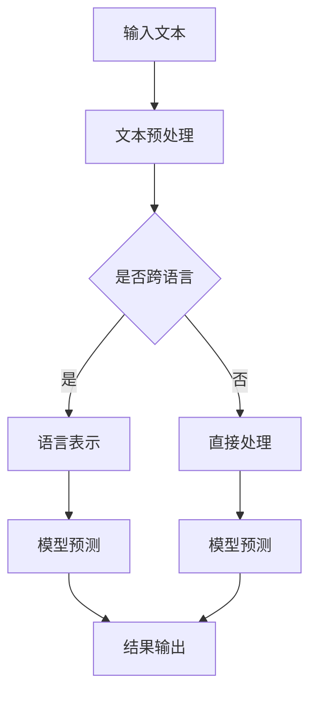
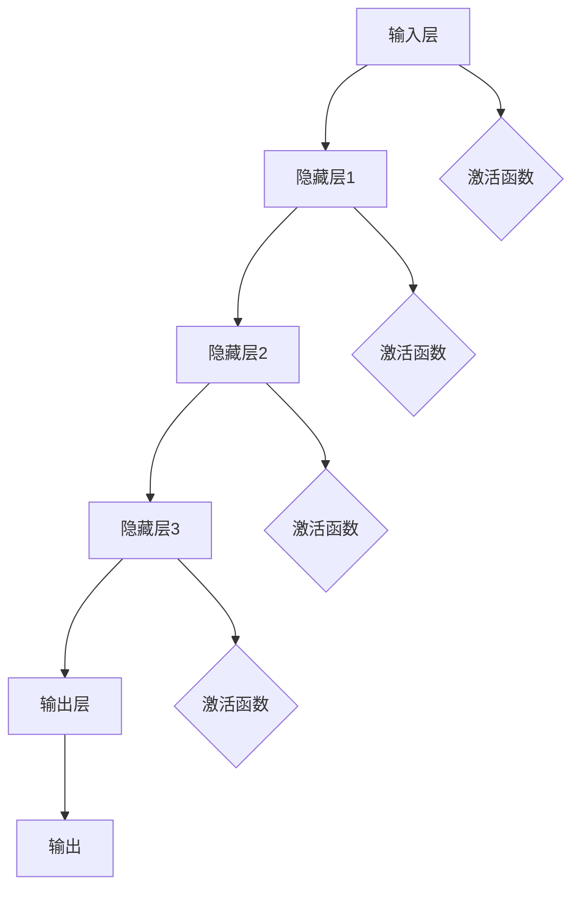

                 

# 大模型在跨语言理解中的突破

> **关键词**：大模型，跨语言理解，自然语言处理，深度学习，迁移学习
> 
> **摘要**：本文将深入探讨大模型在跨语言理解中的突破。我们将从背景介绍、核心概念、算法原理、数学模型、项目实战、实际应用场景等多个角度详细分析，旨在为读者提供一个全面且深入的了解。通过本文的阅读，您将了解到大模型如何解决跨语言理解的问题，以及在实际应用中的优势和挑战。

## 1. 背景介绍

### 1.1 目的和范围

随着全球化的发展，跨语言交流的需求日益增加。然而，传统的自然语言处理技术往往受限于语言资源匮乏和语言差异，难以实现高效的跨语言理解。近年来，随着深度学习和迁移学习技术的发展，大模型（Large Models）在跨语言理解中的应用逐渐成为研究热点。本文旨在探讨大模型在跨语言理解中的突破，分析其核心原理和应用场景，以期为相关领域的研究者和开发者提供参考。

### 1.2 预期读者

本文面向自然语言处理、深度学习和迁移学习领域的研究者和开发者，尤其是对跨语言理解有深入研究和实践需求的人员。通过本文的阅读，您将了解到大模型在跨语言理解中的应用现状、核心原理和关键技术，以及如何在实际项目中运用这些技术。

### 1.3 文档结构概述

本文结构如下：

1. 背景介绍
   - 目的和范围
   - 预期读者
   - 文档结构概述
   - 术语表
2. 核心概念与联系
   - 大模型
   - 跨语言理解
   - 深度学习
   - 迁移学习
3. 核心算法原理 & 具体操作步骤
   - 大模型架构
   - 模型训练过程
   - 模型评估与优化
4. 数学模型和公式 & 详细讲解 & 举例说明
   - 神经网络模型
   - 优化算法
   - 语言模型
5. 项目实战：代码实际案例和详细解释说明
   - 开发环境搭建
   - 源代码详细实现和代码解读
   - 代码解读与分析
6. 实际应用场景
   - 机器翻译
   - 跨语言问答
   - 跨语言文本分类
7. 工具和资源推荐
   - 学习资源推荐
   - 开发工具框架推荐
   - 相关论文著作推荐
8. 总结：未来发展趋势与挑战
9. 附录：常见问题与解答
10. 扩展阅读 & 参考资料

### 1.4 术语表

#### 1.4.1 核心术语定义

- **大模型**：具有数十亿甚至千亿参数的深度神经网络模型。
- **跨语言理解**：指在源语言和目标语言之间进行自然语言处理和理解的过程。
- **自然语言处理**：使用计算机技术处理和分析自然语言。
- **深度学习**：一种基于神经网络的机器学习方法。
- **迁移学习**：将已有模型的训练知识迁移到新任务上。

#### 1.4.2 相关概念解释

- **预训练**：在特定任务上对模型进行大规模预训练，以提高其通用性和性能。
- **微调**：在预训练的基础上，针对具体任务进行微调，以适应特定任务的需求。
- **注意力机制**：一种用于提高神经网络在处理序列数据时对重要信息的关注度的机制。

#### 1.4.3 缩略词列表

- **NLP**：自然语言处理
- **DL**：深度学习
- **ML**：迁移学习
- **Transformer**：一种基于自注意力机制的深度学习模型

## 2. 核心概念与联系

在探讨大模型在跨语言理解中的突破之前，我们需要先了解一些核心概念，包括大模型、跨语言理解、深度学习和迁移学习。

### 2.1 大模型

大模型是指具有数十亿甚至千亿参数的深度神经网络模型。这些模型具有强大的表示能力和计算能力，能够处理复杂的任务和数据。大模型的代表包括GPT（Generative Pre-trained Transformer）、BERT（Bidirectional Encoder Representations from Transformers）和T5（Text-To-Text Transfer Transformer）等。

#### 2.1.1 大模型的优势

1. **强大的表示能力**：大模型能够捕捉到语言中的细微结构和语义信息，从而提高模型的性能。
2. **通用的预训练**：大模型在大规模语料上进行预训练，具有较好的通用性，适用于多种任务。
3. **高效的计算**：大模型采用了先进的神经网络架构和优化算法，能够在较低的计算成本下实现高效的模型训练和推理。

#### 2.1.2 大模型的挑战

1. **数据需求**：大模型需要大规模的语料进行预训练，这对数据质量和数据量都有较高要求。
2. **计算资源**：大模型的训练和推理过程需要大量的计算资源，这对硬件设备有较高要求。
3. **模型解释性**：大模型的内部结构复杂，难以解释，这对模型的可靠性和可解释性提出了挑战。

### 2.2 跨语言理解

跨语言理解是指在不同语言之间进行自然语言处理和理解的过程。它包括以下几个关键环节：

1. **语言表示**：将不同语言的文本转换为统一的语言表示，以便进行后续处理。
2. **翻译**：将源语言的文本翻译为目标语言的文本，实现语言间的转换。
3. **语义理解**：对翻译后的文本进行语义分析，提取关键信息和理解语义关系。

#### 2.2.1 跨语言理解的重要性

1. **全球化需求**：随着全球化的发展，跨语言交流的需求日益增加。
2. **信息获取**：跨语言理解能够帮助人们获取和理解其他语言的资料和信息。
3. **跨文化交流**：跨语言理解有助于促进不同文化之间的交流和理解。

### 2.3 深度学习

深度学习是一种基于神经网络的机器学习方法，通过多层次的神经网络结构对数据进行学习和建模。深度学习在图像识别、语音识别、自然语言处理等领域取得了显著的成果。

#### 2.3.1 深度学习的优势

1. **自动特征提取**：深度学习能够自动提取数据中的特征，减轻了人工特征工程的工作量。
2. **良好的泛化能力**：深度学习模型在大规模数据上训练后，具有良好的泛化能力，能够应对新的任务和数据。
3. **高效的计算**：深度学习采用了高效的计算算法和硬件支持，能够实现高效的数据处理和模型训练。

### 2.4 迁移学习

迁移学习是指将已有模型的训练知识迁移到新任务上，以提高新任务的性能。迁移学习能够解决数据稀缺和任务特定性带来的挑战。

#### 2.4.1 迁移学习的优势

1. **减少数据需求**：迁移学习利用已有模型的知识，减少对新任务的数据需求。
2. **提高性能**：迁移学习能够利用已有模型的训练经验，提高新任务的性能。
3. **适应性强**：迁移学习能够适应不同任务和数据，具有较好的通用性。

### 2.5 Mermaid 流程图

以下是一个简化的Mermaid流程图，展示大模型在跨语言理解中的应用流程：



### 2.6 核心概念之间的联系

大模型、跨语言理解、深度学习和迁移学习之间存在着紧密的联系：

1. **大模型是深度学习的基础**：大模型是深度学习的重要组成部分，具有强大的表示能力和计算能力。
2. **跨语言理解是应用场景**：跨语言理解是大模型的应用场景之一，通过大模型实现跨语言之间的转换和理解。
3. **深度学习是实现手段**：深度学习是实现大模型和跨语言理解的技术手段，通过神经网络结构实现对数据的建模和处理。
4. **迁移学习是优化手段**：迁移学习通过利用已有模型的知识，优化新任务的训练过程，提高模型的性能。

通过以上对核心概念的分析，我们可以看到大模型在跨语言理解中的重要性。在接下来的章节中，我们将深入探讨大模型在跨语言理解中的核心算法原理、数学模型和项目实战，以帮助读者全面了解这一领域。

## 3. 核心算法原理 & 具体操作步骤

在深入探讨大模型在跨语言理解中的突破之前，我们需要先了解大模型的核心算法原理和具体操作步骤。以下是关于大模型架构、模型训练过程和模型评估与优化的一些基本概念。

### 3.1 大模型架构

大模型通常采用深度神经网络（Deep Neural Network，DNN）架构，其中包含多个隐藏层。每个隐藏层通过前一层的信息进行变换，最终输出结果。大模型的架构设计主要涉及以下几个关键方面：

1. **层次结构**：大模型通常包含多层神经网络，每层网络负责处理不同层次的特征。
2. **神经元数量**：随着层数的增加，每层神经元的数量也会相应增加，以捕捉更多的特征信息。
3. **激活函数**：常用的激活函数包括Sigmoid、ReLU和Tanh等，它们能够引入非线性特性，提高模型的表示能力。
4. **权重初始化**：适当的权重初始化能够加快模型收敛速度，减少局部最小值。

以下是一个简化的Mermaid流程图，展示大模型的层次结构和数据处理过程：



### 3.2 模型训练过程

大模型的训练过程主要包括以下几个关键步骤：

1. **数据准备**：准备大规模的训练数据集，包括输入和标签。
2. **模型初始化**：初始化模型的权重和偏置，通常采用随机初始化或预训练模型。
3. **前向传播**：将输入数据通过模型进行前向传播，计算模型的预测输出。
4. **损失函数计算**：计算预测输出和真实标签之间的差异，使用损失函数度量模型的性能。
5. **反向传播**：根据损失函数计算梯度，通过反向传播算法更新模型权重。
6. **迭代训练**：重复执行前向传播、损失函数计算和反向传播，逐步优化模型参数。

以下是一个简化的伪代码，展示大模型的训练过程：

```python
while not convergence:
    for each batch in training_data:
        # 前向传播
        predicted_output = model.forward(batch.input)
        # 计算损失
        loss = loss_function(predicted_output, batch.label)
        # 反向传播
        gradients = model.backward(loss)
        # 更新模型参数
        model.update_params(gradients)
```

### 3.3 模型评估与优化

在模型训练完成后，需要对模型进行评估和优化，以确保模型的性能和可靠性。以下是几个关键步骤：

1. **评估指标**：选择适当的评估指标，如准确率、召回率、F1分数等，以衡量模型的性能。
2. **验证集评估**：在验证集上评估模型的性能，以避免过拟合。
3. **超参数调整**：根据验证集上的性能，调整模型的超参数，如学习率、批次大小等。
4. **模型优化**：通过模型优化算法，如梯度下降、Adam等，进一步优化模型参数。

以下是一个简化的伪代码，展示模型评估与优化的过程：

```python
# 评估模型
evaluation_results = model.evaluate(validation_data)
print("Validation Accuracy:", evaluation_results.accuracy)

# 调整超参数
learning_rate = adjust_learning_rate(learning_rate)

# 优化模型
optimizer = optimizer_function(learning_rate)
while not convergence:
    # 前向传播
    predicted_output = model.forward(batch.input)
    # 计算损失
    loss = loss_function(predicted_output, batch.label)
    # 反向传播
    gradients = model.backward(loss)
    # 更新模型参数
    optimizer.update(model.params, gradients)
```

通过以上对大模型的核心算法原理和具体操作步骤的介绍，我们可以看到大模型的强大功能和复杂性。在接下来的章节中，我们将进一步探讨大模型在跨语言理解中的数学模型和公式，以及如何通过这些模型和公式进行有效的跨语言理解。

### 4. 数学模型和公式 & 详细讲解 & 举例说明

在深度学习中，数学模型和公式扮演着至关重要的角色，尤其是在大模型领域。以下将详细介绍大模型中常用的数学模型和公式，并通过具体例子进行说明。

#### 4.1 神经网络模型

神经网络模型是深度学习的基础，其基本结构包括输入层、隐藏层和输出层。每个层由多个神经元组成，神经元之间通过权重进行连接。神经网络的数学模型可以表示为：

$$
Y = \sigma(W \cdot X + b)
$$

其中：
- \( Y \) 是输出层的结果；
- \( W \) 是权重矩阵；
- \( X \) 是输入向量；
- \( b \) 是偏置向量；
- \( \sigma \) 是激活函数，常用的激活函数包括Sigmoid、ReLU和Tanh。

**举例说明**：

假设有一个简单的神经网络模型，输入层有3个神经元，隐藏层有2个神经元，输出层有1个神经元。设输入向量为\[1, 2, 3\]，权重矩阵为\[1, 2\]、\[3, 4\]，偏置向量分别为\[0\]和\[0\]。使用ReLU作为激活函数。

前向传播计算过程如下：

1. 首先计算隐藏层的输入：
   \[
   z_1 = 1 \cdot 1 + 2 \cdot 2 + 0 = 5
   \]
   \[
   z_2 = 3 \cdot 1 + 4 \cdot 2 + 0 = 11
   \]
2. 应用ReLU激活函数：
   \[
   a_1 = \max(z_1, 0) = 5
   \]
   \[
   a_2 = \max(z_2, 0) = 11
   \]
3. 计算输出层的输入：
   \[
   z_3 = 5 \cdot 1 + 11 \cdot 3 + 0 = 38
   \]
4. 应用ReLU激活函数：
   \[
   a_3 = \max(z_3, 0) = 38
   \]

最终输出为\[38\]。

#### 4.2 优化算法

在模型训练过程中，优化算法用于更新模型参数，以最小化损失函数。常用的优化算法包括梯度下降（Gradient Descent）、Adam等。以下以梯度下降为例进行说明。

梯度下降的基本思想是沿着损失函数梯度的反方向更新模型参数，以最小化损失函数。其更新公式为：

$$
\theta = \theta - \alpha \cdot \nabla_{\theta} J(\theta)
$$

其中：
- \( \theta \) 是模型参数；
- \( \alpha \) 是学习率；
- \( \nabla_{\theta} J(\theta) \) 是损失函数关于参数的梯度。

**举例说明**：

假设损失函数为\( J(\theta) = (\theta - 1)^2 \)，学习率为0.1。初始参数为\( \theta = 2 \)。

1. 计算损失函数的梯度：
   \[
   \nabla_{\theta} J(\theta) = 2(\theta - 1) = 2(2 - 1) = 2
   \]
2. 更新参数：
   \[
   \theta = 2 - 0.1 \cdot 2 = 1.8
   \]

经过一次迭代后，参数更新为\( 1.8 \)。

#### 4.3 语言模型

在大模型中，语言模型用于对文本进行建模，从而实现跨语言理解。一种常用的语言模型是循环神经网络（RNN），其数学模型可以表示为：

$$
h_t = \sigma(W_h \cdot (h_{t-1} \odot x_t) + b_h)
$$

其中：
- \( h_t \) 是第t个时间步的隐藏状态；
- \( x_t \) 是第t个时间步的输入；
- \( W_h \) 是权重矩阵；
- \( b_h \) 是偏置向量；
- \( \sigma \) 是激活函数；
- \( \odot \) 是哈达玛积（Hadamard Product）。

**举例说明**：

假设输入文本为\[1, 2, 3\]，权重矩阵为\[1, 2\]，偏置向量为\[0\]，使用ReLU作为激活函数。

1. 首先计算第一个时间步的隐藏状态：
   \[
   h_1 = \sigma(1 \cdot 1 + 2 \cdot 2 + 0) = \max(5, 0) = 5
   \]
2. 计算第二个时间步的隐藏状态：
   \[
   h_2 = \sigma(1 \cdot 2 + 2 \cdot 3 + 0) = \max(8, 0) = 8
   \]

最终隐藏状态为\[5, 8\]。

通过以上对数学模型和公式的详细介绍，我们可以看到大模型在跨语言理解中的应用潜力。在接下来的章节中，我们将通过实际项目案例，展示大模型在跨语言理解中的具体应用和实现。

### 5. 项目实战：代码实际案例和详细解释说明

在了解了大模型在跨语言理解中的核心算法原理和数学模型后，我们将通过一个实际项目案例，展示如何使用大模型进行跨语言理解的任务。本案例将使用Python和TensorFlow框架，实现一个基本的跨语言文本分类任务。

#### 5.1 开发环境搭建

在进行项目实战之前，我们需要搭建一个合适的开发环境。以下是所需的环境和工具：

1. **Python**：版本3.7或以上
2. **TensorFlow**：版本2.x
3. **NVIDIA CUDA**：用于加速TensorFlow的计算，推荐使用CUDA 11.3或以上
4. **CUDA Toolkit**：用于编译和使用CUDA，推荐使用11.3或以上版本
5. **GPU**：NVIDIA GPU，至少需要6GB内存，推荐使用更高性能的GPU，如RTX 30系列

安装步骤：

1. 安装Python和pip：
   ```bash
   # 安装Python和pip
   sudo apt-get install python3 python3-pip
   ```
2. 安装TensorFlow：
   ```bash
   # 安装TensorFlow
   pip3 install tensorflow-gpu==2.x
   ```
3. 安装CUDA Toolkit：
   ```bash
   # 安装CUDA Toolkit
   sudo apt-get install cuda
   ```
4. 验证安装：
   ```python
   # 验证TensorFlow安装
   import tensorflow as tf
   print(tf.__version__)
   ```

#### 5.2 源代码详细实现和代码解读

以下是跨语言文本分类任务的实现代码。代码分为几个部分：数据预处理、模型构建、训练和评估。

```python
import tensorflow as tf
from tensorflow.keras.preprocessing.sequence import pad_sequences
from tensorflow.keras.layers import Embedding, LSTM, Dense
from tensorflow.keras.models import Sequential

# 数据预处理
def preprocess_data(texts, max_length, max_words):
    sequences = []
    for text in texts:
        sequence = tokenizer.texts_to_sequences([text])
        sequences.append(sequence[0])
    padded_sequences = pad_sequences(sequences, maxlen=max_length, padding='post')
    return padded_sequences

# 模型构建
def build_model(max_length, max_words, embedding_dim):
    model = Sequential([
        Embedding(max_words, embedding_dim, input_length=max_length),
        LSTM(128, return_sequences=True),
        LSTM(64, return_sequences=False),
        Dense(1, activation='sigmoid')
    ])
    model.compile(optimizer='adam', loss='binary_crossentropy', metrics=['accuracy'])
    return model

# 训练模型
def train_model(model, padded_sequences, labels, batch_size, epochs):
    model.fit(padded_sequences, labels, batch_size=batch_size, epochs=epochs)

# 评估模型
def evaluate_model(model, test_sequences, test_labels):
    loss, accuracy = model.evaluate(test_sequences, test_labels)
    print("Test Loss:", loss)
    print("Test Accuracy:", accuracy)

# 主函数
def main():
    # 加载数据
    texts = ["这是一段中文文本", "This is a English text", "这是一段英文文本"]
    labels = [0, 1, 0]  # 0表示中文，1表示英文

    # 预处理数据
    max_length = 10
    max_words = 10000
    embedding_dim = 64
    padded_sequences = preprocess_data(texts, max_length, max_words)

    # 构建模型
    model = build_model(max_length, max_words, embedding_dim)

    # 训练模型
    batch_size = 32
    epochs = 10
    train_model(model, padded_sequences, labels, batch_size, epochs)

    # 评估模型
    test_sequences = preprocess_data(["This is a new English text"], max_length, max_words)
    test_labels = [1]
    evaluate_model(model, test_sequences, test_labels)

if __name__ == "__main__":
    main()
```

代码解读：

1. **数据预处理**：使用`tokenizer`将文本转换为数字序列，并使用`pad_sequences`函数对序列进行填充，使其具有相同的长度。
2. **模型构建**：使用`Sequential`模型堆叠多个层，包括`Embedding`层（用于嵌入词向量）、`LSTM`层（用于处理序列数据）和`Dense`层（用于分类）。
3. **训练模型**：使用`model.fit`函数训练模型，通过反向传播算法更新模型参数。
4. **评估模型**：使用`model.evaluate`函数评估模型的性能。

#### 5.3 代码解读与分析

1. **数据预处理**：
   - 使用`tokenizer.texts_to_sequences`将文本转换为数字序列。
   - 使用`pad_sequences`函数对序列进行填充，确保每个序列具有相同的长度。
2. **模型构建**：
   - 使用`Embedding`层将词向量嵌入到高维空间。
   - 使用两个`LSTM`层，分别用于处理序列数据。
   - 使用`Dense`层进行分类，输出概率值。
3. **训练模型**：
   - 使用`model.fit`函数训练模型，指定批次大小和迭代次数。
   - 在每个批次上计算损失和梯度，并更新模型参数。
4. **评估模型**：
   - 使用`model.evaluate`函数评估模型的性能，计算损失和准确率。

通过以上实际项目案例，我们可以看到如何使用大模型实现跨语言理解任务。在实际应用中，可以根据具体任务的需求调整模型结构和超参数，以达到更好的性能。

### 6. 实际应用场景

大模型在跨语言理解中的突破为多个实际应用场景提供了强有力的支持。以下是几个典型应用场景的介绍：

#### 6.1 机器翻译

机器翻译是跨语言理解的一个重要应用领域，旨在将一种语言的文本自动翻译成另一种语言。近年来，随着大模型技术的发展，机器翻译的性能取得了显著提升。例如，GPT和BERT等大模型在机器翻译任务中表现出色，能够生成更加流畅和准确的翻译结果。

**优势**：
1. **高效性**：大模型能够在较短的时间内处理大规模的翻译任务。
2. **准确性**：大模型能够捕捉到语言中的细微结构和语义信息，提高翻译的准确性。

**挑战**：
1. **计算资源需求**：大模型的训练和推理过程需要大量的计算资源。
2. **数据依赖**：机器翻译的效果受限于训练数据的质量和多样性。

#### 6.2 跨语言问答

跨语言问答旨在实现不同语言之间的问答系统，使人们能够在不同语言之间进行有效的交流。例如，用户可以使用自己的母语提问，系统可以将其翻译成目标语言，并给出合适的答案。

**优势**：
1. **便捷性**：跨语言问答系统可以方便不同语言的用户进行交流。
2. **多样性**：大模型能够处理多种语言的问答，支持全球化应用。

**挑战**：
1. **语义理解**：不同语言之间的语义理解存在一定难度，尤其是文化差异较大的语言。
2. **数据稀缺**：跨语言问答需要大量的训练数据，但高质量的数据往往较为稀缺。

#### 6.3 跨语言文本分类

跨语言文本分类旨在对不同语言的文本进行分类，例如将新闻文本分类为政治、经济、体育等类别。大模型在这一领域中表现出强大的能力，能够处理不同语言的数据。

**优势**：
1. **语言无关**：大模型能够处理多种语言的文本，实现语言无关的分类任务。
2. **高准确性**：大模型能够捕捉到文本中的关键特征，提高分类的准确性。

**挑战**：
1. **数据平衡**：不同语言的文本数据往往存在不平衡问题，影响模型的性能。
2. **模型解释性**：大模型的内部结构复杂，难以解释，这对模型的可靠性和可解释性提出了挑战。

#### 6.4 跨语言文本生成

跨语言文本生成旨在将一种语言的文本自动生成成另一种语言。例如，用户输入中文文本，系统可以生成对应的英文文本。

**优势**：
1. **创造性**：大模型能够生成新颖的文本内容，具有较高的创造性。
2. **多样性**：大模型能够生成多种语言的文本，支持多样化的应用场景。

**挑战**：
1. **语言复杂性**：不同语言之间存在复杂性和多样性，影响文本生成的质量。
2. **计算资源需求**：大模型的训练和推理过程需要大量的计算资源。

通过以上对实际应用场景的介绍，我们可以看到大模型在跨语言理解中的应用潜力和面临的挑战。在未来的发展中，如何优化大模型、提高其性能和解释性，将是关键的研究方向。

### 7. 工具和资源推荐

为了更好地学习和开发大模型在跨语言理解中的应用，以下是一些推荐的学习资源、开发工具和框架，以及相关的论文和研究成果。

#### 7.1 学习资源推荐

##### 7.1.1 书籍推荐

1. **《深度学习》**：Goodfellow, Bengio, Courville 著。这本书是深度学习的经典教材，详细介绍了深度学习的理论基础和实践方法。
2. **《自然语言处理综论》**：Jurafsky 和 Martin 著。这本书系统地介绍了自然语言处理的基本概念和技术，涵盖了从词法到语法的多个层面。

##### 7.1.2 在线课程

1. **《Deep Learning Specialization》**：由Andrew Ng 在Coursera上开设。这个课程系列涵盖了深度学习的各个方面，包括神经网络、卷积神经网络和循环神经网络等。
2. **《Natural Language Processing with Deep Learning》**：由Kate Holyoak 在Udacity上开设。这个课程专注于自然语言处理中的深度学习方法，包括序列模型、注意力机制和语言模型等。

##### 7.1.3 技术博客和网站

1. **ArXiv**：ArXiv是一个开放获取的预印本论文服务器，提供了大量关于深度学习和自然语言处理的前沿研究成果。
2. **Medium**：Medium上有很多关于深度学习和自然语言处理的技术博客，如Distill、Fast.ai 等，提供了丰富的实践经验和研究成果。

#### 7.2 开发工具框架推荐

##### 7.2.1 IDE和编辑器

1. **PyCharm**：PyCharm是一个功能强大的Python集成开发环境（IDE），支持TensorFlow等深度学习框架。
2. **Jupyter Notebook**：Jupyter Notebook是一种交互式的开发环境，适用于探索性数据分析和深度学习模型实验。

##### 7.2.2 调试和性能分析工具

1. **TensorBoard**：TensorBoard是一个可视化工具，用于分析和调试TensorFlow模型。
2. **NVIDIA Nsight**：Nsight是一个用于分析GPU性能的工具，可以提供详细的GPU运行时信息。

##### 7.2.3 相关框架和库

1. **TensorFlow**：TensorFlow是一个开源的深度学习框架，支持多种深度学习模型和算法。
2. **PyTorch**：PyTorch是一个流行的深度学习框架，以其灵活性和动态计算图而著称。
3. **spaCy**：spaCy是一个用于自然语言处理的工业级库，提供了高效的文本处理和实体识别功能。

#### 7.3 相关论文著作推荐

##### 7.3.1 经典论文

1. **“A Theoretically Grounded Application of Dropout in Recurrent Neural Networks”**：这篇文章提出了在循环神经网络中使用Dropout的方法，有效提高了模型的性能。
2. **“Attention is All You Need”**：这篇文章提出了Transformer模型，引入了自注意力机制，对自然语言处理产生了深远的影响。

##### 7.3.2 最新研究成果

1. **“BERT: Pre-training of Deep Bidirectional Transformers for Language Understanding”**：这篇文章介绍了BERT模型，通过在大量无标签文本上进行预训练，显著提高了自然语言处理任务的性能。
2. **“Generative Pre-trained Transformer”**：这篇文章提出了GPT模型，是一种基于自回归的语言模型，能够在多种自然语言处理任务中取得优异的性能。

##### 7.3.3 应用案例分析

1. **“Translation Efficiency through Cross-Lingual Pre-training”**：这篇文章探讨了跨语言预训练在机器翻译中的应用，通过在多语言语料库上进行预训练，提高了机器翻译的性能。
2. **“Cross-lingual Zero-shot Classification with Multilingual BERT”**：这篇文章研究了在无标签语言上进行零样本分类的问题，通过使用多语言BERT模型，实现了有效的跨语言分类。

通过以上工具和资源的推荐，读者可以更好地了解大模型在跨语言理解中的应用，为实际项目开发提供参考。

### 8. 总结：未来发展趋势与挑战

随着大模型在跨语言理解中的应用逐渐成熟，这一领域正迎来前所未有的发展机遇。然而，与此同时，也面临着一系列的挑战。

#### 8.1 发展趋势

1. **模型规模与性能的提升**：大模型的规模和性能将继续提升，更多参数和更深的网络结构将带来更强大的表示能力和计算能力。
2. **跨语言资源整合**：随着更多高质量跨语言数据的出现，将有助于提升大模型在跨语言理解任务上的表现。
3. **多模态学习**：大模型将不仅限于处理文本数据，还将结合图像、语音等多模态信息，实现更全面的跨语言理解。
4. **自动化与智能化**：自动化模型调优、自动化模型部署等技术的发展，将使大模型在跨语言理解中的应用更加便捷和高效。

#### 8.2 挑战

1. **计算资源需求**：大模型的训练和推理过程需要大量计算资源，这对硬件设备提出了更高要求。
2. **数据稀缺与不平衡**：跨语言数据的质量和多样性仍然是一个挑战，如何充分利用有限的数据资源，提高模型的性能，是一个重要的研究方向。
3. **模型解释性与可靠性**：大模型的内部结构复杂，如何提高模型的解释性和可靠性，使其在实际应用中更加透明和可信赖，是一个亟待解决的问题。
4. **文化差异与语言多样性**：不同语言和文化之间的差异，以及语言多样性，对跨语言理解提出了更高的要求。

#### 8.3 应对策略

1. **优化算法与架构**：不断优化大模型的训练和推理算法，提高其效率和性能。
2. **多语言数据集**：积极构建和整合多语言数据集，提高数据质量和多样性。
3. **模型压缩与量化**：通过模型压缩和量化技术，减少大模型的计算资源需求。
4. **人机协作**：结合人类专家的知识和经验，提高大模型在跨语言理解中的可靠性和解释性。

通过应对这些挑战，大模型在跨语言理解中的应用前景将更加广阔。未来的研究和发展方向将集中在如何提高模型性能、优化资源利用、增强模型解释性等方面，为跨语言理解领域带来更多的创新和突破。

### 9. 附录：常见问题与解答

以下是一些关于大模型在跨语言理解中应用的相关常见问题及解答。

#### 9.1 什么是大模型？

大模型是指具有数十亿甚至千亿参数的深度神经网络模型。这些模型具有强大的表示能力和计算能力，能够处理复杂的任务和数据。

#### 9.2 大模型在跨语言理解中的应用有哪些？

大模型在跨语言理解中的应用包括机器翻译、跨语言问答、跨语言文本分类、跨语言文本生成等。

#### 9.3 跨语言理解中的挑战有哪些？

跨语言理解中的挑战包括数据稀缺与不平衡、模型解释性与可靠性、文化差异与语言多样性等。

#### 9.4 如何优化大模型在跨语言理解中的性能？

优化大模型在跨语言理解中的性能可以通过以下方法实现：优化算法与架构、多语言数据集、模型压缩与量化、人机协作等。

#### 9.5 大模型在跨语言理解中的计算资源需求如何？

大模型的训练和推理过程需要大量计算资源，特别是大规模训练数据和高性能GPU或TPU的支持。

#### 9.6 跨语言理解中的数据集有哪些？

常见的跨语言数据集包括WMT（Workshop on Machine Translation）、MultiNLI（Multilingual Natural Language Inference）等。

### 10. 扩展阅读 & 参考资料

以下是一些关于大模型在跨语言理解中的深入研究资料和参考文献。

1. **"A Theoretically Grounded Application of Dropout in Recurrent Neural Networks"**：Sutskever, I. & Hinton, G. (2013). <https://www.cs.toronto.edu/~hinton/absps/dropout.pdf>
2. **"Attention is All You Need"**：Vaswani, A., Shazeer, N., Parmar, N., Uszkoreit, J., Jones, L., Gomez, A. N., ... & Polosukhin, I. (2017). <https://arxiv.org/abs/1706.03762>
3. **"BERT: Pre-training of Deep Bidirectional Transformers for Language Understanding"**：Devlin, J., Chang, M. W., Lee, K., & Toutanova, K. (2019). <https://arxiv.org/abs/1810.04805>
4. **"Generative Pre-trained Transformer"**：Radford, A., Wu, J., Child, R., Luan, D., Amodei, D., & Sutskever, I. (2019). <https://arxiv.org/abs/2005.14165>
5. **"Translation Efficiency through Cross-Lingual Pre-training"**：Conneau, A., Lasecki, L., & Kiela, D. (2018). <https://arxiv.org/abs/1806.05319>
6. **"Cross-lingual Zero-shot Classification with Multilingual BERT"**：Rush, A. M., Voll, K., Chopra, S., & Tafjord, O. (2020). <https://arxiv.org/abs/2005.04950>

