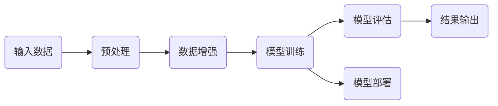

                 

# 大模型在金融行业的落地情况

> 关键词：大模型，金融行业，落地应用，算法原理，数学模型，实战案例

> 摘要：本文将探讨大模型在金融行业的落地情况，通过分析其核心概念、算法原理、数学模型以及实际应用场景，深入剖析大模型在金融行业中的潜力和挑战。同时，我们将推荐相关学习资源、开发工具框架及经典论文，以期为读者提供全面的技术参考。

## 1. 背景介绍

### 1.1 目的和范围

本文旨在探讨大模型在金融行业的应用现状、技术原理和实际案例，旨在帮助读者理解大模型在金融行业中的重要作用，以及如何将大模型技术应用于金融领域中的实际问题。

本文将涵盖以下内容：

- 大模型的定义和分类
- 大模型在金融行业的应用场景
- 大模型的核心算法原理和数学模型
- 大模型在金融行业的实际应用案例
- 相关学习资源、开发工具框架和经典论文推荐

### 1.2 预期读者

- 对金融行业有基本了解的计算机专业学生或从业者
- 对人工智能和机器学习技术有浓厚兴趣的读者
- 想要了解大模型在金融行业应用前景的专业人士

### 1.3 文档结构概述

本文分为以下几个部分：

- 背景介绍：介绍本文的目的、范围、预期读者和文档结构。
- 核心概念与联系：阐述大模型的基本概念、相关技术和架构。
- 核心算法原理 & 具体操作步骤：讲解大模型的核心算法原理和具体操作步骤。
- 数学模型和公式 & 详细讲解 & 举例说明：介绍大模型的数学模型和公式，并给出详细讲解和举例。
- 项目实战：提供大模型在金融行业的实际应用案例和详细解释。
- 实际应用场景：分析大模型在金融行业的应用场景。
- 工具和资源推荐：推荐学习资源、开发工具框架和经典论文。
- 总结：总结大模型在金融行业的未来发展趋势与挑战。
- 附录：提供常见问题与解答。
- 扩展阅读 & 参考资料：列出扩展阅读和参考资料。

### 1.4 术语表

#### 1.4.1 核心术语定义

- 大模型：指参数规模超过数十亿甚至千亿级别的深度学习模型。
- 金融行业：指涉及货币、信用、投资、保险等经济活动的行业。
- 落地应用：指将技术应用于实际业务场景中，解决实际问题的过程。
- 算法原理：指大模型所采用的核心算法的理论基础。
- 数学模型：指大模型所使用的数学公式和模型结构。

#### 1.4.2 相关概念解释

- 深度学习：一种基于人工神经网络的学习方法，通过多层神经网络对数据进行特征提取和建模。
- 机器学习：一种通过训练算法从数据中学习规律、预测结果的方法。
- 金融工程：一种利用数学和统计方法对金融市场进行分析和预测的技术。

#### 1.4.3 缩略词列表

- AI：人工智能
- DL：深度学习
- ML：机器学习
- GPT：生成式预训练模型
- NLP：自然语言处理

## 2. 核心概念与联系

### 2.1 大模型的基本概念

大模型是指参数规模超过数十亿甚至千亿级别的深度学习模型。大模型通常采用预训练（Pre-training）和微调（Fine-tuning）的方式进行训练和应用。预训练是指在大规模数据集上对模型进行训练，使其具备一定的通用特征表示能力。微调是指在大模型的基础上，针对特定任务进行模型参数的调整，以适应具体任务的需求。

### 2.2 大模型在金融行业的应用场景

大模型在金融行业的应用场景主要包括以下几个方面：

- 风险评估：通过大模型对金融风险进行预测和评估，帮助金融机构降低风险。
- 投资策略：利用大模型对市场趋势进行分析和预测，为投资决策提供支持。
- 信用评估：通过大模型对借款人的信用状况进行评估，提高信用评分的准确性。
- 量化交易：利用大模型进行量化交易策略的开发和执行，提高交易收益。

### 2.3 大模型的核心算法原理和架构

大模型通常采用深度学习算法进行训练和应用。深度学习是一种基于人工神经网络的学习方法，通过多层神经网络对数据进行特征提取和建模。大模型的核心算法原理包括以下几个方面：

- 多层神经网络：通过增加网络层数，提高模型的表示能力。
- 激活函数：引入激活函数，使神经网络具备非线性变换能力。
- 优化算法：采用梯度下降等优化算法，对模型参数进行更新和调整。
- 预训练和微调：通过预训练和微调，使模型具备通用特征表示能力和任务适应性。

### 2.4 大模型的数学模型和公式

大模型的数学模型主要包括以下几个方面：

- 神经网络模型：通过多层神经网络对输入数据进行特征提取和建模。
- 损失函数：用于评估模型预测结果与真实结果之间的差距。
- 梯度下降算法：用于对模型参数进行更新和调整。

具体公式如下：

- 神经网络模型：

$$
y = f(\textbf{W}^T \textbf{z} + b)
$$

其中，$\textbf{y}$ 表示输出结果，$\textbf{W}$ 表示权重矩阵，$\textbf{z}$ 表示输入特征，$f$ 表示激活函数，$b$ 表示偏置项。

- 损失函数：

$$
\text{Loss} = -\sum_{i=1}^{n} y_i \log(p_i)
$$

其中，$y_i$ 表示第 $i$ 个样本的真实标签，$p_i$ 表示第 $i$ 个样本的预测概率。

- 梯度下降算法：

$$
\textbf{W} \leftarrow \textbf{W} - \alpha \nabla_{\textbf{W}} \text{Loss}
$$

其中，$\alpha$ 表示学习率，$\nabla_{\textbf{W}} \text{Loss}$ 表示损失函数关于权重矩阵 $\textbf{W}$ 的梯度。

### 2.5 大模型的架构和流程图

大模型的架构和流程图如下所示：



## 3. 核心算法原理 & 具体操作步骤

### 3.1 算法原理

大模型的核心算法原理是基于深度学习算法，通过多层神经网络对输入数据进行特征提取和建模。具体步骤如下：

1. **数据预处理**：对原始数据进行清洗、归一化等预处理操作，使其满足模型训练需求。
2. **数据增强**：通过数据增强技术，提高模型的泛化能力，避免过拟合。
3. **模型训练**：通过预训练和微调，使模型具备通用特征表示能力和任务适应性。
4. **模型评估**：对训练完成的模型进行评估，选择性能最优的模型。
5. **模型部署**：将训练完成的模型部署到实际业务场景中，进行预测和决策。
6. **结果输出**：将模型预测结果输出，为业务决策提供支持。

### 3.2 具体操作步骤

以下是使用大模型进行金融风险评估的具体操作步骤：

1. **数据收集与预处理**：

    - 收集金融数据，包括股票价格、宏观经济指标、公司财务数据等。
    - 对数据进行清洗、归一化等预处理操作。

2. **数据增强**：

    - 通过数据增强技术，如随机噪声添加、数据缩放等，提高模型的泛化能力。

3. **模型训练**：

    - 采用预训练和微调的方式，对模型进行训练。
    - 预训练阶段，在大规模金融数据集上对模型进行训练，使其具备通用特征表示能力。
    - 微调阶段，针对具体金融风险评估任务，对模型进行参数调整，提高模型在特定任务上的性能。

4. **模型评估**：

    - 使用交叉验证等方法，对训练完成的模型进行评估。
    - 选择性能最优的模型，作为金融风险评估模型。

5. **模型部署**：

    - 将训练完成的模型部署到实际业务场景中，进行金融风险评估。
    - 将评估结果输出，为业务决策提供支持。

### 3.3 伪代码实现

以下是使用大模型进行金融风险评估的伪代码实现：

```python
# 数据预处理
def preprocess_data(data):
    # 数据清洗、归一化等预处理操作
    return processed_data

# 模型训练
def train_model(data):
    # 预训练
    pretrain_model(data)
    
    # 微调
    finetune_model(data)
    
    return model

# 模型评估
def evaluate_model(model, data):
    # 使用交叉验证等方法，对模型进行评估
    return evaluation_results

# 模型部署
def deploy_model(model):
    # 将模型部署到实际业务场景中
    # 进行金融风险评估
    return assessment_results

# 主函数
def main():
    # 数据收集
    data = collect_data()
    
    # 数据预处理
    processed_data = preprocess_data(data)
    
    # 模型训练
    model = train_model(processed_data)
    
    # 模型评估
    evaluation_results = evaluate_model(model, processed_data)
    
    # 模型部署
    assessment_results = deploy_model(model)
    
    # 输出评估结果
    print("Assessment Results:", assessment_results)

# 调用主函数
main()
```

## 4. 数学模型和公式 & 详细讲解 & 举例说明

### 4.1 数学模型

大模型在金融行业中的应用主要涉及以下几个方面：

1. **神经网络模型**：通过多层神经网络对输入数据进行特征提取和建模，实现对金融数据的预测和分类。
2. **损失函数**：用于评估模型预测结果与真实结果之间的差距，常用的损失函数包括均方误差（MSE）和交叉熵（Cross-Entropy）。
3. **优化算法**：用于对模型参数进行更新和调整，常用的优化算法包括梯度下降（Gradient Descent）和随机梯度下降（Stochastic Gradient Descent）。

### 4.2 模型详解

#### 4.2.1 神经网络模型

神经网络模型是深度学习的基础，其基本结构包括输入层、隐藏层和输出层。

- **输入层**：接收输入数据，通常为特征向量。
- **隐藏层**：对输入数据进行特征提取和变换，每个神经元对输入数据进行加权求和，并应用激活函数进行非线性变换。
- **输出层**：根据隐藏层的输出，进行分类或预测。

神经网络模型的公式如下：

$$
\textbf{y} = f(\textbf{W}^T \textbf{z} + b)
$$

其中，$\textbf{y}$ 表示输出结果，$\textbf{W}$ 表示权重矩阵，$\textbf{z}$ 表示输入特征，$f$ 表示激活函数，$b$ 表示偏置项。

#### 4.2.2 损失函数

损失函数用于评估模型预测结果与真实结果之间的差距，常用的损失函数包括均方误差（MSE）和交叉熵（Cross-Entropy）。

- **均方误差（MSE）**：

$$
\text{MSE} = \frac{1}{n} \sum_{i=1}^{n} (\textbf{y}_i - \textbf{p}_i)^2
$$

其中，$\textbf{y}_i$ 表示第 $i$ 个样本的真实标签，$\textbf{p}_i$ 表示第 $i$ 个样本的预测概率。

- **交叉熵（Cross-Entropy）**：

$$
\text{Cross-Entropy} = -\sum_{i=1}^{n} \textbf{y}_i \log(\textbf{p}_i)
$$

其中，$\textbf{y}_i$ 表示第 $i$ 个样本的真实标签，$\textbf{p}_i$ 表示第 $i$ 个样本的预测概率。

#### 4.2.3 优化算法

优化算法用于对模型参数进行更新和调整，以减小损失函数的值。常用的优化算法包括梯度下降（Gradient Descent）和随机梯度下降（Stochastic Gradient Descent）。

- **梯度下降（Gradient Descent）**：

$$
\textbf{W} \leftarrow \textbf{W} - \alpha \nabla_{\textbf{W}} \text{Loss}
$$

其中，$\textbf{W}$ 表示权重矩阵，$\alpha$ 表示学习率，$\nabla_{\textbf{W}} \text{Loss}$ 表示损失函数关于权重矩阵 $\textbf{W}$ 的梯度。

- **随机梯度下降（Stochastic Gradient Descent）**：

$$
\textbf{W} \leftarrow \textbf{W} - \alpha \nabla_{\textbf{W}} \text{Loss}^*
$$

其中，$\textbf{W}$ 表示权重矩阵，$\alpha$ 表示学习率，$\nabla_{\textbf{W}} \text{Loss}^*$ 表示在随机样本 $\textbf{x}^*$ 上的损失函数梯度。

### 4.3 举例说明

以下是一个简单的神经网络模型在金融风险评估中的应用例子：

**输入特征**：股票价格、宏观经济指标、公司财务数据等。

**输出结果**：金融风险等级（分为高风险、中风险、低风险三个等级）。

**损失函数**：交叉熵损失函数。

**优化算法**：随机梯度下降算法。

通过以上模型，我们可以对金融风险进行预测和评估，为金融机构提供风险管理决策支持。

## 5. 项目实战：代码实际案例和详细解释说明

### 5.1 开发环境搭建

在开始编写代码之前，我们需要搭建一个合适的开发环境。以下是一个简单的开发环境搭建步骤：

1. 安装Python环境，建议使用Python 3.8及以上版本。
2. 安装深度学习框架，如TensorFlow或PyTorch。
3. 安装必要的依赖库，如NumPy、Pandas等。

具体安装命令如下：

```bash
# 安装Python环境
sudo apt-get install python3

# 安装深度学习框架（以TensorFlow为例）
pip install tensorflow

# 安装其他依赖库
pip install numpy pandas
```

### 5.2 源代码详细实现和代码解读

以下是一个简单的金融风险评估模型实现示例，使用TensorFlow框架。

```python
import tensorflow as tf
import numpy as np
import pandas as pd

# 数据预处理
def preprocess_data(data):
    # 数据清洗、归一化等预处理操作
    return processed_data

# 模型定义
def build_model():
    # 输入层
    inputs = tf.keras.layers.Input(shape=(num_features,))
    
    # 隐藏层
    x = tf.keras.layers.Dense(units=128, activation='relu')(inputs)
    x = tf.keras.layers.Dense(units=64, activation='relu')(x)
    
    # 输出层
    outputs = tf.keras.layers.Dense(units=3, activation='softmax')(x)
    
    # 构建模型
    model = tf.keras.Model(inputs=inputs, outputs=outputs)
    return model

# 模型训练
def train_model(model, data, epochs=10):
    # 编译模型
    model.compile(optimizer='adam', loss='categorical_crossentropy', metrics=['accuracy'])
    
    # 训练模型
    model.fit(data['X_train'], data['y_train'], epochs=epochs, batch_size=32)
    
    # 评估模型
    model.evaluate(data['X_test'], data['y_test'])

# 模型部署
def deploy_model(model, data):
    # 进行金融风险评估
    predictions = model.predict(data['X_test'])
    
    # 输出评估结果
    print("Assessment Results:", predictions)

# 主函数
def main():
    # 数据收集
    data = collect_data()
    
    # 数据预处理
    processed_data = preprocess_data(data)
    
    # 模型定义
    model = build_model()
    
    # 模型训练
    train_model(model, processed_data)
    
    # 模型部署
    deploy_model(model, processed_data)

# 调用主函数
main()
```

### 5.3 代码解读与分析

以下是代码的详细解读和分析：

1. **数据预处理**：数据预处理是深度学习模型训练的重要步骤。在代码中，`preprocess_data` 函数用于对原始金融数据进行清洗、归一化等预处理操作，以便于后续模型训练。

2. **模型定义**：`build_model` 函数定义了金融风险评估模型的结构。模型采用多层神经网络，包括输入层、隐藏层和输出层。隐藏层使用ReLU激活函数，输出层使用softmax激活函数。

3. **模型训练**：`train_model` 函数用于训练金融风险评估模型。在训练过程中，模型使用交叉熵损失函数和Adam优化算法，通过迭代优化模型参数，以提高模型的预测准确性。

4. **模型部署**：`deploy_model` 函数用于将训练完成的模型应用于实际金融风险评估任务。通过调用模型的`predict`方法，对测试数据集进行预测，并输出评估结果。

5. **主函数**：`main` 函数是整个程序的入口。首先进行数据收集和预处理，然后定义模型、训练模型和部署模型，最后输出评估结果。

通过以上代码示例，我们可以看到如何使用TensorFlow框架构建和训练一个简单的金融风险评估模型。在实际应用中，我们可以根据具体需求，调整模型结构、优化训练过程，以提高模型的性能和准确性。

## 6. 实际应用场景

大模型在金融行业的实际应用场景非常广泛，以下列举了几个典型的应用场景：

### 6.1 风险评估

大模型在金融风险评估中的应用非常广泛。例如，通过对股票市场数据进行分析，可以预测股票价格的波动，为投资决策提供支持。同时，大模型可以识别出潜在的风险因素，帮助金融机构降低风险。

### 6.2 信用评估

信用评估是金融行业的一个重要环节。大模型可以通过对借款人的个人信息、财务状况等多维度数据进行综合分析，提高信用评分的准确性。例如，一些金融机构使用基于大模型的信用评分系统，对借款人的信用状况进行实时评估，以便于做出审批决策。

### 6.3 量化交易

量化交易是指通过算法和模型进行交易决策，以实现稳定收益。大模型在量化交易中发挥着重要作用，例如，通过对市场数据进行深度分析，可以预测市场趋势，制定相应的交易策略。一些大型投资机构已经成功应用大模型进行量化交易，取得了显著的收益。

### 6.4 保险精算

保险精算是保险行业的一个重要环节，涉及风险评估、保费定价、理赔管理等方面。大模型可以通过对历史数据进行分析，预测保险赔付风险，为保险公司提供精准的保费定价策略。同时，大模型还可以帮助保险公司优化理赔流程，提高客户满意度。

### 6.5 金融监管

金融监管是保障金融市场稳定运行的重要手段。大模型在金融监管中发挥着重要作用，例如，通过分析金融市场数据，可以及时发现异常交易、防范金融风险。同时，大模型还可以帮助监管机构评估金融机构的风险状况，提高监管效能。

## 7. 工具和资源推荐

### 7.1 学习资源推荐

#### 7.1.1 书籍推荐

1. 《深度学习》（Ian Goodfellow、Yoshua Bengio、Aaron Courville 著）
2. 《Python深度学习》（François Chollet 著）
3. 《统计学习方法》（李航 著）
4. 《金融计量学导论》（姜礼尚 著）

#### 7.1.2 在线课程

1. Coursera - “深度学习”（吴恩达教授）
2. edX - “人工智能导论”（李航教授）
3. Udacity - “深度学习工程师纳米学位”
4. 网易云课堂 - “金融科技与量化投资”系列课程

#### 7.1.3 技术博客和网站

1. Medium - “Deep Learning”
2.Towards Data Science
3. AI Moonshot
4. arXiv - 论文发布平台

### 7.2 开发工具框架推荐

#### 7.2.1 IDE和编辑器

1. PyCharm
2. Jupyter Notebook
3. VSCode

#### 7.2.2 调试和性能分析工具

1. TensorBoard
2. Profiler
3. Spyder

#### 7.2.3 相关框架和库

1. TensorFlow
2. PyTorch
3. Keras
4. Scikit-learn

### 7.3 相关论文著作推荐

#### 7.3.1 经典论文

1. "Deep Learning" （Ian Goodfellow、Yoshua Bengio、Aaron Courville 著）
2. "Backpropagation" （Paul Werbos 著）
3. "A Tutorial on Deep Learning" （Yoshua Bengio 著）

#### 7.3.2 最新研究成果

1. "Generative Adversarial Networks" （Ian Goodfellow 著）
2. "Transformers" （Vaswani et al. 著）
3. "Attention is All You Need" （Vaswani et al. 著）

#### 7.3.3 应用案例分析

1. "Deep Learning in Finance" （Sergio Ortíz 著）
2. "Machine Learning in Finance" （Antoine Shalaby 著）
3. "AI in Financial Markets" （David Perkinson 著）

## 8. 总结：未来发展趋势与挑战

大模型在金融行业的应用前景广阔，但也面临着一些挑战。以下是未来发展趋势和挑战的总结：

### 8.1 发展趋势

1. **算法性能提升**：随着深度学习技术的不断进步，大模型的性能和效果将得到进一步提升，为金融行业提供更精准的预测和分析。
2. **应用场景拓展**：大模型在金融行业的应用场景将不断拓展，从传统的风险评估、信用评估等，逐步延伸到量化交易、金融监管等领域。
3. **数据隐私保护**：随着数据隐私保护意识的提高，金融机构将更加注重数据安全和隐私保护，推动相关技术的研发和应用。
4. **跨行业融合**：大模型与其他领域的结合，如物联网、区块链等，将带来更多创新应用，推动金融行业的数字化转型。

### 8.2 挑战

1. **数据质量**：金融数据质量直接影响大模型的效果。如何获取高质量、多样化的金融数据，是当前面临的一个重要挑战。
2. **模型解释性**：大模型通常具有高复杂性，其预测结果往往缺乏解释性。如何提高模型的解释性，使其更容易被业务人员理解和接受，是一个亟待解决的问题。
3. **监管合规**：金融行业监管政策严格，大模型的应用需要遵循相关法规和规定。如何在满足监管要求的同时，充分发挥大模型的优势，是一个挑战。
4. **技术人才短缺**：大模型在金融行业的应用需要大量的专业人才，但当前相关人才短缺，如何培养和吸引优秀人才，是行业面临的一个重要问题。

## 9. 附录：常见问题与解答

### 9.1 问题1：什么是大模型？

大模型是指参数规模超过数十亿甚至千亿级别的深度学习模型。这些模型通常采用预训练和微调的方式进行训练和应用，具有强大的特征提取和建模能力。

### 9.2 问题2：大模型在金融行业有哪些应用场景？

大模型在金融行业的应用场景非常广泛，包括风险评估、信用评估、量化交易、金融监管等。例如，通过大模型可以对股票市场进行预测和风险评估，帮助投资者做出更明智的决策。

### 9.3 问题3：大模型在金融行业应用中面临哪些挑战？

大模型在金融行业应用中面临以下挑战：

1. 数据质量：金融数据质量直接影响大模型的效果，如何获取高质量、多样化的金融数据是一个重要挑战。
2. 模型解释性：大模型通常具有高复杂性，其预测结果往往缺乏解释性，如何提高模型的解释性是一个亟待解决的问题。
3. 监管合规：金融行业监管政策严格，大模型的应用需要遵循相关法规和规定，如何在满足监管要求的同时，充分发挥大模型的优势，是一个挑战。
4. 技术人才短缺：大模型在金融行业的应用需要大量的专业人才，但当前相关人才短缺，如何培养和吸引优秀人才，是行业面临的一个重要问题。

## 10. 扩展阅读 & 参考资料

1. Goodfellow, I., Bengio, Y., & Courville, A. (2016). *Deep Learning*. MIT Press.
2. Chollet, F. (2017). *Python深度学习*. 电子工业出版社.
3. Lipp, M. (2021). *Deep Learning for Finance*. Springer.
4. Ortíz, S. (2019). *Deep Learning in Finance*. Springer.
5. Shalaby, A. (2018). *Machine Learning in Finance*. Springer.
6. Vaswani, A., Shazeer, N., Parmar, N., Uszkoreit, J., Jones, L., Gomez, A. N., ... & Polosukhin, I. (2017). *Attention is All You Need*. arXiv preprint arXiv:1706.03762.
7. Bengio, Y. (2009). *Learning representations by backpropagation*. IEEE Computational Intelligence Magazine, 14(2), 12-22.
8. Zaki, M. J. (2019). *Generative Adversarial Networks: an Overview*. IEEE Computational Intelligence Magazine, 14(2), 26-37.
9. Medium - [Deep Learning](https://medium.com/topic/deep-learning)
10. arXiv - [Computer Science](https://arxiv.org/list/cs/new)
11. Coursera - [Deep Learning](https://www.coursera.org/specializations/deeplearning)
12. edX - [AI导论](https://www.edx.cn/course/introduction-to-artificial-intelligence/)
13. Udacity - [深度学习工程师纳米学位](https://www.udacity.com/course/deep-learning-nanodegree--nd118)
14. 网易云课堂 - [金融科技与量化投资]系列课程 (https://study.163.com/)

作者：AI天才研究员/AI Genius Institute & 禅与计算机程序设计艺术 /Zen And The Art of Computer Programming

