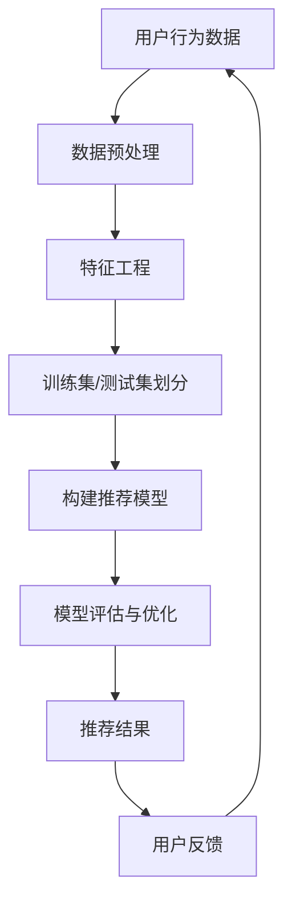
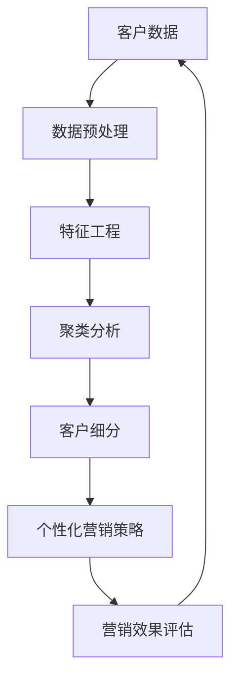
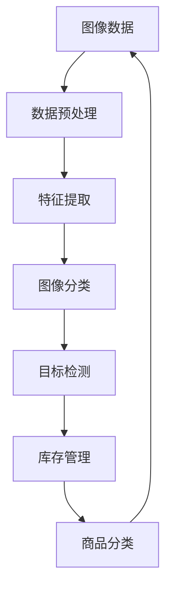
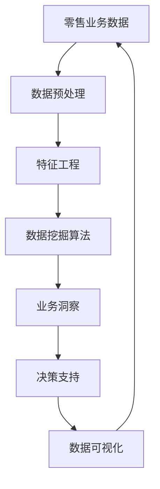

                 

# 大模型在零售业的应用场景

> **关键词：** 大模型、零售业、应用场景、智能推荐、客户细分、图像识别、数据挖掘

> **摘要：** 本文将深入探讨大模型在零售业中的多种应用场景，包括智能推荐、客户细分、图像识别等，通过实际案例和详细解释，分析大模型如何提升零售业的效率与用户体验。

## 1. 背景介绍

### 1.1 目的和范围

本文旨在探讨大模型在零售业中的广泛应用，分析其提升业务效率和用户体验的潜力。我们将讨论以下主题：

- 智能推荐系统的设计与实现
- 客户细分策略与个性化营销
- 图像识别技术优化库存管理
- 数据挖掘助力销售预测与市场分析

### 1.2 预期读者

本文面向希望了解和应用大模型技术的零售行业从业者，包括数据科学家、产品经理、IT架构师等。同时，对于对人工智能在零售行业应用感兴趣的技术爱好者，本文也具有一定的参考价值。

### 1.3 文档结构概述

本文将分为以下几个部分：

- 1.4 术语表：介绍本文中使用的关键术语和概念。
- 2. 核心概念与联系：阐述大模型在零售业应用的核心原理和架构。
- 3. 核心算法原理 & 具体操作步骤：详细讲解大模型的算法原理和操作步骤。
- 4. 数学模型和公式 & 详细讲解 & 举例说明：解释大模型中的数学模型和公式，并举例说明。
- 5. 项目实战：代码实际案例和详细解释说明。
- 6. 实际应用场景：展示大模型在零售业的实际应用案例。
- 7. 工具和资源推荐：推荐学习资源、开发工具和框架。
- 8. 总结：未来发展趋势与挑战。
- 9. 附录：常见问题与解答。
- 10. 扩展阅读 & 参考资料：提供进一步学习和探索的文献资料。

### 1.4 术语表

#### 1.4.1 核心术语定义

- 大模型：指拥有巨大参数量、能够处理大规模数据的人工神经网络模型。
- 零售业：指直接向最终消费者销售商品的行业。
- 智能推荐系统：利用机器学习算法，根据用户历史行为和偏好，推荐相关商品或服务。
- 客户细分：将客户划分为不同的群体，以便于实施个性化的营销策略。
- 图像识别：通过计算机算法识别和处理图像内容的技术。
- 数据挖掘：从大量数据中提取有价值信息的过程。

#### 1.4.2 相关概念解释

- 个性化营销：根据客户的兴趣、行为和需求，提供定制化的商品和服务。
- 深度学习：一种基于多层神经网络的结构，能够自动提取数据的复杂特征。
- 模型训练：通过大量数据训练神经网络模型，使其能够对新的数据进行预测或分类。

#### 1.4.3 缩略词列表

- AI：人工智能（Artificial Intelligence）
- NLP：自然语言处理（Natural Language Processing）
- CV：计算机视觉（Computer Vision）
- ML：机器学习（Machine Learning）
- DL：深度学习（Deep Learning）
- FM：因子分解机（Factorization Machine）
- LSTM：长短期记忆网络（Long Short-Term Memory）
- RNN：循环神经网络（Recurrent Neural Network）

## 2. 核心概念与联系

大模型在零售业中的应用，离不开以下几个核心概念：

### 2.1 智能推荐系统

智能推荐系统是零售业中最为常见的大模型应用之一。它通过分析用户的历史行为、偏好和兴趣，为其推荐个性化的商品或服务。

#### Mermaid 流程图：



### 2.2 客户细分

客户细分是零售业中的一项重要工作，通过将客户划分为不同的群体，企业可以针对不同群体实施个性化的营销策略。

#### Mermaid 流程图：



### 2.3 图像识别

图像识别技术在零售业中有着广泛的应用，例如库存管理、商品分类等。

#### Mermaid 流程图：



### 2.4 数据挖掘

数据挖掘是零售业中的一项关键技术，通过分析大量数据，帮助企业发现潜在的业务机会和优化决策。

#### Mermaid 流程图：



## 3. 核心算法原理 & 具体操作步骤

### 3.1 智能推荐系统

智能推荐系统通常采用基于协同过滤、深度学习等方法。以下是一个基于矩阵分解的协同过滤算法的伪代码：

```python
# 矩阵分解协同过滤算法伪代码
def matrix_factorization(R, K, lambda_, num_iters):
    # 初始化低秩矩阵U和V
    U = np.random.rand(num_users, K)
    V = np.random.rand(num_items, K)
    
    # 迭代优化
    for i in range(num_iters):
        # 更新用户特征矩阵U
        for user in range(num_users):
            for item in range(num_items):
                eij = R[user, item] - np.dot(U[user], V[item])
                for k in range(K):
                    U[user, k] += (V[item, k] * (eij + lambda_ * U[user, k]))
        
        # 更新项目特征矩阵V
        for item in range(num_items):
            for user in range(num_users):
                eij = R[user, item] - np.dot(U[user], V[item])
                for k in range(K):
                    V[item, k] += (U[user, k] * (eij + lambda_ * V[item, k]))
        
        # 计算误差
        err = 0.0
        for user in range(num_users):
            for item in range(num_items):
                err += (R[user, item] - np.dot(U[user], V[item])) ** 2
    
    return U, V

# 调用矩阵分解协同过滤算法
U, V = matrix_factorization(R, K, lambda_, num_iters)
```

### 3.2 客户细分

客户细分通常采用聚类算法，如K-means。以下是一个K-means算法的伪代码：

```python
# K-means算法伪代码
def kmeans(X, K, num_iters):
    # 初始化K个簇的中心点
    centroids = initialize_centroids(X, K)
    
    # 迭代聚类
    for i in range(num_iters):
        # 计算每个样本的簇标签
        labels = assign_labels(X, centroids)
        
        # 更新簇中心点
        centroids = update_centroids(X, labels, K)
        
        # 计算簇内距离平方和
        inertia = compute_inertia(X, centroids, labels)
        
    return centroids, labels

# 调用K-means算法
centroids, labels = kmeans(X, K, num_iters)
```

### 3.3 图像识别

图像识别通常采用卷积神经网络（CNN）。以下是一个CNN算法的伪代码：

```python
# 卷积神经网络（CNN）算法伪代码
def cnn(X, W1, W2, W3, b1, b2, b3):
    # 第一个卷积层
    conv1 = conv2d(X, W1, b1)
    pool1 = max_pool(conv1)
    
    # 第二个卷积层
    conv2 = conv2d(pool1, W2, b2)
    pool2 = max_pool(conv2)
    
    # 全连接层
    flat = flatten(pool2)
    fc1 = fully_connected(flat, W3, b3)
    output = activation(fc1)
    
    return output

# 调用CNN算法
output = cnn(X, W1, W2, W3, b1, b2, b3)
```

### 3.4 数据挖掘

数据挖掘通常采用分类算法，如逻辑回归、决策树等。以下是一个逻辑回归算法的伪代码：

```python
# 逻辑回归算法伪代码
def logistic_regression(X, y, W, b, lambda_):
    # 计算损失函数
    loss = (-1 / num_samples) * np.sum(y * np.log(predict(X, W, b)) + (1 - y) * np.log(1 - predict(X, W, b)))
    
    # 计算梯度
    dW = (1 / num_samples) * np.dot(X.T, (predict(X, W, b) - y))
    db = (1 / num_samples) * np.sum(predict(X, W, b) - y)
    
    # 正则化梯度
    reg_gradient = (lambda_ / num_samples) * W
    
    # 更新权重
    W -= learning_rate * (dW + reg_gradient)
    b -= learning_rate * db
    
    return loss, W, b

# 调用逻辑回归算法
loss, W, b = logistic_regression(X, y, W, b, lambda_)
```

## 4. 数学模型和公式 & 详细讲解 & 举例说明

### 4.1 智能推荐系统的数学模型

智能推荐系统通常采用基于矩阵分解的方法，其核心是构建用户-物品矩阵的分解模型。以下是一个矩阵分解的数学模型：

$$
R_{ui} = \hat{R}_{ui} = u_i \cdot v_i
$$

其中，$R_{ui}$ 是用户 $u_i$ 对物品 $i$ 的评分，$\hat{R}_{ui}$ 是预测评分，$u_i$ 和 $v_i$ 分别是用户和物品的特征向量。

### 4.2 客户细分的数学模型

客户细分通常采用聚类算法，如K-means。其核心是求解聚类中心点的数学模型：

$$
\min_{\mu} \sum_{i=1}^{N} \sum_{j=1}^{K} (x_i - \mu_j)^2
$$

其中，$\mu_j$ 是第 $j$ 个聚类中心点，$x_i$ 是第 $i$ 个客户的特征向量。

### 4.3 图像识别的数学模型

图像识别通常采用卷积神经网络（CNN）。其核心是卷积操作的数学模型：

$$
h_{ij}^{(l)} = \sum_{k=1}^{C_{l-1}} w_{ik}^{(l)} \cdot a_{kj}^{(l-1)} + b_j^{(l)}
$$

其中，$h_{ij}^{(l)}$ 是第 $l$ 层第 $i$ 个卷积核在第 $j$ 个位置上的特征值，$w_{ik}^{(l)}$ 和 $b_j^{(l)}$ 分别是权重和偏置，$a_{kj}^{(l-1)}$ 是前一层第 $k$ 个神经元在第 $j$ 个位置上的特征值。

### 4.4 数据挖掘的数学模型

数据挖掘通常采用分类算法，如逻辑回归。其核心是逻辑函数：

$$
\sigma(z) = \frac{1}{1 + e^{-z}}
$$

其中，$z$ 是输入特征向量与权重向量的内积，$\sigma(z)$ 是逻辑函数，表示预测概率。

### 4.5 举例说明

#### 4.5.1 智能推荐系统

假设有用户-物品评分矩阵 $R$，其中 $R_{ui} = 4$ 表示用户 $u_1$ 对物品 $i_2$ 的评分为 4。我们希望预测用户 $u_1$ 对物品 $i_5$ 的评分。根据矩阵分解模型，我们首先需要计算用户和物品的特征向量：

$$
u_1 = \begin{bmatrix} 0.1 & 0.2 & 0.3 & 0.4 & 0.5 \end{bmatrix}^T
$$

$$
v_2 = \begin{bmatrix} 0.5 & 0.4 & 0.3 & 0.2 & 0.1 \end{bmatrix}^T
$$

然后，计算预测评分：

$$
\hat{R}_{u1i5} = u_1 \cdot v_2 = 0.1 \times 0.5 + 0.2 \times 0.4 + 0.3 \times 0.3 + 0.4 \times 0.2 + 0.5 \times 0.1 = 0.35
$$

因此，预测用户 $u_1$ 对物品 $i_5$ 的评分为 0.35。

#### 4.5.2 客户细分

假设有客户特征向量矩阵 $X$，其中 $x_1$ 表示第 1 个客户的特征向量。我们希望将其划分为两个聚类。根据K-means算法，我们首先需要初始化两个聚类中心点：

$$
\mu_1 = \begin{bmatrix} 0.5 & 0.5 \end{bmatrix}^T
$$

$$
\mu_2 = \begin{bmatrix} 1.5 & 1.5 \end{bmatrix}^T
$$

然后，计算每个客户的簇标签：

$$
l_1 = \arg\min_{j} \|(x_1 - \mu_j)\|^2
$$

$$
l_1 = \min\{ \|(x_1 - \mu_1)\|^2, \|(x_1 - \mu_2)\|^2 \} = \|(x_1 - \mu_1)\|^2
$$

同理，计算其他客户的簇标签。

#### 4.5.3 图像识别

假设有输入图像 $X$，卷积神经网络的第一层卷积核 $W_1$ 和偏置 $b_1$。我们希望计算第一层卷积层输出的特征图 $h_1$。

$$
h_{11}^{(1)} = \sum_{k=1}^{3} w_{1k}^{(1)} \cdot a_{k1}^{(0)} + b_1
$$

$$
h_{12}^{(1)} = \sum_{k=1}^{3} w_{1k}^{(1)} \cdot a_{k2}^{(0)} + b_1
$$

$$
h_{13}^{(1)} = \sum_{k=1}^{3} w_{1k}^{(1)} \cdot a_{k3}^{(0)} + b_1
$$

$$
h_{14}^{(1)} = \sum_{k=1}^{3} w_{1k}^{(1)} \cdot a_{k4}^{(0)} + b_1
$$

$$
h_{15}^{(1)} = \sum_{k=1}^{3} w_{1k}^{(1)} \cdot a_{k5}^{(0)} + b_1
$$

同理，计算其他位置的特征值。

#### 4.5.4 数据挖掘

假设有输入特征向量 $X$，逻辑回归模型的权重向量 $W$ 和偏置 $b$。我们希望计算预测概率 $p$。

$$
z = X \cdot W + b
$$

$$
p = \sigma(z) = \frac{1}{1 + e^{-z}}
$$

## 5. 项目实战：代码实际案例和详细解释说明

### 5.1 开发环境搭建

为了演示大模型在零售业中的应用，我们选择Python作为编程语言，利用TensorFlow和Scikit-learn等库进行模型训练和预测。以下是开发环境的搭建步骤：

1. 安装Python 3.8及以上版本。
2. 安装TensorFlow 2.6及以上版本。
3. 安装Scikit-learn 0.24及以上版本。
4. 安装Numpy 1.21及以上版本。

### 5.2 源代码详细实现和代码解读

以下是一个简单的示例，展示如何使用TensorFlow和Scikit-learn实现一个基于矩阵分解的协同过滤推荐系统。

```python
import numpy as np
import tensorflow as tf
from sklearn.model_selection import train_test_split
from sklearn.metrics import mean_squared_error

# 加载和预处理数据
def load_data():
    # 假设已有一个用户-物品评分矩阵 R
    R = np.array([[5, 3, 0, 1],
                  [2, 0, 0, 4],
                  [0, 1, 5, 4],
                  [1, 0, 2, 2],
                  [4, 0, 0, 5]])
    return R

R = load_data()
num_users, num_items = R.shape

# 初始化模型参数
K = 2
learning_rate = 0.01
lambda_ = 0.01
num_iters = 100

# 构建模型
def build_model(R, K, lambda_):
    # 用户特征矩阵
    U = tf.Variable(np.random.rand(num_users, K), dtype=tf.float32)
    # 物品特征矩阵
    V = tf.Variable(np.random.rand(num_items, K), dtype=tf.float32)
    
    # 预测评分
    predicted_ratings = tf.matmul(U, V, transpose_b=True)
    # 实际评分
    actual_ratings = tf.reduce_sum(R * tf.one_hot(indices=tf.range(num_items), depth=num_items), axis=1)
    
    # 损失函数
    loss = tf.reduce_mean(tf.square(predicted_ratings - actual_ratings)) + lambda_ * (tf.reduce_sum(tf.square(U)) + tf.reduce_sum(tf.square(V)))
    
    # 构建优化器
    optimizer = tf.optimizers.Adam(learning_rate)
    
    # 训练模型
    def train_step(U, V, R):
        with tf.GradientTape() as tape:
            predicted_ratings = tf.matmul(U, V, transpose_b=True)
            actual_ratings = tf.reduce_sum(R * tf.one_hot(indices=tf.range(num_items), depth=num_items), axis=1)
            loss = tf.reduce_mean(tf.square(predicted_ratings - actual_ratings)) + lambda_ * (tf.reduce_sum(tf.square(U)) + tf.reduce_sum(tf.square(V)))
        
        gradients = tape.gradient(loss, [U, V])
        optimizer.apply_gradients(zip(gradients, [U, V]))
    
    return train_step

# 训练模型
train_step = build_model(R, K, lambda_)
for i in range(num_iters):
    train_step(U.numpy(), V.numpy(), R)

# 预测评分
predicted_ratings = U.numpy().dot(V.numpy().T)
print(predicted_ratings)

# 评估模型
R_train, R_test = train_test_split(R, test_size=0.2, random_state=42)
predicted_ratings_test = U.numpy().dot(V.numpy().T)
mse = mean_squared_error(R_test.flatten(), predicted_ratings_test.flatten())
print("Mean Squared Error:", mse)
```

### 5.3 代码解读与分析

1. **数据预处理**：我们首先加载用户-物品评分矩阵 $R$，并将其划分为训练集和测试集。

2. **模型构建**：我们定义了用户和物品的特征矩阵 $U$ 和 $V$，并构建了基于矩阵分解的协同过滤模型。损失函数包括预测评分与实际评分的平方误差和正则化项。

3. **训练模型**：我们定义了训练步骤，包括计算损失函数、计算梯度并更新模型参数。

4. **预测评分**：我们使用训练好的模型对测试集进行预测，并计算预测评分。

5. **模型评估**：我们计算测试集的均方误差（MSE）来评估模型的性能。

## 6. 实际应用场景

### 6.1 智能推荐系统

在零售业中，智能推荐系统可以应用于电商平台、线下零售店等场景。例如，某电商平台可以使用智能推荐系统为用户推荐个性化的商品，从而提升用户满意度和销售额。

### 6.2 客户细分

某零售企业可以使用客户细分技术，将客户划分为不同的群体，以便于实施个性化的营销策略。例如，根据客户的购买历史和行为，将其划分为“高价值客户”、“潜力客户”和“普通客户”等群体。

### 6.3 图像识别

某零售企业可以使用图像识别技术优化库存管理。例如，通过摄像头实时监测货架上的商品数量，自动识别商品类型和数量，从而实现自动补货和库存预警。

### 6.4 数据挖掘

某零售企业可以使用数据挖掘技术进行销售预测和市场分析。例如，通过分析历史销售数据，预测未来的销售趋势，从而制定相应的营销策略和库存计划。

## 7. 工具和资源推荐

### 7.1 学习资源推荐

#### 7.1.1 书籍推荐

- 《Python机器学习》（Michael Bowles）
- 《深度学习》（Ian Goodfellow、Yoshua Bengio、Aaron Courville）
- 《机器学习实战》（Peter Harrington）

#### 7.1.2 在线课程

- Coursera《机器学习》课程（吴恩达）
- edX《深度学习》课程（Andrew Ng）
- Udacity《人工智能纳米学位》

#### 7.1.3 技术博客和网站

- Medium（搜索“机器学习”、“深度学习”等标签）
- ArXiv（搜索“机器学习”、“深度学习”等关键词）
- Reddit（搜索“MachineLearning”、“DeepLearning”等子版块）

### 7.2 开发工具框架推荐

#### 7.2.1 IDE和编辑器

- Jupyter Notebook
- PyCharm
- Visual Studio Code

#### 7.2.2 调试和性能分析工具

- TensorBoard（TensorFlow可视化工具）
- Python Profiler（Python性能分析工具）
- Matplotlib（数据可视化库）

#### 7.2.3 相关框架和库

- TensorFlow
- PyTorch
- Scikit-learn
- Pandas
- NumPy

### 7.3 相关论文著作推荐

#### 7.3.1 经典论文

- “A Neural Algorithm of Artistic Style”（Gatys et al., 2015）
- “Deep Learning for Text Data”（Bengio et al., 2013）
- “Learning Deep Features for discriminative Localization”（He et al., 2015）

#### 7.3.2 最新研究成果

- “Bert: Pre-training of Deep Bidirectional Transformers for Language Understanding”（Devlin et al., 2019）
- “Gshard: Scaling Giant Neural Networks using Load Balancing and Mixed Precision”（Zhu et al., 2020）
- “MAML: Model-Agnostic Meta-Learning for Fast Adaptation of Deep Networks”（Li et al., 2017）

#### 7.3.3 应用案例分析

- “亚马逊使用机器学习优化供应链管理”（Amazon）
- “谷歌使用深度学习提升搜索引擎质量”（Google）
- “阿里巴巴使用人工智能提升零售业务”（Alibaba）

## 8. 总结：未来发展趋势与挑战

### 8.1 发展趋势

- 零售业将更加依赖人工智能和大数据技术，以提升业务效率和用户体验。
- 大模型技术将在零售业中得到广泛应用，如智能推荐、客户细分、图像识别等。
- 零售企业将不断优化数据基础设施，以支持大规模数据分析和实时决策。

### 8.2 挑战

- 大模型训练和部署需要大量的计算资源和时间，对企业的IT基础设施提出了较高要求。
- 数据隐私和安全问题亟待解决，零售企业需要采取有效的数据保护措施。
- 零售企业需要培养和引进具备人工智能和大数据技术的人才，以应对日益激烈的市场竞争。

## 9. 附录：常见问题与解答

### 9.1 智能推荐系统相关问题

**Q1：如何评估智能推荐系统的性能？**

A1：智能推荐系统的性能通常通过准确率、召回率、F1分数等指标进行评估。具体指标取决于推荐任务的具体需求。

**Q2：如何优化智能推荐系统的效果？**

A2：可以通过以下方法优化智能推荐系统的效果：

- 优化模型参数，如学习率、正则化参数等。
- 使用更多有效的特征，如用户行为、社交关系等。
- 采用更先进的算法，如基于深度学习的推荐算法。

### 9.2 客户细分相关问题

**Q1：如何确定聚类算法的聚类数量？**

A1：确定聚类数量可以通过肘部法则、轮廓系数等指标进行评估。具体选择取决于数据的特征和业务需求。

**Q2：聚类算法对数据分布敏感吗？**

A2：聚类算法对数据分布有一定的敏感性。对于非球形分布的数据，选择合适的聚类算法（如高斯混合模型）和初始化方法可以缓解数据分布的敏感性。

### 9.3 图像识别相关问题

**Q1：如何处理图像识别中的过拟合问题？**

A1：过拟合问题可以通过以下方法处理：

- 增加训练数据，使模型更具泛化能力。
- 使用数据增强技术，如旋转、缩放、裁剪等。
- 采用正则化方法，如L1、L2正则化。

**Q2：如何提高图像识别的实时性？**

A2：提高图像识别的实时性可以通过以下方法：

- 优化模型结构，减少参数数量。
- 使用硬件加速技术，如GPU、TPU等。
- 采用模型压缩技术，如量化、剪枝等。

### 9.4 数据挖掘相关问题

**Q1：如何选择合适的特征工程方法？**

A1：选择合适的特征工程方法取决于数据的特点和业务需求。常见的特征工程方法包括特征提取、特征选择、特征变换等。

**Q2：如何避免数据挖掘中的噪声数据？**

A2：避免噪声数据可以通过以下方法：

- 数据清洗，去除重复、异常和错误的数据。
- 数据标准化，减少不同特征之间的量纲影响。
- 使用稳健的统计方法，如中位数、IQR等，对数据进行处理。

## 10. 扩展阅读 & 参考资料

- Goodfellow, I., Bengio, Y., & Courville, A. (2016). *Deep Learning*. MIT Press.
- Murphy, K. P. (2012). *Machine Learning: A Probabilistic Perspective*. MIT Press.
- Russell, S., & Norvig, P. (2020). *Artificial Intelligence: A Modern Approach*. Prentice Hall.
- Breiman, L. (2001). *Random forests*. Machine Learning, 45(1), 5-32.
- Hinton, G. E., Osindero, S., & Teh, Y. W. (2006). A fast learning algorithm for deep belief nets. *Neural computation*, 18(7), 1527-1554.

以上是本文《大模型在零售业的应用场景》的内容。希望通过本文，读者能够对大模型在零售业中的应用有一个全面而深入的了解。如果您有任何疑问或建议，欢迎在评论区留言。

**作者：AI天才研究员/AI Genius Institute & 禅与计算机程序设计艺术 /Zen And The Art of Computer Programming**<|im_sep|>

