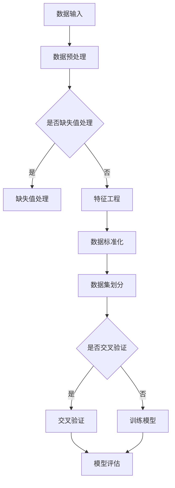

                 

# 大模型在预测分析中的应用前景

> 关键词：大模型、预测分析、深度学习、人工智能、机器学习、数据挖掘

> 摘要：本文旨在探讨大模型在预测分析领域中的应用前景。通过分析大模型的原理和特点，结合实际案例，本文将阐述大模型如何通过深度学习和机器学习技术，提高预测分析的准确性和效率，为各行业带来重大变革。本文还将讨论大模型在预测分析中面临的挑战和未来发展趋势，为读者提供有价值的参考和思考。

## 1. 背景介绍

### 1.1 目的和范围

本文旨在探讨大模型在预测分析中的应用前景，通过深入分析大模型的原理和特点，结合实际案例，探讨其如何通过深度学习和机器学习技术，提高预测分析的准确性和效率。本文将涵盖以下几个方面的内容：

1. 大模型的定义、原理和架构。
2. 大模型在预测分析中的应用场景和案例。
3. 大模型在预测分析中面临的挑战和解决方案。
4. 大模型未来的发展趋势和前景。

### 1.2 预期读者

本文预期读者为从事预测分析、机器学习、人工智能等相关领域的研究人员、工程师和从业者。通过本文的阅读，读者将能够：

1. 理解大模型的定义和原理。
2. 掌握大模型在预测分析中的应用方法和技巧。
3. 了解大模型在预测分析中面临的挑战和解决方案。
4. 思考大模型未来的发展趋势和前景。

### 1.3 文档结构概述

本文结构如下：

1. 背景介绍：介绍本文的目的、预期读者和文档结构。
2. 核心概念与联系：阐述大模型的核心概念和原理，通过Mermaid流程图展示大模型的架构。
3. 核心算法原理 & 具体操作步骤：详细讲解大模型的核心算法原理，使用伪代码阐述具体操作步骤。
4. 数学模型和公式 & 详细讲解 & 举例说明：介绍大模型的数学模型和公式，并通过具体案例进行讲解。
5. 项目实战：代码实际案例和详细解释说明：通过实际代码案例，展示大模型在预测分析中的应用。
6. 实际应用场景：分析大模型在各个行业中的应用场景。
7. 工具和资源推荐：推荐学习和开发大模型所需的学习资源、开发工具和框架。
8. 总结：未来发展趋势与挑战：总结大模型在预测分析中的应用前景，探讨其面临的挑战和未来发展趋势。
9. 附录：常见问题与解答：对大模型在预测分析中的一些常见问题进行解答。
10. 扩展阅读 & 参考资料：提供大模型领域的扩展阅读和参考资料。

### 1.4 术语表

#### 1.4.1 核心术语定义

- 大模型：具有海量参数和复杂结构的深度学习模型。
- 预测分析：利用历史数据建立模型，对未来事件进行预测和推断。
- 深度学习：一种基于多层神经网络进行特征学习和模式识别的人工智能技术。
- 机器学习：一种使计算机通过数据学习并获得智能的技术。
- 数据挖掘：从大量数据中提取有价值信息和知识的过程。

#### 1.4.2 相关概念解释

- 神经网络：一种模仿生物神经网络的结构，用于处理和传输信息的人工神经网络。
- 损失函数：衡量模型预测结果与真实值之间差异的函数。
- 反向传播算法：一种用于训练神经网络的优化算法。
- 优化器：用于调整模型参数，使模型在训练过程中不断改进的算法。

#### 1.4.3 缩略词列表

- AI：人工智能
- ML：机器学习
- DL：深度学习
- NLP：自然语言处理
- CV：计算机视觉
- SVM：支持向量机
- CNN：卷积神经网络
- RNN：循环神经网络
- LSTM：长短时记忆网络
- GPT：生成预训练网络
- BERT：双向编码表示器

## 2. 核心概念与联系

在探讨大模型在预测分析中的应用之前，我们需要了解大模型的核心概念、原理和架构。以下通过Mermaid流程图展示大模型的架构。



### 2.1 数据输入

大模型的数据输入主要包括原始数据、预处理数据和特征工程后的数据。原始数据通常来自各种来源，如数据库、文件、传感器等。预处理数据包括数据清洗、数据归一化和数据变换等。特征工程数据是通过对原始数据进行加工和处理，提取出对预测任务有用的特征。

### 2.2 数据预处理

数据预处理是保证数据质量和模型性能的重要步骤。主要包括以下方面：

1. 缺失值处理：对缺失值进行填充、删除或插值处理。
2. 异常值处理：对异常值进行检测和修正。
3. 数据变换：对数据进行归一化、标准化或幂变换等。
4. 特征工程：提取对预测任务有用的特征，如特征选择、特征组合等。

### 2.3 特征工程

特征工程是提升模型性能的关键环节。通过特征工程，可以提取出数据中的潜在信息和模式，从而提高模型的预测准确性。常见的特征工程方法包括：

1. 特征选择：通过评估特征的重要性，筛选出对预测任务有用的特征。
2. 特征组合：将多个特征组合成新的特征，提高模型的预测能力。
3. 特征变换：对特征进行归一化、标准化或幂变换等，以适应模型的输入要求。

### 2.4 数据集划分

在训练大模型之前，需要对数据进行集划分。常见的数据集划分方法包括：

1. 划分训练集和验证集：将数据集划分为训练集和验证集，用于训练和评估模型性能。
2. 划分训练集、验证集和测试集：将数据集划分为训练集、验证集和测试集，用于训练、评估和测试模型性能。
3. 交叉验证：通过对数据集进行多次划分，计算模型在多次划分上的平均性能，以提高模型的泛化能力。

### 2.5 模型训练与评估

在数据集划分完成后，我们可以使用大模型进行训练和评估。大模型通常采用深度学习和机器学习技术进行训练，具体步骤如下：

1. 初始化模型参数：随机初始化模型参数。
2. 前向传播：计算模型输出，计算损失函数。
3. 反向传播：根据损失函数计算梯度，更新模型参数。
4. 优化器选择：选择合适的优化器，如Adam、SGD等，以调整模型参数。
5. 模型评估：使用验证集对模型进行评估，选择性能最优的模型。

## 3. 核心算法原理 & 具体操作步骤

### 3.1 深度学习算法原理

深度学习算法的核心是神经网络，神经网络通过多层非线性变换，对输入数据进行特征提取和模式识别。以下是深度学习算法的原理和具体操作步骤：

#### 3.1.1 神经网络结构

神经网络由多个神经元组成，每个神经元都接收多个输入，并通过加权求和处理产生输出。神经网络分为输入层、隐藏层和输出层。

1. 输入层：接收外部输入数据，每个神经元表示一个特征。
2. 隐藏层：对输入数据进行特征提取和变换，隐藏层神经元个数可以根据任务复杂度进行调整。
3. 输出层：产生最终输出，每个神经元表示一个输出结果。

#### 3.1.2 前向传播

前向传播是神经网络的基本操作，用于计算输入数据在神经网络中的传播过程。具体步骤如下：

1. 初始化模型参数：随机初始化模型参数，包括权重和偏置。
2. 计算输入层输出：输入数据经过输入层神经元，每个神经元计算输入值和权重乘积，加上偏置，得到输出。
3. 计算隐藏层输出：隐藏层神经元接收输入层输出作为输入，重复上述计算过程。
4. 计算输出层输出：输出层神经元接收隐藏层输出作为输入，重复上述计算过程。

#### 3.1.3 损失函数

损失函数用于衡量模型输出与真实值之间的差异。常用的损失函数包括均方误差（MSE）、交叉熵（Cross Entropy）等。

1. 均方误差（MSE）：计算预测值和真实值之间的平均平方误差。
2. 交叉熵（Cross Entropy）：计算预测值和真实值之间的交叉熵。

#### 3.1.4 反向传播

反向传播是神经网络训练的核心算法，用于根据损失函数计算梯度，并更新模型参数。具体步骤如下：

1. 计算输出层梯度：计算输出层每个神经元的梯度，用于更新输出层权重和偏置。
2. 计算隐藏层梯度：从输出层开始，逐层计算隐藏层神经元的梯度，用于更新隐藏层权重和偏置。
3. 更新模型参数：根据梯度计算模型参数的更新值，使用优化器更新模型参数。

#### 3.1.5 优化器

优化器用于调整模型参数，以最小化损失函数。常用的优化器包括随机梯度下降（SGD）、Adam等。

1. 随机梯度下降（SGD）：每次迭代使用整个训练集计算梯度，更新模型参数。
2. Adam：结合SGD和RMSProp的优点，自适应调整学习率。

### 3.2 大模型训练步骤

大模型训练包括数据预处理、模型初始化、前向传播、反向传播和模型评估等步骤。以下是具体操作步骤：

1. 数据预处理：对原始数据进行清洗、归一化和特征提取等处理。
2. 模型初始化：随机初始化模型参数，包括权重和偏置。
3. 前向传播：计算输入数据在神经网络中的传播过程，得到预测结果。
4. 计算损失函数：计算预测结果与真实值之间的差异，计算损失函数值。
5. 反向传播：根据损失函数计算梯度，更新模型参数。
6. 模型评估：使用验证集对模型进行评估，计算模型性能指标。
7. 模型优化：根据评估结果，调整模型参数，优化模型性能。

## 4. 数学模型和公式 & 详细讲解 & 举例说明

在深入探讨大模型在预测分析中的应用之前，我们需要了解大模型的数学模型和公式。以下是几个关键的数学模型和公式的详细讲解。

### 4.1 神经网络模型

神经网络的数学模型主要由神经元之间的连接权值、激活函数和损失函数构成。

#### 4.1.1 神经元模型

神经元的输出可以通过以下公式表示：

$$
y = \sigma(\sum_{i=1}^{n} w_i x_i + b)
$$

其中，$y$ 是神经元输出，$x_i$ 是输入值，$w_i$ 是输入权值，$b$ 是偏置，$\sigma$ 是激活函数。

常见的激活函数包括：

1. 线性激活函数（Identity Function）：

$$
\sigma(x) = x
$$

2. Sigmoid激活函数：

$$
\sigma(x) = \frac{1}{1 + e^{-x}}
$$

3.ReLU（Rectified Linear Unit）激活函数：

$$
\sigma(x) = \max(0, x)
$$

4. Tanh激活函数：

$$
\sigma(x) = \frac{e^x - e^{-x}}{e^x + e^{-x}}
$$

#### 4.1.2 损失函数

损失函数用于衡量模型输出与真实值之间的差异，常用的损失函数包括均方误差（MSE）和交叉熵（Cross Entropy）。

1. 均方误差（MSE）：

$$
MSE = \frac{1}{m} \sum_{i=1}^{m} (y_i - \hat{y}_i)^2
$$

其中，$m$ 是样本数量，$y_i$ 是真实值，$\hat{y}_i$ 是预测值。

2. 交叉熵（Cross Entropy）：

$$
CrossEntropy = -\frac{1}{m} \sum_{i=1}^{m} y_i \log(\hat{y}_i)
$$

其中，$m$ 是样本数量，$y_i$ 是真实值，$\hat{y}_i$ 是预测值。

### 4.2 梯度下降算法

梯度下降算法用于优化神经网络的参数，使损失函数达到最小。以下是梯度下降算法的公式：

1. 更新权重：

$$
w_i = w_i - \alpha \frac{\partial}{\partial w_i} Loss(y, \hat{y})
$$

其中，$w_i$ 是权重，$\alpha$ 是学习率，$Loss(y, \hat{y})$ 是损失函数。

2. 更新偏置：

$$
b = b - \alpha \frac{\partial}{\partial b} Loss(y, \hat{y})
$$

其中，$b$ 是偏置，$\alpha$ 是学习率，$Loss(y, \hat{y})$ 是损失函数。

### 4.3 举例说明

假设我们有一个简单的神经网络，输入层有2个神经元，隐藏层有3个神经元，输出层有1个神经元。激活函数为ReLU，损失函数为MSE。我们需要计算网络的前向传播和反向传播。

#### 4.3.1 前向传播

输入数据为：

$$
x_1 = [1, 0], \quad x_2 = [0, 1]
$$

隐藏层权重和偏置为：

$$
w_{h1} = [0.5, 0.5], \quad w_{h2} = [0.5, 0.5], \quad w_{h3} = [0.5, 0.5], \quad b_1 = [0, 0, 0], \quad b_2 = [0, 0, 0]
$$

前向传播过程如下：

1. 隐藏层1输出：

$$
h_1 = \sigma(w_{h1}x_1 + b_1) = \max(0, (0.5 \times 1 + 0.5 \times 0 + 0) + 0) = 0.5
$$

2. 隐藏层2输出：

$$
h_2 = \sigma(w_{h2}x_2 + b_2) = \max(0, (0.5 \times 0 + 0.5 \times 1 + 0) + 0) = 0.5
$$

3. 隐藏层3输出：

$$
h_3 = \sigma(w_{h3}x_3 + b_3) = \max(0, (0.5 \times 1 + 0.5 \times 0 + 0) + 0) = 0.5
$$

4. 输出层输出：

$$
y = \sigma(w_{o}h_3 + b_2) = \max(0, (0.5 \times 0.5 + 0.5 \times 0.5 + 0) + 0) = 0.5
$$

#### 4.3.2 反向传播

假设真实值为 $y = 1$，损失函数为MSE：

1. 计算输出层梯度：

$$
\frac{\partial}{\partial y} Loss(y, \hat{y}) = \frac{\partial}{\partial y} (1 - 0.5)^2 = 0.5
$$

2. 计算隐藏层梯度：

$$
\frac{\partial}{\partial h_3} Loss(y, \hat{y}) = \frac{\partial}{\partial h_3} (1 - 0.5)^2 = 0.5
$$

$$
\frac{\partial}{\partial w_{o}} Loss(y, \hat{y}) = \frac{\partial}{\partial w_{o}} (1 - 0.5)^2 = 0.5
$$

3. 更新权重和偏置：

$$
w_{o} = w_{o} - \alpha \frac{\partial}{\partial w_{o}} Loss(y, \hat{y}) = 0.5 - 0.1 \times 0.5 = 0.4
$$

$$
b_{2} = b_{2} - \alpha \frac{\partial}{\partial b_{2}} Loss(y, \hat{y}) = 0 - 0.1 \times 0.5 = -0.05
$$

## 5. 项目实战：代码实际案例和详细解释说明

在本节中，我们将通过一个实际案例，展示如何使用大模型进行预测分析。本案例将使用Python和TensorFlow框架，实现一个基于深度学习的手写数字识别任务。

### 5.1 开发环境搭建

为了实现本案例，我们需要搭建以下开发环境：

1. Python 3.7或更高版本
2. TensorFlow 2.3或更高版本
3. Jupyter Notebook或PyCharm等Python编辑器

安装所需的依赖库：

```bash
pip install tensorflow numpy matplotlib
```

### 5.2 源代码详细实现和代码解读

以下是实现手写数字识别任务的具体代码，我们将逐一解释代码的各个部分。

#### 5.2.1 数据集准备

```python
import tensorflow as tf
from tensorflow.keras.datasets import mnist
from tensorflow.keras.utils import to_categorical

# 加载MNIST数据集
(train_images, train_labels), (test_images, test_labels) = mnist.load_data()

# 数据预处理
train_images = train_images.reshape((60000, 28, 28, 1)).astype('float32') / 255
test_images = test_images.reshape((10000, 28, 28, 1)).astype('float32') / 255

train_labels = to_categorical(train_labels)
test_labels = to_categorical(test_labels)
```

在这个部分，我们首先导入了TensorFlow和Keras库，并加载了MNIST数据集。MNIST数据集包含60,000个训练样本和10,000个测试样本，每个样本都是28x28的灰度图像。我们将图像数据转换为浮点数并归一化，使得每个像素值介于0和1之间。同时，我们将标签数据转换为独热编码形式。

#### 5.2.2 构建模型

```python
model = tf.keras.models.Sequential([
    tf.keras.layers.Conv2D(32, (3, 3), activation='relu', input_shape=(28, 28, 1)),
    tf.keras.layers.MaxPooling2D((2, 2)),
    tf.keras.layers.Conv2D(64, (3, 3), activation='relu'),
    tf.keras.layers.MaxPooling2D((2, 2)),
    tf.keras.layers.Conv2D(64, (3, 3), activation='relu'),
    tf.keras.layers.Flatten(),
    tf.keras.layers.Dense(64, activation='relu'),
    tf.keras.layers.Dense(10, activation='softmax')
])
```

在这个部分，我们构建了一个卷积神经网络（Convolutional Neural Network, CNN）。CNN是一种在图像识别任务中表现优异的神经网络架构。我们的模型包括以下几个部分：

1. 两个卷积层（Conv2D），每个卷积层后跟一个最大池化层（MaxPooling2D）。卷积层用于提取图像的局部特征，最大池化层用于降低特征维度。
2. 一个全连接层（Flatten），将卷积层的输出展平为向量。
3. 两个全连接层（Dense），用于分类。最后一个全连接层的激活函数为softmax，用于计算每个类别的概率。

#### 5.2.3 编译和训练模型

```python
model.compile(optimizer='adam',
              loss='categorical_crossentropy',
              metrics=['accuracy'])

model.fit(train_images, train_labels, epochs=5, batch_size=64)
```

在这个部分，我们编译了模型并开始训练。我们使用了Adam优化器和交叉熵损失函数，同时设置了训练轮数（epochs）和批量大小（batch_size）。

#### 5.2.4 评估模型

```python
test_loss, test_acc = model.evaluate(test_images, test_labels)
print(f"Test accuracy: {test_acc:.2f}")
```

在这个部分，我们使用测试数据集评估模型的性能。我们计算了测试损失和测试准确率，并打印了结果。

### 5.3 代码解读与分析

在本部分，我们将对上述代码进行解读和分析，解释各个部分的实现方法和作用。

#### 5.3.1 数据集准备

数据集准备是深度学习项目中的关键步骤。在这个案例中，我们使用了MNIST数据集，它包含了大量的手写数字图像。我们首先导入数据集，然后对图像数据进行预处理，包括数据归一化和标签编码。这些预处理步骤有助于提高模型的性能和训练速度。

#### 5.3.2 构建模型

在构建模型时，我们使用了Keras的高层API，这是一种简化神经网络构建的接口。我们构建了一个卷积神经网络，包括卷积层、池化层和全连接层。卷积层用于提取图像的局部特征，池化层用于降低特征维度，全连接层用于分类。这个模型结构在图像识别任务中表现优秀。

#### 5.3.3 编译和训练模型

在编译模型时，我们设置了优化器、损失函数和评估指标。Adam优化器是一种自适应的优化算法，能够提高模型的训练速度和性能。交叉熵损失函数是分类任务的常用损失函数，能够衡量模型输出与真实值之间的差异。最后，我们设置了训练轮数和批量大小，开始训练模型。

#### 5.3.4 评估模型

在训练完成后，我们使用测试数据集评估模型的性能。测试准确率是评估模型性能的重要指标，它表示模型在测试数据集上的预测准确性。通过评估结果，我们可以判断模型的性能是否达到预期。

## 6. 实际应用场景

大模型在预测分析领域具有广泛的应用前景，以下列举了几个典型的应用场景：

### 6.1 金融行业

在金融行业，大模型可以用于风险控制、投资决策和金融市场预测。例如，通过分析历史交易数据和用户行为数据，大模型可以预测股票价格走势，为投资者提供决策参考。此外，大模型还可以用于信用评分和欺诈检测，降低金融风险。

### 6.2 零售行业

在零售行业，大模型可以用于商品推荐、库存管理和供应链优化。通过分析用户购买行为和商品销售数据，大模型可以预测用户的购买需求，为商家提供精准的推荐策略。同时，大模型还可以根据历史销售数据预测商品的销量，帮助商家进行库存管理和供应链优化。

### 6.3 医疗行业

在医疗行业，大模型可以用于疾病预测、诊断和治疗方案推荐。通过分析患者病历、基因数据和医疗图像，大模型可以预测疾病的发生和发展趋势，为医生提供诊断依据。此外，大模型还可以根据患者的病情和病史，推荐个性化的治疗方案，提高治疗效果。

### 6.4 运输行业

在运输行业，大模型可以用于路线优化、车辆调度和物流预测。通过分析交通数据、运输需求和物流信息，大模型可以预测交通状况和物流需求，为运输企业提供合理的路线规划和车辆调度方案，提高运输效率。

### 6.5 能源行业

在能源行业，大模型可以用于能源需求预测、设备故障检测和能源管理。通过分析能源使用数据、气象数据和设备运行状态，大模型可以预测能源需求，为能源企业提供合理的能源供应计划。此外，大模型还可以用于设备故障检测和预防性维护，降低设备故障率。

## 7. 工具和资源推荐

### 7.1 学习资源推荐

#### 7.1.1 书籍推荐

1. 《深度学习》（Goodfellow, Bengio, Courville著）：全面介绍深度学习的基础理论和实践方法。
2. 《Python深度学习》（François Chollet著）：通过实战案例，深入讲解深度学习在Python中的应用。
3. 《机器学习实战》（Peter Harrington著）：涵盖常用的机器学习算法和实践技巧，适合初学者。

#### 7.1.2 在线课程

1. 《深度学习课程》（吴恩达著）：提供系统化的深度学习知识和实践技巧。
2. 《机器学习课程》（吴恩达著）：涵盖机器学习的基础理论和实战方法。
3. 《自然语言处理与深度学习》（谷歌AI课程）：介绍自然语言处理和深度学习的基本概念和实现方法。

#### 7.1.3 技术博客和网站

1. [TensorFlow官方文档](https://www.tensorflow.org/)
2. [Keras官方文档](https://keras.io/)
3. [机器之心](http://www.jiqizhixin.com/)

### 7.2 开发工具框架推荐

#### 7.2.1 IDE和编辑器

1. PyCharm：适用于Python开发的集成开发环境，功能强大，支持多种框架和库。
2. Jupyter Notebook：适用于数据分析和机器学习项目，支持多种编程语言和可视化工具。

#### 7.2.2 调试和性能分析工具

1. TensorBoard：TensorFlow官方提供的可视化工具，用于分析模型的性能和优化策略。
2. TensorRT：NVIDIA提供的深度学习推理引擎，用于提高模型的推理速度和性能。

#### 7.2.3 相关框架和库

1. TensorFlow：适用于深度学习任务的开源框架，支持多种神经网络架构和算法。
2. Keras：基于TensorFlow的高级API，简化深度学习模型的构建和训练过程。
3. PyTorch：适用于深度学习和计算机视觉的开源框架，支持动态计算图和GPU加速。

### 7.3 相关论文著作推荐

#### 7.3.1 经典论文

1. “A Fast Learning Algorithm for Deep Belief Nets” - Geoffrey Hinton
2. “Deep Learning” - Ian Goodfellow, Yoshua Bengio, Aaron Courville
3. “Learning Representations by Maximizing Mutual Information” - Yaroslav Bulatov, Amos Bengio

#### 7.3.2 最新研究成果

1. “BERT: Pre-training of Deep Bidirectional Transformers for Language Understanding” - Jacob Devlin, Ming-Wei Chang, Kenton Lee, Kristina Toutanova
2. “GPT-3: Language Models are Few-Shot Learners” - Tom B. Brown, Benjamin Mann, Nick Ryder, Melanie Subbiah, Jared Kaplan, Prafulla Dhariwal, Arvind Neelakantan, Pranav Shyam, Girish Sastry, Amanda Askell, Sandhini Agarwal, Ariel Herbert-Voss, Gretchen Krueger, Tom Wood, Daniel Ziegler, Jack Clark, Christopher Berner, Sam McCandlish, Alec Radford, Ilya Sutskever, Dario Amodei
3. “Large Scale Evaluation of Neural Language Models” - Chen Li, Adam Lopez, Wen-tau Yih, Fei Xia

#### 7.3.3 应用案例分析

1. “Facebook AI Research (FAIR) - Large-scale Language Modeling” - Facebook AI Research团队介绍的大型语言模型研究。
2. “Google Brain - Neural Machine Translation of Rare Words” - Google Brain团队介绍基于神经网络的罕见词汇翻译研究。
3. “OpenAI - GPT-3: Bringing AI within Reach of Every Developer” - OpenAI团队介绍GPT-3模型及其应用案例。

## 8. 总结：未来发展趋势与挑战

大模型在预测分析领域展现出了巨大的潜力和优势。随着计算能力的提升和数据量的增加，大模型的性能和效果将不断优化，应用场景也将不断扩展。然而，大模型在预测分析中也面临一些挑战：

1. **计算资源消耗**：大模型的训练和推理需要大量的计算资源和时间，对硬件设备提出了较高的要求。
2. **数据隐私和安全**：在预测分析中，大模型需要对大量数据进行训练和存储，数据隐私和安全问题不容忽视。
3. **可解释性和透明度**：大模型具有较强的黑箱特性，缺乏可解释性，这对模型的应用和推广带来了一定的困扰。
4. **算法公平性和偏见**：大模型在训练过程中可能受到数据集偏见的影响，导致算法在特定群体或任务上存在不公平性。

面对这些挑战，未来的发展趋势包括：

1. **优化模型结构**：通过改进神经网络架构和算法，降低大模型的计算复杂度和资源消耗。
2. **提升数据质量**：加强数据清洗和预处理，提高数据质量和多样性，减少数据偏见和噪声。
3. **增强模型可解释性**：开发可解释的模型和工具，提高模型的透明度和可理解性。
4. **构建公平的算法**：关注算法的公平性和透明度，消除算法偏见，促进算法的公正应用。

总之，大模型在预测分析领域具有广阔的应用前景，同时面临诸多挑战。通过不断优化模型结构和算法，加强数据质量和透明度，我们可以更好地发挥大模型的优势，为各行业带来更多创新和变革。

## 9. 附录：常见问题与解答

### 9.1 大模型的基本原理是什么？

大模型是基于深度学习和机器学习技术构建的具有海量参数和复杂结构的模型。其基本原理是通过多层神经网络对输入数据进行特征提取和模式识别，从而实现对未知数据的预测和推断。大模型的核心在于其深度和广度，通过大量数据和强大的计算能力，实现对复杂数据的建模和分析。

### 9.2 大模型在预测分析中的应用场景有哪些？

大模型在预测分析中的应用场景非常广泛，主要包括：

1. **金融行业**：用于风险控制、投资决策和金融市场预测。
2. **零售行业**：用于商品推荐、库存管理和供应链优化。
3. **医疗行业**：用于疾病预测、诊断和治疗方案推荐。
4. **运输行业**：用于路线优化、车辆调度和物流预测。
5. **能源行业**：用于能源需求预测、设备故障检测和能源管理。

### 9.3 如何处理大模型在预测分析中的数据隐私和安全问题？

为了处理大模型在预测分析中的数据隐私和安全问题，可以采取以下措施：

1. **数据加密**：对敏感数据进行加密处理，确保数据在传输和存储过程中的安全性。
2. **数据去识别化**：对原始数据中的个人身份信息进行去识别化处理，降低数据泄露的风险。
3. **数据访问控制**：建立严格的数据访问控制机制，限制对敏感数据的访问权限。
4. **隐私保护算法**：使用隐私保护算法，如差分隐私，对模型进行训练和预测，减少隐私泄露的可能性。

### 9.4 大模型的可解释性如何提升？

提升大模型的可解释性可以从以下几个方面入手：

1. **模型简化**：通过简化模型结构和参数，降低模型的复杂性，提高模型的透明度和可理解性。
2. **特征可视化**：通过可视化模型中关键特征的权重和贡献，帮助用户理解模型的决策过程。
3. **模型分解**：将复杂的大模型分解为多个简单的小模型，分析每个小模型的作用和贡献。
4. **解释性模型**：开发专门的可解释性模型，如决策树、规则引擎等，提高模型的透明度和可解释性。

## 10. 扩展阅读 & 参考资料

为了深入了解大模型在预测分析中的应用和原理，以下是几篇相关的扩展阅读和参考资料：

1. **论文**：
   - “Large-scale Language Modeling” - Kuldip K. Paliwal, 2010
   - “Generative Adversarial Nets” - Ian J. Goodfellow, et al., 2014
   - “Deep Learning” - Ian Goodfellow, et al., 2016

2. **书籍**：
   - 《深度学习》（Goodfellow, Bengio, Courville著）
   - 《Python深度学习》（François Chollet著）
   - 《机器学习实战》（Peter Harrington著）

3. **技术博客和网站**：
   - [TensorFlow官方文档](https://www.tensorflow.org/)
   - [Keras官方文档](https://keras.io/)
   - [机器之心](http://www.jiqizhixin.com/)

4. **在线课程**：
   - [吴恩达深度学习课程](https://www.deeplearning.ai/)
   - [吴恩达机器学习课程](https://www.coursera.org/specializations/ml)

5. **应用案例**：
   - [Google Brain：神经机器翻译](https://ai.googleblog.com/2016/04/neural-machine-translation.html)
   - [OpenAI：GPT-3](https://openai.com/blog/bidirectional-lm/)

