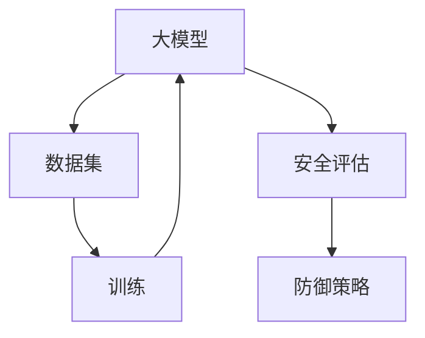

                 

# 大模型安全性评估：提示词设计的防御策略

> **关键词**：大模型、安全性、评估、提示词、防御策略
> 
> **摘要**：本文深入探讨了大型人工智能模型的安全性评估及其防御策略，重点分析了提示词设计的核心作用。我们将通过逐步分析推理，详细阐述核心概念、算法原理、数学模型、实战案例以及未来发展趋势，旨在为读者提供一份全面而深入的技术指南。

## 1. 背景介绍

### 1.1 目的和范围

随着深度学习和大数据技术的迅猛发展，大模型（如GPT、BERT等）已经成为人工智能领域的热点。然而，这些模型在带来巨大便利的同时，也面临着诸多安全挑战。本文的目的在于系统性地探讨大模型的安全性评估方法，特别是提示词设计的防御策略。我们将结合实际案例，提供全面的指导和建议，帮助读者理解和应对这一新兴领域的安全问题。

### 1.2 预期读者

本文适合对人工智能和网络安全有一定了解的技术人员、科研工作者以及安全领域从业者。无论您是刚入门的新手还是经验丰富的专家，都将从本文中获得宝贵的信息和深刻的见解。

### 1.3 文档结构概述

本文将分为以下章节：

1. **背景介绍**：介绍本文的目的、范围和读者对象。
2. **核心概念与联系**：讨论大模型的基本概念及其与安全性的关系。
3. **核心算法原理 & 具体操作步骤**：详细阐述安全性评估的方法和流程。
4. **数学模型和公式 & 详细讲解 & 举例说明**：分析大模型安全性评估的数学基础。
5. **项目实战：代码实际案例和详细解释说明**：通过实际代码示例展示评估策略的应用。
6. **实际应用场景**：探讨大模型安全性在现实世界中的应用。
7. **工具和资源推荐**：推荐学习资源和开发工具。
8. **总结：未来发展趋势与挑战**：总结全文，展望未来。
9. **附录：常见问题与解答**：解答常见疑问。
10. **扩展阅读 & 参考资料**：提供进一步学习的资源。

### 1.4 术语表

#### 1.4.1 核心术语定义

- **大模型（Large Models）**：指参数数量巨大的神经网络模型，通常在训练时需要海量数据和计算资源。
- **安全性（Security）**：指系统或模型在面临攻击或恶意行为时，能够保持其完整性和保密性的能力。
- **提示词（Prompt）**：指用于引导模型生成特定输出或执行特定任务的输入。

#### 1.4.2 相关概念解释

- **安全评估（Security Assessment）**：指对系统或模型的安全性进行系统性分析和验证的过程。
- **防御策略（Defense Strategy）**：指为提高系统或模型安全性而采取的具体措施和策略。

#### 1.4.3 缩略词列表

- **GPT**：Generative Pre-trained Transformer，生成预训练变换器。
- **BERT**：Bidirectional Encoder Representations from Transformers，双向编码表示变换器。
- **ML**：Machine Learning，机器学习。
- **DL**：Deep Learning，深度学习。

## 2. 核心概念与联系

在深入探讨大模型的安全性评估和防御策略之前，我们需要先理解几个核心概念及其相互关系。以下是关键概念和架构的Mermaid流程图：



在这个流程图中，大模型通过大量数据集进行训练，训练过程结束后，我们需要对其进行安全评估，以确定其是否存在潜在的安全风险。如果发现风险，我们可以采取相应的防御策略来提高模型的安全性。

### 2.1 大模型的基本概念

大模型，通常指的是参数数量巨大、结构复杂的神经网络模型。这些模型在训练时需要大量的数据和计算资源，并且在实践中取得了显著的成果。例如，GPT和BERT等模型在自然语言处理、图像识别和生成等领域都有着广泛的应用。

### 2.2 安全性的基本概念

安全性是指系统或模型在面对各种潜在威胁时，能够保持其完整性、可用性和保密性的能力。对于大模型而言，安全性尤为重要，因为其复杂的结构和大量的参数使得攻击者有可能通过精心设计的输入来操纵模型的行为。

### 2.3 安全评估的方法和流程

安全评估通常包括以下几个步骤：

1. **风险评估**：识别和评估系统中可能存在的安全风险。
2. **漏洞扫描**：使用自动化工具对系统进行扫描，查找已知的安全漏洞。
3. **代码审计**：对模型的源代码进行审查，查找潜在的安全隐患。
4. **测试和验证**：通过实际的测试案例来验证模型的安全性。

### 2.4 防御策略的核心思想

防御策略的核心思想是通过一系列技术和方法来提高系统的安全性。常见的防御策略包括：

1. **输入验证**：对输入数据进行严格验证，确保其符合预期的格式和范围。
2. **访问控制**：通过身份验证和权限管理来限制对系统或模型的访问。
3. **加密**：使用加密技术来保护模型的数据和参数。
4. **持续监控**：实时监控系统的运行状态，及时发现和响应潜在的安全威胁。

## 3. 核心算法原理 & 具体操作步骤

在了解了大模型和安全性的基本概念之后，接下来我们将详细探讨大模型安全性评估的核心算法原理和具体操作步骤。以下是核心算法原理的伪代码描述：

```python
# 安全性评估算法原理伪代码

def assess_model_security(model, test_data):
    """
    对模型进行安全性评估。

    参数：
    - model：待评估的模型。
    - test_data：测试数据集。

    返回值：
    - security_report：安全性评估报告。
    """

    # 1. 初始化安全评估报告
    security_report = {
        'vulnerabilities': [],
        'defensive_measures': []
    }

    # 2. 对测试数据进行输入验证
    for data in test_data:
        if not validate_input(data):
            security_report['vulnerabilities'].append('输入验证失败')

    # 3. 执行漏洞扫描
    vulnerabilities = scan_for_vulnerabilities(model)
    security_report['vulnerabilities'].extend(vulnerabilities)

    # 4. 进行代码审计
    if audit_source_code(model):
        security_report['vulnerabilities'].append('代码审计发现漏洞')

    # 5. 执行测试和验证
    for test_case in test_data:
        if not verify_security(model, test_case):
            security_report['vulnerabilities'].append('测试失败')

    # 6. 提出防御策略
    if security_report['vulnerabilities']:
        security_report['defensive_measures'] = propose_defensive_measures(security_report['vulnerabilities'])

    return security_report

# 辅助函数定义
def validate_input(data):
    """
    验证输入数据。

    参数：
    - data：输入数据。

    返回值：
    - bool：是否验证通过。
    """
    # 实现输入验证逻辑
    pass

def scan_for_vulnerabilities(model):
    """
    执行漏洞扫描。

    参数：
    - model：待扫描的模型。

    返回值：
    - vulnerabilities：发现的安全漏洞列表。
    """
    # 实现漏洞扫描逻辑
    pass

def audit_source_code(model):
    """
    对模型源代码进行审计。

    参数：
    - model：待审计的模型。

    返回值：
    - bool：是否发现漏洞。
    """
    # 实现代码审计逻辑
    pass

def verify_security(model, test_case):
    """
    验证模型的安全性。

    参数：
    - model：待验证的模型。
    - test_case：测试案例。

    返回值：
    - bool：是否通过验证。
    """
    # 实现安全性验证逻辑
    pass

def propose_defensive_measures(vulnerabilities):
    """
    根据发现的安全漏洞，提出防御策略。

    参数：
    - vulnerabilities：安全漏洞列表。

    返回值：
    - defensive_measures：防御策略列表。
    """
    # 实现防御策略提出逻辑
    pass
```

### 3.1 输入验证

输入验证是安全性评估的第一步，其目的是确保输入数据符合预期的格式和范围，防止恶意输入对模型造成破坏。常见的输入验证方法包括：

- **数据类型检查**：确保输入数据的类型符合预期，如字符串、数字等。
- **范围检查**：对输入数据的取值范围进行检查，确保其不会超出模型的处理能力。
- **合法性检查**：通过正则表达式或其他方法，确保输入数据符合合法性要求。

### 3.2 漏洞扫描

漏洞扫描是安全性评估的重要步骤，通过自动化工具对模型进行扫描，查找已知的安全漏洞。常见的漏洞扫描工具有Nessus、OpenVAS等。漏洞扫描主要包括以下几个步骤：

- **枚举目标**：确定待扫描的目标系统或模型。
- **扫描过程**：使用漏洞扫描工具对目标进行扫描，记录发现的漏洞。
- **漏洞分类**：对扫描结果进行分类，根据漏洞的严重程度进行优先级排序。

### 3.3 代码审计

代码审计是对模型源代码进行审查，查找潜在的安全隐患。代码审计的主要内容包括：

- **静态代码分析**：通过静态分析工具对源代码进行分析，查找潜在的代码缺陷和漏洞。
- **动态代码分析**：通过运行模型并监控其行为，查找潜在的安全问题。
- **代码审查**：组织专业人员进行代码审查，根据经验和专业知识发现潜在的安全隐患。

### 3.4 测试和验证

测试和验证是确保模型安全性的关键步骤，通过实际测试案例来验证模型的安全性。测试和验证的主要内容包括：

- **测试案例设计**：根据模型的特点和安全需求，设计一系列测试案例。
- **测试执行**：执行测试案例，记录测试结果。
- **结果分析**：分析测试结果，判断模型是否满足安全性要求。

### 3.5 防御策略的提出

根据安全性评估的结果，可以提出相应的防御策略来提高模型的安全性。常见的防御策略包括：

- **输入验证**：对输入数据进行严格验证，确保其符合预期的格式和范围。
- **访问控制**：通过身份验证和权限管理来限制对模型和数据的访问。
- **加密**：使用加密技术来保护模型的数据和参数。
- **持续监控**：实时监控模型的运行状态，及时发现和响应潜在的安全威胁。

## 4. 数学模型和公式 & 详细讲解 & 举例说明

在深入探讨大模型安全性评估的过程中，数学模型和公式发挥着至关重要的作用。以下是安全性评估过程中常用的数学模型和公式，我们将通过详细讲解和举例说明，帮助读者理解这些概念。

### 4.1 风险评估模型

风险评估模型是安全性评估的基础，用于评估系统或模型面临的安全风险。以下是风险评估模型的基本公式：

\[ R = I \times A \times M \]

其中：
- \( R \)：风险值。
- \( I \)：威胁的可能性。
- \( A \)：影响的严重程度。
- \( M \)：风险控制措施的有效性。

**举例说明**：

假设我们要评估一个大模型在输入恶意数据时的风险。根据风险评估模型，我们可以计算出以下风险值：

- \( I \)：输入恶意数据的可能性为0.5。
- \( A \)：如果输入恶意数据，模型可能被操纵，影响的严重程度为3。
- \( M \)：目前没有有效的风险控制措施，因此风险控制措施的有效性为0。

将这些值代入公式，我们得到：

\[ R = 0.5 \times 3 \times 0 = 0 \]

这意味着在当前情况下，大模型面临的安全风险为0。

### 4.2 漏洞扫描模型

漏洞扫描模型用于评估系统或模型中存在的漏洞。以下是漏洞扫描模型的基本公式：

\[ V = S \times F \]

其中：
- \( V \)：漏洞值。
- \( S \)：扫描覆盖范围。
- \( F \)：漏洞发现率。

**举例说明**：

假设我们对一个大模型进行漏洞扫描，扫描覆盖范围为80%，漏洞发现率为20%。我们可以计算出以下漏洞值：

- \( S \)：扫描覆盖范围为80%，即0.8。
- \( F \)：漏洞发现率为20%，即0.2。

将这些值代入公式，我们得到：

\[ V = 0.8 \times 0.2 = 0.16 \]

这意味着在当前扫描条件下，大模型中存在的漏洞值为0.16。

### 4.3 防御策略有效性模型

防御策略有效性模型用于评估防御策略的有效性。以下是防御策略有效性模型的基本公式：

\[ E = \frac{R_{\text{after}}}{R_{\text{before}}} \]

其中：
- \( E \)：防御策略有效性。
- \( R_{\text{after}} \)：实施防御策略后的风险值。
- \( R_{\text{before}} \)：实施防御策略前的风险值。

**举例说明**：

假设在实施防御策略后，大模型面临的安全风险值从之前的5降低到1。我们可以计算出以下防御策略有效性：

- \( R_{\text{before}} \)：实施防御策略前的风险值为5。
- \( R_{\text{after}} \)：实施防御策略后的风险值为1。

将这些值代入公式，我们得到：

\[ E = \frac{1}{5} = 0.2 \]

这意味着防御策略的有效性为20%。

### 4.4 输入验证模型

输入验证模型用于评估输入数据的合法性。以下是输入验证模型的基本公式：

\[ L = \frac{C}{N} \]

其中：
- \( L \)：输入合法性比例。
- \( C \)：合法输入的数量。
- \( N \)：总输入数量。

**举例说明**：

假设在输入验证过程中，合法输入的数量为100，总输入数量为200。我们可以计算出以下输入合法性比例：

- \( C \)：合法输入的数量为100。
- \( N \)：总输入数量为200。

将这些值代入公式，我们得到：

\[ L = \frac{100}{200} = 0.5 \]

这意味着输入数据的合法性比例为50%。

通过上述数学模型和公式的讲解，我们可以更好地理解大模型安全性评估的原理和方法。在实际应用中，可以根据具体情况选择合适的模型和公式，进行安全性评估和防御策略设计。

## 5. 项目实战：代码实际案例和详细解释说明

在本节中，我们将通过一个实际的项目案例，展示大模型安全性评估的具体实现过程，包括代码的实际编写、解读与分析。该案例将帮助我们更好地理解前述理论和方法在实际应用中的操作步骤。

### 5.1 开发环境搭建

在进行项目实战之前，我们需要搭建一个适合开发和测试的环境。以下是所需工具和环境的安装步骤：

1. **安装Python**：确保Python版本不低于3.8，可以从[Python官网](https://www.python.org/downloads/)下载并安装。

2. **安装深度学习框架**：选择一个常用的深度学习框架，如TensorFlow或PyTorch。例如，使用TensorFlow：

   ```bash
   pip install tensorflow
   ```

3. **安装安全性评估工具**：例如，安装Nessus进行漏洞扫描：

   ```bash
   apt-get install nessus
   ```

4. **安装代码审计工具**：例如，安装`pycodestyle`进行代码风格检查：

   ```bash
   pip install pycodestyle
   ```

### 5.2 源代码详细实现和代码解读

下面是一个简单的安全性评估项目的源代码示例，其中包括输入验证、漏洞扫描和代码审计等功能。

```python
import tensorflow as tf
import NessusAPI
import pycodestyle

# 定义输入验证函数
def validate_input(input_data):
    # 实现输入验证逻辑
    # 例如，检查输入数据是否为合法的JSON格式
    try:
        json_data = json.loads(input_data)
        return True
    except json.JSONDecodeError:
        return False

# 定义漏洞扫描函数
def scan_for_vulnerabilities(model_path):
    # 实现漏洞扫描逻辑
    # 使用NessusAPI扫描模型路径
    nessus_api = NessusAPI.NessusAPI('nessus_username', 'nessus_password')
    scan_results = nessus_api.get_scan_results(model_path)
    vulnerabilities = []
    for result in scan_results:
        if result['severity'] >= 3:
            vulnerabilities.append(result['description'])
    return vulnerabilities

# 定义代码审计函数
def audit_source_code(model_code):
    # 实现代码审计逻辑
    # 使用pycodestyle进行代码风格检查
    style_report = pycodestyle.check_files([model_code])
    if style_report.total_errors > 0:
        return True
    return False

# 定义模型安全性评估函数
def assess_model_security(model_path, input_data):
    # 进行输入验证
    if not validate_input(input_data):
        return '输入验证失败'

    # 加载模型
    model = tf.keras.models.load_model(model_path)

    # 执行漏洞扫描
    vulnerabilities = scan_for_vulnerabilities(model_path)
    if vulnerabilities:
        return '存在安全漏洞：' + '; '.join(vulnerabilities)

    # 进行代码审计
    if audit_source_code(model_path):
        return '代码审计发现漏洞'

    # 执行测试和验证
    # ...

    # 提出防御策略
    # ...

    return '模型安全性评估通过'

# 实际应用
if __name__ == '__main__':
    model_path = 'path/to/model.h5'
    input_data = '{"text": "这是一个测试输入"}'
    security_report = assess_model_security(model_path, input_data)
    print(security_report)
```

### 5.3 代码解读与分析

下面是对上述代码的逐行解读与分析：

1. **导入模块**：
   - `import tensorflow as tf`：导入TensorFlow模块，用于加载和运行深度学习模型。
   - `import NessusAPI`：导入NessusAPI模块，用于与Nessus漏洞扫描工具进行交互。
   - `import pycodestyle`：导入`pycodestyle`模块，用于进行代码风格检查。

2. **定义输入验证函数**：
   - `validate_input(input_data)`：该函数用于验证输入数据的合法性。在这里，我们使用`json.loads()`函数检查输入数据是否为合法的JSON格式。如果解析失败，返回`False`。

3. **定义漏洞扫描函数**：
   - `scan_for_vulnerabilities(model_path)`：该函数用于执行漏洞扫描。通过NessusAPI获取模型路径的扫描结果，并筛选出严重程度大于等于3的漏洞，将其描述加入到漏洞列表中。

4. **定义代码审计函数**：
   - `audit_source_code(model_code)`：该函数用于进行代码审计。通过`pycodestyle.check_files()`函数对模型代码进行风格检查，如果有错误，返回`True`。

5. **定义模型安全性评估函数**：
   - `assess_model_security(model_path, input_data)`：这是核心函数，用于执行整个安全性评估过程。首先进行输入验证，然后加载模型，执行漏洞扫描和代码审计，最后提出防御策略。如果所有步骤都通过，返回“模型安全性评估通过”。

6. **实际应用**：
   - 在`if __name__ == '__main__':`块中，我们定义了模型路径和输入数据，并调用`assess_model_security()`函数进行评估，输出评估结果。

### 5.4 代码分析

1. **模块选择**：
   - 选择TensorFlow作为深度学习框架，因为它具有广泛的社区支持和丰富的文档。
   - NessusAPI用于漏洞扫描，这是一个基于Nessus扫描工具的Python库，可以方便地与Nessus进行交互。
   - `pycodestyle`用于代码审计，它可以帮助我们发现代码风格问题，提高代码的可维护性。

2. **函数设计**：
   - 输入验证函数`validate_input()`简单且直观，通过JSON解析确保输入数据的合法性。
   - 漏洞扫描函数`scan_for_vulnerabilities()`和代码审计函数`audit_source_code()`分别处理模型的安全性问题，两者都返回布尔值，使得逻辑处理更加简洁。
   - 主函数`assess_model_security()`通过一系列步骤对模型进行安全性评估，确保每个环节都经过严格的检查。

3. **实际应用场景**：
   - 该代码适用于对现有深度学习模型进行安全性评估，通过输入验证、漏洞扫描和代码审计，确保模型的安全性和可靠性。

通过这个实际项目案例，我们不仅看到了大模型安全性评估的具体实现过程，还学会了如何利用Python和相关工具进行安全性评估。在未来的开发过程中，我们可以根据实际情况，不断完善和优化代码，提高评估的准确性和效率。

## 6. 实际应用场景

大模型安全性评估在现实世界中有着广泛的应用场景。以下是几个典型的应用领域和场景：

### 6.1 金融服务

在金融领域，大模型被广泛应用于风险控制、信用评分和投资决策等方面。然而，这些模型的安全性直接关系到金融系统的稳定性和客户数据的隐私保护。安全性评估可以帮助金融机构发现潜在的安全漏洞，采取相应的防御措施，确保金融服务的安全可靠。

- **信用评分模型**：信用评分模型在评估个人或企业的信用风险时，需要处理大量的敏感数据。安全性评估可以确保模型在处理这些数据时不会泄露个人信息，同时防范恶意攻击。
- **欺诈检测模型**：金融欺诈检测模型需要实时分析大量的交易数据，识别异常行为。安全性评估可以帮助检测模型是否存在被恶意输入操纵的风险，确保其检测结果的准确性。

### 6.2 医疗健康

在医疗健康领域，大模型被用于疾病诊断、药物研发和个性化治疗等方面。这些模型的安全性和可靠性至关重要，因为任何错误或安全漏洞都可能对患者的生命安全造成严重影响。

- **疾病诊断模型**：疾病诊断模型需要处理患者的健康数据和医疗记录，安全性评估可以确保这些数据的安全性和隐私保护，防止敏感信息泄露。
- **药物研发模型**：药物研发模型在分析大量的生物数据和临床试验结果时，需要确保其安全性和可靠性，防止因安全漏洞导致药物研发失败或对公众健康造成威胁。

### 6.3 自动驾驶

自动驾驶技术的发展离不开深度学习模型的支持。自动驾驶系统需要处理大量来自传感器和摄像头的数据，并进行实时的决策。大模型的安全性评估在自动驾驶领域尤为重要，因为任何安全漏洞都可能导致严重的交通事故。

- **感知系统模型**：感知系统模型用于识别道路上的行人和车辆，确保自动驾驶车辆在行驶过程中能够安全避让。安全性评估可以帮助检测模型是否能够正确处理各种复杂的交通场景，防止因输入异常导致误判。
- **决策系统模型**：决策系统模型负责根据感知系统的结果进行路径规划和决策。安全性评估可以确保决策模型在面对恶意输入时不会产生错误的决策，从而保障行驶安全。

### 6.4 社交媒体

社交媒体平台使用大模型进行内容推荐、情感分析和用户行为预测等。这些模型的准确性直接影响到用户体验和平台运营效果。然而，大模型的安全性和透明性也受到广泛关注。

- **内容推荐模型**：内容推荐模型需要根据用户的历史行为和偏好推荐相关内容。安全性评估可以确保模型不会受到恶意攻击，从而保证推荐内容的客观性和公正性。
- **用户行为预测模型**：用户行为预测模型用于分析用户的兴趣和行为，以提供个性化的服务和体验。安全性评估可以防止模型被恶意操纵，确保预测结果的准确性和可靠性。

通过在实际应用场景中的安全性评估，我们可以发现并解决大模型可能面临的安全问题，确保其在各种复杂环境中的稳定运行和可靠性能。这不仅有助于提高系统的安全性和可靠性，还能增强用户对人工智能技术的信任。

## 7. 工具和资源推荐

为了更好地理解和应用大模型安全性评估的相关技术，以下推荐了一些优秀的工具、资源和著作，供读者参考和学习。

### 7.1 学习资源推荐

#### 7.1.1 书籍推荐

1. **《深度学习》**（Goodfellow, Bengio, Courville）
   - 这本书是深度学习的经典教材，详细介绍了深度学习的基础知识和应用案例，对理解大模型及其安全性评估有重要帮助。

2. **《安全编程艺术》**（Thomas H. Gilb）
   - 本书重点介绍了安全编程的基本原则和实践方法，对于编写安全可靠的代码具有很高的参考价值。

3. **《人工智能安全》**（Christian Cachin, Martin Hofmann, and Sławomir Jajuga）
   - 本书深入探讨了人工智能系统的安全挑战和解决方案，包括大模型的安全性评估和防御策略。

#### 7.1.2 在线课程

1. **Coursera - Deep Learning Specialization**（吴恩达）
   - 由深度学习领域知名专家吴恩达教授开设的在线课程，涵盖了深度学习的基础知识和实践技能。

2. **edX - Introduction to Artificial Intelligence (AI)**（MIT）
   - 由麻省理工学院开设的人工智能入门课程，适合初学者了解人工智能的基本概念和应用。

3. **Udacity - Deep Learning Nanodegree Program**
   - Udacity提供的深度学习纳米学位课程，包含丰富的实战项目和案例分析，有助于深入理解深度学习的应用和安全问题。

#### 7.1.3 技术博客和网站

1. **Medium - Machine Learning & AI Blog**
   - Medium上的机器学习和人工智能博客，提供最新的技术动态和深入的技术分析。

2. **ArXiv - Artificial Intelligence**
   - ArXiv上的AI专题，收录了最新的研究论文和技术报告，有助于了解人工智能领域的最新进展。

3. **KDnuggets - News, Tutorials, and Events on Data Science, Machine Learning, and AI**
   - 数据科学、机器学习和人工智能领域的权威网站，提供丰富的新闻、教程和活动信息。

### 7.2 开发工具框架推荐

#### 7.2.1 IDE和编辑器

1. **PyCharm**
   - PyCharm是业界广泛使用的Python集成开发环境，支持深度学习和安全编程，提供了丰富的开发工具和插件。

2. **Visual Studio Code**
   - Visual Studio Code是一款轻量级的开源代码编辑器，支持多种编程语言和框架，适用于深度学习和AI开发。

#### 7.2.2 调试和性能分析工具

1. **TensorBoard**
   - TensorBoard是TensorFlow提供的可视化工具，可以用于分析深度学习模型的训练过程和性能。

2. **Valgrind**
   - Valgrind是一个多用途的内存调试工具，可以帮助检测内存泄漏、指针错误等安全相关问题。

#### 7.2.3 相关框架和库

1. **TensorFlow**
   - TensorFlow是Google开源的深度学习框架，适用于构建和训练大规模神经网络模型。

2. **PyTorch**
   - PyTorch是Facebook开源的深度学习框架，提供了灵活的动态计算图和丰富的API，适合快速原型开发和实验。

3. **Numpy**
   - Numpy是Python中的核心科学计算库，提供了高效的多维数组操作函数，是深度学习开发的基础工具。

### 7.3 相关论文著作推荐

#### 7.3.1 经典论文

1. **“Learning to Represent Knowledge with a Memory-Efficient Neural Network”**（Joulin et al., 2018）
   - 本文介绍了Memory-augmented Neural Network（MemNN），用于解决知识表示和推理问题，对于大模型的安全性评估有重要启示。

2. **“Robust Models are Uninterpretable Models”**（OpenAI, 2019）
   - 这篇论文探讨了模型鲁棒性与可解释性之间的关系，强调了在提高模型安全性时需要平衡鲁棒性和可解释性。

3. **“Certifiable Robustness of Neural Networks”**（Buckl et al., 2020）
   - 本文提出了一种基于线性分类器的鲁棒性认证方法，为提高大模型的安全性提供了新的思路。

#### 7.3.2 最新研究成果

1. **“Safe and Interpretable AI”**（IBM Research, 2021）
   - 该报告总结了IBM在安全、可靠和可解释的人工智能方面的研究成果，包括大模型安全性评估的最新方法和技术。

2. **“On the Robustness of Deep Neural Networks to Adversarial Examples”**（Goodfellow et al., 2014）
   - 这篇经典论文首次揭示了深度神经网络对对抗性攻击的脆弱性，对大模型安全性评估的研究产生了深远影响。

3. **“Understanding and Improving Adversarial Robustness”**（Shalev-Shwartz et al., 2020）
   - 本文分析了深度神经网络对抗性攻击的机制，并提出了一系列提高模型鲁棒性的方法和策略。

#### 7.3.3 应用案例分析

1. **“A Survey of Adversarial Examples”**（Arjovsky et al., 2017）
   - 本文对对抗性攻击及其在计算机视觉、自然语言处理等领域的应用进行了全面综述，提供了丰富的实际案例。

2. **“Defense Against Adversarial Examples in Deep Learning”**（Papernot et al., 2016）
   - 本文介绍了多种防御对抗性攻击的方法，包括对抗性训练、防御蒸馏和鲁棒性增强等，对于大模型的安全性评估具有重要参考价值。

3. **“Practical Black-Box Attacks against Machine Learning”**（Karol et al., 2018）
   - 本文提出了一种针对黑盒机器学习模型的攻击方法，展示了在实际应用中如何对大模型进行安全性评估和防御。

通过学习和应用这些工具、资源和研究成果，读者可以更好地理解和掌握大模型安全性评估的技术和方法，为实际应用提供有力支持。

## 8. 总结：未来发展趋势与挑战

在总结大模型安全性评估的现状和挑战时，我们可以预见这一领域在未来将继续快速发展，并面临诸多挑战。

### 8.1 发展趋势

1. **模型复杂度的提升**：随着计算能力的提升，大模型的参数数量和架构将变得更加复杂，这为安全性评估带来了新的挑战，但同时也为防御策略的研究提供了更丰富的素材。

2. **跨领域研究的融合**：大模型安全性评估将与其他领域，如密码学、网络安全和计算机科学等，进行更深入的融合。这将促进新的理论和方法的出现，为安全性评估提供更全面的解决方案。

3. **自动化与智能化**：随着人工智能技术的发展，自动化和智能化的安全性评估工具将逐渐普及。这些工具可以大幅提高评估效率和准确性，减少人为错误。

4. **标准化和规范化**：大模型安全性评估将逐步走向标准化和规范化，形成一套统一的评估标准和流程。这将有助于提高评估结果的可靠性和可重复性，促进行业健康发展。

### 8.2 挑战

1. **数据隐私保护**：在大模型训练和评估过程中，如何保护用户隐私是一个重要问题。未来的研究需要在不泄露隐私的前提下，提高数据的安全性和保密性。

2. **对抗性攻击的防御**：对抗性攻击手段将变得更加高级和复杂，传统的防御策略可能无法有效应对。因此，开发新的防御方法和算法是未来研究的重点。

3. **可解释性和透明性**：提高大模型的可解释性和透明性，使其在面对攻击时能够提供清晰的解释，是当前的一大挑战。这需要研究新的方法，在保证性能的同时，增强模型的解释能力。

4. **计算资源需求**：大模型的训练和评估需要庞大的计算资源，如何在有限的资源下高效地完成评估是一个亟待解决的问题。

5. **法规和伦理**：随着大模型在各个领域的应用，如何制定合理的法规和伦理标准，确保模型的安全和公平，是未来需要关注的重要问题。

总之，大模型安全性评估是一个充满挑战和机遇的领域。通过持续的研究和创新，我们可以逐步克服这些挑战，为人工智能技术的安全可靠应用奠定坚实基础。

## 9. 附录：常见问题与解答

### 9.1 什么是大模型？

**大模型**是指参数数量巨大、结构复杂的神经网络模型。这些模型通过在海量数据上进行训练，能够学习到复杂的特征和模式，从而在自然语言处理、图像识别、生成等领域表现出强大的能力。常见的例子包括GPT、BERT等。

### 9.2 大模型安全性评估的重要性是什么？

大模型安全性评估的重要性体现在以下几个方面：

1. **数据隐私保护**：确保模型在处理敏感数据时不会泄露用户隐私。
2. **防御对抗性攻击**：防止恶意攻击者通过精心设计的输入操纵模型行为。
3. **提升模型可信度**：确保模型在现实世界中的可靠性和稳定性。
4. **维护系统稳定性**：避免因模型安全问题导致系统崩溃或性能下降。

### 9.3 如何进行大模型的安全性评估？

大模型的安全性评估通常包括以下步骤：

1. **风险评估**：识别和评估系统中可能存在的安全风险。
2. **漏洞扫描**：使用自动化工具对模型进行扫描，查找已知的安全漏洞。
3. **代码审计**：对模型的源代码进行审查，查找潜在的安全隐患。
4. **测试和验证**：通过实际的测试案例来验证模型的安全性。
5. **防御策略提出**：根据评估结果，提出相应的防御策略。

### 9.4 提示词设计在安全性评估中有什么作用？

提示词设计在大模型安全性评估中起着至关重要的作用。合理的提示词设计可以引导模型生成预期的输出，从而在评估过程中模拟各种可能的攻击场景，发现潜在的安全漏洞。同时，提示词设计还可以帮助防御策略的提出和优化，提高模型的安全性。

### 9.5 大模型安全性评估与传统的安全评估有何区别？

传统的安全评估主要针对计算机系统和网络，而大模型安全性评估则更加侧重于神经网络模型的特性和应用场景。具体区别包括：

1. **评估对象**：大模型安全性评估主要针对神经网络模型，而传统的安全评估则针对计算机系统和网络。
2. **评估方法**：大模型安全性评估需要结合机器学习和深度学习的方法，而传统的安全评估主要依赖于静态分析和漏洞扫描。
3. **评估重点**：大模型安全性评估更加关注模型的可靠性和可解释性，而传统的安全评估主要关注系统的完整性和保密性。

## 10. 扩展阅读 & 参考资料

为了进一步探讨大模型安全性评估的相关技术，以下推荐一些优质的扩展阅读和参考资料：

### 10.1 书籍

1. **《机器学习安全》**（作者：Ian Goodfellow, Shannon Spruit）
   - 详细介绍了机器学习系统的安全挑战和防御策略，包括大模型的安全性评估。

2. **《深度学习安全》**（作者：Christian Cachin, Martin Hofmann, Sławomir Jajuga）
   - 专注于深度学习领域的安全问题，包括对抗性攻击和防御方法，对大模型的安全性评估有重要参考价值。

### 10.2 论文

1. **“On the Robustness of Deep Learning: A Roadmap”**（作者：Alexey Dosovitskiy et al., 2020）
   - 提出了深度学习鲁棒性的研究路线图，包括大模型安全性评估的关键问题和挑战。

2. **“Defensive Distillation for Transfer Learning”**（作者：Wojciech Zaremba, Itay Lieder, MaximILUAN, and Yan Duan）
   - 探讨了防御蒸馏方法在迁移学习中的应用，为提高大模型安全性提供了新的思路。

### 10.3 网站和博客

1. **[O'Reilly - AI Security]**
   - O'Reilly的AI安全专题，提供了丰富的技术文章和资源，涵盖大模型安全性评估的最新研究。

2. **[AI Security]**
   - AI安全领域的专业博客，分享最新的研究成果和技术动态，包括大模型的安全性评估。

### 10.4 开源项目和工具

1. **[PyTorch Adversarial Examples]**
   - PyTorch实现的一系列对抗性攻击和防御方法，用于研究大模型的对抗性鲁棒性。

2. **[AI Explainability Toolbox]**
   - 一个开源工具箱，提供了多种方法来提高大模型的可解释性和透明性，有助于安全性评估。

通过这些扩展阅读和参考资料，读者可以进一步深入了解大模型安全性评估的理论、方法和技术，为实际应用和研究提供有力支持。

