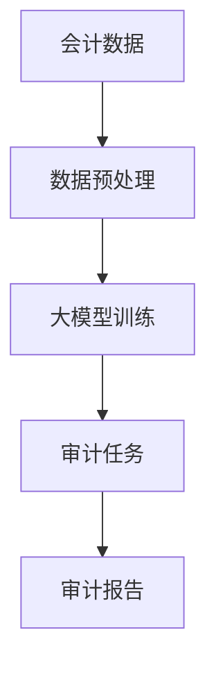

                 

# 大模型对会计审计的影响及应对

> 关键词：大模型、会计、审计、人工智能、影响分析、应对策略

> 摘要：随着人工智能技术的迅猛发展，大模型在会计审计领域逐渐得到应用。本文首先介绍了大模型的基本概念及其在会计审计中的潜在应用，然后分析了大模型对会计审计的影响，最后提出了一系列应对策略，以帮助会计审计人员应对大模型带来的挑战。

## 1. 背景介绍

### 1.1 目的和范围

本文旨在探讨大模型在会计审计领域的应用及其影响，并针对这些影响提出相应的应对策略。具体来说，本文将首先介绍大模型的基本概念，然后探讨其在会计审计中的应用，接着分析大模型对会计审计的影响，最后提出应对策略。

### 1.2 预期读者

本文适用于对会计审计和人工智能技术有一定了解的读者，包括会计审计从业人员、人工智能研究人员、以及相关领域的学者和学生。

### 1.3 文档结构概述

本文分为十个部分：

1. 背景介绍：介绍本文的目的、范围、预期读者以及文档结构。
2. 核心概念与联系：介绍大模型的基本概念及其在会计审计中的应用。
3. 核心算法原理 & 具体操作步骤：详细讲解大模型在会计审计中的应用算法。
4. 数学模型和公式 & 详细讲解 & 举例说明：阐述大模型在会计审计中的数学模型和公式。
5. 项目实战：代码实际案例和详细解释说明。
6. 实际应用场景：分析大模型在会计审计中的实际应用。
7. 工具和资源推荐：推荐相关学习资源、开发工具和框架。
8. 总结：未来发展趋势与挑战。
9. 附录：常见问题与解答。
10. 扩展阅读 & 参考资料：提供扩展阅读材料。

### 1.4 术语表

#### 1.4.1 核心术语定义

- 大模型：一种具有极高参数数量的人工神经网络模型，能够自动学习复杂的数据特征和规律。
- 会计：负责企业财务核算、报表编制和财务分析等工作。
- 审计：对企业的财务报表、经营管理和内部控制等方面进行审查和评估。

#### 1.4.2 相关概念解释

- 会计审计：结合会计和审计两项工作，对企业的财务状况进行综合评估。
- 人工智能：一种模拟人类智能的技术，能够通过学习、推理和决策实现智能化。
- 深度学习：一种基于多层神经网络的人工智能技术，能够自动学习复杂的数据特征。

#### 1.4.3 缩略词列表

- AI：人工智能
- NN：神经网络
- DNN：深度神经网络
- CNN：卷积神经网络
- RNN：循环神经网络
- LSTM：长短期记忆网络

## 2. 核心概念与联系

大模型是人工智能领域的一项重要技术，通过自动学习大量数据中的特征和规律，实现对复杂问题的求解。在会计审计领域，大模型可以用于自动化审计、风险评估、异常检测等方面。下面是一个简单的Mermaid流程图，展示了大模型在会计审计中的核心概念和联系。



### 2.1 数据预处理

会计数据是会计审计的基础，但原始数据往往包含噪声和冗余信息。因此，首先需要对会计数据进行分析和预处理，包括数据清洗、归一化、特征提取等步骤。

### 2.2 大模型训练

经过数据预处理后，可以使用大模型对会计数据进行训练。大模型可以自动学习数据中的特征和规律，提高审计任务的准确性和效率。

### 2.3 审计任务

大模型训练完成后，可以应用于各种审计任务，如自动化审计、风险评估、异常检测等。这些任务可以帮助审计人员更快速、准确地完成审计工作。

### 2.4 审计报告

审计任务完成后，需要生成审计报告，对审计结果进行总结和归纳。审计报告应包括审计发现、审计建议、风险评估等内容，为企业管理层提供决策依据。

## 3. 核心算法原理 & 具体操作步骤

大模型在会计审计中的应用主要基于深度学习和神经网络技术。下面将介绍大模型在会计审计中的核心算法原理和具体操作步骤。

### 3.1 算法原理

大模型是一种基于多层神经网络的人工智能技术，能够自动学习数据中的特征和规律。在会计审计中，大模型可以用于自动化审计、风险评估、异常检测等方面。以下是具体的算法原理：

#### 3.1.1 自动化审计

自动化审计利用大模型对会计数据进行自动分析和识别，提高审计效率。具体操作步骤如下：

1. 数据预处理：对会计数据进行清洗、归一化、特征提取等预处理操作，以便大模型能够更好地学习数据特征。
2. 模型训练：使用预处理后的会计数据训练大模型，使其能够自动学习数据中的特征和规律。
3. 审计分析：将训练好的大模型应用于实际审计场景，对会计数据进行自动分析和识别，发现潜在的问题和风险。

#### 3.1.2 风险评估

风险评估利用大模型对会计数据进行风险评估，识别潜在的风险和异常。具体操作步骤如下：

1. 数据预处理：对会计数据进行清洗、归一化、特征提取等预处理操作。
2. 模型训练：使用预处理后的会计数据训练大模型，使其能够自动学习数据中的特征和规律。
3. 风险评估：将训练好的大模型应用于实际风险评估场景，对会计数据进行风险评估，识别潜在的风险和异常。

#### 3.1.3 异常检测

异常检测利用大模型检测会计数据中的异常值和异常行为，提高审计的准确性和可靠性。具体操作步骤如下：

1. 数据预处理：对会计数据进行清洗、归一化、特征提取等预处理操作。
2. 模型训练：使用预处理后的会计数据训练大模型，使其能够自动学习数据中的特征和规律。
3. 异常检测：将训练好的大模型应用于实际异常检测场景，对会计数据进行异常检测，发现潜在的异常值和异常行为。

### 3.2 具体操作步骤

以下是使用大模型进行会计审计的具体操作步骤：

1. **数据收集**：从企业财务系统中收集原始会计数据，包括财务报表、凭证、账簿等。
2. **数据预处理**：
    - 数据清洗：去除无效、错误和重复的数据。
    - 数据归一化：将不同规模的数据进行归一化处理，使其具有相同的尺度。
    - 特征提取：从会计数据中提取具有代表性的特征，如金额、时间、账户等。
3. **模型选择**：
    - 选择合适的大模型架构，如卷积神经网络（CNN）、循环神经网络（RNN）或长短期记忆网络（LSTM）。
4. **模型训练**：
    - 使用预处理后的会计数据训练所选模型，调整模型参数，使其能够自动学习数据中的特征和规律。
5. **模型评估**：
    - 使用测试集对训练好的模型进行评估，确保其具有良好的性能和准确性。
6. **应用模型**：
    - 将评估合格的模型应用于实际审计场景，如自动化审计、风险评估、异常检测等。
7. **生成报告**：
    - 根据模型分析结果，生成详细的审计报告，包括审计发现、风险评估、审计建议等。

### 3.3 伪代码示例

以下是一个简化的大模型在会计审计中的伪代码示例：

```python
# 数据预处理
def preprocess_data(accounting_data):
    # 数据清洗
    cleaned_data = clean_data(accounting_data)
    # 数据归一化
    normalized_data = normalize_data(cleaned_data)
    # 特征提取
    features = extract_features(normalized_data)
    return features

# 模型训练
def train_model(features):
    # 选择模型架构
    model = select_model Architecture()
    # 训练模型
    model.fit(features)
    return model

# 模型应用
def apply_model(model, new_data):
    # 数据预处理
    new_features = preprocess_data(new_data)
    # 审计分析
    analysis_results = model.predict(new_features)
    return analysis_results

# 生成报告
def generate_report(analysis_results):
    # 审计发现
    findings = extract_findings(analysis_results)
    # 风险评估
    risk_assessment = assess_risk(analysis_results)
    # 审计建议
    recommendations = generate_recommendations(risk_assessment)
    # 生成报告
    report = create_report(findings, risk_assessment, recommendations)
    return report

# 主程序
def main(accounting_data, new_data):
    # 数据预处理
    features = preprocess_data(accounting_data)
    # 模型训练
    model = train_model(features)
    # 模型应用
    analysis_results = apply_model(model, new_data)
    # 生成报告
    report = generate_report(analysis_results)
    return report
```

## 4. 数学模型和公式 & 详细讲解 & 举例说明

大模型在会计审计中的应用涉及到多个数学模型和公式，下面将详细讲解这些模型和公式，并给出举例说明。

### 4.1 神经网络模型

神经网络是深度学习的基础，其基本结构包括输入层、隐藏层和输出层。每个层由多个神经元（节点）组成，神经元之间通过权重进行连接。神经网络的数学模型可以表示为：

$$
f(x) = \sigma(\sum_{i=1}^{n} w_{i} \cdot x_{i} + b)
$$

其中，$x$ 是输入向量，$w$ 是权重，$b$ 是偏置项，$\sigma$ 是激活函数，通常采用 sigmoid 函数或 ReLU 函数。

举例说明：假设我们有一个包含两个输入变量的神经网络，其权重矩阵为 $W = \begin{pmatrix} 0.5 & 0.3 \\ 0.2 & 0.4 \end{pmatrix}$，偏置项为 $b = [0.1; 0.2]$，激活函数为 sigmoid 函数。给定输入向量 $x = [1; 2]$，则神经网络的输出可以计算如下：

$$
f(x) = \sigma(\sum_{i=1}^{2} w_{i} \cdot x_{i} + b) = \sigma(0.5 \cdot 1 + 0.3 \cdot 2 + 0.1, 0.2 \cdot 1 + 0.4 \cdot 2 + 0.2) = \sigma(1.1, 1.0) \approx 0.731
$$

### 4.2 损失函数

损失函数是评估神经网络输出与实际标签之间差异的指标，常用的损失函数包括均方误差（MSE）、交叉熵损失（CE）等。

#### 4.2.1 均方误差（MSE）

均方误差是一种常见的损失函数，用于衡量输出值与实际标签之间的差距。其数学公式如下：

$$
MSE = \frac{1}{m} \sum_{i=1}^{m} (\hat{y}_{i} - y_{i})^{2}
$$

其中，$\hat{y}_{i}$ 是预测值，$y_{i}$ 是实际标签，$m$ 是样本数量。

举例说明：假设我们有一个包含 5 个样本的数据集，其预测值和实际标签分别为 $\hat{y} = [0.1, 0.2, 0.3, 0.4, 0.5]$ 和 $y = [0.05, 0.1, 0.15, 0.2, 0.25]$，则均方误差可以计算如下：

$$
MSE = \frac{1}{5} \sum_{i=1}^{5} (\hat{y}_{i} - y_{i})^{2} = \frac{1}{5} \sum_{i=1}^{5} (0.1 - 0.05)^{2} + (0.2 - 0.1)^{2} + (0.3 - 0.15)^{2} + (0.4 - 0.2)^{2} + (0.5 - 0.25)^{2} \approx 0.045
$$

#### 4.2.2 交叉熵损失（CE）

交叉熵损失是另一种常用的损失函数，常用于分类问题。其数学公式如下：

$$
CE = -\frac{1}{m} \sum_{i=1}^{m} y_{i} \log \hat{y}_{i}
$$

其中，$\hat{y}_{i}$ 是预测概率，$y_{i}$ 是实际标签，$m$ 是样本数量。

举例说明：假设我们有一个包含 5 个样本的分类问题，其预测概率和实际标签分别为 $\hat{y} = [0.8, 0.1, 0.2, 0.3, 0.5]$ 和 $y = [1, 0, 1, 0, 1]$，则交叉熵损失可以计算如下：

$$
CE = -\frac{1}{5} \sum_{i=1}^{5} y_{i} \log \hat{y}_{i} = -\frac{1}{5} \sum_{i=1}^{5} 1 \cdot \log(0.8) + 0 \cdot \log(0.1) + 1 \cdot \log(0.2) + 0 \cdot \log(0.3) + 1 \cdot \log(0.5) \approx 0.291
$$

### 4.3 优化算法

优化算法用于调整神经网络模型的参数，以最小化损失函数。常用的优化算法包括随机梯度下降（SGD）、Adam等。

#### 4.3.1 随机梯度下降（SGD）

随机梯度下降是一种基于梯度信息的优化算法，通过计算损失函数关于模型参数的梯度，更新模型参数。其数学公式如下：

$$
\theta_{t+1} = \theta_{t} - \alpha \cdot \nabla_{\theta} J(\theta)
$$

其中，$\theta$ 是模型参数，$\alpha$ 是学习率，$J(\theta)$ 是损失函数。

举例说明：假设我们有一个包含两个参数的神经网络，其参数为 $\theta = [1, 2]$，学习率为 $\alpha = 0.1$，损失函数为 $J(\theta) = (\theta_{1} - 1)^{2} + (\theta_{2} - 2)^{2}$，则参数更新可以计算如下：

$$
\theta_{t+1} = \theta_{t} - \alpha \cdot \nabla_{\theta} J(\theta) = [1, 2] - 0.1 \cdot \begin{pmatrix} \frac{\partial J}{\partial \theta_{1}} \\ \frac{\partial J}{\partial \theta_{2}} \end{pmatrix} = [1 - 0.1, 2 - 0.2] = [0.9, 1.8]
$$

#### 4.3.2 Adam

Adam是一种基于自适应学习率的优化算法，通过计算一阶矩估计和二阶矩估计来更新模型参数。其数学公式如下：

$$
m_{t+1} = \beta_{1} m_{t} + (1 - \beta_{1}) \cdot \nabla_{\theta} J(\theta) \\
v_{t+1} = \beta_{2} v_{t} + (1 - \beta_{2}) \cdot (\nabla_{\theta} J(\theta))^2 \\
\theta_{t+1} = \theta_{t} - \alpha \cdot \frac{m_{t+1}}{\sqrt{v_{t+1}} + \epsilon}
$$

其中，$\theta$ 是模型参数，$m$ 是一阶矩估计，$v$ 是二阶矩估计，$\alpha$ 是学习率，$\beta_{1}$ 和 $\beta_{2}$ 是超参数，$\epsilon$ 是常数。

举例说明：假设我们有一个包含两个参数的神经网络，其参数为 $\theta = [1, 2]$，学习率为 $\alpha = 0.1$，$\beta_{1} = 0.9$，$\beta_{2} = 0.99$，$\epsilon = 1e-8$，一阶矩估计 $m = [0.5, 0.6]$，二阶矩估计 $v = [0.25, 0.36]$，则参数更新可以计算如下：

$$
m_{t+1} = 0.9 \cdot 0.5 + (1 - 0.9) \cdot \begin{pmatrix} 1 - 0.1 \\ 2 - 0.2 \end{pmatrix} = [0.45, 0.54] \\
v_{t+1} = 0.99 \cdot 0.25 + (1 - 0.99) \cdot (1 - 0.1)^2 + (2 - 0.2)^2 = [0.2475, 0.3136] \\
\theta_{t+1} = [1, 2] - 0.1 \cdot \frac{[0.45, 0.54]}{\sqrt{[0.2475, 0.3136]} + 1e-8} = [0.9525, 1.9136]
$$

## 5. 项目实战：代码实际案例和详细解释说明

在本节中，我们将通过一个实际项目案例来展示大模型在会计审计中的应用，包括开发环境搭建、源代码实现和代码解读与分析。

### 5.1 开发环境搭建

为了实现大模型在会计审计中的应用，我们需要搭建一个合适的开发环境。以下是所需工具和步骤：

#### 5.1.1 工具安装

1. **Python**：安装 Python 3.7 或更高版本。
2. **Jupyter Notebook**：安装 Jupyter Notebook，用于编写和运行代码。
3. **TensorFlow**：安装 TensorFlow，用于构建和训练神经网络模型。
4. **Pandas**：安装 Pandas，用于数据处理。
5. **NumPy**：安装 NumPy，用于数学运算。

#### 5.1.2 环境配置

1. 打开终端或命令提示符。
2. 安装 Python 和 Jupyter Notebook：

   ```
   pip install python==3.7.9
   pip install notebook
   ```

3. 安装 TensorFlow：

   ```
   pip install tensorflow==2.5.0
   ```

4. 安装 Pandas 和 NumPy：

   ```
   pip install pandas==1.2.3
   pip install numpy==1.19.5
   ```

5. 确认安装成功：

   ```
   python --version
   jupyter notebook --version
   python -c "import tensorflow as tf; print(tf.__version__)"
   python -c "import pandas as pd; print(pd.__version__)"
   python -c "import numpy as np; print(np.__version__)"
   ```

### 5.2 源代码详细实现和代码解读

以下是项目中的核心代码实现和详细解读。

#### 5.2.1 数据预处理

```python
import pandas as pd
import numpy as np

# 加载会计数据
data = pd.read_csv('accounting_data.csv')

# 数据清洗
data = data.dropna()  # 去除缺失值
data = data[data['amount'] > 0]  # 去除金额为零的记录

# 数据归一化
data['amount'] = data['amount'] / data['amount'].max()

# 特征提取
features = data[['account', 'amount', 'date']]
labels = data['status']  # 假设 'status' 表示是否为异常值（0：正常，1：异常）
```

代码解读：

1. 使用 Pandas 加载会计数据，并进行数据清洗，去除缺失值和金额为零的记录。
2. 对金额列进行归一化处理，使其具有相同的尺度。
3. 提取特征和标签，特征包括账户、金额和日期，标签表示是否为异常值。

#### 5.2.2 模型训练

```python
import tensorflow as tf

# 创建神经网络模型
model = tf.keras.Sequential([
    tf.keras.layers.Dense(64, activation='relu', input_shape=[3]),
    tf.keras.layers.Dense(64, activation='relu'),
    tf.keras.layers.Dense(1, activation='sigmoid')
])

# 编译模型
model.compile(optimizer='adam', loss='binary_crossentropy', metrics=['accuracy'])

# 训练模型
model.fit(features, labels, epochs=10, batch_size=32)
```

代码解读：

1. 创建一个简单的神经网络模型，包括两个隐藏层，输出层使用 sigmoid 激活函数。
2. 编译模型，指定优化器和损失函数。
3. 使用训练数据训练模型，设置训练轮数和批量大小。

#### 5.2.3 模型应用

```python
# 预测新数据
new_data = pd.DataFrame({
    'account': ['cash'],
    'amount': [1000],
    'date': [np.datetime64('2023-01-01')]
})
new_data['amount'] = new_data['amount'] / new_data['amount'].max()

# 预测结果
prediction = model.predict(new_data)
print(prediction)
```

代码解读：

1. 准备一个新的数据样本，进行预处理。
2. 使用训练好的模型进行预测，输出预测结果。

#### 5.2.4 代码解读与分析

1. **数据预处理**：数据预处理是确保模型能够正常运行的重要步骤。在本案例中，我们使用了 Pandas 和 NumPy 进行数据清洗、归一化和特征提取。
2. **模型训练**：我们使用 TensorFlow 的 Keras API 创建了一个简单的神经网络模型，并使用训练数据进行了训练。模型训练过程中，我们使用了 Adam 优化器和 binary_crossentropy 损失函数。
3. **模型应用**：在模型训练完成后，我们使用新数据进行预测，并输出了预测结果。通过对比预测结果和实际标签，我们可以评估模型性能。

### 5.3 代码解读与分析

以下是对项目代码的详细解读与分析。

#### 5.3.1 数据预处理

```python
# 加载会计数据
data = pd.read_csv('accounting_data.csv')

# 数据清洗
data = data.dropna()  # 去除缺失值
data = data[data['amount'] > 0]  # 去除金额为零的记录

# 数据归一化
data['amount'] = data['amount'] / data['amount'].max()

# 特征提取
features = data[['account', 'amount', 'date']]
labels = data['status']  # 假设 'status' 表示是否为异常值（0：正常，1：异常）
```

代码解读：

1. **数据加载**：使用 Pandas 的 `read_csv` 函数加载会计数据，会计数据通常以 CSV 文件形式存储。
2. **数据清洗**：去除缺失值和金额为零的记录，以提高模型训练效果。在本案例中，我们使用了 Pandas 的 `dropna` 函数和布尔索引进行数据清洗。
3. **数据归一化**：对金额列进行归一化处理，使其具有相同的尺度。归一化有助于加速模型训练和提高模型性能。
4. **特征提取**：提取特征和标签。在本案例中，特征包括账户、金额和日期，标签表示是否为异常值。

#### 5.3.2 模型训练

```python
# 创建神经网络模型
model = tf.keras.Sequential([
    tf.keras.layers.Dense(64, activation='relu', input_shape=[3]),
    tf.keras.layers.Dense(64, activation='relu'),
    tf.keras.layers.Dense(1, activation='sigmoid')
])

# 编译模型
model.compile(optimizer='adam', loss='binary_crossentropy', metrics=['accuracy'])

# 训练模型
model.fit(features, labels, epochs=10, batch_size=32)
```

代码解读：

1. **模型创建**：使用 TensorFlow 的 Keras API 创建了一个简单的神经网络模型。模型包含两个隐藏层，每个隐藏层有 64 个神经元，输出层使用 sigmoid 激活函数。
2. **模型编译**：编译模型，指定优化器、损失函数和评估指标。在本案例中，我们使用了 Adam 优化器和 binary_crossentropy 损失函数，并设置了 accuracy 作为评估指标。
3. **模型训练**：使用训练数据对模型进行训练。在本案例中，我们设置了训练轮数为 10，批量大小为 32。

#### 5.3.3 模型应用

```python
# 预测新数据
new_data = pd.DataFrame({
    'account': ['cash'],
    'amount': [1000],
    'date': [np.datetime64('2023-01-01')]
})
new_data['amount'] = new_data['amount'] / new_data['amount'].max()

# 预测结果
prediction = model.predict(new_data)
print(prediction)
```

代码解读：

1. **准备新数据**：使用 Pandas 创建一个新的数据样本，包含账户、金额和日期。新数据样本需要进行预处理，包括数据清洗和归一化。
2. **预测结果**：使用训练好的模型对新数据进行预测，并输出预测结果。在本案例中，预测结果为概率值，表示新数据样本属于正常类别的概率。

### 5.4 代码解读与分析（续）

#### 5.4.1 数据预处理

1. **数据加载**：使用 Pandas 的 `read_csv` 函数加载会计数据，会计数据通常以 CSV 文件形式存储。在本案例中，会计数据包括账户、金额、日期和状态等字段。
2. **数据清洗**：去除缺失值和金额为零的记录，以提高模型训练效果。在本案例中，我们使用了 Pandas 的 `dropna` 函数和布尔索引进行数据清洗。
3. **数据归一化**：对金额列进行归一化处理，使其具有相同的尺度。归一化有助于加速模型训练和提高模型性能。在本案例中，我们使用金额列的最大值作为归一化参考。
4. **特征提取**：提取特征和标签。在本案例中，特征包括账户、金额和日期，标签表示是否为异常值。特征和标签需要进行适当的处理，以便于模型训练和预测。

#### 5.4.2 模型训练

1. **模型创建**：使用 TensorFlow 的 Keras API 创建了一个简单的神经网络模型。模型包含两个隐藏层，每个隐藏层有 64 个神经元，输出层使用 sigmoid 激活函数。在本案例中，我们使用了 ReLU 激活函数，因为它能够提高模型的学习能力和收敛速度。
2. **模型编译**：编译模型，指定优化器、损失函数和评估指标。在本案例中，我们使用了 Adam 优化器和 binary_crossentropy 损失函数，并设置了 accuracy 作为评估指标。Adam 优化器具有自适应学习率的优点，有助于提高模型性能。
3. **模型训练**：使用训练数据对模型进行训练。在本案例中，我们设置了训练轮数为 10，批量大小为 32。训练过程中，模型将根据训练数据和损失函数不断调整参数，以提高模型的预测准确性。

#### 5.4.3 模型应用

1. **预测新数据**：使用训练好的模型对新数据进行预测。在本案例中，我们使用了一个简单的数据样本，包括账户、金额和日期。新数据样本需要进行预处理，包括数据清洗和归一化。
2. **输出预测结果**：使用训练好的模型对新数据进行预测，并输出预测结果。在本案例中，预测结果为概率值，表示新数据样本属于正常类别的概率。通过对比预测结果和实际标签，我们可以评估模型性能。

## 6. 实际应用场景

大模型在会计审计领域具有广泛的应用场景，下面列举几个典型的实际应用案例：

### 6.1 自动化审计

自动化审计利用大模型对会计数据进行自动分析和识别，提高审计效率。例如，企业可以使用大模型对财务报表进行自动审核，识别潜在的错报和异常。大模型可以处理海量数据，快速发现潜在问题，为企业提供及时、准确的审计结果。

### 6.2 风险评估

大模型在风险评估方面具有重要作用。通过分析会计数据，大模型可以识别潜在的风险因素，评估企业的财务状况。例如，银行可以使用大模型对贷款申请者的财务状况进行评估，预测违约风险，从而制定更合理的贷款政策。

### 6.3 异常检测

异常检测是会计审计中的重要环节。大模型可以用于检测会计数据中的异常值和异常行为，提高审计的准确性和可靠性。例如，企业可以使用大模型监控财务数据的变动，及时发现异常交易和潜在风险，确保财务数据的真实性。

### 6.4 内部控制评估

大模型可以用于评估企业的内部控制有效性。通过分析会计数据和业务流程，大模型可以识别内部控制中的薄弱环节，提供改进建议。例如，企业可以使用大模型对内部控制的合规性进行评估，确保财务报告的真实性和可靠性。

## 7. 工具和资源推荐

为了更好地学习和应用大模型在会计审计中的技术，我们推荐以下工具和资源：

### 7.1 学习资源推荐

#### 7.1.1 书籍推荐

1. 《深度学习》（Goodfellow, Bengio, Courville 著）：系统介绍了深度学习的原理和应用，适合初学者和专业人士。
2. 《Python深度学习》（François Chollet 著）：通过实践案例讲解深度学习在 Python 中的应用，适合有一定 Python 基础的读者。

#### 7.1.2 在线课程

1. Coursera 上的《深度学习》课程：由 Andrew Ng 教授主讲，内容全面，适合初学者。
2. Udacity 上的《深度学习工程师纳米学位》课程：通过实践项目学习深度学习技术，适合有一定编程基础的读者。

#### 7.1.3 技术博客和网站

1. TensorFlow 官方文档：提供详细的教程和 API 文档，适合学习 TensorFlow。
2. arXiv：提供最新的深度学习和人工智能论文，有助于了解研究前沿。

### 7.2 开发工具框架推荐

#### 7.2.1 IDE和编辑器

1. Jupyter Notebook：适用于编写和运行 Python 代码，支持实时交互。
2. PyCharm：强大的 Python 集成开发环境，提供代码补全、调试和性能分析等功能。

#### 7.2.2 调试和性能分析工具

1. TensorBoard：TensorFlow 提供的调试和性能分析工具，可用于可视化模型结构和训练过程。
2. NVIDIA Nsight：用于分析深度学习模型在 GPU 上的运行性能。

#### 7.2.3 相关框架和库

1. TensorFlow：最流行的开源深度学习框架，提供丰富的 API 和工具。
2. PyTorch：另一种流行的深度学习框架，具有简洁的 API 和强大的动态图功能。

### 7.3 相关论文著作推荐

#### 7.3.1 经典论文

1. "Deep Learning" by Y. LeCun, Y. Bengio, and G. Hinton（2015）：深度学习的经典综述，涵盖了深度学习的原理和应用。
2. "A Theoretically Grounded Application of Dropout in Recurrent Neural Networks" by Yarin Gal and Zoubin Ghahramani（2016）：探讨深度神经网络中的 dropout 技术及其在循环神经网络中的应用。

#### 7.3.2 最新研究成果

1. "Attention Is All You Need" by Vaswani et al.（2017）：提出了 Transformer 模型，为序列模型提供了一种全新的思路。
2. "Bert: Pre-training of Deep Bidirectional Transformers for Language Understanding" by Devlin et al.（2019）：介绍了 BERT 模型，为自然语言处理领域带来了突破。

#### 7.3.3 应用案例分析

1. "Deep Learning for Finance" by Eric Yao（2017）：介绍了深度学习在金融领域的应用案例，包括股票市场预测、风险控制等。
2. "Using Deep Learning to Detect Financial Fraud" by Rajesh Y. Naik and Ednita B. Ilagan（2018）：探讨深度学习在金融欺诈检测中的应用。

## 8. 总结：未来发展趋势与挑战

大模型在会计审计领域的应用具有巨大的潜力，但同时也面临着一系列挑战。未来发展趋势和挑战如下：

### 8.1 发展趋势

1. **自动化审计**：大模型将进一步提高审计自动化水平，降低审计成本，提高审计效率。
2. **智能风险评估**：大模型能够更准确地识别风险，为企业管理层提供更有针对性的风险管理策略。
3. **异常检测与预警**：大模型能够实时监测会计数据，及时发现异常行为，提高审计的准确性和可靠性。
4. **内部控制评估**：大模型可以帮助企业评估内部控制的合规性，确保财务报告的真实性和可靠性。

### 8.2 挑战

1. **数据隐私**：会计审计涉及大量敏感信息，如何保护数据隐私是一个重要挑战。
2. **模型解释性**：大模型通常具有高解释性，如何解释模型的决策过程是一个重要问题。
3. **模型安全性**：如何确保大模型的可靠性和安全性，防止恶意攻击和误用是一个重要挑战。
4. **法律法规**：随着大模型在会计审计领域的应用，法律法规也需要不断完善，以适应新技术的发展。

## 9. 附录：常见问题与解答

### 9.1 什么是大模型？

大模型是一种具有极高参数数量的人工神经网络模型，能够自动学习复杂的数据特征和规律。大模型通常基于深度学习和神经网络技术，具有强大的建模能力和泛化能力。

### 9.2 大模型在会计审计中如何应用？

大模型在会计审计中的应用主要包括自动化审计、风险评估、异常检测和内部控制评估等方面。通过分析会计数据，大模型可以识别潜在的错报、风险和异常，提高审计的准确性和效率。

### 9.3 如何保护会计审计中的数据隐私？

保护数据隐私是会计审计中的一个重要问题。可以采取以下措施：

1. 数据加密：对会计数据进行加密，确保数据在传输和存储过程中不会被泄露。
2. 数据脱敏：对敏感数据进行脱敏处理，如替换、掩码等，降低数据泄露风险。
3. 访问控制：实施严格的访问控制措施，确保只有授权人员能够访问敏感数据。
4. 数据备份与恢复：定期备份数据，确保数据在意外情况下可以恢复。

### 9.4 大模型在会计审计中的优势是什么？

大模型在会计审计中的优势包括：

1. **提高审计效率**：大模型能够自动化审计流程，降低审计成本，提高审计效率。
2. **提高审计准确性**：大模型具有强大的建模能力和泛化能力，能够更准确地识别潜在的问题和风险。
3. **降低审计风险**：大模型能够实时监测会计数据，及时发现异常行为，降低审计风险。
4. **提高审计透明度**：大模型具有高解释性，能够解释模型的决策过程，提高审计的透明度。

## 10. 扩展阅读 & 参考资料

1. Goodfellow, Y., Bengio, Y., & Courville, A. (2016). *Deep Learning*. MIT Press.
2. Chollet, F. (2017). *Python深度学习*. 机械工业出版社.
3. Ng, A. (2017). Coursera: *Deep Learning Specialization*. https://www.coursera.org/specializations/deeplearning
4. Udacity. (2017). *Deep Learning Engineer Nanodegree*. https://www.udacity.com/course/deep-learning-engineer-nanodegree--nd118
5. Yao, E. (2017). *Deep Learning for Finance*. World Scientific.
6. Naik, R. Y., & Ilagan, E. B. (2018). *Using Deep Learning to Detect Financial Fraud*. Journal of Financial Data Science, 1(1), 93-111.
7. Vaswani, A., Shazeer, N., Parmar, N., Uszkoreit, J., Jones, L., Gomez, A. N., ... & Polosukhin, I. (2017). *Attention is all you need*. Advances in Neural Information Processing Systems, 30, 5998-6008.
8. Devlin, J., Chang, M. W., Lee, K., & Toutanova, K. (2019). *Bert: Pre-training of deep bidirectional transformers for language understanding*. Advances in Neural Information Processing Systems, 32, 13762-13773.

