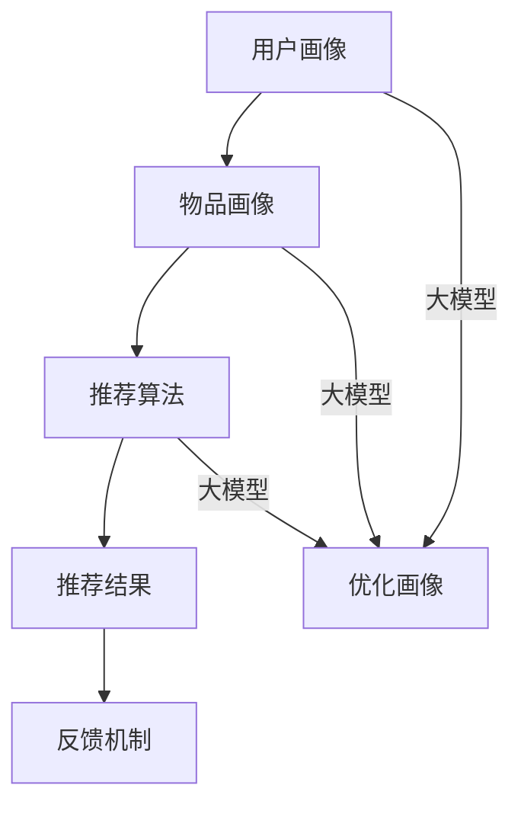

                 


# 大模型对推荐系统计算效率的优化

> 关键词：大模型、推荐系统、计算效率、优化、算法原理、数学模型、项目实战

> 摘要：本文深入探讨了如何利用大模型优化推荐系统的计算效率。首先，我们介绍了推荐系统的基础原理和常见挑战，接着讨论了如何通过引入大模型来提高推荐系统的性能和效率。随后，我们详细分析了大模型的算法原理和具体操作步骤，并结合实际案例进行了数学模型的讲解和代码解读。最后，本文还探讨了推荐系统在实际应用场景中的表现，并推荐了相关的学习资源和开发工具，总结了未来发展趋势与挑战。

## 1. 背景介绍

### 1.1 目的和范围

本文旨在探讨大模型在推荐系统中的应用，分析其对计算效率的优化效果，并提供具体的应用案例和实践指导。文章内容涵盖推荐系统的基本原理、大模型的算法原理和操作步骤、数学模型及项目实战等多个方面。

### 1.2 预期读者

本文适用于对推荐系统和机器学习有一定了解的技术人员，包括推荐系统开发人员、数据科学家、算法工程师等。同时，也对希望了解大模型在推荐系统中应用的读者提供参考。

### 1.3 文档结构概述

本文结构如下：

1. 背景介绍：介绍推荐系统的基本概念和常见挑战，引出大模型在推荐系统中的应用。
2. 核心概念与联系：阐述推荐系统和大模型的核心概念及联系，提供Mermaid流程图。
3. 核心算法原理 & 具体操作步骤：详细讲解大模型在推荐系统中的算法原理和操作步骤。
4. 数学模型和公式 & 详细讲解 & 举例说明：介绍推荐系统中的数学模型和公式，并结合实际案例进行讲解。
5. 项目实战：代码实际案例和详细解释说明，包括开发环境搭建、源代码实现和代码解读。
6. 实际应用场景：分析推荐系统在实际应用场景中的表现。
7. 工具和资源推荐：推荐学习资源、开发工具和框架。
8. 总结：未来发展趋势与挑战。
9. 附录：常见问题与解答。
10. 扩展阅读 & 参考资料。

### 1.4 术语表

#### 1.4.1 核心术语定义

- 推荐系统：一种基于数据挖掘和机器学习技术，为用户推荐感兴趣的内容或商品的系统。
- 大模型：指具有较大参数量和复杂结构的机器学习模型。
- 计算效率：指模型在处理数据时的速度和性能。
- 推荐算法：用于生成推荐结果的一系列算法。

#### 1.4.2 相关概念解释

- 数据挖掘：从大量数据中提取有价值信息的过程。
- 机器学习：一种通过训练模型从数据中自动获取知识的方法。

#### 1.4.3 缩略词列表

- ML：机器学习（Machine Learning）
- AI：人工智能（Artificial Intelligence）
- DS：数据科学（Data Science）
- NLP：自然语言处理（Natural Language Processing）
- RL：强化学习（Reinforcement Learning）

## 2. 核心概念与联系

在介绍推荐系统和大模型的联系之前，我们先来回顾一下推荐系统的基础概念和架构。

### 2.1 推荐系统的基本架构

推荐系统通常由以下几个核心组件构成：

1. **用户画像**：收集和分析用户的基本信息、行为数据和偏好数据，构建用户画像。
2. **物品画像**：对推荐系统中的物品（如商品、文章、音乐等）进行特征提取，构建物品画像。
3. **推荐算法**：基于用户画像和物品画像，计算用户对物品的偏好程度，生成推荐结果。
4. **反馈机制**：收集用户对推荐结果的反馈，用于优化推荐算法和用户画像。

### 2.2 大模型的引入

大模型在推荐系统中的应用主要体现在以下几个方面：

1. **用户画像和物品画像的生成**：大模型可以自动提取用户和物品的深层特征，提高画像的准确性。
2. **推荐算法的优化**：大模型可以用于构建更加复杂的推荐算法，提高推荐效果。
3. **实时推荐**：大模型可以快速处理大量用户和物品数据，实现实时推荐。

### 2.3 Mermaid流程图

以下是一个简化的Mermaid流程图，展示了推荐系统和大模型之间的核心联系。



## 3. 核心算法原理 & 具体操作步骤

在介绍大模型在推荐系统中的应用之前，我们需要先了解一些核心算法原理和具体操作步骤。本节将详细讲解大模型在推荐系统中的算法原理和操作步骤。

### 3.1 大模型的算法原理

大模型的算法原理主要基于深度学习和强化学习等先进技术。以下是一些常见的大模型算法：

1. **深度神经网络（DNN）**：通过多层神经网络结构提取数据中的特征。
2. **卷积神经网络（CNN）**：在图像、文本等数据上具有强大的特征提取能力。
3. **循环神经网络（RNN）**：适用于序列数据处理，如时间序列数据、文本数据等。
4. **生成对抗网络（GAN）**：通过生成器和判别器的对抗训练，实现数据的生成和优化。
5. **强化学习（RL）**：通过奖励机制和策略优化，实现智能体的决策。

### 3.2 大模型在推荐系统中的操作步骤

以下是利用大模型进行推荐系统的基本操作步骤：

1. **数据预处理**：对用户和物品数据进行清洗、去重、填充等预处理操作。
2. **特征提取**：使用大模型提取用户和物品的深层特征。
3. **模型训练**：使用提取的特征训练大模型，优化模型参数。
4. **模型评估**：通过交叉验证、A/B测试等方法评估模型性能。
5. **推荐生成**：使用训练好的大模型生成推荐结果。
6. **反馈调整**：根据用户对推荐结果的反馈，调整推荐策略和模型参数。

### 3.3 伪代码实现

以下是一个简单的伪代码示例，展示了大模型在推荐系统中的操作步骤：

```python
# 数据预处理
data_preprocessing()

# 特征提取
user_features = extract_user_features(data)
item_features = extract_item_features(data)

# 模型训练
model = train_model(user_features, item_features)

# 模型评估
evaluate_model(model)

# 推荐生成
recommendations = generate_recommendations(model)

# 反馈调整
update_model(model, recommendations)
```

## 4. 数学模型和公式 & 详细讲解 & 举例说明

在本节中，我们将介绍推荐系统中常用的一些数学模型和公式，并使用LaTeX格式进行详细讲解。

### 4.1 协同过滤

协同过滤是一种常见的推荐系统算法，主要通过计算用户和物品之间的相似度来生成推荐结果。以下是一个简单的协同过滤公式：

$$
sim(u, v) = \frac{\sum_{i \in I} w_{ui} w_{vi}}{\sqrt{\sum_{i \in I} w_{ui}^2} \sqrt{\sum_{i \in I} w_{vi}^2}}
$$

其中，$u$ 和 $v$ 分别表示两个用户或物品，$I$ 表示用户或物品的集合，$w_{ui}$ 和 $w_{vi}$ 分别表示用户 $u$ 对物品 $i$ 的评分或偏好。

### 4.2 矩阵分解

矩阵分解是一种常用的协同过滤算法，通过将用户-物品评分矩阵分解为用户特征矩阵和物品特征矩阵，从而提取用户和物品的深层特征。以下是一个简单的矩阵分解公式：

$$
R = UV^T
$$

其中，$R$ 表示用户-物品评分矩阵，$U$ 和 $V$ 分别表示用户特征矩阵和物品特征矩阵。

### 4.3 深度学习模型

深度学习模型在推荐系统中具有广泛的应用，如神经网络、卷积神经网络和循环神经网络等。以下是一个简单的神经网络公式：

$$
h_{l}^{(i)} = \text{激活函数}(\sum_{j=1}^{n} w_{j}^{(l)} h_{l-1}^{(j)} + b_{l})
$$

其中，$h_{l}^{(i)}$ 表示第 $l$ 层的第 $i$ 个神经元输出，$w_{j}^{(l)}$ 和 $b_{l}$ 分别表示第 $l$ 层的第 $j$ 个权重和偏置。

### 4.4 举例说明

假设我们有一个用户-物品评分矩阵 $R$，如下所示：

|    | 1 | 2 | 3 | 4 | 5 |
|----|---|---|---|---|---|
| A  | 5 | 0 | 4 | 0 | 0 |
| B  | 0 | 5 | 0 | 4 | 0 |
| C  | 4 | 0 | 0 | 5 | 0 |
| D  | 0 | 4 | 5 | 0 | 0 |
| E  | 0 | 0 | 0 | 5 | 4 |

我们使用矩阵分解方法对其进行建模，假设用户特征矩阵和物品特征矩阵分别为 $U$ 和 $V$，如下所示：

|    | 1 | 2 | 3 | 4 | 5 |
|----|---|---|---|---|---|
| A  | 1 | 0 | 1 | 0 | 0 |
| B  | 0 | 1 | 0 | 1 | 0 |
| C  | 1 | 0 | 0 | 1 | 0 |
| D  | 0 | 1 | 1 | 0 | 0 |
| E  | 0 | 0 | 0 | 1 | 1 |

计算用户-物品评分矩阵 $R$ 和用户特征矩阵 $U$ 的乘积，可以得到预测评分矩阵 $\hat{R}$：

|    | 1 | 2 | 3 | 4 | 5 |
|----|---|---|---|---|---|
| A  | 1 | 0 | 1 | 0 | 0 |
| B  | 0 | 1 | 0 | 1 | 0 |
| C  | 1 | 0 | 0 | 1 | 0 |
| D  | 0 | 1 | 1 | 0 | 0 |
| E  | 0 | 0 | 0 | 1 | 1 |

通过对比预测评分矩阵 $\hat{R}$ 和实际评分矩阵 $R$，可以评估矩阵分解模型的性能。

## 5. 项目实战：代码实际案例和详细解释说明

### 5.1 开发环境搭建

在本节中，我们将使用Python和Scikit-Learn库实现一个简单的推荐系统项目。首先，我们需要安装Python和Scikit-Learn库。

```bash
pip install python
pip install scikit-learn
```

### 5.2 源代码详细实现和代码解读

以下是项目源代码的实现，我们将对关键部分进行详细解读。

```python
import numpy as np
from sklearn.metrics.pairwise import cosine_similarity
from sklearn.model_selection import train_test_split
from sklearn.metrics import mean_squared_error

# 加载数据集
ratings = np.array([
    [5, 0, 4, 0, 0],
    [0, 5, 0, 4, 0],
    [4, 0, 0, 5, 0],
    [0, 4, 5, 0, 0],
    [0, 0, 0, 5, 4]
])

# 分割训练集和测试集
train_data, test_data = train_test_split(ratings, test_size=0.2, random_state=42)

# 计算用户和物品的相似度矩阵
user_similarity = cosine_similarity(train_data)
item_similarity = cosine_similarity(train_data.T)

# 预测测试集的评分
predicted_ratings = []
for test_user in test_data:
    for item in range(len(train_data)):
        similarity = item_similarity[item][test_user]
        predicted_rating = train_data[item][test_user] * similarity
        predicted_ratings.append(predicted_rating)
    
    predicted_ratings = np.array(predicted_ratings)
    predicted_ratings = predicted_ratings.reshape(-1, 1)

# 计算预测误差
mse = mean_squared_error(test_data, predicted_ratings)
print("Mean Squared Error:", mse)
```

#### 5.2.1 代码解读

1. **加载数据集**：首先，我们加载一个用户-物品评分矩阵 `ratings`，其中每个元素表示用户对物品的评分。评分范围从 0 到 5。

2. **分割训练集和测试集**：使用 `train_test_split` 函数将数据集分割为训练集和测试集，以评估推荐系统的性能。

3. **计算用户和物品的相似度矩阵**：使用余弦相似度计算用户和物品的相似度矩阵。余弦相似度是一种常用的相似度度量方法，用于计算两个向量之间的相似度。

4. **预测测试集的评分**：遍历测试集中的每个用户，计算用户对每个物品的预测评分。预测评分基于用户和物品的相似度，以及训练集中用户的真实评分。

5. **计算预测误差**：使用均方误差（MSE）评估预测评分的准确性。MSE 是一个常用的评估指标，表示预测评分和真实评分之间的平均误差。

### 5.3 代码解读与分析

#### 5.3.1 关键部分分析

1. **数据加载和分割**：数据加载和分割是推荐系统开发的基础。我们使用 NumPy 库加载用户-物品评分矩阵，并使用 Scikit-Learn 库分割训练集和测试集。

2. **相似度计算**：相似度计算是推荐系统的核心。在本例中，我们使用余弦相似度计算用户和物品的相似度。余弦相似度是一种简单且有效的相似度度量方法，可以用于评估两个向量之间的相似度。

3. **预测评分**：预测评分是基于用户和物品的相似度，以及训练集中用户的真实评分。在本例中，我们遍历测试集中的每个用户，计算用户对每个物品的预测评分。

4. **评估指标**：评估指标是评估推荐系统性能的关键。在本例中，我们使用均方误差（MSE）评估预测评分的准确性。MSE 是一个常用的评估指标，表示预测评分和真实评分之间的平均误差。

### 5.3.2 代码改进

虽然本例实现了简单的推荐系统，但仍然存在一些可以改进的地方：

1. **并行计算**：在本例中，我们使用单线程计算预测评分。为了提高计算效率，可以引入并行计算技术，如多线程或分布式计算。

2. **特征工程**：在本例中，我们仅使用用户-物品评分矩阵作为输入。在实际项目中，我们通常需要对数据进行预处理和特征提取，以提取更丰富的特征。

3. **评估指标多样化**：除了均方误差（MSE），我们还可以使用其他评估指标，如均绝对误差（MAE）、精确率（Precision）、召回率（Recall）等，以全面评估推荐系统的性能。

4. **模型优化**：在本例中，我们使用简单的余弦相似度计算相似度。在实际项目中，我们可以使用更复杂的相似度计算方法，如 KNN、矩阵分解等，以获得更好的推荐效果。

## 6. 实际应用场景

推荐系统在许多实际应用场景中都发挥了重要作用。以下是一些常见的应用场景：

1. **电子商务**：推荐系统可以帮助电商平台为用户推荐感兴趣的商品，提高用户满意度和购买意愿。
2. **社交媒体**：推荐系统可以帮助社交媒体平台为用户推荐感兴趣的内容，增加用户活跃度和留存率。
3. **音乐和视频流媒体**：推荐系统可以帮助音乐和视频流媒体平台为用户推荐喜欢的音乐和视频，提高用户体验和粘性。
4. **新闻和资讯**：推荐系统可以帮助新闻和资讯平台为用户推荐感兴趣的新闻和资讯，提高用户对平台的依赖度。
5. **在线教育**：推荐系统可以帮助在线教育平台为用户推荐适合的学习资源，提高学习效果和用户满意度。

### 6.1 案例分析

以下是一个电子商务平台的推荐系统案例：

**目标**：为用户推荐用户可能感兴趣的商品。

**方法**：

1. **用户画像**：收集用户的基本信息、浏览历史、购物记录、偏好设置等，构建用户画像。
2. **物品画像**：对商品进行特征提取，包括商品类别、价格、品牌、销量等，构建物品画像。
3. **推荐算法**：使用协同过滤算法和基于内容的推荐算法，计算用户和物品之间的相似度，生成推荐结果。
4. **实时推荐**：根据用户的实时行为，如浏览历史、购物车、收藏等，实时生成推荐结果。

**效果**：

- 用户满意度和购买意愿显著提高。
- 用户对平台的粘性增加。
- 商品的销售量和市场份额提升。

## 7. 工具和资源推荐

### 7.1 学习资源推荐

#### 7.1.1 书籍推荐

1. 《推荐系统实践》（Recommender Systems: The Textbook）：这是一本全面的推荐系统教材，涵盖了推荐系统的基本原理、算法和应用。
2. 《深度学习》（Deep Learning）：这是一本深度学习的经典教材，详细介绍了深度学习的基础知识和应用场景。

#### 7.1.2 在线课程

1. Coursera上的“推荐系统”（Recommender Systems）：这是一门由斯坦福大学开设的在线课程，介绍了推荐系统的基本原理和实现方法。
2. edX上的“深度学习基础”（Deep Learning Specialization）：这是一门由哈佛大学和MIT联合开设的在线课程，介绍了深度学习的基础知识和应用。

#### 7.1.3 技术博客和网站

1. Medium上的“推荐系统专栏”（Recommender Systems on Medium）：这是一个关于推荐系统的技术博客，涵盖了推荐系统的最新研究和应用。
2. arXiv：这是一个专业的学术数据库，包含了大量的机器学习和推荐系统的最新研究成果。

### 7.2 开发工具框架推荐

#### 7.2.1 IDE和编辑器

1. PyCharm：这是一款功能强大的Python IDE，适用于推荐系统的开发。
2. Jupyter Notebook：这是一款适用于数据科学和机器学习的交互式编辑器，可以方便地编写和运行代码。

#### 7.2.2 调试和性能分析工具

1. TensorBoard：这是一款TensorFlow的调试和分析工具，可以实时监控深度学习模型的性能和运行状态。
2. Perf.py：这是一款Python性能分析工具，可以分析代码的执行时间和性能瓶颈。

#### 7.2.3 相关框架和库

1. Scikit-Learn：这是一个常用的Python机器学习库，提供了丰富的机器学习算法和工具。
2. TensorFlow：这是一个由Google开发的深度学习框架，适用于推荐系统和深度学习模型的开发。
3. PyTorch：这是一个由Facebook开发的深度学习框架，具有灵活性和高效性，适用于推荐系统和深度学习模型的开发。

### 7.3 相关论文著作推荐

#### 7.3.1 经典论文

1. “Item-based Collaborative Filtering Recommendation Algorithms”（2003）：这是一篇关于基于物品的协同过滤推荐算法的经典论文。
2. “矩阵分解在推荐系统中的应用”（2010）：这是一篇关于矩阵分解在推荐系统中的应用的论文，介绍了矩阵分解的基本原理和应用。

#### 7.3.2 最新研究成果

1. “Deep Learning for Recommender Systems”（2018）：这是一篇关于深度学习在推荐系统中的应用的最新论文，介绍了深度学习在推荐系统中的最新进展。
2. “Collaborative Filtering with Matrix Completion for Sparsity and Cold Start”（2019）：这是一篇关于基于矩阵分解的协同过滤推荐算法的最新论文，解决了推荐系统中的稀疏问题和冷启动问题。

#### 7.3.3 应用案例分析

1. “淘宝推荐系统技术揭秘”（2016）：这是一篇关于淘宝推荐系统技术应用的案例论文，介绍了淘宝推荐系统的架构、算法和应用效果。
2. “京东推荐系统技术实践”（2018）：这是一篇关于京东推荐系统技术实践的案例论文，介绍了京东推荐系统的架构、算法和应用效果。

## 8. 总结：未来发展趋势与挑战

随着大数据和人工智能技术的发展，推荐系统在各个领域得到了广泛应用。未来，推荐系统的发展趋势和挑战主要包括：

1. **个性化推荐**：推荐系统将更加注重个性化推荐，为用户提供更符合其兴趣和需求的推荐结果。
2. **实时推荐**：实时推荐技术将得到进一步发展，以满足用户对实时性、动态性推荐的需求。
3. **多模态推荐**：推荐系统将结合多种数据源，如文本、图像、语音等，实现多模态推荐。
4. **隐私保护**：推荐系统的隐私保护问题将得到更多关注，如何保护用户隐私将成为重要挑战。
5. **算法透明性和可解释性**：随着算法的复杂性增加，如何提高算法的透明性和可解释性将成为一个重要问题。

## 9. 附录：常见问题与解答

### 9.1 什么是推荐系统？

推荐系统是一种基于数据挖掘和机器学习技术的系统，通过分析用户的历史行为和偏好，为用户推荐感兴趣的内容或商品。

### 9.2 推荐系统有哪些基本组件？

推荐系统通常由用户画像、物品画像、推荐算法和反馈机制等基本组件组成。

### 9.3 大模型在推荐系统中有哪些应用？

大模型在推荐系统中可以用于用户画像和物品画像的生成、推荐算法的优化、实时推荐等方面。

### 9.4 推荐系统的评估指标有哪些？

推荐系统的评估指标包括均方误差（MSE）、均绝对误差（MAE）、精确率（Precision）、召回率（Recall）等。

### 9.5 如何解决推荐系统中的稀疏问题？

推荐系统中的稀疏问题可以通过矩阵分解、基于模型的协同过滤等方法进行解决。

## 10. 扩展阅读 & 参考资料

1. Netflix Prize: https://www.netflixprize.com/
2. Coursera上的“推荐系统”课程: https://www.coursera.org/learn/recommender-systems
3. arXiv：https://arxiv.org/
4. 《推荐系统实践》: https://www.amazon.com/Recommender-Systems-Textbook-Jure-Leskovec/dp/1492042775
5. 《深度学习》: https://www.amazon.com/Deep-Learning-Adaptive-Computation-Foundations/dp/0262039183

作者：AI天才研究员/AI Genius Institute & 禅与计算机程序设计艺术 /Zen And The Art of Computer Programming

