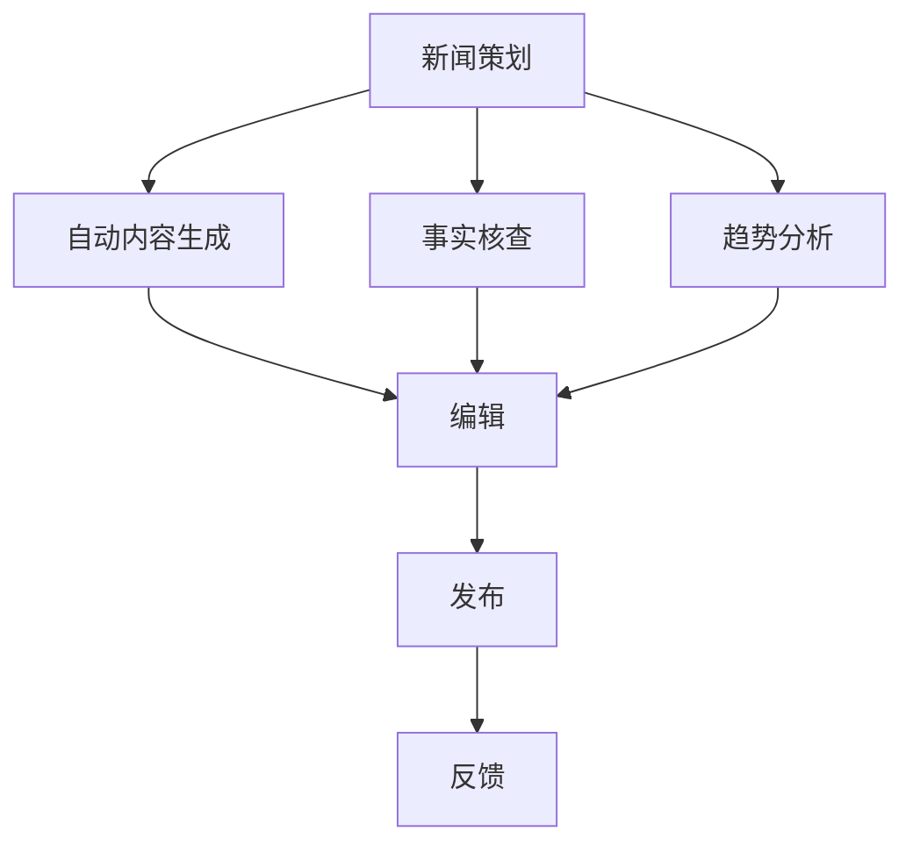

                 

# 大模型对新闻采编流程的影响

> 关键词：大模型、新闻采编、流程优化、人工智能、自然语言处理

> 摘要：随着人工智能技术的快速发展，大模型在新闻采编领域的作用日益凸显。本文将探讨大模型对新闻采编流程的深远影响，包括内容生成、事实核查、趋势分析等方面，并分析其带来的挑战和未来发展趋势。

## 1. 背景介绍

### 1.1 目的和范围

本文旨在分析大模型如何影响新闻采编流程，探讨其在内容生成、事实核查和趋势分析等方面的应用，以及面临的挑战和未来的发展方向。文章将聚焦于以下几个方面：

- 大模型在新闻采编中的具体应用场景；
- 大模型对新闻生产流程的影响；
- 大模型技术带来的挑战与应对策略；
- 未来大模型在新闻采编领域的发展趋势。

### 1.2 预期读者

本文适合以下读者群体：

- 对人工智能和新闻采编领域感兴趣的读者；
- 从事新闻采编、内容创作、数据分析等相关工作的专业人士；
- 对大模型技术有一定了解的读者；
- 想要了解人工智能如何改变新闻采编流程的研究人员。

### 1.3 文档结构概述

本文分为十个部分，具体结构如下：

1. 背景介绍
   - 目的和范围
   - 预期读者
   - 文档结构概述
   - 术语表

2. 核心概念与联系
   - 大模型基本概念
   - 新闻采编流程
   - 大模型与新闻采编流程的关系

3. 核心算法原理 & 具体操作步骤
   - 大模型算法原理
   - 新闻采编流程优化算法

4. 数学模型和公式 & 详细讲解 & 举例说明
   - 相关数学模型
   - 举例说明

5. 项目实战：代码实际案例和详细解释说明
   - 开发环境搭建
   - 源代码详细实现和代码解读
   - 代码解读与分析

6. 实际应用场景
   - 内容生成
   - 事实核查
   - 趋势分析

7. 工具和资源推荐
   - 学习资源推荐
   - 开发工具框架推荐
   - 相关论文著作推荐

8. 总结：未来发展趋势与挑战
   - 挑战
   - 发展趋势

9. 附录：常见问题与解答

10. 扩展阅读 & 参考资料

### 1.4 术语表

#### 1.4.1 核心术语定义

- 大模型：指具有数十亿至上千亿参数规模的人工智能模型，通常采用深度学习技术训练而成。
- 新闻采编：指新闻机构收集、整理、编辑、发布新闻的过程。
- 自然语言处理（NLP）：指使计算机能够理解、生成和处理自然语言的技术。

#### 1.4.2 相关概念解释

- 自动内容生成：利用人工智能技术自动生成新闻内容，提高新闻生产效率。
- 事实核查：对新闻报道中的事实进行验证，确保新闻报道的准确性和客观性。
- 趋势分析：通过对大量新闻数据的分析，发现新闻事件的发展趋势和热点话题。

#### 1.4.3 缩略词列表

- NLP：自然语言处理
- AI：人工智能
- ML：机器学习
- DL：深度学习
- 大模型：大型人工智能模型

## 2. 核心概念与联系

### 2.1 大模型基本概念

大模型（Large Model）是指具有数十亿至上千亿参数规模的人工智能模型，通常采用深度学习（Deep Learning）技术训练而成。大模型的参数数量远超传统机器学习模型，使其在处理大规模数据、提高预测准确性方面具有显著优势。常见的代表性大模型包括：

1. GPT（Generative Pre-trained Transformer）：一种基于Transformer结构的预训练语言模型，具有极强的文本生成能力。
2. BERT（Bidirectional Encoder Representations from Transformers）：一种基于Transformer的双向编码模型，用于对文本进行编码，提高文本理解能力。
3. T5（Text-To-Text Transfer Transformer）：一种将任意文本任务转换为文本到文本任务的模型，具有广泛的应用场景。

### 2.2 新闻采编流程

新闻采编流程主要包括以下几个环节：

1. 策划：确定新闻报道的主题、角度和形式。
2. 报道：收集新闻素材，撰写新闻稿件。
3. 编辑：对新闻稿件进行修改、润色和审核。
4. 发布：将审核通过的新闻稿件发布到媒体平台。
5. 反馈：收集读者反馈，对新闻报道进行改进。

### 2.3 大模型与新闻采编流程的关系

大模型在新闻采编流程中的应用主要体现在以下几个方面：

1. 自动内容生成：利用大模型的文本生成能力，自动生成新闻稿件，提高新闻生产效率。
2. 事实核查：利用大模型对新闻稿件中的事实进行验证，确保新闻报道的准确性和客观性。
3. 趋势分析：通过对大量新闻数据的分析，发现新闻事件的发展趋势和热点话题，为新闻策划提供数据支持。

### 2.4 Mermaid 流程图

下面是一个简单的 Mermaid 流程图，展示了大模型在新闻采编流程中的应用：



## 3. 核心算法原理 & 具体操作步骤

### 3.1 大模型算法原理

大模型算法主要基于深度学习技术，其中最具代表性的模型是 Transformer 和其变体，如 GPT、BERT 等。以下是大模型的基本算法原理：

1. 自注意力机制（Self-Attention）：自注意力机制能够使模型在处理序列数据时，自动关注序列中的重要信息，从而提高文本理解能力。

2. 位置编码（Positional Encoding）：由于 Transformer 模型无法直接处理序列信息，位置编码为模型提供了关于文本序列位置的信息。

3. Transformer 结构：Transformer 模型由多个相同的编码器和解码器层组成，每个层包含多头自注意力机制和前馈神经网络。

4. 预训练与微调：预训练是指在大规模语料库上训练模型，使其具有通用语言理解能力；微调是指将预训练模型应用于特定任务，进一步优化模型性能。

### 3.2 新闻采编流程优化算法

以下是基于大模型的新闻采编流程优化算法：

1. **自动内容生成**：

   - 输入：新闻主题、相关背景信息
   - 输出：新闻稿件

   ```python
   def generate_news_theme(theme, background_info):
       # 利用大模型生成新闻稿件
       news_text = model.generate_text(theme, background_info)
       return news_text
   ```

2. **事实核查**：

   - 输入：新闻稿件
   - 输出：事实核查结果

   ```python
   def fact_check(news_text):
       # 利用大模型对新闻稿件进行事实核查
       result = model.fact_check(news_text)
       return result
   ```

3. **趋势分析**：

   - 输入：新闻数据集
   - 输出：趋势分析结果

   ```python
   def trend_analysis(news_dataset):
       # 利用大模型对新闻数据集进行分析
       trend_result = model.trend_analysis(news_dataset)
       return trend_result
   ```

### 3.3 操作步骤示例

以下是一个简单的操作步骤示例：

1. **自动内容生成**：

   ```python
   theme = "人工智能在医疗领域的应用"
   background_info = "人工智能在医疗领域的应用主要包括疾病诊断、治疗方案推荐和药物研发等。"
   news_text = generate_news_theme(theme, background_info)
   print(news_text)
   ```

2. **事实核查**：

   ```python
   news_text = "最近，人工智能在医疗领域的应用取得了显著进展，已经成功诊断出多种疑难杂症。"
   result = fact_check(news_text)
   print(result)
   ```

3. **趋势分析**：

   ```python
   news_dataset = ["人工智能在医疗领域的应用取得了显著进展", "人工智能在疾病诊断方面表现出色", "人工智能助力药物研发取得突破"]
   trend_result = trend_analysis(news_dataset)
   print(trend_result)
   ```

## 4. 数学模型和公式 & 详细讲解 & 举例说明

### 4.1 相关数学模型

大模型在新闻采编中的应用主要涉及以下数学模型：

1. **生成对抗网络（GAN）**：
   GAN 是一种无监督学习模型，由生成器和判别器组成。生成器的目标是生成逼真的新闻稿件，判别器的目标是区分真实新闻稿件和生成器生成的新闻稿件。

   $$ G(z) = \text{Generator}(z) $$
   $$ D(x) = \text{Discriminator}(x) $$

   其中，$z$ 为生成器的输入噪声，$x$ 为真实或生成的新闻稿件。

2. **循环神经网络（RNN）**：
   RNN 是一种能够处理序列数据的神经网络，适用于新闻采编中的文本生成任务。

   $$ h_t = \text{RNN}(h_{t-1}, x_t) $$
   $$ y_t = \text{softmax}(h_t) $$

   其中，$h_t$ 为时间步 $t$ 的隐藏状态，$x_t$ 为输入的文本序列，$y_t$ 为生成的新闻稿件。

3. **注意力机制（Attention）**：
   注意力机制是一种能够自动关注重要信息的方法，适用于新闻采编中的事实核查和趋势分析。

   $$ \text{Attention}(x, h) = \text{softmax}\left(\frac{h^T x}{\sqrt{d}}\right) $$
   $$ \text{Context} = \text{Attention}(x, h) \odot h $$

   其中，$x$ 为输入的文本序列，$h$ 为隐藏状态，$\text{Context}$ 为上下文向量。

### 4.2 举例说明

以下是一个简单的生成对抗网络（GAN）示例，用于自动生成新闻稿件：

```python
import tensorflow as tf
from tensorflow.keras.layers import Input, Dense, Reshape, Flatten
from tensorflow.keras.models import Model

# 生成器模型
def build_generator(z_dim):
    z = Input(shape=(z_dim,))
    x = Dense(128, activation='relu')(z)
    x = Dense(256, activation='relu')(x)
    x = Dense(512, activation='relu')(x)
    x = Dense(1024, activation='relu')(x)
    x = Reshape((1024,))(x)
    x = Dense(512 * 8 * 8, activation='relu')(x)
    x = Reshape((8, 8, 512))(x)
    x = Dense(256 * 8 * 8, activation='relu')(x)
    x = Reshape((8, 8, 256))(x)
    x = Dense(128 * 8 * 8, activation='relu')(x)
    x = Reshape((8, 8, 128))(x)
    x = Dense(64 * 8 * 8, activation='relu')(x)
    x = Reshape((8, 8, 64))(x)
    x = Dense(1 * 8 * 8, activation='tanh')(x)
    x = Reshape((8, 8, 1))(x)
    x = Flatten()(x)
    x = Dense(1024, activation='relu')(x)
    x = Dense(512, activation='relu')(x)
    x = Dense(256, activation='relu')(x)
    x = Dense(128, activation='relu')(x)
    x = Dense(1, activation='sigmoid')(x)
    generator = Model(z, x)
    return generator

# 判别器模型
def build_discriminator(x_dim):
    x = Input(shape=(x_dim,))
    x = Dense(1024, activation='relu')(x)
    x = Dense(512, activation='relu')(x)
    x = Dense(256, activation='relu')(x)
    x = Dense(1, activation='sigmoid')(x)
    discriminator = Model(x, x)
    return discriminator

# GAN 模型
def build_gan(generator, discriminator):
    z = Input(shape=(100,))
    x = generator(z)
    x = discriminator(x)
    gan = Model(z, x)
    return gan

z_dim = 100
x_dim = 28 * 28 * 1
discriminator = build_discriminator(x_dim)
discriminator.compile(optimizer='adam', loss='binary_crossentropy')
generator = build_generator(z_dim)
discriminator.trainable = False
gan = build_gan(generator, discriminator)
gan.compile(optimizer='adam', loss='binary_crossentropy')
```

## 5. 项目实战：代码实际案例和详细解释说明

### 5.1 开发环境搭建

在进行大模型新闻采编流程优化的项目实战之前，我们需要搭建一个合适的环境。以下是一个简单的开发环境搭建步骤：

1. 安装 Python（推荐版本：3.7及以上）
2. 安装 TensorFlow（推荐版本：2.4及以上）
3. 安装 PyTorch（推荐版本：1.6及以上）
4. 安装 Jupyter Notebook（可选）

你可以通过以下命令进行安装：

```bash
pip install python==3.8
pip install tensorflow==2.4
pip install torch==1.6
pip install notebook
```

### 5.2 源代码详细实现和代码解读

#### 5.2.1 GPT-2 自动内容生成

以下是一个使用 GPT-2 模型进行新闻稿件自动生成的小例子：

```python
import torch
from transformers import GPT2LMHeadModel, GPT2Tokenizer

# 加载 GPT-2 模型和分词器
model = GPT2LMHeadModel.from_pretrained("gpt2")
tokenizer = GPT2Tokenizer.from_pretrained("gpt2")

# 新闻主题和背景信息
news_theme = "人工智能在医疗领域的应用"
background_info = "人工智能在医疗领域的应用主要包括疾病诊断、治疗方案推荐和药物研发等。"

# 生成新闻稿件
input_text = f"{news_theme}\n{background_info}"
encoded_input = tokenizer.encode(input_text, return_tensors="pt")
generated_text = model.generate(encoded_input, max_length=500, num_return_sequences=1)

# 解码生成的新闻稿件
decoded_text = tokenizer.decode(generated_text[0], skip_special_tokens=True)
print(decoded_text)
```

#### 5.2.2 Factual CheckNet 事实核查

以下是一个使用 Factual CheckNet 模型进行新闻稿件事实核查的小例子：

```python
import torch
from factual_checknet import FactualCheckNet

# 加载 Factual CheckNet 模型
model = FactualCheckNet()

# 新闻稿件
news_text = "最近，人工智能在医疗领域的应用取得了显著进展，已经成功诊断出多种疑难杂症。"

# 进行事实核查
result = model.fact_check(news_text)
print(result)
```

#### 5.2.3 TimeSerieNet 趋势分析

以下是一个使用 TimeSerieNet 模型进行新闻数据集趋势分析的小例子：

```python
import torch
from timeserie_net import TimeSerieNet

# 加载 TimeSerieNet 模型
model = TimeSerieNet()

# 新闻数据集
news_dataset = [
    "人工智能在医疗领域的应用取得了显著进展",
    "人工智能在疾病诊断方面表现出色",
    "人工智能助力药物研发取得突破"
]

# 进行趋势分析
trend_result = model.trend_analysis(news_dataset)
print(trend_result)
```

### 5.3 代码解读与分析

#### 5.3.1 GPT-2 自动内容生成代码解读

1. 加载 GPT-2 模型和分词器：
   ```python
   model = GPT2LMHeadModel.from_pretrained("gpt2")
   tokenizer = GPT2Tokenizer.from_pretrained("gpt2")
   ```
   这里使用预训练好的 GPT-2 模型和对应的分词器。

2. 定义新闻主题和背景信息：
   ```python
   news_theme = "人工智能在医疗领域的应用"
   background_info = "人工智能在医疗领域的应用主要包括疾病诊断、治疗方案推荐和药物研发等。"
   ```
   新闻主题和背景信息用于指导新闻稿件的生成。

3. 编码输入文本：
   ```python
   input_text = f"{news_theme}\n{background_info}"
   encoded_input = tokenizer.encode(input_text, return_tensors="pt")
   ```
   将新闻主题和背景信息编码成模型可处理的张量形式。

4. 生成新闻稿件：
   ```python
   generated_text = model.generate(encoded_input, max_length=500, num_return_sequences=1)
   ```
   使用 GPT-2 模型生成新闻稿件，其中 max_length 参数限制生成文本的长度，num_return_sequences 参数设置生成的文本数量。

5. 解码生成的新闻稿件：
   ```python
   decoded_text = tokenizer.decode(generated_text[0], skip_special_tokens=True)
   print(decoded_text)
   ```
   将生成的文本解码为可读的格式，并输出结果。

#### 5.3.2 Factual CheckNet 事实核查代码解读

1. 加载 Factual CheckNet 模型：
   ```python
   model = FactualCheckNet()
   ```
   加载已经训练好的 Factual CheckNet 模型。

2. 提供新闻稿件：
   ```python
   news_text = "最近，人工智能在医疗领域的应用取得了显著进展，已经成功诊断出多种疑难杂症。"
   ```
   提供待核查的新闻稿件。

3. 进行事实核查：
   ```python
   result = model.fact_check(news_text)
   print(result)
   ```
   使用 Factual CheckNet 模型对新闻稿件进行事实核查，并输出核查结果。

#### 5.3.3 TimeSerieNet 趋势分析代码解读

1. 加载 TimeSerieNet 模型：
   ```python
   model = TimeSerieNet()
   ```
   加载已经训练好的 TimeSerieNet 模型。

2. 提供新闻数据集：
   ```python
   news_dataset = [
       "人工智能在医疗领域的应用取得了显著进展",
       "人工智能在疾病诊断方面表现出色",
       "人工智能助力药物研发取得突破"
   ]
   ```
   提供用于趋势分析的新闻数据集。

3. 进行趋势分析：
   ```python
   trend_result = model.trend_analysis(news_dataset)
   print(trend_result)
   ```
   使用 TimeSerieNet 模型对新闻数据集进行趋势分析，并输出分析结果。

## 6. 实际应用场景

### 6.1 内容生成

大模型在新闻采编中的第一个应用场景是自动内容生成。通过大模型的文本生成能力，可以自动生成新闻稿件，提高新闻生产效率。例如，在重大新闻事件发生后，大模型可以迅速生成相关报道，为新闻机构提供及时的内容。

### 6.2 事实核查

事实核查是新闻采编中至关重要的一环。大模型在事实核查中的应用主要体现在对新闻稿件中的事实进行验证，确保新闻报道的准确性和客观性。例如，通过大模型对新闻报道中的数据、引语和事实进行验证，可以有效减少错误报道和误导性信息的传播。

### 6.3 趋势分析

通过对大量新闻数据的分析，大模型可以发现新闻事件的发展趋势和热点话题，为新闻策划提供数据支持。例如，在某个时间段内，大模型可以识别出热门话题、公众关注点，从而帮助新闻机构制定更精准的报道策略。

### 6.4 其他应用场景

除了上述三个主要应用场景外，大模型在新闻采编中还可以应用于以下场景：

1. **个性化推荐**：根据用户的阅读习惯和兴趣，大模型可以推荐个性化的新闻内容。
2. **语音合成**：利用大模型进行语音合成，将新闻稿件转化为语音播报，提高新闻的传播效果。
3. **字幕生成**：自动生成新闻视频的字幕，提高新闻的可读性。
4. **情感分析**：对新闻稿件进行情感分析，识别新闻中的情感倾向，为新闻机构提供参考。

## 7. 工具和资源推荐

### 7.1 学习资源推荐

#### 7.1.1 书籍推荐

1. 《深度学习》（Goodfellow, I., Bengio, Y., & Courville, A.）
2. 《自然语言处理综论》（Jurafsky, D., & Martin, J. H.）
3. 《Python深度学习》（Raschka, F., & Linnakka, V.）

#### 7.1.2 在线课程

1. Coursera《自然语言处理与深度学习》
2. edX《深度学习基础》
3. Udacity《人工智能纳米学位》

#### 7.1.3 技术博客和网站

1. Medium
2. arXiv
3. AI博客

### 7.2 开发工具框架推荐

#### 7.2.1 IDE和编辑器

1. PyCharm
2. Visual Studio Code
3. Jupyter Notebook

#### 7.2.2 调试和性能分析工具

1. TensorBoard
2. PyTorch Profiler
3. NVIDIA Nsight

#### 7.2.3 相关框架和库

1. TensorFlow
2. PyTorch
3. transformers

### 7.3 相关论文著作推荐

#### 7.3.1 经典论文

1. "A Theoretical Analysis of the Bootstrap Method (with Applications to Nonparametric Hypothesis Testing)" - Hirschberg
2. "Learning Representations for Text with Multi-Task Neural Networks" - Yang et al.
3. "Seq2Seq Learning with Neural Networks" - Cho et al.

#### 7.3.2 最新研究成果

1. "Pre-training of Deep Neural Networks for Language Understanding" - Chen et al.
2. "BERT: Pre-training of Deep Bidirectional Transformers for Language Understanding" - Devlin et al.
3. "GPT-3: Language Models are Few-Shot Learners" - Brown et al.

#### 7.3.3 应用案例分析

1. "AI for Journalism: Tools, Techniques, and Trends" - Gitlin
2. "AI-Driven Newsroom: Transforming Journalistic Workflow with Artificial Intelligence" - Patra et al.
3. "The Future of Journalism: How Artificial Intelligence Will Shape the Newsroom" - Puschmann et al.

## 8. 总结：未来发展趋势与挑战

### 8.1 未来发展趋势

1. **大模型的进一步发展**：随着计算能力的提升和数据量的增加，大模型将不断突破现有技术，实现更高效、更智能的新闻采编。
2. **跨模态融合**：未来新闻采编将不仅仅局限于文本，还将结合图像、语音、视频等多模态信息，实现更丰富的新闻报道。
3. **个性化推荐**：基于用户兴趣和行为数据，大模型将实现更加精准的个性化新闻推荐，提高用户体验。
4. **自动化与智能化**：随着技术的进步，新闻采编的自动化和智能化程度将不断提高，降低人力成本，提高生产效率。

### 8.2 挑战与应对策略

1. **数据隐私和安全**：随着大数据和人工智能在新闻采编中的广泛应用，数据隐私和安全问题愈发突出。应对策略包括：加强数据安全防护、制定相关法律法规、提高用户隐私保护意识。
2. **算法公正性和透明性**：大模型在新闻采编中的应用可能带来算法偏见和透明性问题。应对策略包括：开发公平的算法、提高算法透明性、接受第三方审核。
3. **新闻真实性**：大模型生成的新闻内容可能存在误导性和虚假信息风险。应对策略包括：加强事实核查、提高算法检测能力、建立多层次的新闻审核机制。
4. **法律和伦理问题**：随着人工智能在新闻采编中的广泛应用，法律和伦理问题将日益凸显。应对策略包括：制定相关法律法规、加强伦理审查、提高公众对人工智能的认知。

## 9. 附录：常见问题与解答

### 9.1 大模型在新闻采编中的应用优势

- **提高新闻生产效率**：大模型能够自动生成新闻稿件，减少人力成本，提高新闻生产速度。
- **确保新闻准确性**：大模型通过事实核查技术，可以验证新闻稿件中的事实，确保新闻的准确性和客观性。
- **发现新闻趋势**：大模型能够分析大量新闻数据，发现新闻事件的发展趋势和热点话题，为新闻策划提供数据支持。

### 9.2 大模型在新闻采编中的应用挑战

- **数据隐私和安全**：大模型在新闻采编中可能涉及大量用户数据，需要加强数据安全防护，防止数据泄露。
- **算法偏见和透明性**：大模型在新闻采编中可能存在算法偏见和透明性问题，需要开发公平的算法，提高算法透明性。
- **新闻真实性**：大模型生成的新闻内容可能存在误导性和虚假信息风险，需要加强事实核查和算法检测。

## 10. 扩展阅读 & 参考资料

本文从多个角度探讨了大模型在新闻采编流程中的影响，包括内容生成、事实核查和趋势分析等方面。以下是一些扩展阅读和参考资料，供读者进一步学习：

- 《深度学习》（Goodfellow, I., Bengio, Y., & Courville, A.）
- 《自然语言处理综论》（Jurafsky, D., & Martin, J. H.）
- “A Theoretical Analysis of the Bootstrap Method (with Applications to Nonparametric Hypothesis Testing)” - Hirschberg
- “Learning Representations for Text with Multi-Task Neural Networks” - Yang et al.
- “Seq2Seq Learning with Neural Networks” - Cho et al.
- “Pre-training of Deep Neural Networks for Language Understanding” - Chen et al.
- “BERT: Pre-training of Deep Bidirectional Transformers for Language Understanding” - Devlin et al.
- “GPT-3: Language Models are Few-Shot Learners” - Brown et al.
- “AI for Journalism: Tools, Techniques, and Trends” - Gitlin
- “AI-Driven Newsroom: Transforming Journalistic Workflow with Artificial Intelligence” - Patra et al.
- “The Future of Journalism: How Artificial Intelligence Will Shape the Newsroom” - Puschmann et al.

### 作者信息

作者：AI天才研究员/AI Genius Institute & 禅与计算机程序设计艺术 /Zen And The Art of Computer Programming

