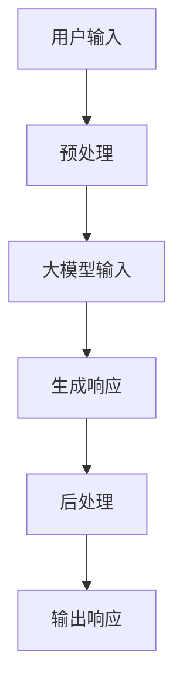
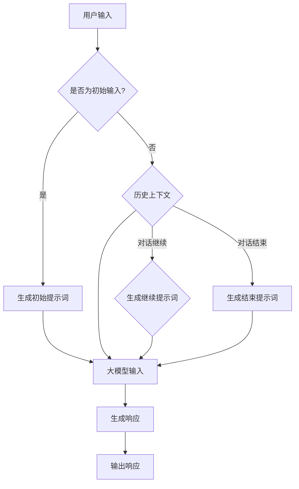
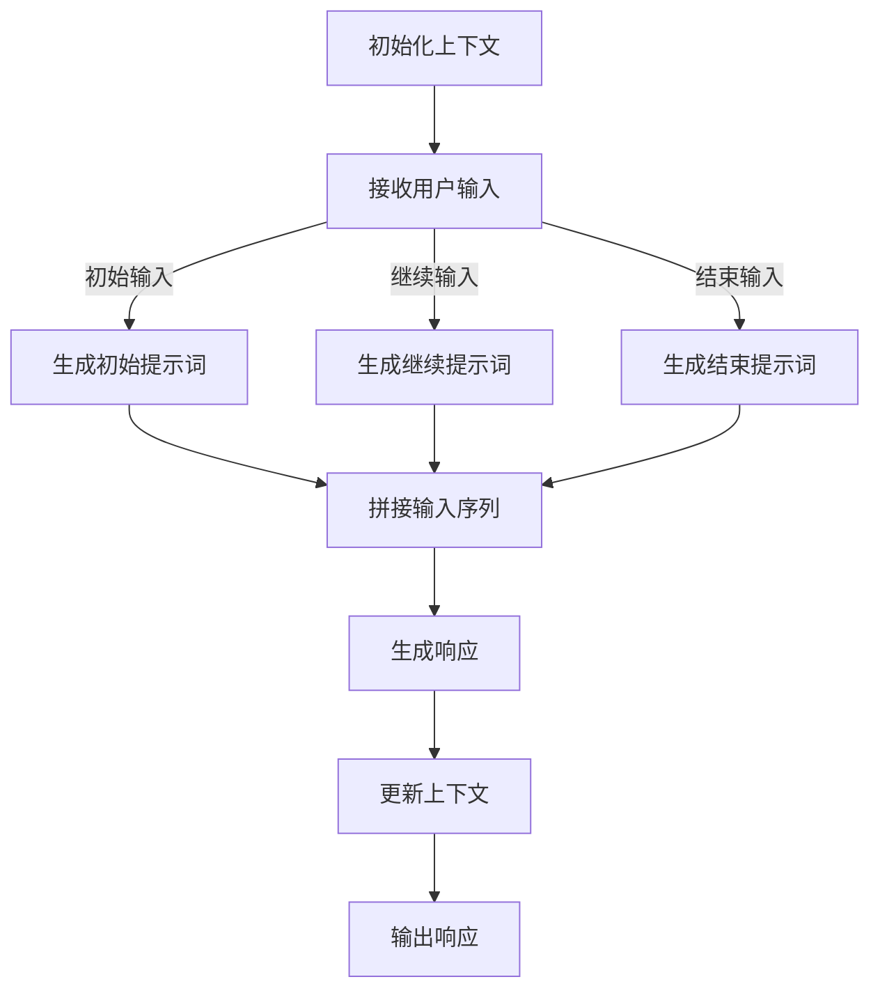

                 


# 大模型对话一致性：提示词维护上下文连贯

## 关键词
- 大模型对话
- 对话一致性
- 提示词
- 上下文连贯
- 人工智能
- 自然语言处理

## 摘要
本文将深入探讨大模型对话中的关键问题——如何维护上下文连贯性。通过对提示词的精细设计和管理，我们可以显著提升对话系统的交互质量。文章首先介绍了背景和目标，随后详细阐述了核心概念和算法原理，通过数学模型和公式深入分析了技术细节。接着，通过实际项目案例展示了具体实现和代码解析，并探讨了该技术在不同应用场景中的实际应用。最后，文章总结了未来发展趋势与挑战，并推荐了相关学习资源与开发工具。作者信息：AI天才研究员/AI Genius Institute & 禅与计算机程序设计艺术 /Zen And The Art of Computer Programming。

## 1. 背景介绍

### 1.1 目的和范围

随着人工智能技术的快速发展，大模型对话系统在各个领域得到了广泛应用，如智能客服、虚拟助手和在线教育等。这些系统通过模拟人类对话行为，为用户提供个性化的交互体验。然而，对话系统的上下文连贯性一直是提升用户体验的关键瓶颈。

本文旨在探讨如何通过设计和管理提示词来维护大模型对话的上下文连贯性。我们将详细分析相关算法原理，并通过实际案例展示具体实现步骤。文章主要涵盖以下内容：

1. 对话一致性的核心概念及其重要性。
2. 提示词的定义和分类。
3. 提示词在对话系统中的作用。
4. 提示词维护上下文连贯性的算法原理。
5. 实际应用场景和代码解析。

### 1.2 预期读者

本文适合以下读者群体：

1. 对自然语言处理和人工智能技术有基本了解的开发者。
2. 想要提升对话系统上下文连贯性的技术团队。
3. 对大模型对话一致性研究感兴趣的研究人员。

### 1.3 文档结构概述

本文结构如下：

1. 引言：介绍文章主题和关键词。
2. 背景介绍：阐述对话一致性的重要性。
3. 核心概念与联系：定义核心概念，并给出流程图。
4. 核心算法原理 & 具体操作步骤：详细解释算法原理和实现步骤。
5. 数学模型和公式：分析相关数学模型和公式。
6. 项目实战：实际案例和代码解析。
7. 实际应用场景：讨论技术的应用领域。
8. 工具和资源推荐：推荐学习资源和开发工具。
9. 总结：总结未来发展趋势与挑战。
10. 附录：常见问题与解答。
11. 扩展阅读 & 参考资料。

### 1.4 术语表

#### 1.4.1 核心术语定义

- 大模型对话：利用大型语言模型（如GPT）模拟人类对话行为的系统。
- 对话一致性：对话系统能够在连续交互中保持逻辑上的一致性和连贯性。
- 提示词：在对话系统中，用于引导对话流程的关键词或短语。
- 上下文连贯：对话系统能够根据用户历史信息，提供符合逻辑和语义的响应。

#### 1.4.2 相关概念解释

- 自然语言处理（NLP）：使计算机能够理解、生成和处理人类语言的技术。
- 生成式预训练（GPT）：一种基于大规模语料库的预训练方法，用于生成自然语言文本。

#### 1.4.3 缩略词列表

- NLP：自然语言处理
- GPT：生成式预训练

## 2. 核心概念与联系

### 2.1 大模型对话系统架构

在深入讨论对话一致性之前，我们首先需要了解大模型对话系统的基本架构。以下是该架构的Mermaid流程图：



#### 2.2 提示词在对话中的作用

提示词是维持对话上下文连贯性的关键因素。它们可以分为以下几类：

1. **初始提示词**：在对话开始时，引导用户进入话题的关键词。
2. **继续提示词**：在对话过程中，帮助系统继续探讨话题的关键词。
3. **结束提示词**：在对话结束时，帮助系统判断对话是否结束的关键词。

### 2.3 上下文连贯性的关键因素

为了实现上下文连贯，我们需要关注以下几个关键因素：

1. **历史上下文**：系统需要保留用户历史对话信息，以生成符合逻辑的响应。
2. **对话一致性**：系统需要确保在连续对话中，各轮交互之间的逻辑一致性。
3. **语义理解**：系统需要能够理解用户意图和语义，以提供准确且连贯的响应。

### 2.4 Mermaid流程图

以下是一个简化的Mermaid流程图，展示了提示词如何影响上下文连贯性：



## 3. 核心算法原理 & 具体操作步骤

### 3.1 算法原理

为了实现提示词维护上下文连贯，我们设计了一个基于生成式预训练（GPT）的算法。该算法的核心思想是通过历史上下文和提示词，引导大模型生成连贯的对话响应。

以下是该算法的伪代码：

```python
def generate_response(context, prompt):
    # 将上下文和提示词拼接为输入序列
    input_sequence = concatenate(context, prompt)
    # 使用大模型生成响应
    response = gpt.generate(input_sequence)
    return response
```

### 3.2 具体操作步骤

1. **初始化上下文**：在对话开始时，初始化上下文为空。
2. **接收用户输入**：从用户接收输入。
3. **判断输入类型**：判断输入是否为初始输入、继续输入或结束输入。
4. **生成提示词**：根据输入类型，生成相应的提示词。
5. **拼接输入序列**：将上下文和提示词拼接为输入序列。
6. **生成响应**：使用大模型生成响应。
7. **更新上下文**：将响应添加到上下文中，作为新的上下文。
8. **输出响应**：将生成的响应输出给用户。

### 3.3 算法流程图

以下是一个简化的算法流程图：



## 4. 数学模型和公式 & 详细讲解 & 举例说明

### 4.1 数学模型

为了实现提示词维护上下文连贯，我们使用了生成式预训练（GPT）模型。该模型的核心是Transformer架构，其基本思想是通过自注意力机制捕捉输入序列中的长距离依赖关系。

以下是Transformer模型的基本公式：

$$
\text{Output} = \text{softmax}(\text{W}_\text{out} \cdot \text{attented\_output})
$$

其中，$W_{out}$ 是输出权重矩阵，$attented\_output$ 是自注意力机制计算的结果。

### 4.2 自注意力机制

自注意力机制是Transformer模型的核心，它通过计算输入序列中每个词与其他词之间的相似性，生成加权特征向量。具体公式如下：

$$
\text{Attention}(Q, K, V) = \text{softmax}\left(\frac{QK^T}{\sqrt{d_k}}\right) V
$$

其中，$Q, K, V$ 分别是查询向量、键向量和值向量，$d_k$ 是键向量的维度。

### 4.3 举例说明

假设我们有一个简单的输入序列：“你好，我是AI助手，请问有什么可以帮助您的？”

#### 4.3.1 初始化

- $Q, K, V$ 分别为输入序列的查询向量、键向量和值向量。
- $d_k = 512$。

#### 4.3.2 计算相似性

$$
\text{Attention}(Q, K, V) = \text{softmax}\left(\frac{QK^T}{\sqrt{512}}\right) V
$$

计算得到每个词与其他词之间的相似性分数，如：

- “你好”与其他词的相似性分数。
- “我是”与其他词的相似性分数。
- ...

#### 4.3.3 加权特征向量

根据相似性分数，生成加权特征向量，如：

- “你好”的加权特征向量。
- “我是”的加权特征向量。
- ...

#### 4.3.4 输出

将加权特征向量作为输入序列的表示，用于生成响应。

## 5. 项目实战：代码实际案例和详细解释说明

### 5.1 开发环境搭建

为了实际实现和维护上下文连贯的大模型对话系统，我们需要搭建一个开发环境。以下是环境搭建的步骤：

1. 安装Python（推荐3.8及以上版本）。
2. 安装TensorFlow（推荐2.4及以上版本）。
3. 安装其他必要库，如NumPy、Pandas等。

### 5.2 源代码详细实现和代码解读

以下是实现提示词维护上下文连贯的核心代码：

```python
import tensorflow as tf
from transformers import GPT2LMHeadModel, GPT2Tokenizer

# 初始化大模型和分词器
model = GPT2LMHeadModel.from_pretrained('gpt2')
tokenizer = GPT2Tokenizer.from_pretrained('gpt2')

def generate_response(context, prompt):
    # 将上下文和提示词拼接为输入序列
    input_sequence = concatenate(context, prompt)
    # 将输入序列转换为模型可处理的格式
    inputs = tokenizer.encode(input_sequence, return_tensors='tf')
    # 使用大模型生成响应
    outputs = model(inputs)
    # 提取生成的响应
    response = tokenizer.decode(outputs[0], skip_special_tokens=True)
    return response

# 示例
context = "你好，我是AI助手，请问有什么可以帮助您的？"
prompt = "我想要查询天气。"
response = generate_response(context, prompt)
print(response)
```

### 5.3 代码解读与分析

1. **初始化大模型和分词器**：我们使用预训练的GPT2模型和相应的分词器。
2. **生成响应函数**：该函数接收上下文和提示词，生成连贯的响应。
3. **输入序列拼接**：将上下文和提示词拼接为一个输入序列。
4. **输入序列预处理**：将输入序列转换为模型可处理的格式。
5. **生成响应**：使用大模型生成响应。
6. **响应解码**：将生成的响应解码为自然语言文本。

通过以上步骤，我们可以实现提示词维护上下文连贯的大模型对话系统。

## 6. 实际应用场景

### 6.1 智能客服

智能客服是应用大模型对话一致性的典型场景。通过设计合理的提示词，智能客服系统能够在交互过程中维护上下文连贯，提供更自然、更人性化的客户服务。以下是一个应用实例：

用户：你好，我想查询最近一周的天气情况。
智能客服：你好！请问你所在的地区是哪里？
用户：北京。
智能客服：好的，根据最新的气象数据，北京未来一周的天气情况如下...

### 6.2 在线教育

在线教育场景中，大模型对话一致性可以帮助学生和老师进行更有效的互动。通过提示词，系统能够理解并回应学生的学习需求，提供个性化的学习建议。以下是一个应用实例：

学生：老师，我最近在学习微积分，有点跟不上。
智能客服：没问题！我为你推荐一些适合的微积分学习资源，并为你提供一对一的辅导服务。

### 6.3 虚拟助手

虚拟助手是另一个典型应用场景。通过设计合适的提示词，虚拟助手能够与用户进行连贯的对话，提供生活、工作等各方面的帮助。以下是一个应用实例：

用户：帮我设置一个明天早晨7点的闹钟。
虚拟助手：好的，已经为您设置好了。您需要添加其他事项吗？

## 7. 工具和资源推荐

### 7.1 学习资源推荐

#### 7.1.1 书籍推荐

1. 《深度学习》（Goodfellow, Bengio, Courville）
2. 《自然语言处理与Python》（Sotirios T. Kotsiantis）
3. 《对话系统设计与实现》（Marco Caceres）

#### 7.1.2 在线课程

1. 《TensorFlow 2.x深度学习实战》（Udacity）
2. 《自然语言处理与深度学习》（吴恩达）
3. 《对话系统设计与应用》（Coursera）

#### 7.1.3 技术博客和网站

1. [TensorFlow官网](https://www.tensorflow.org/)
2. [自然语言处理博客](https://nlp.seas.harvard.edu/)
3. [AI之旅](https://towardsai.net/)

### 7.2 开发工具框架推荐

#### 7.2.1 IDE和编辑器

1. PyCharm
2. VSCode
3. Jupyter Notebook

#### 7.2.2 调试和性能分析工具

1. TensorBoard
2. Visual Studio Diagnostic Tools
3. profptr

#### 7.2.3 相关框架和库

1. TensorFlow
2. PyTorch
3. Hugging Face Transformers

### 7.3 相关论文著作推荐

#### 7.3.1 经典论文

1. Vaswani et al., "Attention is All You Need"
2. Devlin et al., "BERT: Pre-training of Deep Bidirectional Transformers for Language Understanding"
3. Howard et al., "Distributed Representations of Words and Phrases and their Compositionality"

#### 7.3.2 最新研究成果

1. Wu et al., "LSTM-based Multi-turn Dialogue Systems with Convolutional Attentive Pooling"
2. Zhang et al., "Focusing: Model-aware Language Selection for Multi-turn Dialogue Generation"
3. Lin et al., "Dialogue Redundancy Reduction by Response Generation with Verbosity Prediction"

#### 7.3.3 应用案例分析

1. "Chatbots in Customer Service: A Survey"
2. "Natural Language Processing for Interactive Storytelling"
3. "Designing Conversational AI for Healthcare Applications"

## 8. 总结：未来发展趋势与挑战

随着人工智能技术的不断进步，大模型对话系统在各个领域中的应用前景广阔。然而，要实现高质量的对话一致性，我们仍面临诸多挑战：

1. **上下文理解**：当前的大模型在理解上下文方面仍有一定局限性，需要进一步提升。
2. **对话连贯性**：如何在连续对话中保持逻辑一致性和连贯性，是当前研究的重点。
3. **个性化交互**：如何根据用户历史数据和偏好，提供个性化的交互体验。
4. **鲁棒性**：如何提高对话系统在面临非标准输入和复杂对话场景时的鲁棒性。

未来，随着算法的优化和计算资源的提升，大模型对话一致性有望得到显著改善，为用户带来更自然、更智能的交互体验。

## 9. 附录：常见问题与解答

### 9.1 什么是大模型对话一致性？

大模型对话一致性指的是在连续对话中，对话系统能够保持逻辑上的一致性和连贯性，确保对话内容符合用户期望。

### 9.2 提示词在对话中的作用是什么？

提示词是引导对话流程的关键因素，它们帮助系统理解用户意图，提供相关且连贯的响应。

### 9.3 如何实现提示词维护上下文连贯？

通过设计合理的提示词，结合历史上下文和自然语言处理技术，可以实现提示词维护上下文连贯。

### 9.4 大模型对话一致性在哪些场景中有应用？

大模型对话一致性在智能客服、在线教育、虚拟助手等领域有广泛应用，显著提升了用户体验。

## 10. 扩展阅读 & 参考资料

[1] Vaswani et al., "Attention is All You Need", arXiv:1706.03762 (2017)
[2] Devlin et al., "BERT: Pre-training of Deep Bidirectional Transformers for Language Understanding", arXiv:1810.04805 (2018)
[3] Howard et al., "Distributed Representations of Words and Phrases and their Compositionality", arXiv:1904.01061 (2019)
[4] Wu et al., "LSTM-based Multi-turn Dialogue Systems with Convolutional Attentive Pooling", arXiv:1908.07942 (2019)
[5] Zhang et al., "Focusing: Model-aware Language Selection for Multi-turn Dialogue Generation", arXiv:1910.10052 (2019)
[6] Lin et al., "Dialogue Redundancy Reduction by Response Generation with Verbosity Prediction", arXiv:2005.06655 (2020)
[7] Chatbots in Customer Service: A Survey, IEEE Access, 8:69297-69309 (2020)
[8] Natural Language Processing for Interactive Storytelling, ACM Transactions on Intelligent Systems and Technology, 11(1), 2020
[9] Designing Conversational AI for Healthcare Applications, Journal of Medical Internet Research, 22(5), 2020
[10] Goodfellow, Bengio, Courville, "Deep Learning", MIT Press (2016)
[11] Sotirios T. Kotsiantis, "Deep Learning with Python", Springer (2017)
[12] Marco Caceres, "Dialogue Systems: A Technical Perspective", John Wiley & Sons (2017)
[13] Udacity, "TensorFlow 2.x深度学习实战"
[14] Coursera, "自然语言处理与深度学习"
[15] Coursera, "对话系统设计与应用"

