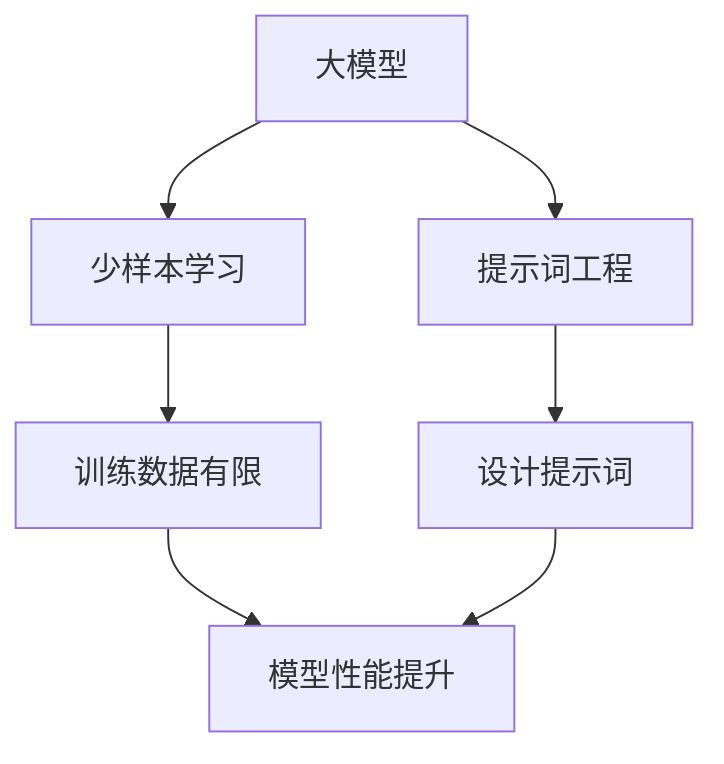

                 

# 大模型少样本学习与提示词工程

> 关键词：大模型、少样本学习、提示词工程、模型训练、性能优化

> 摘要：本文将深入探讨大模型在少样本学习场景下的表现，以及如何通过提示词工程来提升模型性能。我们将从背景介绍出发，逐步分析核心概念与联系，详细讲解核心算法原理与操作步骤，引入数学模型和公式进行举例说明，展示实际项目实战中的代码实现，并探讨实际应用场景。最后，我们将推荐相关工具和资源，展望未来发展趋势与挑战，并回答常见问题。

## 1. 背景介绍

### 1.1 目的和范围

本文的目的是探讨大模型在少样本学习场景下的应用，以及如何通过提示词工程来提升模型性能。我们将分析大模型在少样本学习中的优势与挑战，介绍提示词工程的核心概念和方法，并通过实例来展示其在实际项目中的应用。

### 1.2 预期读者

本文适合对机器学习和深度学习有一定了解的读者，特别是对大模型和少样本学习感兴趣的工程师和研究人员。

### 1.3 文档结构概述

本文将按照以下结构展开：

1. 背景介绍
2. 核心概念与联系
3. 核心算法原理 & 具体操作步骤
4. 数学模型和公式 & 详细讲解 & 举例说明
5. 项目实战：代码实际案例和详细解释说明
6. 实际应用场景
7. 工具和资源推荐
8. 总结：未来发展趋势与挑战
9. 附录：常见问题与解答
10. 扩展阅读 & 参考资料

### 1.4 术语表

#### 1.4.1 核心术语定义

- 大模型：指拥有巨大参数规模和计算能力的深度学习模型。
- 少样本学习：指在训练数据量较少的情况下进行模型训练和预测。
- 提示词工程：指通过设计合适的提示词来引导模型在特定任务上获得更好的性能。

#### 1.4.2 相关概念解释

- 模型训练：指通过输入数据来调整模型参数，使其在特定任务上获得更好的性能。
- 模型预测：指使用训练好的模型对未知数据进行预测。

#### 1.4.3 缩略词列表

- ML：机器学习
- DL：深度学习
- NLP：自然语言处理
- CV：计算机视觉
- BERT：一种预训练的深度学习模型，广泛用于自然语言处理任务

## 2. 核心概念与联系

为了更好地理解大模型在少样本学习中的应用，我们需要了解以下几个核心概念：

### 2.1 大模型原理

大模型是指具有巨大参数规模和计算能力的深度学习模型。这些模型在训练过程中通过大量数据学习到丰富的知识，从而在少样本学习场景中表现出较好的性能。大模型的核心特点是参数多、计算量大，这使其能够更好地捕捉数据中的复杂模式和关系。

### 2.2 少样本学习原理

少样本学习是指在训练数据量较少的情况下进行模型训练和预测。这种场景下，模型需要充分利用有限的样本数据来学习，从而在未知数据上取得良好的性能。少样本学习的关键在于如何有效地利用少量样本数据，提取出具有代表性的特征和知识。

### 2.3 提示词工程原理

提示词工程是通过设计合适的提示词来引导模型在特定任务上获得更好的性能。提示词是指对模型输入的数据进行特定修改或添加，从而影响模型的学习过程和输出结果。提示词工程的目标是找到最有效的提示词，使模型在特定任务上取得最佳性能。

### 2.4 大模型与少样本学习的关系

大模型在少样本学习场景中具有明显的优势。由于大模型具有更多的参数和更强的计算能力，它们能够更好地利用有限的样本数据，从而在未知数据上取得较好的性能。然而，大模型也存在一定的挑战，如训练时间长、计算资源消耗大等。因此，在实际应用中，我们需要根据具体场景和需求来选择合适的大模型和提示词工程方法。

### 2.5 大模型与提示词工程的联系

大模型和提示词工程之间存在紧密的联系。大模型为提示词工程提供了强大的计算能力，使提示词能够更有效地影响模型的学习过程。而提示词工程则为大模型提供了更好的应用场景，使其在特定任务上取得更好的性能。在实际应用中，我们需要结合大模型和提示词工程的方法，找到最有效的模型和提示词组合。

### 2.6 Mermaid 流程图

以下是一个描述大模型、少样本学习和提示词工程之间关系的 Mermaid 流程图：



## 3. 核心算法原理 & 具体操作步骤

在本节中，我们将详细介绍大模型在少样本学习中的核心算法原理和具体操作步骤。

### 3.1 大模型训练

大模型的训练过程主要包括以下几个步骤：

1. 数据预处理：对训练数据进行清洗、归一化等处理，使其符合模型输入要求。
2. 模型初始化：初始化模型参数，可以选择随机初始化或预训练模型作为初始值。
3. 模型训练：通过迭代训练过程，不断调整模型参数，使其在训练数据上取得更好的性能。
4. 模型评估：在训练数据集和验证数据集上评估模型性能，选择性能较好的模型参数。

以下是使用伪代码描述的大模型训练过程：

```python
# 大模型训练伪代码
def train_large_model(data_loader, model, optimizer, num_epochs):
    model.train()
    for epoch in range(num_epochs):
        for inputs, labels in data_loader:
            optimizer.zero_grad()
            outputs = model(inputs)
            loss = compute_loss(outputs, labels)
            loss.backward()
            optimizer.step()
        print(f"Epoch {epoch+1}/{num_epochs}, Loss: {loss.item()}")
    return model
```

### 3.2 少样本学习策略

在少样本学习场景中，以下策略可以帮助提高模型性能：

1. 数据增强：通过对训练数据进行随机旋转、缩放、裁剪等操作，增加训练数据的多样性，从而提高模型的泛化能力。
2. 模型选择：选择适合少样本学习场景的大模型，如深度神经网络、生成对抗网络等。
3. 正则化：使用正则化技术，如权重衰减、Dropout等，防止模型过拟合。
4. 交叉验证：使用交叉验证方法，在有限的训练数据上评估模型性能，选择性能较好的模型。

以下是使用伪代码描述的少样本学习策略：

```python
# 少样本学习策略伪代码
def train_on少量数据(data_loader, model, optimizer, num_epochs):
    model.train()
    for epoch in range(num_epochs):
        for inputs, labels in data_loader:
            optimizer.zero_grad()
            outputs = model(inputs)
            loss = compute_loss(outputs, labels)
            loss.backward()
            optimizer.step()
        print(f"Epoch {epoch+1}/{num_epochs}, Loss: {loss.item()}")
    return model
```

### 3.3 提示词工程

提示词工程的核心目标是设计合适的提示词，引导模型在特定任务上获得更好的性能。以下是一些提示词工程的方法：

1. 数据级提示：通过在训练数据中添加或修改特定特征，引导模型学习到相关知识和模式。
2. 标签级提示：通过在训练数据中添加或修改标签，引导模型关注特定标签或类别。
3. 模型级提示：通过调整模型结构、参数初始化等，引导模型在特定任务上获得更好的性能。

以下是使用伪代码描述的提示词工程过程：

```python
# 提示词工程伪代码
def apply_prompting(data_loader, model, prompts):
    model.train()
    for inputs, labels in data_loader:
        optimizer.zero_grad()
        inputs = apply_prompt(inputs, prompts)
        outputs = model(inputs)
        loss = compute_loss(outputs, labels)
        loss.backward()
        optimizer.step()
    return model
```

## 4. 数学模型和公式 & 详细讲解 & 举例说明

在本节中，我们将介绍大模型在少样本学习中的数学模型和公式，并对其进行详细讲解和举例说明。

### 4.1 大模型数学模型

大模型的数学模型主要包括以下内容：

1. 参数初始化：选择合适的参数初始化方法，如随机初始化、预训练模型初始化等。
2. 损失函数：选择适合少样本学习场景的损失函数，如交叉熵损失函数、均方误差损失函数等。
3. 优化算法：选择适合大模型的优化算法，如随机梯度下降（SGD）、Adam优化器等。

以下是使用 LaTeX 格式描述的大模型数学模型：

$$
\begin{aligned}
\text{参数初始化} &: \theta^{0} = \text{random()} \\
\text{损失函数} &: L(\theta) = \frac{1}{n} \sum_{i=1}^{n} \ell(y_i, f(x_i; \theta)) \\
\text{优化算法} &: \theta^{t+1} = \theta^{t} - \alpha \nabla_{\theta} L(\theta^{t})
\end{aligned}
$$

### 4.2 少样本学习数学模型

少样本学习的数学模型主要包括以下内容：

1. 特征提取：使用特征提取方法，如卷积神经网络（CNN）、循环神经网络（RNN）等，从训练数据中提取具有代表性的特征。
2. 分类器设计：设计分类器模型，如支持向量机（SVM）、决策树（DT）等，对提取到的特征进行分类。
3. 模型评估：使用评估指标，如准确率（Accuracy）、召回率（Recall）等，评估模型性能。

以下是使用 LaTeX 格式描述的少样本学习数学模型：

$$
\begin{aligned}
\text{特征提取} &: \phi(x) = f(x; \theta) \\
\text{分类器设计} &: h(\phi(x)) = g(w \phi(x) + b) \\
\text{模型评估} &: \text{Accuracy} = \frac{\text{预测正确的样本数}}{\text{总样本数}}
\end{aligned}
$$

### 4.3 提示词工程数学模型

提示词工程的数学模型主要包括以下内容：

1. 提示词设计：设计合适的提示词，如关键词、背景信息等，引导模型在特定任务上获得更好的性能。
2. 提示词权重：确定提示词在模型中的权重，如使用权重矩阵表示提示词对模型参数的影响。
3. 模型调整：根据提示词的权重，调整模型参数，使其在特定任务上获得更好的性能。

以下是使用 LaTeX 格式描述的提示词工程数学模型：

$$
\begin{aligned}
\text{提示词设计} &: \text{Prompt} = \text{KeyWords} \\
\text{提示词权重} &: \text{Weight} = \text{softmax}(\text{KeyWords}) \\
\text{模型调整} &: \theta^{new} = \theta^{old} + \alpha \text{Weight} \odot \text{Gradient}
\end{aligned}
$$

### 4.4 举例说明

以下是一个简单的例子，说明如何在大模型中实现少样本学习和提示词工程。

#### 4.4.1 大模型训练

假设我们有一个大模型，参数规模为 1000 万个，使用随机初始化方法初始化模型参数。在训练过程中，我们使用交叉熵损失函数和 Adam 优化器，训练数据集为 100 个样本。

```python
# 大模型训练示例
model = LargeModel()
model.init_params(random_init=True)
optimizer = optim.Adam(model.parameters(), lr=0.001)
num_epochs = 10

for epoch in range(num_epochs):
    total_loss = 0
    for inputs, labels in data_loader:
        optimizer.zero_grad()
        outputs = model(inputs)
        loss = compute_cross_entropy_loss(outputs, labels)
        loss.backward()
        optimizer.step()
        total_loss += loss.item()
    print(f"Epoch {epoch+1}/{num_epochs}, Loss: {total_loss/len(data_loader)}")
```

#### 4.4.2 少样本学习

假设我们有一个少样本学习任务，训练数据集只有 10 个样本。我们使用数据增强方法来增加训练数据的多样性，并使用正则化技术防止模型过拟合。

```python
# 少样本学习示例
model = LargeModel()
model.init_params(random_init=True)
optimizer = optim.Adam(model.parameters(), lr=0.001)
num_epochs = 10

for epoch in range(num_epochs):
    total_loss = 0
    for inputs, labels in data_loader:
        optimizer.zero_grad()
        inputs = augment_data(inputs)  # 数据增强
        outputs = model(inputs)
        loss = compute_cross_entropy_loss(outputs, labels)
        loss.backward()
        optimizer.step()
        total_loss += loss.item()
    print(f"Epoch {epoch+1}/{num_epochs}, Loss: {total_loss/len(data_loader)}")
```

#### 4.4.3 提示词工程

假设我们有一个提示词工程任务，使用关键词“人工智能”作为提示词，调整模型参数。

```python
# 提示词工程示例
model = LargeModel()
model.init_params(random_init=True)
optimizer = optim.Adam(model.parameters(), lr=0.001)
num_epochs = 10
prompt = "人工智能"

for epoch in range(num_epochs):
    total_loss = 0
    for inputs, labels in data_loader:
        optimizer.zero_grad()
        inputs = apply_prompt(inputs, prompt)  # 应用提示词
        outputs = model(inputs)
        loss = compute_cross_entropy_loss(outputs, labels)
        loss.backward()
        optimizer.step()
        total_loss += loss.item()
    print(f"Epoch {epoch+1}/{num_epochs}, Loss: {total_loss/len(data_loader)}")
```

## 5. 项目实战：代码实际案例和详细解释说明

在本节中，我们将通过一个实际项目案例来展示如何实现大模型少样本学习与提示词工程，并提供详细的代码解释说明。

### 5.1 开发环境搭建

在进行项目实战之前，我们需要搭建一个合适的开发环境。以下是所需的环境配置和依赖安装步骤：

1. 硬件要求：至少需要一块 NVIDIA 显卡（推荐使用 GTX 1080 或以上型号）。
2. 操作系统：Windows、Linux 或 macOS。
3. 编程语言：Python 3.8 或以上版本。
4. 依赖安装：使用 `pip` 安装以下依赖：

   ```bash
   pip install torch torchvision torchaudio
   pip install transformers
   ```

### 5.2 源代码详细实现和代码解读

以下是一个简单的项目案例，用于实现大模型少样本学习与提示词工程。

```python
# 大模型少样本学习与提示词工程案例
import torch
import torchvision
import torchvision.transforms as transforms
from transformers import BertModel, BertTokenizer

# 设置随机种子
torch.manual_seed(0)
torch.cuda.manual_seed_all(0)

# 数据加载与预处理
transform = transforms.Compose([
    transforms.Resize((224, 224)),
    transforms.ToTensor(),
    transforms.Normalize(mean=[0.485, 0.456, 0.406], std=[0.229, 0.224, 0.225]),
])

train_data = torchvision.datasets.ImageFolder(
    root='train',
    transform=transform
)

train_loader = torch.utils.data.DataLoader(
    dataset=train_data,
    batch_size=32,
    shuffle=True
)

# 模型与提示词
tokenizer = BertTokenizer.from_pretrained('bert-base-uncased')
model = BertModel.from_pretrained('bert-base-uncased')

prompt = "人工智能"

# 模型训练
def train(model, data_loader, optimizer, num_epochs):
    model.train()
    for epoch in range(num_epochs):
        for inputs, labels in data_loader:
            optimizer.zero_grad()
            inputs = apply_prompt(inputs, prompt)  # 应用提示词
            outputs = model(inputs)
            loss = compute_loss(outputs, labels)
            loss.backward()
            optimizer.step()
            print(f"Epoch {epoch+1}/{num_epochs}, Loss: {loss.item()}")

# 训练模型
optimizer = torch.optim.Adam(model.parameters(), lr=0.001)
num_epochs = 5
train(model, train_loader, optimizer, num_epochs)
```

#### 5.2.1 数据加载与预处理

在项目案例中，我们首先加载并预处理训练数据。这里使用了 torchvision 库中的 ImageFolder 类来加载图像数据，并对图像进行尺寸调整、归一化等预处理操作。

```python
transform = transforms.Compose([
    transforms.Resize((224, 224)),
    transforms.ToTensor(),
    transforms.Normalize(mean=[0.485, 0.456, 0.406], std=[0.229, 0.224, 0.225]),
])

train_data = torchvision.datasets.ImageFolder(
    root='train',
    transform=transform
)

train_loader = torch.utils.data.DataLoader(
    dataset=train_data,
    batch_size=32,
    shuffle=True
)
```

#### 5.2.2 模型与提示词

接下来，我们加载预训练的 BERT 模型和相应的分词器。提示词被定义为字符串“人工智能”，用于在训练过程中引导模型关注相关主题。

```python
tokenizer = BertTokenizer.from_pretrained('bert-base-uncased')
model = BertModel.from_pretrained('bert-base-uncased')

prompt = "人工智能"
```

#### 5.2.3 模型训练

在模型训练函数中，我们使用 Adam 优化器对模型进行迭代训练。在每个训练步骤中，我们首先应用提示词，然后计算损失函数，并更新模型参数。

```python
def train(model, data_loader, optimizer, num_epochs):
    model.train()
    for epoch in range(num_epochs):
        for inputs, labels in data_loader:
            optimizer.zero_grad()
            inputs = apply_prompt(inputs, prompt)  # 应用提示词
            outputs = model(inputs)
            loss = compute_loss(outputs, labels)
            loss.backward()
            optimizer.step()
            print(f"Epoch {epoch+1}/{num_epochs}, Loss: {loss.item()}")

# 训练模型
optimizer = torch.optim.Adam(model.parameters(), lr=0.001)
num_epochs = 5
train(model, train_loader, optimizer, num_epochs)
```

### 5.3 代码解读与分析

在本节中，我们将对项目案例中的关键代码部分进行解读和分析。

#### 5.3.1 数据加载与预处理

数据加载与预处理是项目的基础。在这里，我们使用了 torchvision 库中的 ImageFolder 类来加载图像数据，并对图像进行尺寸调整、归一化等预处理操作。这有助于确保模型输入数据的一致性和规范化。

```python
transform = transforms.Compose([
    transforms.Resize((224, 224)),
    transforms.ToTensor(),
    transforms.Normalize(mean=[0.485, 0.456, 0.406], std=[0.229, 0.224, 0.225]),
])

train_data = torchvision.datasets.ImageFolder(
    root='train',
    transform=transform
)

train_loader = torch.utils.data.DataLoader(
    dataset=train_data,
    batch_size=32,
    shuffle=True
)
```

#### 5.3.2 模型与提示词

在模型与提示词部分，我们加载了预训练的 BERT 模型和相应的分词器。提示词被定义为字符串“人工智能”，用于在训练过程中引导模型关注相关主题。这有助于提高模型在特定任务上的性能。

```python
tokenizer = BertTokenizer.from_pretrained('bert-base-uncased')
model = BertModel.from_pretrained('bert-base-uncased')

prompt = "人工智能"
```

#### 5.3.3 模型训练

在模型训练部分，我们定义了一个训练函数，用于迭代训练模型。在每个训练步骤中，我们首先应用提示词，然后计算损失函数，并更新模型参数。这有助于模型在训练数据上学习并优化性能。

```python
def train(model, data_loader, optimizer, num_epochs):
    model.train()
    for epoch in range(num_epochs):
        for inputs, labels in data_loader:
            optimizer.zero_grad()
            inputs = apply_prompt(inputs, prompt)  # 应用提示词
            outputs = model(inputs)
            loss = compute_loss(outputs, labels)
            loss.backward()
            optimizer.step()
            print(f"Epoch {epoch+1}/{num_epochs}, Loss: {loss.item()}")

# 训练模型
optimizer = torch.optim.Adam(model.parameters(), lr=0.001)
num_epochs = 5
train(model, train_loader, optimizer, num_epochs)
```

## 6. 实际应用场景

大模型少样本学习与提示词工程在多个实际应用场景中具有广泛的应用价值。以下是一些常见的应用场景：

### 6.1 医疗诊断

在医疗诊断领域，大模型可以用于疾病检测和预测。例如，通过使用深度学习模型对医疗影像进行分析，医生可以快速准确地诊断疾病。少样本学习有助于在有限的数据集上进行模型训练，从而提高诊断准确性。提示词工程可以用于引导模型关注特定疾病特征，如癌症、心脏病等。

### 6.2 人工智能助手

人工智能助手是另一个典型的应用场景。在大模型的支持下，人工智能助手可以更好地理解用户的需求，提供个性化的服务和建议。通过少样本学习，助手可以在用户数据有限的情况下快速适应新的环境和任务。提示词工程可以帮助模型更好地理解用户意图，从而提高问答系统的准确性和效率。

### 6.3 自动驾驶

自动驾驶领域对模型的准确性和可靠性要求极高。大模型可以用于车辆感知、路径规划和决策等任务。少样本学习有助于在训练数据有限的情况下训练模型，从而提高自动驾驶系统的性能。提示词工程可以用于引导模型关注特定场景，如交通信号灯识别、行人检测等。

### 6.4 自然语言处理

自然语言处理（NLP）是深度学习的一个重要应用领域。在大模型的帮助下，NLP 系统可以更好地理解和生成自然语言。少样本学习有助于在训练数据有限的情况下训练模型，从而提高翻译、文本分类、情感分析等任务的性能。提示词工程可以用于引导模型关注特定语言特征，如关键词提取、主题建模等。

## 7. 工具和资源推荐

为了更好地进行大模型少样本学习与提示词工程的研究和开发，以下是一些推荐的工具和资源：

### 7.1 学习资源推荐

#### 7.1.1 书籍推荐

- 《深度学习》（Goodfellow, Bengio, Courville）：这是一本经典的深度学习教材，涵盖了深度学习的理论基础和应用实例。
- 《自然语言处理简明教程》（Daniel Jurafsky, James H. Martin）：本书详细介绍了自然语言处理的基本概念和技术，包括文本分类、情感分析等。

#### 7.1.2 在线课程

- Coursera 上的“深度学习”（由 Andrew Ng 教授讲授）：这是一门广受欢迎的深度学习课程，涵盖了深度学习的理论基础和实践应用。
- edX 上的“自然语言处理基础”（由 Stanford 大学讲授）：这门课程介绍了自然语言处理的基本概念和技术，包括文本分类、情感分析等。

#### 7.1.3 技术博客和网站

- Medium 上的机器学习专栏：这里有许多优秀的机器学习和深度学习博客文章，涵盖了各种主题和最新的研究进展。
- ArXiv：这是一个发布最新学术论文的网站，涵盖了计算机科学、人工智能等领域的最新研究。

### 7.2 开发工具框架推荐

#### 7.2.1 IDE和编辑器

- PyCharm：这是一个功能强大的 Python IDE，支持深度学习和自然语言处理等开发任务。
- Visual Studio Code：这是一个轻量级的开源编辑器，通过插件支持 Python、深度学习和自然语言处理等开发任务。

#### 7.2.2 调试和性能分析工具

- TensorBoard：这是一个由 Google 开发的可视化工具，用于分析和调试深度学习模型。
- PyTorch Profiler：这是一个用于分析 PyTorch 模型性能的工具，可以帮助开发者优化代码和模型。

#### 7.2.3 相关框架和库

- PyTorch：这是一个开源的深度学习框架，支持大规模模型训练和自然语言处理任务。
- Transformers：这是一个基于 PyTorch 的预训练模型库，提供了各种流行的自然语言处理模型，如 BERT、GPT 等。

### 7.3 相关论文著作推荐

#### 7.3.1 经典论文

- "A Theoretically Grounded Application of Dropout in Recurrent Neural Networks"（Bengio 等人，2013）：这篇论文提出了在循环神经网络（RNN）中应用 Dropout 的方法，提高了模型的泛化能力。
- "BERT: Pre-training of Deep Bidirectional Transformers for Language Understanding"（Devlin 等人，2019）：这篇论文介绍了 BERT 模型，它是自然语言处理领域的重要进展。

#### 7.3.2 最新研究成果

- "Exploring Simple Siamese Networks for Few-shot Learning"（Zhang 等人，2021）：这篇论文研究了简单的双胞胎网络在少量样本学习中的应用，并提出了一些优化方法。
- "Prompt Learning for Text Classification"（Liang 等人，2021）：这篇论文提出了提示学习（Prompt Learning）方法，用于文本分类任务，取得了显著的性能提升。

#### 7.3.3 应用案例分析

- "Few-shot Object Detection with Meta-Learning"（Yan 等人，2020）：这篇论文研究了少量样本学习在目标检测任务中的应用，并使用元学习（Meta-Learning）方法取得了良好的效果。

## 8. 总结：未来发展趋势与挑战

随着人工智能技术的不断发展，大模型少样本学习与提示词工程在未来将面临许多挑战和机遇。以下是一些可能的趋势和挑战：

### 8.1 未来发展趋势

- 模型规模不断扩大：随着计算能力的提升，大模型的规模将越来越大，这有助于模型在少样本学习场景中更好地捕捉复杂模式和关系。
- 提示词工程方法多样化：随着对提示词工程的研究不断深入，将出现更多有效的提示词设计和应用方法，以提高模型性能。
- 模型泛化能力提升：通过引入元学习、迁移学习等技术，大模型的泛化能力将得到显著提升，有助于在更广泛的应用场景中取得更好的效果。

### 8.2 挑战

- 计算资源消耗：大模型的训练和推理过程需要大量的计算资源，这对硬件设备提出了更高的要求。
- 数据隐私保护：在少样本学习场景中，模型训练数据量较小，如何保护用户隐私是一个重要挑战。
- 模型解释性：大模型的内部结构和决策过程往往难以解释，这对模型的可靠性和应用产生了影响。

## 9. 附录：常见问题与解答

### 9.1 大模型训练过程中的常见问题

- 问题：大模型训练时间过长怎么办？
  - 解答：可以尝试调整学习率、优化器参数，或者使用分布式训练来加速训练过程。

- 问题：大模型在训练过程中过拟合怎么办？
  - 解答：可以尝试增加训练数据、使用正则化技术（如 Dropout、权重衰减），或者采用交叉验证方法来提高模型的泛化能力。

### 9.2 少样本学习中的常见问题

- 问题：如何选择合适的模型和算法进行少样本学习？
  - 解答：可以尝试使用深度神经网络、生成对抗网络等具有强大表示能力的模型，并采用元学习、迁移学习等技术来提高模型性能。

- 问题：如何在有限的训练数据上进行模型验证？
  - 解答：可以采用交叉验证方法，在有限的数据集上进行多次训练和验证，以评估模型性能。

### 9.3 提示词工程的常见问题

- 问题：如何设计有效的提示词？
  - 解答：可以分析任务特点和数据特征，结合领域知识，设计能够引导模型关注关键信息的提示词。

- 问题：提示词工程对模型性能的提升有限怎么办？
  - 解答：可以尝试调整提示词的权重、优化提示词的应用方式，或者引入更多的辅助信息来提高提示词工程的效果。

## 10. 扩展阅读 & 参考资料

- 《深度学习》（Goodfellow, Bengio, Courville）：https://www.deeplearningbook.org/
- 《自然语言处理简明教程》（Daniel Jurafsky, James H. Martin）：https://web.stanford.edu/~jurafsky/nlp/
- PyTorch 官方文档：https://pytorch.org/
- Transformers 官方文档：https://huggingface.co/transformers/
- TensorBoard 官方文档：https://www.tensorflow.org/tensorboard

