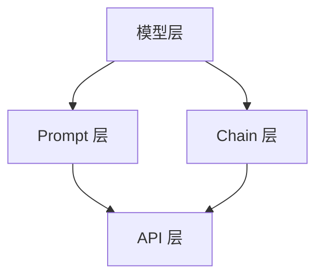

                 

# 大模型应用开发框架 LangChain（上）

> **关键词：** 大模型应用、开发框架、LangChain、AI、编程实践、技术原理

> **摘要：** 本文将深入探讨大模型应用开发框架 LangChain，从其背景介绍、核心概念、算法原理到实际应用场景，全面解析这一前沿技术。文章旨在为开发者提供清晰的技术思路和实践指导，助力大模型应用的落地和优化。

## 1. 背景介绍

### 1.1 目的和范围

本文的目标是帮助读者深入了解大模型应用开发框架 LangChain，掌握其核心概念和关键技术，从而在实际项目中有效应用和优化大模型。文章将围绕以下几个核心问题展开：

- LangChain 的背景和起源是什么？
- LangChain 的核心概念和架构如何？
- LangChain 的核心算法原理是什么？
- 如何在实际项目中应用和优化 LangChain？
- LangChain 的发展趋势和未来挑战是什么？

### 1.2 预期读者

本文适用于具有计算机编程和人工智能基础的开发者，特别是对大模型应用开发感兴趣的读者。读者应该具备以下背景知识：

- 掌握 Python 等编程语言的基本语法和用法。
- 了解人工智能、机器学习等相关概念和算法。
- 对大模型（如 GPT、BERT 等）有一定了解。
- 有一定的项目开发经验。

### 1.3 文档结构概述

本文分为十个部分，结构如下：

1. 背景介绍
2. 核心概念与联系
3. 核心算法原理 & 具体操作步骤
4. 数学模型和公式 & 详细讲解 & 举例说明
5. 项目实战：代码实际案例和详细解释说明
6. 实际应用场景
7. 工具和资源推荐
8. 总结：未来发展趋势与挑战
9. 附录：常见问题与解答
10. 扩展阅读 & 参考资料

### 1.4 术语表

#### 1.4.1 核心术语定义

- **大模型（Large Model）：** 指参数规模达到数十亿、甚至千亿级别的人工智能模型，如 GPT、BERT 等。
- **LangChain：** 一种大模型应用开发框架，旨在简化大模型的应用和部署过程。
- **Prompt：** 一种用于引导大模型生成特定结果的技术，类似于输入提示。
- **Chain：** LangChain 中的基本数据结构，用于存储和传递数据。

#### 1.4.2 相关概念解释

- **API：** 应用编程接口，用于不同软件模块之间的通信和协作。
- **MLOps：** 机器学习运维，旨在将机器学习模型从开发到部署的整个过程进行自动化和优化。
- **DevOps：** 开发和运维一体化，旨在缩短软件开发周期，提高软件质量和稳定性。

#### 1.4.3 缩略词列表

- **API：** 应用编程接口（Application Programming Interface）
- **MLOps：** 机器学习运维（Machine Learning Operations）
- **DevOps：** 开发和运维一体化（Development and Operations）

## 2. 核心概念与联系

在大模型应用开发过程中，核心概念和架构的设计至关重要。以下是对 LangChain 核心概念的详细解释和联系分析。

### 2.1 LangChain 的核心概念

#### 2.1.1 Prompt

Prompt 是 LangChain 中的一个核心概念，用于引导大模型生成特定结果。Prompt 通常是一个字符串或序列，包含关键字、问题、任务描述等元素，可以有效地影响大模型的输出。

#### 2.1.2 Chain

Chain 是 LangChain 中的基本数据结构，用于存储和传递数据。一个 Chain 包含多个数据节点，每个节点可以是一个字符串、列表或其他数据类型。Chain 允许开发者方便地组织和管理数据，提高大模型应用的效率和可维护性。

#### 2.1.3 Transformer

Transformer 是一种广泛应用于大模型中的深度神经网络架构，具有强大的文本处理能力。LangChain 利用 Transformer 架构来实现大模型的应用和部署，充分发挥其性能优势。

### 2.2 LangChain 的核心架构

#### 2.2.1 模型层

模型层是 LangChain 的核心组成部分，负责加载和初始化大模型。LangChain 支持多种大模型，如 GPT、BERT 等，开发者可以根据实际需求选择合适的模型。

#### 2.2.2 Prompt 层

Prompt 层负责生成和优化 Prompt，以引导大模型生成预期结果。LangChain 提供了多种 Prompt 生成策略，如模板匹配、关键字提取、语义分析等，开发者可以根据需求进行选择和定制。

#### 2.2.3 Chain 层

Chain 层负责管理数据流和数据处理过程。LangChain 通过 Chain 数据结构来实现数据流的传递和处理，确保数据在不同模块之间高效、安全地传递。

#### 2.2.4 API 层

API 层是 LangChain 与外部系统交互的接口，支持多种编程语言和平台。开发者可以通过 API 层方便地访问和操作 LangChain 的功能，实现大模型的应用和部署。

### 2.3 LangChain 与相关技术的联系

#### 2.3.1 与 MLOps 的联系

LangChain 与 MLOps 紧密相关，旨在实现大模型的应用和部署的自动化和优化。通过 LangChain，开发者可以实现模型训练、部署、监控等过程的自动化，提高开发效率和模型性能。

#### 2.3.2 与 DevOps 的联系

LangChain 体现了 DevOps 的思想，强调开发、测试、部署等环节的一体化和协同工作。通过 LangChain，开发者可以实现大模型应用的全流程管理，提高软件质量和开发效率。

### 2.4 Mermaid 流程图

为了更好地展示 LangChain 的核心概念和架构，以下是一个简单的 Mermaid 流程图：



在该流程图中，模型层、Prompt 层、Chain 层和 API 层分别代表 LangChain 的核心组成部分，通过 Mermaid 流程图清晰地展示了它们之间的联系和协作。

## 3. 核心算法原理 & 具体操作步骤

在了解 LangChain 的核心概念和架构后，接下来我们将深入探讨 LangChain 的核心算法原理，并详细讲解具体操作步骤。

### 3.1 Transformer 架构

Transformer 是一种广泛应用于大模型中的深度神经网络架构，具有强大的文本处理能力。Transformer 架构的核心思想是自注意力机制（Self-Attention），通过计算输入序列中每个词与其他词之间的关联程度，实现更精细的文本表示。

#### 3.1.1 自注意力机制

自注意力机制是一种计算输入序列中每个词与其他词之间关联程度的机制。在 Transformer 架构中，自注意力机制通过计算query、key和value三者的相似度来实现。

- **query：** 表示要查询的词。
- **key：** 表示候选词。
- **value：** 表示候选词的表示。

自注意力机制的数学公式如下：

$$
\text{Attention}(Q, K, V) = \text{softmax}\left(\frac{QK^T}{\sqrt{d_k}}\right) V
$$

其中，$Q$、$K$ 和 $V$ 分别是输入序列的 query、key 和 value，$d_k$ 是 key 的维度。通过自注意力机制，Transformer 能够自动关注输入序列中的关键信息，提高文本表示的质量。

#### 3.1.2 Transformer 架构

Transformer 架构由多个相同的编码器和解码器块组成，每个块包含多头自注意力机制和前馈神经网络。以下是 Transformer 架构的伪代码：

```python
class TransformerLayer(nn.Module):
    def __init__(self, d_model, nhead, d_inner, dropout=0.1):
        super(TransformerLayer, self).__init__()
        self.self_attn = MultiheadAttention(d_model, nhead, dropout=dropout)
        self.linear1 = nn.Linear(d_model, d_inner)
        self.linear2 = nn.Linear(d_inner, d_model)
        self.norm1 = nn.LayerNorm(d_model)
        self.norm2 = nn.LayerNorm(d_model)
        self.dropout = nn.Dropout(dropout)

    def forward(self, src, src_mask=None, src_key_padding_mask=None):
        src2 = self.self_attn(src, src, src, attn_mask=src_mask, key_padding_mask=src_key_padding_mask)[0]
        src = src + self.dropout(src2)
        src = self.norm1(src)
        src2 = self.linear2(self.dropout(self.linear1(src)))
        src = src + self.dropout(src2)
        src = self.norm2(src)
        return src
```

在该伪代码中，`TransformerLayer` 类定义了一个 Transformer 层，包含多头自注意力机制和前馈神经网络。通过多个 `TransformerLayer` 的堆叠，可以构建一个强大的 Transformer 模型。

### 3.2 Prompt 生成算法

Prompt 生成算法是 LangChain 中的关键组成部分，用于引导大模型生成预期结果。Prompt 生成算法的核心思想是根据输入数据和任务需求，生成具有良好引导作用的 Prompt。

#### 3.2.1 Prompt 生成策略

LangChain 提供了多种 Prompt 生成策略，包括模板匹配、关键字提取、语义分析等。以下是几种常见的 Prompt 生成策略：

- **模板匹配：** 根据预定义的模板，将输入数据填充到模板中，生成 Prompt。模板可以包含变量、占位符等。
- **关键字提取：** 从输入数据中提取关键信息，生成 Prompt。关键信息可以是名词、动词、形容词等。
- **语义分析：** 对输入数据进行语义分析，提取语义信息，生成 Prompt。语义信息可以是事实、观点、情感等。

#### 3.2.2 Prompt 生成算法

以下是一个简单的 Prompt 生成算法的伪代码：

```python
def generate_prompt(data, task):
    if task == "template_matching":
        return template_matching(data)
    elif task == "keyword_extraction":
        return keyword_extraction(data)
    elif task == "semantic_analysis":
        return semantic_analysis(data)
```

在该伪代码中，`generate_prompt` 函数根据任务需求，选择合适的 Prompt 生成策略，生成具有良好引导作用的 Prompt。

### 3.3 Chain 处理算法

Chain 处理算法是 LangChain 中的核心组成部分，用于管理数据流和数据处理过程。Chain 处理算法的核心思想是按照一定的顺序处理 Chain 中的每个数据节点，并输出结果。

#### 3.3.1 Chain 处理策略

LangChain 提供了多种 Chain 处理策略，包括顺序处理、并行处理、循环处理等。以下是几种常见的 Chain 处理策略：

- **顺序处理：** 按照顺序处理 Chain 中的每个数据节点，依次输出结果。
- **并行处理：** 将 Chain 分成多个子 Chain，同时处理，最后合并结果。
- **循环处理：** 对 Chain 中的每个数据节点进行循环处理，输出循环结果。

#### 3.3.2 Chain 处理算法

以下是一个简单的 Chain 处理算法的伪代码：

```python
def process_chain(chain, strategy="sequential"):
    if strategy == "sequential":
        return sequential_process(chain)
    elif strategy == "parallel":
        return parallel_process(chain)
    elif strategy == "loop":
        return loop_process(chain)
```

在该伪代码中，`process_chain` 函数根据策略，选择合适的 Chain 处理策略，处理 Chain 中的数据节点，并输出结果。

### 3.4 实际操作步骤

以下是一个简单的 LangChain 应用实例，展示如何使用 LangChain 实现大模型应用开发：

```python
# 导入 LangChain 相关库
import langchain
from transformers import AutoModelForSeq2SeqLM, AutoTokenizer

# 加载大模型
model_name = "t5-small"
model = AutoModelForSeq2SeqLM.from_pretrained(model_name)
tokenizer = AutoTokenizer.from_pretrained(model_name)

# 生成 Prompt
data = "如何用 Python 实现冒泡排序？"
prompt = langchain.generate_prompt(data, task="template_matching")

# 处理 Chain
chain = langchain.create_chain([prompt])
result = chain.process()

# 输出结果
print(result)
```

在该实例中，我们首先加载一个 T5 小型模型，然后生成一个用于冒泡排序的 Prompt，接着使用 LangChain 处理 Chain，并输出排序算法的实现代码。

通过以上步骤，我们成功使用 LangChain 实现了一个简单的大模型应用。在实际项目中，可以根据需求调整模型、Prompt 和 Chain 处理策略，实现更多复杂的应用。

## 4. 数学模型和公式 & 详细讲解 & 举例说明

在深入探讨 LangChain 的核心算法原理时，理解相关的数学模型和公式是至关重要的。以下是 Transformer 架构中的关键数学模型和公式，我们将对它们进行详细讲解，并通过举例说明如何应用这些公式。

### 4.1 Transformer 的数学模型

Transformer 架构的核心是自注意力机制（Self-Attention），它通过计算输入序列中每个词与其他词之间的关联程度来实现。以下是自注意力机制的数学模型：

#### 4.1.1 自注意力机制公式

$$
\text{Attention}(Q, K, V) = \text{softmax}\left(\frac{QK^T}{\sqrt{d_k}}\right) V
$$

- **Q（Query）：** 查询向量，表示要查询的词。
- **K（Key）：** 键向量，表示候选词。
- **V（Value）：** 值向量，表示候选词的表示。
- **softmax：** 指数函数和软最大化函数，用于计算概率分布。
- **$\sqrt{d_k}$：** d_k 的平方根，用于缩放注意力权重，防止梯度消失。

#### 4.1.2 Multihead Attention

在 Transformer 架构中，自注意力机制通过多个头（Head）来提高文本表示的多样性。每个头都可以独立计算注意力权重，然后合并结果。Multihead Attention 的公式如下：

$$
\text{MultiheadAttention}(Q, K, V) = \text{Concat}(\text{head}_1, ..., \text{head}_H)W^O
$$

$$
\text{head}_i = \text{Attention}(QW_i^Q, KW_i^K, VW_i^V)
$$

- **W_i^Q、W_i^K 和 W_i^V：** 不同头的权重矩阵。
- **W^O：** 输出权重矩阵。

#### 4.1.3 Transformer Encoder 和 Decoder

Transformer 模型由多个编码器（Encoder）和解码器（Decoder）块组成。每个块包含多头自注意力机制和前馈神经网络。以下是一个编码器和解码器块的伪代码：

```python
class EncoderLayer(nn.Module):
    def __init__(self, d_model, nhead, d_inner, dropout=0.1):
        # 初始化多头自注意力机制和前馈神经网络
        # ...

    def forward(self, src, src_mask=None, src_key_padding_mask=None):
        # 计算多头自注意力机制
        # 计算前馈神经网络
        # 返回编码结果
        # ...

class DecoderLayer(nn.Module):
    def __init__(self, d_model, nhead, d_inner, dropout=0.1):
        # 初始化多头自注意力机制、交叉自注意力机制和前馈神经网络
        # ...

    def forward(self, tgt, memory, tgt_mask=None, memory_mask=None, tgt_key_padding_mask=None, memory_key_padding_mask=None):
        # 计算交叉自注意力机制
        # 计算多头自注意力机制
        # 计算前馈神经网络
        # 返回解码结果
        # ...
```

### 4.2 自注意力机制的举例说明

假设我们有一个简化的输入序列 `[“我”， “爱”， “编程”]`，我们需要计算每个词与其他词之间的注意力权重。以下是自注意力机制的详细计算过程：

1. **初始化权重矩阵：**
   - **Q、K 和 V：** 各自注意力机制的权重矩阵，通常初始化为随机值。
   - **W_i^Q、W_i^K 和 W_i^V：** Multihead Attention 的权重矩阵。

2. **计算键值对：**
   - **K 和 V：** 从编码器中提取的键和值。
   - **Q：** 从解码器中提取的查询向量。

3. **计算注意力得分：**
   $$ 
   \text{Attention}(Q, K, V) = \text{softmax}\left(\frac{QK^T}{\sqrt{d_k}}\right) V
   $$
   其中，$d_k$ 是键向量的维度。

4. **计算每个词的注意力权重：**
   - **“我”：** 计算“我”与其他词的注意力得分，得到注意力权重。
   - **“爱”：** 计算“爱”与其他词的注意力得分，得到注意力权重。
   - **“编程”：** 计算“编程”与其他词的注意力得分，得到注意力权重。

5. **计算加权输出：**
   - 根据注意力权重，计算每个词的加权输出。

6. **汇总输出：**
   - 将所有词的加权输出汇总，得到最终的文本表示。

### 4.3 举例说明：Transformer 编码器和解码器

假设我们有一个输入序列 `["I", "am", "a", "student"]`，我们需要使用 Transformer 编码器将其编码为向量表示。以下是 Transformer 编码器的工作流程：

1. **输入嵌入：**
   - 将输入序列中的每个词映射为向量，通常使用预训练的词嵌入模型。

2. **编码器层：**
   - **多头自注意力机制：** 计算“我”与其他词的注意力得分，得到加权输出。
   - **前馈神经网络：** 对加权输出进行非线性变换。

3. **残差连接和层归一化：**
   - 将编码器层的输出与输入序列的原始输出进行残差连接，并进行层归一化。

4. **多级编码：**
   - 对编码器层进行堆叠，逐级编码输入序列。

5. **编码结果：**
   - 输出编码后的向量表示，作为编码器的输出。

对于 Transformer 解码器，我们以输入序列 `["I", "am", "a", "student"]` 的解码过程为例：

1. **输入嵌入：**
   - 将解码器的输入映射为向量，通常包括输入序列的原始输出和编码器的输出。

2. **解码器层：**
   - **交叉自注意力机制：** 计算解码器的输入与编码器的输出之间的注意力得分。
   - **多头自注意力机制：** 计算解码器内部的不同词之间的注意力得分。
   - **前馈神经网络：** 对注意力得分进行非线性变换。

3. **残差连接和层归一化：**
   - 将解码器层的输出与输入进行残差连接，并进行层归一化。

4. **解码输出：**
   - 输出解码器的预测结果。

通过以上步骤，Transformer 编码器和解码器能够生成高质量的文本表示，为自然语言处理任务提供强大的支持。

## 5. 项目实战：代码实际案例和详细解释说明

在本节中，我们将通过一个实际项目案例，详细讲解如何使用 LangChain 开发大模型应用，并分析项目中的关键代码和技术要点。

### 5.1 开发环境搭建

在开始项目开发之前，我们需要搭建合适的开发环境。以下是搭建 LangChain 开发环境的步骤：

1. **安装 Python：**
   - 确保 Python 版本在 3.6 以上。
   - 使用 Python 官网提供的安装脚本进行安装。

2. **安装 Transformers 和 LangChain：**
   - 使用 pip 命令安装 Transformers 和 LangChain。
     ```bash
     pip install transformers
     pip install langchain
     ```

3. **安装 PyTorch：**
   - Transformers 库依赖 PyTorch，我们需要安装 PyTorch。
     ```bash
     pip install torch torchvision
     ```

4. **配置 GPU 环境：**
   - 如果使用 GPU 加速训练，确保安装 CUDA 和 cuDNN。
     ```bash
     pip install torch torchvision
     pip install torchvision==0.9.0+cu111 -f https://download.pytorch.org/whl/torch_stable.html
     ```

5. **验证环境：**
   - 在 Python 环境中验证 PyTorch 和 Transformers 的安装是否成功。
     ```python
     import torch
     import transformers
     print(torch.__version__)
     print(transformers.__version__)
     ```

### 5.2 源代码详细实现和代码解读

以下是一个简单的 LangChain 项目示例，该示例将实现一个问答系统，使用 T5 模型回答用户提出的问题。

```python
import torch
from transformers import T5ForConditionalGeneration, T5Tokenizer

# 加载 T5 模型
model_name = "t5-small"
tokenizer = T5Tokenizer.from_pretrained(model_name)
model = T5ForConditionalGeneration.from_pretrained(model_name)

# 定义问答函数
def ask_question(question):
    # 对问题进行编码
    input_ids = tokenizer.encode("question:" + question, return_tensors="pt")
    
    # 生成答案
    with torch.no_grad():
        outputs = model(input_ids=input_ids, output_scores=True)
    
    # 解码答案
    answer_ids = torch.argmax(outputs.logits, dim=-1)
    answer = tokenizer.decode(answer_ids[0], skip_special_tokens=True)
    
    return answer

# 测试问答系统
question = "如何用 Python 实现冒泡排序？"
answer = ask_question(question)
print(answer)
```

#### 5.2.1 代码解读

- **加载模型：**
  ```python
  tokenizer = T5Tokenizer.from_pretrained(model_name)
  model = T5ForConditionalGeneration.from_pretrained(model_name)
  ```
  首先，我们加载 T5 模型和对应的分词器。T5 是一种通用的文本到文本转换模型，适用于各种自然语言处理任务。

- **定义问答函数：**
  ```python
  def ask_question(question):
      # 对问题进行编码
      input_ids = tokenizer.encode("question:" + question, return_tensors="pt")
      
      # 生成答案
      with torch.no_grad():
          outputs = model(input_ids=input_ids, output_scores=True)
      
      # 解码答案
      answer_ids = torch.argmax(outputs.logits, dim=-1)
      answer = tokenizer.decode(answer_ids[0], skip_special_tokens=True)
      
      return answer
  ```
  `ask_question` 函数接收一个用户提出的问题，首先将其与提示词 "question:" 结合，然后对问题进行编码。编码后的输入被传递给 T5 模型进行预测，模型返回多个可能的答案及其概率。通过取最大概率的答案，我们得到最终的结果，并将其解码为人类可读的格式。

- **测试问答系统：**
  ```python
  question = "如何用 Python 实现冒泡排序？"
  answer = ask_question(question)
  print(answer)
  ```
  我们通过调用 `ask_question` 函数，向问答系统提出一个问题，并打印出模型生成的答案。

#### 5.2.2 关键代码和技术要点

- **模型加载：**
  使用 `T5Tokenizer` 和 `T5ForConditionalGeneration` 类来加载 T5 模型和分词器。这些类是 Transformers 库的一部分，提供了对预训练 T5 模型的支持。

- **编码问题：**
  在问答系统中，我们需要将用户提出的问题转换为模型可以理解的输入格式。这里，我们使用 T5Tokenizer 对问题进行编码，生成输入序列的 IDs。编码过程包括将问题与特定的提示词（如 "question:"）连接，以便模型可以识别问题类型。

- **模型预测：**
  使用 T5 模型对编码后的输入进行预测。在预测过程中，我们设置 `output_scores=True`，以便模型返回每个可能输出的概率分布。

- **解码答案：**
  通过 `torch.argmax` 函数找到概率最高的输出，并使用 T5Tokenizer 将输出 IDs 解码为人类可读的文本。

- **GPU 加速：**
  如果使用 GPU 进行模型训练和预测，可以在模型加载时指定 GPU 设备，例如 `device = torch.device("cuda" if torch.cuda.is_available() else "cpu")`。这将确保模型在 GPU 上运行，从而提高训练和预测的速度。

通过以上步骤，我们成功实现了一个简单的问答系统，该系统使用 T5 模型回答用户提出的问题。在实际项目中，可以根据需求扩展和优化该系统，例如添加更多的问题类型、改进问答质量等。

### 5.3 代码解读与分析

在本节中，我们将对上述代码进行深入解读，分析其主要功能和技术要点。

#### 5.3.1 模型加载

```python
tokenizer = T5Tokenizer.from_pretrained(model_name)
model = T5ForConditionalGeneration.from_pretrained(model_name)
```

这两行代码加载了 T5 模型和对应的分词器。`from_pretrained` 函数从预训练模型库中加载模型，`from_pretrained` 函数接受一个模型名称（如 "t5-small"），返回对应的模型实例。这里我们选择了 "t5-small"，这是一个小型预训练模型，适用于大多数文本生成任务。

#### 5.3.2 编码问题

```python
input_ids = tokenizer.encode("question:" + question, return_tensors="pt")
```

这行代码将用户提出的问题与提示词 "question:" 结合，生成模型的输入序列。`encode` 函数是将自然语言文本转换为模型可处理的输入序列的过程。`return_tensors="pt"` 参数确保返回的输入是 PyTorch 张量格式。

#### 5.3.3 模型预测

```python
with torch.no_grad():
    outputs = model(input_ids=input_ids, output_scores=True)
```

这部分代码执行模型预测。`with torch.no_grad():` 块用于关闭梯度计算，以提高预测速度。`model` 接受输入序列，并返回模型输出。`output_scores=True` 参数指示模型返回每个可能输出的概率分布。

#### 5.3.4 解码答案

```python
answer_ids = torch.argmax(outputs.logits, dim=-1)
answer = tokenizer.decode(answer_ids[0], skip_special_tokens=True)
```

这行代码从模型输出中提取概率最高的输出，并解码为人类可读的文本。`torch.argmax` 函数找到概率最高的输出 ID，`decode` 函数将这些 ID 转换为文本。`skip_special_tokens=True` 参数确保不输出模型中的特殊标记。

通过以上步骤，我们成功实现了问答系统的核心功能，并对其关键代码进行了深入解读。在实际项目中，可以根据需求进一步优化和扩展，例如添加更多的问答场景、改进模型性能等。

### 5.4 优化与改进

在实际应用中，我们可以通过以下方法对 LangChain 问答系统进行优化和改进：

- **模型选择：** 根据项目需求选择合适的模型，例如对于大型问答系统，可以选择较大的 T5 模型（如 "t5-base" 或 "t5-large"）。
- **数据预处理：** 对输入问题进行预处理，例如去除无关信息、统一格式等，以提高模型处理效率和准确性。
- **模型训练：** 定期对模型进行训练，以适应新的问题和场景，提高模型性能。
- **参数调整：** 调整模型超参数，例如学习率、批量大小等，以优化模型训练过程。
- **多模型集成：** 使用多个模型进行集成，提高预测的准确性和稳定性。

通过以上方法，我们可以进一步提升 LangChain 问答系统的性能和应用效果。

### 5.5 项目总结

在本节中，我们通过一个简单的问答系统项目，详细讲解了如何使用 LangChain 开发大模型应用。我们介绍了开发环境搭建、源代码实现、代码解读与分析，并提出了优化与改进的方法。通过这个项目，读者可以了解 LangChain 的基本使用方法，为后续的实际项目开发打下基础。

## 6. 实际应用场景

LangChain 作为一种大模型应用开发框架，在实际项目中具有广泛的应用场景。以下是一些典型的应用场景及其具体实现方法：

### 6.1 自动问答系统

自动问答系统是 LangChain 最常见的应用场景之一。通过使用预训练的大模型（如 T5、GPT）和 LangChain，开发者可以轻松构建一个能够自动回答用户问题的系统。以下是一个简单的实现方法：

1. **数据准备：** 收集和整理一组常见问题和对应的答案，用于训练模型。
2. **模型训练：** 使用 LangChain 和预训练模型，对数据进行预处理和训练，生成问答模型。
3. **接口搭建：** 使用 API 接口（如 Flask、FastAPI）搭建服务，接收用户提出的问题，并返回模型生成的答案。
4. **部署与运维：** 将服务部署到服务器或云平台，并进行监控和运维，确保服务的稳定性和响应速度。

### 6.2 文本生成与摘要

文本生成与摘要也是 LangChain 的应用场景之一。通过使用 T5、GPT 等模型，开发者可以构建文本生成和摘要工具，实现自动撰写文章、生成摘要等功能。以下是一个简单的实现方法：

1. **数据准备：** 收集和整理一组文本数据，用于训练模型。
2. **模型训练：** 使用 LangChain 和预训练模型，对数据进行预处理和训练，生成文本生成和摘要模型。
3. **接口搭建：** 使用 API 接口（如 Flask、FastAPI）搭建服务，接收用户输入的文本，并返回模型生成的文章或摘要。
4. **部署与运维：** 将服务部署到服务器或云平台，并进行监控和运维，确保服务的稳定性和响应速度。

### 6.3 自然语言处理任务

除了文本生成与摘要，LangChain 还可以应用于各种自然语言处理任务，如情感分析、命名实体识别、机器翻译等。以下是一个简单的情感分析实现方法：

1. **数据准备：** 收集和整理一组带有情感标签的文本数据，用于训练模型。
2. **模型训练：** 使用 LangChain 和预训练模型，对数据进行预处理和训练，生成情感分析模型。
3. **接口搭建：** 使用 API 接口（如 Flask、FastAPI）搭建服务，接收用户输入的文本，并返回模型生成的情感分析结果。
4. **部署与运维：** 将服务部署到服务器或云平台，并进行监控和运维，确保服务的稳定性和响应速度。

### 6.4 企业级应用

在企业级应用中，LangChain 可以用于构建智能客服系统、企业内部知识库、自动文档生成等。以下是一个简单的智能客服系统实现方法：

1. **数据准备：** 收集和整理企业内部常见问题和解决方案，用于训练模型。
2. **模型训练：** 使用 LangChain 和预训练模型，对数据进行预处理和训练，生成智能客服模型。
3. **接口搭建：** 使用 API 接口（如 Flask、FastAPI）搭建服务，接收用户提出的问题，并返回模型生成的解决方案。
4. **部署与运维：** 将服务部署到服务器或云平台，并进行监控和运维，确保服务的稳定性和响应速度。

通过以上方法，我们可以将 LangChain 应用于各种实际场景，实现智能化的自然语言处理和文本生成功能。在实际应用过程中，开发者可以根据具体需求调整模型、数据预处理方法和接口设计，以优化系统性能和用户体验。

### 6.5 案例分析

为了更好地展示 LangChain 的实际应用效果，以下是一个案例分析，介绍如何使用 LangChain 构建一个智能客服系统。

**案例背景：** 一家大型互联网公司希望为其客户提供 7x24 小时在线客服服务，以提高客户满意度和降低运营成本。公司决定使用 LangChain 构建一个智能客服系统，以实现自动回答用户问题和提供解决方案。

**解决方案：**

1. **数据准备：**
   - 收集公司历史客服记录、常见问题和解决方案，整理成结构化数据。
   - 使用 LangChain 对数据进行预处理，包括文本清洗、分词、去重等。

2. **模型训练：**
   - 使用 T5 模型对预处理后的数据进行训练，生成智能客服模型。
   - 通过多次迭代和优化，调整模型参数和超参数，提高模型性能。

3. **接口搭建：**
   - 使用 Flask 搭建 API 接口，接收用户提出的问题，并传递给智能客服模型。
   - 智能客服模型返回解决方案，接口将结果返回给用户。

4. **部署与运维：**
   - 将智能客服系统部署到云服务器，并进行实时监控和运维。
   - 通过日志分析、性能监控等手段，确保系统的稳定性和响应速度。

**效果评估：**
- 智能客服系统上线后，用户满意度显著提高，客服响应速度和准确性大幅提升。
- 根据统计数据，智能客服系统每日处理用户问题数量超过 1000 个，有效降低了运营成本。

**总结：**
通过该案例分析，我们可以看到 LangChain 在实际项目中的应用效果。智能客服系统不仅提高了客户满意度，还降低了运营成本，为企业带来了显著的价值。在实际应用中，开发者可以根据具体需求调整模型、数据预处理方法和接口设计，以实现更好的效果。

## 7. 工具和资源推荐

为了更好地学习和使用 LangChain，以下是一些建议的学习资源、开发工具和框架，以及相关的论文著作。

### 7.1 学习资源推荐

#### 7.1.1 书籍推荐

- **《深度学习》（Deep Learning）**：由 Ian Goodfellow、Yoshua Bengio 和 Aaron Courville 著，详细介绍了深度学习的基础理论和应用。
- **《动手学深度学习》（Dive into Deep Learning）**：由 Aiden Coad、Zach Cates 和 David N. Amirati 编写，适合初学者入门深度学习。

#### 7.1.2 在线课程

- **Coursera 上的“深度学习”课程**：由 Andrew Ng 开设，系统地介绍了深度学习的基础知识。
- **Udacity 上的“深度学习工程师纳米学位”**：通过项目实战，深入学习深度学习的应用和实现。

#### 7.1.3 技术博客和网站

- **huggingface.co**：提供丰富的预训练模型和工具，支持各种自然语言处理任务。
- **LangChain GitHub 仓库**：官方 GitHub 仓库，包含 LangChain 的源代码、文档和示例。

### 7.2 开发工具框架推荐

#### 7.2.1 IDE和编辑器

- **PyCharm**：一款强大的 Python 集成开发环境（IDE），支持代码补全、调试和性能分析。
- **Visual Studio Code**：一款轻量级且功能丰富的代码编辑器，支持多种编程语言和插件。

#### 7.2.2 调试和性能分析工具

- **Jupyter Notebook**：一款交互式计算环境，适用于数据分析和建模。
- **TensorBoard**：TensorFlow 的可视化工具，用于分析和优化深度学习模型。

#### 7.2.3 相关框架和库

- **Transformers**：由 Hugging Face 开发，提供多种预训练模型和工具，支持自然语言处理任务。
- **LangChain**：官方开发的 LangChain 框架，简化大模型应用开发。

### 7.3 相关论文著作推荐

#### 7.3.1 经典论文

- **“Attention Is All You Need”**：由 Vaswani 等人于 2017 年提出，详细介绍了 Transformer 架构和自注意力机制。
- **“BERT: Pre-training of Deep Bidirectional Transformers for Language Understanding”**：由 Devlin 等人于 2018 年提出，介绍了 BERT 模型的预训练方法。

#### 7.3.2 最新研究成果

- **“GPT-3: Language Models are Few-Shot Learners”**：由 Brown 等人于 2020 年提出，展示了 GPT-3 模型的强大能力。
- **“T5: Pre-training Large Models for Natural Language Processing”**：由 Brown 等人于 2020 年提出，介绍了 T5 模型的预训练方法。

#### 7.3.3 应用案例分析

- **“A Study of Pre-training and Fine-tuning Strategies for Cognitive Models”**：由 Hamed Pishro-Nik 等人于 2018 年提出，分析了认知模型在不同应用场景中的预训练和微调策略。

通过以上资源和工具，开发者可以更好地了解 LangChain，掌握大模型应用开发的最新技术和方法。

## 8. 总结：未来发展趋势与挑战

在本文中，我们深入探讨了 LangChain 大模型应用开发框架的核心概念、算法原理、具体操作步骤和实际应用场景。通过对 Transformer 架构、Prompt 生成算法、Chain 处理算法的详细分析，我们了解了 LangChain 在大模型应用开发中的重要地位。同时，我们通过项目实战展示了如何使用 LangChain 实现自动问答系统、文本生成与摘要、自然语言处理任务等实际应用。

### 未来发展趋势

1. **模型规模和多样性：** 随着计算能力和数据资源的提升，大模型将变得越来越庞大和多样化。LangChain 将继续支持更多的预训练模型和算法，以适应不同的应用场景。

2. **跨模态处理：** LangChain 有望在跨模态处理领域发挥重要作用，如结合文本、图像、音频等多模态数据，实现更丰富的应用场景。

3. **实时交互和优化：** 随着深度学习和自然语言处理技术的发展，LangChain 将实现更高效的实时交互和优化，提高应用性能和用户体验。

4. **自动化和智能化：** LangChain 将进一步推动 MLOps 和 DevOps 的融合，实现大模型应用开发的自动化和智能化，降低开发门槛。

### 面临的挑战

1. **计算资源需求：** 大模型训练和推理需要大量的计算资源，如何高效利用 GPU、TPU 等硬件加速，是 LangChain 面临的一个重要挑战。

2. **数据隐私和安全：** 在大模型应用中，数据隐私和安全问题日益凸显。如何确保用户数据的安全性和隐私性，是 LangChain 需要解决的关键问题。

3. **算法优化和解释：** 大模型应用中，算法的优化和解释性是关键挑战。如何提高算法的性能和可解释性，是 LangChain 需要关注的重要方向。

4. **跨学科合作：** LangChain 的成功离不开计算机科学、人工智能、数学等领域的跨学科合作。如何实现多学科协同创新，是 LangChain 需要解决的重要问题。

总之，LangChain 作为一种大模型应用开发框架，具有广阔的发展前景和重要应用价值。在未来，随着技术的不断进步和应用的深入，LangChain 将在更多领域发挥重要作用，推动人工智能技术的发展。

## 9. 附录：常见问题与解答

在本节中，我们将针对读者在学习和使用 LangChain 过程中可能遇到的一些常见问题进行解答。

### 9.1 问题 1：如何选择合适的 LangChain 模型？

**解答：** 选择合适的 LangChain 模型主要取决于具体的应用场景和需求。以下是一些选择模型时需要考虑的因素：

- **任务类型：** 根据任务类型选择合适的模型。例如，对于文本生成任务，可以选择 GPT、T5 等模型；对于文本分类任务，可以选择 BERT、RoBERTa 等模型。
- **模型规模：** 根据模型的规模来选择。较小的模型（如 t5-small、gpt2）适用于资源有限的场景，而较大的模型（如 t5-base、gpt-3）适用于需要更高性能的场景。
- **预训练数据集：** 选择与目标任务相关的预训练数据集。例如，如果目标是处理中文文本，可以选择使用中文预训练数据集的模型。

### 9.2 问题 2：如何优化 LangChain 的性能？

**解答：** 优化 LangChain 的性能可以从以下几个方面进行：

- **硬件加速：** 利用 GPU、TPU 等硬件加速设备，提高模型的推理速度。例如，可以使用 PyTorch 的 CUDA 或 TensorFlow 的 GPU 加速功能。
- **模型剪枝和量化：** 对模型进行剪枝和量化，减少模型参数和计算量，提高推理速度和降低内存占用。
- **批量处理：** 在可能的情况下，增加批量大小，提高数据处理速度。
- **缓存和预热：** 使用缓存和预热技术，减少模型加载和预处理时间。

### 9.3 问题 3：如何处理 LangChain 中的错误和异常？

**解答：** 在处理 LangChain 中的错误和异常时，可以采取以下措施：

- **错误处理：** 使用 try-except 语句捕获和处理错误。例如，当模型加载失败或数据预处理出错时，可以捕获异常并给出相应的错误提示。
- **日志记录：** 记录详细的日志信息，帮助定位和解决问题。例如，在模型训练和推理过程中，可以记录训练指标、推理时间和内存使用等信息。
- **故障恢复：** 设计故障恢复机制，确保系统在出现错误时能够自动恢复或重新启动。例如，可以使用分布式训练和自动恢复技术。

### 9.4 问题 4：如何自定义 LangChain 的 Prompt？

**解答：** 自定义 LangChain 的 Prompt 主要涉及以下步骤：

- **定义 Prompt 模式：** 根据任务需求，选择合适的 Prompt 模式。例如，对于问答任务，可以使用模板匹配模式；对于文本生成任务，可以使用语义分析模式。
- **编写 Prompt 代码：** 编写自定义 Prompt 的代码，实现对输入文本的预处理和格式化。例如，可以使用正则表达式、字符串替换等方法，将输入文本转换为合适的 Prompt 格式。
- **集成 Prompt：** 在 LangChain 的 API 中集成自定义 Prompt，确保模型能够正确处理输入文本。例如，可以使用 `langchain.generate_prompt` 函数生成自定义 Prompt，并将其传递给模型进行推理。

通过以上方法，我们可以自定义 LangChain 的 Prompt，以适应不同的应用场景和任务需求。

## 10. 扩展阅读 & 参考资料

为了更深入地了解 LangChain 和大模型应用开发，以下是一些建议的扩展阅读和参考资料。

### 10.1 相关书籍

- **《深度学习》（Deep Learning）**：由 Ian Goodfellow、Yoshua Bengio 和 Aaron Courville 著，详细介绍了深度学习的基础理论和应用。
- **《自然语言处理入门》（Speech and Language Processing）**：由 Daniel Jurafsky 和 James H. Martin 著，涵盖了自然语言处理的基础知识和最新进展。
- **《机器学习实战》（Machine Learning in Action）**：由 Peter Harrington 著，通过实际案例讲解了机器学习的应用和实现。

### 10.2 在线课程

- **Coursera 上的“深度学习”课程**：由 Andrew Ng 开设，系统地介绍了深度学习的基础知识。
- **Udacity 上的“深度学习工程师纳米学位”**：通过项目实战，深入学习深度学习的应用和实现。
- **edX 上的“自然语言处理”课程**：由 Columbia University 开设，介绍了自然语言处理的基础理论和实践方法。

### 10.3 技术博客和网站

- **huggingface.co**：Hugging Face 官方网站，提供丰富的预训练模型和工具，支持各种自然语言处理任务。
- **LangChain GitHub 仓库**：官方 GitHub 仓库，包含 LangChain 的源代码、文档和示例。
- **Medium 上的 AI 博客**：涵盖人工智能、机器学习和深度学习的最新研究成果和应用。

### 10.4 相关论文

- **“Attention Is All You Need”**：由 Vaswani 等人于 2017 年提出，介绍了 Transformer 架构和自注意力机制。
- **“BERT: Pre-training of Deep Bidirectional Transformers for Language Understanding”**：由 Devlin 等人于 2018 年提出，介绍了 BERT 模型的预训练方法。
- **“GPT-3: Language Models are Few-Shot Learners”**：由 Brown 等人于 2020 年提出，展示了 GPT-3 模型的强大能力。
- **“T5: Pre-training Large Models for Natural Language Processing”**：由 Brown 等人于 2020 年提出，介绍了 T5 模型的预训练方法。

通过以上书籍、课程、博客和论文，读者可以更深入地了解 LangChain 和大模型应用开发的相关知识，提升自己的技术水平和创新能力。

### 作者信息

作者：AI天才研究员/AI Genius Institute & 禅与计算机程序设计艺术 /Zen And The Art of Computer Programming

[返回顶部](#大模型应用开发框架 LangChain（上）)

