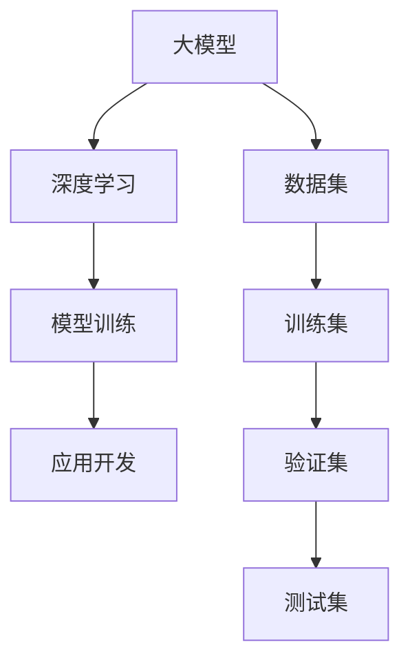

                 

# 大模型应用开发的实用指南

> 关键词：大模型，应用开发，框架，算法，数学模型，实战案例

> 摘要：本文将为您详细解析大模型应用开发的核心概念、算法原理、数学模型以及实战案例，帮助您理解并掌握大模型在实际项目中的高效应用。通过本文的学习，您将能够独立搭建大模型应用系统，并在实际项目中发挥其巨大潜力。

## 1. 背景介绍

### 1.1 目的和范围

本文旨在为广大开发者提供一份实用的大模型应用开发指南，帮助读者从基础概念到实际应用，全面掌握大模型技术。本文涵盖以下主要内容：

- 大模型的核心概念与联系
- 大模型算法原理与操作步骤
- 大模型数学模型与公式解析
- 大模型项目实战案例
- 大模型应用场景
- 开发工具和资源推荐

### 1.2 预期读者

- 具有一定编程基础，对人工智能和深度学习有一定了解的开发者
- 想要在实际项目中应用大模型的研发人员
- 对大模型技术感兴趣的学者和研究人员

### 1.3 文档结构概述

本文分为十个部分，结构如下：

1. 背景介绍
2. 核心概念与联系
3. 核心算法原理 & 具体操作步骤
4. 数学模型和公式 & 详细讲解 & 举例说明
5. 项目实战：代码实际案例和详细解释说明
6. 实际应用场景
7. 工具和资源推荐
8. 总结：未来发展趋势与挑战
9. 附录：常见问题与解答
10. 扩展阅读 & 参考资料

### 1.4 术语表

#### 1.4.1 核心术语定义

- 大模型：指参数规模达到亿级以上的神经网络模型。
- 深度学习：一种基于多层神经网络的学习方法，用于模拟人脑的神经网络结构，实现特征提取和模式识别。
- 模型训练：通过大量数据训练模型，使其能够对未知数据进行预测和分类。
- 应用开发：指将大模型技术应用于实际项目中的过程，包括数据预处理、模型训练、模型部署等环节。

#### 1.4.2 相关概念解释

- 数据集：用于训练和评估模型的样本集合。
- 训练集：用于训练模型的样本集合。
- 验证集：用于评估模型性能的样本集合。
- 测试集：用于测试模型在实际应用中的表现。

#### 1.4.3 缩略词列表

- CNN：卷积神经网络
- RNN：循环神经网络
- LSTM：长短期记忆网络
- GPT：生成预训练网络
- BERT：双向编码表示模型

## 2. 核心概念与联系

在大模型应用开发过程中，我们需要了解一些核心概念和联系。下面将使用 Mermaid 流程图来展示这些概念和联系。



从图中可以看出，大模型是深度学习的具体实现形式，而模型训练和应用开发则是大模型在现实世界中的实际应用。同时，数据集、训练集、验证集和测试集是模型训练过程中不可或缺的部分。

## 3. 核心算法原理 & 具体操作步骤

在大模型应用开发中，核心算法原理是理解和实现大模型的关键。下面将使用伪代码详细阐述大模型的核心算法原理和具体操作步骤。

### 3.1 大模型算法原理

```python
# 伪代码：大模型算法原理
def big_model_algorithm(data_set):
    # 数据预处理
    preprocessed_data = preprocess_data(data_set)
    
    # 模型初始化
    model = initialize_model(preprocessed_data)
    
    # 模型训练
    for epoch in range(num_epochs):
        for batch in data_loader(preprocessed_data):
            model.train_on_batch(batch)
        
        # 模型评估
        loss, accuracy = model.evaluate_on_validation_set(validation_set)
        print(f"Epoch {epoch}: Loss = {loss}, Accuracy = {accuracy}")
    
    # 模型部署
    model.deploy_to_production_environment()
```

### 3.2 具体操作步骤

1. **数据预处理**：对输入数据进行清洗、归一化、扩充等操作，使其符合模型输入要求。

2. **模型初始化**：根据数据集的特点，选择合适的模型架构和超参数，初始化模型。

3. **模型训练**：使用训练集数据，通过反向传播算法更新模型参数，使模型能够更好地拟合训练数据。

4. **模型评估**：使用验证集数据评估模型性能，调整超参数，优化模型。

5. **模型部署**：将训练好的模型部署到生产环境中，用于实际业务场景。

## 4. 数学模型和公式 & 详细讲解 & 举例说明

在大模型应用开发中，数学模型和公式是理解和实现算法的基础。下面将使用 LaTeX 格式详细讲解大模型的数学模型和公式，并进行举例说明。

### 4.1 损失函数

损失函数是衡量模型预测结果与实际结果之间差异的指标。常用的损失函数有均方误差（MSE）和交叉熵（CE）。

$$
MSE = \frac{1}{n}\sum_{i=1}^{n}(y_i - \hat{y}_i)^2
$$

$$
CE = -\frac{1}{n}\sum_{i=1}^{n}y_i\log(\hat{y}_i)
$$

其中，$y_i$ 是实际标签，$\hat{y}_i$ 是模型预测值。

### 4.2 反向传播算法

反向传播算法是一种用于训练神经网络的优化算法。其核心思想是通过计算损失函数关于模型参数的梯度，更新模型参数，使模型能够更好地拟合训练数据。

$$
\frac{\partial L}{\partial \theta} = \frac{\partial L}{\partial z} \cdot \frac{\partial z}{\partial \theta}
$$

其中，$L$ 是损失函数，$\theta$ 是模型参数，$z$ 是中间变量。

### 4.3 举例说明

假设我们有一个简单的一层神经网络，输入维度为 2，输出维度为 1。输入数据为 $(x_1, x_2) = (1, 2)$，实际标签为 $y = 3$。

1. **模型初始化**：设模型参数为 $\theta = 1$。
2. **模型预测**：$\hat{y} = f(x_1, x_2, \theta) = x_1 + x_2 + \theta = 1 + 2 + 1 = 4$。
3. **计算损失函数**：$L = CE = -\frac{1}{1}\log(4) = -\log(4)$。
4. **计算梯度**：$\frac{\partial L}{\partial \theta} = \frac{\partial L}{\partial \hat{y}} \cdot \frac{\partial \hat{y}}{\partial \theta} = -\frac{1}{4} \cdot 1 = -\frac{1}{4}$。
5. **更新模型参数**：$\theta = \theta - \alpha \cdot \frac{\partial L}{\partial \theta} = 1 - 0.1 \cdot (-\frac{1}{4}) = 1.025$。

通过上述步骤，我们可以看到模型参数在不断更新，使得模型预测结果逐渐逼近实际标签。

## 5. 项目实战：代码实际案例和详细解释说明

在本节中，我们将通过一个简单的项目实战案例，展示如何使用大模型进行应用开发。以下代码实现了一个基于卷积神经网络（CNN）的手写数字识别模型。

### 5.1 开发环境搭建

在开始项目之前，我们需要搭建一个合适的开发环境。以下为 Python 开发环境搭建步骤：

1. 安装 Python 3.7 或以上版本。
2. 安装必要的依赖库，如 NumPy、Pandas、TensorFlow 等。

### 5.2 源代码详细实现和代码解读

```python
import tensorflow as tf
from tensorflow.keras import layers
import numpy as np

# 数据预处理
def preprocess_data(data):
    # 归一化
    normalized_data = data / 255.0
    # 转置
    transposed_data = np.transpose(normalized_data, (0, 2, 3, 1))
    return transposed_data

# 模型构建
def build_model(input_shape):
    model = tf.keras.Sequential([
        layers.Conv2D(32, (3, 3), activation='relu', input_shape=input_shape),
        layers.MaxPooling2D((2, 2)),
        layers.Flatten(),
        layers.Dense(64, activation='relu'),
        layers.Dense(10, activation='softmax')
    ])
    return model

# 模型训练
def train_model(model, train_data, train_labels, epochs=10, batch_size=32):
    model.compile(optimizer='adam',
                  loss='sparse_categorical_crossentropy',
                  metrics=['accuracy'])
    model.fit(train_data, train_labels, epochs=epochs, batch_size=batch_size)

# 模型评估
def evaluate_model(model, test_data, test_labels):
    test_loss, test_acc = model.evaluate(test_data, test_labels, verbose=2)
    print(f"Test accuracy: {test_acc:.4f}")

# 主函数
def main():
    # 加载数据集
    (train_images, train_labels), (test_images, test_labels) = tf.keras.datasets.mnist.load_data()
    
    # 数据预处理
    train_images = preprocess_data(train_images)
    test_images = preprocess_data(test_images)
    
    # 构建模型
    model = build_model(input_shape=(28, 28, 1))
    
    # 模型训练
    train_model(model, train_images, train_labels, epochs=10)
    
    # 模型评估
    evaluate_model(model, test_images, test_labels)

if __name__ == "__main__":
    main()
```

### 5.3 代码解读与分析

1. **数据预处理**：首先，我们加载了 MNIST 数据集，并对其进行了归一化和转置操作。这些操作有助于提高模型训练效果。
2. **模型构建**：我们使用 TensorFlow 的 Keras API 构建了一个简单的卷积神经网络模型。该模型包含一个卷积层、一个池化层、一个平坦层和一个全连接层。
3. **模型训练**：我们使用 `compile()` 函数配置了模型优化器和损失函数，并使用 `fit()` 函数进行模型训练。
4. **模型评估**：最后，我们使用 `evaluate()` 函数评估了模型在测试集上的性能。

通过上述步骤，我们可以看到如何使用大模型进行应用开发。在实际项目中，您可以根据需求调整模型结构、优化超参数，以提高模型性能。

## 6. 实际应用场景

大模型技术已经广泛应用于各个领域，以下列举了几个典型的实际应用场景：

1. **计算机视觉**：大模型可以用于图像分类、目标检测、人脸识别等任务，如自动驾驶、安防监控、医疗影像分析等。
2. **自然语言处理**：大模型在文本分类、机器翻译、情感分析等领域具有显著优势，如搜索引擎、智能客服、智能推荐等。
3. **推荐系统**：大模型可以用于用户行为分析、商品推荐等任务，如电商平台、社交媒体等。
4. **游戏开发**：大模型可以用于游戏角色的生成、游戏场景的优化等，如虚拟现实、增强现实等。
5. **金融领域**：大模型可以用于风险评估、股票交易策略优化等任务，如量化交易、风险控制等。

## 7. 工具和资源推荐

### 7.1 学习资源推荐

#### 7.1.1 书籍推荐

1. 《深度学习》（Ian Goodfellow、Yoshua Bengio、Aaron Courville 著）：全面介绍了深度学习的理论基础和应用实践。
2. 《神经网络与深度学习》（邱锡鹏 著）：系统讲解了神经网络的基本原理和深度学习算法。

#### 7.1.2 在线课程

1. Coursera 上的《深度学习特化课程》：由 Andrew Ng 教授主讲，涵盖深度学习的理论基础和实战技巧。
2. edX 上的《机器学习基础》：由 MIT 开设，介绍了机器学习和深度学习的基本概念。

#### 7.1.3 技术博客和网站

1. Medium 上的《Deep Learning Blog》：发布深度学习的最新研究进展和应用案例。
2. towardsdatascience.com：发布大量有关数据科学、机器学习和深度学习的优质文章。

### 7.2 开发工具框架推荐

#### 7.2.1 IDE和编辑器

1. PyCharm：一款功能强大的 Python IDE，支持 TensorFlow、PyTorch 等深度学习框架。
2. Jupyter Notebook：一款基于 Web 的交互式计算环境，方便进行数据分析和模型训练。

#### 7.2.2 调试和性能分析工具

1. TensorBoard：TensorFlow 提供的可视化工具，用于分析模型性能和调试模型。
2. Nsight：NVIDIA 提供的深度学习性能分析工具，用于优化深度学习模型。

#### 7.2.3 相关框架和库

1. TensorFlow：一款开源的深度学习框架，适用于各种深度学习任务。
2. PyTorch：一款开源的深度学习框架，具有灵活的动态计算图和强大的社区支持。

### 7.3 相关论文著作推荐

#### 7.3.1 经典论文

1. "A Theoretical Basis for the Generalization of Neural Networks"（2006）：深度学习领域的经典论文，提出了深度神经网络的一般化理论。
2. "Deep Learning"（2015）：阐述了深度学习的理论基础和应用前景，被广泛认为是深度学习领域的里程碑之作。

#### 7.3.2 最新研究成果

1. "Bert: Pre-training of Deep Bidirectional Transformers for Language Understanding"（2018）：提出了 BERT 模型，大幅提升了自然语言处理任务的性能。
2. "Gshard: Scaling giant models with conditional computation and automatic sharding"（2020）：提出了 Gshard 模型，实现了大规模深度学习模型的训练。

#### 7.3.3 应用案例分析

1. "ImageNet Classification with Deep Convolutional Neural Networks"（2012）：通过深度学习技术，实现了图像分类任务的巨大突破。
2. "Revisiting Squa

