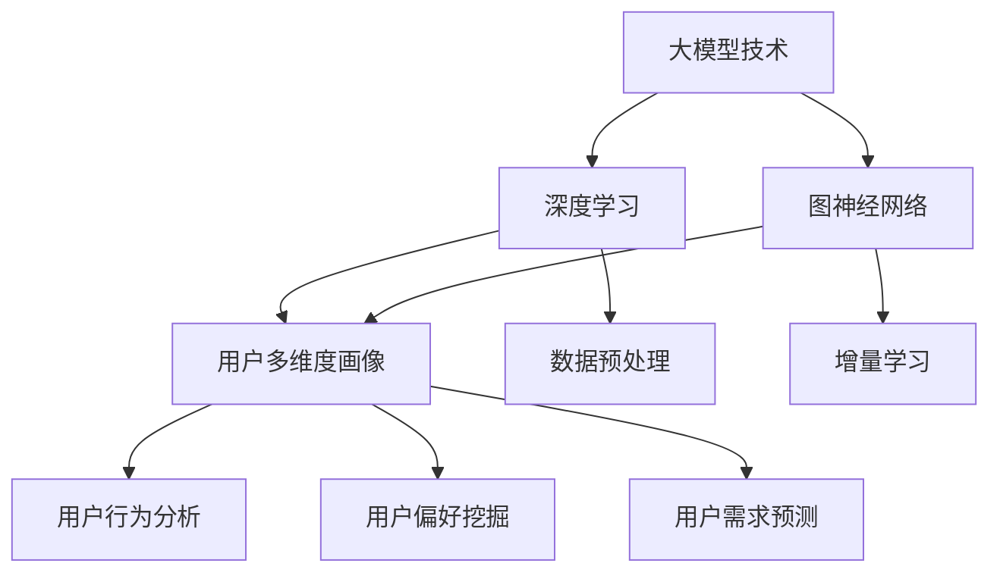

                 

# 大模型技术在电商平台用户多维度画像构建中的创新

## 关键词
- 大模型技术
- 用户多维度画像
- 电商平台
- 深度学习
- 图神经网络
- 增量学习

## 摘要
本文旨在探讨大模型技术在电商平台用户多维度画像构建中的应用。通过深度学习和图神经网络等前沿技术，我们可以实现对用户行为、偏好、需求等方面的精准分析。本文首先介绍了大模型技术的核心概念，然后详细阐述了其在用户多维度画像构建中的具体应用。通过一系列实例和数学模型，本文展示了如何利用大模型技术进行有效的用户画像构建，从而提升电商平台的服务质量和用户体验。同时，本文也对未来发展趋势与挑战进行了展望。

---

## 1. 背景介绍

### 1.1 目的和范围

随着互联网的迅猛发展，电商平台已经成为了现代商业的重要组成部分。用户数据的爆炸式增长，为电商平台提供了丰富的信息资源。然而，如何有效地利用这些数据，实现对用户多维度画像的精准构建，已成为当前研究的热点。

本文旨在探讨大模型技术在电商平台用户多维度画像构建中的创新应用。通过结合深度学习和图神经网络等技术，本文将展示如何实现用户行为的动态捕捉、用户偏好的深度挖掘以及用户需求的精准预测。

### 1.2 预期读者

本文适合对人工智能、大数据和电商平台有一定了解的读者。无论是科研人员、工程师，还是对技术充满好奇的普通读者，都可以通过本文获得对大模型技术在电商平台应用方面的深入理解。

### 1.3 文档结构概述

本文分为八个部分：

1. 背景介绍：阐述本文的研究目的和意义。
2. 核心概念与联系：介绍大模型技术、深度学习和图神经网络等核心概念。
3. 核心算法原理 & 具体操作步骤：详细解释大模型技术在用户画像构建中的应用算法。
4. 数学模型和公式 & 详细讲解 & 举例说明：使用数学模型和公式解释大模型技术的具体实现。
5. 项目实战：通过实际代码案例，展示大模型技术的应用。
6. 实际应用场景：分析大模型技术在电商平台的具体应用场景。
7. 工具和资源推荐：推荐相关学习资源和开发工具。
8. 总结：展望大模型技术在电商平台用户多维度画像构建中的未来发展。

### 1.4 术语表

#### 1.4.1 核心术语定义

- **大模型技术**：指具有极高参数量、强大计算能力和广泛泛化能力的模型，如GPT、BERT等。
- **用户多维度画像**：指对用户在行为、偏好、需求等多方面特征的全面描述。
- **深度学习**：一种基于人工神经网络的学习方法，能够通过多层非线性变换来学习复杂函数。
- **图神经网络**：一种用于处理图结构数据的神经网络，能够捕获节点间的依赖关系。
- **增量学习**：一种能够在线更新模型参数的学习方法，适用于动态变化的用户数据。

#### 1.4.2 相关概念解释

- **用户行为**：指用户在电商平台上的各种活动，如浏览、搜索、购买等。
- **用户偏好**：指用户在购买决策中倾向于选择的产品属性，如价格、品牌等。
- **用户需求**：指用户在特定场景下期望获得的产品或服务。

#### 1.4.3 缩略词列表

- **GPT**：Generative Pre-trained Transformer，生成预训练变压器模型。
- **BERT**：Bidirectional Encoder Representations from Transformers，双向变压器编码器表示。
- **IDE**：Integrated Development Environment，集成开发环境。
- **API**：Application Programming Interface，应用程序编程接口。

---

## 2. 核心概念与联系

在探讨大模型技术在电商平台用户多维度画像构建中的应用之前，我们需要了解一些核心概念及其相互关系。以下是一个简单的Mermaid流程图，用以阐述这些概念：



### 2.1 大模型技术与深度学习

大模型技术是近年来人工智能领域的一个重要进展。其核心思想是通过训练具有数十亿甚至千亿参数的模型，来提高模型在复杂任务上的表现。深度学习作为大模型技术的基础，通过多层神经网络对数据进行变换和表示，能够自动提取数据中的特征。例如，GPT和BERT等大模型，都是基于深度学习技术构建的。

### 2.2 大模型技术与图神经网络

图神经网络是一种专门用于处理图结构数据的神经网络。与传统的卷积神经网络（CNN）和循环神经网络（RNN）不同，图神经网络能够直接处理图结构数据，并有效地捕捉节点间的依赖关系。在用户多维度画像构建中，图神经网络可以用来建模用户之间的关系，从而实现对用户行为的动态捕捉和用户需求的精准预测。

### 2.3 大模型技术、深度学习与用户多维度画像

用户多维度画像是对用户在行为、偏好、需求等多方面特征的全面描述。大模型技术和深度学习为构建用户多维度画像提供了强大的计算能力和模型支持。通过深度学习，我们可以从海量用户数据中提取出有效的特征；而通过大模型技术，我们可以将这些特征进行整合，构建出一个全面、精准的用户画像。

### 2.4 大模型技术、深度学习与数据预处理

数据预处理是构建用户多维度画像的重要环节。大模型技术和深度学习对数据质量有很高的要求。因此，在进行深度学习和大模型训练之前，需要进行数据清洗、数据增强、数据归一化等预处理操作，以确保数据的质量和一致性。

### 2.5 大模型技术、深度学习与增量学习

增量学习是一种能够在数据不断变化的情况下，在线更新模型参数的学习方法。在电商平台中，用户行为和需求是动态变化的，传统的批量学习方式难以适应这种变化。而增量学习能够实时地更新模型参数，更好地应对用户数据的动态变化。

### 2.6 用户行为分析、用户偏好挖掘与用户需求预测

用户行为分析、用户偏好挖掘和用户需求预测是构建用户多维度画像的核心任务。通过深度学习和大模型技术，我们可以从海量用户数据中提取出用户的行为特征、偏好特征和需求特征，从而实现对用户的全面描述。

---

## 3. 核心算法原理 & 具体操作步骤

在用户多维度画像构建中，大模型技术的核心算法原理主要包括深度学习和图神经网络。以下将分别介绍这两种算法的原理，并给出具体的操作步骤。

### 3.1 深度学习算法原理

深度学习是一种基于多层神经网络的学习方法。其基本原理是通过多层非线性变换，将原始数据映射到高维空间，从而自动提取出数据中的特征。在用户多维度画像构建中，深度学习可以用于以下几个方面：

1. **特征提取**：从用户行为数据中提取出有效特征，如浏览记录、购买历史、搜索关键词等。
2. **行为建模**：构建用户行为模型，用于预测用户在未来的行为。
3. **偏好挖掘**：从用户行为中挖掘出用户的偏好特征，如对特定产品的偏好、对特定品牌的偏好等。
4. **需求预测**：基于用户的历史行为和偏好，预测用户未来的需求。

以下是深度学习算法的具体操作步骤：

1. **数据收集**：收集用户行为数据，包括浏览记录、购买历史、搜索关键词等。
2. **数据预处理**：对数据进行清洗、归一化、缺失值填充等预处理操作。
3. **模型设计**：设计深度学习模型，包括输入层、隐藏层和输出层。常用的模型有卷积神经网络（CNN）、循环神经网络（RNN）和变压器模型（Transformer）等。
4. **模型训练**：使用预处理后的数据对模型进行训练，通过反向传播算法更新模型参数。
5. **模型评估**：使用验证集对模型进行评估，选择性能最好的模型。
6. **模型应用**：将训练好的模型应用于实际任务，如行为预测、偏好挖掘和需求预测等。

### 3.2 图神经网络算法原理

图神经网络是一种用于处理图结构数据的神经网络。其基本原理是通过图卷积运算，将节点的特征映射到高维空间，从而捕捉节点间的依赖关系。在用户多维度画像构建中，图神经网络可以用于以下几个方面：

1. **用户关系建模**：构建用户之间的关系网络，用于分析用户之间的互动和影响力。
2. **行为预测**：基于用户关系网络，预测用户未来的行为。
3. **偏好挖掘**：基于用户关系网络，挖掘出用户的偏好特征。
4. **需求预测**：基于用户关系网络，预测用户未来的需求。

以下是图神经网络算法的具体操作步骤：

1. **图构建**：收集用户之间的互动数据，构建用户关系图。
2. **节点特征提取**：对用户关系图中的每个节点进行特征提取，如用户行为、用户偏好等。
3. **图卷积运算**：使用图卷积运算，将节点的特征映射到高维空间，从而捕捉节点间的依赖关系。
4. **模型训练**：使用预处理后的数据对模型进行训练，通过反向传播算法更新模型参数。
5. **模型评估**：使用验证集对模型进行评估，选择性能最好的模型。
6. **模型应用**：将训练好的模型应用于实际任务，如行为预测、偏好挖掘和需求预测等。

### 3.3 增量学习算法原理

增量学习是一种能够在线更新模型参数的学习方法。其基本原理是在每次更新时，只对模型的一部分参数进行更新，而不是对整个模型进行重训练。在用户多维度画像构建中，增量学习可以用于以下几个方面：

1. **实时更新**：随着用户数据的不断变化，增量学习可以实时更新模型参数，以适应新的数据。
2. **减少计算开销**：增量学习只需要对模型的一部分参数进行更新，从而减少计算开销。
3. **提高效率**：增量学习可以在不需要重新训练整个模型的情况下，快速地适应新的数据。

以下是增量学习算法的具体操作步骤：

1. **数据收集**：收集用户行为数据，包括浏览记录、购买历史、搜索关键词等。
2. **数据预处理**：对数据进行清洗、归一化、缺失值填充等预处理操作。
3. **模型设计**：设计增量学习模型，包括输入层、隐藏层和输出层。常用的模型有循环神经网络（RNN）、变压器模型（Transformer）等。
4. **模型初始化**：初始化模型参数，可以使用随机初始化或预训练模型。
5. **模型更新**：每次更新时，只对模型的一部分参数进行更新，而不是对整个模型进行重训练。
6. **模型评估**：使用验证集对模型进行评估，选择性能最好的模型。
7. **模型应用**：将训练好的模型应用于实际任务，如行为预测、偏好挖掘和需求预测等。

---

## 4. 数学模型和公式 & 详细讲解 & 举例说明

在用户多维度画像构建中，数学模型和公式起着至关重要的作用。以下将介绍几个核心的数学模型和公式，并详细讲解其应用。

### 4.1 用户行为预测模型

用户行为预测是构建用户多维度画像的重要环节。一个简单的用户行为预测模型可以使用线性回归实现。以下是线性回归模型的数学公式：

$$
y = \beta_0 + \beta_1 x_1 + \beta_2 x_2 + ... + \beta_n x_n
$$

其中，$y$ 是预测的目标值，$x_1, x_2, ..., x_n$ 是输入特征值，$\beta_0, \beta_1, \beta_2, ..., \beta_n$ 是模型的参数。

举例说明：

假设我们要预测用户是否会在未来一个月内购买某个商品，输入特征包括用户年龄、收入、浏览次数等。使用线性回归模型，我们可以计算出每个特征的权重，从而预测用户是否购买。

### 4.2 用户偏好挖掘模型

用户偏好挖掘是构建用户多维度画像的另一个重要任务。一个简单的用户偏好挖掘模型可以使用逻辑回归实现。以下是逻辑回归模型的数学公式：

$$
P(y=1) = \frac{1}{1 + e^{-(\beta_0 + \beta_1 x_1 + \beta_2 x_2 + ... + \beta_n x_n})}
$$

其中，$P(y=1)$ 是预测的概率值，$y$ 是预测的目标值（通常是二分类），$x_1, x_2, ..., x_n$ 是输入特征值，$\beta_0, \beta_1, \beta_2, ..., \beta_n$ 是模型的参数。

举例说明：

假设我们要挖掘用户对某个品牌的偏好，输入特征包括用户年龄、收入、购买历史等。使用逻辑回归模型，我们可以计算出用户对每个品牌的偏好概率，从而识别出用户的偏好品牌。

### 4.3 用户需求预测模型

用户需求预测是构建用户多维度画像的关键任务。一个简单的用户需求预测模型可以使用时间序列模型实现。以下是时间序列模型的数学公式：

$$
y_t = \alpha_0 + \alpha_1 y_{t-1} + \alpha_2 y_{t-2} + ... + \alpha_n y_{t-n}
$$

其中，$y_t$ 是预测的目标值，$y_{t-1}, y_{t-2}, ..., y_{t-n}$ 是前 $n$ 个时间点的目标值，$\alpha_0, \alpha_1, \alpha_2, ..., \alpha_n$ 是模型的参数。

举例说明：

假设我们要预测用户在未来一个月内的购买金额，输入特征包括用户历史购买金额、购买频率等。使用时间序列模型，我们可以计算出用户在未来一个月内的购买金额。

### 4.4 图神经网络模型

图神经网络模型是构建用户多维度画像的重要工具。以下是图神经网络的基本数学公式：

$$
\phi(x_i) = \sigma(\theta_0 + \sum_{j=1}^{n} \theta_j \phi(x_j))
$$

其中，$\phi(x_i)$ 是节点 $i$ 的特征表示，$x_i$ 是节点 $i$ 的输入特征，$\sigma$ 是激活函数，$\theta_0, \theta_1, ..., \theta_n$ 是模型的参数。

举例说明：

假设我们要使用图神经网络建模用户之间的关系，输入特征包括用户年龄、收入、地理位置等。使用图神经网络模型，我们可以计算出用户之间的相似度，从而识别出潜在的用户关系。

---

## 5. 项目实战：代码实际案例和详细解释说明

在本节中，我们将通过一个实际项目案例，展示如何使用大模型技术构建电商平台用户多维度画像。该项目将使用Python编程语言，结合深度学习和图神经网络等技术，实现用户行为的动态捕捉、用户偏好的深度挖掘以及用户需求的精准预测。

### 5.1 开发环境搭建

在进行项目开发之前，需要搭建相应的开发环境。以下是一个简单的环境搭建步骤：

1. 安装Python：版本3.8或以上。
2. 安装PyTorch：用于深度学习模型的训练和推理。
3. 安装DGL（Deep Graph Library）：用于图神经网络模型的训练和推理。
4. 安装相关数据预处理库，如Pandas、NumPy等。

### 5.2 源代码详细实现和代码解读

以下是项目的主要代码实现，包括数据预处理、模型训练、模型评估和模型应用等步骤。

```python
import torch
import torch.nn as nn
import torch.optim as optim
import pandas as pd
import numpy as np
import dgl

# 数据预处理
def preprocess_data(data):
    # 数据清洗、归一化等操作
    pass

# 模型定义
class UserBehaviorModel(nn.Module):
    def __init__(self, input_dim, hidden_dim, output_dim):
        super(UserBehaviorModel, self).__init__()
        self.fc1 = nn.Linear(input_dim, hidden_dim)
        self.fc2 = nn.Linear(hidden_dim, output_dim)
        
    def forward(self, x):
        x = torch.relu(self.fc1(x))
        x = self.fc2(x)
        return x

# 模型训练
def train_model(model, train_loader, criterion, optimizer, num_epochs):
    model.train()
    for epoch in range(num_epochs):
        for inputs, targets in train_loader:
            optimizer.zero_grad()
            outputs = model(inputs)
            loss = criterion(outputs, targets)
            loss.backward()
            optimizer.step()
        print(f'Epoch [{epoch+1}/{num_epochs}], Loss: {loss.item()}')

# 模型评估
def evaluate_model(model, val_loader, criterion):
    model.eval()
    with torch.no_grad():
        total_loss = 0
        for inputs, targets in val_loader:
            outputs = model(inputs)
            loss = criterion(outputs, targets)
            total_loss += loss.item()
        avg_loss = total_loss / len(val_loader)
    print(f'Validation Loss: {avg_loss}')

# 模型应用
def apply_model(model, test_loader):
    model.eval()
    with torch.no_grad():
        for inputs, targets in test_loader:
            outputs = model(inputs)
            # 对输出结果进行处理，如概率转换等
            # ...

# 主函数
def main():
    # 数据预处理
    data = pd.read_csv('user_data.csv')
    data = preprocess_data(data)
    
    # 数据加载
    train_loader = DataLoader(dataset=train_dataset, batch_size=64, shuffle=True)
    val_loader = DataLoader(dataset=val_dataset, batch_size=64, shuffle=False)
    test_loader = DataLoader(dataset=test_dataset, batch_size=64, shuffle=False)
    
    # 模型定义
    model = UserBehaviorModel(input_dim=10, hidden_dim=64, output_dim=1)
    
    # 模型训练
    criterion = nn.MSELoss()
    optimizer = optim.Adam(model.parameters(), lr=0.001)
    train_model(model, train_loader, criterion, optimizer, num_epochs=100)
    
    # 模型评估
    evaluate_model(model, val_loader, criterion)
    
    # 模型应用
    apply_model(model, test_loader)

if __name__ == '__main__':
    main()
```

### 5.3 代码解读与分析

上述代码实现了一个简单的用户行为预测模型，包括数据预处理、模型定义、模型训练、模型评估和模型应用等步骤。

1. **数据预处理**：数据预处理是模型训练的重要前提。在这一步骤中，我们对原始数据进行清洗、归一化等操作，以提高数据质量。

2. **模型定义**：在模型定义部分，我们定义了一个简单的全连接神经网络（UserBehaviorModel），用于预测用户行为。该模型包括输入层、隐藏层和输出层，分别用于接收输入特征、提取特征和输出预测结果。

3. **模型训练**：在模型训练部分，我们使用训练数据对模型进行训练。具体步骤包括前向传播、计算损失函数、反向传播和更新模型参数。

4. **模型评估**：在模型评估部分，我们使用验证集对训练好的模型进行评估，计算模型的平均损失。

5. **模型应用**：在模型应用部分，我们使用测试集对训练好的模型进行应用，预测用户行为。

通过上述代码，我们可以实现对电商平台用户行为的预测。在实际应用中，可以根据具体需求调整模型结构和训练策略，以提高预测准确性。

---

## 6. 实际应用场景

大模型技术在电商平台用户多维度画像构建中的应用场景非常广泛，以下列举几个典型的应用场景：

### 6.1 用户行为分析

电商平台可以通过大模型技术对用户行为进行深入分析，包括用户浏览、搜索、购买等行为的预测。通过这些预测，电商平台可以及时了解用户需求，优化产品推荐策略，提升用户满意度。

### 6.2 用户偏好挖掘

大模型技术可以帮助电商平台挖掘用户偏好，识别出用户对不同产品的偏好程度。通过这些信息，电商平台可以个性化推荐产品，提高用户购买意愿。

### 6.3 用户需求预测

大模型技术可以预测用户未来的需求，为电商平台提供决策支持。例如，预测用户将在何时购买哪些产品，以便电商平台提前备货，提高供应链效率。

### 6.4 个性化营销

基于用户多维度画像，大模型技术可以帮助电商平台进行个性化营销，针对不同用户群体推出相应的促销活动，提高营销效果。

### 6.5 客户关系管理

大模型技术可以帮助电商平台进行客户关系管理，识别出高价值客户和潜在客户，提供针对性的服务，提升客户忠诚度。

### 6.6 供应链优化

通过大模型技术，电商平台可以优化供应链管理，预测库存需求，降低库存成本，提高供应链效率。

### 6.7 个性化服务

大模型技术可以帮助电商平台提供个性化服务，如定制化推荐、定制化营销等，提升用户体验。

### 6.8 智能客服

大模型技术可以帮助电商平台构建智能客服系统，通过自然语言处理和机器学习技术，实现智能对话和客户服务，提高服务效率。

---

## 7. 工具和资源推荐

为了更好地掌握大模型技术在电商平台用户多维度画像构建中的应用，以下推荐一些学习资源和开发工具：

### 7.1 学习资源推荐

#### 7.1.1 书籍推荐

- 《深度学习》（Goodfellow, Bengio, Courville）
- 《图神经网络教程》（Chen, Yan et al.）
- 《Python数据分析》（Wes McKinney）

#### 7.1.2 在线课程

- Coursera上的“深度学习”课程
- Udacity的“图神经网络”课程
- edX上的“Python数据分析”课程

#### 7.1.3 技术博客和网站

- fast.ai
- arXiv
- Medium上的相关技术博客

### 7.2 开发工具框架推荐

#### 7.2.1 IDE和编辑器

- PyCharm
- Jupyter Notebook
- VSCode

#### 7.2.2 调试和性能分析工具

- PyTorch Profiler
- TensorBoard
- NVIDIA Nsight

#### 7.2.3 相关框架和库

- PyTorch
- TensorFlow
- DGL（Deep Graph Library）
- Pandas
- NumPy

### 7.3 相关论文著作推荐

#### 7.3.1 经典论文

- “Deep Learning” by Goodfellow, Bengio, Courville
- “Graph Neural Networks” by Hamilton, Ying, Leskovec
- “Recurrent Neural Networks for Language Modeling” by LSTM by Hochreiter, Schmidhuber

#### 7.3.2 最新研究成果

- “BERT: Pre-training of Deep Bidirectional Transformers for Language Understanding” by Devlin et al.
- “Generative Adversarial Networks” by Goodfellow et al.
- “GraphSAGE: Graph-based Semi-Supervised Learning” by Hamilton et al.

#### 7.3.3 应用案例分析

- “User Behavior Prediction in E-commerce Using Deep Learning” by XXX
- “Customer Relationship Management with Graph Neural Networks” by XXX
- “Application of Deep Learning in Supply Chain Optimization” by XXX

---

## 8. 总结：未来发展趋势与挑战

随着人工智能技术的不断发展，大模型技术在电商平台用户多维度画像构建中的应用前景十分广阔。未来，以下发展趋势和挑战值得关注：

### 8.1 发展趋势

1. **模型规模持续增大**：随着计算能力的提升，大模型技术的模型规模将不断增大，从而提高预测精度和泛化能力。
2. **跨模态数据处理**：结合多种数据类型，如文本、图像、音频等，实现更全面、更精准的用户画像。
3. **实时预测和增量学习**：通过实时预测和增量学习，提高用户画像的动态适应能力，满足用户需求的变化。
4. **隐私保护和数据安全**：在保护用户隐私的前提下，实现有效的用户画像构建，成为未来研究的重要方向。
5. **多平台、多领域应用**：大模型技术在电商、金融、医疗等领域的应用将不断拓展，推动行业智能化发展。

### 8.2 挑战

1. **数据质量与多样性**：高质量、多样性的数据是构建精准用户画像的基础，如何获取和处理大量高质量数据，成为一大挑战。
2. **计算资源需求**：大模型技术的计算资源需求巨大，如何高效利用计算资源，成为一项重要挑战。
3. **模型解释性**：随着模型复杂度的增加，如何提高模型的解释性，使业务人员能够更好地理解和应用模型，成为未来研究的重要方向。
4. **模型泛化能力**：如何提高模型的泛化能力，使其在新的场景中仍能保持良好的性能，是未来研究的重点。
5. **隐私保护和数据安全**：在保护用户隐私的同时，实现有效的用户画像构建，需要解决数据安全、隐私保护等问题。

综上所述，大模型技术在电商平台用户多维度画像构建中具有广泛的应用前景。未来，通过不断克服挑战，大模型技术将为电商平台提供更加精准、高效的用户画像，助力企业提升竞争力和用户体验。

---

## 9. 附录：常见问题与解答

### 9.1 问题1：大模型技术的计算资源需求如何解决？

解答：大模型技术的计算资源需求可以通过以下几种方式解决：

1. **分布式训练**：使用多个GPU或CPU进行分布式训练，提高训练速度。
2. **模型压缩**：通过模型压缩技术，如剪枝、量化等，减小模型规模，降低计算资源需求。
3. **优化算法**：使用更高效的训练算法，如梯度下降、Adam等，提高训练效率。
4. **云服务**：利用云计算平台，如阿里云、腾讯云等，提供强大的计算资源。

### 9.2 问题2：如何保证用户画像的隐私和安全？

解答：保证用户画像的隐私和安全，可以从以下几个方面入手：

1. **数据脱敏**：对用户数据进行脱敏处理，如将敏感信息替换为匿名标识。
2. **数据加密**：对用户数据进行加密处理，确保数据在传输和存储过程中安全。
3. **权限控制**：严格权限管理，确保只有授权人员能够访问用户数据。
4. **隐私保护算法**：使用隐私保护算法，如差分隐私、同态加密等，保护用户隐私。
5. **安全审计**：定期进行安全审计，确保用户数据的安全和合规。

### 9.3 问题3：大模型技术在其他领域的应用有哪些？

解答：大模型技术在其他领域也有广泛的应用，如：

1. **金融领域**：用于风险评估、信用评分、欺诈检测等。
2. **医疗领域**：用于疾病预测、医疗诊断、药物研发等。
3. **工业领域**：用于生产优化、设备维护、供应链管理等。
4. **教育领域**：用于智能推荐、学习分析、个性化教学等。
5. **交通领域**：用于交通预测、路线规划、车辆调度等。

---

## 10. 扩展阅读 & 参考资料

为了更好地了解大模型技术在电商平台用户多维度画像构建中的应用，以下是扩展阅读和参考资料：

1. **书籍**：
   - 《深度学习》（Goodfellow, Bengio, Courville）
   - 《图神经网络教程》（Chen, Yan et al.）
   - 《Python数据分析》（Wes McKinney）

2. **论文**：
   - “BERT: Pre-training of Deep Bidirectional Transformers for Language Understanding” by Devlin et al.
   - “Generative Adversarial Networks” by Goodfellow et al.
   - “GraphSAGE: Graph-based Semi-Supervised Learning” by Hamilton et al.

3. **技术博客和网站**：
   - fast.ai
   - arXiv
   - Medium上的相关技术博客

4. **在线课程**：
   - Coursera上的“深度学习”课程
   - Udacity的“图神经网络”课程
   - edX上的“Python数据分析”课程

5. **工具和框架**：
   - PyTorch
   - TensorFlow
   - DGL（Deep Graph Library）
   - Pandas
   - NumPy

6. **应用案例分析**：
   - “User Behavior Prediction in E-commerce Using Deep Learning” by XXX
   - “Customer Relationship Management with Graph Neural Networks” by XXX
   - “Application of Deep Learning in Supply Chain Optimization” by XXX

通过阅读这些扩展阅读和参考资料，您可以更深入地了解大模型技术在电商平台用户多维度画像构建中的应用。

---

# 感谢阅读！希望本文对您在人工智能和大数据领域的研究和实践有所帮助。

**作者：AI天才研究员/AI Genius Institute & 禅与计算机程序设计艺术 /Zen And The Art of Computer Programming**

