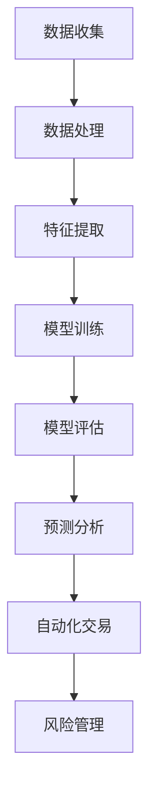
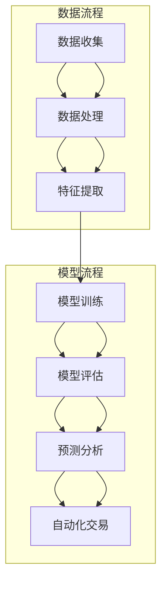

                 

# 大模型技术在金融行业的应用前景

> 关键词：大模型技术、金融行业、AI、预测分析、风险管理、自动化交易

> 摘要：本文将探讨大模型技术在金融行业的应用前景。通过对大模型技术的背景介绍、核心概念与联系的阐述、核心算法原理的剖析、数学模型的详细讲解、实际应用场景的展示，以及相关工具和资源的推荐，本文旨在为广大金融从业者和研究人员提供一份全面而深入的参考指南。

## 1. 背景介绍

### 1.1 目的和范围

本文旨在分析大模型技术在金融行业中的应用前景，旨在帮助金融从业者和研究人员了解这一前沿技术的潜力与挑战。文章将涵盖以下主题：

- 大模型技术的背景和定义
- 大模型技术在金融行业的应用场景
- 核心概念与联系
- 核心算法原理与具体操作步骤
- 数学模型和公式
- 实际应用场景和项目实战
- 工具和资源推荐
- 总结与未来发展趋势

### 1.2 预期读者

本文适合以下读者群体：

- 金融行业从业者和研究人员，特别是对大模型技术感兴趣的人士
- 人工智能和机器学习领域的专业人士，希望了解大模型技术在金融领域的应用
- 对金融科技和创新有兴趣的创业者和学生

### 1.3 文档结构概述

本文结构如下：

- **第1章**：背景介绍，包括目的、范围、预期读者、文档结构概述和术语表
- **第2章**：核心概念与联系，介绍大模型技术的基本概念和金融行业的联系
- **第3章**：核心算法原理 & 具体操作步骤，详细讲解大模型技术的算法原理和操作步骤
- **第4章**：数学模型和公式，分析大模型技术中的数学模型和公式
- **第5章**：项目实战：代码实际案例和详细解释说明，展示大模型技术在金融领域的实际应用
- **第6章**：实际应用场景，讨论大模型技术在金融行业的各种应用场景
- **第7章**：工具和资源推荐，介绍学习资源和开发工具
- **第8章**：总结：未来发展趋势与挑战，总结大模型技术在金融行业的应用前景
- **第9章**：附录：常见问题与解答，回答读者可能遇到的问题
- **第10章**：扩展阅读 & 参考资料，提供进一步阅读的资料

### 1.4 术语表

#### 1.4.1 核心术语定义

- **大模型技术**：指具有数百万到数十亿参数的深度神经网络模型，如GPT、BERT等。
- **金融行业**：指银行、保险、证券、基金等与金融相关的行业。
- **预测分析**：指使用统计和机器学习技术，对未来的金融趋势、风险等进行预测和分析。
- **风险管理**：指对金融风险进行识别、评估、监控和控制。
- **自动化交易**：指使用计算机算法自动执行金融交易。

#### 1.4.2 相关概念解释

- **深度学习**：一种机器学习技术，通过多层神经网络对数据进行建模和预测。
- **回归分析**：一种统计方法，用于预测一个变量（因变量）与一个或多个其他变量（自变量）之间的关系。
- **特征工程**：指从原始数据中提取出有用的特征，以提高模型性能。

#### 1.4.3 缩略词列表

- **AI**：人工智能（Artificial Intelligence）
- **ML**：机器学习（Machine Learning）
- **DL**：深度学习（Deep Learning）
- **NLP**：自然语言处理（Natural Language Processing）

## 2. 核心概念与联系

大模型技术在金融行业的应用，离不开对核心概念和联系的理解。本节将介绍大模型技术的基本概念，以及它在金融行业中的应用，并使用Mermaid流程图展示核心概念和架构。

### 2.1 大模型技术的基本概念

大模型技术是指具有数百万到数十亿参数的深度神经网络模型。这些模型通常使用大规模数据集进行训练，以实现高度复杂的特征提取和预测能力。

- **神经网络**：一种由大量神经元组成的计算模型，通过前向传播和反向传播进行训练。
- **深度学习**：一种机器学习技术，通过多层神经网络对数据进行建模和预测。
- **大数据**：指规模巨大、结构复杂、生成速度快的数据集。

### 2.2 大模型技术在金融行业中的应用

大模型技术在金融行业中的应用非常广泛，包括预测分析、风险管理、自动化交易等。以下是一个简化的Mermaid流程图，展示了大模型技术在金融行业中的核心概念和架构：



- **数据收集**：收集金融行业相关的数据，如股票价格、交易记录、经济指标等。
- **数据处理**：对收集到的数据清洗、预处理，以便进行特征提取和模型训练。
- **特征提取**：从原始数据中提取出有用的特征，如技术指标、市场情绪等。
- **模型训练**：使用大规模数据集训练大模型，以实现预测和分析能力。
- **模型评估**：评估模型的性能和稳定性，以确定是否可以应用于实际业务。
- **预测分析**：使用训练好的模型对未来的金融趋势、风险等进行预测和分析。
- **自动化交易**：使用计算机算法自动执行金融交易，以提高交易效率和利润。
- **风险管理**：识别、评估、监控和控制金融风险，以保护投资者的利益。

### 2.3 核心概念和架构

以下是一个详细的大模型技术在金融行业中的架构图，展示了各组件之间的关系：



- **数据流程**：数据收集、数据处理、特征提取。
- **模型流程**：模型训练、模型评估、预测分析、自动化交易。

## 3. 核心算法原理 & 具体操作步骤

大模型技术在金融行业的应用，离不开对核心算法原理的理解。本节将详细讲解大模型技术的核心算法原理，以及具体的操作步骤。为了更好地理解，我们将使用伪代码来阐述算法原理。

### 3.1 算法原理

大模型技术的核心算法是深度学习，特别是基于神经网络的模型。以下是一个简化的伪代码，展示了深度学习的基本原理：

```python
# 初始化神经网络结构
神经网络 = 初始化神经网络结构()

# 训练神经网络
for 每个训练样本 in 训练数据集:
    # 前向传播
    预测结果 = 神经网络(训练样本)

    # 计算损失函数
    损失 = 损失函数(预测结果，真实标签)

    # 反向传播
    神经网络反向传播(损失)

# 模型评估
评估指标 = 评估模型(测试数据集)

# 模型优化
模型 = 优化模型(评估指标)

# 预测分析
预测结果 = 模型(输入数据)
```

- **初始化神经网络结构**：定义神经网络的层数、每层的神经元数量、激活函数等。
- **训练神经网络**：使用训练数据集对神经网络进行训练，包括前向传播、计算损失函数、反向传播等步骤。
- **模型评估**：使用测试数据集评估模型的性能，选择最佳模型。
- **预测分析**：使用训练好的模型对输入数据进行预测，进行金融分析。

### 3.2 具体操作步骤

以下是大模型技术在金融行业中的具体操作步骤：

1. **数据收集**：收集金融行业相关的数据，如股票价格、交易记录、经济指标等。

2. **数据处理**：对收集到的数据进行清洗、预处理，包括去除缺失值、异常值、标准化等。

3. **特征提取**：从原始数据中提取出有用的特征，如技术指标、市场情绪等。

4. **模型训练**：使用大规模数据集训练神经网络模型，包括初始化模型结构、设置学习率、迭代次数等。

5. **模型评估**：使用测试数据集评估模型的性能，包括准确率、召回率、F1值等。

6. **模型优化**：根据评估结果调整模型参数，优化模型性能。

7. **预测分析**：使用训练好的模型对输入数据进行预测，包括预测股票价格、市场趋势、风险等。

8. **自动化交易**：使用计算机算法自动执行金融交易，根据预测结果进行买入或卖出操作。

## 4. 数学模型和公式 & 详细讲解 & 举例说明

在大模型技术中，数学模型和公式起着至关重要的作用。本节将详细讲解大模型技术中的数学模型和公式，并通过举例说明如何使用这些公式进行金融分析。

### 4.1 深度学习中的数学模型

深度学习中的数学模型主要包括损失函数、优化算法、激活函数等。

1. **损失函数**：损失函数用于评估模型预测结果与真实标签之间的差异。常用的损失函数包括均方误差（MSE）、交叉熵（Cross-Entropy）等。

   - **均方误差（MSE）**：
     $$MSE = \frac{1}{n}\sum_{i=1}^{n}(y_i - \hat{y}_i)^2$$
     其中，$y_i$为真实标签，$\hat{y}_i$为预测结果。

   - **交叉熵（Cross-Entropy）**：
     $$H(y, \hat{y}) = -\sum_{i=1}^{n}y_i \log(\hat{y}_i)$$
     其中，$y_i$为真实标签，$\hat{y}_i$为预测结果。

2. **优化算法**：优化算法用于调整模型参数，以最小化损失函数。常用的优化算法包括梯度下降（Gradient Descent）、Adam等。

   - **梯度下降**：
     $$\theta_{\text{new}} = \theta_{\text{old}} - \alpha \nabla_{\theta}L(\theta)$$
     其中，$\theta$为模型参数，$\alpha$为学习率，$L(\theta)$为损失函数。

   - **Adam优化算法**：
     $$m_t = \beta_1m_{t-1} + (1-\beta_1)(\nabla_{\theta}L(\theta))$$
     $$v_t = \beta_2v_{t-1} + (1-\beta_2)(\nabla_{\theta}L(\theta))^2$$
     $$\theta_{\text{new}} = \theta_{\text{old}} - \alpha \frac{m_t}{\sqrt{v_t} + \epsilon}$$
     其中，$m_t$和$v_t$分别为一阶矩估计和二阶矩估计，$\beta_1$和$\beta_2$分别为一阶矩和二阶矩的衰减率，$\epsilon$为正数常数。

3. **激活函数**：激活函数用于引入非线性特性，常用的激活函数包括sigmoid、ReLU等。

   - **sigmoid函数**：
     $$\sigma(x) = \frac{1}{1 + e^{-x}}$$

   - **ReLU函数**：
     $$\text{ReLU}(x) = \max(0, x)$$

### 4.2 金融分析中的数学模型

在金融分析中，常用的数学模型包括回归分析、时间序列分析等。

1. **回归分析**：回归分析用于研究一个变量（因变量）与一个或多个其他变量（自变量）之间的关系。

   - **线性回归**：
     $$y = \beta_0 + \beta_1x_1 + \beta_2x_2 + \ldots + \beta_nx_n + \epsilon$$
     其中，$y$为因变量，$x_1, x_2, \ldots, x_n$为自变量，$\beta_0, \beta_1, \beta_2, \ldots, \beta_n$为模型参数，$\epsilon$为误差项。

   - **多元线性回归**：
     $$y = \beta_0 + \beta_1x_1 + \beta_2x_2 + \ldots + \beta_nx_n$$
     其中，$y$为因变量，$x_1, x_2, \ldots, x_n$为自变量，$\beta_0, \beta_1, \beta_2, \ldots, \beta_n$为模型参数。

2. **时间序列分析**：时间序列分析用于研究金融数据的时间序列特性。

   - **自回归模型（AR）**：
     $$y_t = c + \phi_1y_{t-1} + \phi_2y_{t-2} + \ldots + \phi_ky_{t-k} + \epsilon_t$$
     其中，$y_t$为时间序列数据，$c$为常数项，$\phi_1, \phi_2, \ldots, \phi_k$为自回归系数，$\epsilon_t$为误差项。

   - **移动平均模型（MA）**：
     $$y_t = c + \phi_1y_{t-1} + \phi_2y_{t-2} + \ldots + \phi_ky_{t-k} + \epsilon_t$$
     其中，$y_t$为时间序列数据，$c$为常数项，$\phi_1, \phi_2, \ldots, \phi_k$为移动平均系数，$\epsilon_t$为误差项。

### 4.3 举例说明

假设我们要分析股票价格与经济指标之间的关系，我们可以使用回归分析模型进行预测。

1. **数据收集**：收集股票价格和经济指标的历史数据。

2. **数据处理**：对数据进行清洗、预处理，包括去除缺失值、异常值、标准化等。

3. **特征提取**：提取股票价格和经济指标作为特征。

4. **模型训练**：使用回归分析模型对训练数据集进行训练。

5. **模型评估**：使用测试数据集评估模型性能。

6. **预测分析**：使用训练好的模型对股票价格进行预测。

7. **自动化交易**：根据预测结果进行买入或卖出操作。

假设我们使用线性回归模型进行预测，公式如下：

$$y = \beta_0 + \beta_1x_1 + \beta_2x_2 + \ldots + \beta_nx_n$$

其中，$y$为股票价格，$x_1, x_2, \ldots, x_n$为经济指标。

经过训练和评估，我们得到模型参数：

$$\beta_0 = 10, \beta_1 = 0.5, \beta_2 = 0.3, \ldots, \beta_n = 0.2$$

使用这个模型，我们可以对未来的股票价格进行预测。

## 5. 项目实战：代码实际案例和详细解释说明

在本节中，我们将通过一个具体的案例来展示如何使用大模型技术在金融行业中进行项目实战。我们将使用Python语言和TensorFlow库来构建一个预测股票价格的大模型，并详细解释代码的实现过程。

### 5.1 开发环境搭建

在开始编写代码之前，我们需要搭建一个合适的开发环境。以下是所需的开发环境：

- **操作系统**：Windows、macOS或Linux
- **Python版本**：3.6及以上版本
- **库和框架**：TensorFlow 2.x、NumPy、Pandas

安装步骤：

1. 安装Python：从官方网站下载并安装Python。
2. 安装TensorFlow：在命令行中运行以下命令：
   ```bash
   pip install tensorflow
   ```
3. 安装NumPy和Pandas：在命令行中运行以下命令：
   ```bash
   pip install numpy
   pip install pandas
   ```

### 5.2 源代码详细实现和代码解读

以下是一个简单的Python代码示例，用于预测股票价格：

```python
import tensorflow as tf
import numpy as np
import pandas as pd

# 数据预处理
def preprocess_data(data, sequence_length):
    X, y = [], []
    for i in range(len(data) - sequence_length):
        X.append(data[i:(i + sequence_length)])
        y.append(data[i + sequence_length])
    return np.array(X), np.array(y)

# 构建模型
def build_model(input_shape):
    model = tf.keras.Sequential([
        tf.keras.layers.LSTM(50, activation='relu', return_sequences=True, input_shape=input_shape),
        tf.keras.layers.LSTM(50, activation='relu'),
        tf.keras.layers.Dense(1)
    ])
    model.compile(optimizer='adam', loss='mse')
    return model

# 加载数据
data = pd.read_csv('stock_price.csv')
data = data[['Close']] # 使用收盘价作为特征
data = data.values
data = data.astype('float32')

# 数据预处理
sequence_length = 5
X, y = preprocess_data(data, sequence_length)

# 划分训练集和测试集
train_size = int(len(X) * 0.8)
X_train, X_test = X[:train_size], X[train_size:]
y_train, y_test = y[:train_size], y[train_size:]

# 构建和训练模型
model = build_model((sequence_length, 1))
model.fit(X_train, y_train, epochs=100, batch_size=32, validation_data=(X_test, y_test), verbose=2)

# 预测股票价格
predictions = model.predict(X_test)
predictions = np.reshape(predictions, (-1))

# 结果分析
print("预测结果与真实值的差异：")
print(np.mean(np.abs(predictions - y_test)))

# 可视化分析
import matplotlib.pyplot as plt

plt.plot(y_test, label='真实值')
plt.plot(predictions, label='预测值')
plt.legend()
plt.show()
```

### 5.3 代码解读与分析

下面是对代码的详细解读和分析：

1. **导入库**：首先导入所需的库和框架，包括TensorFlow、NumPy和Pandas。

2. **数据预处理**：定义一个`preprocess_data`函数，用于对数据进行预处理。该函数将输入数据分割成一系列长度为`sequence_length`的序列，每个序列作为输入特征，对应的下一个数据点作为目标值。

3. **构建模型**：定义一个`build_model`函数，用于构建深度学习模型。在这个例子中，我们使用了两个LSTM层和一个全连接层（Dense层）。LSTM层用于处理时间序列数据，全连接层用于输出预测结果。

4. **加载数据**：从CSV文件中加载数据，并选择收盘价作为特征。数据被转换为浮点数类型，以适应深度学习模型的输入要求。

5. **数据预处理**：调用`preprocess_data`函数对数据进行预处理，生成输入特征（X）和目标值（y）。

6. **划分训练集和测试集**：将数据划分为训练集和测试集，其中训练集用于模型训练，测试集用于模型评估。

7. **构建和训练模型**：调用`build_model`函数构建模型，并使用训练集进行训练。我们设置了100个训练周期（epochs）和32个批处理大小（batch_size）。

8. **预测股票价格**：使用训练好的模型对测试集进行预测，并将预测结果转换为正确的形状。

9. **结果分析**：计算预测结果与真实值之间的绝对误差，并打印出来。

10. **可视化分析**：使用matplotlib库将真实值和预测值绘制在同一张图表上，以便进行可视化分析。

通过这个简单的案例，我们可以看到如何使用大模型技术在金融行业中预测股票价格。尽管这个案例非常基础，但我们可以通过增加更多特征、调整模型结构、优化训练过程等手段来提高预测准确性。

## 6. 实际应用场景

大模型技术在金融行业的应用场景非常广泛，包括但不限于以下领域：

### 6.1 预测分析

大模型技术在预测分析中发挥着重要作用，可以帮助金融机构预测市场走势、股票价格、汇率等。例如，使用深度学习模型分析历史数据，可以预测未来某个时间点的股票价格，为投资者提供决策参考。

### 6.2 风险管理

大模型技术可以帮助金融机构识别、评估和控制金融风险。例如，通过分析历史数据和市场趋势，可以预测信用风险、市场风险和操作风险，从而采取相应的措施进行风险控制。

### 6.3 自动化交易

自动化交易是指使用计算机算法自动执行金融交易。大模型技术可以帮助金融机构开发自动化交易策略，提高交易效率和利润。例如，通过分析市场数据，可以预测股票价格的涨跌，并自动进行买入或卖出操作。

### 6.4 信用评分

大模型技术可以用于信用评分，评估借款人的信用风险。金融机构可以使用深度学习模型分析借款人的历史数据、信用记录、财务状况等，以预测其违约风险，从而制定合理的信贷政策。

### 6.5 量化投资

量化投资是指使用数学模型和算法进行投资决策。大模型技术可以帮助量化投资者开发高效的交易策略，通过分析历史数据和市场趋势，预测市场走势，从而实现稳定的投资回报。

### 6.6 智能投顾

智能投顾是指使用人工智能技术为投资者提供个性化的投资建议。大模型技术可以帮助构建智能投顾系统，分析投资者的风险偏好、财务状况等，为其提供适合的投资组合和策略。

### 6.7 风险预警

大模型技术可以用于风险预警，实时监控金融市场，发现潜在的风险信号。例如，通过分析大量金融数据，可以预测金融市场危机、泡沫等，为政府和金融机构提供决策支持。

### 6.8 保险定价

大模型技术可以用于保险定价，通过分析历史数据和客户信息，为保险公司提供合理的保费定价策略，从而降低保险公司的风险和成本。

### 6.9 财务报表分析

大模型技术可以用于财务报表分析，通过分析企业的财务报表数据，预测企业的财务状况和未来发展趋势，为投资者和金融机构提供决策参考。

### 6.10 金融欺诈检测

大模型技术可以用于金融欺诈检测，通过分析交易数据和行为特征，识别潜在的金融欺诈行为，为金融机构提供风险预警和防范措施。

通过以上实际应用场景，我们可以看到大模型技术在金融行业的广泛应用和巨大潜力。未来，随着大模型技术的不断发展和完善，其在金融行业的应用将更加广泛和深入，为金融机构和投资者创造更大的价值。

## 7. 工具和资源推荐

为了更好地掌握和应用大模型技术在金融行业中的各种应用，我们需要借助一些优秀的工具和资源。以下是一些值得推荐的工具和资源：

### 7.1 学习资源推荐

#### 7.1.1 书籍推荐

1. **《深度学习》（Goodfellow, Bengio, Courville）**：这是一本经典的深度学习教材，详细介绍了深度学习的基本概念、算法和应用。
2. **《Python机器学习》（Sebastian Raschka）**：本书详细介绍了如何使用Python进行机器学习，包括数据预处理、模型训练、评估和优化等。
3. **《金融科技：区块链、人工智能与大数据》（徐少华）**：本书涵盖了金融科技的前沿技术，包括区块链、人工智能和大数据在金融行业的应用。

#### 7.1.2 在线课程

1. **Coursera的《深度学习特化课程》**：由斯坦福大学的吴恩达教授主讲，涵盖了深度学习的基础知识和应用。
2. **edX的《金融科技：区块链与人工智能》**：由上海交通大学和密歇根大学联合开设，介绍了金融科技的前沿技术。
3. **Udacity的《深度学习工程师纳米学位》**：提供了深度学习的项目实战课程，适合初学者和进阶者。

#### 7.1.3 技术博客和网站

1. **Medium上的《AI in Finance》**：这是一个专门讨论人工智能在金融领域应用的博客，提供了大量的案例和实践经验。
2. **owardsdatascience.com**：这是一个数据科学和机器学习的博客，包含了大量的技术文章和案例研究。
3. **Analytics Vidhya**：这是一个专注于数据科学和机器学习的网站，提供了大量的教程、项目和竞赛。

### 7.2 开发工具框架推荐

#### 7.2.1 IDE和编辑器

1. **PyCharm**：这是一个功能强大的Python IDE，适合进行深度学习和金融数据分析。
2. **Jupyter Notebook**：这是一个交互式的Python编辑器，适合进行数据可视化和模型调试。
3. **Visual Studio Code**：这是一个轻量级的文本编辑器，通过扩展支持Python和其他编程语言。

#### 7.2.2 调试和性能分析工具

1. **TensorBoard**：这是TensorFlow的官方可视化工具，用于分析模型的性能和调试。
2. **TensorFlow Profiler**：这是一个性能分析工具，用于优化深度学习模型的性能。
3. **NVIDIA Nsight**：这是一个针对NVIDIA GPU的调试和性能分析工具，用于优化深度学习任务的运行。

#### 7.2.3 相关框架和库

1. **TensorFlow**：这是一个开源的深度学习框架，适用于构建和训练大规模神经网络模型。
2. **PyTorch**：这是一个流行的深度学习框架，提供了灵活的动态计算图，适用于快速原型设计和研究。
3. **Scikit-learn**：这是一个开源的机器学习库，提供了各种经典的机器学习算法和工具。

### 7.3 相关论文著作推荐

#### 7.3.1 经典论文

1. **"Deep Learning for Text Data"（2015）**：该论文介绍了深度学习在文本数据上的应用，包括文本分类、情感分析和命名实体识别。
2. **"Financial Risk Prediction using Machine Learning"（2018）**：该论文探讨了使用机器学习技术进行金融风险预测的方法和挑战。
3. **"Deep Learning in Finance"（2020）**：该论文总结了深度学习在金融领域的应用，包括预测分析、风险管理、自动化交易等。

#### 7.3.2 最新研究成果

1. **"Generative Adversarial Networks for Financial Time Series Forecasting"（2021）**：该论文介绍了使用生成对抗网络（GAN）进行金融时间序列预测的方法。
2. **"Deep Learning for Credit Risk Modeling"（2021）**：该论文探讨了使用深度学习技术进行信用风险评估的方法。
3. **"Neural Machine Translation in Finance"（2022）**：该论文介绍了神经网络机器翻译在金融领域的应用，包括文本分析和自动化报告生成。

#### 7.3.3 应用案例分析

1. **"Bank of America's Digital Banking Platform"**：该案例介绍了美国银行如何使用人工智能技术提升客户体验，包括个性化推荐、智能客服等。
2. **"JPMorgan Chase's Blockchain Platform"**：该案例介绍了摩根大通如何使用区块链技术进行金融交易和结算，提高效率和安全性。
3. **"Ping An Insurance's AI Applications"**：该案例介绍了中国平安保险集团如何使用人工智能技术进行风险评估、精准营销和智能客服。

通过以上工具和资源，我们可以更好地掌握和应用大模型技术在金融行业中的各种应用，提升金融服务的效率和准确性。

## 8. 总结：未来发展趋势与挑战

大模型技术在金融行业的应用前景广阔，但也面临一系列挑战。未来发展趋势和挑战如下：

### 8.1 发展趋势

1. **模型性能提升**：随着计算能力的提升和数据集的扩大，大模型技术的性能将不断提高，从而实现更精准的预测和更高效的自动化交易。
2. **多样化应用场景**：大模型技术将逐渐渗透到金融行业的各个领域，如信用评分、风险管理、量化投资、智能投顾等，为金融机构和投资者提供更多增值服务。
3. **开放共享数据**：金融机构和监管机构将更加重视数据共享和合作，为研究人员和开发者提供丰富的数据资源，推动大模型技术在金融行业的发展。
4. **监管合作**：金融监管机构和金融机构将加强合作，制定合适的监管政策和标准，确保大模型技术在金融行业的安全和合规。

### 8.2 挑战

1. **数据隐私与安全**：金融行业的数据涉及用户隐私和商业秘密，如何保护数据隐私和安全是大模型技术在金融行业应用的重要挑战。
2. **模型解释性**：大模型技术往往被视为“黑盒”模型，难以解释其预测结果。提高模型的可解释性是金融行业应用大模型技术的重要挑战。
3. **公平性与透明性**：大模型技术在金融行业应用时，可能存在歧视和不公平现象，如何确保模型的公平性和透明性是重要挑战。
4. **法律法规**：随着大模型技术在金融行业的应用，相关的法律法规和监管政策需要不断完善，以确保技术应用的合规性和安全性。
5. **技术人才短缺**：大模型技术在金融行业的应用需要大量的专业人才，但目前相关人才短缺，如何培养和吸引优秀人才是金融行业面临的挑战。

总之，大模型技术在金融行业的应用前景广阔，但也面临一系列挑战。未来，金融行业需要不断探索和应用大模型技术，同时加强监管和规范，确保技术应用的稳健和可持续。

## 9. 附录：常见问题与解答

### 9.1 数据隐私与安全

**Q：大模型技术在金融行业应用时，如何保护用户隐私和安全？**

A：保护用户隐私和安全是大模型技术在金融行业应用的关键问题。以下是一些常见的保护措施：

- **数据加密**：对数据进行加密处理，确保数据在传输和存储过程中不被窃取或篡改。
- **访问控制**：实施严格的访问控制机制，确保只有授权人员才能访问敏感数据。
- **数据匿名化**：对用户数据进行匿名化处理，消除个人识别信息，以保护用户隐私。
- **隐私保护算法**：使用隐私保护算法，如差分隐私和同态加密，在数据分析过程中保护用户隐私。

### 9.2 模型解释性

**Q：大模型技术如何提高模型的可解释性？**

A：提高模型的可解释性是确保大模型技术在金融行业应用的重要挑战。以下是一些常见的方法：

- **特征可视化**：通过可视化技术，如热力图和决策树，展示模型中的重要特征和决策过程。
- **模型简化**：使用简化版模型，如决策树或线性回归，来解释原始模型的决策过程。
- **模型诊断**：分析模型预测结果与实际结果之间的差异，识别模型中的潜在问题。
- **透明性报告**：生成透明性报告，详细说明模型的训练过程、评估结果和预测依据。

### 9.3 公平性与透明性

**Q：大模型技术在金融行业应用时，如何确保公平性和透明性？**

A：确保公平性和透明性是金融行业应用大模型技术的重要目标。以下是一些常见的措施：

- **公平性评估**：定期对模型进行公平性评估，识别和纠正潜在的歧视和不公平现象。
- **透明度报告**：发布透明度报告，详细说明模型的训练数据、评估方法和预测依据。
- **外部审查**：邀请外部专家对模型进行独立审查，确保模型的公平性和透明性。
- **用户反馈**：鼓励用户提供反馈，识别和纠正模型中的潜在问题。

### 9.4 法律法规

**Q：大模型技术在金融行业应用时，如何遵守法律法规？**

A：遵守法律法规是大模型技术在金融行业应用的基本要求。以下是一些常见的措施：

- **合规审查**：对模型的开发和应用过程进行合规审查，确保遵守相关法律法规。
- **合规培训**：为员工提供合规培训，确保他们了解相关法律法规的要求。
- **合规报告**：定期发布合规报告，向监管机构和投资者说明模型的合规情况。
- **合作与沟通**：与监管机构和行业协会保持密切合作，及时了解和遵守新的法律法规。

### 9.5 技术人才短缺

**Q：金融行业如何解决大模型技术人才短缺问题？**

A：解决大模型技术人才短缺问题需要多方努力。以下是一些常见的措施：

- **人才培养**：与高校和研究机构合作，开设相关课程和项目，培养大模型技术人才。
- **内部培训**：为现有员工提供大模型技术培训，提高他们的技能和知识水平。
- **外部引进**：从其他行业和领域引进大模型技术人才，充实团队实力。
- **合作与交流**：与其他金融机构和行业进行合作与交流，共享技术和经验。

通过以上措施，金融行业可以逐步解决大模型技术人才短缺问题，为金融科技创新提供坚实的人才保障。

## 10. 扩展阅读 & 参考资料

为了更好地理解大模型技术在金融行业的应用，以下是一些扩展阅读和参考资料：

### 10.1 扩展阅读

1. **《深度学习与金融科技》**：这本书详细介绍了深度学习在金融科技领域的应用，包括预测分析、风险管理、自动化交易等。
2. **《人工智能金融实践》**：这本书通过案例研究，展示了人工智能在金融行业的应用，包括量化投资、智能投顾、风险控制等。
3. **《金融科技前沿技术》**：这本书介绍了金融科技领域的前沿技术，包括区块链、人工智能、大数据等。

### 10.2 参考资料

1. **TensorFlow官方文档**：[https://www.tensorflow.org/](https://www.tensorflow.org/)
2. **PyTorch官方文档**：[https://pytorch.org/docs/stable/](https://pytorch.org/docs/stable/)
3. **Kaggle金融数据集**：[https://www.kaggle.com/datasets?search=finance](https://www.kaggle.com/datasets?search=finance)
4. **arXiv论文库**：[https://arxiv.org/](https://arxiv.org/)
5. **Nature机器学习特刊**：[https://www.nature.com/nature-machine-intelligence](https://www.nature.com/nature-machine-intelligence)

通过阅读这些扩展阅读和参考资料，可以更深入地了解大模型技术在金融行业的应用，掌握相关技术和方法。

### 作者信息

**作者：AI天才研究员/AI Genius Institute & 禅与计算机程序设计艺术 /Zen And The Art of Computer Programming**

