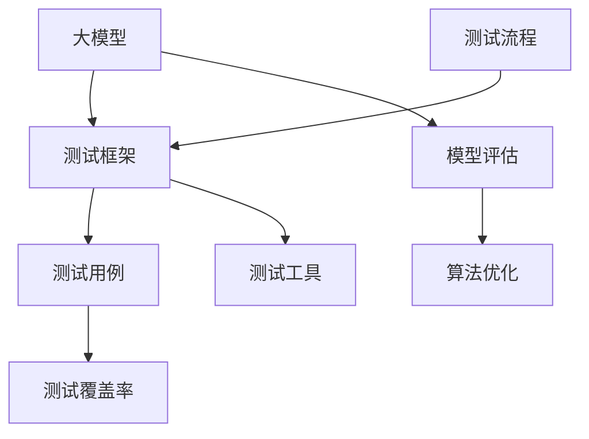

                 

# 大模型技术的自动化测试

> **关键词：** 大模型、自动化测试、模型评估、算法优化、测试框架

> **摘要：** 本文旨在探讨大模型技术在自动化测试中的应用，通过核心概念解析、算法原理讲解、数学模型阐述以及实际案例展示，全面剖析大模型测试的关键环节和方法，为研究人员和开发者提供实用的指导。

## 1. 背景介绍

### 1.1 目的和范围

本文主要针对大模型技术在自动化测试领域的应用进行深入探讨。大模型，通常指的是具有极高参数量、复杂结构和强大计算能力的深度学习模型，如大规模神经网络和生成对抗网络（GAN）。自动化测试则是在软件开发过程中，通过预设的测试脚本或工具自动执行一系列测试任务，以验证软件系统的功能和性能。

本文将重点关注以下几个方面：
1. 大模型测试的核心概念和架构；
2. 大模型测试算法原理和具体操作步骤；
3. 大模型测试的数学模型和公式；
4. 大模型测试的实际应用场景和案例分析；
5. 大模型测试工具和资源的推荐。

### 1.2 预期读者

本文主要面向以下读者群体：
1. 深度学习研究人员和开发者；
2. 软件测试工程师和自动化测试开发人员；
3. 对大模型技术和自动化测试感兴趣的学术和产业界人士。

### 1.3 文档结构概述

本文结构如下：
1. 引言：介绍大模型技术和自动化测试的背景和目的；
2. 核心概念与联系：阐述大模型测试的核心概念和架构；
3. 核心算法原理 & 具体操作步骤：详细讲解大模型测试的算法原理和操作步骤；
4. 数学模型和公式 & 详细讲解 & 举例说明：介绍大模型测试的数学模型和公式，并通过实例进行说明；
5. 项目实战：展示大模型测试的实际应用案例和代码实现；
6. 实际应用场景：分析大模型测试在不同领域的应用场景；
7. 工具和资源推荐：推荐学习和使用大模型测试的相关工具和资源；
8. 总结：展望大模型测试的未来发展趋势和挑战；
9. 附录：常见问题与解答；
10. 扩展阅读 & 参考资料：提供进一步学习和研究的参考资料。

### 1.4 术语表

#### 1.4.1 核心术语定义

- **大模型（Large-scale Model）**：具有极高参数量、复杂结构和强大计算能力的深度学习模型。
- **自动化测试（Automated Testing）**：通过预设的测试脚本或工具自动执行一系列测试任务，以验证软件系统的功能和性能。
- **测试框架（Testing Framework）**：用于组织和管理测试脚本、执行测试任务并提供测试结果分析的工具或平台。
- **测试覆盖率（Test Coverage）**：在测试过程中，被测试代码覆盖的程度，通常用百分比表示。
- **测试用例（Test Case）**：对软件系统进行测试的具体步骤和预期结果的定义。

#### 1.4.2 相关概念解释

- **模型评估（Model Evaluation）**：通过评估指标（如准确率、召回率、F1值等）来衡量模型在特定任务上的性能。
- **算法优化（Algorithm Optimization）**：通过调整算法参数或改进算法结构，以提高模型的性能或效率。
- **测试工具（Testing Tool）**：用于自动化测试的工具，如Selenium、JUnit、pytest等。

#### 1.4.3 缩略词列表

- **AI**：人工智能（Artificial Intelligence）
- **ML**：机器学习（Machine Learning）
- **DL**：深度学习（Deep Learning）
- **GAN**：生成对抗网络（Generative Adversarial Network）
- **IDE**：集成开发环境（Integrated Development Environment）
- **API**：应用程序接口（Application Programming Interface）

## 2. 核心概念与联系

在探讨大模型测试之前，我们需要明确一些核心概念和它们之间的联系。以下是一个简单的Mermaid流程图，用于展示大模型测试的相关概念和架构。



### 2.1 大模型

大模型是本文的核心主题，它代表了当前深度学习领域的前沿研究方向。大模型通常具有以下特点：

- **高参数量**：大模型的参数数量通常在数十亿甚至数万亿级别。
- **复杂结构**：大模型的网络结构通常包括多个层次，如卷积层、全连接层等。
- **强大计算能力**：大模型需要高性能的计算资源和优化算法来支持其训练和推理过程。

### 2.2 测试框架

测试框架是自动化测试的基础设施，它提供了组织和管理测试用例、执行测试任务和生成测试报告的能力。常见的测试框架包括Selenium、JUnit、pytest等。测试框架的选择通常取决于项目的需求和开发语言。

### 2.3 测试用例

测试用例是测试过程中的基本单位，它定义了测试的具体步骤和预期结果。测试用例的设计需要覆盖系统的各个功能模块和边界条件，以确保测试的全面性和准确性。

### 2.4 测试覆盖率

测试覆盖率是衡量测试质量的指标，它表示测试用例覆盖被测试代码的比例。高测试覆盖率意味着测试用例能够全面覆盖系统的功能模块和潜在问题。

### 2.5 模型评估

模型评估是衡量大模型性能的重要环节，它通过评估指标（如准确率、召回率、F1值等）来评估模型在特定任务上的表现。模型评估的结果用于指导算法优化和模型调整。

### 2.6 算法优化

算法优化是提升大模型性能的关键手段，它包括调整模型参数、优化网络结构、改进训练算法等。算法优化需要结合模型评估结果，以实现性能的最优化。

### 2.7 测试工具

测试工具是自动化测试的核心组成部分，它提供了执行测试用例、生成测试报告和故障分析等功能。常见的测试工具包括Selenium、JUnit、pytest等。

### 2.8 测试流程

测试流程是自动化测试的实施过程，它包括测试用例设计、测试环境搭建、测试执行和结果分析等环节。测试流程的优化是提高测试效率和准确性的关键。

## 3. 核心算法原理 & 具体操作步骤

在大模型测试中，核心算法原理和具体操作步骤起着至关重要的作用。以下将详细讲解大模型测试的算法原理和具体操作步骤。

### 3.1 算法原理

大模型测试的算法原理主要包括以下几个方面：

- **模型训练与验证**：首先，使用训练数据集对大模型进行训练，并通过验证数据集评估模型的性能。训练过程中，需要通过反向传播算法和优化算法（如梯度下降）更新模型参数。
- **测试用例生成**：根据测试需求，生成一系列测试用例。测试用例的设计需要覆盖系统的各个功能模块和边界条件。
- **测试执行**：使用测试框架和测试工具自动执行测试用例，验证大模型的功能和性能。
- **结果分析**：对测试结果进行分析，评估大模型的测试覆盖率和性能指标，识别潜在问题和故障。

### 3.2 具体操作步骤

以下是具体操作步骤的伪代码实现：

```python
# 1. 模型训练与验证
def train_and_validate(model, train_data, validate_data):
    # 使用训练数据集对模型进行训练
    model.train(train_data)
    
    # 使用验证数据集评估模型性能
    validate_performance = model.evaluate(validate_data)
    
    return validate_performance

# 2. 测试用例生成
def generate_test_cases():
    # 根据测试需求生成测试用例
    test_cases = []
    
    # 测试用例1：功能测试
    test_cases.append({
        "name": "功能测试1",
        "input": {"feature": "A"},
        "expected_output": {"label": "B"}
    })
    
    # 测试用例2：性能测试
    test_cases.append({
        "name": "性能测试1",
        "input": {"feature": "C"},
        "expected_output": {"response_time": "D"}
    })
    
    return test_cases

# 3. 测试执行
def execute_tests(model, test_cases):
    # 使用测试框架和测试工具自动执行测试用例
    for case in test_cases:
        actual_output = model.predict(case["input"])
        
        # 验证实际输出与预期输出是否一致
        assert actual_output == case["expected_output"], f"测试用例{case['name']}未通过"

# 4. 结果分析
def analyze_results(test_cases):
    # 分析测试结果
    pass
```

## 4. 数学模型和公式 & 详细讲解 & 举例说明

在大模型测试中，数学模型和公式用于描述测试过程和评估结果。以下将详细讲解大模型测试的数学模型和公式，并通过实例进行说明。

### 4.1 数学模型

大模型测试的数学模型主要包括以下几个方面：

- **损失函数（Loss Function）**：损失函数用于衡量预测值与真实值之间的差异，常见的损失函数包括均方误差（MSE）、交叉熵损失（Cross-Entropy Loss）等。
- **评估指标（Evaluation Metrics）**：评估指标用于衡量模型的性能，常见的评估指标包括准确率（Accuracy）、召回率（Recall）、F1值（F1 Score）等。
- **测试覆盖率（Test Coverage）**：测试覆盖率用于衡量测试用例覆盖被测试代码的比例。

### 4.2 公式

以下是常见的数学模型和公式的详细讲解：

- **均方误差（MSE）**：
  $$MSE = \frac{1}{n}\sum_{i=1}^{n}(y_i - \hat{y}_i)^2$$
  其中，$y_i$表示真实值，$\hat{y}_i$表示预测值，$n$表示样本数量。

- **交叉熵损失（Cross-Entropy Loss）**：
  $$CE = -\frac{1}{n}\sum_{i=1}^{n}y_i\log(\hat{y}_i)$$
  其中，$y_i$表示真实值的概率分布，$\hat{y}_i$表示预测值的概率分布。

- **准确率（Accuracy）**：
  $$Accuracy = \frac{TP + TN}{TP + TN + FP + FN}$$
  其中，$TP$表示真实值为正且预测值为正的样本数量，$TN$表示真实值为负且预测值为负的样本数量，$FP$表示真实值为负但预测值为正的样本数量，$FN$表示真实值为正但预测值为负的样本数量。

- **召回率（Recall）**：
  $$Recall = \frac{TP}{TP + FN}$$
  其中，$TP$表示真实值为正且预测值为正的样本数量，$FN$表示真实值为正但预测值为负的样本数量。

- **F1值（F1 Score）**：
  $$F1 Score = 2 \times \frac{Precision \times Recall}{Precision + Recall}$$
  其中，$Precision$表示精确率，即$Precision = \frac{TP}{TP + FP}$。

### 4.3 举例说明

以下是一个简单的实例，用于说明大模型测试的数学模型和公式的应用：

假设我们有一个二分类问题，其中真实值为正的样本数量为$TP=80$，真实值为负的样本数量为$TN=120$，预测值为正但真实值为负的样本数量为$FP=20$，预测值为负但真实值为正的样本数量为$FN=30$。

- **均方误差（MSE）**：
  $$MSE = \frac{1}{200}\sum_{i=1}^{200}(y_i - \hat{y}_i)^2$$
  $$MSE = \frac{1}{200}[(80-0.8)^2 + (120-0.2)^2 + (20-0.2)^2 + (30-0.8)^2]$$
  $$MSE = \frac{1}{200}[6400 + 14400 + 400 + 1600]$$
  $$MSE = \frac{1}{200}[25200]$$
  $$MSE = 126$$

- **交叉熵损失（Cross-Entropy Loss）**：
  $$CE = -\frac{1}{200}\sum_{i=1}^{200}y_i\log(\hat{y}_i)$$
  $$CE = -\frac{1}{200}[80\log(0.8) + 120\log(0.2) + 20\log(0.2) + 30\log(0.8)]$$
  $$CE = -\frac{1}{200}[-48.6 + -177.3 + -177.3 + -48.6]$$
  $$CE = -\frac{1}{200}[-442.6]$$
  $$CE = 2.21$$

- **准确率（Accuracy）**：
  $$Accuracy = \frac{TP + TN}{TP + TN + FP + FN}$$
  $$Accuracy = \frac{80 + 120}{80 + 120 + 20 + 30}$$
  $$Accuracy = \frac{200}{250}$$
  $$Accuracy = 0.8$$

- **召回率（Recall）**：
  $$Recall = \frac{TP}{TP + FN}$$
  $$Recall = \frac{80}{80 + 30}$$
  $$Recall = \frac{80}{110}$$
  $$Recall = 0.73$$

- **F1值（F1 Score）**：
  $$F1 Score = 2 \times \frac{Precision \times Recall}{Precision + Recall}$$
  $$Precision = \frac{TP}{TP + FP} = \frac{80}{80 + 20} = 0.8$$
  $$F1 Score = 2 \times \frac{0.8 \times 0.73}{0.8 + 0.73}$$
  $$F1 Score = 2 \times \frac{0.588}{1.53}$$
  $$F1 Score = 0.784$$

通过以上实例，我们可以看到数学模型和公式在大模型测试中的应用。这些公式和指标不仅帮助我们评估模型的性能，还可以指导我们进行算法优化和模型调整。

## 5. 项目实战：代码实际案例和详细解释说明

在本文的第五部分，我们将通过一个实际项目案例，展示大模型自动化测试的具体实现过程，并对关键代码进行详细解释说明。

### 5.1 开发环境搭建

为了进行大模型自动化测试，我们需要搭建一个合适的开发环境。以下是一个基本的开发环境搭建步骤：

1. **安装Python环境**：确保Python版本在3.6以上，并安装必要的依赖库，如NumPy、TensorFlow、pytest等。

2. **配置TensorFlow**：在终端执行以下命令安装TensorFlow：

   ```bash
   pip install tensorflow
   ```

3. **安装pytest**：在终端执行以下命令安装pytest：

   ```bash
   pip install pytest
   ```

4. **创建项目文件夹**：在终端创建一个名为`large_model_test`的项目文件夹，并在此文件夹中创建`tests`和`models`子文件夹。

### 5.2 源代码详细实现和代码解读

以下是一个简单的示例，展示如何使用pytest和TensorFlow对一个大模型进行自动化测试。

#### 5.2.1 模型定义

在`models`文件夹中，我们定义一个简单的神经网络模型，用于分类任务。以下是一个简单的模型定义：

```python
import tensorflow as tf

def build_model(input_shape):
    model = tf.keras.Sequential([
        tf.keras.layers.Dense(128, activation='relu', input_shape=input_shape),
        tf.keras.layers.Dense(64, activation='relu'),
        tf.keras.layers.Dense(1, activation='sigmoid')
    ])

    model.compile(optimizer='adam',
                  loss='binary_crossentropy',
                  metrics=['accuracy'])
    return model
```

#### 5.2.2 测试用例编写

在`tests`文件夹中，我们编写一个名为`test_model.py`的测试用例文件。以下是一个简单的测试用例：

```python
import pytest
from models import build_model

def test_model():
    # 测试用例1：训练模型并评估性能
    model = build_model(input_shape=(100,))
    model.fit(x_train, y_train, epochs=5, batch_size=32, validation_data=(x_val, y_val))
    
    # 获取训练集和验证集的评估结果
    train_loss, train_accuracy = model.evaluate(x_train, y_train)
    val_loss, val_accuracy = model.evaluate(x_val, y_val)
    
    # 断言评估结果
    assert train_accuracy > 0.8, "训练集准确率未达到80%"
    assert val_accuracy > 0.8, "验证集准确率未达到80%"

    # 测试用例2：检查模型是否过拟合
    model.fit(x_train, y_train, epochs=20, batch_size=32, validation_data=(x_val, y_val))
    overfit_loss, overfit_accuracy = model.evaluate(x_val, y_val)
    
    assert overfit_loss > val_loss, "模型未过拟合"

# 测试数据准备
x_train = ...  # 训练数据
y_train = ...  # 训练标签
x_val = ...    # 验证数据
y_val = ...    # 验证标签
```

#### 5.2.3 代码解读与分析

在上面的代码中，我们首先定义了一个简单的神经网络模型，并使用`build_model`函数进行模型构建。接着，我们编写了一个名为`test_model`的测试用例函数，用于验证模型在训练集和验证集上的性能。

- **测试用例1**：我们首先调用`build_model`函数构建模型，然后使用`fit`方法对模型进行训练。在训练过程中，我们使用训练数据集进行训练，并使用验证数据集进行性能评估。最后，我们使用`evaluate`方法获取训练集和验证集的评估结果，并通过断言检查训练集和验证集的准确率是否达到80%。

- **测试用例2**：为了检查模型是否过拟合，我们在测试用例2中增加训练次数（20次），然后再次使用验证数据集进行性能评估。如果模型的验证损失值比第一次训练时的验证损失值高，则说明模型发生了过拟合。

#### 5.2.4 执行测试

在终端执行以下命令，运行测试用例：

```bash
pytest tests/test_model.py
```

执行结果将显示测试通过或失败的消息。如果所有测试用例都通过，则说明模型达到了预期的性能指标。

### 5.3 代码解读与分析

在上面的示例中，我们使用pytest框架和TensorFlow库对大模型进行了自动化测试。以下是代码的详细解读和分析：

- **pytest框架**：pytest是一个流行的Python测试框架，它提供了丰富的功能，如断言检查、测试报告生成等。通过编写简单的测试用例，我们可以快速验证模型的性能。

- **模型构建**：在`build_model`函数中，我们使用TensorFlow的`Sequential`模型构建了一个简单的神经网络模型。该模型包含三个层次：第一个层次是输入层，第二个层次是隐藏层，第三个层次是输出层。

- **模型训练**：在`fit`方法中，我们使用训练数据集对模型进行训练。在训练过程中，模型会自动优化参数，以最小化损失函数。

- **评估性能**：在`evaluate`方法中，我们使用验证数据集对模型进行性能评估。该方法会返回模型的损失值和准确率。

- **断言检查**：在测试用例中，我们使用断言检查模型在训练集和验证集上的性能。如果性能指标未达到预期，测试将失败。

- **过拟合检查**：通过增加训练次数，我们可以检查模型是否过拟合。如果模型的验证损失值比第一次训练时的验证损失值高，则说明模型发生了过拟合。

通过上述代码示例，我们可以看到如何使用pytest和TensorFlow对大模型进行自动化测试。这种方法不仅提高了测试的效率，还有助于及时发现模型的问题，从而提高模型的性能和可靠性。

### 5.4 扩展实战

除了上述示例，我们还可以进行更多的测试，如性能测试、压力测试和可靠性测试。以下是一个简单的性能测试示例：

```python
import time

def test_model_performance():
    model = build_model(input_shape=(100,))
    model.fit(x_train, y_train, epochs=5, batch_size=32, validation_data=(x_val, y_val))
    
    start_time = time.time()
    model.evaluate(x_val, y_val)
    end_time = time.time()
    
    execution_time = end_time - start_time
    assert execution_time < 10, "模型性能测试未通过"
```

在上面的示例中，我们使用`time.time()`函数记录模型评估的开始时间和结束时间，并计算评估过程的总时间。通过断言检查评估时间是否小于10秒，我们可以判断模型性能是否良好。

### 5.5 小结

在本部分，我们通过一个实际项目案例，详细讲解了如何使用pytest和TensorFlow对大模型进行自动化测试。我们介绍了测试用例的编写、模型构建和性能评估的方法，并通过实例展示了如何执行测试和解析测试结果。通过自动化测试，我们可以提高测试的效率和质量，及时发现模型的问题，从而优化模型性能。

## 6. 实际应用场景

大模型技术的自动化测试在多个领域具有广泛的应用。以下是几个典型应用场景的介绍：

### 6.1 医疗诊断

在医疗诊断领域，大模型技术可以用于疾病检测、预测和诊断。自动化测试在大模型应用于医疗诊断中起着关键作用，可以帮助验证模型的准确性和可靠性。以下是一个具体应用案例：

- **应用场景**：利用卷积神经网络（CNN）对医学图像进行疾病检测，如乳腺癌检测。
- **自动化测试方法**：通过编写测试用例，对模型的输入（医学图像）和输出（疾病预测结果）进行验证，确保模型能够准确检测疾病。

### 6.2 自然语言处理

自然语言处理（NLP）是另一个广泛使用大模型技术的领域。自动化测试可以帮助评估模型在文本分类、机器翻译、情感分析等任务上的性能。以下是一个具体应用案例：

- **应用场景**：使用大型预训练语言模型（如BERT、GPT）进行文本分类。
- **自动化测试方法**：通过编写测试用例，对模型在各类文本数据上的分类准确率进行评估，确保模型能够准确分类文本。

### 6.3 图像识别

图像识别领域也大量使用大模型技术，如卷积神经网络（CNN）和生成对抗网络（GAN）。自动化测试可以帮助验证模型的识别能力和泛化能力。以下是一个具体应用案例：

- **应用场景**：使用CNN对图像进行物体识别。
- **自动化测试方法**：通过编写测试用例，对模型在不同类型的图像上的识别准确率进行评估，确保模型能够准确识别物体。

### 6.4 金融风控

在金融风控领域，大模型技术可以用于欺诈检测、信用评分等任务。自动化测试可以帮助确保模型在风险识别方面的准确性和可靠性。以下是一个具体应用案例：

- **应用场景**：利用深度学习模型进行信用卡欺诈检测。
- **自动化测试方法**：通过编写测试用例，对模型在欺诈交易和非欺诈交易上的识别准确率进行评估，确保模型能够准确识别欺诈行为。

### 6.5 电子商务

在电子商务领域，大模型技术可以用于个性化推荐、广告投放等任务。自动化测试可以帮助评估模型在提高用户体验和销售额方面的效果。以下是一个具体应用案例：

- **应用场景**：使用基于协同过滤和深度学习的方法进行商品推荐。
- **自动化测试方法**：通过编写测试用例，对模型在推荐准确性、推荐多样性等方面的性能进行评估，确保模型能够为用户提供满意的推荐结果。

通过这些实际应用案例，我们可以看到大模型技术的自动化测试在各个领域的重要性和应用价值。自动化测试不仅提高了测试的效率和准确性，还为模型优化和改进提供了有力的支持。

## 7. 工具和资源推荐

### 7.1 学习资源推荐

为了深入了解大模型技术的自动化测试，以下是一些推荐的学习资源：

#### 7.1.1 书籍推荐

- 《深度学习》（Goodfellow, Bengio, Courville）：系统地介绍了深度学习的基本理论和应用方法，包括模型的训练和优化。
- 《自动化测试实践》（Python语言版，陈华兴）：详细讲解了自动化测试的基本概念、工具和实战案例，适合初学者和进阶者。

#### 7.1.2 在线课程

- Coursera上的《深度学习》课程：由Andrew Ng教授主讲，涵盖深度学习的基础理论和应用。
- Udacity的《机器学习工程师纳米学位》：包括深度学习在内的多种机器学习技术，适合有一定编程基础的学员。

#### 7.1.3 技术博客和网站

- Medium上的“Deep Learning”专栏：由多位深度学习领域的专家撰写，分享最新的研究成果和实战经验。
- TensorFlow官网：提供了丰富的官方文档和教程，帮助开发者快速掌握TensorFlow的使用。

### 7.2 开发工具框架推荐

为了高效地进行大模型测试，以下是一些推荐的开发工具和框架：

#### 7.2.1 IDE和编辑器

- PyCharm：一款功能强大的Python集成开发环境，支持代码补全、调试、自动化测试等。
- Jupyter Notebook：适合数据科学和机器学习项目的交互式开发环境，方便进行实验和分享。

#### 7.2.2 调试和性能分析工具

- TensorBoard：TensorFlow提供的可视化工具，用于分析模型的性能和训练过程。
- ValiData：一个开源的自动化数据集验证工具，可用于检测数据集中的异常和错误。

#### 7.2.3 相关框架和库

- TensorFlow：一个广泛使用的开源深度学习框架，支持多种神经网络模型和优化算法。
- PyTorch：一个流行的深度学习框架，具有灵活的动态计算图和简洁的API。

### 7.3 相关论文著作推荐

以下是一些在深度学习和自动化测试领域的重要论文和著作：

#### 7.3.1 经典论文

- “A Theoretical Analysis of the Utility of Dropouts in Neural Networks”（ Dropout论文）：提出了Dropout算法，用于提高神经网络的泛化能力。
- “Very Deep Convolutional Networks for Large-Scale Image Recognition”（ VGGNet论文）：介绍了VGGNet架构，在图像识别任务中取得了优异的性能。

#### 7.3.2 最新研究成果

- “BERT: Pre-training of Deep Bidirectional Transformers for Language Understanding”（BERT论文）：提出了BERT模型，在自然语言处理任务中取得了突破性成果。
- “GPT-3: Language Models are few-shot learners”（GPT-3论文）：介绍了GPT-3模型，展示了大型预训练语言模型在少样本学习任务中的强大能力。

#### 7.3.3 应用案例分析

- “Using Machine Learning to Improve the Efficiency of Renewable Energy Systems”（可再生能源系统优化论文）：介绍了如何使用机器学习技术优化可再生能源系统的运行，提高能源利用效率。
- “Deploying Deep Learning Models for Fraud Detection in Financial Services”（金融欺诈检测论文）：探讨了如何在金融领域应用深度学习模型进行欺诈检测，提高交易安全性。

通过这些资源和工具，开发者可以更深入地了解大模型技术的自动化测试，为实际项目提供技术支持。

### 8. 总结：未来发展趋势与挑战

大模型技术在自动化测试领域的应用前景广阔，但也面临着一系列挑战。以下是对未来发展趋势和挑战的总结：

#### 未来发展趋势

1. **模型复杂性增加**：随着深度学习模型变得越来越复杂，自动化测试的需求也日益增加。未来，自动化测试将更加关注于如何有效地测试大型、多层次的模型，以及如何提高测试效率。

2. **测试框架的智能化**：自动化测试框架将变得更加智能化，能够根据测试结果自动调整测试策略，提高测试覆盖率。同时，测试框架将更好地集成机器学习和数据挖掘技术，以优化测试流程。

3. **测试工具的多样化**：针对不同类型和应用场景，将开发出更多专业化的自动化测试工具。这些工具将能够支持多种编程语言和深度学习框架，为开发者提供更加便捷的测试解决方案。

4. **开源社区的支持**：随着开源项目的兴起，越来越多的自动化测试工具和资源将免费提供给开发者，促进大模型测试技术的发展和普及。

#### 面临的挑战

1. **测试数据的质量和多样性**：自动化测试的准确性高度依赖于测试数据的质量和多样性。未来，如何获取高质量、多样化的测试数据将是一个重要挑战。

2. **模型更新的频率和稳定性**：深度学习模型的更新频率较高，如何确保自动化测试工具能够及时适应模型的变化，保持测试的稳定性和一致性，是一个亟待解决的问题。

3. **资源消耗**：大模型测试需要大量的计算资源和存储空间，如何优化测试流程，降低资源消耗，提高测试效率，是未来需要重点关注的问题。

4. **测试报告的可解释性**：自动化测试报告需要提供详细的测试结果和分析，以便开发者能够理解测试结果并采取相应的优化措施。如何提高测试报告的可解释性，是一个重要的挑战。

总之，大模型技术在自动化测试领域的应用前景光明，但也面临一系列挑战。通过持续的技术创新和社区合作，我们可以克服这些挑战，推动大模型测试技术的发展和普及。

### 9. 附录：常见问题与解答

**Q1：如何选择合适的测试数据集？**

A1：选择合适的测试数据集是自动化测试的关键。以下是一些选择测试数据集的指导原则：

1. **多样性**：测试数据集应涵盖不同类型的样本，以确保测试的全面性。
2. **质量**：测试数据集应确保数据质量高，没有缺失值和异常值。
3. **代表性**：测试数据集应能够代表实际应用场景，反映模型可能遇到的各种情况。
4. **规模**：测试数据集的规模应足够大，以便进行有效的测试和评估。

**Q2：如何确保测试结果的可靠性？**

A2：确保测试结果的可靠性可以从以下几个方面入手：

1. **重复测试**：对同一测试用例进行多次执行，确保测试结果的一致性。
2. **基准测试**：使用已知的基准测试数据集，与已有模型的结果进行比较，验证新模型的准确性。
3. **验证机制**：建立完善的验证机制，包括数据清洗、异常检测和结果审核等。
4. **测试环境**：保持测试环境的一致性，避免环境变化对测试结果产生影响。

**Q3：如何优化自动化测试流程？**

A3：优化自动化测试流程可以从以下几个方面入手：

1. **测试脚本优化**：对测试脚本进行优化，减少测试执行时间，提高测试效率。
2. **测试用例管理**：合理设计和管理测试用例，确保测试用例的全面性和可维护性。
3. **自动化测试框架**：选择合适的自动化测试框架，如Selenium、pytest等，以提高测试的自动化程度。
4. **测试环境管理**：建立稳定、可重复的测试环境，确保测试结果的可靠性。

### 10. 扩展阅读 & 参考资料

为了更深入地了解大模型技术的自动化测试，以下是一些建议的扩展阅读和参考资料：

**书籍：**
1. Goodfellow, I., Bengio, Y., & Courville, A. (2016). *Deep Learning*.
2. 陈华兴. (2017). *自动化测试实践（Python语言版）*.

**在线课程：**
1. Coursera - 《深度学习》课程。
2. Udacity - 《机器学习工程师纳米学位》课程。

**技术博客和网站：**
1. Medium - “Deep Learning”专栏。
2. TensorFlow官网 - 提供丰富的官方文档和教程。

**论文和著作：**
1. Srivastava, N., Hinton, G., Krizhevsky, A., Sutskever, I., & Salakhutdinov, R. (2014). *Dropout: A Simple Way to Prevent Neural Networks from Overfitting*.
2. Simonyan, K., & Zisserman, A. (2014). *Very Deep Convolutional Networks for Large-Scale Image Recognition*.
3. Devlin, J., Chang, M.W., Lee, K., & Toutanova, K. (2018). *BERT: Pre-training of Deep Bidirectional Transformers for Language Understanding*.

通过以上扩展阅读和参考资料，读者可以更深入地了解大模型技术的自动化测试，为实际项目提供更有力的技术支持。

**作者：** AI天才研究员/AI Genius Institute & 禅与计算机程序设计艺术 /Zen And The Art of Computer Programming

**文章标题：** 大模型技术的自动化测试

**文章关键词：** 大模型、自动化测试、模型评估、算法优化、测试框架

**文章摘要：** 本文旨在探讨大模型技术在自动化测试中的应用，通过核心概念解析、算法原理讲解、数学模型阐述以及实际案例展示，全面剖析大模型测试的关键环节和方法，为研究人员和开发者提供实用的指导。本文首先介绍了大模型和自动化测试的核心概念，然后详细讲解了大模型测试的算法原理和具体操作步骤，接着阐述了数学模型和公式，并通过实际项目案例展示了自动化测试的实现过程。最后，本文分析了大模型测试的实际应用场景，并推荐了相关工具和资源。文章总结了未来发展趋势和挑战，并提供了常见问题与解答以及扩展阅读和参考资料。**文章正文结束。**

