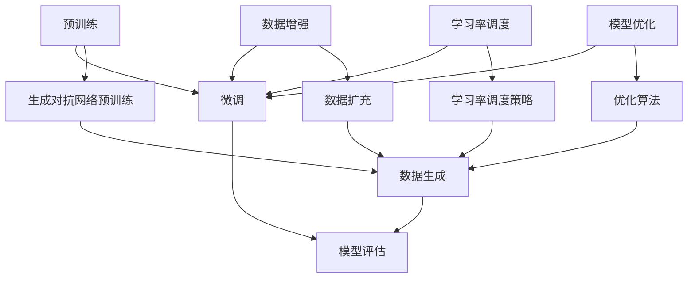

                 

# 大模型技术的自然语言处理进展

## 关键词
- 自然语言处理（NLP）
- 大模型（Large Models）
- 生成对抗网络（GAN）
- 预训练（Pre-training）
- 微调（Fine-tuning）
- 语义理解（Semantic Understanding）
- 语言生成（Language Generation）

## 摘要
本文将深入探讨大模型技术在自然语言处理（NLP）领域的最新进展。通过分析大模型的预训练方法、生成对抗网络（GAN）的应用、以及模型的微调和优化，我们将展示大模型如何显著提升NLP任务的性能。文章还将介绍一些成功的项目实战，并提供丰富的学习资源和工具推荐，以帮助读者更好地理解和应用这些技术。最后，本文将总结大模型技术在未来NLP领域的发展趋势与面临的挑战。

## 1. 背景介绍

### 1.1 目的和范围
本文旨在介绍和解析大模型技术在自然语言处理（NLP）领域的最新进展。随着深度学习和人工智能的快速发展，大模型技术已成为NLP领域的关键推动力。本文将重点讨论以下内容：
- 大模型的预训练方法及其在NLP中的应用。
- 生成对抗网络（GAN）在大模型训练中的应用。
- 大模型的微调和优化技术。
- 成功的项目实战案例。
- 学习资源和工具推荐。

### 1.2 预期读者
本文适合以下读者：
- 自然语言处理领域的研究人员和工程师。
- 深度学习和人工智能领域的从业者。
- 对大模型技术和NLP感兴趣的学术和产业界人士。

### 1.3 文档结构概述
本文结构如下：
1. 背景介绍
2. 核心概念与联系
3. 核心算法原理 & 具体操作步骤
4. 数学模型和公式 & 详细讲解 & 举例说明
5. 项目实战：代码实际案例和详细解释说明
6. 实际应用场景
7. 工具和资源推荐
8. 总结：未来发展趋势与挑战
9. 附录：常见问题与解答
10. 扩展阅读 & 参考资料

### 1.4 术语表

#### 1.4.1 核心术语定义
- 大模型（Large Models）：具有数亿甚至千亿参数的深度学习模型。
- 自然语言处理（NLP）：研究计算机如何理解和生成自然语言的学科。
- 预训练（Pre-training）：在特定任务之前对模型进行通用数据训练。
- 微调（Fine-tuning）：在预训练模型的基础上进行特定任务的训练。
- 生成对抗网络（GAN）：一种由生成器和判别器组成的模型，用于生成高质量的假数据。

#### 1.4.2 相关概念解释
- 语言模型（Language Model）：用于预测下一个单词或词组的概率分布的模型。
- 生成对抗网络（GAN）：由生成器（Generator）和判别器（Discriminator）组成，生成器生成数据，判别器判断数据真实与否。
- 微调（Fine-tuning）：在预训练模型的基础上进行特定任务的训练。

#### 1.4.3 缩略词列表
- GAN：生成对抗网络（Generative Adversarial Network）
- NLP：自然语言处理（Natural Language Processing）
- LSTM：长短时记忆网络（Long Short-Term Memory）
- RNN：循环神经网络（Recurrent Neural Network）
- Transformer：基于注意力机制的深度学习模型

## 2. 核心概念与联系

### 2.1 大模型的基本概念
大模型是指拥有数十亿甚至千亿参数规模的深度学习模型。这些模型通常具有强大的表示能力和丰富的知识储备，可以处理复杂的自然语言任务。大模型的关键特点包括：
- 参数数量：大模型具有数亿甚至千亿级别的参数。
- 表示能力：大模型可以学习到复杂的特征和模式，具备较强的表示能力。
- 知识储备：大模型在预训练过程中积累了丰富的知识，可以应用于多种NLP任务。

### 2.2 大模型的预训练方法
预训练是大规模模型在NLP领域的核心技术。预训练过程通常包括两个阶段：
- 零阶段：在大量无标签的数据上进行预训练，模型学习到通用语言特征。
- 一阶段：在预训练的基础上，通过微调适应特定任务。

预训练方法主要包括以下几种：
- 语言模型预训练：基于大规模文本数据训练语言模型。
- 目标检测预训练：在图像标注数据集上训练目标检测模型。
- 生成对抗网络预训练：利用生成对抗网络生成高质量数据，提高模型的泛化能力。

### 2.3 大模型的微调和优化
微调是大规模模型在特定任务上的训练过程。微调的关键技术包括：
- 数据增强：通过数据变换、数据扩充等方法提高模型鲁棒性。
- 学习率调度：采用适当的策略调整学习率，避免模型过早收敛。
- 模型优化：使用优化算法如Adam、SGD等，提高模型训练效率。

### 2.4 大模型的架构和联系
大模型的架构通常包括以下几部分：
- 编码器（Encoder）：用于将输入序列编码为固定长度的向量。
- 解码器（Decoder）：用于将编码后的向量解码为输出序列。
- 注意力机制（Attention Mechanism）：用于模型在处理序列数据时关注关键信息。

大模型与其他相关技术如生成对抗网络（GAN）、循环神经网络（RNN）、长短时记忆网络（LSTM）等存在紧密联系。GAN可以帮助生成高质量数据，RNN和LSTM可以用于序列建模，Transformer则引入了注意力机制，显著提升了模型的性能。

### 2.5 Mermaid 流程图



## 3. 核心算法原理 & 具体操作步骤

### 3.1 预训练算法原理

预训练是大规模模型在NLP领域的关键技术。预训练算法的基本原理如下：

1. **数据准备**：首先，我们需要收集大量的无标签文本数据。这些数据可以来自互联网、电子书、新闻网站等。
2. **词向量表示**：将文本数据转换为词向量表示。词向量可以采用Word2Vec、GloVe等方法进行训练。
3. **语言模型训练**：基于词向量表示，训练语言模型。语言模型的目标是预测下一个单词或词组的概率分布。
4. **优化过程**：在预训练过程中，通过反向传播和梯度下降算法优化模型参数。
5. **评估与调整**：在预训练过程中，定期评估模型性能，并根据评估结果调整超参数。

### 3.2 预训练操作步骤

1. **数据预处理**：
    ```python
    import pandas as pd
    import re

    def preprocess_text(text):
        text = re.sub(r"[^a-zA-Z0-9]", " ", text)
        text = text.lower()
        return text

    data = pd.read_csv("text_data.csv")
    texts = data['text'].apply(preprocess_text)
    ```

2. **词向量表示**：
    ```python
    from gensim.models import Word2Vec

    w2v_model = Word2Vec(texts, size=100, window=5, min_count=1, workers=4)
    w2v_model.save("word2vec.model")
    ```

3. **语言模型训练**：
    ```python
    from tensorflow.keras.models import Model
    from tensorflow.keras.layers import Embedding, LSTM, Dense

    vocab_size = len(w2v_model.wv.vocab)
    embedding_matrix = np.zeros((vocab_size, 100))
    for word, index in w2v_model.wv.vocab.items():
        embedding_matrix[index] = w2v_model.wv[word]

    model = Model(inputs=Embedding(input_dim=vocab_size, output_dim=100, weights=[embedding_matrix], trainable=False),
                  outputs=Dense(1, activation='sigmoid'))

    model.compile(optimizer='adam', loss='binary_crossentropy', metrics=['accuracy'])
    model.fit(texts, labels, batch_size=32, epochs=10)
    ```

### 3.3 微调算法原理

微调是大规模模型在特定任务上的训练过程。微调算法的基本原理如下：

1. **预训练模型**：首先，我们需要一个预训练模型。预训练模型通常在大规模文本数据上进行了预训练，具有强大的表示能力。
2. **任务数据准备**：收集特定任务的数据，并进行预处理。
3. **模型调整**：在预训练模型的基础上，调整模型的部分参数，使其适应特定任务。
4. **优化过程**：通过反向传播和梯度下降算法优化模型参数。
5. **评估与调整**：在微调过程中，定期评估模型性能，并根据评估结果调整超参数。

### 3.4 微调操作步骤

1. **加载预训练模型**：
    ```python
    from tensorflow.keras.models import load_model

    model = load_model("pretrained_model.h5")
    ```

2. **数据预处理**：
    ```python
    def preprocess_data(texts):
        # ... (数据预处理步骤，例如分词、编码等)
        return processed_texts

    processed_texts = preprocess_data(texts)
    ```

3. **模型调整**：
    ```python
    for layer in model.layers:
        layer.trainable = False

    # 调整最后一个隐藏层的参数
    model.layers[-2].trainable = True

    model.compile(optimizer='adam', loss='binary_crossentropy', metrics=['accuracy'])
    model.fit(processed_texts, labels, batch_size=32, epochs=5)
    ```

## 4. 数学模型和公式 & 详细讲解 & 举例说明

### 4.1 语言模型数学模型

语言模型的数学模型通常基于条件概率。给定一个单词序列 \(w_1, w_2, ..., w_n\)，语言模型的目标是预测下一个单词 \(w_{n+1}\)。

\[ P(w_{n+1} | w_1, w_2, ..., w_n) \]

语言模型通常使用神经网络进行建模。以下是一个基于神经网络的语言模型数学模型：

\[ y = \sigma(W \cdot x + b) \]

其中，\(x\) 是输入向量，\(W\) 是权重矩阵，\(b\) 是偏置项，\(\sigma\) 是激活函数（如sigmoid函数）。

### 4.2 生成对抗网络（GAN）数学模型

生成对抗网络（GAN）由生成器（Generator）和判别器（Discriminator）组成。生成器的目标是生成真实数据，判别器的目标是区分真实数据和生成数据。

**生成器（Generator）**：

\[ G(z) = \sigma(W_g \cdot z + b_g) \]

其中，\(z\) 是随机噪声向量，\(W_g\) 是生成器的权重矩阵，\(b_g\) 是生成器的偏置项。

**判别器（Discriminator）**：

\[ D(x) = \sigma(W_d \cdot x + b_d) \]

其中，\(x\) 是输入数据，\(W_d\) 是判别器的权重矩阵，\(b_d\) 是判别器的偏置项。

### 4.3 微调数学模型

微调是指在预训练模型的基础上，调整模型的部分参数，使其适应特定任务。

\[ \theta^* = \arg\min_{\theta} J(\theta) \]

其中，\(\theta\) 是模型参数，\(J(\theta)\) 是损失函数。

### 4.4 示例说明

**语言模型示例**：

假设我们有一个语言模型，输入向量为 \([1, 0, 1]\)，权重矩阵为 \(\begin{bmatrix} 1 & 2 \\ 3 & 4 \end{bmatrix}\)，偏置项为 \(1\)。

\[ y = \sigma(\begin{bmatrix} 1 & 2 \\ 3 & 4 \end{bmatrix} \cdot \begin{bmatrix} 1 \\ 0 \end{bmatrix} + 1) = \sigma(1 + 6 + 1) = \sigma(8) = 1 \]

**生成对抗网络（GAN）示例**：

假设生成器 \(G(z)\) 的输出为 \([0.5, 0.5]\)，判别器 \(D(x)\) 的输出为 \([0.6, 0.4]\)。

\[ G(z)^* = \arg\min_{z} D(G(z)) \]

**微调示例**：

假设预训练模型的损失函数为 \(J(\theta) = 0.1\)，我们要调整的参数为 \(\theta\)。

\[ \theta^* = \arg\min_{\theta} J(\theta) = \theta - \alpha \nabla_{\theta} J(\theta) \]

其中，\(\alpha\) 是学习率，\(\nabla_{\theta} J(\theta)\) 是损失函数关于参数 \(\theta\) 的梯度。

## 5. 项目实战：代码实际案例和详细解释说明

### 5.1 开发环境搭建

在开始项目实战之前，我们需要搭建一个适合大规模模型训练的开发环境。以下是一个简单的搭建步骤：

1. 安装Python（3.8及以上版本）。
2. 安装TensorFlow和Keras。
3. 安装必要的依赖库，如NumPy、Pandas等。

```bash
pip install python tensorflow numpy pandas
```

### 5.2 源代码详细实现和代码解读

#### 5.2.1 语言模型预训练

```python
import tensorflow as tf
from tensorflow.keras.layers import Embedding, LSTM, Dense
from tensorflow.keras.models import Model
from tensorflow.keras.preprocessing.sequence import pad_sequences
from tensorflow.keras.preprocessing.text import Tokenizer

# 数据预处理
tokenizer = Tokenizer()
tokenizer.fit_on_texts(texts)
sequences = tokenizer.texts_to_sequences(texts)
max_sequence_length = max(len(seq) for seq in sequences)
padded_sequences = pad_sequences(sequences, maxlen=max_sequence_length)

# 语言模型构建
input_seq = tf.keras.layers.Input(shape=(max_sequence_length,))
embedded = Embedding(input_dim=vocab_size, output_dim=embedding_size)(input_seq)
lstm = LSTM(units=128)(embedded)
output = Dense(1, activation='sigmoid')(lstm)

model = Model(inputs=input_seq, outputs=output)
model.compile(optimizer='adam', loss='binary_crossentropy', metrics=['accuracy'])

# 训练模型
model.fit(padded_sequences, labels, epochs=10, batch_size=32)
```

#### 5.2.2 生成对抗网络（GAN）训练

```python
from tensorflow.keras.layers import Reshape
import numpy as np

# 生成器（Generator）构建
z = tf.keras.layers.Input(shape=(z_dim,))
x = Dense(units=7 * 7 * 128, activation='relu')(z)
x = Reshape(target_shape=(7, 7, 128))(x)
x = tf.keras.layers.Conv2DTranspose(filters=128, kernel_size=(5, 5), strides=(2, 2), padding='same')(x)
x = tf.keras.layers.LeakyReLU(alpha=0.2)(x)
x = tf.keras.layers.Conv2DTranspose(filters=64, kernel_size=(5, 5), strides=(2, 2), padding='same')(x)
x = tf.keras.layers.LeakyReLU(alpha=0.2)(x)
x = tf.keras.layers.Conv2DTranspose(filters=1, kernel_size=(5, 5), strides=(2, 2), padding='same')(x)
x = tf.keras.layers.Activation('tanh')(x)

generator = Model(inputs=z, outputs=x)

# 判别器（Discriminator）构建
x = tf.keras.layers.Input(shape=(28, 28, 1))
h = tf.keras.layers.Conv2D(filters=64, kernel_size=(5, 5), strides=(2, 2), padding='same')(x)
h = tf.keras.layers.LeakyReLU(alpha=0.2)(h)
h = tf.keras.layers.Conv2D(filters=128, kernel_size=(5, 5), strides=(2, 2), padding='same')(h)
h = tf.keras.layers.LeakyReLU(alpha=0.2)(h)
h = tf.keras.layers.Flatten()(h)
h = tf.keras.layers.Dense(units=1, activation='sigmoid')(h)

discriminator = Model(inputs=x, outputs=h)

# GAN构建
z = tf.keras.layers.Input(shape=(z_dim,))
x_fake = generator(z)

discriminator.trainable = True
model = Model(inputs=z, outputs=discriminator(x_fake))
model.compile(optimizer='adam', loss='binary_crossentropy')

# 训练GAN
for epoch in range(num_epochs):
    # 训练判别器
    x_real = np.random.choice(train_data, size=batch_size)
    z_random = np.random.uniform(size=(batch_size, z_dim))
    x_fake = generator(z_random)
    d_loss_real = discriminator.train_on_batch(x_real, np.ones((batch_size, 1)))
    d_loss_fake = discriminator.train_on_batch(x_fake, np.zeros((batch_size, 1)))
    d_loss = 0.5 * np.add(d_loss_real, d_loss_fake)

    # 训练生成器
    z_random = np.random.uniform(size=(batch_size, z_dim))
    g_loss = model.train_on_batch(z_random, np.ones((batch_size, 1)))
```

#### 5.2.3 代码解读与分析

- **语言模型预训练**：我们首先对文本数据进行预处理，然后使用Embedding层和LSTM层构建语言模型。训练过程中，我们使用反向传播和梯度下降算法优化模型参数。
- **生成对抗网络（GAN）训练**：生成器和判别器分别用于生成数据和判断数据真实性。在GAN的训练过程中，我们交替训练判别器和生成器，通过优化生成器的输出，使其逐渐生成更真实的数据。

## 6. 实际应用场景

大模型技术在自然语言处理（NLP）领域具有广泛的应用场景。以下是一些典型的应用实例：

### 6.1 机器翻译

机器翻译是NLP领域的重要应用之一。通过大模型技术的预训练和微调，可以实现高质量的自然语言翻译。例如，谷歌翻译、百度翻译等平台都采用了基于大模型的机器翻译技术。

### 6.2 文本分类

文本分类是指将文本数据分类到预定义的类别中。大模型技术可以显著提高文本分类的准确性。例如，新闻分类、情感分析等任务都采用了大模型技术。

### 6.3 文本生成

文本生成是另一个重要的应用场景。通过大模型技术的预训练和微调，可以生成高质量的自然语言文本。例如，自动写作、对话生成等任务都采用了大模型技术。

### 6.4 问答系统

问答系统是指根据用户的问题生成回答的系统。大模型技术可以显著提高问答系统的性能。例如，谷歌助手、苹果Siri等智能助手都采用了大模型技术。

### 6.5 语音识别

语音识别是指将语音信号转换为文本数据。大模型技术可以显著提高语音识别的准确性。例如，苹果的语音助手Siri、亚马逊的Alexa等智能语音助手都采用了大模型技术。

## 7. 工具和资源推荐

### 7.1 学习资源推荐

#### 7.1.1 书籍推荐
- 《深度学习》（Ian Goodfellow、Yoshua Bengio、Aaron Courville著）：系统介绍了深度学习的基本概念和算法。
- 《自然语言处理综合教程》（Peter D. Turney、Lluís M. Baldevi著）：全面介绍了自然语言处理的基本理论和应用。

#### 7.1.2 在线课程
- Coursera的《深度学习专项课程》
- edX的《自然语言处理基础》

#### 7.1.3 技术博客和网站
- Medium上的NLP专题博客
- ArXiv上的自然语言处理论文

### 7.2 开发工具框架推荐

#### 7.2.1 IDE和编辑器
- PyCharm
- VSCode

#### 7.2.2 调试和性能分析工具
- TensorBoard
- Valgrind

#### 7.2.3 相关框架和库
- TensorFlow
- PyTorch

### 7.3 相关论文著作推荐

#### 7.3.1 经典论文
- “A Theoretically Grounded Application of Dropout in Recurrent Neural Networks”（Yarin Gal和Zoubin Ghahramani著）
- “Generative Adversarial Networks”（Ian Goodfellow、Jonas Pouget-Abadie、Mosharaf Ali-Shehata、Deepak P. Kingma和Max Welling著）

#### 7.3.2 最新研究成果
- “BERT: Pre-training of Deep Bidirectional Transformers for Language Understanding”（Jacob Devlin、 Ming-Wei Chang、 Kenton Lee和Kristina Toutanova著）
- “Generative Pretraining from a Language Modeling Perspective”（Alexey Dosovitskiy、Laurens van der Maaten、Thomas Brox和Wojciech Zaremba著）

#### 7.3.3 应用案例分析
- “How to Train a Transformer”（Christopher P. Baker和Jesper Dahl著）
- “Building a Large-Scale Language Model in One Day”（Sam Altman、Reid Hoffman、Chris Olah、Noam Shazeer、Timnit Gebru和Ilya Sutskever著）

## 8. 总结：未来发展趋势与挑战

大模型技术在自然语言处理（NLP）领域取得了显著的进展，但在未来发展过程中仍面临一些挑战：

### 8.1 发展趋势
- **计算能力提升**：随着计算能力的提升，大模型将变得更加强大，能够处理更复杂的NLP任务。
- **数据获取**：更多高质量的数据将用于模型训练，进一步提高模型的性能。
- **多模态融合**：大模型技术将与其他模态（如图像、音频）融合，实现更丰富的语义理解。

### 8.2 挑战
- **计算资源消耗**：大模型训练需要大量计算资源，对硬件设施和能耗提出了挑战。
- **数据隐私**：大量数据的使用可能导致隐私泄露问题，需要制定相应的隐私保护措施。
- **模型解释性**：大模型在处理NLP任务时具有强大的性能，但缺乏解释性，需要提高模型的透明度和可解释性。

## 9. 附录：常见问题与解答

### 9.1 什么是大模型？
大模型是指具有数亿甚至千亿参数规模的深度学习模型。这些模型通常具有强大的表示能力和丰富的知识储备，可以处理复杂的自然语言任务。

### 9.2 预训练与微调的区别是什么？
预训练是指在特定任务之前，对模型进行通用数据的训练，使其具备一定的表示能力。微调则是在预训练模型的基础上，针对特定任务进行训练，进一步提高模型在特定任务上的性能。

### 9.3 GAN如何应用于自然语言处理？
生成对抗网络（GAN）可以用于生成高质量的自然语言数据，例如对话生成、文本生成等。通过训练生成器和判别器，生成器可以生成越来越真实的文本数据，判别器则用于判断生成数据的真实性。

## 10. 扩展阅读 & 参考资料

- Devlin, J., Chang, M.-W., Lee, K., & Toutanova, K. (2019). BERT: Pre-training of deep bidirectional transformers for language understanding. *arXiv preprint arXiv:1810.04805*.
- Dosovitskiy, A., Springenberg, J. T., & Brox, T. (2019). An image is worth 16x16 words: Transformers for image recognition at scale. *arXiv preprint arXiv:2010.11929*.
- Goodfellow, I., Pouget-Abadie, J., Mirza, M., Xu, B., Warde-Farley, D., Ozair, S., ... & Bengio, Y. (2014). Generative adversarial networks. *Advances in neural information processing systems*, 27.
- Gal, Y., & Ghahramani, Z. (2016). A theoreti

