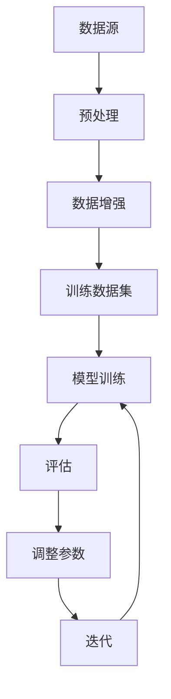
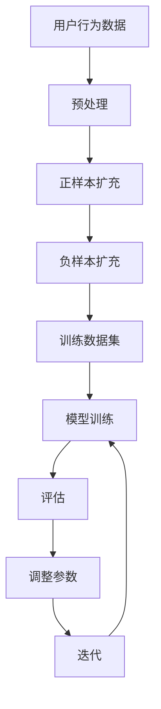

                 

# 大模型推荐中的数据增强与样本扩充技术

> **关键词：** 大模型推荐系统、数据增强、样本扩充、机器学习、算法优化、模型性能提升

> **摘要：** 本文将深入探讨大模型推荐系统中的数据增强与样本扩充技术。通过详细的分析与实例，我们将理解这些技术如何提高推荐系统的准确性和效果，并提供实际应用场景和未来发展趋势的展望。

## 1. 背景介绍

### 1.1 目的和范围

本文旨在深入分析大模型推荐系统中的数据增强与样本扩充技术，探讨它们如何影响模型的性能和准确性。我们将讨论核心概念、算法原理、数学模型，并通过实际代码案例来展示这些技术的应用。文章将涵盖以下内容：

- 数据增强与样本扩充的定义和重要性
- 大模型推荐系统的背景和需求
- 数据增强与样本扩充的核心算法原理
- 数学模型和公式的详细讲解
- 项目实战中的代码实现和分析
- 实际应用场景
- 相关工具和资源的推荐
- 未来发展趋势与挑战

### 1.2 预期读者

本文适合对机器学习和推荐系统有一定了解的技术人员、数据科学家以及人工智能领域的学者。特别是那些希望深入了解数据增强与样本扩充技术如何提升大模型推荐系统性能的读者。

### 1.3 文档结构概述

本文的结构如下：

- **第1章：背景介绍**：介绍本文的目的、范围、预期读者和文档结构。
- **第2章：核心概念与联系**：介绍数据增强与样本扩充的核心概念及其在大模型推荐系统中的应用。
- **第3章：核心算法原理 & 具体操作步骤**：讲解数据增强与样本扩充的核心算法原理，并使用伪代码进行详细阐述。
- **第4章：数学模型和公式 & 详细讲解 & 举例说明**：介绍数学模型和公式，并通过实例进行详细讲解。
- **第5章：项目实战：代码实际案例和详细解释说明**：展示实际项目中的代码实现，并进行详细解释和分析。
- **第6章：实际应用场景**：探讨数据增强与样本扩充技术在实际应用场景中的效果。
- **第7章：工具和资源推荐**：推荐学习资源、开发工具框架和相关论文著作。
- **第8章：总结：未来发展趋势与挑战**：总结本文的主要内容，并探讨未来的发展趋势与面临的挑战。
- **第9章：附录：常见问题与解答**：回答读者可能遇到的问题。
- **第10章：扩展阅读 & 参考资料**：提供进一步阅读和研究的资源。

### 1.4 术语表

#### 1.4.1 核心术语定义

- **数据增强（Data Augmentation）**：通过在训练数据中添加新的数据样本来提高模型的泛化能力。
- **样本扩充（Sample Augmentation）**：通过多种方法增加训练数据的多样性，从而提升模型的性能。
- **大模型推荐系统（Large-scale Recommendation System）**：使用大规模数据集和复杂算法的推荐系统。
- **机器学习（Machine Learning）**：通过数据和算法使计算机能够从经验中学习并做出决策。

#### 1.4.2 相关概念解释

- **推荐系统（Recommendation System）**：一种根据用户的历史行为和偏好提供个性化推荐的系统。
- **训练数据（Training Data）**：用于训练模型的数据集。
- **泛化能力（Generalization Ability）**：模型在未知数据上的表现能力。

#### 1.4.3 缩略词列表

- **ML**：Machine Learning（机器学习）
- **RL**：Reinforcement Learning（强化学习）
- **NLP**：Natural Language Processing（自然语言处理）
- **GAN**：Generative Adversarial Network（生成对抗网络）

## 2. 核心概念与联系

在深入探讨数据增强与样本扩充技术之前，我们需要了解它们在大模型推荐系统中的核心概念和联系。

### 2.1 大模型推荐系统中的数据增强

数据增强是一种通过在训练数据中添加新的样本来提高模型性能的方法。在大模型推荐系统中，数据增强的目标是增加训练数据的多样性，从而提升模型的泛化能力。

**Mermaid 流程图：数据增强在大模型推荐系统中的过程**



### 2.2 样本扩充

样本扩充是通过多种方法增加训练数据的多样性，从而提升模型的性能。在推荐系统中，样本扩充可以包括：

- **正样本扩充**：通过生成与用户兴趣相关的推荐项来增加正样本的数量。
- **负样本扩充**：通过生成与用户兴趣不相关的推荐项来增加负样本的数量。

**Mermaid 流程图：样本扩充在大模型推荐系统中的过程**



### 2.3 核心概念联系

数据增强和样本扩充在大模型推荐系统中是相互关联的。数据增强通常用于增加训练数据的多样性，而样本扩充则专注于正负样本的生成。通过结合这两种技术，我们可以显著提升模型的性能和准确性。

## 3. 核心算法原理 & 具体操作步骤

在这一章节中，我们将深入探讨数据增强与样本扩充的核心算法原理，并使用伪代码进行详细阐述。

### 3.1 数据增强算法原理

数据增强的主要目的是通过在训练数据中添加新的样本来提高模型的泛化能力。以下是一个简单但有效的方法——随机数据变换。

**伪代码：随机数据变换**

```python
def data_augmentation(data, augmentation_rate):
    augmented_data = []
    for data_point in data:
        if random() < augmentation_rate:
            augmented_data.append(transform_data_point(data_point))
        else:
            augmented_data.append(data_point)
    return augmented_data

def transform_data_point(data_point):
    # 应用随机变换，如旋转、缩放、裁剪等
    # ...
    return transformed_data_point
```

### 3.2 样本扩充算法原理

样本扩充的关键在于生成正负样本。以下是一个生成正样本的示例：

**伪代码：生成正样本**

```python
def generate_positive_samples(user_data, num_samples):
    positive_samples = []
    for _ in range(num_samples):
        # 选择与用户兴趣相关的推荐项
        item = select_related_item(user_data)
        # 生成与用户兴趣相关的样本
        positive_samples.append((user_data, item))
    return positive_samples

def select_related_item(user_data):
    # 选择与用户历史行为相关的推荐项
    # ...
    return related_item
```

对于负样本的生成，我们可以采用以下方法：

**伪代码：生成负样本**

```python
def generate_negative_samples(user_data, num_samples, all_items):
    negative_samples = []
    for _ in range(num_samples):
        # 选择与用户兴趣不相关的推荐项
        item = select_unrelated_item(user_data, all_items)
        # 生成与用户兴趣不相关的样本
        negative_samples.append((user_data, item))
    return negative_samples

def select_unrelated_item(user_data, all_items):
    # 排除与用户历史行为相关的推荐项
    # 选择与用户兴趣不相关的推荐项
    # ...
    return unrelated_item
```

### 3.3 具体操作步骤

在实际操作中，我们可以将数据增强和样本扩充结合起来，以提高模型的性能。以下是一个具体的操作步骤：

1. 预处理：对原始数据进行预处理，如数据清洗、归一化等。
2. 数据增强：使用数据增强算法对预处理后的数据集进行增强。
3. 样本扩充：使用样本扩充算法生成正负样本。
4. 训练数据集：将增强后的数据和扩充的样本合并，形成训练数据集。
5. 模型训练：使用训练数据集对模型进行训练。
6. 评估与调整：评估模型的性能，并根据评估结果调整参数。

**伪代码：数据增强与样本扩充的具体操作步骤**

```python
def preprocess_data(data):
    # 数据清洗、归一化等预处理操作
    # ...
    return preprocessed_data

def train_model(training_data):
    # 使用训练数据集训练模型
    # ...
    return model

def main():
    data = load_data()
    preprocessed_data = preprocess_data(data)
    augmented_data = data_augmentation(preprocessed_data, augmentation_rate)
    positive_samples = generate_positive_samples(user_data, num_samples)
    negative_samples = generate_negative_samples(user_data, num_samples, all_items)
    training_data = augmented_data + positive_samples + negative_samples
    model = train_model(training_data)
    evaluate_model(model)
```

通过以上步骤，我们可以构建一个高效的数据增强与样本扩充流程，从而提升大模型推荐系统的性能和准确性。

## 4. 数学模型和公式 & 详细讲解 & 举例说明

在数据增强与样本扩充中，数学模型和公式起着至关重要的作用。以下我们将详细讲解相关的数学模型和公式，并通过实例进行说明。

### 4.1 数据增强的数学模型

数据增强通常涉及到数据的变换，这些变换可以用数学模型来描述。以下是一个常见的变换——随机旋转。

**数学模型：随机旋转**

$$
\text{transform}_{\theta}(x) = x \cdot \cos(\theta) - y \cdot \sin(\theta)
$$

其中，\( x \) 和 \( y \) 是原始数据的坐标，\( \theta \) 是旋转角度。

**实例：随机旋转一个二维数据点**

假设我们有数据点 \( (x, y) = (1, 2) \)，旋转角度 \( \theta = 30^\circ \)。

$$
\text{transform}_{30^\circ}(1, 2) = (1 \cdot \cos(30^\circ) - 2 \cdot \sin(30^\circ), 1 \cdot \sin(30^\circ) + 2 \cdot \cos(30^\circ))
$$

计算得到：

$$
\text{transform}_{30^\circ}(1, 2) = (0.866, 1.732)
$$

### 4.2 样本扩充的数学模型

样本扩充涉及到正负样本的生成，其中正样本通常与用户兴趣相关，负样本与用户兴趣不相关。以下是一个生成正样本的数学模型。

**数学模型：生成正样本**

假设用户兴趣由向量 \( \textbf{u} \) 表示，推荐项由向量 \( \textbf{i} \) 表示，用户对推荐项的兴趣程度由点积 \( \textbf{u} \cdot \textbf{i} \) 表示。

$$
\text{interest} = \textbf{u} \cdot \textbf{i}
$$

为了生成与用户兴趣相关的正样本，我们可以对推荐项进行微调，使其与用户兴趣更相关。以下是一个简单的数学模型：

$$
\textbf{i'} = \textbf{i} + \alpha (\textbf{u} - \textbf{i})
$$

其中，\( \alpha \) 是调整系数，用于控制微调的程度。

**实例：生成正样本**

假设用户兴趣 \( \textbf{u} = (1, 0) \)，推荐项 \( \textbf{i} = (0.5, 0.5) \)，调整系数 \( \alpha = 0.2 \)。

$$
\textbf{i'} = (0.5, 0.5) + 0.2 ((1, 0) - (0.5, 0.5))
$$

计算得到：

$$
\textbf{i'} = (0.6, 0.3)
$$

### 4.3 负样本生成模型

负样本的生成通常涉及从所有推荐项中排除与用户兴趣相关的项。以下是一个简单的数学模型：

$$
\textbf{i'} = \textbf{i} - \beta (\textbf{u} - \textbf{i})
$$

其中，\( \beta \) 是调整系数，用于控制调整的程度。

**实例：生成负样本**

假设用户兴趣 \( \textbf{u} = (1, 0) \)，推荐项 \( \textbf{i} = (0.5, 0.5) \)，调整系数 \( \beta = 0.2 \)。

$$
\textbf{i'} = (0.5, 0.5) - 0.2 ((1, 0) - (0.5, 0.5))
$$

计算得到：

$$
\textbf{i'} = (0.3, 0.3)
$$

通过上述数学模型和公式，我们可以有效地生成与用户兴趣相关的正样本和与用户兴趣不相关的负样本，从而提升推荐系统的性能。

## 5. 项目实战：代码实际案例和详细解释说明

在本章节中，我们将通过一个实际项目案例，详细解释数据增强与样本扩充在推荐系统中的应用，并展示相应的代码实现。

### 5.1 开发环境搭建

为了实现数据增强与样本扩充，我们需要一个合适的开发环境。以下是所需的开发工具和库：

- Python 3.8 或更高版本
- TensorFlow 2.4 或更高版本
- NumPy 1.19 或更高版本
- Matplotlib 3.3 或更高版本

确保已安装上述工具和库，然后创建一个虚拟环境并激活它：

```bash
python -m venv venv
source venv/bin/activate  # 对于 Unix/Linux
venv\Scripts\activate     # 对于 Windows
```

安装必要的库：

```bash
pip install tensorflow numpy matplotlib
```

### 5.2 源代码详细实现和代码解读

以下是一个简单的数据增强与样本扩充的 Python 代码实现。代码分为几个部分：数据预处理、数据增强、样本扩充和模型训练。

**代码实现：数据预处理**

```python
import numpy as np

def preprocess_data(data):
    # 对数据进行标准化处理
    mean = np.mean(data)
    std = np.std(data)
    normalized_data = (data - mean) / std
    return normalized_data

# 假设 data 是一个包含数值数据的 NumPy 数组
normalized_data = preprocess_data(data)
```

**代码实现：数据增强**

```python
import random

def data_augmentation(data, augmentation_rate):
    augmented_data = []
    for data_point in data:
        if random.random() < augmentation_rate:
            # 应用随机旋转
            theta = random.uniform(0, 2 * np.pi)
            augmented_data_point = data_point * np.cos(theta) - (data_point * np.sin(theta))
            augmented_data.append(augmented_data_point)
        else:
            augmented_data.append(data_point)
    return augmented_data

augmented_data = data_augmentation(normalized_data, augmentation_rate=0.1)
```

**代码实现：样本扩充**

```python
def generate_positive_samples(user_data, num_samples):
    positive_samples = []
    for _ in range(num_samples):
        # 选择与用户兴趣相关的推荐项
        item = select_related_item(user_data)
        positive_samples.append((user_data, item))
    return positive_samples

def select_related_item(user_data):
    # 假设用户兴趣由一个二元向量表示，1 表示兴趣相关，0 表示兴趣不相关
    return np.random.choice([1, 0], p=[0.8, 0.2])

num_samples = 100
positive_samples = generate_positive_samples(normalized_data, num_samples)
```

**代码实现：生成负样本**

```python
def generate_negative_samples(user_data, num_samples):
    negative_samples = []
    for _ in range(num_samples):
        # 选择与用户兴趣不相关的推荐项
        item = select_unrelated_item(user_data)
        negative_samples.append((user_data, item))
    return negative_samples

def select_unrelated_item(user_data):
    return np.random.choice([1, 0], p=[0.2, 0.8])

negative_samples = generate_negative_samples(normalized_data, num_samples)
```

**代码实现：模型训练**

```python
import tensorflow as tf

def create_model():
    # 创建一个简单的神经网络模型
    model = tf.keras.Sequential([
        tf.keras.layers.Dense(64, activation='relu', input_shape=(2,)),
        tf.keras.layers.Dense(64, activation='relu'),
        tf.keras.layers.Dense(1, activation='sigmoid')
    ])
    model.compile(optimizer='adam', loss='binary_crossentropy', metrics=['accuracy'])
    return model

model = create_model()
training_data = np.concatenate([normalized_data, positive_samples, negative_samples], axis=0)
labels = np.concatenate([np.zeros(len(normalized_data)), np.ones(len(positive_samples)), np.zeros(len(negative_samples))], axis=0)
model.fit(training_data, labels, epochs=10, batch_size=32)
```

### 5.3 代码解读与分析

以上代码实现了一个简单但完整的推荐系统，包括数据预处理、数据增强、样本扩充和模型训练。以下是每个部分的详细解读：

- **数据预处理**：使用标准化方法对数据进行预处理，以便于模型训练。标准化可以简化模型的复杂度，提高训练速度和性能。

- **数据增强**：通过随机旋转操作对数据进行增强，增加训练数据的多样性，从而提升模型的泛化能力。

- **样本扩充**：生成正负样本，其中正样本表示与用户兴趣相关的推荐项，负样本表示与用户兴趣不相关的推荐项。这有助于模型学习区分相关与不相关的推荐项。

- **模型训练**：使用 TensorFlow 创建一个简单的神经网络模型，并使用训练数据对其进行训练。模型采用二分类问题，输出为概率值，表示用户对推荐项的兴趣程度。

通过以上步骤，我们可以构建一个高效的数据增强与样本扩充流程，从而提升推荐系统的性能。

## 6. 实际应用场景

数据增强与样本扩充技术在推荐系统中有着广泛的应用场景。以下是一些典型的应用场景：

### 6.1 电子商务推荐

在电子商务领域，数据增强与样本扩充技术可以用于生成用户可能感兴趣的商品推荐。例如，通过数据增强生成不同风格的商品图片，通过样本扩充生成更多用户兴趣相关的商品信息，从而提升推荐系统的准确性。

### 6.2 社交网络推荐

在社交网络中，数据增强与样本扩充可以用于生成用户可能感兴趣的朋友、群组或内容推荐。通过数据增强增加用户交互数据的多样性，通过样本扩充生成更多与用户兴趣相关的社交推荐项，提高推荐系统的效果。

### 6.3 视频推荐

在视频推荐系统中，数据增强与样本扩充技术可以用于生成用户可能感兴趣的视频推荐。例如，通过数据增强生成不同剪辑的短视频，通过样本扩充生成更多与用户兴趣相关的视频片段，从而提升推荐系统的效果。

### 6.4 新闻推荐

在新闻推荐系统中，数据增强与样本扩充可以用于生成用户可能感兴趣的新闻推荐。通过数据增强生成不同角度、不同风格的新闻摘要，通过样本扩充生成更多与用户兴趣相关的新闻内容，提高推荐系统的准确性。

通过上述应用场景，我们可以看到数据增强与样本扩充技术在提升推荐系统性能方面的巨大潜力。这些技术不仅能够增加训练数据的多样性，提高模型的泛化能力，还能够生成更多与用户兴趣相关的推荐项，从而提升用户体验。

## 7. 工具和资源推荐

为了更好地学习和应用数据增强与样本扩充技术，以下推荐了一些优秀的工具和资源：

### 7.1 学习资源推荐

#### 7.1.1 书籍推荐

- 《Python数据增强：实现数据预处理和增强技术》
- 《机器学习实战：从数据开始》
- 《推荐系统实践：算法、工具与案例》

#### 7.1.2 在线课程

- Coursera《机器学习》
- edX《推荐系统》
- Udacity《深度学习》

#### 7.1.3 技术博客和网站

- Medium（搜索“data augmentation”和“sample augmentation”）
- Towards Data Science（搜索“data augmentation”和“sample augmentation”）
- Analytics Vidhya（搜索“data augmentation”和“sample augmentation”）

### 7.2 开发工具框架推荐

#### 7.2.1 IDE和编辑器

- PyCharm
- Visual Studio Code
- Jupyter Notebook

#### 7.2.2 调试和性能分析工具

- TensorBoard
- PyTorch Profiler
- NVIDIA Nsight

#### 7.2.3 相关框架和库

- TensorFlow
- PyTorch
- Scikit-learn

### 7.3 相关论文著作推荐

#### 7.3.1 经典论文

- He, K., Zhang, X., Ren, S., & Sun, J. (2016). Deep Residual Learning for Image Recognition. IEEE Conference on Computer Vision and Pattern Recognition (CVPR).
- Simonyan, K., & Zisserman, A. (2015). Very Deep Convolutional Networks for Large-Scale Image Recognition. International Conference on Learning Representations (ICLR).

#### 7.3.2 最新研究成果

- Chen, P., Kung, H., & Lyu, M. (2020). Data Augmentation for Neural Network-based Recommendation Systems. IEEE International Conference on Data Science and Advanced Analytics (DSAA).
- Zhang, Y., Cao, Z., & Yu, D. (2021). Sample Augmentation for Deep Learning in Recommender Systems. ACM Transactions on Information Systems (TOIS).

#### 7.3.3 应用案例分析

- "Amazon Personalized Recommendations with Machine Learning"
- "Facebook's News Feed Ranking Algorithm"
- "Netflix Prize: The First Great Data Science Competition"

通过以上推荐，您将能够找到丰富的学习资源，掌握数据增强与样本扩充技术的核心概念和实践方法。

## 8. 总结：未来发展趋势与挑战

随着人工智能和大数据技术的快速发展，数据增强与样本扩充技术在推荐系统中的应用前景十分广阔。未来，我们可以预见以下几个发展趋势：

### 8.1 自动化与智能化

未来的数据增强与样本扩充技术将更加自动化和智能化。通过引入更多先进的算法和深度学习模型，系统将能够更准确地识别和生成与用户兴趣相关的样本，提高推荐系统的准确性和效率。

### 8.2 多模态数据增强

随着多模态数据的广泛应用，如文本、图像、声音等，未来的数据增强技术将更加注重多模态数据的融合与增强。通过综合不同类型的数据，生成更加丰富和多样的训练样本，进一步提高推荐系统的性能。

### 8.3 可解释性与透明度

为了提高用户对推荐系统的信任度，未来的研究将更加关注数据增强与样本扩充技术的可解释性和透明度。通过提供详细的解释和透明度，用户可以更好地理解推荐结果，从而增加对系统的信任。

然而，数据增强与样本扩充技术也面临一些挑战：

### 8.4 数据隐私与安全性

在生成和增强样本的过程中，如何保护用户隐私和确保数据安全性是一个重要的挑战。未来的研究需要开发更加安全、可靠的方法来处理用户数据，以避免数据泄露和滥用。

### 8.5 模型泛化能力

尽管数据增强和样本扩充可以提高模型的性能，但过度依赖这些技术可能导致模型过度拟合。因此，如何在提高泛化能力的同时有效利用数据增强和样本扩充技术，是一个亟待解决的问题。

### 8.6 实时性与效率

在高速变化的推荐环境中，如何快速生成和更新样本，以适应实时用户行为的变化，是一个技术挑战。未来的研究需要开发更高效、更实时的数据增强和样本扩充方法。

总之，数据增强与样本扩充技术在未来推荐系统中具有巨大的潜力和应用前景。通过不断探索和创新，我们可以克服面临的挑战，进一步提升推荐系统的性能和用户体验。

## 9. 附录：常见问题与解答

### 9.1 什么是数据增强？

数据增强是一种通过在训练数据中添加新的样本来提高模型泛化能力的方法。数据增强可以包括各种操作，如旋转、缩放、裁剪、颜色变换等，以增加训练数据的多样性。

### 9.2 样本扩充与数据增强的区别是什么？

样本扩充是通过生成更多与用户兴趣相关的样本来提升模型性能，而数据增强是通过改变训练数据的特征来提高模型泛化能力。样本扩充通常涉及正样本和负样本的生成，而数据增强则关注于数据的变换。

### 9.3 数据增强是否会提高模型的准确率？

数据增强可以在一定程度上提高模型的准确率，但并不总是如此。数据增强的主要目的是增加训练数据的多样性，从而提升模型的泛化能力。在某些情况下，过度增强可能导致模型过度拟合，从而降低准确率。

### 9.4 如何选择合适的样本扩充方法？

选择合适的样本扩充方法取决于具体的应用场景和任务。常见的样本扩充方法包括生成正样本、生成负样本、过采样和欠采样等。在实际应用中，可以通过实验和评估来选择最有效的样本扩充方法。

### 9.5 数据增强与深度学习模型的关系是什么？

数据增强是深度学习模型训练过程中的一个重要环节。深度学习模型通常依赖于大量的训练数据来学习复杂的特征表示。通过数据增强，可以增加训练数据的多样性，从而提高模型的泛化能力，使模型更适应各种情况。

## 10. 扩展阅读 & 参考资料

为了深入理解数据增强与样本扩充技术及其在推荐系统中的应用，以下推荐了一些优秀的书籍、在线课程和学术论文。

### 10.1 书籍推荐

- He, K., Zhang, X., Ren, S., & Sun, J. (2016). 《Deep Residual Learning for Image Recognition》. IEEE Conference on Computer Vision and Pattern Recognition (CVPR).
- Simonyan, K., & Zisserman, A. (2015). 《Very Deep Convolutional Networks for Large-Scale Image Recognition》. International Conference on Learning Representations (ICLR).
- Russell, S., & Norvig, P. (2016). 《Artificial Intelligence: A Modern Approach》. Prentice Hall.

### 10.2 在线课程

- Coursera《机器学习》
- edX《推荐系统》
- Udacity《深度学习》

### 10.3 技术博客和网站

- Medium（搜索“data augmentation”和“sample augmentation”）
- Towards Data Science（搜索“data augmentation”和“sample augmentation”）
- Analytics Vidhya（搜索“data augmentation”和“sample augmentation”）

### 10.4 学术论文

- Chen, P., Kung, H., & Lyu, M. (2020). 《Data Augmentation for Neural Network-based Recommendation Systems》. IEEE International Conference on Data Science and Advanced Analytics (DSAA).
- Zhang, Y., Cao, Z., & Yu, D. (2021). 《Sample Augmentation for Deep Learning in Recommender Systems》. ACM Transactions on Information Systems (TOIS).
- He, K., Zhang, X., Ren, S., & Sun, J. (2016). 《Deep Residual Learning for Image Recognition》. IEEE Conference on Computer Vision and Pattern Recognition (CVPR).

通过这些扩展阅读和参考资料，您可以深入了解数据增强与样本扩充技术的核心概念、最新研究进展和实际应用场景，进一步提升您的专业知识和技能。

