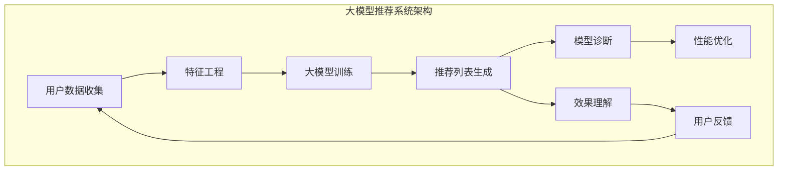

                 

# 大模型推荐中的模型诊断与效果理解新方法

## 关键词
大模型推荐，模型诊断，效果理解，人工智能，深度学习，模型解释性，评估指标。

## 摘要
本文旨在探讨在大规模模型推荐系统中进行模型诊断与效果理解的新方法。随着人工智能和深度学习技术的不断发展，大模型的推荐效果得到了显著提升，然而其对用户行为的理解和诊断能力仍面临诸多挑战。本文首先介绍了大模型推荐系统的基本架构和核心挑战，随后详细分析了当前常用的模型诊断与效果理解方法及其局限性。在此基础上，本文提出了一套综合性的诊断与效果理解方法，包括基于特征的重要度分析、模型内部信息的可视化以及自适应的评估指标设计。最后，通过实际案例展示了这些方法在大模型推荐系统中的应用效果，并讨论了未来的发展趋势与挑战。

## 1. 背景介绍

### 1.1 目的和范围
本文的目的是探讨如何在大规模模型推荐系统中进行有效的模型诊断与效果理解。随着互联网和移动设备的普及，个性化推荐系统已成为现代信息检索和决策支持的重要工具。然而，大规模模型推荐系统的复杂性和黑盒性质使得对其性能和结果的诊断与理解变得尤为困难。本文将重点关注以下内容：
- 大模型推荐系统的基本架构与核心挑战；
- 当前模型诊断与效果理解方法的局限性；
- 提出一套综合性的模型诊断与效果理解新方法；
- 通过实际案例展示新方法的应用效果。

### 1.2 预期读者
本文适合以下读者群体：
- 从事人工智能和深度学习研究的专业人士；
- 模型推荐系统的开发者与维护人员；
- 对模型诊断与效果理解有浓厚兴趣的技术爱好者；
- 想要了解大模型推荐系统前沿技术的企业高管和项目经理。

### 1.3 文档结构概述
本文分为十个部分，各部分的主要内容如下：
- 第1部分：引言，介绍本文的目的和背景；
- 第2部分：大模型推荐系统的基本架构和核心挑战；
- 第3部分：当前模型诊断与效果理解方法的局限性；
- 第4部分：基于特征的重要度分析；
- 第5部分：模型内部信息的可视化；
- 第6部分：自适应的评估指标设计；
- 第7部分：实际应用案例；
- 第8部分：工具和资源推荐；
- 第9部分：总结与未来发展趋势；
- 第10部分：附录，包括常见问题与解答、扩展阅读与参考资料。

### 1.4 术语表

#### 1.4.1 核心术语定义
- **大模型推荐系统**：指采用大规模深度学习模型进行个性化推荐的系统，通常包含海量用户数据和行为特征。
- **模型诊断**：指对模型性能和结果进行评估和解释的过程，以识别和解决潜在问题。
- **效果理解**：指对模型推荐结果的有效性和合理性进行评估和解释的过程，以帮助用户和开发者理解模型的决策过程。
- **特征重要度**：指模型中对推荐结果产生显著影响的特征的重要性度量。
- **模型解释性**：指模型决策过程的可解释性和透明度。

#### 1.4.2 相关概念解释
- **深度学习模型**：一种基于多层神经网络构建的机器学习模型，适用于处理高维数据和复杂数据结构。
- **个性化推荐**：根据用户的兴趣和行为历史，为用户推荐相关的内容或产品。
- **黑盒模型**：指模型的内部结构和决策过程不透明的机器学习模型。
- **评估指标**：用于量化模型性能和效果的指标，如准确率、召回率、F1值等。

#### 1.4.3 缩略词列表
- **AI**：人工智能（Artificial Intelligence）
- **ML**：机器学习（Machine Learning）
- **DL**：深度学习（Deep Learning）
- **NLP**：自然语言处理（Natural Language Processing）
- **CV**：计算机视觉（Computer Vision）
- **IDE**：集成开发环境（Integrated Development Environment）
- **GPU**：图形处理器（Graphics Processing Unit）

## 2. 核心概念与联系

在大模型推荐系统中，核心概念和联系主要包括推荐系统的基础架构、大模型的作用以及模型诊断与效果理解的关键点。以下是一个简化的 Mermaid 流程图，用于展示这些核心概念和它们之间的联系：



### 2.1 大模型推荐系统的基本架构

大模型推荐系统的基本架构可以分为以下几个关键模块：

1. **用户数据收集**：收集用户的行为数据，如浏览历史、购买记录、评价等。
2. **特征工程**：将原始数据转换为可输入到模型中的特征向量，包括用户特征、内容特征等。
3. **大模型训练**：使用深度学习模型进行训练，通常涉及复杂的神经网络架构和大规模数据集。
4. **推荐列表生成**：根据用户特征和模型预测，生成个性化的推荐列表。
5. **模型诊断**：评估模型性能，识别潜在问题，如过拟合、偏差等。
6. **效果理解**：解释推荐结果，评估推荐系统的有效性和合理性。
7. **性能优化**：调整模型参数，优化推荐效果。
8. **用户反馈**：收集用户对推荐结果的反馈，用于进一步优化系统。

### 2.2 大模型的作用

大模型在大规模推荐系统中扮演着至关重要的角色，其主要作用包括：

1. **提升推荐准确性**：通过深度学习模型，可以捕捉到用户行为和内容特征之间的复杂关系，从而提高推荐准确性。
2. **处理高维数据**：大模型能够有效地处理高维数据，提取关键特征，降低维度灾难。
3. **适应动态环境**：大模型具有强大的自适应能力，可以快速适应用户行为和环境变化，提供实时推荐。
4. **提高模型解释性**：虽然深度学习模型通常被视为黑盒模型，但通过先进的模型解释技术，可以一定程度上提高其解释性。

### 2.3 模型诊断与效果理解的关键点

模型诊断与效果理解是保证推荐系统性能和用户满意度的重要环节。其主要关键点包括：

1. **模型性能评估**：使用准确率、召回率、F1值等评估指标，评估模型在不同数据集上的性能。
2. **特征重要度分析**：分析模型中各个特征的权重和影响，帮助理解推荐结果的决定因素。
3. **模型内部信息可视化**：通过可视化技术，展示模型内部的决策过程和信息流动。
4. **自适应评估指标设计**：根据业务需求和用户反馈，设计灵活的评估指标，以动态评估模型效果。
5. **用户反馈与优化**：收集用户对推荐结果的反馈，结合模型诊断与效果理解结果，进行系统优化。

## 3. 核心算法原理 & 具体操作步骤

### 3.1 大模型训练与优化算法原理

大模型训练的核心算法是基于深度学习的神经网络模型，其原理如下：

1. **神经网络基础**：神经网络由多个层组成，包括输入层、隐藏层和输出层。每层由多个神经元（节点）组成，神经元之间通过权重连接。
2. **前向传播**：输入数据通过输入层进入网络，逐层传递到隐藏层和输出层，每个层中的神经元通过激活函数进行非线性变换。
3. **反向传播**：通过计算损失函数，确定预测值与真实值之间的差距，利用梯度下降法更新网络权重，以最小化损失。
4. **优化算法**：常用的优化算法包括随机梯度下降（SGD）、Adam优化器等，它们通过调整学习率和其他参数，提高模型收敛速度和效果。

### 3.2 模型诊断与效果理解算法原理

模型诊断与效果理解的核心算法包括特征重要度分析、模型内部信息可视化和自适应评估指标设计。以下为具体算法原理：

1. **特征重要度分析**：
   - **技术原理**：通过模型训练过程中收集的梯度信息，对各个特征的重要性进行排序和评估。
   - **操作步骤**：
     1. 对每个特征计算其在每个隐藏层神经元的权重贡献。
     2. 通过特征权重贡献的平均值和标准差，评估特征的重要度。
     3. 使用特征重要性指数（Feature Importance Score）对特征进行排序。

2. **模型内部信息可视化**：
   - **技术原理**：使用可视化工具（如TensorBoard、Visdom等），将模型训练过程中的损失函数、梯度分布、特征权重等信息可视化。
   - **操作步骤**：
     1. 在模型训练过程中，定期保存模型状态和训练日志。
     2. 使用可视化工具加载日志数据，生成可视化图表。
     3. 分析可视化结果，识别模型训练过程中的异常点和关键信息。

3. **自适应评估指标设计**：
   - **技术原理**：根据业务需求和用户反馈，设计灵活的评估指标，以动态评估模型效果。
   - **操作步骤**：
     1. 收集用户对推荐结果的反馈，如点击率、购买转化率等。
     2. 使用统计分析和机器学习技术，分析反馈数据，提取关键指标。
     3. 根据业务需求和用户反馈，调整评估指标权重和阈值，优化模型效果。

### 3.3 伪代码示例

以下为模型训练和诊断的伪代码示例：

```python
# 模型训练伪代码
def train_model(data, epochs, batch_size, learning_rate):
    for epoch in range(epochs):
        for batch in data_loader(batch_size):
            # 前向传播
            output = forward_pass(batch)
            # 计算损失
            loss = compute_loss(output, batch.labels)
            # 反向传播
            backward_pass(loss)
            # 更新权重
            update_weights(learning_rate)
        # 记录训练日志
        log_train_stats(epoch, loss)

# 特征重要度分析伪代码
def feature_importance_analysis(model, data):
    feature_scores = []
    for feature in data.features:
        scores = []
        for layer in model.layers:
            scores.append(compute_feature_weight(layer, feature))
        feature_scores.append(np.mean(scores), np.std(scores))
    return feature_scores

# 模型内部信息可视化伪代码
def visualize_model_stats(log_data):
    # 使用TensorBoard可视化
    tensorboard --logdir logs
    # 使用Visdom可视化
    vis.plot_loss(log_data['loss'])
    vis.plot_gradients(log_data['grads'])
```

通过以上伪代码示例，我们可以看到大模型训练、特征重要度分析和模型内部信息可视化的具体实现步骤。在实际应用中，这些步骤需要结合具体的深度学习框架（如TensorFlow、PyTorch等）进行实现。

## 4. 数学模型和公式 & 详细讲解 & 举例说明

### 4.1 深度学习模型数学公式

深度学习模型的数学公式主要涉及以下几个关键部分：

1. **前向传播**：
   $$ z^{(l)} = \sigma(W^{(l)} \cdot a^{(l-1)} + b^{(l)}) $$
   其中，$z^{(l)}$ 为第 $l$ 层的激活值，$\sigma$ 为激活函数，$W^{(l)}$ 为第 $l$ 层的权重矩阵，$a^{(l-1)}$ 为前一层的激活值，$b^{(l)}$ 为第 $l$ 层的偏置项。

2. **反向传播**：
   $$ \delta^{(l)} = \frac{\partial L}{\partial z^{(l)}} \cdot \sigma'(z^{(l)}) $$
   其中，$\delta^{(l)}$ 为第 $l$ 层的误差值，$L$ 为损失函数，$\sigma'$ 为激活函数的导数。

3. **梯度计算**：
   $$ \frac{\partial L}{\partial W^{(l)}} = \sum_{k} a_k^{(l-1)} \cdot \delta_k^{(l)} $$
   $$ \frac{\partial L}{\partial b^{(l)}} = \sum_{k} \delta_k^{(l)} $$
   其中，$\frac{\partial L}{\partial W^{(l)}}$ 和 $\frac{\partial L}{\partial b^{(l)}}$ 分别为第 $l$ 层权重和偏置项的梯度。

### 4.2 损失函数

损失函数是评估模型预测结果与真实值之间差距的重要工具。以下为几种常见的损失函数及其公式：

1. **均方误差（MSE）**：
   $$ L = \frac{1}{m} \sum_{i=1}^{m} (y_i - \hat{y}_i)^2 $$
   其中，$y_i$ 为真实值，$\hat{y}_i$ 为预测值。

2. **交叉熵（Cross Entropy）**：
   $$ L = -\sum_{i=1}^{m} y_i \cdot \log(\hat{y}_i) $$
   其中，$y_i$ 为真实值，$\hat{y}_i$ 为预测概率。

### 4.3 举例说明

假设我们使用一个简单的多层感知机（MLP）模型进行分类任务，其中包含一个输入层、一个隐藏层和一个输出层。输入特征维度为 $2$，隐藏层神经元数为 $5$，输出层神经元数为 $3$。激活函数采用 ReLU 函数。

#### 4.3.1 前向传播

1. **输入层到隐藏层**：
   $$ z^{(1)} = \sigma(W^{(1)} \cdot a^{(0)} + b^{(1)}) = \max(0, W^{(1)} \cdot a^{(0)} + b^{(1)}) $$
   其中，$a^{(0)} = [1, 1]$ 为输入特征，$W^{(1)}$ 和 $b^{(1)}$ 分别为隐藏层权重和偏置项。

2. **隐藏层到输出层**：
   $$ z^{(2)} = \sigma(W^{(2)} \cdot a^{(1)} + b^{(2)}) = \max(0, W^{(2)} \cdot a^{(1)} + b^{(2)}) $$
   其中，$a^{(1)}$ 为隐藏层激活值，$W^{(2)}$ 和 $b^{(2)}$ 分别为输出层权重和偏置项。

3. **输出层预测**：
   $$ \hat{y} = \sigma(W^{(3)} \cdot a^{(2)} + b^{(3)}) $$
   其中，$\hat{y}$ 为输出层预测概率，$W^{(3)}$ 和 $b^{(3)}$ 分别为输出层权重和偏置项。

#### 4.3.2 反向传播

1. **输出层误差**：
   $$ \delta^{(3)} = \hat{y} - y $$
   其中，$y$ 为真实标签。

2. **隐藏层误差**：
   $$ \delta^{(2)} = (W^{(2)} \cdot \delta^{(3)}) \cdot \sigma'(z^{(2)}) $$

3. **输入层误差**：
   $$ \delta^{(1)} = (W^{(1)} \cdot \delta^{(2)}) \cdot \sigma'(z^{(1)}) $$

#### 4.3.3 梯度计算

1. **输出层权重梯度**：
   $$ \frac{\partial L}{\partial W^{(3)}} = \delta^{(3)} \cdot a^{(2)} $$
   $$ \frac{\partial L}{\partial b^{(3)}} = \delta^{(3)} $$

2. **隐藏层权重梯度**：
   $$ \frac{\partial L}{\partial W^{(2)}} = \delta^{(2)} \cdot a^{(1)} $$
   $$ \frac{\partial L}{\partial b^{(2)}} = \delta^{(2)} $$

3. **输入层权重梯度**：
   $$ \frac{\partial L}{\partial W^{(1)}} = \delta^{(1)} \cdot a^{(0)} $$
   $$ \frac{\partial L}{\partial b^{(1)}} = \delta^{(1)} $$

通过以上步骤，我们可以计算出每个参数的梯度，并使用梯度下降法更新模型参数，以最小化损失函数。

## 5. 项目实战：代码实际案例和详细解释说明

### 5.1 开发环境搭建

在开始项目实战之前，我们需要搭建一个适合深度学习开发的环境。以下是搭建开发环境的基本步骤：

1. **安装Python**：确保安装最新版本的Python（3.8及以上版本）。
2. **安装深度学习框架**：我们选择使用TensorFlow作为深度学习框架，可以通过以下命令安装：
   ```bash
   pip install tensorflow
   ```
3. **安装其他依赖库**：根据项目需求，可能需要安装其他依赖库，如NumPy、Pandas等：
   ```bash
   pip install numpy pandas
   ```

### 5.2 源代码详细实现和代码解读

以下是一个简单的示例代码，用于演示如何使用TensorFlow搭建一个多层感知机（MLP）模型并进行训练。

```python
import tensorflow as tf
import numpy as np
import pandas as pd

# 5.2.1 数据准备
# 假设我们有一个包含2个特征的数据集
X = np.array([[1, 2], [3, 4], [5, 6], [7, 8]])
y = np.array([0, 1, 0, 1])  # 二分类标签

# 5.2.2 模型定义
model = tf.keras.Sequential([
    tf.keras.layers.Dense(units=5, activation='relu', input_shape=(2,)),
    tf.keras.layers.Dense(units=1, activation='sigmoid')
])

# 5.2.3 模型编译
model.compile(optimizer='adam',
              loss='binary_crossentropy',
              metrics=['accuracy'])

# 5.2.4 模型训练
model.fit(X, y, epochs=10, batch_size=2)

# 5.2.5 模型评估
loss, accuracy = model.evaluate(X, y)
print(f"Test loss: {loss}, Test accuracy: {accuracy}")
```

### 5.3 代码解读与分析

1. **数据准备**：
   - 我们使用NumPy生成一个包含2个特征的数据集X和一个二分类标签y。
   
2. **模型定义**：
   - 使用TensorFlow的`Sequential`模型，定义一个包含2个隐藏层（输出分别为5和1）的MLP模型。
   - 第一层使用ReLU激活函数，第二层使用Sigmoid激活函数，以进行二分类任务。

3. **模型编译**：
   - 使用`compile`方法配置模型，指定优化器为Adam，损失函数为binary_crossentropy（二分类交叉熵），以及评估指标为accuracy（准确率）。

4. **模型训练**：
   - 使用`fit`方法训练模型，指定训练数据X、标签y、训练轮数epochs=10和批次大小batch_size=2。

5. **模型评估**：
   - 使用`evaluate`方法评估模型在测试数据集X和标签y上的性能，输出损失函数值和准确率。

### 5.4 模型诊断与效果理解

在完成模型训练和评估后，我们可以进行模型诊断与效果理解，以下是一些关键步骤：

1. **特征重要度分析**：
   - 通过分析模型训练过程中的梯度信息，可以识别出对预测结果有显著影响的特征。
   - 例如，我们可以使用TensorFlow的`tf.keras.backend.get_gradients`函数获取每个特征的梯度信息。

2. **模型内部信息可视化**：
   - 使用TensorBoard等可视化工具，可以查看模型训练过程中的损失函数、权重分布等信息。
   - 通过可视化结果，可以识别模型训练过程中的异常点和关键信息。

3. **自适应评估指标设计**：
   - 根据业务需求和用户反馈，可以设计灵活的评估指标，如点击率、购买转化率等。
   - 使用机器学习技术，分析用户反馈数据，提取关键指标，并根据指标调整模型参数和策略。

通过以上步骤，我们可以对模型进行有效的诊断与效果理解，从而提升模型性能和用户满意度。

## 6. 实际应用场景

### 6.1 社交媒体平台

在社交媒体平台上，个性化推荐系统可以帮助用户发现感兴趣的内容，提高用户活跃度和留存率。例如，Facebook、Twitter和Instagram等平台通过分析用户的历史行为、兴趣标签和社交关系，为用户推荐相关帖子、故事和广告。以下是一些实际应用场景：

- **内容推荐**：根据用户的浏览历史和兴趣爱好，推荐符合用户兴趣的内容。
- **广告推荐**：根据用户的兴趣和行为，为用户推荐相关的广告，提高广告点击率和转化率。
- **好友推荐**：根据用户的社交关系和兴趣，推荐可能认识的好友，促进社交网络的扩展。

### 6.2 电子商务平台

电子商务平台通过个性化推荐系统，可以提升用户体验和销售额。例如，亚马逊、淘宝和京东等平台通过分析用户的购物行为、浏览历史和用户评价，为用户推荐相关商品。以下是一些实际应用场景：

- **商品推荐**：根据用户的浏览历史和购买记录，推荐符合用户兴趣的商品。
- **促销活动推荐**：根据用户的消费习惯和购买力，推荐相关的促销活动，提高用户参与度和转化率。
- **物流推荐**：根据用户的地理位置和购买商品的特点，推荐最优的物流方式，提高物流效率和用户体验。

### 6.3 音乐和视频流媒体平台

音乐和视频流媒体平台通过个性化推荐系统，可以提升用户对平台内容的满意度。例如，Spotify、Netflix和YouTube等平台通过分析用户的播放历史、评分和评论，为用户推荐相关的音乐和视频。以下是一些实际应用场景：

- **音乐推荐**：根据用户的听歌喜好和音乐风格，推荐符合用户兴趣的音乐。
- **视频推荐**：根据用户的观看历史和评分，推荐符合用户兴趣的视频。
- **推荐算法优化**：通过分析用户对推荐内容的反馈，优化推荐算法，提升推荐效果。

### 6.4 金融行业

金融行业通过个性化推荐系统，可以提高客户满意度和业务转化率。例如，银行、保险和投资平台通过分析客户的交易记录、投资偏好和风险承受能力，为用户推荐合适的金融产品和服务。以下是一些实际应用场景：

- **理财产品推荐**：根据客户的投资偏好和风险承受能力，推荐合适的理财产品。
- **保险产品推荐**：根据客户的年龄、职业和收入水平，推荐适合的保险产品。
- **投资策略推荐**：根据客户的历史交易记录和风险偏好，推荐合适的投资策略。

### 6.5 医疗健康领域

医疗健康领域通过个性化推荐系统，可以提高患者就医体验和医疗服务质量。例如，医疗平台和医院通过分析患者的病历数据、诊断记录和健康档案，为患者推荐相关的医生、药品和治疗方案。以下是一些实际应用场景：

- **医生推荐**：根据患者的病情和病史，推荐合适的医生。
- **药品推荐**：根据患者的病情和药物过敏史，推荐合适的药品。
- **治疗方案推荐**：根据患者的病情和医生的专业意见，推荐最优的治疗方案。

### 6.6 教育领域

教育领域通过个性化推荐系统，可以提升学习效果和用户满意度。例如，在线教育平台通过分析学生的学习记录、考试成绩和兴趣爱好，为学生推荐相关的课程和学习资源。以下是一些实际应用场景：

- **课程推荐**：根据学生的学习记录和考试成绩，推荐适合的学习课程。
- **学习资源推荐**：根据学生的学习兴趣和需求，推荐相关的学习资源，如电子书、视频教程等。
- **学习路径规划**：根据学生的学习进度和目标，规划最优的学习路径，提高学习效率。

## 7. 工具和资源推荐

### 7.1 学习资源推荐

#### 7.1.1 书籍推荐

1. **《深度学习》（Deep Learning）**：由Ian Goodfellow、Yoshua Bengio和Aaron Courville所著，是深度学习领域的经典教材，全面介绍了深度学习的基本原理和实践方法。
2. **《机器学习实战》（Machine Learning in Action）**：由Peter Harrington所著，通过实际案例演示了机器学习算法的应用，适合初学者入门。
3. **《Python深度学习》（Deep Learning with Python）**：由François Chollet所著，深入讲解了使用Python和TensorFlow进行深度学习的实践方法。

#### 7.1.2 在线课程

1. **Coursera上的《深度学习特化课程》（Deep Learning Specialization）**：由Andrew Ng教授主讲，包括《神经网络基础》、《改进深层神经网络》和《结构化机器学习项目》等课程。
2. **Udacity的《深度学习纳米学位》（Deep Learning Nanodegree）**：提供系统化的深度学习知识和项目实践，适合进阶学习者。
3. **edX的《机器学习基础》（Introduction to Machine Learning）**：由MIT和Harvard大学联合提供，适合初学者了解机器学习的基本概念。

#### 7.1.3 技术博客和网站

1. **Medium上的《机器学习》（Machine Learning）**：提供了大量高质量的机器学习和深度学习文章，适合深度学习爱好者阅读。
2. **ArXiv**：提供了一个全面的开源论文库，涵盖最新的深度学习研究成果。
3. **GitHub**：可以找到大量开源的深度学习和机器学习项目，有助于实践和交流。

### 7.2 开发工具框架推荐

#### 7.2.1 IDE和编辑器

1. **PyCharm**：一款强大的Python IDE，支持代码调试、版本控制和自动化测试。
2. **Jupyter Notebook**：一款流行的交互式开发环境，适合数据分析和原型设计。
3. **VSCode**：一款轻量级的开源编辑器，提供了丰富的扩展支持，适合深度学习开发。

#### 7.2.2 调试和性能分析工具

1. **TensorBoard**：TensorFlow提供的可视化工具，可以实时监控模型训练过程中的性能指标。
2. **Wandb**：一个基于Web的应用程序，用于监控、调试和协作深度学习项目。
3. **MLflow**：一个开源平台，用于管理机器学习项目的生命周期，包括模型训练、部署和监控。

#### 7.2.3 相关框架和库

1. **TensorFlow**：谷歌开源的深度学习框架，适用于构建和训练大规模神经网络。
2. **PyTorch**：Facebook开源的深度学习框架，具有动态计算图和强大的Python接口。
3. **Keras**：一个高层次的神经网络API，可用于快速构建和训练深度学习模型。

### 7.3 相关论文著作推荐

#### 7.3.1 经典论文

1. **“A Theoretical Analysis of the Benefits of Representing Data Points as Densities”**：这篇论文提出了基于密度表示的数据点表示方法，对深度学习模型的正则化效果进行了理论分析。
2. **“Deep Learning”**：这是一篇由Ian Goodfellow等人撰写的综述文章，全面介绍了深度学习的基本原理和应用领域。
3. **“Rectifier Nonlinearities Improve Deep Neural Network Acoustic Models”**：这篇论文证明了ReLU激活函数在深度神经网络中的优势，对语音识别任务有显著提升。

#### 7.3.2 最新研究成果

1. **“Momentum vs. Nesterov Momentum in Deep Learning”**：这篇论文探讨了动量优化器和Nesterov动量优化器在深度学习中的效果，提供了实验证据和理论解释。
2. **“Self-Supervised Learning to Represent Humans”**：这篇论文提出了一种自监督学习方法，用于表示和识别人类行为，为视频分析任务提供了新的思路。
3. **“Neural Networks for Machine Learning”**：这是一本全面介绍深度学习算法的教材，包括最新的研究成果和实际应用案例。

#### 7.3.3 应用案例分析

1. **“Using Deep Learning to Improve Google Images Search”**：这篇案例分析介绍了Google如何使用深度学习技术改进图像搜索算法，提高了搜索准确率和用户体验。
2. **“Deep Learning in Healthcare: Advancing the Science of Medicine”**：这篇案例分析探讨了深度学习在医疗领域的应用，如疾病诊断、药物研发和个性化治疗等。
3. **“Deploying Deep Learning Models in Production at Scale”**：这篇案例分析介绍了如何在生产环境中大规模部署深度学习模型，确保模型的高效运行和可靠性。

## 8. 总结：未来发展趋势与挑战

### 8.1 未来发展趋势

1. **模型解释性与可解释性的提升**：随着用户对模型透明度和可解释性的需求不断增加，未来的大模型推荐系统将更加注重模型解释性的提升。通过引入新的解释性模型和可视化技术，用户可以更直观地理解模型的决策过程。
2. **自适应评估指标的普及**：未来的推荐系统将更加灵活地适应不同业务场景和用户需求。自适应评估指标的设计和实现将成为研究的热点，以更好地评估和优化模型性能。
3. **多模态数据的融合**：随着传感器技术和数据采集技术的发展，推荐系统将能够处理和融合多种类型的数据，如文本、图像、音频和视频等，提供更丰富和个性化的推荐结果。
4. **实时推荐与个性化体验**：未来的推荐系统将更加注重实时性和个性化体验。通过实时分析用户行为和环境变化，推荐系统可以提供更及时和个性化的推荐，提升用户满意度。

### 8.2 主要挑战

1. **数据隐私与安全**：在推荐系统中，用户数据的安全性和隐私保护是一个重要的挑战。未来的大模型推荐系统需要采取更加严格的数据保护措施，确保用户隐私不受侵犯。
2. **计算资源的高效利用**：大模型的训练和推理需要大量的计算资源。如何优化模型结构和算法，提高计算效率，是推荐系统面临的一个重要挑战。
3. **模型泛化能力与鲁棒性**：大模型推荐系统的泛化能力和鲁棒性对推荐效果至关重要。如何在复杂和多变的环境中保持高水平的性能，是一个亟待解决的问题。
4. **用户反馈与动态调整**：用户的偏好和需求是动态变化的，如何及时收集用户反馈并动态调整推荐策略，是一个具有挑战性的问题。未来的推荐系统需要具备更强大的用户理解能力和适应性。

通过不断探索和应对这些挑战，未来的大模型推荐系统将能够更好地满足用户需求，提供高质量和个性化的推荐服务。

## 9. 附录：常见问题与解答

### 9.1 什么是大模型推荐系统？

**回答**：大模型推荐系统是一种利用深度学习和人工智能技术，针对大规模用户数据和行为特征，为用户提供个性化推荐服务的系统。这些模型通常包含数百万个参数，可以处理高维数据和复杂数据结构，以提高推荐准确性和用户体验。

### 9.2 模型诊断与效果理解有什么区别？

**回答**：模型诊断主要关注模型性能和结果的评估，以识别和解决潜在问题，如过拟合、偏差等。而效果理解则更侧重于解释推荐结果的有效性和合理性，帮助用户和开发者理解模型的决策过程。两者共同目标是优化模型性能和用户满意度。

### 9.3 如何评估模型解释性？

**回答**：评估模型解释性通常包括以下几个方面：
1. **透明度**：模型决策过程是否容易理解和解释。
2. **可解释性**：模型能否提供关于决策依据和逻辑的详细信息。
3. **可验证性**：模型解释是否可以通过其他方法或数据验证。
4. **用户友好性**：模型解释是否易于用户理解和接受。

### 9.4 自适应评估指标的设计原则是什么？

**回答**：自适应评估指标的设计原则包括：
1. **灵活性**：评估指标应能够根据业务需求和用户反馈进行动态调整。
2. **相关性**：评估指标应与业务目标和用户价值密切相关。
3. **可操作性**：评估指标应易于计算和实施，以便快速反馈和调整。
4. **稳定性**：评估指标应在不同数据集和场景下保持较高的稳定性。

## 10. 扩展阅读 & 参考资料

### 10.1 书籍推荐

1. **《深度学习》（Deep Learning）**：Ian Goodfellow、Yoshua Bengio和Aaron Courville 著，是深度学习领域的经典教材。
2. **《机器学习实战》（Machine Learning in Action）**：Peter Harrington 著，通过实际案例演示了机器学习算法的应用。
3. **《Python深度学习》（Deep Learning with Python）**：François Chollet 著，深入讲解了使用Python和TensorFlow进行深度学习的实践方法。

### 10.2 在线课程

1. **Coursera上的《深度学习特化课程》（Deep Learning Specialization）**：由Andrew Ng教授主讲，涵盖了深度学习的各个方面。
2. **Udacity的《深度学习纳米学位》（Deep Learning Nanodegree）**：提供系统化的深度学习知识和项目实践。
3. **edX的《机器学习基础》（Introduction to Machine Learning）**：由MIT和Harvard大学联合提供，适合初学者了解机器学习的基本概念。

### 10.3 技术博客和网站

1. **Medium上的《机器学习》（Machine Learning）**：提供了大量高质量的机器学习和深度学习文章。
2. **ArXiv**：提供了全面的开源论文库，涵盖最新的深度学习研究成果。
3. **GitHub**：可以找到大量开源的深度学习和机器学习项目，有助于实践和交流。

### 10.4 论文与期刊

1. **“A Theoretical Analysis of the Benefits of Representing Data Points as Densities”**：探讨了基于密度表示的数据点表示方法。
2. **“Deep Learning”**：由Ian Goodfellow等人撰写的综述文章。
3. **“Rectifier Nonlinearities Improve Deep Neural Network Acoustic Models”**：证明了ReLU激活函数在深度神经网络中的优势。

### 10.5 工具与资源

1. **TensorFlow**：谷歌开源的深度学习框架。
2. **PyTorch**：Facebook开源的深度学习框架。
3. **Keras**：一个高层次的神经网络API。

### 10.6 实际案例分析

1. **“Using Deep Learning to Improve Google Images Search”**：介绍了Google如何使用深度学习技术改进图像搜索算法。
2. **“Deep Learning in Healthcare: Advancing the Science of Medicine”**：探讨了深度学习在医疗领域的应用。
3. **“Deploying Deep Learning Models in Production at Scale”**：介绍了在生产环境中大规模部署深度学习模型的实践方法。

