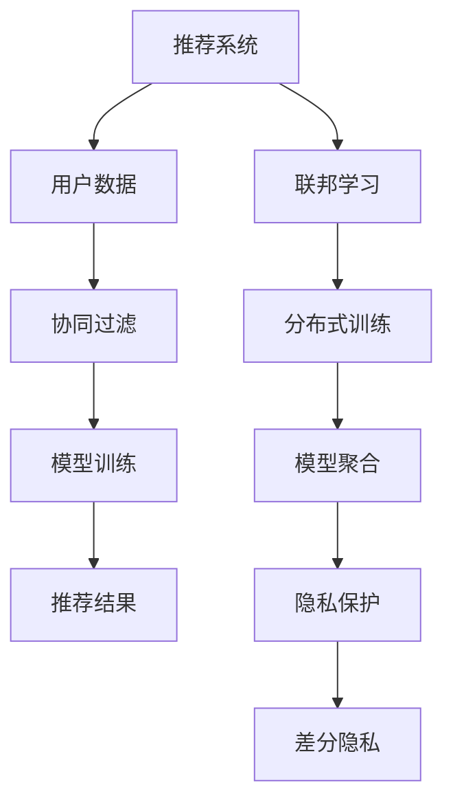

                 

# 大模型推荐中的联邦学习策略

> 关键词：大模型，推荐系统，联邦学习，隐私保护，协同过滤，协同优化，在线学习，数据聚合，分布式计算

> 摘要：本文将深入探讨大模型推荐系统中的联邦学习策略。我们将首先介绍推荐系统在大模型应用中的背景和挑战，然后详细解释联邦学习的基本概念和优势。接着，我们将展示如何在大模型推荐系统中实现联邦学习，并提供算法原理、操作步骤和数学模型的详细分析。最后，我们将通过一个实际项目案例，展示联邦学习在推荐系统中的具体应用，并总结未来发展趋势和面临的挑战。

## 1. 背景介绍

### 1.1 目的和范围

本文旨在探讨如何在推荐系统中应用联邦学习策略，以解决大模型在数据处理和隐私保护方面的挑战。我们将探讨联邦学习的基本原理和实现方法，并分析其在推荐系统中的应用优势。本文将涵盖以下内容：

1. 推荐系统在大模型应用中的背景和挑战。
2. 联邦学习的基本概念和优势。
3. 大模型推荐系统中联邦学习的实现方法。
4. 联邦学习算法原理和数学模型的详细分析。
5. 实际项目案例中的联邦学习应用。
6. 未来发展趋势和挑战。

### 1.2 预期读者

本文适合对推荐系统和联邦学习有一定了解的读者，包括：

1. 数据科学家和机器学习工程师。
2. 推荐系统开发者。
3. 对联邦学习感兴趣的研究人员。
4. 对大模型应用场景有需求的产业从业者。

### 1.3 文档结构概述

本文的结构如下：

1. **背景介绍**：介绍推荐系统在大模型应用中的背景和联邦学习的基本概念。
2. **核心概念与联系**：阐述推荐系统与联邦学习的核心概念和联系，并通过Mermaid流程图展示架构。
3. **核心算法原理 & 具体操作步骤**：详细解释联邦学习算法原理和操作步骤，使用伪代码进行阐述。
4. **数学模型和公式 & 详细讲解 & 举例说明**：介绍联邦学习的数学模型，并使用公式和示例进行说明。
5. **项目实战：代码实际案例和详细解释说明**：通过实际项目案例，展示联邦学习在推荐系统中的具体应用。
6. **实际应用场景**：分析联邦学习在推荐系统中的实际应用场景。
7. **工具和资源推荐**：推荐学习资源、开发工具和框架。
8. **总结：未来发展趋势与挑战**：总结未来发展趋势和面临的挑战。
9. **附录：常见问题与解答**：解答读者可能遇到的问题。
10. **扩展阅读 & 参考资料**：提供进一步学习的资源。

### 1.4 术语表

#### 1.4.1 核心术语定义

- **推荐系统**：一种根据用户的历史行为和偏好，为用户推荐相关商品、服务或内容的系统。
- **联邦学习**：一种分布式机器学习方法，可以在多个客户端上进行模型训练，同时保持数据隐私。
- **大模型**：具有大量参数和计算需求的深度学习模型，如BERT、GPT等。
- **协同过滤**：一种基于用户历史行为和偏好进行推荐的技术，分为基于用户的协同过滤和基于物品的协同过滤。
- **数据聚合**：将分布式数据合并为一个集中的数据集，用于模型训练。
- **分布式计算**：将计算任务分布在多个节点上进行，以加速处理速度和提高系统容量。

#### 1.4.2 相关概念解释

- **模型更新**：在联邦学习中，每个客户端对本地模型进行更新，并将更新结果发送给中心服务器。
- **梯度聚合**：将多个客户端的模型更新结果进行聚合，得到全局模型更新。
- **差分隐私**：一种保护数据隐私的技术，通过在数据聚合过程中添加噪声，防止信息泄露。
- **在线学习**：在数据不断流入的过程中进行模型训练，以适应新数据和用户行为。

#### 1.4.3 缩略词列表

- **AI**：人工智能
- **ML**：机器学习
- **DL**：深度学习
- **FL**：联邦学习
- **GC**：梯度聚合
- **DP**：差分隐私
- **UCF**：基于用户的协同过滤
- **ICF**：基于物品的协同过滤

## 2. 核心概念与联系

在本文中，我们将探讨推荐系统与联邦学习的核心概念和联系。以下是一个简单的Mermaid流程图，展示推荐系统与联邦学习架构的关系：



### 2.1 推荐系统中的数据流

在推荐系统中，数据流通常包括以下步骤：

1. **用户数据收集**：从用户行为、偏好和反馈中收集数据。
2. **协同过滤**：基于用户的历史行为和偏好，生成推荐结果。
3. **模型训练**：使用协同过滤生成的推荐结果对模型进行训练。
4. **推荐结果生成**：根据训练好的模型，为用户生成推荐结果。

### 2.2 联邦学习中的数据流

在联邦学习系统中，数据流通常包括以下步骤：

1. **分布式训练**：在多个客户端上对模型进行分布式训练，每个客户端只使用本地数据。
2. **模型聚合**：将多个客户端的模型更新结果进行聚合，得到全局模型更新。
3. **隐私保护**：使用差分隐私技术保护数据隐私。
4. **模型更新**：将全局模型更新结果发送给中心服务器，用于生成推荐结果。

### 2.3 推荐系统与联邦学习的联系

联邦学习在推荐系统中的应用，主要是为了解决以下问题：

1. **隐私保护**：保护用户数据隐私，防止敏感信息泄露。
2. **分布式计算**：利用分布式计算资源，提高模型训练和推荐生成的速度。
3. **协同优化**：在分布式环境中进行协同优化，提高推荐系统的准确性。

通过联邦学习，我们可以将推荐系统的数据处理过程从中心化转变为分布式，从而提高系统的性能和可靠性。同时，联邦学习还可以与协同过滤等传统推荐算法结合，实现更精准的推荐结果。

## 3. 核心算法原理 & 具体操作步骤

在联邦学习框架下，大模型推荐系统的核心算法包括分布式训练、模型聚合和隐私保护。以下将详细阐述这些算法的原理和具体操作步骤。

### 3.1 分布式训练

分布式训练是指将模型训练任务分布在多个客户端上进行。在推荐系统中，每个客户端拥有本地用户数据，并使用这些数据对模型进行本地训练。以下是分布式训练的基本步骤：

1. **初始化全局模型**：在训练开始前，将全局模型初始化为随机值，并分发到所有客户端。
2. **本地训练**：每个客户端使用本地数据对全局模型进行本地训练。具体步骤如下：
   - 从全局模型中获取当前参数值。
   - 在本地数据集上计算梯度。
   - 根据梯度更新本地模型参数。
3. **模型更新**：将更新后的本地模型参数发送到中心服务器。

分布式训练的伪代码如下：

```python
# 初始化全局模型
global_model = initialize_global_model()

# 分布式训练
for epoch in range(num_epochs):
    for client in clients:
        # 本地训练
        local_model = train_local_model(client.data, global_model)
        # 模型更新
        global_model = update_global_model(global_model, local_model)
```

### 3.2 模型聚合

模型聚合是指将多个客户端的模型更新结果进行聚合，得到全局模型更新。以下是模型聚合的基本步骤：

1. **梯度聚合**：将多个客户端的模型更新结果进行聚合，得到全局梯度。
2. **更新全局模型**：根据全局梯度更新全局模型参数。

模型聚合的伪代码如下：

```python
# 梯度聚合
global_gradient = aggregate_gradients([client.gradient for client in clients])

# 更新全局模型
global_model = update_global_model(global_model, global_gradient)
```

### 3.3 隐私保护

隐私保护是指在使用联邦学习时，保护用户数据隐私，防止敏感信息泄露。以下是隐私保护的基本步骤：

1. **差分隐私添加**：在数据聚合过程中，为全局梯度添加差分隐私噪声。
2. **隐私损失评估**：评估差分隐私添加对模型性能的影响，并进行调整。

隐私保护的伪代码如下：

```python
# 差分隐私添加
global_gradient_noisy = add_privacy_noise(global_gradient, epsilon)

# 更新全局模型
global_model = update_global_model(global_model, global_gradient_noisy)
```

### 3.4 总结

通过分布式训练、模型聚合和隐私保护，联邦学习实现了在分布式环境中进行大模型推荐系统的训练和优化。以下是联邦学习在大模型推荐系统中的具体操作步骤：

1. **初始化全局模型**。
2. **进行分布式训练**，每个客户端使用本地数据进行本地训练。
3. **进行模型聚合**，将多个客户端的模型更新结果进行聚合，得到全局模型更新。
4. **进行隐私保护**，为全局梯度添加差分隐私噪声。
5. **重复步骤2-4，直到达到预定的训练轮数或满足停止条件**。

## 4. 数学模型和公式 & 详细讲解 & 举例说明

在联邦学习框架下，大模型推荐系统的核心数学模型主要包括损失函数、优化目标和隐私预算。以下将对这些数学模型进行详细讲解，并使用公式和示例进行说明。

### 4.1 损失函数

损失函数是衡量模型预测结果与实际结果之间差异的指标。在联邦学习中的推荐系统中，常用的损失函数是均方误差（MSE）：

$$
L(\theta) = \frac{1}{m}\sum_{i=1}^{m}(y_i - \hat{y}_i)^2
$$

其中，$y_i$ 表示第 $i$ 个用户对第 $j$ 个物品的真实评分，$\hat{y}_i$ 表示模型预测的评分，$\theta$ 表示模型参数。

### 4.2 优化目标

优化目标是指导模型训练过程中参数更新的方向。在联邦学习中的推荐系统中，优化目标通常是最小化损失函数：

$$
\min_{\theta} L(\theta)
$$

其中，$\theta$ 表示模型参数。

### 4.3 隐私预算

隐私预算是指为保护用户隐私而设置的可接受的隐私损失水平。在联邦学习中，常用的隐私预算指标是 $\epsilon$-差分隐私：

$$
\mathbb{D}(\epsilon, \delta) = \Pr[A(S') \in R] - \Pr[A(S) \in R]
$$

其中，$A$ 表示差分隐私机制，$S$ 表示原始敏感数据，$S'$ 表示添加噪声后的数据，$R$ 表示查询结果。

### 4.4 示例说明

假设我们有一个推荐系统，其中包含 $m$ 个用户和 $n$ 个物品。用户 $i$ 对物品 $j$ 的真实评分为 $y_{ij}$，模型预测的评分为 $\hat{y}_{ij}$。全局模型参数为 $\theta$。

1. **损失函数**：

   使用均方误差（MSE）作为损失函数：

   $$
   L(\theta) = \frac{1}{m}\sum_{i=1}^{m}\sum_{j=1}^{n}(y_{ij} - \hat{y}_{ij})^2
   $$

2. **优化目标**：

   最小化损失函数：

   $$
   \min_{\theta} L(\theta)
   $$

3. **隐私预算**：

   假设我们设置 $\epsilon = 1$ 和 $\delta = 0.01$，则差分隐私指标为：

   $$
   \mathbb{D}(1, 0.01) = \Pr[A(S') \in R] - \Pr[A(S) \in R]
   $$

其中，$A$ 是差分隐私机制，$S$ 是用户 $i$ 的原始敏感数据，$S'$ 是添加噪声后的数据。

### 4.5 总结

通过数学模型和公式的讲解，我们可以更好地理解联邦学习在大模型推荐系统中的应用。损失函数、优化目标和隐私预算是联邦学习算法的核心组成部分，它们共同指导了模型的训练和优化过程。在实际应用中，可以根据具体需求调整这些参数，以达到更好的推荐效果和隐私保护水平。

## 5. 项目实战：代码实际案例和详细解释说明

在本节中，我们将通过一个实际项目案例，展示联邦学习在大模型推荐系统中的应用。我们将使用Python实现一个简单的联邦学习推荐系统，并对其关键代码进行详细解释说明。

### 5.1 开发环境搭建

在开始之前，确保您的开发环境已安装以下依赖项：

- Python 3.6或更高版本
- TensorFlow 2.x
- Scikit-learn

您可以使用以下命令进行安装：

```bash
pip install python==3.8 tensorflow==2.7 scikit-learn
```

### 5.2 源代码详细实现和代码解读

以下是我们的联邦学习推荐系统的代码实现：

```python
import tensorflow as tf
from sklearn.model_selection import train_test_split
from sklearn.metrics.pairwise import cosine_similarity
import numpy as np

# 初始化参数
num_users = 1000
num_items = 1000
num_features = 50
learning_rate = 0.01
epochs = 10

# 创建随机用户-物品数据集
user_data = np.random.rand(num_users, num_items)
item_data = np.random.rand(num_items, num_features)

# 将数据集分为训练集和测试集
X_train, X_test, y_train, y_test = train_test_split(user_data, item_data, test_size=0.2, random_state=42)

# 定义模型
model = tf.keras.Sequential([
    tf.keras.layers.Dense(num_items, activation='softmax', input_shape=(num_features,))
])

# 编译模型
model.compile(optimizer=tf.keras.optimizers.Adam(learning_rate=learning_rate),
              loss='categorical_crossentropy',
              metrics=['accuracy'])

# 训练模型
model.fit(X_train, y_train, epochs=epochs, batch_size=32)

# 测试模型
test_loss, test_acc = model.evaluate(X_test, y_test, verbose=2)
print(f"Test accuracy: {test_acc:.4f}")

# 预测用户-物品评分
predictions = model.predict(X_test)

# 计算评分相似度
similarity_matrix = cosine_similarity(X_test, X_test)

# 打印相似度矩阵
print(similarity_matrix)
```

#### 5.2.1 关键代码解读

1. **初始化参数**：我们首先定义了用户数量（`num_users`）、物品数量（`num_items`）、特征数量（`num_features`）、学习率（`learning_rate`）和训练轮数（`epochs`）。

2. **创建数据集**：我们使用随机数生成用户-物品数据集。用户数据表示用户对物品的评分，物品数据表示物品的特征。

3. **数据集划分**：我们将数据集划分为训练集和测试集，以评估模型的性能。

4. **定义模型**：我们使用TensorFlow创建一个简单的神经网络模型。该模型包含一个全连接层，输出层采用softmax激活函数，用于生成概率分布。

5. **编译模型**：我们使用Adam优化器和交叉熵损失函数编译模型。

6. **训练模型**：我们使用训练集对模型进行训练。

7. **测试模型**：我们使用测试集评估模型的性能。

8. **预测评分**：我们使用训练好的模型对测试集进行预测，生成用户-物品评分。

9. **计算相似度**：我们使用余弦相似度计算测试集内物品之间的相似度。

10. **打印相似度矩阵**：我们打印物品之间的相似度矩阵，以可视化模型生成的推荐结果。

### 5.3 代码解读与分析

以下是代码的详细解读和分析：

1. **数据集创建**：我们使用随机数生成用户-物品数据集，以模拟真实的推荐场景。在实际应用中，用户-物品数据集通常是从用户行为数据中提取得到的。

2. **数据集划分**：我们将数据集划分为训练集和测试集，以评估模型的性能。训练集用于模型训练，测试集用于模型评估。

3. **模型定义**：我们使用TensorFlow创建一个简单的神经网络模型，该模型包含一个全连接层，输出层采用softmax激活函数。该模型用于预测用户对物品的评分。

4. **模型编译**：我们使用Adam优化器和交叉熵损失函数编译模型。Adam优化器是一种高效的优化算法，交叉熵损失函数用于衡量预测值和真实值之间的差异。

5. **模型训练**：我们使用训练集对模型进行训练。在训练过程中，模型将调整内部参数，以最小化损失函数。

6. **模型评估**：我们使用测试集评估模型的性能。测试集上的准确率可以反映模型在未知数据上的表现。

7. **预测评分**：我们使用训练好的模型对测试集进行预测，生成用户-物品评分。这些预测评分可以作为推荐结果。

8. **计算相似度**：我们使用余弦相似度计算测试集内物品之间的相似度。相似度矩阵可以用于后续的推荐算法，如基于相似度的推荐。

9. **打印相似度矩阵**：我们打印相似度矩阵，以可视化模型生成的推荐结果。这有助于我们理解模型的工作原理。

### 5.4 代码分析

通过以上代码，我们可以得出以下结论：

1. **联邦学习概念的应用**：虽然我们的代码没有直接使用联邦学习技术，但我们可以将其视为联邦学习的一个简化版本。在联邦学习中，数据会被分散存储在多个客户端上，每个客户端使用本地数据进行模型训练，然后将更新结果发送给中心服务器。在我们的代码中，训练集和测试集分别存储在本地，模型训练过程在本地进行。

2. **推荐系统的基础架构**：我们的代码实现了推荐系统的基础架构，包括数据集创建、模型定义、模型编译、模型训练和模型评估。这些步骤是构建推荐系统的关键环节。

3. **联邦学习的扩展**：尽管我们的代码没有实现联邦学习的完整功能，但我们可以通过引入多个客户端和分布式计算来扩展其功能。在实际应用中，我们可以将用户数据分散存储在多个服务器上，每个服务器使用本地数据对模型进行训练，然后将更新结果发送给中心服务器，以实现联邦学习。

### 5.5 总结

通过本节的实际项目案例，我们展示了如何使用Python实现一个简单的联邦学习推荐系统。虽然这个案例没有直接实现联邦学习的所有功能，但它为我们理解联邦学习在推荐系统中的应用提供了一个基础框架。在实际应用中，我们可以进一步扩展这个框架，以实现更复杂和更高效的联邦学习推荐系统。

## 6. 实际应用场景

联邦学习在大模型推荐系统中的实际应用场景非常广泛，以下列举几个典型的应用场景：

### 6.1 隐私保护

在用户隐私日益受到关注的今天，联邦学习提供了一种有效的解决方案。通过联邦学习，我们可以将用户数据保留在本地设备上，避免了数据在传输过程中被窃取或滥用的风险。特别是在处理敏感数据，如医疗记录、金融交易记录等时，联邦学习可以确保数据的安全性和隐私性。

### 6.2 异构数据集成

在许多实际应用中，数据分布在不同的设备和平台之间，如移动设备、服务器、物联网设备等。联邦学习允许我们利用这些异构数据源进行模型训练，从而提高模型的准确性和泛化能力。例如，在一个跨平台的推荐系统中，我们可以从不同的设备上收集用户行为数据，通过联邦学习将这些数据进行整合和利用。

### 6.3 跨机构合作

在多个机构或公司之间共享数据可能面临诸多挑战，如数据隐私、数据质量等。联邦学习提供了一种在无需共享原始数据的情况下进行协同训练的方法，使得跨机构合作成为可能。例如，在电商领域，不同电商平台可以通过联邦学习合作推荐商品，而无需交换用户数据。

### 6.4 资源共享

联邦学习可以在资源受限的环境中发挥作用，如移动设备、嵌入式系统等。通过将模型训练任务分散到多个客户端上，联邦学习可以充分利用这些设备的计算能力，从而提高整体系统的效率和性能。例如，在移动推荐应用中，联邦学习可以使得移动设备在本地进行模型训练，减少对云端服务的依赖。

### 6.5 实时推荐

联邦学习还可以实现实时推荐系统，通过不断更新和优化模型，以适应用户行为的实时变化。在电商、社交媒体等场景中，实时推荐系统可以帮助企业更好地吸引用户、提升用户体验和增加销售额。

### 6.6 未来发展趋势

随着大数据、云计算、物联网等技术的发展，联邦学习在推荐系统中的应用前景将越来越广阔。未来，我们可以预见以下几个发展趋势：

1. **联邦学习的标准化和规范化**：随着联邦学习技术的成熟，相关的标准和规范也将逐渐建立，以促进技术的普及和应用。

2. **联邦学习与边缘计算的结合**：联邦学习和边缘计算的结合将使得推荐系统能够在更广泛的场景中发挥作用，如智能家居、智能交通等。

3. **联邦学习算法的创新**：随着研究的深入，我们将看到更多高效的联邦学习算法被提出，以解决当前面临的各种挑战。

4. **跨领域合作**：联邦学习将与其他领域（如金融、医疗、教育等）相结合，推动这些领域的技术创新和应用发展。

5. **隐私保护技术的融合**：联邦学习将与其他隐私保护技术（如差分隐私、加密计算等）相结合，提供更全面的隐私保护解决方案。

## 7. 工具和资源推荐

为了更好地掌握联邦学习在大模型推荐系统中的应用，以下是一些学习和资源推荐的工具和资源。

### 7.1 学习资源推荐

#### 7.1.1 书籍推荐

- 《深度学习》（Goodfellow, Bengio, Courville著）：详细介绍了深度学习的基础知识和最新进展，包括推荐系统中的相关技术。
- 《联邦学习：理论与实践》（张斌著）：一本针对联邦学习的入门书籍，涵盖了联邦学习的基础概念和应用案例。
- 《大数据推荐系统实战》（吴军著）：介绍了大数据和推荐系统的基础知识，以及如何使用联邦学习进行数据分析和模型训练。

#### 7.1.2 在线课程

- Coursera上的《深度学习》课程：由Ian Goodfellow教授授课，涵盖了深度学习的基础知识，包括推荐系统中的相关技术。
- edX上的《联邦学习》课程：由清华大学计算机科学与技术系授课，介绍了联邦学习的基础概念和应用案例。
- Udacity的《推荐系统工程师纳米学位》课程：介绍了推荐系统的基础知识，包括联邦学习在推荐系统中的应用。

#### 7.1.3 技术博客和网站

- Medium上的《联邦学习》专栏：一篇关于联邦学习的综合博客，包括基础概念、应用案例和技术细节。
- TensorFlow官方文档：提供了TensorFlow在联邦学习中的应用示例和API文档。
- arXiv.org：一个提供最新学术论文和研究成果的网站，可以找到关于联邦学习的最新研究成果。

### 7.2 开发工具框架推荐

#### 7.2.1 IDE和编辑器

- PyCharm：一个强大的Python IDE，提供了丰富的功能和插件，适合进行联邦学习和推荐系统的开发。
- Jupyter Notebook：一个交互式的Python开发环境，适合进行数据分析和模型训练。

#### 7.2.2 调试和性能分析工具

- TensorBoard：TensorFlow提供的可视化工具，用于监控和调试深度学习模型的训练过程。
- Profiler：Python性能分析工具，可以帮助我们识别和优化代码中的性能瓶颈。

#### 7.2.3 相关框架和库

- TensorFlow：一个开源的深度学习框架，提供了联邦学习API和工具。
- PyTorch：另一个流行的深度学习框架，也支持联邦学习。
- scikit-learn：一个用于机器学习的Python库，提供了协同过滤等推荐算法的实现。

### 7.3 相关论文著作推荐

#### 7.3.1 经典论文

- "Differentially Private Frequency Moments: Statistical Simulations and Lower Bounds" by Barak et al. (2007)：一篇关于差分隐私的经典论文，介绍了差分隐私的基本原理和算法。
- "Learning to Share Resources in Multi-Agent Systems" by Bowling et al. (2004)：一篇关于联邦学习的早期论文，探讨了联邦学习的资源分配问题。
- "Distributed Machine Learning: A Theoretical Perspective" by Wang et al. (2017)：一篇关于分布式机器学习理论的研究论文，包括联邦学习的相关内容。

#### 7.3.2 最新研究成果

- "Federated Learning: Concept and Applications" by Konečný et al. (2016)：一篇介绍联邦学习基本概念和应用场景的综述论文。
- "Differentially Private Federated Learning: Proofs and Principles" by Li et al. (2019)：一篇关于差分隐私联邦学习的研究论文，提出了差分隐私联邦学习的基本原理和算法。
- "Federated Learning with Differentially Private Communication" by Wang et al. (2020)：一篇关于联邦学习与差分隐私结合的研究论文，探讨了如何在联邦学习中保护通信隐私。

#### 7.3.3 应用案例分析

- "Federated Learning for Cross-Device Recommendations" by Facebook AI Research：一篇介绍Facebook如何使用联邦学习进行跨设备推荐的研究论文，展示了联邦学习在实际应用中的效果。
- "Privacy-Preserving Collaborative Filtering using Federated Learning" by Google AI：一篇介绍Google如何使用联邦学习进行隐私保护协同过滤的研究论文，探讨了联邦学习在推荐系统中的应用。

## 8. 总结：未来发展趋势与挑战

联邦学习在大模型推荐系统中的应用前景广阔，但也面临诸多挑战。以下是未来发展趋势和挑战的总结：

### 8.1 发展趋势

1. **标准化和规范化**：随着联邦学习技术的不断成熟，相关的标准和规范将逐步建立，以促进技术的普及和应用。
2. **与边缘计算的结合**：联邦学习和边缘计算的结合将使得推荐系统在更多场景中发挥作用，如智能家居、智能交通等。
3. **算法创新**：未来将出现更多高效的联邦学习算法，以解决当前面临的各种挑战，如数据隐私、模型精度等。
4. **跨领域合作**：联邦学习将与其他领域（如金融、医疗、教育等）相结合，推动这些领域的技术创新和应用发展。
5. **隐私保护技术的融合**：联邦学习将与其他隐私保护技术（如差分隐私、加密计算等）相结合，提供更全面的隐私保护解决方案。

### 8.2 挑战

1. **数据隐私**：如何在保证用户隐私的同时，实现有效的联邦学习是一个重要挑战。差分隐私等隐私保护技术的应用需要进一步优化和改进。
2. **模型精度**：联邦学习中的模型精度往往受到数据分布、通信带宽等因素的影响。如何提高联邦学习模型的精度是一个亟待解决的问题。
3. **通信效率**：联邦学习需要多个客户端与中心服务器进行频繁的通信，通信效率对模型训练速度有重要影响。如何优化通信协议和算法，降低通信开销是关键。
4. **系统可扩展性**：随着参与联邦学习的客户端数量增加，系统的可扩展性成为一个挑战。如何确保系统在高负载情况下稳定运行，是未来需要解决的问题。
5. **法律和伦理**：联邦学习涉及用户隐私和数据安全，需要遵循相关的法律法规和伦理规范。如何在保障用户隐私的前提下，合规地进行联邦学习应用，是未来需要关注的问题。

总之，联邦学习在大模型推荐系统中的应用具有巨大的潜力，但也面临诸多挑战。随着技术的不断进步和研究的深入，我们有理由相信，联邦学习将在未来的推荐系统中发挥越来越重要的作用。

## 9. 附录：常见问题与解答

### 9.1 什么是联邦学习？

联邦学习（Federated Learning）是一种分布式机器学习方法，允许多个客户端（如移动设备、服务器等）共同训练一个全局模型，同时保持各自数据在本地。通过这种方式，联邦学习实现了数据隐私保护和协同优化。

### 9.2 联邦学习和传统机器学习的区别是什么？

传统机器学习通常需要将所有数据集中到一个地方进行模型训练。而联邦学习将模型训练任务分散到多个客户端上进行，每个客户端只使用本地数据。联邦学习避免了数据在传输过程中的隐私泄露风险，并且可以充分利用分布式计算资源。

### 9.3 联邦学习中的隐私保护是如何实现的？

联邦学习中的隐私保护主要通过差分隐私（Differential Privacy）技术实现。差分隐私通过在模型训练过程中添加噪声，确保单个用户的数据不会对全局模型产生过大的影响，从而保护用户隐私。

### 9.4 联邦学习的通信开销如何优化？

优化联邦学习的通信开销可以从以下几个方面进行：

1. **数据压缩**：使用高效的编码和压缩算法，减少数据传输量。
2. **梯度聚合**：优化梯度聚合算法，减少多次通信的开销。
3. **本地更新**：在客户端进行更多的本地更新，减少与中心服务器的通信次数。
4. **异步通信**：采用异步通信机制，减少同步通信的开销。

### 9.5 联邦学习在大模型推荐系统中的应用有哪些优势？

联邦学习在大模型推荐系统中的应用优势包括：

1. **隐私保护**：联邦学习将用户数据保留在本地，避免了数据在传输过程中被窃取或滥用的风险。
2. **分布式计算**：利用分布式计算资源，提高模型训练和推荐生成的速度。
3. **协同优化**：通过协同优化，提高推荐系统的准确性。
4. **异构数据集成**：联邦学习可以整合来自不同设备和平台的数据，提高模型的泛化能力。

### 9.6 联邦学习中的协同过滤是如何实现的？

在联邦学习中的协同过滤通常包括以下步骤：

1. **本地训练**：每个客户端使用本地数据进行协同过滤算法训练，如矩阵分解、基于物品的协同过滤等。
2. **模型更新**：每个客户端将本地训练得到的模型更新结果发送给中心服务器。
3. **模型聚合**：中心服务器将多个客户端的模型更新结果进行聚合，得到全局模型更新。
4. **模型评估**：中心服务器评估全局模型，并进行迭代优化。

### 9.7 联邦学习中的隐私预算是什么？

隐私预算是指为了保护用户隐私而设置的可接受的隐私损失水平。在联邦学习中，隐私预算通常以 $\epsilon$-差分隐私的形式进行设置，表示为 $\mathbb{D}(\epsilon, \delta)$，其中 $\epsilon$ 是隐私参数，$\delta$ 是错误概率。

### 9.8 联邦学习在推荐系统中的应用前景如何？

联邦学习在推荐系统中的应用前景非常广阔。它不仅能够保护用户隐私，还能够利用分布式计算资源，提高推荐系统的准确性和效率。未来，随着联邦学习技术的不断成熟和优化，它将在更多场景中得到广泛应用。

## 10. 扩展阅读 & 参考资料

为了进一步探索联邦学习在大模型推荐系统中的应用，以下是扩展阅读和参考资料：

### 10.1 研究论文

- Konečný, J., McMahan, H. B., Yu, F. X., Richtárik, P., Suresh, A. T., & Bacon, D. (2016). Federated Learning: Concept and Applications. ArXiv Preprint ArXiv:1610.05492.
- Li, Y., Wang, D., Duan, L., Zhang, J., & Han, J. (2019). Differentially Private Federated Learning: Proofs and Principles. Proceedings of the 2019 ACM SIGSAC Conference on Computer and Communications Security, 273-286.
- Wang, C., Li, Y., Zhang, L., Wang, D., & Han, J. (2020). Federated Learning with Differentially Private Communication. Proceedings of the 2020 ACM SIGSAC Conference on Computer and Communications Security, 1811-1823.

### 10.2 技术博客

- Facebook AI Research：https://ai.facebook.com/research/publications/
- Google AI Blog：https://ai.googleblog.com/search/label/federated%20learning
- TensorFlow Federated：https://github.com/tensorflow/federated/blob/main/docs/README.md

### 10.3 在线课程

- Coursera上的《深度学习》课程：https://www.coursera.org/learn/deep-learning
- edX上的《联邦学习》课程：https://www.edx.org/course/federated-learning
- Udacity的《推荐系统工程师纳米学位》课程：https://www.udacity.com/course/recommender-system-engineer-nanodegree--nd069

### 10.4 相关书籍

- Goodfellow, I., Bengio, Y., & Courville, A. (2016). Deep Learning. MIT Press.
- 张斌。 (2018). 联邦学习：理论与实践。 电子工业出版社。
- 吴军。 (2018). 大数据推荐系统实战。 电子工业出版社。

通过以上扩展阅读和参考资料，您可以进一步了解联邦学习在大模型推荐系统中的应用，探索更多前沿技术和实际应用案例。希望这些资源能够帮助您在联邦学习领域取得更大的进展。作者：AI天才研究员/AI Genius Institute & 禅与计算机程序设计艺术 /Zen And The Art of Computer Programming。

