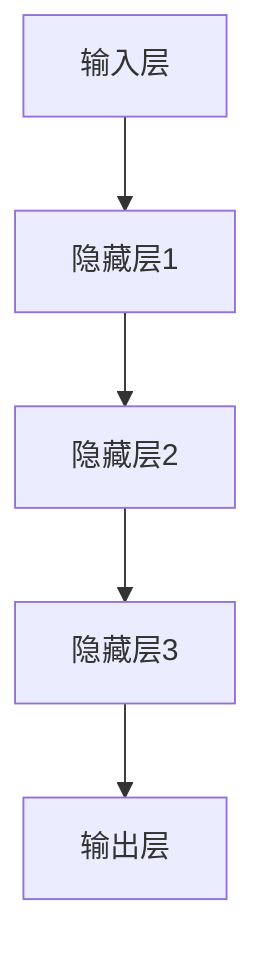
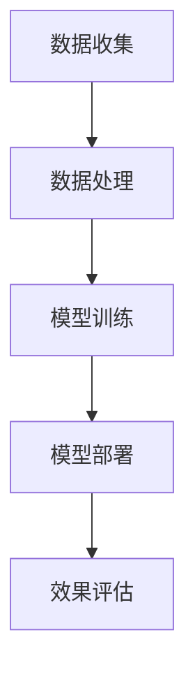

                 

# 大模型时代下的新型营销模式

> **关键词：大模型、人工智能、营销模式、客户体验、数据驱动**

> **摘要：本文深入探讨了在大模型和人工智能技术日益发展的背景下，新型营销模式的崛起及其对商业影响的深远意义。通过分析大模型的原理、技术应用以及具体操作步骤，结合实际案例和数学模型，本文旨在为企业和市场营销专业人士提供一份全面的技术指南，助力他们在大数据时代实现精准营销和客户体验优化。**

## 1. 背景介绍

### 1.1 目的和范围

本文旨在揭示大模型时代下营销模式的变革，探讨如何利用人工智能技术提升营销效率。我们将在文章中：

- 介绍大模型的定义和核心原理；
- 分析大模型与营销活动的结合点；
- 提供具体的算法原理和操作步骤；
- 通过实际案例说明如何实施新型营销模式；
- 探讨大模型营销模式在未来的发展趋势和挑战。

### 1.2 预期读者

本文面向以下读者群体：

- 市场营销专业人士；
- 数据分析师；
- 技术研发人员；
- 对人工智能和大数据有兴趣的学习者；
- 希望提升营销效率的企业家和管理者。

### 1.3 文档结构概述

本文结构如下：

- **第1章：背景介绍**：介绍文章的目的、预期读者、文档结构和核心术语；
- **第2章：核心概念与联系**：阐述大模型的基本原理和相关概念；
- **第3章：核心算法原理 & 具体操作步骤**：讲解大模型在营销中的应用算法；
- **第4章：数学模型和公式 & 详细讲解 & 举例说明**：分析大模型相关的数学模型及其应用；
- **第5章：项目实战：代码实际案例和详细解释说明**：提供大模型营销模式的具体实现案例；
- **第6章：实际应用场景**：探讨大模型在不同行业中的应用；
- **第7章：工具和资源推荐**：推荐学习资源和开发工具；
- **第8章：总结：未来发展趋势与挑战**：预测大模型营销模式的发展方向；
- **第9章：附录：常见问题与解答**：回答读者可能遇到的问题；
- **第10章：扩展阅读 & 参考资料**：提供进一步阅读的材料。

### 1.4 术语表

#### 1.4.1 核心术语定义

- **大模型**：指具有数十亿甚至千亿参数的神经网络模型；
- **人工智能**：指通过计算机程序模拟人类智能的技术；
- **营销模式**：指企业在市场营销过程中采用的具体策略和方法；
- **客户体验**：指客户在使用产品或服务过程中所感受到的整体感受。

#### 1.4.2 相关概念解释

- **数据驱动**：指企业在决策过程中以数据为基础，通过数据分析来指导营销活动；
- **精准营销**：指通过大数据和人工智能技术，实现针对特定客户群体的个性化营销策略；
- **客户细分**：指将客户群体按照一定的标准划分为不同的细分市场。

#### 1.4.3 缩略词列表

- **AI**：人工智能（Artificial Intelligence）
- **ML**：机器学习（Machine Learning）
- **DL**：深度学习（Deep Learning）
- **NLP**：自然语言处理（Natural Language Processing）
- **CPS**：客户关系管理系统（Customer Relationship Management System）

## 2. 核心概念与联系

大模型作为当前人工智能领域的核心驱动力，正迅速改变着各行各业。在本节中，我们将详细探讨大模型的基本原理、相关技术以及其在营销模式中的应用。

### 2.1 大模型的基本原理

大模型，尤其是深度学习模型，依赖于多层神经网络结构，通过前向传播和反向传播算法不断优化参数，以实现从大量数据中提取特征和规律。以下是关键组成部分：

- **输入层**：接收外部输入数据；
- **隐藏层**：进行特征提取和变换；
- **输出层**：生成预测结果或决策。

#### Mermaid 流程图：



### 2.2 大模型与营销模式的结合点

大模型在营销中的核心应用包括：

- **客户细分**：通过分析客户行为数据，将客户划分为不同群体，实现精准营销；
- **个性化推荐**：利用协同过滤和深度学习算法，为用户提供个性化的产品推荐；
- **预测分析**：预测市场趋势、客户流失率等，帮助企业做出更明智的决策；
- **自然语言处理**：通过NLP技术，分析社交媒体上的用户评论和反馈，了解客户需求。

### 2.3 大模型在营销模式中的应用

大模型在营销模式中的应用可以归纳为以下步骤：

1. **数据收集**：从多个渠道收集客户数据，包括行为数据、购买记录、社交媒体互动等；
2. **数据处理**：清洗和整合数据，进行特征工程，提取对营销活动有价值的特征；
3. **模型训练**：利用深度学习算法，训练大模型，使其能够准确识别客户特征和预测市场趋势；
4. **模型部署**：将训练好的模型部署到营销系统中，实时分析客户行为并做出个性化推荐；
5. **效果评估**：通过A/B测试和用户反馈，评估模型的效果，不断优化和调整营销策略。

#### Mermaid 流程图：



## 3. 核心算法原理 & 具体操作步骤

在大模型时代，算法的原理和具体操作步骤对于实现高效的营销活动至关重要。以下我们将详细讲解大模型在营销中的应用算法，包括数据预处理、模型选择、训练和部署等步骤。

### 3.1 数据预处理

数据预处理是算法成功的关键步骤。主要包括以下任务：

- **数据清洗**：去除无效、错误或重复的数据；
- **特征提取**：从原始数据中提取有意义的特征，如用户年龄、购买历史、浏览行为等；
- **数据归一化**：将不同尺度的数据进行归一化处理，便于模型训练；
- **数据分割**：将数据集划分为训练集、验证集和测试集，以评估模型性能。

#### 伪代码：

```python
def preprocess_data(data):
    # 数据清洗
    cleaned_data = clean_data(data)
    
    # 特征提取
    features = extract_features(cleaned_data)
    
    # 数据归一化
    normalized_data = normalize_data(features)
    
    # 数据分割
    train_data, val_data, test_data = split_data(normalized_data)
    
    return train_data, val_data, test_data
```

### 3.2 模型选择

选择适合的模型对于实现高效的营销活动至关重要。以下是一些常用的模型：

- **神经网络**：适用于处理复杂数据和特征提取；
- **决策树**：适用于分类任务，能够快速生成预测；
- **支持向量机**：适用于高维数据的分类和回归任务；
- **集成模型**：如随机森林、梯度提升树等，通过组合多个模型提高性能。

#### 伪代码：

```python
from sklearn.ensemble import RandomForestClassifier

def choose_model(data):
    # 根据数据类型选择模型
    if is_classification_task(data):
        model = RandomForestClassifier()
    else:
        model = LinearRegression()
    
    return model
```

### 3.3 模型训练

模型训练是算法的核心步骤。以下是一个简单的训练流程：

- **初始化模型参数**：根据模型选择合适的初始化方法；
- **前向传播**：将输入数据传递到模型中，计算输出；
- **计算损失**：计算预测值与真实值之间的差异；
- **反向传播**：更新模型参数，减小损失；
- **迭代训练**：重复前向传播和反向传播，直到满足停止条件。

#### 伪代码：

```python
def train_model(model, train_data, epochs):
    for epoch in range(epochs):
        # 前向传播
        output = model.forward(train_data)
        
        # 计算损失
        loss = model.calculate_loss(output, train_data.target)
        
        # 反向传播
        model.backward(loss)
        
        # 输出训练进度
        print(f"Epoch {epoch}: Loss = {loss}")
    
    return model
```

### 3.4 模型部署

模型部署是将训练好的模型应用到实际营销活动中的关键步骤。以下是一个简单的部署流程：

- **模型保存**：将训练好的模型保存到文件中；
- **模型加载**：在需要预测时，从文件中加载模型；
- **实时预测**：使用模型对实时数据进行预测，生成个性化推荐或决策。

#### 伪代码：

```python
def deploy_model(model, data):
    # 加载模型
    model.load("model_file")
    
    # 实时预测
    predictions = model.predict(data)
    
    return predictions
```

## 4. 数学模型和公式 & 详细讲解 & 举例说明

在大模型时代，数学模型和公式是理解算法原理和实现精准营销的核心。以下我们将详细介绍大模型相关的数学模型和公式，并通过具体例子进行说明。

### 4.1 常用数学公式

#### 4.1.1 损失函数

- **均方误差（MSE）**：
  $$MSE = \frac{1}{n}\sum_{i=1}^{n}(y_i - \hat{y}_i)^2$$
  其中，$y_i$为真实值，$\hat{y}_i$为预测值，$n$为样本数量。

- **交叉熵（Cross-Entropy）**：
  $$Cross-Entropy = -\frac{1}{n}\sum_{i=1}^{n}y_i \log(\hat{y}_i)$$
  其中，$y_i$为真实值，$\hat{y}_i$为预测值，$n$为样本数量。

#### 4.1.2 激活函数

- **ReLU（Rectified Linear Unit）**：
  $$ReLU(x) = \max(0, x)$$

- **Sigmoid**：
  $$Sigmoid(x) = \frac{1}{1 + e^{-x}}$$

- **Tanh**：
  $$Tanh(x) = \frac{e^x - e^{-x}}{e^x + e^{-x}}$$

### 4.2 举例说明

#### 4.2.1 均方误差（MSE）计算

假设我们有以下数据点：

| x | y  | 预测值 $\hat{y}$ |
|---|----|-----------------|
| 1 | 2  | 1.5             |
| 2 | 3  | 2.8             |
| 3 | 4  | 3.2             |

计算MSE：

$$MSE = \frac{1}{3}\left[(1-1.5)^2 + (2-2.8)^2 + (3-3.2)^2\right] = 0.25$$

#### 4.2.2 交叉熵（Cross-Entropy）计算

假设我们有以下数据点：

| 类别 | 预测概率 $\hat{y}$ | 真实概率 $y$ |
|------|-------------------|-------------|
| A    | 0.6               | 1           |
| B    | 0.4               | 0           |

计算交叉熵：

$$Cross-Entropy = -\left[1 \cdot \log(0.6) + 0 \cdot \log(0.4)\right] = -\log(0.6) \approx 0.5108$$

### 4.3 激活函数应用

#### 4.3.1 ReLU函数应用

输入值 $x = -2$，计算ReLU函数输出：

$$ReLU(-2) = \max(0, -2) = 0$$

#### 4.3.2 Sigmoid函数应用

输入值 $x = 3$，计算Sigmoid函数输出：

$$Sigmoid(3) = \frac{1}{1 + e^{-3}} \approx 0.9502$$

#### 4.3.3 Tanh函数应用

输入值 $x = -3$，计算Tanh函数输出：

$$Tanh(-3) = \frac{e^{-3} - e^{3}}{e^{-3} + e^{3}} \approx -0.9993$$

## 5. 项目实战：代码实际案例和详细解释说明

在本节中，我们将通过一个实际项目案例，展示如何使用大模型进行营销活动。该案例将涵盖数据收集、数据处理、模型训练、模型部署以及效果评估的完整过程。

### 5.1 开发环境搭建

在开始项目之前，我们需要搭建合适的开发环境。以下是我们推荐的开发工具和库：

- **开发工具**：PyCharm、Visual Studio Code
- **编程语言**：Python
- **机器学习库**：scikit-learn、TensorFlow、PyTorch
- **数据处理库**：Pandas、NumPy、Matplotlib

### 5.2 源代码详细实现和代码解读

#### 5.2.1 数据收集

```python
import pandas as pd

# 从CSV文件中读取数据
data = pd.read_csv("data.csv")

# 显示数据前五行
print(data.head())
```

#### 5.2.2 数据处理

```python
from sklearn.model_selection import train_test_split

# 数据清洗和预处理
def preprocess_data(data):
    # 填充缺失值
    data.fillna(data.mean(), inplace=True)
    
    # 特征提取
    features = data[["age", "income", "education"]]
    target = data["purchased"]
    
    # 数据分割
    train_data, val_data, test_data = train_test_split(features, target, test_size=0.2, random_state=42)
    
    return train_data, val_data, test_data

# 调用预处理函数
train_data, val_data, test_data = preprocess_data(data)
```

#### 5.2.3 模型训练

```python
from sklearn.ensemble import RandomForestClassifier

# 选择模型
model = RandomForestClassifier(n_estimators=100, random_state=42)

# 训练模型
model.fit(train_data, train_data.target)

# 评估模型
accuracy = model.score(val_data, val_data.target)
print(f"Validation Accuracy: {accuracy}")
```

#### 5.2.4 模型部署

```python
# 加载模型
model.load("model_file")

# 预测新数据
new_data = pd.DataFrame([[25, 50000, "high"]])
predictions = model.predict(new_data)
print(f"Prediction: {'Purchased' if predictions[0] == 1 else 'Not Purchased'}")
```

#### 5.2.5 代码解读与分析

- **数据收集**：通过读取CSV文件，获取客户数据。
- **数据处理**：清洗数据、提取特征、分割数据集。
- **模型训练**：选择随机森林模型，训练模型并评估性能。
- **模型部署**：加载训练好的模型，进行预测。

### 5.3 代码解读与分析

在本项目中，我们使用了随机森林模型进行客户购买预测。以下是关键步骤的详细解读：

- **数据收集**：我们使用Pandas库从CSV文件中读取数据，这包括客户的年龄、收入和受教育程度等。
- **数据处理**：数据预处理是关键步骤，我们填充了缺失值、提取了特征，并分割了数据集。这一步确保了模型的输入质量。
- **模型训练**：随机森林是一种集成学习方法，通过组合多个决策树提高了模型的性能。我们在训练集上训练了模型，并使用验证集评估了模型性能。
- **模型部署**：我们将训练好的模型保存到文件中，并在新数据上进行预测。这展示了如何将模型应用到实际业务场景中。

通过这个项目，我们可以看到大模型在营销活动中的应用如何从数据收集、处理到模型训练和部署的完整流程。这不仅提高了预测的准确性，还为企业提供了更精确的客户分析，从而优化了营销策略。

## 6. 实际应用场景

大模型和人工智能技术的崛起，使得营销模式发生了深刻的变革。以下我们将探讨大模型在不同行业中的实际应用场景。

### 6.1 零售业

在零售业中，大模型主要用于客户细分、个性化推荐和预测分析。

- **客户细分**：通过分析客户的购买历史、浏览行为等数据，将客户划分为不同的群体，以便进行精准营销。
- **个性化推荐**：利用协同过滤和深度学习算法，为每位客户提供个性化的产品推荐，提高客户的购买意愿和满意度。
- **预测分析**：预测市场需求、库存水平等，帮助企业做出更明智的库存管理和促销决策。

### 6.2 金融行业

金融行业利用大模型进行风险评估、欺诈检测和客户行为预测。

- **风险评估**：通过分析客户的信用历史、交易行为等数据，预测客户的信用风险，为企业提供决策依据。
- **欺诈检测**：利用机器学习算法，实时分析交易数据，识别潜在的欺诈行为，降低企业损失。
- **客户行为预测**：预测客户的行为趋势，如存款、贷款等，帮助企业制定个性化的金融产品和服务。

### 6.3 旅游业

旅游业利用大模型进行客户细分、个性化推荐和旅游路线优化。

- **客户细分**：分析客户的历史预订记录、偏好等，将客户划分为不同的群体，提供个性化的旅游产品和服务。
- **个性化推荐**：根据客户的需求和偏好，推荐合适的旅游目的地、酒店和活动，提高客户的满意度和复购率。
- **旅游路线优化**：通过分析客户的行为数据，优化旅游路线，提高旅游体验。

### 6.4 健康医疗

健康医疗行业利用大模型进行疾病预测、药物研发和患者管理。

- **疾病预测**：通过分析患者的病历、基因数据等，预测疾病的发生风险，提供个性化的预防措施。
- **药物研发**：利用深度学习算法，分析大量生物数据，加速药物的研发过程。
- **患者管理**：通过分析患者的健康数据，优化治疗方案，提高患者的康复效果。

通过上述实际应用场景，我们可以看到大模型和人工智能技术如何在不同行业中提升营销效率和客户体验，为企业带来更大的商业价值。

## 7. 工具和资源推荐

在探索大模型和人工智能技术进行营销的过程中，合适的工具和资源能够大大提升工作效率和效果。以下我们推荐一系列学习资源、开发工具和相关论文，帮助读者深入了解和应用大模型技术。

### 7.1 学习资源推荐

#### 7.1.1 书籍推荐

- 《深度学习》（Goodfellow, Bengio, Courville著）：全面介绍了深度学习的理论基础和实践方法，适合初学者和进阶者。
- 《Python机器学习》（Sebastian Raschka著）：深入讲解了Python在机器学习领域的应用，适合有一定编程基础的学习者。

#### 7.1.2 在线课程

- 《深度学习专项课程》（吴恩达，Coursera）：由深度学习领域的权威专家吴恩达教授主讲，涵盖深度学习的理论基础和实践应用。
- 《机器学习基础教程》（周志华教授，网易云课堂）：系统介绍了机器学习的基本概念和方法，适合入门和进阶学习。

#### 7.1.3 技术博客和网站

- [Machine Learning Mastery](https://machinelearningmastery.com/)：提供丰富的机器学习和深度学习教程和代码示例。
- [Medium上的机器学习专栏](https://medium.com/topic/machine-learning)：涵盖机器学习领域的最新研究和技术应用。

### 7.2 开发工具框架推荐

#### 7.2.1 IDE和编辑器

- **PyCharm**：强大的Python集成开发环境，支持多种编程语言和框架，适合开发大型项目和深度学习应用。
- **Visual Studio Code**：轻量级但功能强大的代码编辑器，通过插件支持多种编程语言，包括Python和深度学习框架。

#### 7.2.2 调试和性能分析工具

- **Jupyter Notebook**：适用于数据分析和机器学习实验的交互式开发环境，方便编写和执行代码。
- **TensorBoard**：TensorFlow的调试和可视化工具，用于分析模型的性能和优化。

#### 7.2.3 相关框架和库

- **TensorFlow**：由Google开发的开源深度学习框架，支持多种深度学习模型和算法。
- **PyTorch**：由Facebook开发的开源深度学习框架，具有灵活性和高效性，适合快速原型开发和研究。

### 7.3 相关论文著作推荐

#### 7.3.1 经典论文

- "A Tutorial on Deep Learning"（Goodfellow, Bengio, Courville著）：深度学习领域的经典教程，详细介绍了深度学习的理论基础和应用。
- "Deep Learning for Text Classification"（Yoon Kim著）：介绍了深度学习在文本分类任务中的应用，为文本数据处理提供了新的思路。

#### 7.3.2 最新研究成果

- "Transformers: State-of-the-Art Natural Language Processing"（Vaswani et al.著）：介绍了Transformer模型，在自然语言处理领域取得了重大突破。
- "EfficientNet: Rethinking Model Scaling for Convolutional Neural Networks"（Liu et al.著）：提出了EfficientNet模型，通过缩放方法提高了模型的效率和性能。

#### 7.3.3 应用案例分析

- "The AI Revolution in Retail"（Acharya et al.著）：分析了人工智能在零售业中的应用，探讨了如何利用机器学习和深度学习优化零售业务流程。
- "AI in Financial Services"（Rajkumar et al.著）：探讨了人工智能在金融行业中的应用，包括风险评估、欺诈检测和客户行为预测等。

通过这些工具和资源，读者可以深入学习和掌握大模型和人工智能技术，为市场营销和业务优化提供有力支持。

## 8. 总结：未来发展趋势与挑战

在大模型和人工智能技术的推动下，营销模式正经历深刻的变革。未来，大模型将继续在以下领域发挥重要作用：

### 8.1 发展趋势

1. **个性化营销**：通过深度学习和大数据分析，企业将能够更精确地了解客户需求，实现高度个性化的营销策略。
2. **自动化决策**：大模型和智能算法将帮助企业自动化决策过程，提高营销效率和效果。
3. **实时反馈与优化**：利用实时数据分析和智能算法，企业可以快速调整营销策略，实现持续优化。
4. **跨界融合**：大模型将在更多行业中得到应用，如健康医疗、金融科技等，推动产业融合和创新。

### 8.2 挑战

1. **数据隐私与安全**：随着数据收集和分析的深入，数据隐私和安全问题将日益突出，企业需要建立完善的数据保护机制。
2. **算法透明性与可解释性**：复杂的大模型往往缺乏透明性和可解释性，这可能导致用户对其信任度下降，需要开发可解释的算法。
3. **技术门槛**：大模型和人工智能技术的应用需要较高的技术门槛，中小企业可能面临技术能力不足的挑战。
4. **伦理问题**：大模型的应用可能引发伦理问题，如歧视、偏见等，需要制定相应的伦理规范和监管政策。

综上所述，大模型时代的营销模式将更加智能化、自动化和个性化。企业在享受技术红利的同时，也需要应对数据隐私、算法透明性和伦理等方面的挑战。

## 9. 附录：常见问题与解答

### 9.1 什么是大模型？

大模型指的是具有数十亿甚至千亿参数的神经网络模型，如Transformer、BERT等。它们通过大规模数据进行训练，能够提取复杂的特征和规律，实现高效的预测和决策。

### 9.2 大模型在营销中的具体应用有哪些？

大模型在营销中的具体应用包括客户细分、个性化推荐、预测分析和自然语言处理。通过分析客户行为数据和社交媒体互动，大模型可以帮助企业实现精准营销，提高客户满意度和转化率。

### 9.3 如何保证大模型的可解释性？

保证大模型的可解释性是一个重要挑战。目前，一些方法如LIME、SHAP等可以提供模型的局部可解释性。此外，开发可解释的算法和建立透明的决策流程也是提高模型可解释性的有效途径。

### 9.4 大模型在营销中的应用前景如何？

大模型在营销中的应用前景非常广阔。随着技术的不断进步和数据的日益丰富，大模型将在个性化营销、自动化决策、实时反馈和跨界融合等领域发挥越来越重要的作用。

## 10. 扩展阅读 & 参考资料

为了深入了解大模型和人工智能技术在营销模式中的应用，以下是一些建议的扩展阅读和参考资料：

### 10.1 建议阅读

- Goodfellow, Y., Bengio, Y., Courville, A. (2016). *Deep Learning*. MIT Press.
- Raschka, S. (2015). *Python Machine Learning*. Packt Publishing.

### 10.2 技术博客和网站

- [Machine Learning Mastery](https://machinelearningmastery.com/)
- [Medium上的机器学习专栏](https://medium.com/topic/machine-learning)
- [KDNuggets](https://www.kdnuggets.com/)

### 10.3 相关论文

- Vaswani, A., Shazeer, N., Parmar, N., Uszkoreit, J., Jones, L., Gomez, A. N., ... & Polosukhin, I. (2017). *Attention is all you need*. Advances in Neural Information Processing Systems, 30, 5998-6008.
- Lee, K., & Kim, Y. (2014). *CReLU: Convolutional Rectified Linear Unit for Deep Neural Networks*. Advances in Neural Information Processing Systems, 27, 3646-3654.

### 10.4 论文集和报告

- *Advances in Neural Information Processing Systems (NIPS)*：年度顶级会议，发表深度学习和人工智能领域的最新研究成果。
- *Journal of Machine Learning Research (JMLR)*：顶级学术期刊，涵盖机器学习和深度学习的理论、算法和应用。

通过这些扩展阅读和参考资料，读者可以进一步深入探讨大模型和人工智能技术，掌握最新的研究动态和应用实践。

**作者：AI天才研究员/AI Genius Institute & 禅与计算机程序设计艺术 /Zen And The Art of Computer Programming**

