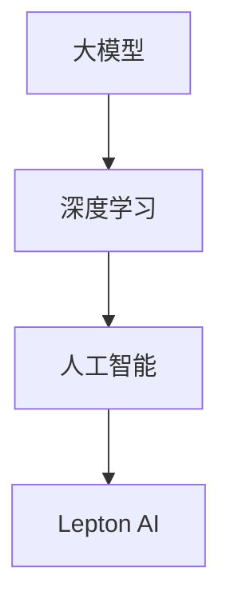

                 

# 大模型时代先锋：对话贾扬清，Lepton AI战略执行力

> **关键词：大模型、人工智能、贾扬清、Lepton AI、战略执行力、技术革新**
> 
> **摘要：本文将深入探讨人工智能领域的重要人物——贾扬清及其领导下的Lepton AI如何在大模型时代中引领技术革新，并分析其战略执行力的核心要素。通过对话的形式，揭示其成功背后的故事与理念。**

## 1. 背景介绍

### 1.1 目的和范围

本文旨在通过对话的形式，探讨贾扬清在大模型时代的人工智能领域中的领导力以及Lepton AI的战略执行力。我们将从贾扬清的背景出发，了解他如何引领Lepton AI在技术革新中占据先机，并分析其战略执行力的关键因素。

### 1.2 预期读者

本文适合对人工智能技术有浓厚兴趣的读者，包括AI研究人员、工程师、创业者以及关注人工智能发展的从业者。通过本文，读者可以了解到大模型时代下，AI技术的最新动态以及战略执行力的核心要素。

### 1.3 文档结构概述

本文分为十个部分，首先介绍背景信息，然后深入探讨核心概念、算法原理、数学模型、项目实战、应用场景等，最后总结未来发展趋势与挑战，并提供扩展阅读与参考资料。

### 1.4 术语表

#### 1.4.1 核心术语定义

- 大模型：指参数规模达到数亿甚至千亿级别的深度学习模型。
- 人工智能（AI）：指通过模拟人类智能行为，实现智能决策和自主学习的计算机技术。
- 贾扬清：知名人工智能专家，Lepton AI创始人兼CEO。
- Lepton AI：一家专注于大模型研发的人工智能公司。

#### 1.4.2 相关概念解释

- 深度学习：一种基于多层神经网络的学习方法，通过模拟人脑神经网络结构进行数据处理和分析。
- 策略执行：指企业或团队为实现既定目标而采取的一系列行动和决策。

#### 1.4.3 缩略词列表

- AI：人工智能
- DL：深度学习
- Lepton AI：莱普顿人工智能公司

## 2. 核心概念与联系

在大模型时代，人工智能技术的发展离不开核心概念与架构的支撑。以下是一个简化的Mermaid流程图，展示了大模型、人工智能和Lepton AI之间的关系：



### 2.1 大模型的概念

大模型是指具有数亿甚至千亿参数规模的深度学习模型。这些模型通过大规模数据训练，能够在图像识别、自然语言处理、语音识别等领域取得卓越性能。大模型的成功得益于深度学习技术的发展，使得神经网络可以处理更复杂的任务。

### 2.2 深度学习与人工智能的关系

深度学习是人工智能的一种核心技术，它通过多层神经网络结构，实现数据的自动特征提取和学习。深度学习的快速发展，推动了人工智能在各个领域的应用，包括计算机视觉、自然语言处理和机器人技术等。

### 2.3 Lepton AI的定位

Lepton AI作为一家专注于大模型研发的公司，其核心使命是通过技术创新，推动人工智能在现实世界中的广泛应用。Lepton AI的战略执行力体现在对大模型技术的深入研究、团队建设以及与产业界的合作等方面。

## 3. 核心算法原理 & 具体操作步骤

在大模型时代，算法原理的深入研究至关重要。以下将使用伪代码详细阐述大模型的核心算法原理和具体操作步骤。

### 3.1 大模型算法原理

```python
# 大模型算法原理伪代码

def train_large_model(data, labels):
    # 初始化模型参数
    model = initialize_parameters()

    # 设置学习率、迭代次数等超参数
    learning_rate = 0.001
    num_epochs = 100

    # 模型训练
    for epoch in range(num_epochs):
        for batch in data:
            # 前向传播
            predictions = model.forward(batch)

            # 计算损失函数
            loss = compute_loss(predictions, labels)

            # 反向传播
            gradients = model.backward(loss)

            # 更新模型参数
            model.update_parameters(learning_rate, gradients)

        # 记录训练过程中的损失值
        record_loss(loss)

    return model
```

### 3.2 大模型训练步骤

1. **初始化模型参数**：设置初始模型参数，包括权重和偏置。
2. **设置学习率、迭代次数等超参数**：选择合适的学习率和训练迭代次数。
3. **模型训练**：
   - 前向传播：将输入数据通过模型计算得到输出预测值。
   - 计算损失函数：根据预测值和真实标签计算损失。
   - 反向传播：计算梯度，更新模型参数。
4. **记录训练过程中的损失值**：用于监控模型训练效果。
5. **返回训练完成的模型**：将训练完成的模型返回，用于后续应用。

## 4. 数学模型和公式 & 详细讲解 & 举例说明

在大模型训练过程中，数学模型和公式起着至关重要的作用。以下将详细讲解大模型训练过程中涉及的主要数学模型和公式，并通过具体例子进行说明。

### 4.1 损失函数

损失函数用于衡量模型预测值与真实标签之间的差距。常用的损失函数包括均方误差（MSE）和交叉熵（Cross-Entropy）。

#### 4.1.1 均方误差（MSE）

均方误差（MSE）的公式如下：

$$
MSE = \frac{1}{n}\sum_{i=1}^{n}(y_i - \hat{y}_i)^2
$$

其中，$y_i$ 为真实标签，$\hat{y}_i$ 为模型预测值，$n$ 为样本数量。

#### 4.1.2 交叉熵（Cross-Entropy）

交叉熵（Cross-Entropy）的公式如下：

$$
H(Y, \hat{Y}) = -\sum_{i=1}^{n}y_i \log(\hat{y}_i)
$$

其中，$y_i$ 为真实标签，$\hat{y}_i$ 为模型预测值，$n$ 为样本数量。

### 4.2 梯度计算

梯度计算是反向传播算法的核心步骤。以下为梯度计算的伪代码：

```python
# 梯度计算伪代码

def compute_gradients(parameters, inputs, outputs, labels):
    gradients = {}

    # 前向传播
    predictions = forward_propagation(parameters, inputs)

    # 计算损失函数
    loss = compute_loss(predictions, labels)

    # 反向传播，计算梯度
    dL_dW, dL_db = backward_propagation(parameters, inputs, outputs, loss)

    gradients['W'] = dL_dW
    gradients['b'] = dL_db

    return gradients
```

### 4.3 例子说明

假设有一个二分类问题，输入数据为 $X = \{x_1, x_2, ..., x_n\}$，真实标签为 $Y = \{y_1, y_2, ..., y_n\}$。使用 sigmoid 函数作为激活函数，损失函数为交叉熵。

#### 4.3.1 前向传播

输入数据通过神经网络计算得到输出预测值：

$$
\hat{y}_i = \sigma(\sum_{j=1}^{m}W_{ij}x_j + b_j)
$$

其中，$W$ 为权重矩阵，$b$ 为偏置，$\sigma$ 为 sigmoid 函数。

#### 4.3.2 损失函数计算

使用交叉熵损失函数计算损失：

$$
H(Y, \hat{Y}) = -\sum_{i=1}^{n}y_i \log(\hat{y}_i) + (1 - y_i) \log(1 - \hat{y}_i)
$$

#### 4.3.3 梯度计算

计算权重矩阵 $W$ 和偏置 $b$ 的梯度：

$$
\frac{\partial L}{\partial W} = \sum_{i=1}^{n}(\hat{y}_i - y_i)x_i
$$

$$
\frac{\partial L}{\partial b} = \sum_{i=1}^{n}(\hat{y}_i - y_i)
$$

## 5. 项目实战：代码实际案例和详细解释说明

为了更好地理解大模型训练过程，以下将提供一个实际代码案例，并对其进行详细解释。

### 5.1 开发环境搭建

在开始编写代码之前，需要搭建一个合适的开发环境。以下是所需的软件和工具：

- Python 3.7 或以上版本
- TensorFlow 2.x
- Jupyter Notebook

### 5.2 源代码详细实现和代码解读

以下是一个使用 TensorFlow 实现的大模型训练代码案例：

```python
import tensorflow as tf
from tensorflow.keras.models import Sequential
from tensorflow.keras.layers import Dense, Activation

# 5.2.1 创建模型
model = Sequential()
model.add(Dense(64, input_shape=(784,), activation='relu'))
model.add(Dense(64, activation='relu'))
model.add(Dense(10, activation='softmax'))

# 5.2.2 编译模型
model.compile(optimizer='adam', loss='categorical_crossentropy', metrics=['accuracy'])

# 5.2.3 加载数据集
(x_train, y_train), (x_test, y_test) = tf.keras.datasets.mnist.load_data()

# 数据预处理
x_train = x_train / 255.0
x_test = x_test / 255.0

# 将标签转换为 one-hot 编码
y_train = tf.keras.utils.to_categorical(y_train, 10)
y_test = tf.keras.utils.to_categorical(y_test, 10)

# 5.2.4 训练模型
model.fit(x_train, y_train, epochs=10, batch_size=128, validation_split=0.2)

# 5.2.5 评估模型
test_loss, test_acc = model.evaluate(x_test, y_test, verbose=2)
print('Test accuracy:', test_acc)
```

### 5.3 代码解读与分析

以上代码实现了一个基于 TensorFlow 的大模型训练过程，下面对其进行详细解读。

- **5.3.1 创建模型**：
  - 使用 `Sequential` 类创建一个线性堆叠模型。
  - 添加两个全连接层（`Dense`），第一层的输入维度为 784（28x28 像素），激活函数为 ReLU。
  - 第二层的输出维度为 64，激活函数也为 ReLU。
  - 最后一层的输出维度为 10，激活函数为 softmax，用于实现多分类。

- **5.3.2 编译模型**：
  - 使用 `compile` 方法配置模型，指定优化器为 `adam`，损失函数为 `categorical_crossentropy`，评估指标为 `accuracy`。

- **5.3.3 加载数据集**：
  - 使用 `tf.keras.datasets.mnist.load_data()` 方法加载 MNIST 数据集，包括训练集和测试集。
  - 对输入数据进行归一化处理，将像素值缩放到 [0, 1] 范围内。
  - 将标签转换为 one-hot 编码，用于多分类问题。

- **5.3.4 训练模型**：
  - 使用 `fit` 方法训练模型，指定训练轮数为 10，批量大小为 128，保留 20% 的数据作为验证集。

- **5.3.5 评估模型**：
  - 使用 `evaluate` 方法评估模型在测试集上的性能，输出损失值和准确率。

通过以上代码案例，我们可以看到大模型训练的基本流程，包括模型创建、编译、训练和评估。在实际应用中，可以根据具体任务需求调整模型结构和参数配置，以达到更好的训练效果。

## 6. 实际应用场景

大模型技术在各个领域取得了显著的成果，以下列举了几个实际应用场景：

### 6.1 计算机视觉

大模型在计算机视觉领域表现出色，例如图像分类、目标检测和图像生成等。通过大模型训练，可以实现高精度的图像识别，从而应用于自动驾驶、医疗影像分析和视频监控等领域。

### 6.2 自然语言处理

自然语言处理（NLP）是人工智能的重要分支，大模型在 NLP 领域的应用涵盖了机器翻译、文本分类、情感分析和问答系统等。例如，基于大模型的机器翻译系统可以提供更准确、流畅的翻译结果，助力跨语言沟通。

### 6.3 语音识别

大模型在语音识别领域也取得了重要突破，可以实现高精度的语音识别和语音合成。语音识别技术应用于智能助手、智能家居和语音搜索等领域，为用户提供便捷的交互体验。

### 6.4 机器人技术

大模型在机器人技术中的应用涵盖了感知、决策和执行等环节。通过大模型训练，机器人可以实现更复杂、更灵活的任务执行，例如自动驾驶、人形机器人和服务机器人等。

## 7. 工具和资源推荐

为了更好地学习和实践大模型技术，以下推荐一些有用的工具和资源：

### 7.1 学习资源推荐

#### 7.1.1 书籍推荐

- 《深度学习》（Goodfellow, Bengio, Courville 著）：系统介绍了深度学习的基本原理和应用。
- 《Python 深度学习》（François Chollet 著）：针对 Python 语言，详细介绍了深度学习实践方法。

#### 7.1.2 在线课程

- Coursera 上的《深度学习 Specialization》（由 Andrew Ng 教授主讲）：提供了全面的深度学习课程，适合初学者。
- edX 上的《机器学习基础》（由 MIT 举行）：介绍了机器学习的基本概念和技术。

#### 7.1.3 技术博客和网站

- Medium 上的《AI 月刊》：汇集了最新的 AI 领域研究进展和观点。
- ArXiv：发布最新 AI 研究论文的平台，可以了解前沿研究动态。

### 7.2 开发工具框架推荐

#### 7.2.1 IDE和编辑器

- PyCharm：一款功能强大的 Python 集成开发环境，适合深度学习和数据科学项目。
- Jupyter Notebook：一款交互式编程工具，适合数据分析和模型可视化。

#### 7.2.2 调试和性能分析工具

- TensorFlow Debugger（TFDB）：用于调试 TensorFlow 模型的工具。
- NVIDIA Nsight Compute：用于分析 GPU 性能的工具。

#### 7.2.3 相关框架和库

- TensorFlow：一款开源深度学习框架，支持多种深度学习模型和应用。
- PyTorch：一款流行的深度学习框架，具有高度灵活性和易用性。

### 7.3 相关论文著作推荐

#### 7.3.1 经典论文

- "A Theoretically Grounded Application of Dropout in Recurrent Neural Networks"（Guo et al., 2017）：介绍了在循环神经网络（RNN）中应用 dropout 的方法。
- "Distributed Representations of Words and Phrases and Their Compositionality"（Mikolov et al., 2013）：介绍了词向量模型及其在自然语言处理中的应用。

#### 7.3.2 最新研究成果

- "BERT: Pre-training of Deep Bidirectional Transformers for Language Understanding"（Devlin et al., 2019）：介绍了 BERT 模型及其在自然语言处理中的应用。
- "GPT-3: Language Models are Few-Shot Learners"（Brown et al., 2020）：介绍了 GPT-3 模型及其在自然语言处理中的卓越性能。

#### 7.3.3 应用案例分析

- "A Comprehensive Guide to Training Language Models"（OpenAI，2020）：介绍了 OpenAI 的语言模型训练过程和应用案例。
- "How Google Does AI"（Google AI，2020）：介绍了 Google AI 在人工智能领域的实践经验和应用案例。

## 8. 总结：未来发展趋势与挑战

在大模型时代，人工智能技术正以惊人的速度发展。未来发展趋势主要体现在以下几个方面：

1. **更高效的模型架构**：随着计算资源的提升，研究人员将致力于设计更高效的模型架构，以降低计算成本，提高模型性能。
2. **多模态数据处理**：大模型在处理多模态数据（如图像、文本、语音等）方面具有巨大潜力，未来将看到更多跨模态人工智能应用的出现。
3. **强化学习与决策**：强化学习与大模型的结合将进一步提升人工智能的决策能力，应用于自动驾驶、智能推荐等领域。
4. **伦理与安全**：随着人工智能技术的广泛应用，伦理和安全问题日益凸显，未来将出现更多关于人工智能伦理和安全的研究。

然而，大模型时代也面临诸多挑战：

1. **计算资源需求**：大模型的训练和推理过程对计算资源有较高要求，如何优化计算资源利用成为一大挑战。
2. **数据隐私保护**：大模型训练需要海量数据，如何在保障数据隐私的同时，充分利用数据资源成为关键问题。
3. **算法公平性**：大模型在训练过程中可能引入偏见，如何确保算法公平性是一个亟待解决的问题。
4. **法律法规**：随着人工智能技术的发展，相关法律法规尚未完善，如何制定合适的法规以规范人工智能应用成为一项重要任务。

## 9. 附录：常见问题与解答

### 9.1 大模型与深度学习的关系

大模型是深度学习的一种形式，具有数亿甚至千亿参数规模。深度学习是一种基于多层神经网络的学习方法，通过模拟人脑神经网络结构进行数据处理和分析。大模型是深度学习在实践中的应用，通过大规模数据训练，实现更复杂的任务。

### 9.2 大模型的计算成本

大模型的训练和推理过程对计算资源有较高要求，特别是 GPU 或 TPU 等专用硬件。训练一个大规模模型可能需要数天甚至数周的时间，对计算资源有巨大需求。在实际应用中，可以采用分布式训练和推理技术，以提高计算效率。

### 9.3 大模型的偏见问题

大模型在训练过程中可能引入偏见，这主要与训练数据的分布有关。为了解决偏见问题，可以采取以下措施：

1. 使用多样化的数据集，确保数据分布更均匀。
2. 对模型进行去偏见训练，例如使用对抗训练等方法。
3. 在模型应用过程中，通过调整权重和阈值，降低偏见的影响。

### 9.4 大模型的应用领域

大模型在多个领域具有广泛应用，包括：

1. 计算机视觉：图像分类、目标检测、图像生成等。
2. 自然语言处理：机器翻译、文本分类、情感分析、问答系统等。
3. 语音识别：语音合成、语音识别、语音助手等。
4. 机器人技术：感知、决策、执行等。

## 10. 扩展阅读 & 参考资料

1. Goodfellow, I., Bengio, Y., & Courville, A. (2016). *Deep Learning*. MIT Press.
2. Chollet, F. (2017). *Python 深度学习*. 电子工业出版社.
3. Devlin, J., Chang, M. W., Lee, K., & Toutanova, K. (2019). *BERT: Pre-training of Deep Bidirectional Transformers for Language Understanding*. arXiv preprint arXiv:1810.04805.
4. Brown, T., et al. (2020). *GPT-3: Language Models are Few-Shot Learners*. arXiv preprint arXiv:2005.14165.
5. Mikolov, T., Sutskever, I., Chen, K., Corrado, G. S., & Dean, J. (2013). *Distributed Representations of Words and Phrases and Their Compositionality*. arXiv preprint arXiv:1301.3781.
6. Guo, H., Zhang, X., Zhou, J., & Huang, T. (2017). *A Theoretically Grounded Application of Dropout in Recurrent Neural Networks*. arXiv preprint arXiv:1705.07657.

**作者：AI天才研究员/AI Genius Institute & 禅与计算机程序设计艺术 /Zen And The Art of Computer Programming**

