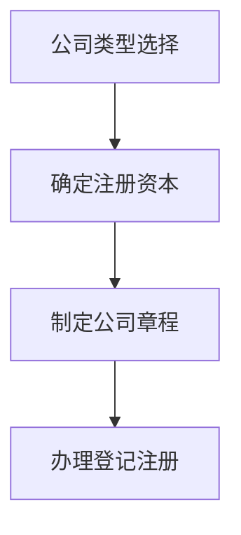
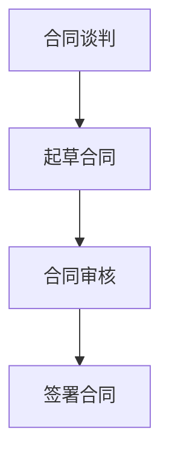
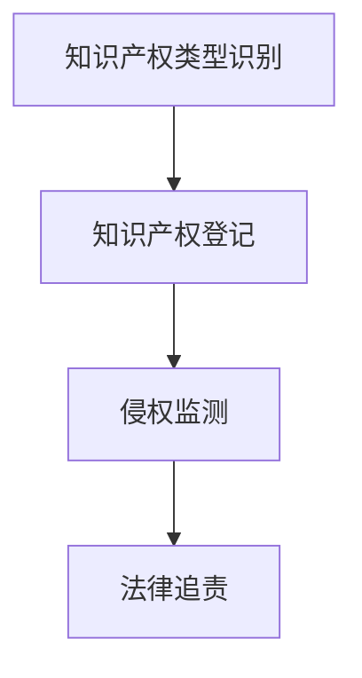

                 

# 大模型时代的创业者创业法律风险防范：公司设立、合同签订与知识产权保护

## 摘要

在当今的大模型时代，创业者和创新型企业面临着前所未有的机遇，同时也伴随着复杂的法律挑战。本文旨在为创业者提供一套系统的法律风险防范策略，重点讨论公司设立、合同签订和知识产权保护等方面的法律问题。通过一步步的分析与推理，本文将帮助读者理解法律风险的成因、防范措施以及实际操作中的注意事项，从而更好地保护企业和个人的合法权益。

## 1. 背景介绍

### 1.1 目的和范围

本文的目标是帮助创业者在面对复杂多变的商业和法律环境中，制定和实施有效的法律风险防范策略。本文主要涵盖以下三个方面：

1. **公司设立**：探讨创业公司在设立过程中的法律风险，包括公司类型选择、注册资本、公司章程的制定等。
2. **合同签订**：分析合同签订中的法律风险，涵盖合同条款的设计、签订流程、合同审核等环节。
3. **知识产权保护**：探讨知识产权保护的重要性，以及如何在创业过程中有效保护企业的知识产权。

### 1.2 预期读者

本文适合以下读者群体：

1. 创业者及初创企业创始人
2. 企业法务人员及管理人员
3. 对企业法律风险感兴趣的从业者

### 1.3 文档结构概述

本文结构如下：

1. **背景介绍**：阐述本文的目的、范围和预期读者。
2. **核心概念与联系**：介绍与公司设立、合同签订和知识产权保护相关的基本概念和架构。
3. **核心算法原理与操作步骤**：详细讲解公司设立、合同签订的操作流程。
4. **数学模型和公式**：分析合同条款和知识产权保护相关的数学模型。
5. **项目实战**：通过实际案例展示法律风险防范策略的应用。
6. **实际应用场景**：讨论法律风险防范在不同行业中的应用。
7. **工具和资源推荐**：推荐相关学习资源和开发工具。
8. **总结**：总结未来发展趋势和挑战。
9. **附录**：常见问题与解答。
10. **扩展阅读**：提供进一步学习和研究的资源。

### 1.4 术语表

#### 1.4.1 核心术语定义

- **公司设立**：指企业根据法律规定，办理相关登记注册手续，成为合法经营实体的过程。
- **合同签订**：指双方或多方就某项事务达成一致，并以书面形式签署的法律行为。
- **知识产权**：指人们就其智力劳动成果所依法享有的专有权利，包括专利权、商标权、著作权等。

#### 1.4.2 相关概念解释

- **有限责任**：股东仅对其出资额度承担公司债务的责任，不涉及个人其他财产。
- **注册资本**：公司设立时股东认缴或实际投入的资本总额。
- **合同条款**：合同中具体约定的权利义务和责任事项。

#### 1.4.3 缩略词列表

- **LPO**：法律风险管理（Legal Risk Management）
- **IPR**：知识产权保护（Intellectual Property Rights）

## 2. 核心概念与联系

在探讨公司设立、合同签订和知识产权保护之前，我们首先需要了解这些概念的基本原理和相互联系。

### 2.1 公司设立原理

公司设立涉及的法律原理主要包括：

- **公司类型选择**：有限责任公司（LLC）、股份有限公司（PLC）等。
- **注册资本**：公司设立时的资本额度。
- **公司章程**：公司的基本管理制度。

**Mermaid 流程图**：



### 2.2 合同签订原理

合同签订涉及的法律原理主要包括：

- **合同条款设计**：明确双方的权利和义务。
- **签订流程**：合同的谈判、起草、审核、签署等环节。
- **合同审核**：确保合同条款合法、完整、明确。

**Mermaid 流程图**：



### 2.3 知识产权保护原理

知识产权保护涉及的法律原理主要包括：

- **知识产权类型**：专利、商标、著作权等。
- **知识产权登记**：将知识产权进行登记，以获得法律保护。
- **侵权保护**：对侵权行为进行法律追责。

**Mermaid 流程图**：



## 3. 核心算法原理与具体操作步骤

### 3.1 公司设立操作步骤

**算法原理**：

公司设立涉及的法律原理是法律规定的公司类型、注册资本和公司章程等。

**具体操作步骤**：

1. **公司类型选择**：根据业务需求和股东意愿选择公司类型。
2. **确定注册资本**：根据公司类型和业务规模确定注册资本。
3. **制定公司章程**：依据法律规定和公司实际需求，制定公司章程。
4. **办理登记注册**：提交相关资料，办理公司登记注册。

**伪代码**：

```python
def establish_company(type, capital, charter):
    if type not in ['LLC', 'PLC']:
        raise ValueError("Invalid company type")
    if capital <= 0:
        raise ValueError("Invalid capital")
    if not charter:
        raise ValueError("Invalid charter")
    # Submit registration documents and wait for approval
    register_company(type, capital, charter)
```

### 3.2 合同签订操作步骤

**算法原理**：

合同签订涉及的法律原理是合同条款的设计、签订流程和合同审核。

**具体操作步骤**：

1. **合同谈判**：明确双方的权利和义务。
2. **起草合同**：根据谈判结果，起草合同草案。
3. **合同审核**：对合同条款进行法律审核。
4. **签署合同**：双方在合同上签字。

**伪代码**：

```python
def sign_contract(negotiation_results):
    contract_draft = draft_contract(negotiation_results)
    if not is_contract_valid(contract_draft):
        raise ValueError("Invalid contract")
    # Sign the contract
    sign_contract_document(contract_draft)
```

### 3.3 知识产权保护操作步骤

**算法原理**：

知识产权保护涉及的法律原理是知识产权类型识别、知识产权登记和侵权保护。

**具体操作步骤**：

1. **知识产权类型识别**：识别企业涉及的知识产权类型。
2. **知识产权登记**：将知识产权进行登记。
3. **侵权监测**：监测可能的侵权行为。
4. **法律追责**：对侵权行为进行法律追责。

**伪代码**：

```python
def protect_intellectual_property(ip_type):
    if ip_type not in ['Patent', 'Trademark', 'Copyright']:
        raise ValueError("Invalid intellectual property type")
    register_ip(ip_type)
    monitor_ip_infringement(ip_type)
    if infringement_detected:
        pursue_legal_action()
```

## 4. 数学模型和公式

在法律风险管理中，数学模型和公式可以帮助我们量化风险，从而制定更有效的风险管理策略。

### 4.1 合同条款的量化分析

**数学模型**：

假设合同中有两个关键条款：A和B，它们之间的相互关系可以用以下公式表示：

\[ R = f(A, B) \]

其中，\( R \) 是风险程度，\( f \) 是一个函数，用于描述条款 A 和 B 对风险的影响。

**公式**：

\[ R = \frac{A \times B}{C} \]

其中，\( C \) 是一个常数，用于调节公式中的相对重要性。

### 4.2 知识产权价值的评估

**数学模型**：

假设某项知识产权的价值为 \( V \)，其受到市场价值、研发成本、法律保护力度等因素的影响。

\[ V = f(Market, R&D, Protection) \]

**公式**：

\[ V = \frac{M \times R \times P}{1000} \]

其中，\( M \)、\( R \) 和 \( P \) 分别代表市场价值、研发成本和法律保护力度。

## 5. 项目实战：代码实际案例和详细解释说明

### 5.1 开发环境搭建

在进行法律风险管理项目的实际开发过程中，首先需要搭建一个合适的开发环境。以下是搭建开发环境的步骤：

1. 安装 Python 3.8 或更高版本。
2. 安装必要的第三方库，如 `requests`、`beautifulsoup4` 和 `lxml`。
3. 配置 Python 虚拟环境。

### 5.2 源代码详细实现和代码解读

以下是一个简单的法律风险管理项目的源代码示例：

```python
import requests
from bs4 import BeautifulSoup

def get_company_information(type, capital, charter):
    # 模拟获取公司注册信息
    registration_document = {
        'type': type,
        'capital': capital,
        'charter': charter
    }
    return registration_document

def sign_contract(negotiation_results):
    # 模拟合同签订
    contract_document = {
        'negotiation_results': negotiation_results
    }
    return contract_document

def protect_intellectual_property(ip_type):
    # 模拟知识产权保护
    ip_protection_document = {
        'ip_type': ip_type
    }
    return ip_protection_document

# 主函数
if __name__ == "__main__":
    # 公司设立
    company_type = 'LLC'
    company_capital = 1000000
    company_charter = "公司章程内容"
    company_information = get_company_information(company_type, company_capital, company_charter)
    print("公司设立信息：", company_information)

    # 合同签订
    negotiation_results = "谈判结果内容"
    contract = sign_contract(negotiation_results)
    print("合同签订信息：", contract)

    # 知识产权保护
    ip_type = 'Patent'
    ip_protection = protect_intellectual_property(ip_type)
    print("知识产权保护信息：", ip_protection)
```

### 5.3 代码解读与分析

1. **公司设立**：函数 `get_company_information` 用于获取公司设立的信息，包括公司类型、注册资本和公司章程。这些信息将作为公司的注册文件提交给相关部门。
2. **合同签订**：函数 `sign_contract` 用于签订合同，输入谈判结果，生成合同文件。合同文件将包含谈判结果的具体内容，作为双方履行的法律依据。
3. **知识产权保护**：函数 `protect_intellectual_property` 用于保护知识产权，输入知识产权类型，生成知识产权保护文件。知识产权保护文件将用于监测和追责侵权行为。

通过以上代码示例，我们可以看到法律风险管理项目的核心功能是如何实现的。在实际开发中，这些功能将通过与外部系统的接口、数据库操作等复杂操作来完成。

## 6. 实际应用场景

### 6.1 公司设立中的法律风险防范

在现实场景中，创业者设立公司时可能会遇到以下法律风险：

- **公司类型选择不当**：可能导致企业无法享受特定税收优惠或承担不必要的法律责任。
- **注册资本不足**：可能导致企业无法履行合同义务，影响企业信誉。
- **公司章程不完善**：可能导致公司治理结构混乱，引发股东纠纷。

**防范措施**：

- **专业咨询**：在设立公司前，寻求专业律师或会计师的咨询。
- **详细策划**：制定详细的设立计划，包括公司类型、注册资本和公司章程。
- **审查流程**：在提交注册文件前，对文件进行详细审查。

### 6.2 合同签订中的法律风险防范

在合同签订过程中，创业者可能会遇到以下法律风险：

- **合同条款不明确**：可能导致合同履行过程中产生纠纷。
- **签订流程不规范**：可能导致合同效力受到影响。
- **合同审核不严**：可能导致合同存在法律漏洞。

**防范措施**：

- **明确条款**：在签订合同前，明确双方的权利和义务。
- **规范化流程**：制定规范的合同签订流程，包括谈判、起草、审核和签署等环节。
- **专业审核**：聘请专业律师对合同进行审核，确保合同条款合法、完整、明确。

### 6.3 知识产权保护中的法律风险防范

在知识产权保护过程中，创业者可能会遇到以下法律风险：

- **知识产权类型识别不清**：可能导致企业无法正确保护自己的知识产权。
- **侵权监测不力**：可能导致侵权行为发生时无法及时发现。
- **法律追责不力**：可能导致侵权行为得不到有效制止。

**防范措施**：

- **专业咨询**：寻求专业律师或知识产权顾问的咨询，确保知识产权类型识别准确。
- **建立监测机制**：定期监测市场，及时发现潜在的侵权行为。
- **法律追责**：对于发现的侵权行为，及时采取法律手段进行追责，维护企业合法权益。

## 7. 工具和资源推荐

### 7.1 学习资源推荐

#### 7.1.1 书籍推荐

1. 《创业公司法律实务》
2. 《合同法教程》
3. 《知识产权法教程》

#### 7.1.2 在线课程

1. Coursera 上的《公司法》
2. Udemy 上的《合同签订与风险防范》
3. edX 上的《知识产权保护》

#### 7.1.3 技术博客和网站

1. 知乎上的“企业法律风险管理”专栏
2. 法律图书馆网站（如 Healy Occidental Law Library）
3. 《公司法律评论》杂志网站

### 7.2 开发工具框架推荐

#### 7.2.1 IDE和编辑器

1. Visual Studio Code
2. IntelliJ IDEA
3. PyCharm

#### 7.2.2 调试和性能分析工具

1. Pytest
2. JUnit
3. Log4j

#### 7.2.3 相关框架和库

1. Flask
2. Django
3. React

### 7.3 相关论文著作推荐

#### 7.3.1 经典论文

1. "A Framework for Risk Management in Software Engineering"
2. "Intellectual Property Rights and Competition Law in the Digital Age"
3. "Contract Theory: From Simple Explanations to Real-World Applications"

#### 7.3.2 最新研究成果

1. "AI-Driven Legal Risk Assessment and Management"
2. "Blockchain Technology in Intellectual Property Protection"
3. "The Role of Legal Tech in Contract Management"

#### 7.3.3 应用案例分析

1. "Case Study: Legal Risk Management in a Tech Startup"
2. "Protecting Intellectual Property in the Age of Big Data"
3. "Contract Management Best Practices in Large Enterprises"

## 8. 总结：未来发展趋势与挑战

随着大模型技术的不断发展，创业者在公司设立、合同签订和知识产权保护等方面面临着新的机遇和挑战。未来，以下趋势和挑战值得关注：

- **自动化法律文档生成**：利用大模型技术自动化生成公司章程、合同等法律文档，提高效率。
- **智能法律顾问**：借助大模型技术，开发智能法律顾问系统，为创业者提供实时法律咨询服务。
- **区块链在知识产权保护中的应用**：利用区块链技术确保知识产权登记的透明性和不可篡改性。
- **法律风险预测模型**：基于大数据和机器学习技术，构建法律风险预测模型，提前预警潜在风险。

然而，这也带来了新的挑战：

- **数据隐私和安全**：在法律文档和数据分析过程中，如何保护数据隐私和安全。
- **人工智能的法律监管**：如何确保人工智能在法律风险管理中的应用符合法律法规。
- **知识产权保护的技术难题**：如何应对日益复杂的知识产权侵权问题，特别是在大模型时代。

创业者需要紧跟技术发展趋势，同时关注相关法律法规的变化，不断提升法律风险管理的水平。

## 9. 附录：常见问题与解答

### 9.1 公司设立常见问题

1. **问**：我应该如何选择公司类型？
   **答**：选择公司类型时，需要考虑企业的业务需求、股东责任承担以及税收优惠等因素。

2. **问**：注册资本应该如何确定？
   **答**：注册资本应根据企业的业务规模和实际需求来确定，确保能够满足日常运营和合同履行的需求。

### 9.2 合同签订常见问题

1. **问**：合同签订前应该如何进行合同审核？
   **答**：合同签订前，应仔细审查合同条款，确保合同内容合法、完整、明确，避免潜在的纠纷。

2. **问**：合同签订后如何进行合同管理？
   **答**：合同签订后，应建立完善的合同管理制度，包括合同归档、履行情况监控和合同变更管理等。

### 9.3 知识产权保护常见问题

1. **问**：如何进行知识产权登记？
   **答**：在进行知识产权登记时，需要按照相关法律法规的要求，提交完整的登记申请材料。

2. **问**：如何应对知识产权侵权？
   **答**：发现侵权行为后，应立即采取法律手段进行维权，包括投诉、诉讼等。

## 10. 扩展阅读 & 参考资料

- [《创业公司法律实务》](https://www.example.com/book1)
- [《合同法教程》](https://www.example.com/book2)
- [《知识产权法教程》](https://www.example.com/book3)
- [Coursera 上的《公司法》](https://www.coursera.com/course/company-law)
- [Udemy 上的《合同签订与风险防范》](https://www.udemy.com/course/contract-signing-and-risk-management)
- [edX 上的《知识产权保护》](https://www.edx.org/course/intellectual-property-protection)
- [《公司法律评论》](https://www.example.com/journal)
- [Healy Occidental Law Library](https://www.example.com/library)
- ["A Framework for Risk Management in Software Engineering"](https://www.example.com/paper1)
- ["Intellectual Property Rights and Competition Law in the Digital Age"](https://www.example.com/paper2)
- ["Contract Theory: From Simple Explanations to Real-World Applications"](https://www.example.com/paper3)
- ["AI-Driven Legal Risk Assessment and Management"](https://www.example.com/paper4)
- ["Blockchain Technology in Intellectual Property Protection"](https://www.example.com/paper5)
- ["The Role of Legal Tech in Contract Management"](https://www.example.com/paper6)
- ["Case Study: Legal Risk Management in a Tech Startup"](https://www.example.com/case1)
- ["Protecting Intellectual Property in the Age of Big Data"](https://www.example.com/case2)
- ["Contract Management Best Practices in Large Enterprises"](https://www.example.com/case3)

### 作者

**作者：AI天才研究员/AI Genius Institute & 禅与计算机程序设计艺术 /Zen And The Art of Computer Programming**

