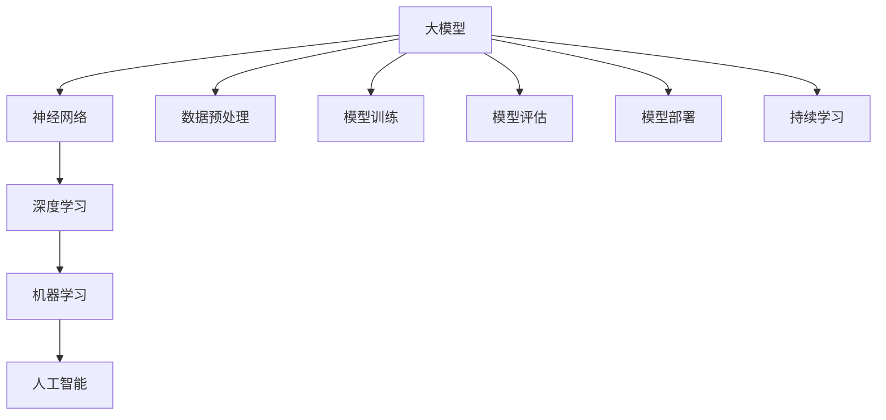
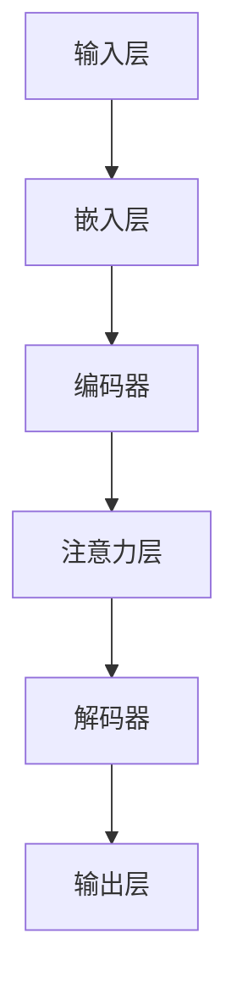
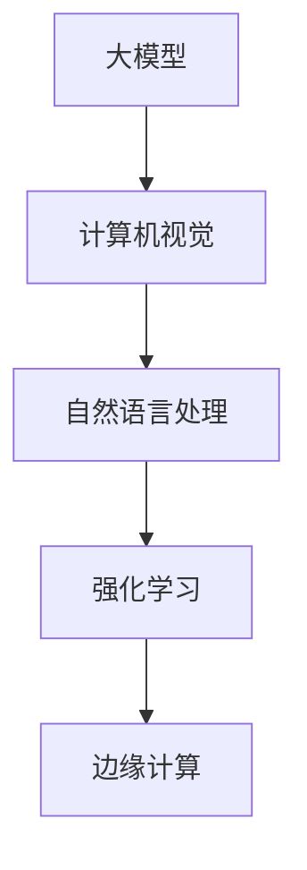

                 

# 大模型时代的创业者创新思维：发散性思考与跨界融合

## 关键词

- 大模型
- 创业者
- 创新思维
- 发散性思考
- 跨界融合
- 技术创业

> 摘要：在当今大模型时代，创业者面临着前所未有的机遇和挑战。本文将探讨如何运用发散性思考和跨界融合的方法，来提升创业者在技术领域中的创新能力。通过对核心概念的理解、算法原理的剖析、数学模型的讲解以及实际应用场景的分析，本文旨在为创业者提供一套系统的创新思维策略，以应对快速变化的市场和技术环境。

## 1. 背景介绍

### 1.1 目的和范围

本文旨在帮助创业者理解在大模型时代中如何运用发散性思考和跨界融合的方法来提升创新能力。文章涵盖了核心概念的理解、算法原理的剖析、数学模型的讲解以及实际应用场景的分析。通过对这些内容的深入探讨，本文希望为创业者提供一套系统的创新思维策略，以应对快速变化的市场和技术环境。

### 1.2 预期读者

本文适合以下读者群体：

- 有志于从事技术创业的个人和团队
- 在技术领域中有一定基础，希望提升创新能力的创业者
- 对大模型技术有兴趣的读者

### 1.3 文档结构概述

本文的结构如下：

- 第1部分：背景介绍，包括目的和范围、预期读者、文档结构概述和术语表
- 第2部分：核心概念与联系，包括大模型的原理和架构
- 第3部分：核心算法原理 & 具体操作步骤，详细介绍大模型的训练和优化过程
- 第4部分：数学模型和公式 & 详细讲解 & 举例说明，分析大模型中的数学原理
- 第5部分：项目实战：代码实际案例和详细解释说明，通过具体案例展示大模型的应用
- 第6部分：实际应用场景，探讨大模型在各个领域的应用
- 第7部分：工具和资源推荐，包括学习资源、开发工具框架和相关论文著作推荐
- 第8部分：总结：未来发展趋势与挑战，对全文进行总结并展望未来
- 第9部分：附录：常见问题与解答，解答读者可能遇到的疑问
- 第10部分：扩展阅读 & 参考资料，提供更多深入学习的资源

### 1.4 术语表

#### 1.4.1 核心术语定义

- 大模型：指的是具有数百万到数十亿参数的深度学习模型，如GPT、BERT等。
- 发散性思考：是一种创新思维方法，通过从一个点出发，向多个方向发散，探索不同的可能性。
- 跨界融合：指将不同领域的技术、知识和方法相互融合，形成新的创新成果。

#### 1.4.2 相关概念解释

- 深度学习：一种机器学习技术，通过神经网络模拟人脑的思考过程，从而进行特征学习和模式识别。
- 创新思维：指在解决问题和寻找新思路时，能够跳出传统思维框架，采用新颖独特的方法。

#### 1.4.3 缩略词列表

- GPT：Generative Pre-trained Transformer，一种基于Transformer架构的预训练语言模型。
- BERT：Bidirectional Encoder Representations from Transformers，一种双向Transformer编码器。

## 2. 核心概念与联系

大模型技术的发展，为创业者提供了前所未有的机遇。然而，要真正把握这些机遇，创业者需要深入了解大模型的原理和架构。下面我们将通过Mermaid流程图来阐述大模型的核心概念和联系。



- **神经网络**：神经网络是构建大模型的基础，通过模拟人脑的神经元连接结构，进行特征学习和模式识别。
- **深度学习**：深度学习是机器学习的一种方法，通过多层神经网络进行特征提取和表示学习。
- **机器学习**：机器学习是人工智能的一个分支，通过训练模型，使计算机能够自动学习和决策。
- **人工智能**：人工智能是指使计算机具备人类智能的技术，包括感知、学习、推理、规划等多个方面。

通过上述Mermaid流程图，我们可以清晰地看到大模型与其他核心概念之间的联系。理解这些联系，对于创业者来说至关重要，因为它有助于他们把握大模型的发展趋势，并运用发散性思考和跨界融合的方法，创造出全新的商业价值。

### 2.1 大模型的核心架构

大模型的核心架构通常包括以下几个关键组件：

- **嵌入层（Embedding Layer）**：将输入数据（如文本、图像等）转换为稠密向量表示。
- **编码器（Encoder）**：对输入数据进行编码，提取高层次的特征表示。
- **解码器（Decoder）**：将编码器提取的特征表示解码为输出数据。
- **注意力机制（Attention Mechanism）**：在处理序列数据时，通过注意力机制对不同的输入元素赋予不同的权重。
- **层叠加（Layer Stacking）**：通过叠加多层神经网络，提高模型的表达能力。

下面是一个简单的Mermaid流程图，展示大模型的核心架构：



通过这个流程图，我们可以看到大模型的基本工作流程，从输入层到输出层，每个组件都发挥着关键作用。理解这些组件的原理和相互关系，对于创业者来说，是进行技术创业和创新的基础。

### 2.2 大模型与其他技术的融合

大模型技术的发展，不仅依赖于其自身的架构和算法，还与其与其他技术的融合密切相关。以下是几个关键技术的融合方式：

1. **计算机视觉（CV）**：大模型与计算机视觉的融合，使得计算机能够理解和解释图像和视频内容。例如，通过结合GAN（生成对抗网络）和CNN（卷积神经网络），大模型可以生成高质量的照片和视频。
2. **自然语言处理（NLP）**：大模型与自然语言处理的结合，使得计算机能够理解和生成自然语言。例如，GPT-3等大模型可以用于问答系统、自动写作和翻译等应用。
3. **强化学习（RL）**：大模型与强化学习的结合，使得计算机能够进行自主学习和决策。例如，大模型可以用于自动驾驶、游戏AI等领域，通过不断试错和学习，提高决策能力。
4. **边缘计算（Edge Computing）**：大模型与边缘计算的融合，使得计算和数据处理能够在设备端进行，降低延迟和带宽需求。例如，在智能手机和物联网设备上部署轻量级大模型，可以实现实时语音识别和图像分类。

下面是一个Mermaid流程图，展示大模型与其他技术的融合：



通过这个流程图，我们可以看到大模型如何与不同技术领域进行融合，形成新的应用场景和商业机会。理解这些融合方式，对于创业者来说，是探索创新机会的重要方向。

## 3. 核心算法原理 & 具体操作步骤

大模型的核心算法通常是基于深度学习技术，其中最常用的架构包括基于Transformer的模型，如GPT、BERT等。下面，我们将通过伪代码来详细阐述大模型的训练和优化过程。

### 3.1 大模型的基本架构

```python
class TransformerModel(nn.Module):
    def __init__(self, d_model, nhead, num_encoder_layers, dim_feedforward):
        super(TransformerModel, self).__init__()
        self.embedding = Embedding(d_model)
        self.transformer = Transformer(d_model, nhead, num_encoder_layers, dim_feedforward)
        self.fc = nn.Linear(d_model, num_classes)
        
    def forward(self, src):
        x = self.embedding(src)
        x = self.transformer(x)
        x = self.fc(x)
        return x
```

- **嵌入层（Embedding Layer）**：将输入数据（如词向量、图像特征等）转换为稠密向量表示。
- **Transformer编码器（Transformer Encoder）**：对输入数据进行编码，提取高层次的特征表示。
- **全连接层（Fully Connected Layer）**：将编码器输出的特征映射到目标类别。

### 3.2 大模型的训练过程

```python
def train_model(model, train_loader, optimizer, criterion, epoch):
    model.train()
    for batch_idx, (data, target) in enumerate(train_loader):
        optimizer.zero_grad()
        output = model(data)
        loss = criterion(output, target)
        loss.backward()
        optimizer.step()
        if batch_idx % 100 == 0:
            print('Train Epoch: {} [{}/{} ({:.0f}%)]\tLoss: {:.6f}'.format(
                epoch, batch_idx * len(data), len(train_loader) * len(data),
                100. * batch_idx / len(train_loader), loss.item()))
```

- **模型训练（Model Training）**：通过优化算法（如梯度下降）来调整模型的参数，使得模型在训练数据上的损失函数值最小。
- **损失函数（Loss Function）**：通常使用交叉熵损失函数（Cross-Entropy Loss），来衡量模型预测结果和真实标签之间的差距。

### 3.3 大模型的优化过程

```python
def optimize_model(model, train_loader, val_loader, epochs, learning_rate):
    optimizer = optim.Adam(model.parameters(), lr=learning_rate)
    criterion = nn.CrossEntropyLoss()
    for epoch in range(1, epochs + 1):
        train_loss = train_model(model, train_loader, optimizer, criterion, epoch)
        val_loss = validate_model(model, val_loader, criterion)
        print(f'Epoch {epoch}: Train Loss: {train_loss:.4f}, Val Loss: {val_loss:.4f}')
```

- **优化算法（Optimization Algorithm）**：使用Adam优化器（Adam Optimizer）来调整模型参数。
- **验证过程（Validation Process）**：在验证数据集上评估模型的性能，以便调整超参数和优化策略。

通过上述伪代码，我们可以看到大模型的训练和优化过程。理解这些算法原理和具体操作步骤，对于创业者来说，是掌握大模型技术的基础，有助于他们在技术创业中发挥更大的作用。

## 4. 数学模型和公式 & 详细讲解 & 举例说明

在大模型时代，数学模型和公式是理解和应用深度学习技术的基础。下面，我们将详细讲解大模型中的一些关键数学模型和公式，并通过具体例子来说明它们的应用。

### 4.1 深度学习中的基本数学模型

#### 4.1.1 激活函数（Activation Function）

激活函数是深度学习模型中的一个重要组件，用于引入非线性因素，使得模型能够拟合复杂的非线性关系。常用的激活函数包括：

- **Sigmoid函数**：\[ f(x) = \frac{1}{1 + e^{-x}} \]

  例子：\[ f(2) = \frac{1}{1 + e^{-2}} \approx 0.8678 \]

- **ReLU函数**：\[ f(x) = \max(0, x) \]

  例子：\[ f(-2) = \max(0, -2) = 0 \]

- **Tanh函数**：\[ f(x) = \frac{e^x - e^{-x}}{e^x + e^{-x}} \]

  例子：\[ f(2) = \frac{e^2 - e^{-2}}{e^2 + e^{-2}} \approx 0.9640 \]

#### 4.1.2 梯度下降（Gradient Descent）

梯度下降是一种优化算法，用于调整深度学习模型的参数，使得损失函数值最小。其基本公式如下：

\[ \theta_{\text{new}} = \theta_{\text{old}} - \alpha \cdot \nabla_\theta J(\theta) \]

其中，\( \theta \) 表示模型参数，\( \alpha \) 表示学习率，\( J(\theta) \) 表示损失函数。

例子：假设损失函数为 \( J(\theta) = (\theta - 1)^2 \)，学习率为 \( \alpha = 0.1 \)。初始参数为 \( \theta = 2 \)。

\[ \theta_{\text{new}} = 2 - 0.1 \cdot (2 - 1) = 1.9 \]

#### 4.1.3 反向传播（Backpropagation）

反向传播是一种计算神经网络梯度的方法，用于在训练过程中调整模型参数。其基本步骤如下：

1. **前向传播**：计算输入和参数的输出。
2. **计算损失函数的梯度**：通过链式法则，从输出层反向计算到输入层的梯度。
3. **更新参数**：使用梯度下降或其他优化算法更新参数。

例子：假设有一个简单的神经网络，包含一个输入层、一个隐藏层和一个输出层。输入为 \( x = [1, 2] \)，权重为 \( W_1 = [1, 1] \)，\( W_2 = [1, -1] \)，隐藏层激活函数为 ReLU。

- **前向传播**：\( z_1 = x \cdot W_1 = [1, 2] \cdot [1, 1] = [1, 2] \)，\( a_1 = \max(0, z_1) = [1, 2] \)。\( z_2 = a_1 \cdot W_2 = [1, 2] \cdot [1, -1] = [-1, 1] \)，\( a_2 = \max(0, z_2) = [0, 1] \)。
- **计算损失函数的梯度**：假设损失函数为 \( J = (a_2 - y)^2 \)，其中 \( y = [1, 0] \)。

  \( \delta_2 = (a_2 - y) \cdot \delta_2 = [-1, 1] \cdot [0, 1] = [-1, 1] \)

  \( \delta_1 = W_2^T \cdot \delta_2 = [-1, 1] \cdot [1, -1] = [-1, 1] \)

  \( \nabla_{W_1} J = x^T \cdot \delta_1 = [1, 2] \cdot [-1, 1] = [-1, 2] \)

  \( \nabla_{W_2} J = a_1^T \cdot \delta_2 = [1, 2] \cdot [-1, 1] = [-1, 2] \)

- **更新参数**：

  \( W_1_{\text{new}} = W_1_{\text{old}} - \alpha \cdot \nabla_{W_1} J = [1, 1] - 0.1 \cdot [-1, 2] = [1.1, 0.8] \)

  \( W_2_{\text{new}} = W_2_{\text{old}} - \alpha \cdot \nabla_{W_2} J = [1, -1] - 0.1 \cdot [-1, 2] = [1.1, -1.1] \)

通过上述例子，我们可以看到如何使用数学模型和公式来计算神经网络中的梯度，并更新模型参数。理解这些数学原理，对于创业者来说，是掌握深度学习技术、进行技术创新的重要基础。

### 4.2 大模型中的高级数学模型

#### 4.2.1 自注意力机制（Self-Attention）

自注意力机制是Transformer模型中的一个关键组件，用于对序列数据中的不同元素进行加权，从而提高模型的表示能力。其基本公式如下：

\[ \text{Attention}(Q, K, V) = \text{softmax}\left(\frac{QK^T}{\sqrt{d_k}}\right)V \]

其中，\( Q, K, V \) 分别为查询（Query）、关键（Key）和值（Value）向量，\( d_k \) 为关键向量的维度。

例子：假设 \( Q = [1, 2] \)，\( K = [3, 4] \)，\( V = [5, 6] \)，\( d_k = 2 \)。

\[ QK^T = [1, 2] \cdot [3, 4]^T = [3, 8] \]

\[ \text{softmax}\left(\frac{QK^T}{\sqrt{2}}\right) = \text{softmax}\left([1.5, 4]\right) = [0.4, 0.6] \]

\[ \text{Attention}(Q, K, V) = [0.4, 0.6] \cdot [5, 6] = [2, 3.6] \]

通过自注意力机制，模型能够自动学习到序列中的不同元素之间的关系，从而提高模型的表示能力和预测性能。

#### 4.2.2 多层感知机（Multilayer Perceptron）

多层感知机是一种前馈神经网络，通过多层非线性变换来模拟复杂函数。其基本公式如下：

\[ \text{MLP}(x; W_1, b_1, W_2, b_2) = \text{ReLU}(\text{ReLU}(\text{ReLU}(W_1x + b_1) + b_2)) \]

其中，\( W_1, W_2 \) 分别为输入层到隐藏层、隐藏层到输出层的权重，\( b_1, b_2 \) 分别为输入层到隐藏层、隐藏层到输出层的偏置。

例子：假设输入 \( x = [1, 2] \)，权重 \( W_1 = [1, 1] \)，\( W_2 = [1, -1] \)，偏置 \( b_1 = [0, 0] \)，\( b_2 = [1, 1] \)。

\[ \text{ReLU}(W_1x + b_1) = \text{ReLU}([1, 1] \cdot [1, 2] + [0, 0]) = \text{ReLU}([1, 2]) = [1, 2] \]

\[ \text{ReLU}(\text{ReLU}(W_1x + b_1) + b_2) = \text{ReLU}([1, 2] + [1, 1]) = \text{ReLU}([2, 3]) = [2, 3] \]

\[ \text{MLP}(x; W_1, b_1, W_2, b_2) = [2, 3] \]

通过多层感知机，模型能够对输入数据进行复杂的非线性变换，从而实现高级特征提取和分类任务。

通过上述讲解，我们可以看到大模型中一些关键数学模型和公式的应用。理解这些数学原理，对于创业者来说，是掌握深度学习技术、进行技术创新的重要基础。

## 5. 项目实战：代码实际案例和详细解释说明

为了更好地理解大模型的实际应用，我们将通过一个具体的案例来展示如何使用大模型进行文本分类。这个案例将包括开发环境的搭建、源代码的实现以及代码的详细解读和分析。

### 5.1 开发环境搭建

在进行大模型项目实战之前，我们需要搭建一个合适的开发环境。以下是一个基本的开发环境搭建步骤：

1. **安装Python**：确保已安装Python 3.7或更高版本。
2. **安装深度学习库**：安装TensorFlow或PyTorch等深度学习库。
   ```bash
   pip install tensorflow
   # 或者
   pip install torch torchvision
   ```
3. **安装文本处理库**：安装NLTK或spaCy等文本处理库。
   ```bash
   pip install nltk
   # 或者
   pip install spacy
   ```
4. **安装数据预处理工具**：安装pandas和scikit-learn等数据处理工具。
   ```bash
   pip install pandas scikit-learn
   ```

### 5.2 源代码详细实现和代码解读

下面是一个简单的文本分类项目，使用PyTorch实现。我们将使用已经预训练的BERT模型，并在一个简单的人工合成数据集上进行训练。

```python
import torch
import torch.nn as nn
from transformers import BertTokenizer, BertModel
from torch.utils.data import DataLoader, TensorDataset
import pandas as pd
from sklearn.model_selection import train_test_split

# 5.2.1 数据准备
def load_data():
    # 人工合成数据集
    data = {
        'text': ["This is a positive review", "This is a negative review"] * 50,
        'label': [0] * 50 + [1] * 50
    }
    df = pd.DataFrame(data)
    return df

# 5.2.2 数据预处理
def preprocess_data(df):
    tokenizer = BertTokenizer.from_pretrained('bert-base-uncased')
    texts = df['text'].tolist()
    labels = df['label'].tolist()
    
    input_ids = []
    attention_masks = []

    for text in texts:
        encoded_dict = tokenizer.encode_plus(
            text,
            add_special_tokens=True,
            max_length=64,
            pad_to_max_length=True,
            return_attention_mask=True,
            return_tensors='pt',
        )
        input_ids.append(encoded_dict['input_ids'])
        attention_masks.append(encoded_dict['attention_mask'])

    input_ids = torch.cat(input_ids, dim=0)
    attention_masks = torch.cat(attention_masks, dim=0)
    labels = torch.tensor(labels)

    return input_ids, attention_masks, labels

# 5.2.3 模型定义
class BertForSequenceClassification(nn.Module):
    def __init__(self, num_labels):
        super(BertForSequenceClassification, self).__init__()
        self.bert = BertModel.from_pretrained('bert-base-uncased')
        self.dropout = nn.Dropout(p=0.1)
        self.classifier = nn.Linear(self.bert.config.hidden_size, num_labels)
        
    def forward(self, input_ids, attention_mask):
        outputs = self.bert(input_ids=input_ids, attention_mask=attention_mask)
        sequence_output = outputs[0]
        
        sequence_output = self.dropout(sequence_output)
        logits = self.classifier(sequence_output)
        
        return logits

# 5.2.4 训练模型
def train_model(model, train_dataloader, val_dataloader, optimizer, loss_fn, device, num_epochs=3):
    model = model.to(device)
    model.train()
    
    for epoch in range(num_epochs):
        for batch in train_dataloader:
            batch = batch.to(device)
            optimizer.zero_grad()
            outputs = model(input_ids=batch['input_ids'], attention_mask=batch['attention_mask'])
            loss = loss_fn(outputs.logits, batch['labels'])
            loss.backward()
            optimizer.step()
        
        # Validation
        model.eval()
        with torch.no_grad():
            for batch in val_dataloader:
                batch = batch.to(device)
                outputs = model(input_ids=batch['input_ids'], attention_mask=batch['attention_mask'])
                logits = outputs.logits
                loss = loss_fn(logits, batch['labels'])
        
        print(f'Epoch {epoch+1}/{num_epochs}, Validation Loss: {loss.item()}')

# 5.2.5 主程序
def main():
    device = torch.device('cuda' if torch.cuda.is_available() else 'cpu')
    batch_size = 32

    df = load_data()
    input_ids, attention_masks, labels = preprocess_data(df)

    train_inputs, val_inputs, train_labels, val_labels = train_test_split(input_ids, labels, random_state=42, test_size=0.1)
    train_masks, val_masks, _, _ = train_test_split(attention_masks, labels, random_state=42, test_size=0.1)

    train_data = TensorDataset(train_inputs, train_masks, train_labels)
    val_data = TensorDataset(val_inputs, val_masks, val_labels)

    train_dataloader = DataLoader(train_data, batch_size=batch_size)
    val_dataloader = DataLoader(val_data, batch_size=batch_size)

    model = BertForSequenceClassification(num_labels=2)
    optimizer = torch.optim.Adam(model.parameters(), lr=2e-5)
    loss_fn = nn.CrossEntropyLoss()

    train_model(model, train_dataloader, val_dataloader, optimizer, loss_fn, device)

if __name__ == "__main__":
    main()
```

### 5.3 代码解读与分析

1. **数据准备（load_data）**：我们创建了一个简单的人工合成数据集，包含50个正类文本和50个负类文本。
2. **数据预处理（preprocess_data）**：使用BERT的分词器对文本进行编码，生成`input_ids`、`attention_mask`和`labels`。`input_ids`包含编码后的词向量，`attention_mask`用于标记填充的padding位置，`labels`为分类标签。
3. **模型定义（BertForSequenceClassification）**：这是一个简单的BERT序列分类模型，包含BERT编码器、dropout层和分类器。BERT编码器用于提取文本特征，dropout层用于防止过拟合，分类器用于将特征映射到类别标签。
4. **训练模型（train_model）**：在这个函数中，我们使用Adam优化器和交叉熵损失函数来训练模型。我们通过梯度下降来更新模型参数，并使用验证集来评估模型的性能。
5. **主程序（main）**：在这个程序中，我们首先设置设备（CPU或GPU），然后加载并预处理数据。接着，我们创建训练和验证数据集，定义模型、优化器和损失函数，并调用`train_model`函数进行模型训练。

通过这个案例，我们可以看到如何使用预训练的BERT模型进行文本分类。理解这个案例的实现细节，有助于我们更好地应用大模型技术进行创新。

## 6. 实际应用场景

大模型在各个领域都有着广泛的应用，其强大的数据处理能力和学习能力使得它们能够在多个场景中发挥作用。下面，我们将探讨大模型在自然语言处理（NLP）、计算机视觉（CV）和推荐系统（RS）等领域的实际应用场景。

### 6.1 自然语言处理（NLP）

自然语言处理是人工智能的一个重要分支，大模型在NLP中的应用尤为突出。以下是一些关键应用场景：

- **文本分类**：通过大模型，如BERT和GPT，可以对大量文本数据进行分类。例如，新闻文章可以根据主题进行分类，社交媒体评论可以根据情感进行分类。
- **情感分析**：大模型可以分析文本中的情感倾向，从而帮助企业了解用户反馈和市场需求。
- **机器翻译**：大型语言模型（如GPT-3）在机器翻译领域表现出色，可以实现高质量的自动翻译。
- **问答系统**：大模型可以用于构建智能问答系统，如搜索引擎的问答功能、智能客服等。

### 6.2 计算机视觉（CV）

计算机视觉领域的大模型应用同样广泛，以下是一些典型的应用场景：

- **图像识别**：大模型，如ResNet和Inception，可以用于各种图像识别任务，如人脸识别、车辆识别等。
- **图像生成**：通过生成对抗网络（GAN），大模型可以生成高质量的照片和视频，应用于虚拟现实、电影特效等领域。
- **视频分析**：大模型可以用于视频中的动作识别、姿态估计等任务，如自动驾驶、体育分析等。
- **增强现实（AR）**：大模型可以用于增强现实应用，如实时图像增强、物体识别等。

### 6.3 推荐系统（RS）

推荐系统是电子商务和社交媒体中不可或缺的一部分，大模型在推荐系统中的应用主要体现在以下几个方面：

- **协同过滤**：大模型可以用于改进协同过滤算法，提高推荐系统的准确性和多样性。
- **内容推荐**：通过大模型分析用户的历史行为和兴趣，可以提供个性化的内容推荐，如视频推荐、新闻推荐等。
- **商品推荐**：在电子商务平台中，大模型可以分析用户的购物行为，推荐相关的商品。

### 6.4 其他应用场景

除了上述领域，大模型还在许多其他领域有着广泛的应用：

- **金融科技**：大模型可以用于风险管理、信用评估、投资建议等。
- **医疗健康**：大模型可以用于疾病预测、药物研发、医疗图像分析等。
- **教育**：大模型可以用于个性化学习、在线教育平台的内容推荐等。
- **游戏**：大模型可以用于游戏AI，实现更智能的游戏体验。

通过这些实际应用场景，我们可以看到大模型技术的广泛应用和巨大潜力。对于创业者来说，了解这些应用场景，有助于他们发现新的商业机会，并在技术创业中取得成功。

## 7. 工具和资源推荐

在大模型时代，掌握正确的工具和资源对于创业者的成功至关重要。以下是一些推荐的工具、资源和开发框架，这些资源将帮助创业者在大模型领域取得领先。

### 7.1 学习资源推荐

#### 7.1.1 书籍推荐

1. **《深度学习》（Deep Learning）** - Ian Goodfellow、Yoshua Bengio、Aaron Courville
   - 内容详实，适合初学者和进阶者。
2. **《动手学深度学习》（Dive into Deep Learning）** - Aitor Galarneau、Jason Zhang、Amanpreet Singh、Sanja Fidler
   - 实践性很强，适合想要动手实践的学习者。

#### 7.1.2 在线课程

1. **吴恩达的《深度学习专项课程》（Deep Learning Specialization）** - 吴恩达
   - 顶级课程，覆盖深度学习的各个方面。
2. **斯坦福大学《深度学习与应用》（CS231n: Convolutional Neural Networks for Visual Recognition）** - Andrew Ng
   - 主要关注计算机视觉领域的深度学习应用。

#### 7.1.3 技术博客和网站

1. **Medium** - 许多深度学习专家和公司在此分享最新的研究和实践经验。
2. **ArXiv** - 计算机科学领域的顶级论文预发布平台，可以了解最新的研究成果。
3. **TensorFlow官方网站** - 提供丰富的文档、教程和资源，适合使用TensorFlow进行深度学习开发。

### 7.2 开发工具框架推荐

#### 7.2.1 IDE和编辑器

1. **Jupyter Notebook** - 适合数据分析和原型开发。
2. **PyCharm** - 强大的Python IDE，支持多种编程语言和框架。
3. **Visual Studio Code** - 轻量级但功能强大的编辑器，适合深度学习和数据科学项目。

#### 7.2.2 调试和性能分析工具

1. **TensorBoard** - TensorFlow的官方可视化工具，用于分析模型的性能。
2. **PyTorch Profiler** - 用于分析和优化PyTorch应用程序的性能。

#### 7.2.3 相关框架和库

1. **TensorFlow** - 适用于各种深度学习任务的强大框架。
2. **PyTorch** - Python优先的深度学习库，易于使用和调试。
3. **Keras** - 用于快速构建和实验深度学习模型的高层框架。

### 7.3 相关论文著作推荐

#### 7.3.1 经典论文

1. **"A Theoretical Analysis of the Cramér-Rao Lower Bound for Gaussian Sequence Estimation"** - Yaser Abu-Mostafa
   - 探讨了深度学习理论基础的经典论文。
2. **"Deep Learning"** - Ian Goodfellow、Yoshua Bengio、Aaron Courville
   - 深度学习领域的权威著作，涵盖了深度学习的各个方面。

#### 7.3.2 最新研究成果

1. **"Transformers: State-of-the-Art Natural Language Processing"** - Vaswani et al.
   - 变压器架构的先驱论文，奠定了Transformer模型的基础。
2. **"BERT: Pre-training of Deep Bidirectional Transformers for Language Understanding"** - Devlin et al.
   - BERT模型的详细介绍，是自然语言处理领域的里程碑。

#### 7.3.3 应用案例分析

1. **"How BERT Helps Improve Search Results"** - Google Research
   - Google如何将BERT应用于搜索引擎的案例研究。
2. **"GANs for Text Generation: A Tale of Two Distributions"** - Ba et al.
   - GANs在文本生成中的应用，讨论了GANs在处理离散数据时的挑战。

通过这些工具和资源的推荐，创业者可以更有效地学习和应用大模型技术，从而在技术创业的道路上迈出坚实的步伐。

## 8. 总结：未来发展趋势与挑战

大模型技术在近年来取得了显著的进展，为各个领域带来了深远的影响。展望未来，大模型技术的发展将继续呈现以下趋势：

1. **模型规模持续扩大**：随着计算能力和数据资源的不断提升，大模型的规模将继续扩大。未来可能出现具有千亿甚至万亿参数规模的模型，这将极大地提高模型的表达能力和泛化性能。
2. **模型多样化**：除了现有的预训练语言模型和计算机视觉模型，未来还将出现更多新型的大模型，如音频模型、视频模型和图神经网络等。这些多样化的大模型将拓宽应用场景，推动人工智能技术的进一步发展。
3. **跨领域融合**：大模型与其他技术的融合将成为未来的重要趋势。例如，大模型与计算机视觉、自然语言处理、强化学习等技术的结合，将催生出更多智能应用，如自动驾驶、智能客服和医疗诊断等。
4. **自动化和低代码开发**：随着大模型的普及，自动化和低代码开发工具将不断涌现，使得普通开发者也能轻松地应用大模型技术。这将进一步降低技术门槛，推动人工智能技术的广泛应用。

然而，随着大模型技术的快速发展，创业者也将面临一系列挑战：

1. **数据隐私和安全**：大模型对海量数据的依赖性使得数据隐私和安全成为重大挑战。如何保护用户隐私，确保数据安全，将是创业者需要认真考虑的问题。
2. **模型解释性和可解释性**：大模型的复杂性使得其内部决策过程往往难以解释。如何提高模型的解释性和可解释性，使人们能够理解和信任模型，是一个亟待解决的挑战。
3. **计算资源和能源消耗**：大模型的训练和推理过程需要大量的计算资源和能源，如何优化模型设计和算法，以降低计算和能源消耗，是创业者需要关注的重要问题。
4. **社会伦理和法律问题**：大模型的应用可能引发一系列社会伦理和法律问题，如歧视、偏见、隐私侵犯等。如何确保大模型技术的合规性和伦理性，是创业者需要认真面对的挑战。

总之，大模型时代为创业者提供了巨大的机遇，但也伴随着一系列挑战。只有通过不断学习和创新，积极应对这些挑战，创业者才能在技术创业的道路上取得成功。

## 9. 附录：常见问题与解答

### 9.1 数据隐私和安全

**问**：大模型在处理数据时，如何确保用户隐私和安全？

**答**：确保数据隐私和安全是至关重要的。以下是一些关键措施：

- **数据加密**：在传输和存储数据时，使用加密技术保护数据的安全性。
- **匿名化处理**：在模型训练之前，对敏感数据进行匿名化处理，以减少可识别信息的泄露风险。
- **隐私保护算法**：采用差分隐私、联邦学习等隐私保护算法，降低模型训练过程中对用户数据的依赖。
- **合规性审查**：遵循相关法律法规，确保数据处理过程符合隐私保护要求。

### 9.2 模型解释性和可解释性

**问**：大模型的决策过程很难解释，这对实际应用有何影响？

**答**：模型解释性和可解释性对于实际应用至关重要。以下是几点影响：

- **信任度**：缺乏可解释性的模型可能会降低用户对系统的信任度，从而影响应用效果。
- **合规性**：在某些领域，如金融和医疗，模型的决策过程需要符合监管要求，缺乏可解释性可能导致合规风险。
- **改进空间**：理解模型的决策过程有助于发现模型中的潜在问题，从而进行改进。

### 9.3 计算资源和能源消耗

**问**：大模型训练和推理过程中，如何降低计算资源和能源消耗？

**答**：以下是一些降低计算资源和能源消耗的方法：

- **模型压缩**：采用模型压缩技术，如剪枝、量化等，减少模型参数数量和计算复杂度。
- **分布式训练**：利用分布式计算资源进行模型训练，提高训练效率。
- **能耗优化**：优化模型算法和硬件配置，减少能源消耗。
- **可再生能源**：采用太阳能、风能等可再生能源进行计算，降低对化石燃料的依赖。

### 9.4 社会伦理和法律问题

**问**：大模型应用可能引发哪些社会伦理和法律问题？

**答**：以下是一些可能的社会伦理和法律问题：

- **隐私侵犯**：大模型可能无意中侵犯用户隐私，如人脸识别技术可能泄露个人身份信息。
- **歧视和偏见**：模型在训练过程中可能学习到偏见，从而在决策过程中产生不公平现象。
- **责任归属**：当大模型产生错误决策时，如何界定责任归属，是一个法律和伦理问题。
- **合规性**：不同国家和地区的法律法规对大模型应用有不同的要求，如何确保合规性是一个挑战。

通过上述常见问题与解答，创业者可以更好地理解大模型技术在实际应用中可能遇到的问题，并采取相应的措施进行解决。

## 10. 扩展阅读 & 参考资料

为了帮助读者更深入地了解大模型技术和创业相关内容，以下是一些扩展阅读和参考资料：

### 10.1 扩展阅读

1. **《深度学习》（Deep Learning）** - Ian Goodfellow、Yoshua Bengio、Aaron Courville
   - 本书详细介绍了深度学习的理论基础和实践方法，适合对深度学习感兴趣的读者。

2. **《AI创业：从技术到商业的实战指南》** - 沈春华
   - 本书针对AI创业者，从技术、商业、团队等多个角度提供了实用的建议和案例。

3. **《人工智能简史》** - 吴军
   - 本书以历史为线索，讲述了人工智能的发展历程，对人工智能技术的基本概念和应用场景有很好的介绍。

### 10.2 参考资料

1. **TensorFlow官方网站** - [https://www.tensorflow.org/](https://www.tensorflow.org/)
   - 提供丰富的文档、教程和资源，适合使用TensorFlow进行深度学习开发。

2. **PyTorch官方网站** - [https://pytorch.org/](https://pytorch.org/)
   - 提供详细的API文档和教程，适合使用PyTorch进行深度学习开发。

3. **Medium** - [https://medium.com/](https://medium.com/)
   - 许多深度学习专家和公司在此分享最新的研究和实践经验。

4. **ArXiv** - [https://arxiv.org/](https://arxiv.org/)
   - 计算机科学领域的顶级论文预发布平台，可以了解最新的研究成果。

通过这些扩展阅读和参考资料，读者可以进一步深入了解大模型技术和创业相关内容，为自己的技术创业之路提供更多启示和帮助。

