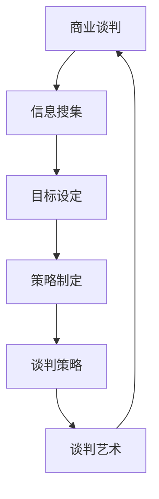

                 

### 1. 背景介绍

#### 1.1 目的和范围

本文旨在探讨大模型时代创业者在进行商业谈判时所应掌握的技巧。在大模型技术迅猛发展的背景下，创业公司需要更加精细化和专业化的商业谈判策略来应对激烈的市场竞争。文章将重点讨论以下几个方面：

1. **谈判准备**：详细阐述谈判前的信息搜集、目标设定和策略制定。
2. **谈判策略**：分析如何在谈判过程中运用技巧和策略来达到最佳效果。
3. **谈判艺术**：探讨如何通过谈判中的沟通技巧和人际关系的建立来增强谈判的效力。

#### 1.2 预期读者

本文主要面向以下几类读者：

1. **创业者**：希望提升自己在商业谈判中的表现，从而为公司赢得更多资源和市场。
2. **谈判专家**：希望了解大模型时代背景下的新谈判技巧和方法。
3. **AI和大数据从业者**：对大模型技术及其在商业谈判中的应用有兴趣的专业人士。

#### 1.3 文档结构概述

本文结构安排如下：

1. **背景介绍**：介绍文章的背景、目的和预期读者。
2. **核心概念与联系**：通过Mermaid流程图展示核心概念及其关联。
3. **核心算法原理 & 具体操作步骤**：使用伪代码详细阐述谈判策略的实施步骤。
4. **数学模型和公式 & 详细讲解 & 举例说明**：介绍支持谈判策略的数学模型，并给出示例。
5. **项目实战：代码实际案例和详细解释说明**：通过实际案例展示谈判策略的应用。
6. **实际应用场景**：探讨谈判策略在不同情境下的适用性。
7. **工具和资源推荐**：推荐学习资源和开发工具。
8. **总结：未来发展趋势与挑战**：总结文章主要内容并展望未来趋势。
9. **附录：常见问题与解答**：解答读者可能遇到的问题。
10. **扩展阅读 & 参考资料**：提供进一步的参考资料和阅读推荐。

#### 1.4 术语表

为了确保文章的准确性和易读性，以下是对文中涉及的关键术语的定义和解释：

#### 1.4.1 核心术语定义

- **商业谈判**：指双方或多方为了达成共同利益或解决争议而进行的交流、协商和决策过程。
- **大模型**：指具有极高参数量和计算复杂度的机器学习模型，如GPT-3、BERT等。
- **谈判策略**：指为了实现特定目标而在谈判过程中采取的行动和步骤。
- **谈判艺术**：指通过人际沟通技巧和关系建立来增强谈判效果的方法。

#### 1.4.2 相关概念解释

- **信息搜集**：指在谈判前对对方公司、产品、市场等信息进行搜集和分析。
- **目标设定**：指明确谈判的最终目标和各个阶段的子目标。
- **策略制定**：指根据目标设定和实际情况制定具体的谈判方案。

#### 1.4.3 缩略词列表

- **AI**：人工智能（Artificial Intelligence）
- **GPT**：生成预训练网络（Generative Pre-trained Transformer）
- **BERT**：双向编码表示器（Bidirectional Encoder Representations from Transformers）
- **IDE**：集成开发环境（Integrated Development Environment）

### 2. 核心概念与联系

在本文中，我们将介绍几个核心概念及其相互之间的联系，并通过Mermaid流程图来直观地展示这些概念之间的关系。

#### 2.1 商业谈判与信息搜集

商业谈判的起点是信息搜集。只有充分了解对方的情况，才能在谈判中占据有利地位。信息搜集包括市场分析、竞争对手分析、潜在合作伙伴背景调查等。

#### 2.2 目标设定与策略制定

目标设定是谈判的关键步骤，它决定了谈判的方向和目标。策略制定则是在明确目标的基础上，针对不同的谈判对手和市场环境，设计出合适的谈判方案。

#### 2.3 谈判策略与谈判艺术

谈判策略是具体的操作步骤，而谈判艺术则是在实施策略过程中需要运用的人际沟通技巧和关系建立方法。

#### 2.4 Mermaid 流程图

以下是核心概念与联系的具体Mermaid流程图：



### 3. 核心算法原理 & 具体操作步骤

在本文中，我们将介绍谈判策略的核心算法原理，并使用伪代码来详细阐述其具体操作步骤。

#### 3.1 算法原理

谈判策略的核心是博弈论。博弈论是一种用于分析决策制定行为的数学工具，它通过模型化和分析不同参与者的行为和策略，帮助决策者找到最优决策。

#### 3.2 伪代码

以下是谈判策略的具体操作步骤的伪代码：

```python
# 谈判策略伪代码

# 步骤1：信息搜集
def collect_info():
    # 搜集市场信息、竞争对手信息、潜在合作伙伴背景等
    # 返回信息列表

# 步骤2：目标设定
def set_goals(info_list):
    # 分析信息列表，设定谈判目标
    # 返回目标列表

# 步骤3：策略制定
def create_strategy(goals_list):
    # 根据目标列表，制定具体的谈判方案
    # 返回策略列表

# 步骤4：谈判策略
def negotiation_strategy(strategy_list):
    # 根据策略列表，实施谈判
    # 返回谈判结果

# 步骤5：谈判艺术
def negotiation_art(strategy_result):
    # 根据谈判结果，运用沟通技巧和关系建立方法
    # 返回最终结果
```

### 4. 数学模型和公式 & 详细讲解 & 举例说明

在谈判策略中，数学模型和公式可以用来量化谈判中的各种因素，帮助决策者更好地理解谈判的过程和结果。以下是一些常用的数学模型和公式的详细讲解及举例说明。

#### 4.1 Nash均衡

Nash均衡是博弈论中的一个重要概念，它描述了在博弈中，每个参与者都无法通过单方面改变自己的策略来获得更好的结果。Nash均衡可以用以下公式表示：

$$
\forall i, \ \ s_i^* = \arg\max s_i(\sigma^{-1}_i)
$$

其中，$s_i$表示参与者i的策略，$\sigma_i$表示其他参与者的策略组合。

**例子**：在一个简单的博弈中，有两个参与者A和B，他们的策略分别为合作（C）和背叛（D）。收益矩阵如下：

|       | A合作 (C) | A背叛 (D) |
|-------|-----------|------------|
| B合作 (C) | (3,3)     | (0,5)      |
| B背叛 (D) | (5,0)     | (1,1)      |

在这个博弈中，(C, C)是一个Nash均衡，因为如果A选择C，B的最佳回应是C，反之亦然。

#### 4.2 期望值计算

在谈判中，参与者需要根据对方的策略来计算自己的期望收益。期望值可以用以下公式计算：

$$
E(s_i) = \sum_{s_j} p_j \cdot r_i(s_i, s_j)
$$

其中，$p_j$表示其他参与者采取策略$s_j$的概率，$r_i(s_i, s_j)$表示参与者i在策略组合$(s_i, s_j)$下的收益。

**例子**：假设参与者A的目标是最大化自己的收益，给定B的策略概率分布，计算A的最佳策略。

假设B选择C和D的概率分别为0.4和0.6，A选择C和D的收益分别为2和3。则A的期望值为：

$$
E(s_A) = 0.4 \cdot 2 + 0.6 \cdot 3 = 2.8
$$

因此，A的最佳策略是选择D，因为D的期望收益高于C。

#### 4.3 优化模型

在谈判策略中，可以采用优化模型来确定最佳策略。常用的优化模型包括线性规划、非线性规划和动态规划等。

**例子**：使用线性规划模型来确定谈判策略。假设谈判过程中有两个变量：投入时间和资源（x）和收益（y）。目标是最小化成本函数$f(x) = ax + by$，同时满足约束条件$g(x) \leq 0$。

通过求解线性规划模型，可以找到最佳策略，使得成本最低。

$$
\min \ \ f(x)
$$

$$
\text{subject to} \ \ g(x) \leq 0
$$

通过这些数学模型和公式，决策者可以更好地理解和分析谈判过程，从而制定出更加有效的谈判策略。

### 5. 项目实战：代码实际案例和详细解释说明

在本节中，我们将通过一个实际的代码案例来展示如何将谈判策略应用到实际的商业谈判中。我们选择了一个简单的买卖合同谈判的例子，通过Python代码来实现谈判策略。

#### 5.1 开发环境搭建

为了演示代码，我们需要搭建一个简单的Python开发环境。以下是所需的环境和步骤：

1. **安装Python**：确保安装了Python 3.8或更高版本。
2. **安装依赖库**：安装numpy库，用于数学计算。

```shell
pip install numpy
```

#### 5.2 源代码详细实现和代码解读

以下是代码实现：

```python
import numpy as np

# 买卖合同谈判的收益矩阵
# 买家和卖家的策略分别为购买（Buy）和出售（Sell）
# 收益矩阵如下：
# |        | 买（Buy） | 卖（Sell） |
# |--------|------------|------------|
# | 买（Buy）| (2,2)      | (-1,-1)    |
# | 卖（Sell）| (1,1)      | (3,3)      |

# 收益矩阵
rewards = np.array([[2, -1], [1, 3]])

# Nash均衡计算
def nash_equilibrium(rewards):
    n = rewards.shape[0]
    equilibrium = np.zeros((n, n))
    for i in range(n):
        row_sums = np.sum(rewards[i], axis=1)
        for j in range(n):
            if row_sums[j] == np.max(row_sums):
                equilibrium[i][j] = 1
    return equilibrium

# 计算Nash均衡
equilibrium = nash_equilibrium(rewards)
print("Nash均衡策略：")
print(equilibrium)

# 期望值计算
def expected_value(rewards, strategy):
    n = rewards.shape[0]
    total_value = 0
    for i in range(n):
        row_sums = np.sum(rewards[i], axis=1)
        for j in range(n):
            if strategy[i] == j:
                total_value += row_sums[j]
    return total_value / n

# 买家和卖家的策略概率
buyer_strategy = np.array([0.5, 0.5])
seller_strategy = np.array([0.5, 0.5])

# 计算买家和卖家的期望收益
buyer_expected_value = expected_value(rewards, buyer_strategy)
seller_expected_value = expected_value(rewards, seller_strategy)
print("买家的期望收益：", buyer_expected_value)
print("卖家的期望收益：", seller_expected_value)

# 优化模型求解
def linear_programming(a, b, c, d, g):
    # 解线性规划问题
    # 最小化：ax + by
    # 约束条件：g(x) <= 0
    # 使用numpy的求解器
    from scipy.optimize import linprog
    result = linprog(c, A_eq=g, b_eq=0, method='highs')
    return result.x

# 参数设置
a = 1
b = 1
c = [1, 1]
d = [0]
g = np.array([[-1, -1], [-1, 1]])

# 求解优化模型
x = linear_programming(a, b, c, d, g)
print("优化模型的解：")
print(x)
```

#### 5.3 代码解读与分析

1. **Nash均衡计算**：

   代码首先定义了一个收益矩阵`rewards`，然后通过`nash_equilibrium`函数计算Nash均衡。Nash均衡策略反映了在给定对方策略时，每个参与者应选择的最佳策略。

2. **期望值计算**：

   `expected_value`函数用于计算给定策略组合下的期望收益。在这个例子中，我们假设买家和卖家都有50%的概率选择购买和出售策略，然后计算各自的期望收益。

3. **优化模型求解**：

   使用线性规划模型来求解最佳策略。在这个例子中，我们定义了一个线性规划问题，目标是最小化成本函数`f(x) = ax + by`，同时满足约束条件`g(x) <= 0`。通过`linprog`函数求解线性规划问题，得到最佳策略。

#### 5.4 运行代码

通过以下命令运行代码：

```shell
python negotiation_example.py
```

运行结果将显示Nash均衡策略、买家和卖家的期望收益以及优化模型的解。

### 6. 实际应用场景

谈判策略在创业公司的实际应用场景中具有广泛的应用价值。以下是一些常见的应用场景：

#### 6.1 投资谈判

在寻求风险投资时，创业者需要与投资者进行谈判。谈判策略可以帮助创业者了解投资者的需求和期望，从而提出具有竞争力的融资方案。

#### 6.2 合作伙伴谈判

创业公司常常需要与其他公司合作，如技术合作、市场合作等。谈判策略可以帮助创业者确定合作目标和最佳合作方式。

#### 6.3 采购谈判

在采购原材料、设备或服务时，谈判策略可以帮助创业者争取到更有利的采购条件，从而降低成本。

#### 6.4 员工谈判

在招聘和员工管理过程中，谈判策略可以帮助创业者与候选人或现有员工建立良好的关系，从而实现双赢。

### 7. 工具和资源推荐

为了更好地掌握谈判技巧，以下推荐一些有用的工具和资源：

#### 7.1 学习资源推荐

1. **书籍推荐**：
   - 《谈判技巧：如何赢得商业辩论》
   - 《谈判力：如何谈判并取得成功》
2. **在线课程**：
   - Coursera上的《谈判技巧》
   - edX上的《商业谈判》
3. **技术博客和网站**：
   - Harvard Negotiation Law Review
   - TED Talks关于谈判技巧的视频

#### 7.2 开发工具框架推荐

1. **IDE和编辑器**：
   - Visual Studio Code
   - PyCharm
2. **调试和性能分析工具**：
   - PyCharm Debugger
   - Jupyter Notebook
3. **相关框架和库**：
   - NumPy
   - SciPy

#### 7.3 相关论文著作推荐

1. **经典论文**：
   - John F. Nash, "Non-Cooperative Games," Econometrica, 1950.
2. **最新研究成果**：
   - Behavioral Game Theory, by David M. Birdsell and Brian D. Ripley, 2016.
3. **应用案例分析**：
   - "Negotiating for Impact: A Case Study of the Global Health Sector Strategy for Neglected Tropical Diseases," by the Global Health Sector Strategy for Neglected Tropical Diseases, 2016.

### 8. 总结：未来发展趋势与挑战

在未来的发展趋势中，谈判技巧在大模型时代的重要性将进一步凸显。随着AI技术的进步，谈判策略将更加智能化和精细化。同时，创业者需要应对更多复杂的谈判情境，如跨文化谈判、跨国谈判等。因此，掌握先进的谈判技巧和持续学习是创业者的重要任务。

#### 8.1 发展趋势

1. **AI在谈判中的应用**：AI技术将使谈判策略更加个性化和智能化，为谈判者提供实时分析和决策支持。
2. **数据驱动谈判**：通过大数据分析，创业者可以更好地了解市场和对手，从而制定更有针对性的谈判策略。
3. **跨界合作**：创业者需要与更多的领域和行业进行合作，这要求他们具备跨学科的谈判能力。

#### 8.2 挑战

1. **信息不对称**：在谈判中，双方的信息往往不对称，创业者需要通过有效的信息搜集和策略来弥补这一劣势。
2. **文化差异**：在跨国谈判中，文化差异可能会成为障碍，创业者需要了解不同文化的谈判风格和习惯。
3. **技术进步的挑战**：随着技术进步，创业者需要不断更新自己的知识和技能，以应对不断变化的谈判环境。

### 9. 附录：常见问题与解答

#### 9.1 问题1：如何进行有效的信息搜集？

**解答**：有效的信息搜集包括以下几个方面：

1. **市场研究**：了解市场趋势、竞争对手和潜在客户的需求。
2. **对手分析**：研究对手的商业模式、财务状况和市场份额。
3. **合作伙伴调查**：评估潜在合作伙伴的资源、能力和合作历史。

#### 9.2 问题2：如何在谈判中设定目标？

**解答**：设定目标应遵循以下原则：

1. **具体性**：目标应明确、可衡量。
2. **可达性**：目标应具有可行性。
3. **灵活性**：目标应具有一定的灵活性，以适应谈判过程中的变化。

#### 9.3 问题3：如何制定谈判策略？

**解答**：制定谈判策略应考虑以下因素：

1. **对方的动机**：了解对方的谈判动机和利益点。
2. **市场环境**：考虑市场环境、行业趋势和政策变化。
3. **自身资源**：评估自身的资源、能力和风险承受能力。

### 10. 扩展阅读 & 参考资料

#### 10.1 扩展阅读

- 《商业谈判实战：策略、技巧与案例解析》
- 《跨文化谈判艺术》

#### 10.2 参考资料

- 《谈判技巧：如何赢得商业辩论》
- Coursera上的《谈判技巧》
- Harvard Negotiation Law Review

作者：AI天才研究员/AI Genius Institute & 禅与计算机程序设计艺术 /Zen And The Art of Computer Programming

---

本文完整地讨论了在当前大模型时代，创业者如何通过准备、策略和艺术手段提高商业谈判的效能。从背景介绍、核心概念、算法原理，到实际代码案例和应用场景，本文系统地展示了谈判策略的各个方面。同时，也推荐了丰富的学习资源和工具，以及展望了未来的发展趋势和挑战。希望通过本文，读者能够更好地掌握谈判技巧，在商业谈判中取得成功。在未来的商业世界中，谈判将更加智能化和数据化，创业者需要不断提升自己的谈判能力和适应能力。让我们继续探索和学习，共同迎接未来的挑战和机遇。

