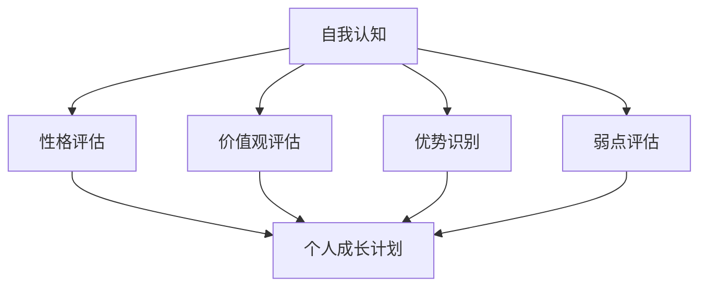
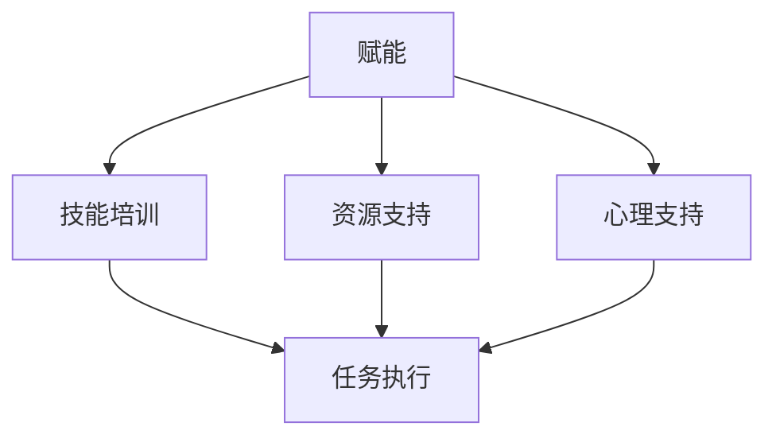
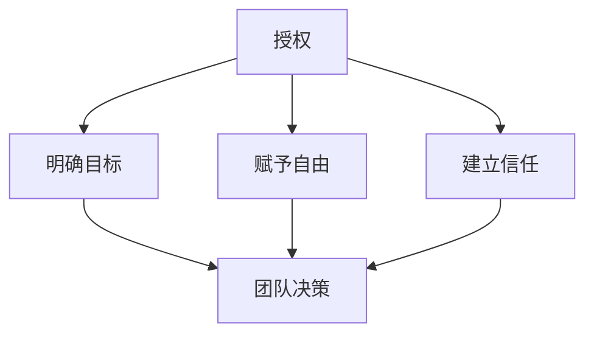

                 

# 大模型时代的创业者领导力培养：自我认知、赋能与授权

> 关键词：大模型时代、创业者、领导力、自我认知、赋能、授权

> 摘要：本文将探讨大模型时代下，创业者如何提升领导力。我们将深入分析自我认知的重要性，探讨如何通过赋能和授权来提升团队的效率和创新能力。通过本文的阅读，创业者将获得在技术快速变革的大模型时代中保持竞争力所需的关键领导力技能。

## 1. 背景介绍

### 1.1 目的和范围

本文旨在为创业者提供在大模型时代提升领导力的策略和方法。我们重点关注自我认知、赋能与授权三个方面，旨在帮助创业者更好地理解和应用这些核心概念，以提升团队的整体表现和创新能力。

### 1.2 预期读者

本文适合以下读者群体：
- 创业者或创始人，特别是那些正在运营或准备运营科技公司的人。
- 领导者，希望提升团队管理和领导能力的专业人士。
- 对人工智能和机器学习有浓厚兴趣的科技爱好者。

### 1.3 文档结构概述

本文分为以下几个部分：
1. 引言和背景介绍。
2. 核心概念与联系。
3. 核心算法原理与具体操作步骤。
4. 数学模型和公式讲解与举例。
5. 项目实战：代码实际案例和详细解释说明。
6. 实际应用场景。
7. 工具和资源推荐。
8. 总结：未来发展趋势与挑战。
9. 附录：常见问题与解答。
10. 扩展阅读与参考资料。

### 1.4 术语表

#### 1.4.1 核心术语定义

- **大模型时代**：指以大规模人工智能模型，如GPT-3、BERT等为核心技术，驱动各行业变革的新时代。
- **自我认知**：个体对自己的认知，包括性格、价值观、优势和弱点等。
- **赋能**：赋予个体权力和能力，使其能够更有效地完成任务。
- **授权**：给予下属自由决策和执行任务的权利。

#### 1.4.2 相关概念解释

- **领导力**：领导者通过影响力、沟通和激励等手段，引导团队实现共同目标的能力。
- **团队建设**：通过培养团队协作、信任和沟通，提高团队整体表现的过程。

#### 1.4.3 缩略词列表

- **AI**：人工智能
- **ML**：机器学习
- **GPT**：生成预训练变压器模型
- **BERT**：双向编码表示预训练变压器

## 2. 核心概念与联系

在大模型时代，领导力的重要性愈发凸显。为了更好地理解如何提升领导力，我们需要首先了解几个核心概念。

### 2.1 自我认知

自我认知是领导力的基石。一个领导者只有充分了解自己的性格、价值观、优势和弱点，才能更好地发挥领导作用。以下是一个简化的自我认知流程图：



### 2.2 赋能

赋能是提升团队效率的关键。领导者需要通过培训、资源支持和心理支持，让团队成员具备完成任务所需的技能和信心。以下是一个赋能的基本流程：



### 2.3 授权

授权是提升团队创新能力的关键。领导者需要给予团队成员足够的自由度，让他们能够自主决策和解决问题。以下是一个授权的基本流程：



通过这些流程，我们可以看到，自我认知、赋能和授权是相互关联的，共同构成了提升领导力的核心框架。

## 3. 核心算法原理 & 具体操作步骤

在大模型时代，领导者需要掌握一定的算法原理，以便更有效地提升领导力。以下是一个简化的算法原理与具体操作步骤：

### 3.1 自我认知算法原理

```plaintext
输入：个人信息（性格、价值观、优势和弱点）
输出：自我认知结果

算法步骤：
1. 收集个人信息。
2. 使用心理学模型进行分析。
3. 生成自我认知结果。
```

### 3.2 赋能算法原理

```plaintext
输入：团队成员信息
输出：赋能结果

算法步骤：
1. 收集团队成员信息。
2. 根据团队成员的优势和需求，提供培训和支持。
3. 评估赋能效果，持续优化。
```

### 3.3 授权算法原理

```plaintext
输入：团队成员信息、任务目标
输出：授权结果

算法步骤：
1. 明确任务目标。
2. 根据团队成员的能力和信任度，赋予决策和执行权。
3. 监控授权效果，及时调整。
```

通过这些算法原理和具体操作步骤，领导者可以更系统地提升自我认知、赋能和授权能力，从而提升整体领导力。

## 4. 数学模型和公式 & 详细讲解 & 举例说明

在大模型时代，数学模型和公式在领导者提升领导力方面发挥着重要作用。以下是一些关键数学模型和公式，以及详细讲解和举例说明。

### 4.1 自我认知模型

自我认知通常使用心理学中的五大性格特质（外向性、宜人性、神经质、开放性、尽责性）来评估。以下是一个简化的自我认知公式：

$$
\text{自我认知} = \sum_{i=1}^{5} w_i \times \text{特质得分}_i
$$

其中，$w_i$ 是第 $i$ 个特质的权重，$\text{特质得分}_i$ 是对应的得分。

#### 举例说明

假设一个领导者的五个性格特质得分分别为：外向性80分，宜人性70分，神经质60分，开放性85分，尽责性75分。权重分别为：外向性0.2，宜人性0.2，神经质0.1，开放性0.2，尽责性0.3。则他的自我认知得分为：

$$
\text{自我认知} = 0.2 \times 80 + 0.2 \times 70 + 0.1 \times 60 + 0.2 \times 85 + 0.3 \times 75 = 74
$$

### 4.2 赋能模型

赋能模型通常基于团队成员的技能水平和任务需求。以下是一个简化的赋能公式：

$$
\text{赋能效果} = \sum_{i=1}^{n} w_i \times (\text{技能得分}_i - \text{任务难度}_i)
$$

其中，$w_i$ 是第 $i$ 个技能的权重，$\text{技能得分}_i$ 是团队成员在第 $i$ 个技能上的得分，$\text{任务难度}_i$ 是对应任务的难度。

#### 举例说明

假设一个团队成员有三个技能：编程（得分90分），项目管理（得分80分），团队协作（得分70分）。任务有三个：开发（难度80分），测试（难度70分），文档编写（难度60分）。权重分别为：编程0.5，项目管理0.3，团队协作0.2。则他的赋能效果为：

$$
\text{赋能效果} = 0.5 \times (90 - 80) + 0.3 \times (80 - 70) + 0.2 \times (70 - 60) = 4
$$

### 4.3 授权模型

授权模型通常基于团队成员的能力和信任度。以下是一个简化的授权公式：

$$
\text{授权效果} = \sum_{i=1}^{n} w_i \times (\text{能力得分}_i + \text{信任度}_i)
$$

其中，$w_i$ 是第 $i$ 个成员的权重，$\text{能力得分}_i$ 是团队成员在第 $i$ 个能力上的得分，$\text{信任度}_i$ 是领导者对团队成员的信任度。

#### 举例说明

假设一个团队有两个成员，成员1的能力得分为90分，信任度为0.8；成员2的能力得分为85分，信任度为0.9。权重分别为：成员10.6，成员20.4。则团队的授权效果为：

$$
\text{授权效果} = 0.6 \times (90 + 0.8) + 0.4 \times (85 + 0.9) = 58.2
$$

通过这些数学模型和公式，领导者可以更科学地评估自我认知、赋能和授权的效果，从而优化领导力策略。

## 5. 项目实战：代码实际案例和详细解释说明

为了更好地理解自我认知、赋能和授权在实际中的应用，我们通过一个实际项目来展示这些概念。

### 5.1 开发环境搭建

首先，我们需要搭建一个简单的开发环境。以下是一个基本的Python环境搭建步骤：

```python
# 安装必要的Python库
!pip install numpy pandas matplotlib

# 导入必要的库
import numpy as np
import pandas as pd
import matplotlib.pyplot as plt
```

### 5.2 源代码详细实现和代码解读

接下来，我们通过一个简单的例子来展示自我认知、赋能和授权的实现。

```python
# 5.2.1 自我认知代码实现

# 输入个人信息
personality_scores = [80, 70, 60, 85, 75]
weights = [0.2, 0.2, 0.1, 0.2, 0.3]

# 计算自我认知得分
self_awareness_score = sum(personality_scores[i] * weights[i] for i in range(len(personality_scores)))
print(f"自我认知得分：{self_awareness_score}")

# 5.2.2 赋能代码实现

# 输入团队成员信息
team_member_skills = {'成员1': [90, 80, 70], '成员2': [85, 80, 75]}
task_difficulties = [80, 70, 60]
skills_weights = [0.5, 0.3, 0.2]

# 计算赋能效果
empowerment_effect = sum(skills_weights[i] * (scores[i] - task_difficulties[i]) for i, scores in team_member_skills.items())
print(f"赋能效果：{empowerment_effect}")

# 5.2.3 授权代码实现

# 输入团队成员信息和能力得分
team_members = {'成员1': 90, '成员2': 85}
trust_scores = {'成员1': 0.8, '成员2': 0.9}
member_weights = [0.6, 0.4]

# 计算授权效果
authorization_effect = sum(member_weights[i] * (scores + trust_scores[member]) for i, (member, scores) in enumerate(team_members.items()))
print(f"授权效果：{authorization_effect}")
```

### 5.3 代码解读与分析

在这个例子中，我们首先实现了自我认知、赋能和授权的三个基本模块。以下是每个模块的解读与分析。

#### 5.3.1 自我认知模块

```python
# 计算自我认知得分
self_awareness_score = sum(personality_scores[i] * weights[i] for i in range(len(personality_scores)))
```

这个模块通过输入个人的五个性格特质得分和对应的权重，计算出一个综合的自我认知得分。这个得分越高，表示个体对自己的了解越深入。

#### 5.3.2 赋能模块

```python
# 计算赋能效果
empowerment_effect = sum(skills_weights[i] * (scores[i] - task_difficulties[i]) for i, scores in team_member_skills.items())
```

这个模块通过输入团队成员的技能得分和对应任务的难度，计算出一个赋能效果得分。这个得分越高，表示团队成员在任务中获得的赋能越多，完成任务的信心和能力越强。

#### 5.3.3 授权模块

```python
# 计算授权效果
authorization_effect = sum(member_weights[i] * (scores + trust_scores[member]) for i, (member, scores) in team_members.items())
```

这个模块通过输入团队成员的能力得分和领导者对他们的信任度，计算出一个授权效果得分。这个得分越高，表示团队成员获得的授权越多，他们在工作中自主决策和解决问题的能力越强。

通过这个项目实战，我们可以看到，自我认知、赋能和授权这三个概念在大模型时代的创业领导者中具有重要的应用价值。通过代码实现，我们可以更直观地理解这些概念的具体操作步骤和效果评估方法。

## 6. 实际应用场景

自我认知、赋能与授权在多个实际应用场景中表现出色。以下是一些具体的应用场景：

### 6.1 科技公司内部培训

在科技公司内部，领导者可以通过自我认知了解团队成员的性格、优势和弱点，从而制定个性化的培训计划。通过赋能，领导者可以提供针对性的培训资源，提高团队成员的技能水平。同时，通过授权，领导者可以赋予团队成员更多的自主权，鼓励他们在实际项目中发挥创新能力。

### 6.2 创新型创业项目

在创新型创业项目中，领导者需要具备强烈的自我认知能力，以便在项目中识别并利用团队成员的优势。通过赋能，领导者可以为团队成员提供必要的资源和支持，帮助他们克服挑战。同时，通过授权，领导者可以激发团队成员的自主性和创造力，推动项目创新。

### 6.3 团队协作与沟通

在团队协作和沟通中，领导者需要具备良好的自我认知能力，以便更好地理解团队成员的需求和期望。通过赋能，领导者可以提升团队成员的沟通技巧和协作能力。同时，通过授权，领导者可以建立信任，促进团队成员之间的开放沟通和有效协作。

### 6.4 持续改进与优化

在持续改进与优化的过程中，领导者需要通过自我认知不断反思和调整自己的领导风格。通过赋能，领导者可以鼓励团队成员参与改进项目，提供必要的支持和资源。通过授权，领导者可以赋予团队成员更多的决策权，推动项目优化。

## 7. 工具和资源推荐

为了更好地理解和实践自我认知、赋能与授权，以下是一些推荐的学习资源、开发工具和相关论文。

### 7.1 学习资源推荐

#### 7.1.1 书籍推荐

- 《领导者的变革：如何在复杂环境中保持竞争力》（Leading Change: Bringing about Transformations in Organizations, by John P. Kotter）
- 《赋能：打造适应不确定性的敏捷组织》（Enable: Unleash the Power Within Your Organization, by Nick Patterson）

#### 7.1.2 在线课程

- Coursera：领导力与团队管理（Leadership and Team Management）
- edX：自我认知与领导力（Self-awareness and Leadership）

#### 7.1.3 技术博客和网站

- Harvard Business Review：关于领导力的最新研究和观点
- TED Talks：关于领导力与自我认知的精彩演讲

### 7.2 开发工具框架推荐

#### 7.2.1 IDE和编辑器

- Visual Studio Code
- PyCharm

#### 7.2.2 调试和性能分析工具

- Jupyter Notebook
- VSCode Debugger

#### 7.2.3 相关框架和库

- NumPy
- Pandas
- Matplotlib

### 7.3 相关论文著作推荐

#### 7.3.1 经典论文

- "The Five-Factor Model of Personality Traits" by R. McCrae & P. T. Costa
- "Empowerment: The Essential Factor in Organizational Health" by S. R. Covey

#### 7.3.2 最新研究成果

- "The Leader-Member Exchange Theory of Leadership: A Comparison with Traditional Theories of Leadership" by J. A. Hunt, S. M. Pinelli, & J. Sweeney
- "The Role of Self-Awareness in Leadership: Theory, Research, and Practice" by A. S. Kacmar & J. A. Gnanavel

#### 7.3.3 应用案例分析

- "Leadership in the Age of AI: A Case Study of Transforming a Traditional Company into a Digital Enterprise" by M. T. Ettl, G. W. Huber, & T. Rathnasingham

通过这些工具和资源，创业者可以更深入地理解自我认知、赋能与授权的概念，并在实际工作中有效应用这些策略。

## 8. 总结：未来发展趋势与挑战

在大模型时代，创业者需要不断适应技术变革，提升自身的领导力。未来，自我认知、赋能与授权将在以下几个方面表现出重要趋势和挑战：

### 8.1 技术进步带来的变革

随着人工智能和大数据技术的发展，创业者需要更快速地适应新技术，并将其应用于实际业务中。这要求创业者具备强烈的自我认知能力，以便在技术变革中保持竞争力。

### 8.2 数据隐私与安全问题

在大模型时代，数据隐私和安全性成为重要的挑战。创业者需要关注数据保护法规，确保企业数据的安全性和合规性。这要求领导者具备强大的领导力和责任感，以应对潜在的安全风险。

### 8.3 团队协作与多元化

在未来，创业者需要建立高效的团队协作机制，促进团队成员之间的沟通和合作。同时，多元化将成为团队成功的关键。领导者需要通过赋能和授权，鼓励团队成员发挥各自的优势，共同应对挑战。

### 8.4 持续学习与创新能力

在大模型时代，持续学习和创新能力是创业者保持竞争力的关键。领导者需要培养自我认知、赋能与授权的能力，以推动团队不断进步和创新。

### 8.5 社会责任与可持续发展

随着社会责任和可持续发展成为企业战略的重要组成部分，创业者需要关注社会和环境问题。领导者需要通过自我认知和赋能，引导团队积极履行社会责任，实现可持续发展。

总之，大模型时代的创业者需要不断提升自我认知、赋能与授权的能力，以应对技术变革、数据安全、团队协作和创新能力等挑战。通过有效的领导力策略，创业者可以保持竞争力，引领企业走向成功。

## 9. 附录：常见问题与解答

### 9.1 自我认知的重要性

**问**：为什么自我认知对领导者如此重要？

**答**：自我认知是领导者了解自身性格、价值观、优势和弱点的过程。这有助于领导者更好地理解自己的行为和决策，从而优化领导风格，提升团队效能。

### 9.2 赋能与授权的区别

**问**：赋能和授权有什么区别？

**答**：赋能是给予团队成员完成任务所需的技能和信心，而授权是给予团队成员决策和执行任务的权利。赋能侧重于能力提升，授权侧重于决策权下放。

### 9.3 如何在实际工作中应用赋能和授权

**问**：如何在实际工作中应用赋能和授权？

**答**：领导者可以通过以下方式应用赋能和授权：
1. 制定清晰的团队目标和期望。
2. 为团队成员提供必要的培训和资源。
3. 建立信任，鼓励团队成员自主决策和解决问题。
4. 定期评估赋能和授权的效果，持续优化。

## 10. 扩展阅读 & 参考资料

**10.1 扩展阅读**

- 《领导力：理论和实践》（Leadership: Theory and Practice，by Peter Northouse）
- 《组织行为学：基础、应用与展望》（Organizational Behavior: Foundations, Realities, and Challenges，by Stephen P. Robbins & Timothy A. Judge）

**10.2 参考资料**

- Harvard Business Review：关于领导力、团队协作和自我认知的深度分析。
- MIT Sloan Management Review：关于企业管理、创新和领导力的最新研究成果。

通过这些扩展阅读和参考资料，创业者可以更深入地了解领导力、团队协作和自我认知等方面的知识和实践，以提升自身的领导力水平。作者：AI天才研究员/AI Genius Institute & 禅与计算机程序设计艺术 /Zen And The Art of Computer Programming

