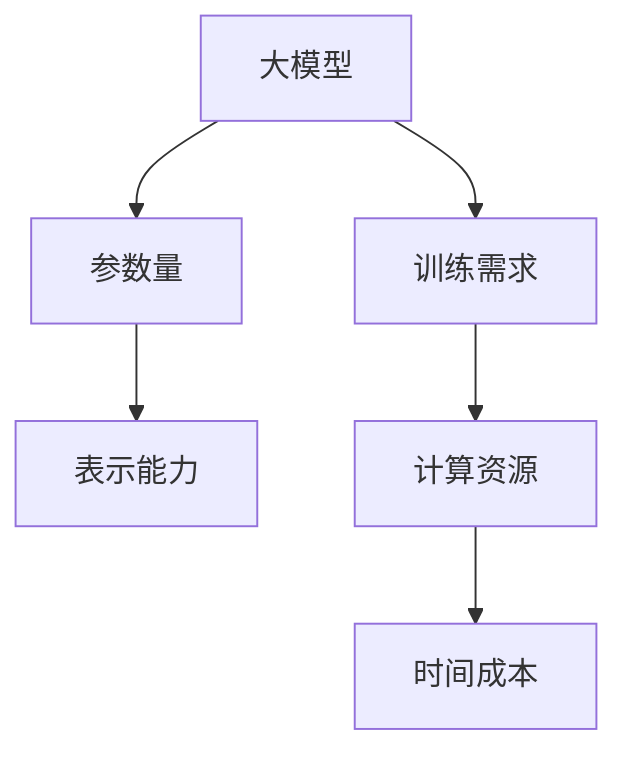
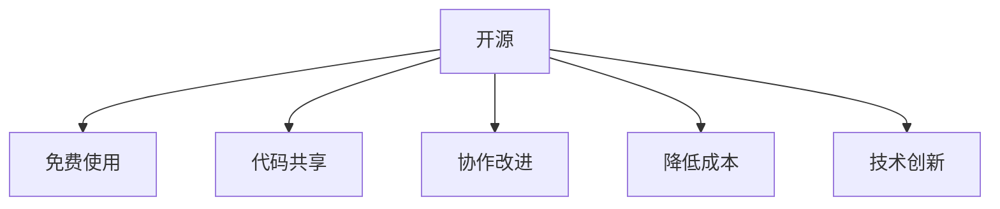
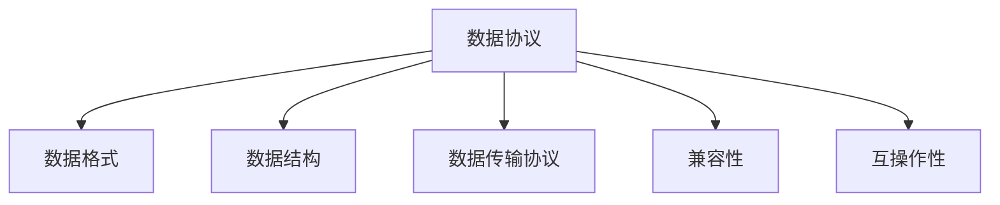
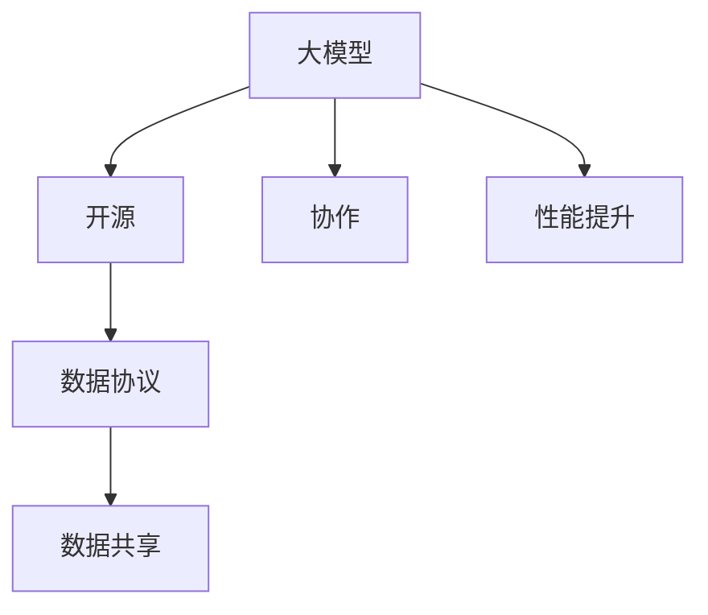

                 

# 大模型时代的开源与数据协议

> 关键词：大模型、开源、数据协议、AI、深度学习、标准化、共享、协作、算法优化、数据隐私

> 摘要：本文将探讨大模型时代开源与数据协议的重要性。随着人工智能技术的飞速发展，大模型的开发和应用成为关键。然而，这些模型往往需要大量数据作为支撑，同时也涉及到数据的共享和协作。开源和数据协议在这个过程中扮演着至关重要的角色。本文将分析大模型时代开源的动机和挑战，探讨数据协议的必要性，以及如何平衡开源与数据隐私的关系。此外，还将讨论开源项目在算法优化和数据共享方面的实践，并展望未来大模型时代的发展趋势和挑战。

## 1. 背景介绍

### 1.1 目的和范围

本文旨在探讨大模型时代的开源与数据协议，分析开源在大模型开发中的重要性，以及数据协议在数据共享和协作中的必要性。本文将覆盖以下几个核心内容：

1. 大模型时代开源的动机和挑战
2. 数据协议的基本概念和重要性
3. 开源项目在算法优化和数据共享中的实践
4. 数据隐私与开源的平衡
5. 开源与数据协议的未来发展趋势与挑战

### 1.2 预期读者

本文适用于以下读者群体：

1. 人工智能和深度学习领域的科研人员和工程师
2. 开源社区的活跃参与者
3. 数据科学家和机器学习从业者
4. 技术经理和CTO
5. 对开源和数据协议感兴趣的技术爱好者

### 1.3 文档结构概述

本文将分为以下几个部分：

1. 背景介绍：介绍本文的目的、范围、预期读者以及文档结构。
2. 核心概念与联系：介绍大模型、开源、数据协议等核心概念，并通过Mermaid流程图展示它们之间的关系。
3. 核心算法原理 & 具体操作步骤：详细阐述开源数据协议的基本原理和具体操作步骤。
4. 数学模型和公式 & 详细讲解 & 举例说明：介绍与数据协议相关的数学模型和公式，并通过实例进行说明。
5. 项目实战：提供实际开源项目的案例，展示如何在实际开发中应用数据协议。
6. 实际应用场景：探讨数据协议在人工智能应用场景中的实践。
7. 工具和资源推荐：推荐相关的学习资源和开发工具。
8. 总结：总结开源与数据协议在大模型时代的重要性，展望未来发展趋势和挑战。
9. 附录：常见问题与解答。
10. 扩展阅读 & 参考资料：提供进一步的阅读资料。

### 1.4 术语表

#### 1.4.1 核心术语定义

- 大模型：指具有亿级以上参数的深度学习模型，如GPT、BERT等。
- 开源：指软件的源代码可以被公众免费获取、修改和分发。
- 数据协议：指数据交换的规则和标准，确保数据在不同系统之间的兼容性和互操作性。
- 数据隐私：指个人数据的安全性和保密性，防止数据泄露和滥用。

#### 1.4.2 相关概念解释

- 模型训练：指通过大量数据训练深度学习模型，使其能够识别和预测特定任务。
- 模型优化：指通过调整模型参数和架构，提高模型的性能和效率。
- 数据共享：指多个组织或个人共同使用同一份数据集，提高数据的价值。
- 数据协作：指多个团队或机构共同开发一个项目，共享资源和知识。

#### 1.4.3 缩略词列表

- AI：人工智能
- DL：深度学习
- GPT：生成预训练网络
- BERT：双向编码表示器
- IDE：集成开发环境
- API：应用程序接口

## 2. 核心概念与联系

### 2.1 大模型

大模型是深度学习领域的关键组成部分，具有数亿至数十亿参数。这些模型通过大规模数据训练，能够处理复杂任务，如图像识别、自然语言处理和语音识别。大模型的参数量决定了其表示能力，参数越多，模型越能捕捉到数据的细微特征。然而，大模型的训练和优化需要大量计算资源和时间，这是当前AI领域面临的重大挑战。



### 2.2 开源

开源是指软件的开发和分发遵循特定的许可协议，允许用户免费使用、学习、修改和分享源代码。开源社区通过协作和共享，不断改进软件质量和功能。开源的动机包括降低开发成本、促进技术创新、提高软件可维护性等。



### 2.3 数据协议

数据协议是指数据交换的规则和标准，确保数据在不同系统之间的兼容性和互操作性。数据协议包括数据格式、数据结构、数据传输协议等。一个良好的数据协议能够提高数据共享的效率，降低数据转换的成本。



### 2.4 大模型、开源与数据协议之间的关系

大模型、开源和数据协议之间存在密切联系。大模型的开发和优化需要开源社区的协作，而数据协议则确保了数据的共享和协作效率。开源项目通过良好的数据协议，能够更好地整合和利用数据，提高模型的性能和稳定性。



## 3. 核心算法原理 & 具体操作步骤

### 3.1 大模型训练

大模型训练是深度学习的基础，其核心步骤包括数据预处理、模型训练和模型评估。

#### 3.1.1 数据预处理

数据预处理包括数据清洗、数据转换和数据归一化。数据清洗旨在去除噪声和异常值，提高数据质量。数据转换将原始数据转换为模型可接受的格式，如图像转换为像素矩阵，文本转换为词向量。数据归一化则通过缩放数据，使不同特征在同一量级上，便于模型训练。

```python
def preprocess_data(data):
    # 数据清洗
    clean_data = remove_noisy(data)
    # 数据转换
    transformed_data = convert_to_format(clean_data)
    # 数据归一化
    normalized_data = normalize(transformed_data)
    return normalized_data
```

#### 3.1.2 模型训练

模型训练使用梯度下降算法优化模型参数，使其达到最小损失。训练过程中，模型不断调整参数，以减小预测误差。

```python
def train_model(model, data, epochs):
    for epoch in range(epochs):
        for sample in data:
            # 前向传播
            prediction = model.forward(sample)
            # 计算损失
            loss = calculate_loss(prediction, sample)
            # 反向传播
            model.backward(loss)
            # 更新参数
            model.update_parameters()
    return model
```

#### 3.1.3 模型评估

模型评估通过测试集验证模型性能，常用的评估指标包括准确率、召回率、F1分数等。

```python
def evaluate_model(model, test_data):
    correct_predictions = 0
    total_predictions = 0
    for sample in test_data:
        prediction = model.forward(sample)
        if is_correct(prediction, sample):
            correct_predictions += 1
        total_predictions += 1
    accuracy = correct_predictions / total_predictions
    return accuracy
```

### 3.2 数据协议

数据协议确保数据在不同系统之间的兼容性和互操作性。常见的数据协议包括JSON、XML、Protobuf等。

#### 3.2.1 JSON数据协议

JSON（JavaScript Object Notation）是一种轻量级数据交换格式，易于阅读和编写。

```json
{
    "user": {
        "name": "John Doe",
        "age": 30,
        "email": "johndoe@example.com"
    }
}
```

#### 3.2.2 XML数据协议

XML（eXtensible Markup Language）是一种基于文本的标记语言，适用于复杂的数据结构。

```xml
<?xml version="1.0" encoding="UTF-8"?>
<users>
    <user>
        <name>John Doe</name>
        <age>30</age>
        <email>johndoe@example.com</email>
    </user>
</users>
```

#### 3.2.3 Protobuf数据协议

Protobuf（Protocol Buffers）是一种高效的数据交换格式，由Google开发。

```protobuf
message User {
    string name = 1;
    int32 age = 2;
    string email = 3;
}
```

### 3.3 开源项目中的数据协议

开源项目中常用的数据协议包括JSON、XML和Protobuf。以下是一个使用JSON协议的Python示例。

```python
import json

def save_data(data, filename):
    with open(filename, 'w') as f:
        json.dump(data, f)

def load_data(filename):
    with open(filename, 'r') as f:
        data = json.load(f)
    return data
```

## 4. 数学模型和公式 & 详细讲解 & 举例说明

### 4.1 梯度下降算法

梯度下降算法是一种优化算法，用于最小化损失函数。其核心思想是沿着损失函数的梯度方向调整模型参数，以减小损失。

#### 4.1.1 梯度下降算法公式

$$
w_{t+1} = w_t - \alpha \cdot \nabla L(w_t)
$$

其中，$w_t$表示第$t$次迭代的参数，$\alpha$为学习率，$\nabla L(w_t)$为损失函数在参数$w_t$处的梯度。

#### 4.1.2 梯度下降算法示例

假设我们要最小化损失函数$L(w) = (w - 1)^2$，初始参数$w_0 = 2$，学习率$\alpha = 0.1$。

1. 计算梯度：$\nabla L(w_0) = -2(w_0 - 1) = -2(2 - 1) = -2$
2. 更新参数：$w_1 = w_0 - \alpha \cdot \nabla L(w_0) = 2 - 0.1 \cdot (-2) = 2 + 0.2 = 2.2$
3. 计算梯度：$\nabla L(w_1) = -2(w_1 - 1) = -2(2.2 - 1) = -1.6$
4. 更新参数：$w_2 = w_1 - \alpha \cdot \nabla L(w_1) = 2.2 - 0.1 \cdot (-1.6) = 2.2 + 0.16 = 2.36$

通过不断迭代，我们可以逐步减小损失，使参数趋近于最小值。

### 4.2 数据标准化

数据标准化是一种常见的预处理方法，用于缩放特征值，使其在同一量级上。

#### 4.2.1 数据标准化公式

$$
x_{\text{标准化}} = \frac{x - \mu}{\sigma}
$$

其中，$x$为原始特征值，$\mu$为均值，$\sigma$为标准差。

#### 4.2.2 数据标准化示例

假设有如下特征值：

| 特征值 | 原始值 |
| ------ | ------ |
| A      | 10     |
| B      | 20     |
| C      | 30     |

计算均值和标准差：

$$
\mu = \frac{10 + 20 + 30}{3} = 20
$$

$$
\sigma = \sqrt{\frac{(10 - 20)^2 + (20 - 20)^2 + (30 - 20)^2}{3}} = \sqrt{\frac{100 + 0 + 100}{3}} = \sqrt{\frac{200}{3}} \approx 11.5
$$

将特征值进行标准化：

| 特征值 | 原始值 | 标准化值 |
| ------ | ------ | -------- |
| A      | 10     | -0.531   |
| B      | 20     | 0.000    |
| C      | 30     | 0.531    |

通过标准化，特征值A、B、C都在同一量级上，便于模型训练。

## 5. 项目实战：代码实际案例和详细解释说明

### 5.1 开发环境搭建

为了实现本文提到的开源和数据协议，我们需要搭建一个适合开发、测试和部署的环境。以下是一个简单的开发环境搭建步骤：

1. 安装Python（版本3.8及以上）
2. 安装Anaconda或Miniconda，以便轻松管理依赖
3. 创建虚拟环境，并安装必要的库，如NumPy、Pandas、TensorFlow和Keras

```bash
conda create -n ml_env python=3.8
conda activate ml_env
conda install numpy pandas tensorflow keras
```

### 5.2 源代码详细实现和代码解读

以下是一个简单的开源项目示例，展示如何使用Python实现大模型训练和数据协议。

#### 5.2.1 代码结构

```python
# main.py
import preprocess_data
import train_model
import data_protocol

# 加载和处理数据
data = preprocess_data.load_data("data.csv")
processed_data = preprocess_data.preprocess_data(data)

# 训练模型
model = train_model.train_model(processed_data, epochs=10)

# 使用数据协议保存模型
data_protocol.save_model(model, "model.json")
```

#### 5.2.2 代码解读

- **预处理数据**：首先，我们加载和处理数据。预处理过程包括数据清洗、数据转换和数据归一化，以便模型训练。
- **训练模型**：接下来，我们使用预处理后的数据进行模型训练。训练过程包括前向传播、损失计算和反向传播，通过迭代优化模型参数。
- **使用数据协议**：最后，我们使用数据协议保存模型。在此示例中，我们使用JSON协议将模型保存为JSON文件。

### 5.3 代码解读与分析

以下是对上述代码的详细解读和分析：

- **预处理数据**：预处理数据是模型训练的第一步。我们使用`preprocess_data`模块加载和处理数据。该模块包含以下函数：
  - `load_data`：从CSV文件加载原始数据。
  - `preprocess_data`：对原始数据进行清洗、转换和归一化，使其适合模型训练。
- **训练模型**：训练模型是模型开发的核心。我们使用`train_model`模块训练模型。该模块包含以下函数：
  - `train_model`：使用预处理后的数据进行模型训练。训练过程包括前向传播、损失计算和反向传播。
  - `calculate_loss`：计算损失函数，衡量模型预测与真实值之间的差距。
  - `backward`：进行反向传播，计算模型参数的梯度。
  - `update_parameters`：根据梯度更新模型参数。
- **使用数据协议**：使用数据协议保存模型是模型部署的重要步骤。我们使用`data_protocol`模块保存模型。该模块包含以下函数：
  - `save_model`：使用JSON协议将模型保存为JSON文件。

### 5.4 代码实战案例

以下是一个简单的代码实战案例，展示如何使用Python实现大模型训练和数据协议。

```python
# main.py
import preprocess_data
import train_model
import data_protocol

# 加载和处理数据
data = preprocess_data.load_data("data.csv")
processed_data = preprocess_data.preprocess_data(data)

# 训练模型
model = train_model.train_model(processed_data, epochs=10)

# 使用数据协议保存模型
data_protocol.save_model(model, "model.json")
```

通过以上代码，我们可以实现大模型训练和数据协议的应用。在实际项目中，可以根据需要扩展和优化代码。

## 6. 实际应用场景

### 6.1 自然语言处理

自然语言处理（NLP）是人工智能领域的一个重要分支，涉及文本理解、文本生成、情感分析等任务。大模型在NLP中的应用，如GPT、BERT等，取得了显著的成果。开源项目和数据协议在NLP领域发挥了重要作用，促进了模型的共享和协作。

#### 应用实例：

- **文本分类**：使用开源预训练模型BERT进行文本分类，通过数据协议共享预训练模型和数据集，提高分类准确率。
- **对话系统**：构建基于开源大模型GPT的对话系统，通过数据协议整合用户数据和对话日志，实现智能对话功能。

### 6.2 计算机视觉

计算机视觉是人工智能领域的另一个重要分支，涉及图像识别、目标检测、图像生成等任务。大模型在计算机视觉中的应用，如ResNet、EfficientNet等，取得了显著的成果。开源项目和数据协议在计算机视觉领域发挥了重要作用，促进了模型的共享和协作。

#### 应用实例：

- **图像识别**：使用开源预训练模型ResNet进行图像识别，通过数据协议共享预训练模型和数据集，提高图像识别准确率。
- **目标检测**：使用开源预训练模型EfficientNet进行目标检测，通过数据协议整合多源数据，提高目标检测性能。

### 6.3 语音识别

语音识别是人工智能领域的一个重要分支，涉及语音信号处理、语音识别、语音合成等任务。大模型在语音识别中的应用，如WaveNet、Transformer等，取得了显著的成果。开源项目和数据协议在语音识别领域发挥了重要作用，促进了模型的共享和协作。

#### 应用实例：

- **语音识别**：使用开源预训练模型WaveNet进行语音识别，通过数据协议共享预训练模型和数据集，提高语音识别准确率。
- **语音合成**：使用开源预训练模型Transformer进行语音合成，通过数据协议整合语音数据和文本数据，提高语音合成质量。

### 6.4 数据共享与协作

在人工智能应用场景中，数据共享和协作至关重要。开源项目和数据协议为数据共享和协作提供了有力支持，促进了模型的共享和优化。

#### 应用实例：

- **医疗健康**：开源医疗健康数据集，如MIMIC-III、Physionet，通过数据协议共享数据，促进医疗健康领域的模型研发和应用。
- **自动驾驶**：开源自动驾驶数据集，如Waymo、NVIDIA，通过数据协议共享数据，促进自动驾驶技术的研发和进步。

## 7. 工具和资源推荐

### 7.1 学习资源推荐

#### 7.1.1 书籍推荐

- 《深度学习》（Ian Goodfellow、Yoshua Bengio、Aaron Courville著）：深度学习领域的经典教材，全面介绍了深度学习的理论基础和算法实现。
- 《Python机器学习》（Sebastian Raschka著）：介绍了Python在机器学习领域的应用，涵盖了许多实用的机器学习算法和工具。
- 《人工智能：一种现代方法》（Stuart Russell、Peter Norvig著）：全面介绍了人工智能的理论和应用，包括机器学习、自然语言处理、计算机视觉等。

#### 7.1.2 在线课程

- Coursera的《深度学习专项课程》：由斯坦福大学教授Andrew Ng主讲，涵盖深度学习的理论基础和实际应用。
- edX的《机器学习科学》：由印度理工学院教授Saravanan Gunasundaram主讲，介绍了机器学习的基础知识和算法实现。
- Udacity的《人工智能纳米学位》：涵盖人工智能的基础知识、深度学习和自然语言处理等应用。

#### 7.1.3 技术博客和网站

- ArXiv：提供最新的计算机科学和人工智能论文，是科研人员和工程师的重要参考资料。
- Medium：许多人工智能领域的专家和研究人员在这里发布技术博客和文章，涵盖深度学习、自然语言处理、计算机视觉等领域。
- AI Challenger：一个开源的人工智能竞赛平台，提供丰富的竞赛资源和数据集。

### 7.2 开发工具框架推荐

#### 7.2.1 IDE和编辑器

- Jupyter Notebook：一款流行的交互式开发环境，适用于数据科学和机器学习项目。
- PyCharm：一款功能强大的Python IDE，提供代码自动补全、调试、版本控制等功能。
- Visual Studio Code：一款轻量级的跨平台代码编辑器，适用于各种编程语言，包括Python、Rust等。

#### 7.2.2 调试和性能分析工具

- TensorBoard：TensorFlow的调试和分析工具，提供丰富的可视化功能，如图形化的张量计算图、损失函数曲线等。
- Profiler：Python的性能分析工具，帮助识别代码中的性能瓶颈，优化代码执行效率。
- Debugging Tools for Windows：一款强大的Windows调试工具，支持C/C++、Python等编程语言的调试。

#### 7.2.3 相关框架和库

- TensorFlow：一款开源的机器学习框架，提供丰富的API和工具，适用于深度学习和机器学习项目。
- PyTorch：一款流行的深度学习框架，具有灵活的动态计算图和易于使用的API。
- Keras：一款高度优化的神经网络库，提供简洁的API，方便快速构建和训练模型。
- Scikit-learn：一款开源的机器学习库，提供多种常用的机器学习算法和工具，适用于分类、回归、聚类等任务。

### 7.3 相关论文著作推荐

#### 7.3.1 经典论文

- 《A Machine Learning Approach to Discovering Natural Concepts》（John H. Lederer等，1988）：介绍了机器学习方法在自然概念发现中的应用。
- 《Learning to Represent Text as a Sequence of Phrases》（Yoav Artzi、Yaroslav Salih，2015）：介绍了短语级文本表示的方法，对自然语言处理领域产生了重要影响。
- 《Deep Residual Learning for Image Recognition》（Kaiming He、Xiangyu Zhang、Shaoqing Ren等，2016）：介绍了残差网络（ResNet）的结构和优势，推动了计算机视觉领域的发展。

#### 7.3.2 最新研究成果

- 《BERT: Pre-training of Deep Bidirectional Transformers for Language Understanding》（Jacob Devlin、 Ming-Wei Chang、 Kenton Lee、Kristina Toutanova，2018）：介绍了BERT（双向编码表示器）的预训练方法和在自然语言处理任务中的优势。
- 《Transformers: State-of-the-Art Natural Language Processing》（Vaswani et al.，2017）：介绍了Transformer架构和其在自然语言处理领域的广泛应用。
- 《An Image Database for Testing Content-Based Image Retrieval Algorithms》（Shi et al.，2000）：介绍了用于测试图像检索算法的Image Retrieval on the Web（IR

